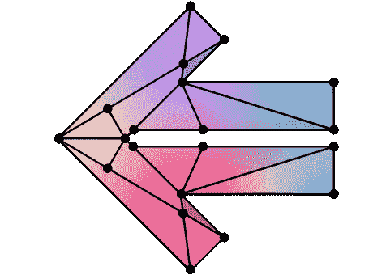
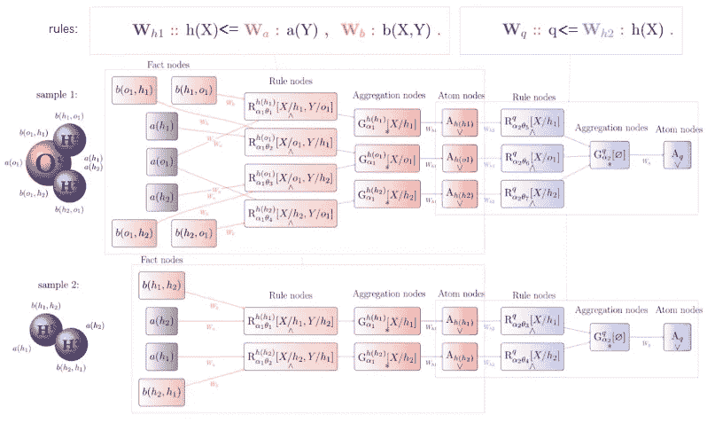
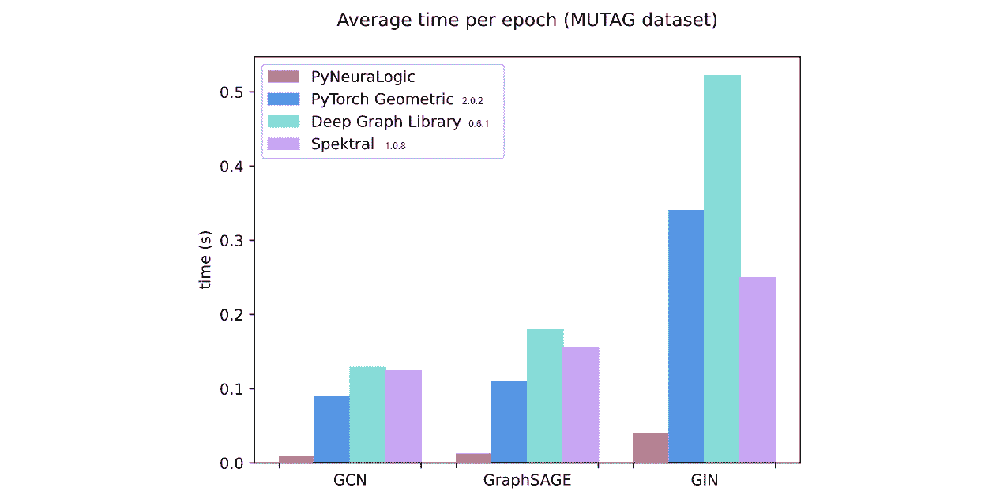

# 具有 PyNeuraLogic 的超越图神经网络

> 原文：<https://towardsdatascience.com/beyond-graph-neural-networks-with-pyneuralogic-c1e6502c46f7>

## 走向[深度关系学习](https://medium.com/tag/deep-relational-learning)

## *Python 中的可微分逻辑编程，用于 GNNs 向更复杂的深度关系模型的优雅编码和扩展*



PyNeuraLogic 允许您使用 Python 编写可微分的逻辑程序，以简单优雅的方式编码，例如各种 gnn 及其基本扩展。图片由来自[pyneuralogy](https://pyneuralogic.readthedocs.io)的 Lukas Zahradnik 提供。

在之前的文章中，我们讨论了[关系机器学习](https://medium.com/@sir.gustav/what-is-relational-machine-learning-afbe4a9c4231)的问题，如何在关系逻辑中自然地表达它，以及为什么它不能用标准的基于特征向量的模型(如经典的神经网络)来完全解决。然后，我们回顾了旨在将逻辑与神经网络相结合的[神经符号整合](https://medium.com/@sir.gustav/what-is-neural-symbolic-integration-d5c6267dfdb0)范式，简要回顾了它的历史，并指出主要挑战。最后，在上一篇文章的[中，我们讨论了结构化深度学习模型的最新进展，如图形神经网络(GNNs)，如何用关系逻辑优雅地解决。](https://medium.com/@sir.gustav/from-graph-to-deep-relational-machine-learning-f07a0dddda89)

在本文中，我们将在一个*实用* *框架*中演示这些原则，该框架名为 ***神经对话*** ，旨在将深度学习与(可微分)逻辑编程相融合。我们将展示您如何使用相应的 Python 库来轻松实现和扩展现有的 GNN 模型，使其具有更复杂和更通用的功能，利用这些功能，您将能够开始自己创建*新颖的深度关系学习* *架构*！

# 数据表示法

让我们从如何表示数据开始。NeuraLogic 中的数据样本以*加权关系逻辑*的表达格式存储(然而，为了方便起见，在基本情况下也有从普通张量格式的转换器)。正如在[之前的文章](https://medium.com/@sir.gustav/what-is-relational-machine-learning-afbe4a9c4231)中所讨论的，这是一个非常通用的形式主义，涵盖了所有种类的表示。因为我们将(再次)在这里使用众所周知的 GNNs 作为例子，所以让我们更仔细地看看相应的*图*数据格式的表示。

简单来说，在关系逻辑中，我们定义了 ***项*** 之间的 ***关系*** ，可以表示各种感兴趣的对象。那么一个图就是节点间二元边关系的集合。因此，给定一些节点`n1…nk`，我们可以写:

```
edge(n1,n3), edge(n2,n3), edge(n4,n5), …
```

请注意，这里的名称“edge”是任意的。我们可能会为图的二元关系想出任何名称，例如

```
next(n1,n2), next(n2,n3), ... *or*   parent(n4,n1), parent(n4,n2), …
```

例如，表示图(序列和树)的一些特殊情况。我们还可以在相同的节点之间引入多个不同的关系:

```
related(n1,n3), neighbor(n1,n3), closeby(n1,n3), …
```

诸如此类。注意，节点(项)的顺序表示(二元)关系是否对称，即这里的图是否是无向的。

*   这种对称性也可以隐式指定，例如使用规则
    `edge(Y,X) <= edge(X,Y)`，但稍后会详细介绍规则…

在 GNN 场景中，我们通常也将节点与一些属性或特性相关联。在分类属性的情况下，我们可以通过引入一元关系停留在清晰逻辑的领域，例如:

```
positive(n2), red(n1), …
```

对于数字特征，我们可以进一步将这种陈述与(张量)值相关联，例如

```
[0.725, -1.6, …, 1.0] features(n2), ...
```

诸如此类。同样，名称“features”在这里是任意的，多个不同的表示可以与每个节点相关联。

与许多 GNN 框架相比，将*边缘*与特性相关联是非常简单的:

```
[1.2, -0.6,…] edge(n1,n3), ...
```

## 超越图形表示的一瞥

虽然我们可以用这种方式表示任意的 GNN 数据，但是在神经程序库中没有任何东西会限制您使用图形格式。因此，您可以随心所欲地将多个节点与一条“边”(hypergraph)关联起来:

```
edge(n2,n3,n5,n4), ..., simplex(n2,n3,n4), complex(n1,n3,n5,n6)
```

或者创建全新的对象并将这些对象与新的关系和值相关联:

```
edge(n1,n2,e12), 0.9 covers(e12,n2), [0.8,1,…] in_graph(g1,e12), ...
```

诸如此类。

*   *提示:数据表示基本上是一个关系数据库，每个表的每一行都有一个可选的(张量)权重。*

然后，您可以将这些进一步组合成更复杂的表示(这样就可以用于促进更高级的推理过程，超越经典的基于边的消息传递方案)。

# 模型表示

用神经语言表示模型与标准的深度学习框架有更大的不同。与现有的*程序性*方法相反，直接在计算图形级别上操作张量表示，NeuraLogic 使用*声明性*逻辑编程来抽象模型的计算原理。

*   你肯定知道，比如 SQL，它也是一种声明性语言。

虽然这对于经典的张量计算深度学习问题来说可能有点多余，但在 [*关系* *学习*](https://medium.com/@sir.gustav/what-is-relational-machine-learning-afbe4a9c4231) 设置中，它变得非常优雅，展示了各种形式的 ***对称*** 。在这种情况下，使用 NeuraLogic 会产生更加紧凑和优雅的学习程序，直接表达每个模型的本质(例如 GNNs 中的局部置换不变性 w.r.t .节点和边)。

简而言之，所利用的*逻辑编程*范例是一种声明式编码方法，在该方法中，您声明您在 ***逻辑变量*** 之间的 ***关系*** ，对应于域的对象(用大写字母书写，以区别于*术语*)。例如，我们可以写

```
edge(X,Y)
```

描述图中任意一对节点(X 和 Y)之间的所有边的集合。这些可以进一步组合成 ***图案*** ，例如

```
edge(X,Y), edge(Y,Z), edge(Z,X)
```

在这样的图中表示三角形(三圈)。最后，这些模式可以用来形成驱动计算(推理)的所谓“规则”。例如，我们可以写

```
in_triangle(X) <= edge(X,Y), edge(Y,Z), edge(Z,X).
```

为出现在三角形中的每个节点导出(推断)新的属性“in_triangle”。

一组这样的规则然后形成所谓的*逻辑程序*，其执行等同于用规则执行逻辑推理。并且[神经对话](https://github.com/GustikS/NeuraLogic)框架然后使这个推理过程*可微分，*这又使它等价于深度(关系)学习中的正向传播。最后，通过将(可学习的)权重与规则相关联，这些程序可以被*参数化*，例如

```
W₀ in_triangle(X) <= W₁ edge(X,Y), W₂ edge(Y,Z), W₃ edge(Z,X).
```

*   *这样的规则然后可以直接用于形成，例如，各种子图/小图/基序/细胞 gnn 和类似的模型*

如果你不熟悉这个领域，这听起来可能有点太抽象了，让我们继续看上一篇文章中的基本 GNN 漫游示例，让事情有个基础。

## 神经语言学中的 GNNs 编码

从上一篇文章的[中，我们知道任何 GNN 模型的核心都有一个所谓的传播规则，用于在相邻节点之间传递和聚合“消息”。特别地，节点 X 的一些新表示(“新消息”)是通过聚集相邻节点 Y 的先前表示(“旧消息”)来计算的，即那些在 X 和 Y 之间具有“边”的表示。](https://medium.com/@sir.gustav/from-graph-to-deep-relational-machine-learning-f07a0dddda89)

```
new_message(X) <= old_message(Y), edge(X,Y).
```

> 这，在神经语言学中，就是 ***实际代号*** ！它简单地读作:“要计算任何对象 X 的‘new _ message’属性值，取一些其他对象 Y 的‘old _ message’属性值，其中两者之间存在关系‘edge’。”

这个简单的语句编码了经典 GNN 的计算原理。最后，为了实际*学习*一些有用的(分布式)节点表示，我们只需将可学习的参数(矩阵 *W* )附加到该计算中，例如

```
W2 new_message(X) <= W1 old_message(Y) , edge(X,Y).
```

然后，底层计算将在(邻域)*聚合*之前通过一个可学习的 *W1* 矩阵，以及随后在聚合之后通过一个 *W2* 矩阵来投影您的输入节点嵌入(‘old _ message’)。假设您在 NeuraLogic ( *tanh+avg* )中保留默认的激活/聚合功能设置，则该加权规则表示一个计算:


这是图形卷积层(的变体)的正式定义。

## 引擎盖下的一瞥

现在我们已经有了关系数据和编码的模型，我们可以开始在数据上训练模型了。这里，我们只需要确保输入数据表示与模型表示相匹配，即对应的关系被命名为相同的。然后，引擎将匹配这些表示，并通过规则开始数据的推断，也称为前向传播。

> *在关系逻辑中，这个过程可能相当复杂，大量的* [*中间概念*](https://medium.com/@sir.gustav/what-is-neural-symbolic-integration-d5c6267dfdb0) *被自动归纳。这正是我们利用简单优雅的程序对复杂的深度关系学习架构建模的优势。*

让我们再次访问 GCN，揭示更详细的基本过程。假设我们学习分子数据，这是一个突出的 GNN 应用领域。当然，通过指定包含的原子‘a’(例如，a(o1)，a(h1)，…)和它们之间的键‘b’(b(O1，h1)，…)，分子图可以容易地用逻辑表示。接下来，我们定义 GCN 模型规则，就像上面一样，但是使用分子中使用的原子(“a”)和键(“b”)的特定命名:

```
Wh₁ h(X) <= Wa a(Y), Wb b(X,Y).
```

其中“h”是原子的新诱导(“隐藏”)表示(下一个“层”)。然后，我们通常想要将分子相对于某个目标进行分类，为此，我们从原子表示中归纳出另一个全局表示“q”(查询)，用于图形级“读出”:

```
Wq q <= Wh2 h(X).
```

最后，通过神经对话引擎运行该关系规则集将会产生反映逻辑推理过程的可微分计算图，该逻辑推理过程同时等同于 GCN 运算:



一个简单的逻辑程序，有两个规则编码一个经典的 GCN 层，然后是一个图形级别的读数。在接收到 2 个示例分子时，2 个可微分计算图被动态创建。如果你仔细观察，这些正是 GCN 的底层计算步骤。图片作者[3]。

> 在此过程中，输入结构被直接映射到“*事实节点*，形成对“*规则节点*的输入。这些是通过逻辑*变量*的所有有效*替换*从程序规则中实例化的，这由底层推理引擎负责。规则节点可以被模糊地认为是“卷积”操作的实例化，因为它们也在(基础)模型中引入了*权重共享*。然后，这些规则节点被聚集在“*聚集节点*中，以产生新的表示，表示为“*原子节点*，对应于规则的“头部”(每个规则的左侧)。并且相同的原理然后递归地应用于以蓝色显示的下一个(“读出”)规则。

最后，我们让与规则相关联的权重( *W* )被(自动)优化，以通过标准方式的梯度下降来反映给定查询( *q* )的期望输出值( *Aq* )。

更多详情，可查阅 Github 上的神经语言学库[或阅读相关的](https://github.com/GustikS/NeuraLogic) [***超越 GNNs 论文***](https://arxiv.org/abs/2007.06286)*【3】。如果你想在更广泛的(科学)背景下理解概述的原则，欢迎你查看这篇[论文](https://gustiks.github.io/files/dissertation.pdf)，深入探讨*用关系逻辑表示法进行深度学习的主题*。*

**

*到目前为止介绍的编码适用于简单的神经逻辑框架，其中输入数据和模型是从[明文](https://github.com/GustikS/NeuraLogic/blob/master/Resources/datasets/relational/molecules/mutagenesis/templates/template_gnn.txt)解析而来的。当然，然而，在纯文本文件中开发模型不是很流行，对于机器学习实验来说也不是很方便。*

*考虑到这一点，现在让我们将这种声明性的、可区分的逻辑编程范式嵌入到*普通 Python* 中，并进入我们都习惯于深度学习的便利环境。为此，我们将使用一些智能 Python 操作符重载，为了保持简洁，我们现在将通过将这些对象“键入”为以下内容来明确标记什么是逻辑*关系*以及什么是*变量**

```
*Relation.message(Var.X)     *or, in short:*        R.message(V.X)*
```

*然后，我们可以直接在 Python 中将与上面 ***相同的 GCN 规则编码为****

```
*R.new_msg(V.X)[5,10] <= (R.old_msg(V.Y)[10,20], R.edge(V.X,V.Y))*
```

*包括相应的(矩阵)参数化的维度说明。如果您想要更改默认的激活/聚合功能，您可以将此信息(以及其他信息)附加到每个规则，例如*

```
*(... <= ...) | [Activation.RELU, Aggregation.AVG]*
```

*把范围缩小到经典的 GCN 层。*

*这就允许直接将引入的、相当非正统的深度关系学习范式的好处与 Python 语言和生态系统的熟悉且方便的特性相集成。使用 ***PyNeuraLogic*** 您现在可以以一种方便的方式开始快速开发*新颖的深度关系模型*，这种方式感觉与现有的深度学习框架非常相似。*

## *图形深度学习及其他*

*引入的 GCN 漫游示例现在可以很容易地扩展到各种其他 GNN 模型和学习场景。例如，你可以直接开始的一个有趣的扩展是包括*子图模式*，也称为“graphlets”或“motifs”等。，在规则中，比如我们上面开始的`in_triangle`例子。这增加了 GNNs 的表达能力(超出了 WL 测试)，并且这种“子图 GNNs”的几种变体(例如[单纯 GNNs](https://arxiv.org/abs/2103.03212) )目前正在被开发。PyNeuraLogic 是一个非常合适的框架，用于编码这些的各种修改和扩展。*

*   *事实上，各种类似的“graphlet-NN”架构[已经在提升的关系神经网络中使用 NeuraLogic 进行了探索](https://jair.org/plugins/generic/pdfJsViewer/pdf.js/web/viewer.html?file=https%3A%2F%2Fjair.org%2Findex.php%2Fjair%2Farticle%2Fdownload%2F11203%2F26415%2F#page=23&zoom=auto,-457,778)[9]，包括这些的自动结构学习[10]。最近也有一些简短的演示，例如用[分子环](https://ml4molecules.github.io/papers2020/ML4Molecules_2020_paper_24.pdf)让你开始【11】。*

*然而，重要的是，PyNeuralogic 绝不仅限于 GNN 模型。⁴让我们回忆一下所使用的声明性[关系逻辑形式主义](https://medium.com/@sir.gustav/what-is-relational-machine-learning-afbe4a9c4231)带给我们什么。首先，有了*关系*逻辑，我们不必关心如何将关系数据转换成张量(例如，如何将一个图排列成邻接矩阵)。由于没有这种隐式张量表示，我们现在可以直接处理由精心制作的模型假设的*对称性*，而是专注于它们的表现力，这很符合[几何深度学习](https://geometricdeeplearning.com/)的精神。*

*例如，当我们写`message(X)`，表示所有节点各自的表示时，这里没有引起潜在的排序(例如，到向量中)。因此，这种一元关系语句可以直接用于定义在元素集合(“深度集合”)上操作的各种*置换不变*深度学习架构。进一步移动到二元关系，比如我们的`edge(X,Y)`，同样没有潜在的邻接矩阵表示。因此，我们可以直接使用在图同构不变性假设下运行的架构，例如 GNNs 中所演示的节点和边的局部置换。⁵*

*将这些边的组合扩展到关系模式(例如子图)中，然后与完全相同地*工作，因此这些不需要特殊的(预处理)处理。当我们进一步将*递归*引入规则时，可以包括各种递归神经架构，以组合(分形)对称性操作。**

> *请注意，在 PyNeuraLogic 中，这些原则不仅仅是一些数学抽象，而是直接*可操作的*，因为这正是您对模型本身进行编码的方式*！**

*最后，当你超越图形，引入多个更高层次的关系，并将它们组合成更复杂的模式和层次规则时，这就是新的深度*关系*学习模型等待你去探索的地方。给你一些开始的想法，在 PyNeuraLogic 中，你可以直接玩:*

*   *多重关系和对象类型*
*   *嵌套图、超图、*关系数据库**
*   *软模式匹配*
*   *替代表示传播方案*
*   *包含逻辑背景知识*
*   *还有更多…*

*在框架中，所有这些想法都采用了简单的小型(可微分)逻辑程序的相同形式，由于它们的声明性，这些程序通常是高度*透明的*并且易于理解。⁶*

*所有这些特性使得 PyNeuraLogic 非常适合您探索图形深度学习的一些前沿领域！*

## *从学习到推理*

*虽然我们已经将 GNNs 和类似模型训练中的 PyNeuraLogic 的解释作为出发点，但是所使用的逻辑形式自然也允许处理一些超越 ML 观点的[通用 AI 能力](https://medium.com/@sir.gustav/what-is-neural-symbolic-integration-d5c6267dfdb0)。自然，逻辑是人工智能中任何形式的*推理背后的核心形式主义，它在 PyNeuraLogic 中的使用允许你在[学习和推理](http://lr2020.iit.demokritos.gr/)之间平稳地转换，这是一种对一般人工智能系统越来越重要的能力。**

**特别是，我们迄今为止用来对神经模型进行编码的关系规则，可能会采取更“有指导意义的”*形式，以引导逻辑推理进入更复杂的推理任务。例如，让我们重温一下著名的 DeepMind 对伦敦地铁路径推理的演示(T21)。***

******

***伦敦地铁系统的一部分。来自 PyNeuraLogic [文档](https://pyneuralogic.readthedocs.io/en/latest/advanced/inference_engine.html)的 Lukas Zahradnik 的[图片](https://github.com/LukasZahradnik/PyNeuraLogic/blob/master/docs/_static/weighted_london.svg)(灵感来自 P. Flach 的[简单逻辑](https://book.simply-logical.space/src/simply-logical.html)逻辑编程介绍)。***

***虽然这种形式的“算法推理”对于符号化的人工智能方法来说非常简单，但在神经模型(“可微分神经计算机”)中对其进行编码需要 DeepMind 进行大量的努力和训练(由于“不适当的”、命题的、固定大小的张量学习表示)。***

***在 PyNeuraLogic 中，由于逻辑推理和神经推理之间的二元性，解决这类问题非常简单。特别是，我们可以从采用符号方法开始，这里的路径是一个简单的递归定义，由两条规则组成，表示:***

1.  ***如果两个站(X，Y)在数据中直接连接，则存在路径 X -> Y(递归的终止条件):***

```
***R.path(V.X, V.Y) <= R.connected(V.X, V.Y)***
```

***2.并且如果 X 连接到 Y *和*，则存在路径 X -> Z，并且存在路径
Y- > Z(递归定义):***

```
**R.path(V.X, V.Z) <= ( R.connected(V.X, V.Y), R.path(V.Y, V.Z) )**
```

**在一些(图形)数据上运行逻辑推理，该逻辑推理是在将规则翻译成计算图形时自然执行的，例如编码为:**

```
**R.connected(T.bond_street, T.oxford_circus),
R.connected(T.oxford_circus, T.tottenham_court_road),
...**
```

**然后将产生所有(并且仅仅是)被查询的任何站之间的有效路径。当然，这可以通过任何纯符号推理引擎轻松实现。然而，在 PyNeuraLogic 中，我们可以进一步将数值分配给逻辑关系，例如，表示地铁站之间的距离:**

```
**R.connected(T.bond_street, T.oxford_circus)**[7]****
```

**并且使用相同的推理引擎来产生例如最短的路径代替*(用`min`作为聚合函数)。最后，由于在 PyNeuraLogic 中，这种推理是 ***可微分的*** ，我们可以将可学习的权重附加到规则上，并在这些路径表示的基础上探索各种学习任务。⁷***

*   *您可以在[pyneuralogical 文档](https://pyneuralogic.readthedocs.io/en/latest/advanced/inference_engine.html)中更详细地研究这个“伦敦地铁”示例。*

## *计算性能*

*好的，所以这个新框架使用声明性编程通过关系逻辑中指定的底层对称性来编码(高级)神经模型，而不是在(命题)张量表示之上的代数运算的常见编码。*

> *现在，您可能认为这种基于逻辑推理的疯狂方法至少会带来一些可怕的计算复杂性问题(这是任何与逻辑有关的事情的典型情况，对吗？).*

*毕竟，张量表示和并行处理的诱导可能性是深度学习的计算成功的背后。然而，对于具有*稀疏和不规则*数据表示和计算图形的*关系*问题来说，情况并非如此。在那里，“把一切都变成张量”[思维偏见](/what-is-relational-machine-learning-afbe4a9c4231)实际上可能会使模型不仅可读性更差，而且效率更低！*

*PyNeuraLogic 实例化了这些见解，在允许您轻松声明更具表达力的模型的同时，它还经常*在自己的游戏中用经典的 GNN 模型*击败标准框架的计算性能*。**

**

*PyNeuraLogic 不仅天生具有高度的表现力，而且速度也非常快！这尤其适用于具有大量稀疏图形的(分子)数据。PyNeuraLogic [性能指标评测](https://pyneuralogic.readthedocs.io/en/latest/benchmarks.html)中的图表。*

*查看我们的[基准测试](https://pyneuralogic.readthedocs.io/en/latest/benchmarks.html)，我们证明对于一系列常见的 GNN 模型和应用程序，比如用分子学习，PyNeuraLogic 实际上比流行的 GNN 框架要快得多。*

*这(部分)也是由于从符号人工智能(“提升推理”)中已知的高级加速技术，由于 PyNeuraLogic 中使用的逻辑表示，这些技术也可以应用于神经模型(如这篇 [ICLR 论文](https://openreview.net/forum?id=oxnp2q-PGL4)【8】所示)。*

**

*一种受 SRL(符号)“提升推理”启发的技术在 NeuraLogic 中用于结构化神经模型(如 GNNs)的计算图中对称的**无损**压缩。图片由作者提供(来自论文[8])。*

## *结论*

*最后，我们介绍了一个新的，相当非正统的，用于深度*关系*学习的 Python 框架，它将神经网络与关系逻辑相结合，以实现具有高级学习和推理能力的复杂神经架构的开发。对于初学者来说，它能够有效地捕捉经典的 GNN 模型，但它天生更具表现力。*

*我们诚挚邀请您尝试[***pyneuralogy***](https://github.com/LukasZahradnik/PyNeuraLogic)搭配*

```
*$ pip install neuralogic*
```

*并开始探索*你自己的*新的深度关系模型的想法。也有一些例子[在线笔记本](https://github.com/LukasZahradnik/PyNeuraLogic#examples)应该可以让你开始。*

*   **如果您有任何改进或合作的想法，请联系我们！**

*如果没有别的，我们希望至少为你提供了一个关于 GNN 模型类的新视角，以及深度学习和符号人工智能范式如何能够很好地一起发挥作用…*

*1.还要注意，对于如何将这些表示混合在一起没有语法限制，因此可以选择数据的哪些部分更好地用(子符号)分布式数字表示来建模，以及哪些部分可以用纯逻辑方式来表示，并根据需要沿着这个维度连续移动。*

*2.请再次注意，这里的名称完全是任意的，唯一重要的是表达逻辑变量之间关系的有向关系模式，它通过 GNNs 中的 WL 捕获了局部邻域聚合的原理。*

*3.苏里克、古斯塔夫、菲利普·切列兹尼奥夫和 ondřej·库泽尔卡。"超越图神经网络与提升关系神经网络."*机器学习*110.7(2021):1695–1738。*

*4.这就是为什么，例如，不需要像在一些工作中所做的那样，对图外的子图进行预处理并在顶部运行标准 GNN，而是整个消息传递方案可以改为直接在子图上操作，如最近的 [cellular GNNs](https://proceedings.neurips.cc/paper/2021/hash/157792e4abb490f99dbd738483e0d2d4-Abstract.html) 或前述的“[molecular-ring GNNs](https://arxiv.org/abs/2011.03488)”[11]NeuraLogic 的演示所提出的。*

*5.注意，同样的假设也适用于流行的 Transformer 架构，在这里，我们只假设一个完全连通的图(这相当于不假设任何边，而只是聚合给定范围内的所有其他对象)。*

*6.因此，您没有必要为底层(例如，GNN)计算的每个小的修改设计一个黑盒类名的动物园，因为您在这里直接在逻辑原则的级别上编码。*

*7.在这个简单的例子中，这基本上相当于在引擎盖下训练许多小型递归神经网络。*

*[8] Sourek、Gustav、Filip Zelezny 和 Ondrej Kuzelka。"通过提升的结构化卷积模型的无损压缩."*ICLR*2021。*

*[9] Sourek，Gustav，等人“提升关系神经网络” *arXiv 预印本 arXiv:1508.05128* (2015)。*

*[10] Sourek，Gustav，等人，“提升关系神经网络的堆叠结构学习”国际归纳逻辑编程会议。施普林格，查姆，2017。*

*[11] Sourek、Gustav、Filip Zelezny 和 Ondrej Kuzelka。"用图形神经网络之外的分子学习." *arXiv 预印本 arXiv:2011.03488* (2020)。*

**作者非常感谢*[*Lukas Zahradnik*](https://github.com/LukasZahradnik)*校对这些帖子并开发*[*pyneuralogy*](https://github.com/LukasZahradnik/PyNeuraLogic)*。**