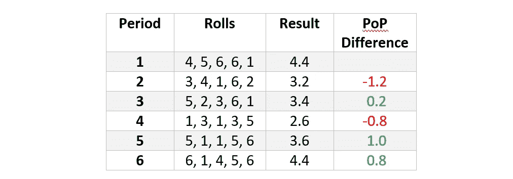
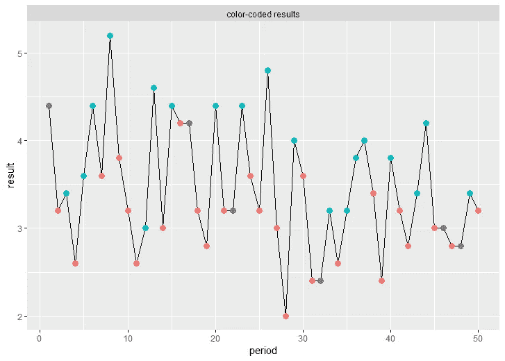
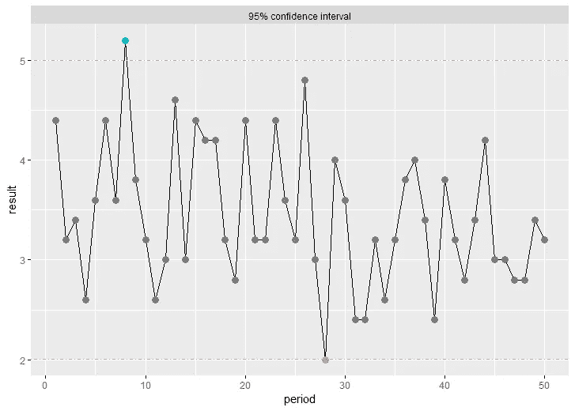
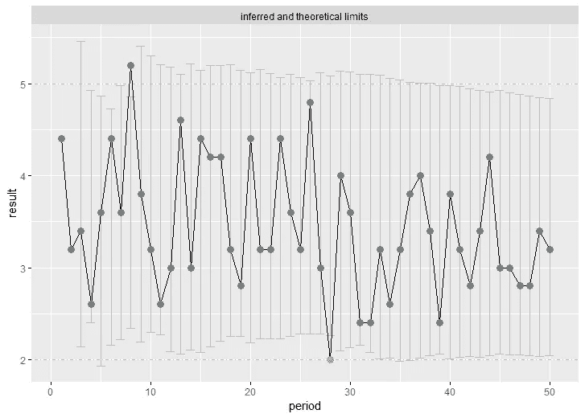
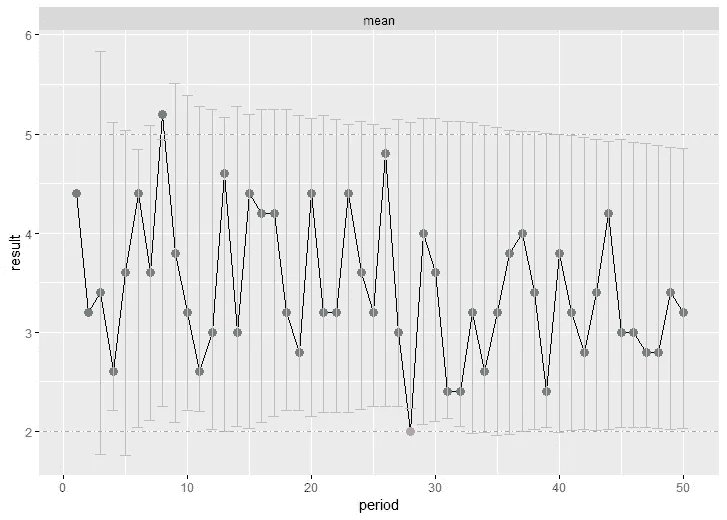

# 超越数字

> 原文：<https://towardsdatascience.com/beyond-the-numbers-5f20b919ac5b>

## 置信区间如何帮助集中注意力和简化分析

图片由作者使用[稳定扩散](https://stablediffusionweb.com/)

我们相信数字。如果一份报告告诉我们一家企业上周收到了 1，000 份订单，我们相信这家企业收到了 1，000 份订单。事务是历史记录的问题，它们的计数是一个简单的算术运算。如果有人问:“多少？”，我们*知道*答案。

理解 1000 份订单对一家企业意味着什么要困难得多。有人可能会问，1000 份订单是“好”、“很好”，还是仅仅是“可以”我们可以将本周的结果与之前的结果进行比较，给我们一个比较的基础，但我们仍然需要一种方法来将结果(或它们的差异)转化为定性的术语。

同样，有人可能会问，1，000 份订单是否足以让企业实现其长期目标。要回答这个问题，我们需要查看多周的数据，并从每周的涨跌中分离出主导趋势。一个简单的滚动平均值可能会起作用，但我们仍然需要决定将多少周包括在我们的平均值中，这可能会对我们的答案产生重大影响。

尽管我们相信数字，但它们只能告诉我们这么多:我们离“有多少”越远，回答问题就变得越难，我们需要更多的上下文来解释数据。

如上例所示，查看多个数据点会有所帮助。不同时期的差异、滚动平均值和其他计算方法有助于我们了解结果的趋势。这些通常与其他增强功能结合在一起，如颜色编码和上/下箭头，它们指示运动的方向，但不告诉我们任何关于其重要性的信息，这实际上可能导致数据的*错误解读*。

更有效的方法是使用置信区间。虽然用我们确定的数字来看置信区间似乎违反直觉，但这种方法有坚实的统计基础和许多令人惊讶的好处。

考虑一个模拟过程。对于每个报告期，我们将使用五个骰子的平均值作为结果。下表包含了前六个周期的结果及其跨周期(PoP)差异。

趋势图便于查看结果(*y*-轴)随时间的变化(*x*-轴)以及 PoP 差异:

图 1

在这两种报告格式中，增加以绿色显示，减少以红色显示。然而，正如所暗示的，颜色的这种常见用法实际上可能会适得其反，使任何*变化——向上或向下——看起来都很重要。*

想象一下当最初的几个结果到达时解释它们。第一阶段的结果是 4.4。此时，我们不知道 4.4 是高、低还是典型，但它设定了我们的期望。

下一期的成绩是 3.2，下降了 1.2。我们仍然不知道 4.4 和 3.2 是否是好结果，但红色强化了任何下降都是朝着错误方向前进的概念。如果这是一个真实世界的业务流程，我们会倾向于采取纠正措施。现在确定哪里出了问题还为时过早，但我们仍然可能决定延长工作时间，重新分配资源，或者做任何对这个特定过程有意义的事情。

第三阶段的结果是 3.4，有小幅增长，但令人放心。如果我们确实采取了纠正措施，我们可能会认为它是有效的。

然而，第四阶段的结果抹去了前一阶段的收益(甚至更多)。也许我们需要加倍努力或者尝试一些新的东西。

然后，相反的情况发生了:第 5 期抹去了前一期的损失(甚至更多)。到了第 6 期，我们又回到了起点:4.4。到目前为止，所有的得失加起来都不算什么。

因为我们正在谈论掷骰子，这实际上是我们应该期待的。单个结果是随机的，所以它们之间的差异也是随机的。如果我们继续掷骰子，我们可以更清楚地看到这一点。

图 2

50 次滚动后，平均 PoP 差异为 0.8，但所有差异的总和仅为-1.2，平均为-0.02，四舍五入为 0.0。虽然流行差异看起来很大，但它们最终会相互抵消。

让我们考虑一下如何在报道中利用这一事实。

因为我们知道 5 骰子滚动的统计特性，所以我们可以为我们的结果计算 95%的置信区间:3.5±1.5。这意味着所有结果的平均值将是 3.5，我们可以预计 95%的结果在 2.0 到 5.0 之间。(更准确地说，结果 1.5 的 95%将包含 3.5。)在这种情况下，50 个结果中的 48 个(96%)落在这些限制之间。

图 3

周期 8 和 28 是唯一超出这些限制的结果。这使他们成为进一步调查的良好候选人。

记住，这并不意味着会有什么有意义的发现。同样，我们的例子是基于掷骰子，所以所有这些结果都是随机的。(有 50 个结果和 95%的置信区间，我们应该预计有两三个结果落在我们的置信区间之外。)但是，在现实世界的业务流程中，我们不知道是什么导致了第 8 期和第 28 期如此不同。我们需要分析它们来找出答案(当然，知道可能什么也没有)。

然而，真正的好处是，我们可以忽略其他时期的结果，因为这些结果在预期之内。除了表面现象，起伏并不意味着什么:它们是过程中自然变化的副产品。

不必分析这些时期的结果将为我们节省大量的时间。图表让差异变得显而易见。在图 2 中，我们对每一个得失进行了颜色编码，让人们觉得每一个彩色点都是有意义的。(像圣诞树一样亮了！)但是，在图 3 中，我们将颜色的使用限制在两点，这使得图表更容易阅读，并将我们的注意力集中在更可能感兴趣的结果上。

此外，我们将降低对业务得出错误结论的风险。人们非常善于发现模式——即使它们并不存在——所以如果我们上下分析，假设有东西可以发现，我们很有可能*会*发现一些东西。如果这导致对什么可行什么不可行的错误结论，我们可能会对企业造成弊大于利的风险。

# 现实世界的复杂性

当然，如果这是一个真实世界的业务流程，我们就不会知道它的统计特性，所以我们就不能预先计算我们的置信区间的极限。幸运的是，有一个变通办法:我们可以使用结果本身来推断我们的过程的统计属性。让我们再次使用我们的骰子例子来看看这是如何工作的。

每个时期的结果都告诉我们更多关于这个过程的信息。在第一阶段之后，我们只有一个结果，但它设定了我们对结果的预期。在第二阶段之后，我们有两个结果，所以我们可以更新我们的期望，我们开始看到结果会随着时间的推移而变化。

从统计学上来说，这些是平均值( *x_bar* )或平均值，这是我们的期望值，以及标准差( *σ* )，它告诉我们单个结果与期望值的差异有多大。

仅仅经过两个周期，我们就可以计算两者:

从这些数据中，我们可以计算出一个置信区间，它将告诉我们下一个周期的结果是否与我们目前所看到的有显著的不同。这一特定过程是中心极限定理的经典示例，因此可以安全地假设我们的结果将遵循正态分布，这意味着 95%的置信水平大约为 2 *σ* (即 1.96 *σ* )。

鉴于我们目前所知的——这并不多——如果第三阶段的结果在 2.14 和 5.46 之间，我们不应该感到惊讶。事实证明，第三阶段的结果是 3.4，因此在预期范围内，这意味着结果是*而不是*与之前的值有显著差异。

现在我们有了一个新的结果，我们可以通过重新计算我们的累积平均值、标准差和置信区间来更新我们对该过程的理解，我们可以用它来评估下一个新的结果。

下表显示了前六个周期的置信区间。请注意，我们总是将最近的结果与前期的置信区间进行比较，如下所示。我们不能在置信区间的计算中包括新的结果，否则我们将使用结果来验证它本身。

随着每一个新的时期，我们进一步完善我们对这一过程的理解，我们推断出的统计数据就越接近真实的参数。下图显示了我们的推断极限如何收敛于理论极限，以及它们之间的差异如何缩小。

图 4

尽管极限之间存在差异，但推断区间和理论区间并没有导致不同结论的点。(然而，这是可能发生的，我们稍后会看到。)

# 更多现实世界的复杂性

大多数真实世界的场景比掷骰子更复杂。典型的业务流程将包括我们的置信区间需要考虑的长期趋势(如增长)和季节性变化(如假日销售)。

预测提供了一个方便的解决方案。和以前一样，我们使用历史结果来发展对业务流程的理解。不过，在这种情况下，预测算法完成了大部分工作。我们只需将我们的数据传递给算法，并要求它预测未来的一段时间，这种技术被称为一步到位预测。预测将预测下一期的结果(即点估计)和一个置信区间(即预测区间)，我们可以用它来评估实际结果。

虽然从统计学到机器学习的飞跃可能看起来很大，但预测是上述概念的逻辑延伸。事实上，如果我们使用 R 的 [*寓言*](https://fable.tidyverts.org/) 软件包中的*均值*方法，我们会得到一个与我们手工计算的图表非常相似的图表。

图 5

下面是使用*寓言的 tslm* 方法(时间序列线性模型)建立的一步预测，它更好地说明了其他算法如何捕捉趋势和季节性(这是均值方法无法做到的)。

图 6

前几个结果(周期 1-4)遵循一个负趋势，该算法预计该趋势将继续，因此前几个预测间隔(周期 4-5)低于由*均值*方法预测的间隔。

然而，期间 5 与早期趋势相反:预测值为 2.1(显示为灰色 x)，但实际结果为 3.6。该算法快速适应周期 6 的较高点估计和较宽的预测区间。

一旦算法看到足够多的增加和减少，它会将它们识别为过程中的自然变化，我们的预测区间的极限再次收敛于理论极限。

然而，周期 5 特别有趣，因为它也是一个假阳性的例子。它落在我们推断的区间界限之外，但是在理论区间界限之内。然而，假阳性通常不是一个问题，因为我们可能想要调查任何与我们之前看到的明显不同的结果。

周期 8 是相反的，一个假阴性的例子。任何时候，当我们的预测区间的界限比理论区间的界限更宽时，我们就有丢失结果的风险，这些结果需要进一步的检验。一个简单的解决方法是基于较低的置信水平(例如 80%)计算第二个区间，以识别出*有些*令人惊讶，但仍然值得我们关注的结果。

事实上，拥有多个置信区间是确定定性术语(如“好”、“很好”和“还行”)对您的企业可能意味着什么的简单方法。[68–95–99.7 规则—维基百科](https://en.wikipedia.org/wiki/68%E2%80%9395%E2%80%9399.7_rule)，基于 *σ* 的整数倍(1 *σ* ，2 *σ* ，3 *σ* )，是一个方便的起点，但是您可以使用对您的过程有意义的任何限制集。

# 最终考虑

在使用这些技术之前，你需要确保过程中的方差是一致的，不管结果的大小或顺序如何(见[同方差和异方差——维基百科](https://en.wikipedia.org/wiki/Homoscedasticity_and_heteroscedasticity))。如果你进行预测，你还需要对算法和准确性措施做出决定(见[预测——维基百科](https://en.wikipedia.org/wiki/Forecasting))。一旦你开始跟踪结果，你会想要监测它们的趋势变化，这些变化表明过程已经发生了根本性的改变(见[变化检测——维基百科](https://en.wikipedia.org/wiki/Change_detection))。

幸运的是，有很好的方法来解决这些问题。而且，在大多数情况下，努力是值得的。置信区间给了我们解释结果的强大工具。他们利用可用数据的完整历史，将最新结果放入上下文中，从而更容易评估该结果是我们应该调查还是应该忽略。相反，在没有置信区间的情况下查看业务结果就像阅读一页上的文字，但忽略句子:你可能能够理解单个数字，但你会错过它们的组合意义。