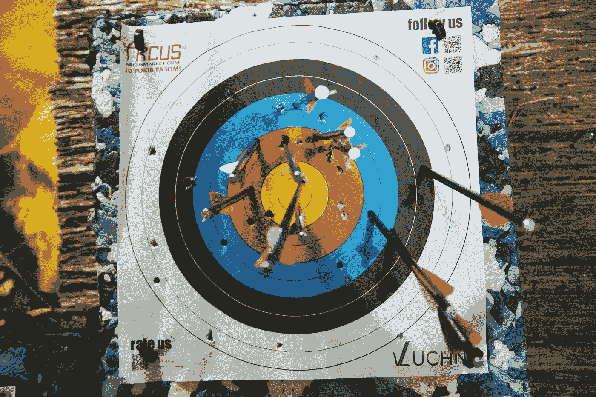
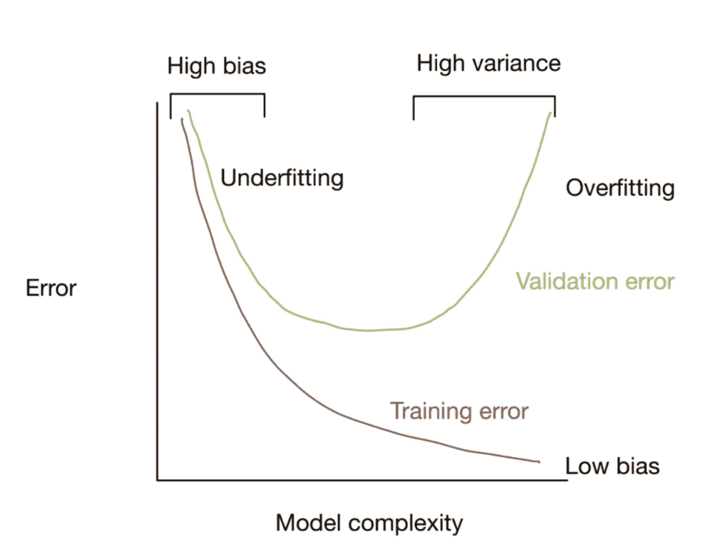

# 机器学习中的偏差和方差

> 原文：<https://towardsdatascience.com/bias-and-variance-for-machine-learning-in-3-minutes-4e5770e4bf1b>

## 什么是偏差和方差，这对你的机器学习模型意味着什么？

约翰-马克·史密斯在 [Unsplash](https://unsplash.com?utm_source=medium&utm_medium=referral) 上的照片

## 偏见

机器学习中的偏差是指使用训练数据时，模型预测与实际目标变量之间的差异。当算法不能捕获现有特征和目标值之间的相关关系时，高水平的偏差会导致模型中的欠拟合。然而，与此相反的是，当对训练数据出现很少或没有偏差时，我们可能会看到过度拟合。这意味着该模型已经学习了太多训练数据的细微差别，可能没有用。您可以将此视为训练数据中模型指标的性能，如准确性、R 或偏差。

## 差异

机器学习模型的差异取决于模型准确预测未知数据目标的能力。因此，它通常被称为与测试看不见的数据相关的误差。这并不关注模型的整体准确性，而是简单地测量模型估计中的分布或不确定性。这可以被看作是您在不可见的测试数据中选择的性能指标与您的训练数据相比的差异，例如训练 R 为 0.98，但是在不可见的数据上 R 值的分布为 0.7、0.6 和 0.8。

## 偏差-方差权衡

在机器学习的建模阶段，有必要做出会影响模型中偏差和方差水平的决策。当构建监督机器学习模型时，目标是实现最准确预测的低偏差和方差。这意味着当涉及到训练和测试数据时，我们必须处理模型欠拟合和过拟合的可能性。

通过这种方式，我们可以认为偏差是模型相对于目标的准确程度，而方差是预测相互之间的关联程度。我们的目标是在创建和训练我们的模型时，既要有低偏差(即准确)又要有低方差(即始终准确)，但这两者之间往往有所取舍。

这种情况的一个例子是，当过度拟合训练数据时，模型可能非常精确，因此它将具有低偏差，但是它可能对看不见的数据具有高方差，因为模型已经学习了训练数据的细微差别。我们可以尝试降低模型的过度拟合程度，使其能够概括基础数据中的总体趋势，这可能会增加模型相对于训练数据的偏差，目的是减少看不见的数据的方差。因此，这两者之间通常存在一定程度的权衡，可以设想为:

作者图片

在这种情况下，我们试图在欠拟合和过拟合之间找到一个中间点，在这个中间点上，我们有尽可能低的验证误差，但又不会太接近低训练误差。这可能是一个很难实现的平衡，但它将取决于您可用的数据和您决定实现的模型的结构。

如果你喜欢你所读的内容，以及如何跟上我和其他了不起的作者的文章，请随时使用我下面的推荐代码注册 medium

  

或者查看我的其他文章:

     