# BIG.art:使用机器学习来创建高分辨率的美术作品

> 原文：<https://towardsdatascience.com/big-art-using-machine-learning-to-create-high-res-fine-art-7dd695f99788>

## 如何使用 GLIDE 和 BSRGAN 创建具有精细细节的超高分辨率数字绘画

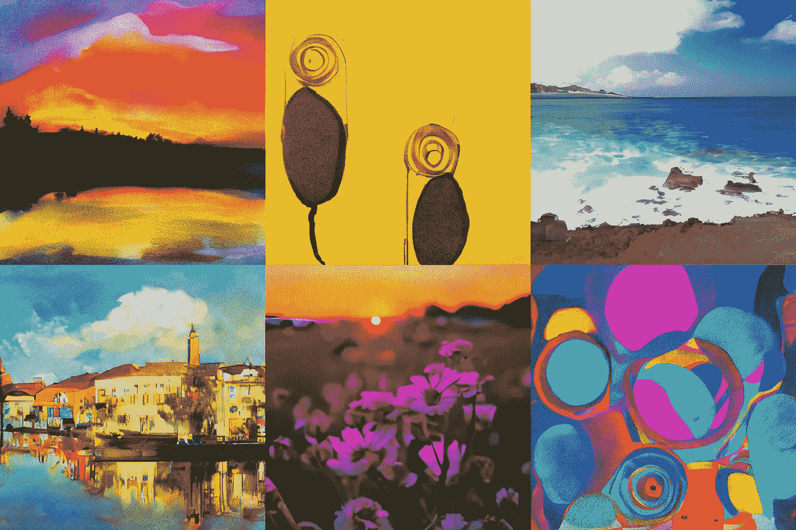

**来自 BIG.art** 的样本结果，图片由作者提供

一年多来，我一直在试验和写作使用 AI/ML 从文本描述中创造艺术。在此期间，我注意到人们对这一领域的兴趣明显增加，部分原因是 NFT 艺术市场的蓬勃发展。

看了几十个生成艺术的 ML 模型，目前我见过最好的是 OpenAI 的 GLIDE。再加上苏黎世联邦理工学院的超分辨率尺寸调整模型 bsr gan[2]，我发现结果非常好。

例如，下面是我的两个早期项目的结果，使用 CLIP+SWAGAN 的 [MAGnet](/magnet-modern-art-generator-using-deep-neural-networks-57537457bb7) 和使用 CLIP+VQGAN 的 [GANshare One](/ganshare-creating-and-curating-art-with-ai-for-fun-and-profit-1b3b4dcd7376) ，与右边新系统的结果进行比较。我使用的提示是“一幅起伏的农田的画”、“一幅带有橙色三角形的抽象画”和“一碗水果的静物画”。

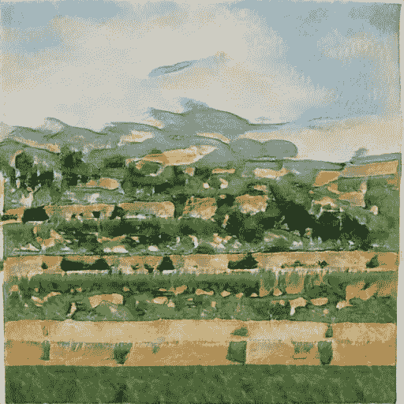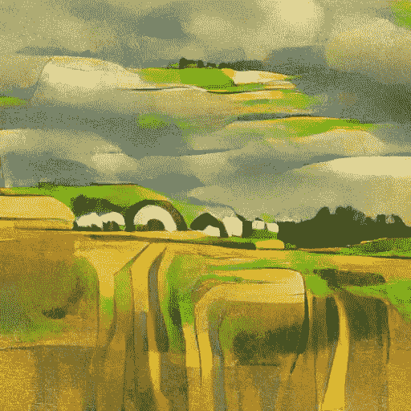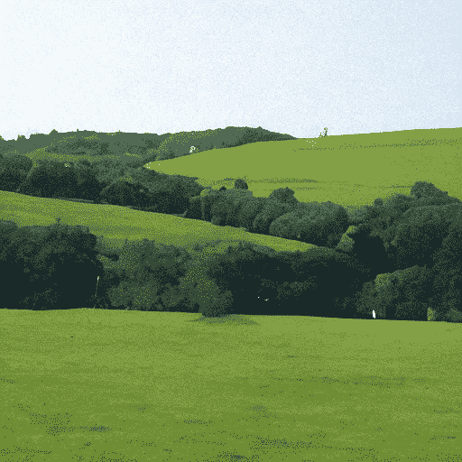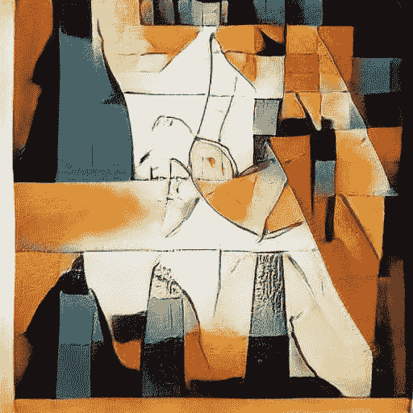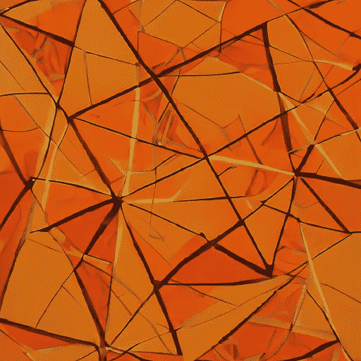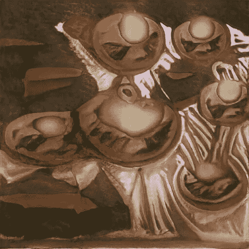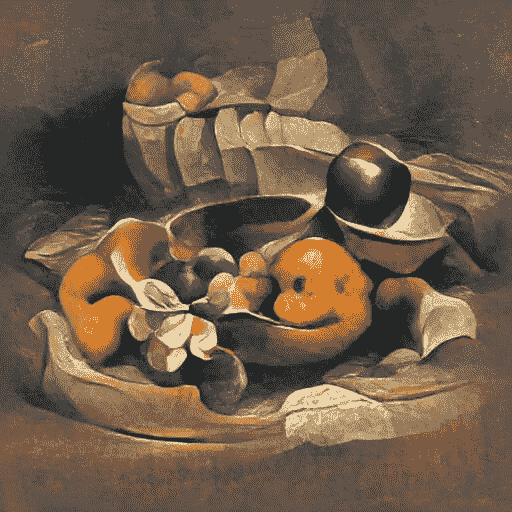

**比较 ML 模型的输出，**作者的图像

虽然对艺术的评估天生就是主观的，但对我来说很清楚的是，新模型的结果比前两个要好。(不过，我很欣赏橙色三角形的 CLIP/VQGAN 渲染的 3D 外观。)你可以点击每张图片仔细看。

# 概观

这是我的项目生成高分辨率美术(称为 BIG.art)的高级框图。在对系统进行概述后，我将在下面进一步讨论每个组件的细节。

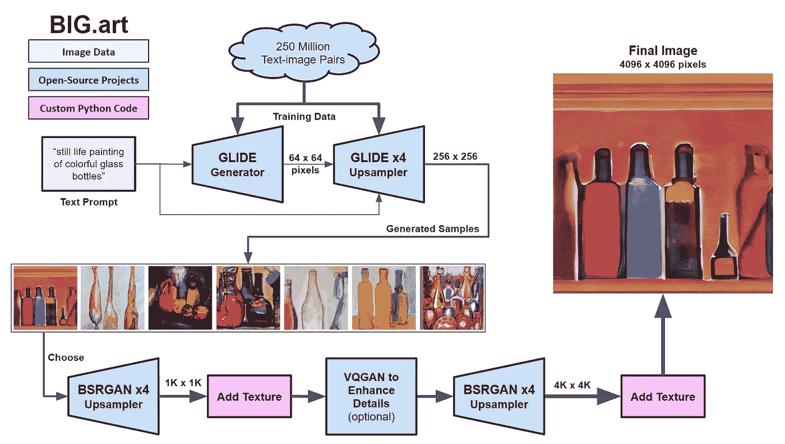

**BIG.art 组件**，作者提供的图表

OpenAI 做了大量的工作，他们收集了 2.5 亿个文本-图像对，并训练了两个 GLIDE 模型，一个图像生成器和一个图像上采样器。我将一个文本提示“彩色玻璃瓶的静物画”传入 GLIDE 生成器，它创建了一组 7 个缩略图，每个 64x64 像素。然后，我将生成的缩略图和提示发送到 GLIDE upsampler，它将它们的大小调整为 256x256 像素。甚至上采样图像也非常小。如果你以 300 DPI 的分辨率打印，它的横向和纵向都不到一英寸。以下步骤用于调整所选图像的大小。

在尝试了几个调整大小的系统后，我选定了苏黎世 ETH 的 BSRGAN 超分辨率 resizer 模型。它很好地将所选图像的大小调整了 4 倍，达到了 1024x1024 像素。尽管调整后的图像边缘清晰，但填充区域趋于变平。为了补偿这一点，我为纹理添加了一些过滤噪声。

我选择性地将调整大小和纹理的图像通过德国海德堡大学的图像编码器和解码器 VQGAN。我发现 VQGAN 会发明新的细节，这些细节通常会增强调整后的图像。

最后一步是从 BSRGAN 中再次调整大小 4 倍，并再次通过纹理生成器。结果是一个 4096x4096 的图像，具有清晰的边缘和细节。以 300 DPI 的分辨率打印出来的照片会超过一平方英尺，适合装裱。这是带有一些细节的最终图像。

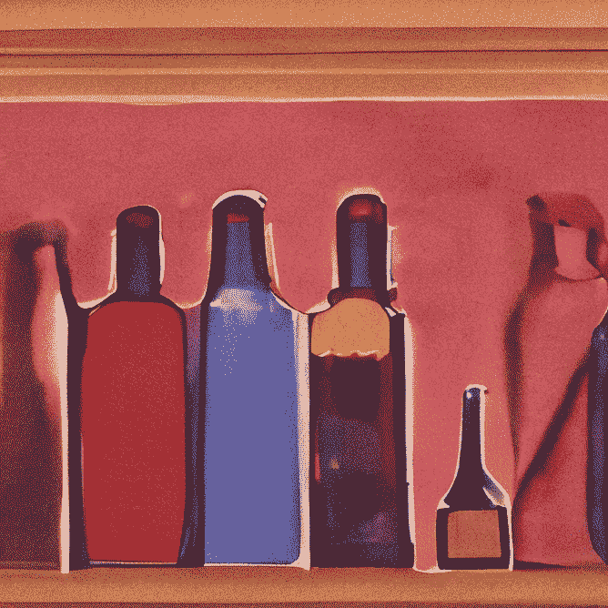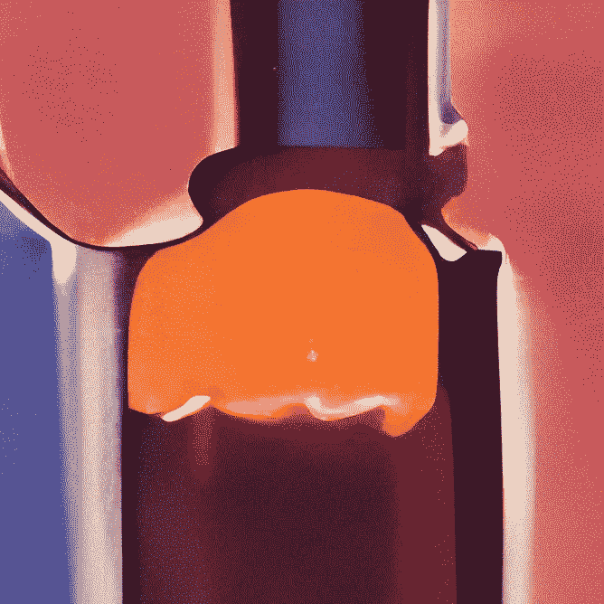

**“彩色玻璃瓶静物画”** **的 BIG.art 结果，带有显示细节的选定区域**，图片由作者提供

请务必查看下面的附录，查看 BIG.art 的更多结果，并且您可以使用 Colab [在这里](https://colab.research.google.com/github/robgon-art/BIG.art/blob/main/BIG_art_Image_Creation.ipynb)创建自己的艺术作品。

# 组件详细信息

## 使用 GLIDE 生成图像

2022 年 3 月，OpenAI 发布了一系列名为 GLIDE 的用于图像创建的 AI 模型，这是一种所谓的扩散模型，是生成式对抗性网络(GANs)的替代方案。谷歌研究院的两位工程师解释了扩散模型的工作原理。

> 扩散模型的工作原理是通过逐步添加高斯噪声来破坏训练数据，慢慢消除数据中的细节，直到它变成纯噪声，然后训练神经网络来逆转这一破坏过程。运行这个反向破坏过程通过逐渐去噪从纯噪声合成数据，直到产生干净的样本。该合成过程可以被解释为一种优化算法，其遵循数据密度的梯度来产生可能的样本。— Jonathan Ho 和 Chitwan Saharia [3]

**扩散模型基本上是降噪模型，这些模型已经被训练了很长时间，以至于它们在给定纯噪声作为输入的情况下生成新的图像。**

OpenAI 的 GLIDE 基于他们早期对使用扩散模型进行图像合成的研究。他们 2021 年的论文在标题中有一个大胆的声明，*扩散模型在图像合成上击败了 GANs*，表明以图像类别为条件的扩散模型可以获得比最先进的生成模型更好的图像质量[4]。在他们的最新论文 *GLIDE:用文本引导扩散模型实现真实感图像生成和编辑*中，作者…

> …观察无分类器引导的滑翔能够推广到各种各样的提示。该模型通常生成逼真的阴影和反射，以及高质量的纹理。它还能够制作各种风格的插图，如特定艺术家或绘画的风格，或像素艺术等一般风格的插图

对于 BIG.art，我使用 GLIDE 图像生成器接收文本提示，并生成一系列七幅 64x64 的图像。系统试图描述提示中描述的内容。然后，我将图像和提示输入到 GLIDE upsampler，将分辨率提高到 256x256。该系统被训练成在调整大小时使用提示来帮助添加细节。

例如，GLIDE 从提示“海浪汹涌的海景”中生成以下七幅图像

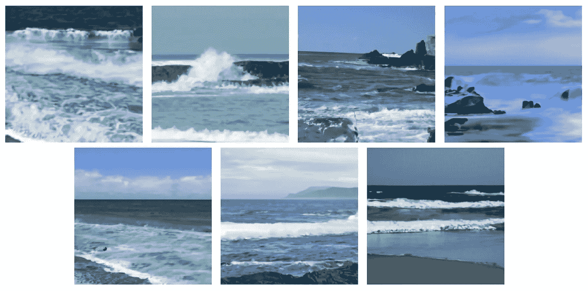

**GLIDE 为“海浪汹涌的海景”生成的图像，**作者提供的图像

好吧，那些看起来很不错。这是另一组“波士顿城市地平线”

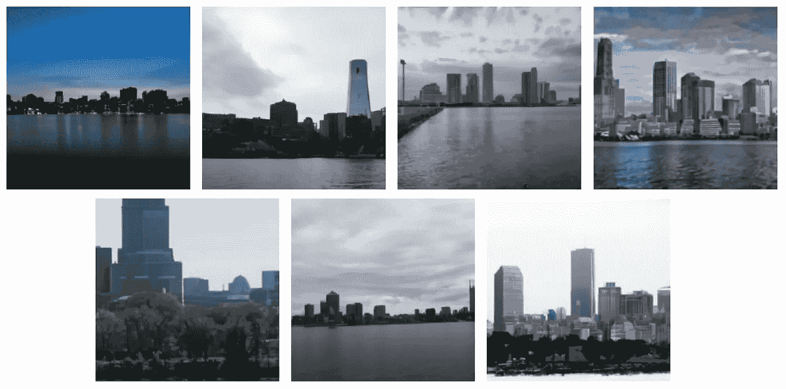

**GLIDE 为“波士顿城市天际线”生成的图片，**作者提供的图片

这些看起来有点像波士顿，但不完全是。在任何情况下，我将使用第四个调整大小的讨论如下。

请注意，OpenAI 发布了经过训练的 GLIDE 模型，这些模型无法创建人的图像。作者声明…

> …在没有安全措施的情况下发布我们的模型，将会大大降低创建令人信服的虚假信息或深度伪造所需的技能。…为了减轻发布这些模型的潜在有害影响，我们过滤了包含人的训练图像…以降低模型在许多以人为中心的有问题的用例中的能力。亚历克斯·尼科尔等人[1]

## 用 BSRGAN 调整图像大小

有许多不同的方法使用人工智能来调整图像大小，以获得干净，清晰的结果。这个研究领域被称为超分辨率成像。

我测试了六种不同的图像超分辨率(ISR)尺寸调整模型，发现了两种称为盲尺寸调整网络(BSRNet)和盲尺寸调整生成对抗网络(BSRGAN)的模型，它们对于放大艺术图像非常有效。BSRGAN 模型使用 BSRNet 作为基线，然后使用 GAN 模型进行进一步训练。

来自苏黎世联邦理工学院的论文作者*设计了一个实用的深度盲图像超分辨率退化模型*，他说。

> 众所周知，如果假设的退化模型偏离真实图像中的退化模型，单幅图像超分辨率(SISR)方法将不能很好地执行。虽然一些退化模型考虑了其他因素，如模糊，但它们仍然不足以有效地覆盖真实图像的各种退化。为了解决这个问题，本文提出设计一个更复杂但实用的退化模型，该模型由随机混洗模糊、下采样和噪声退化组成。—张开等人

该系统经过训练，可以盲目地发现产生低分辨率(LR)图像的各种退化，从而在重建高分辨率图像时通知 AI 模型。以下是多种 ISR 模型的对比。左边是原始的 LR 图像，右边是用 BSRNet 和 BSRGAN 放大的图像。

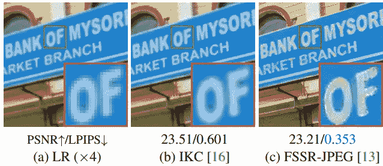

**BSR 论文中描述的 ISR 方法比较，**来源:[张开等人](https://arxiv.org/pdf/2103.14006.pdf)

您可以看到 BSRNet 和 BSRGAN 的图像和指标看起来比其他的更好。所示的两个质量度量是峰值信噪比(PSNR)，其中越大越好，以及学习感知图像块相似性 LPIPS，其中越小越好。我发现 BSRGAN 通常看起来更锋利，所以这就是我在我的大型艺术项目中使用的。

这是 GLIDE 用双三次插值和 BSRGAN 放大了四倍的“波士顿城市天际线”图像。请注意，您可以点击图片查看详细信息。

**使用(左)双三次插值和(右)BSRGAN 调整大小**调整 4x 大小的比较，图片由作者提供

你可以看到，用 BSRGAN 调整大小后的图像更清晰、更有活力。然而，它似乎有一个喷枪质量，在光滑的区域缺乏纹理。我将在下一节讨论这个问题。

## 纹理生成器

为了给图像的平坦部分增加一些趣味，我创建了一个纹理生成器，它通过一个模糊函数运行一个单色随机噪声场。然后将噪声场添加到图像中。这些参数是:

1.  texture_amount -从 0 到 15%的噪波数量。
2.  纹理大小-从 1 到 9 的噪波“块”的大小

这是原始图像，5%的纹理设置为尺寸 1 和 9。

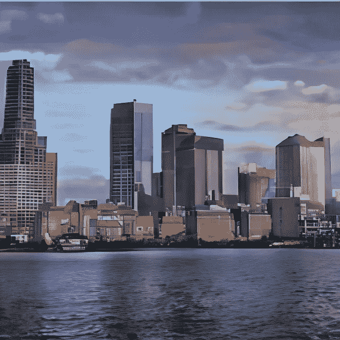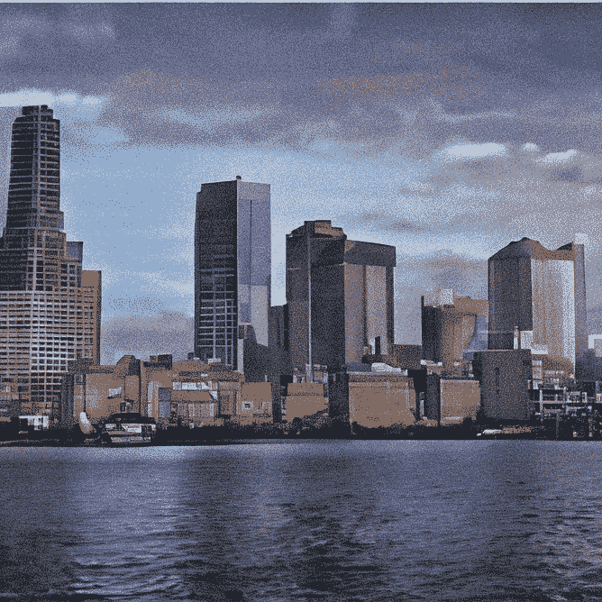

**不同纹理尺寸生成的图像(左)无，(中)尺寸为 1 时 5%，尺寸为 9 时(右)5%**，作者提供的图像

我发现添加一点纹理会使生成的和调整大小的艺术作品更具美感。纹理生成器的源代码是[这里是](https://gist.github.com/robgon-art/4b96a922cc23375a595ffbdc85bf7203)。

## 使用 VQGAN 增强细节

当我在尝试各种图像生成技术时，我碰巧通过一个名为矢量量化生成对抗网络(VQGAN)的系统发送了一个用 BSRGAN 调整大小的图像[5]。我在过去的三个 GAN 项目中使用了 VQGAN。我通常使用文本提示和 OpenAI 的剪辑来微调图像，运行 VQGAN 100 到 400 次迭代。

有趣的是，我发现简单地用 VQGAN 编码和解码图像可以改善细节，尤其是用 BSRGAN 放大的图像。

下面是使用 VQGAN 编码/解码前后波士顿城市天际线图像的一个区域的细节。对于这个实验，我关闭了纹理生成器。

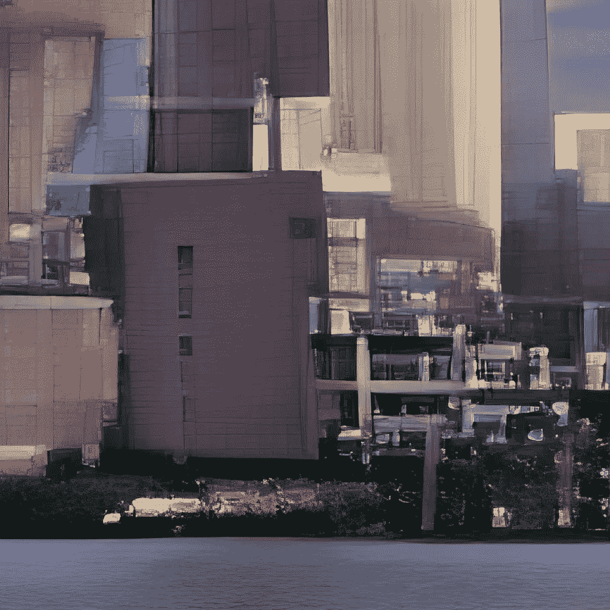

**原始调整大小图像的细节(左)和通过 VQGAN 编码和解码的图像(右)**，作者提供的图像

这很微妙，但你可以看到 VQGAN 如何添加一些细节，似乎在右下方完成了一个建筑项目。

这是因为 VQGAN 的设计和训练方式。这是一个混合的 Transformer/GAN 模型，它查看图像的子区域，并将它们编码为之前在训练中看到的区域类型。解码的时候会和邻居一起无缝渲染细节部分。

BSRGAN 模型通过预测高分辨率图像的外观，将 256x256 图像放大到 1024x1024。然后 VQGAN 模型用新发明的细节映射结果图像。你可以在我的 [GANshare](/ganshare-creating-and-curating-art-with-ai-for-fun-and-profit-1b3b4dcd7376) 文章中看到 VQGAN 的完整报道。

# 再次使用 BSRGAN 进行最终的大小调整

BIG.art 的最后一步是用 BSRGAN 和另一种纹理处理再放大 4 倍。这是 4096x4096 像素的最终图像。

**“波士顿城市地平线”的大艺术效果图，**作者图片

你可以点击图像来放大并查看细节。请务必查看下面的附录，查看更多生成的图像。

# **结果**

在试用 BIG.art 之后，我发现有些提示对于生成图像很有效，但有些则不然。

## 有效的提示

创作抽象画似乎效果不错。以下是一些提示。请注意，您可以在附录中看到生成的图像。

*   “一幅带有彩色圆圈的抽象画”
*   "一幅带有黄色和黑色细线的泼溅画"
*   "一幅带有紫色和绿色方格的拼色画"

风景画看起来也不错。

*   “意大利别墅的风景画”
*   《湖上日落》
*   “雄伟的雪山”

还有宠物的画。

*   "一幅柯基的画"
*   "一只虎斑猫"
*   “玻璃鱼缸里的金鱼”

## 不起作用的提示

涉及人的提示(例如，“儿童玩耍”、“巴拉克·奥巴马”、“蒙娜丽莎”等。)不工作是因为 GLIDE 的训练数据故意缺人。

抽象概念的提示(例如，“自由”、“崭新的一天”、“失控”等)。)也不起作用，因为对互联网上使用这些词标记的图像的内容缺乏共识。

这里有一个问题定义了使用 BIG.art 的经验法则:当你在谷歌上搜索这个提示并查看结果图像时，它们看起来大致相似吗？如果是这样，使用该提示生成图像将会生成良好的图像。哦，不要试图渲染人。没用的。

# 源代码

这个项目的[源代码](https://github.com/robgon-art/BIG.art)可以在 GitHub 上获得。我在 CC BY-SA 许可下发布源代码。你可以使用这个 [Google Colab](https://colab.research.google.com/github/robgon-art/BIG.art/blob/main/BIG_art_Image_Creation.ipynb) 创建你自己的图片。

知识共享署名共享

如果您使用此代码创建新图像，请这样注明:此图像由[罗伯特·a·贡萨尔维斯](https://robgon.medium.com/)使用 [BIG.art](https://github.com/robgon-art/BIG.art) 创建。

# 感谢

我要感谢詹尼弗·林和奥利弗·斯特瑞普对本文的帮助。

# 参考

[1] A. Nichol 等人， [GLIDE:使用文本引导扩散模型实现真实感图像生成和编辑](https://arxiv.org/pdf/2112.10741.pdf) (2022)

[2] K. Zhang 等，BSRGAN，[设计一个实用的深度盲图像超分辨率退化模型](https://arxiv.org/pdf/2103.14006.pdf) (2021)，IEEE/CVF 国际计算机视觉会议论文集(ICCV)，2021，第 4791–4800 页

[3] J. Ho 和 C. Saharia，[使用扩散模型生成高保真图像](http://ai.googleblog.com/2021/07/high-fidelity-image-generation-using.html) (2021)

[4] P. Dhariwal 和 A. Nichol，[扩散模型在图像合成上击败 GANs](https://arxiv.org/pdf/2105.05233.pdf)(2021)

[5]p . Esser、R. Rombach 和 B. Ommer 著的 VQGAN，[驯服变压器实现高分辨率图像合成](https://arxiv.org/pdf/2012.09841.pdf) (2020 年)

# 附录

以下是 BIG.art 针对以下提示的输出示例。这些是我认为七张照片中最好的。

# 抽象画

## 一幅带有彩色圆圈的抽象画

**一幅带有彩色圆圈的抽象画**，作者图片

## 一幅带有黄色和黑色细线的泼溅画

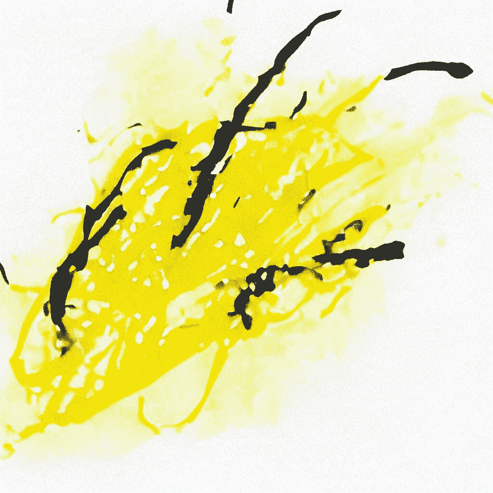

**一幅带有黄色和黑色细线的泼溅画**，作者图片

## 带有紫色和绿色方格的块状彩画

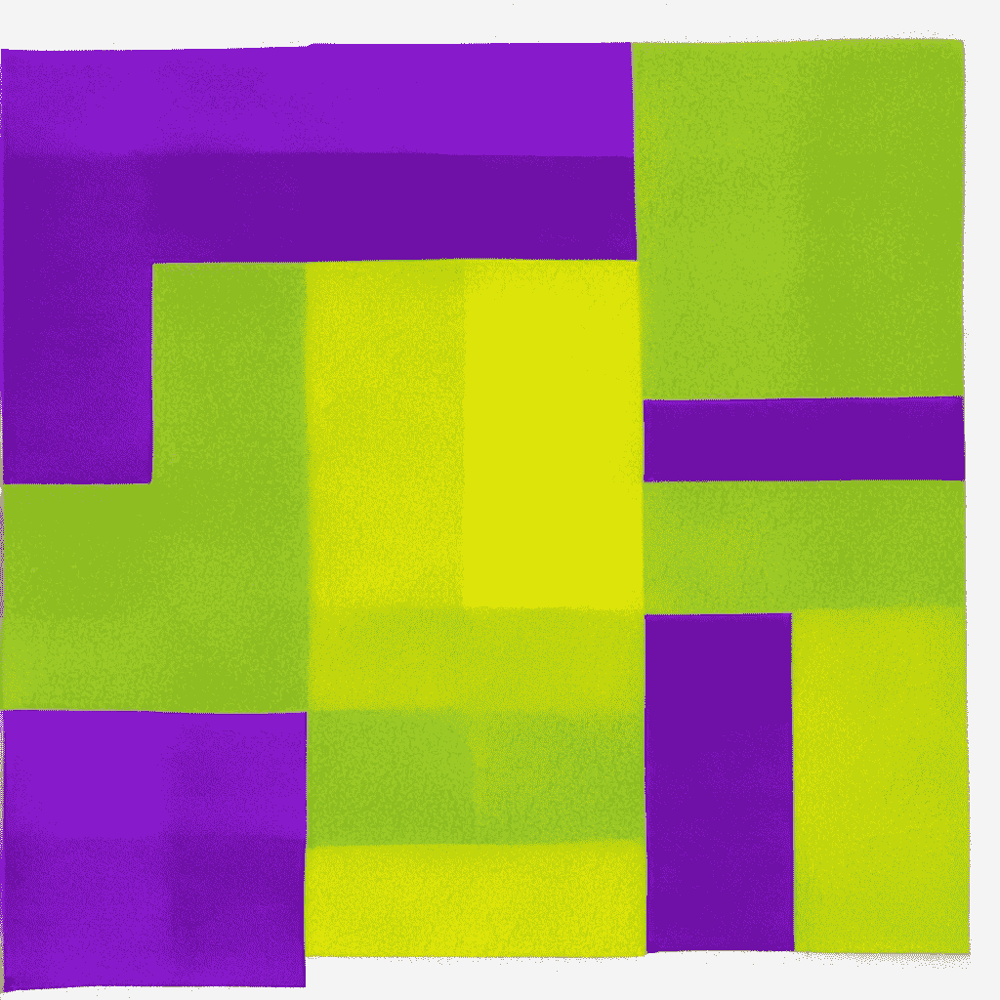

**一幅带有紫色和绿色方格的块状彩画**，图片由作者提供

# 风景画

## 意大利别墅的风景画

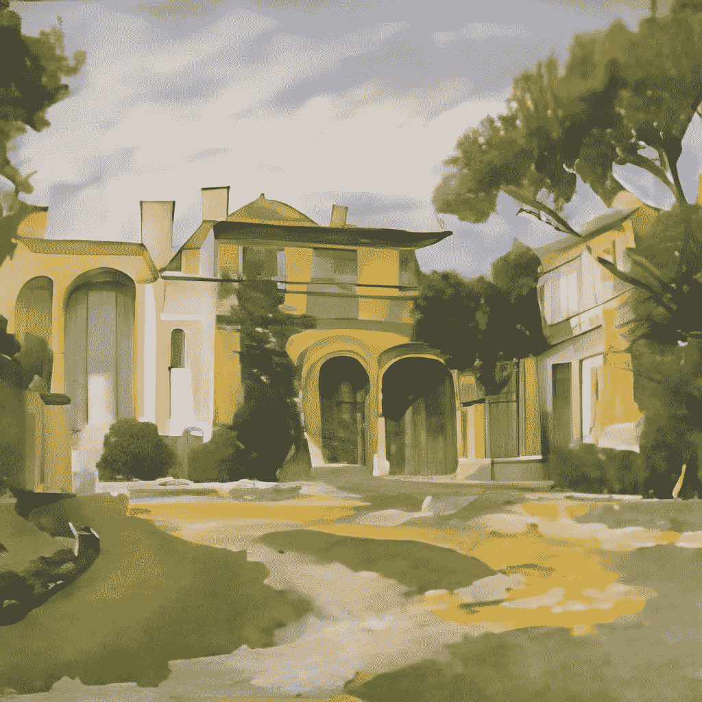

**意大利别墅风景画**，作者图片

## 湖面上的日落

**湖上落日，**作者 Imae

## 雄伟的雪山

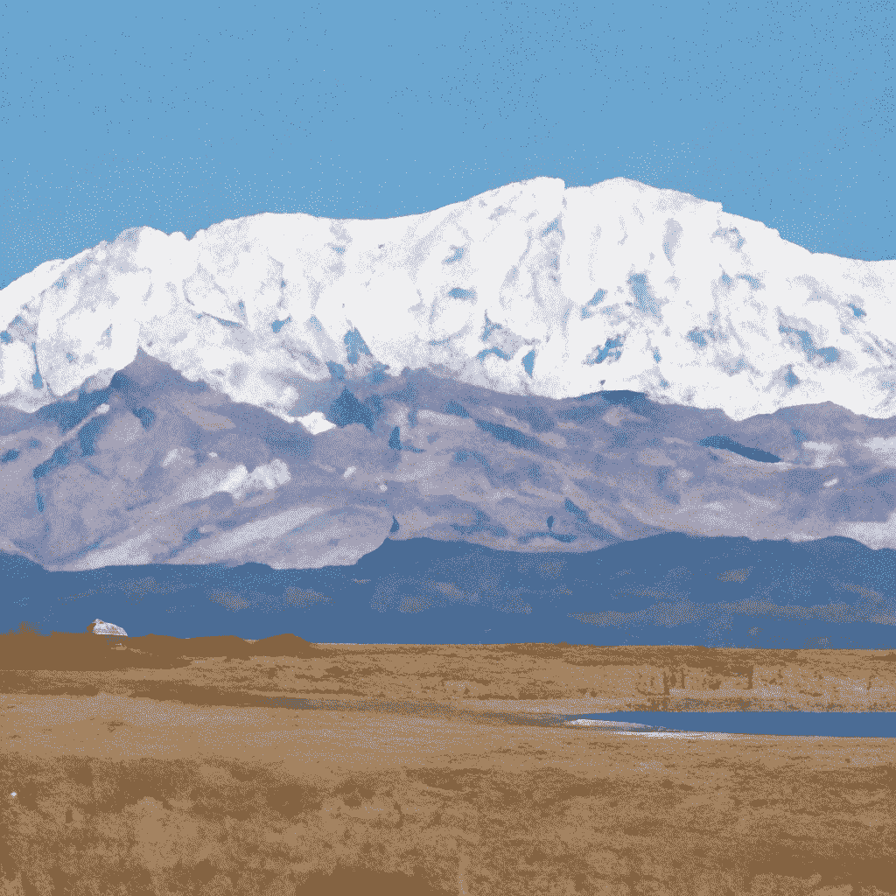

雄伟的雪山，作者图片

# 宠物画

## 一只柯基犬的画

一幅柯基犬的画，作者图片

## 一只虎斑猫

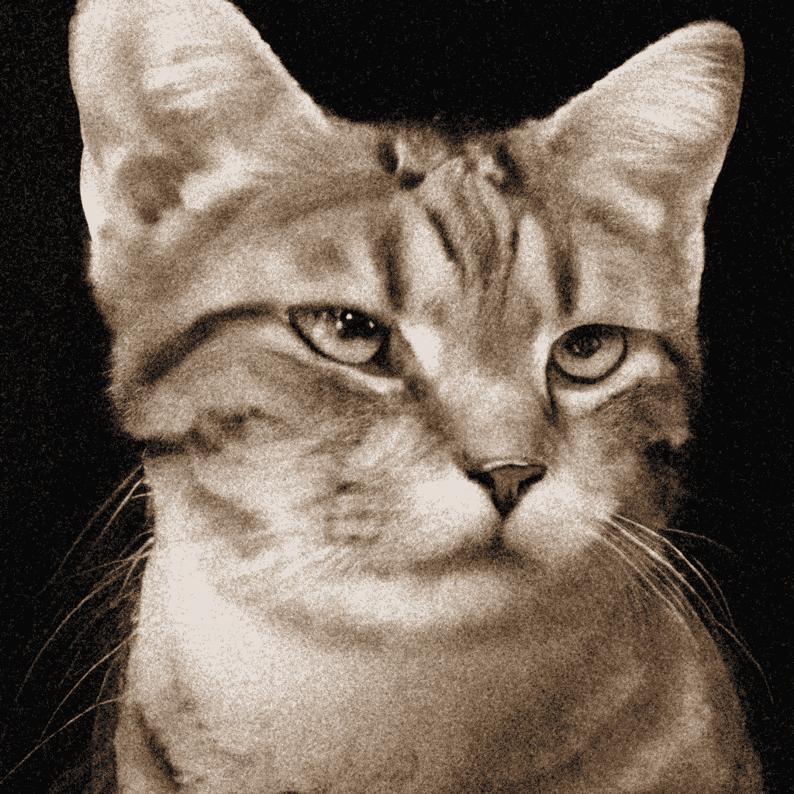

一只虎斑猫，图片由作者提供

## 玻璃碗里的金鱼

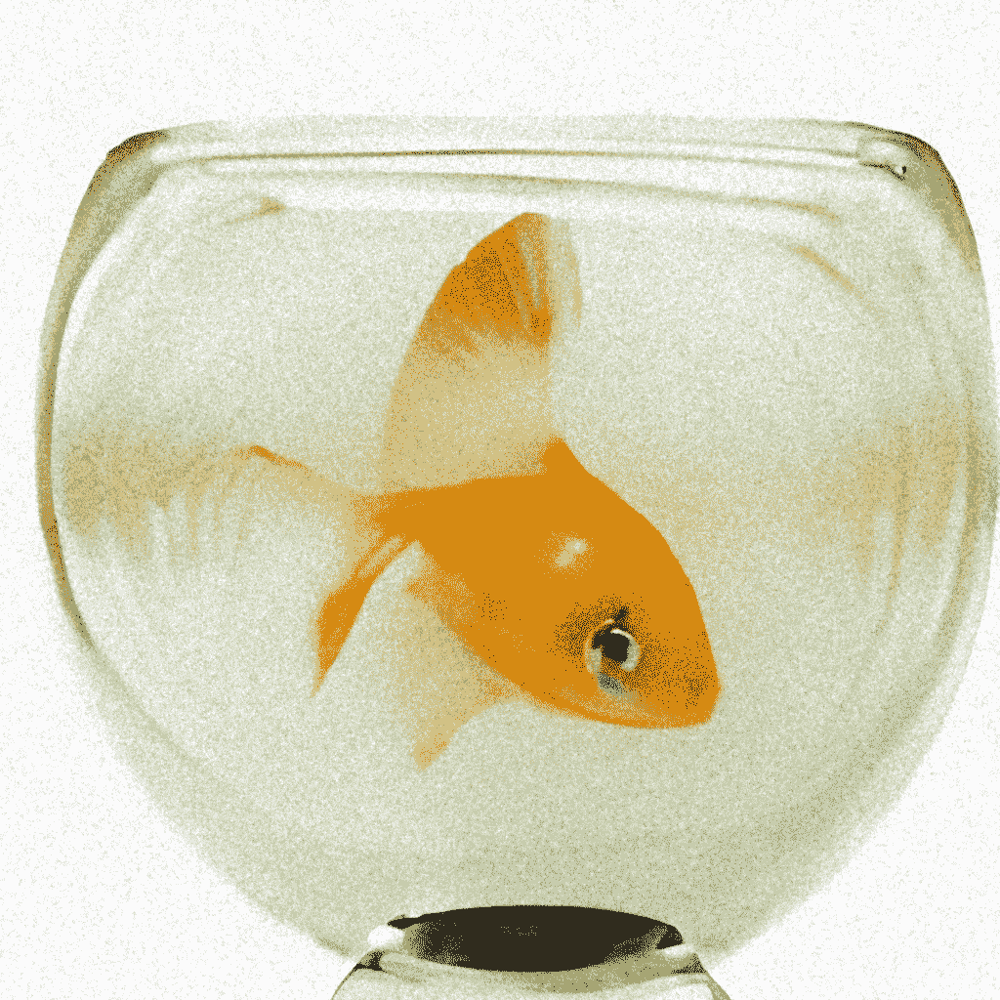

玻璃缸里的金鱼，作者图片

# **奖金提示**

以下是我的一位评审员 Oliver 建议的各种提示的一些效果图。

## 木材车间

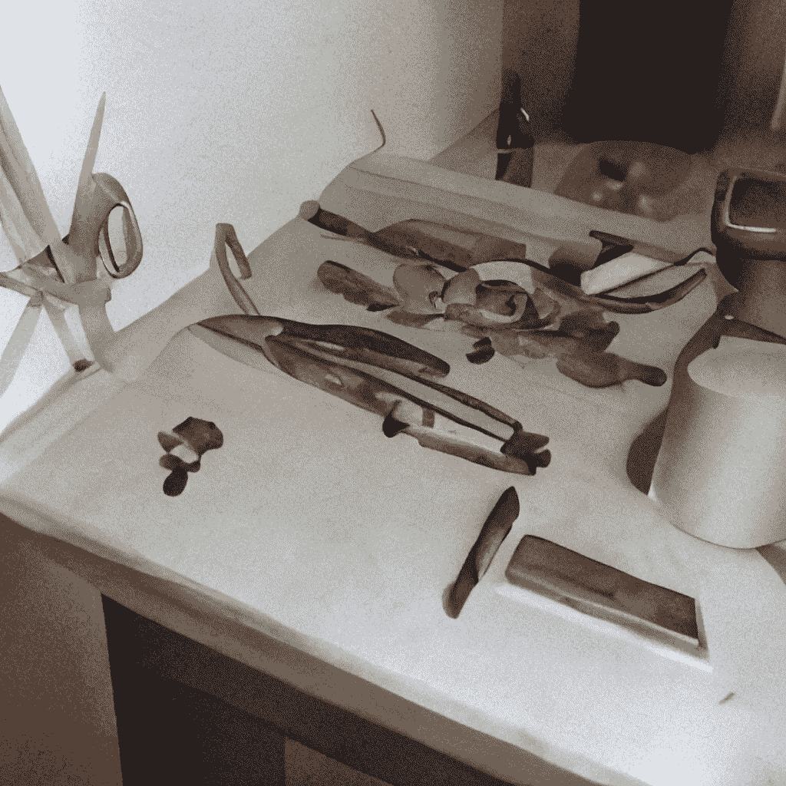

**一个木材作坊**，图片作者

## 微生物

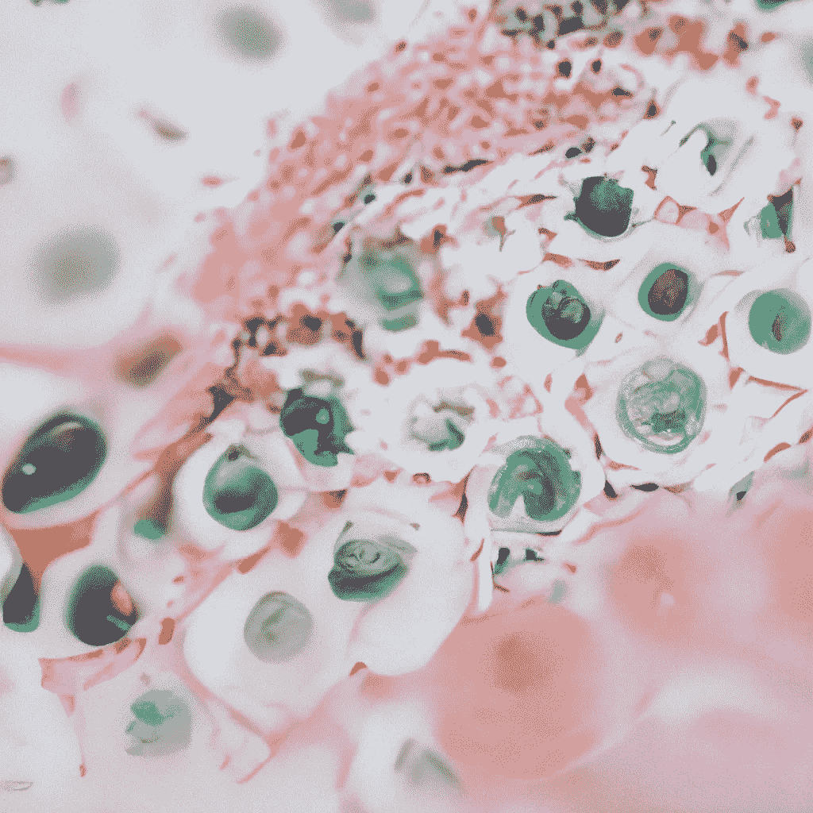

**微生物**，图片作者

## 塞车

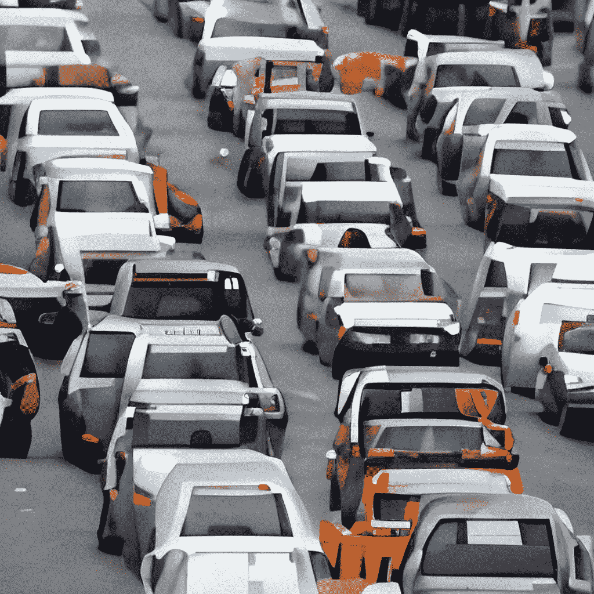

**交通堵塞**，图片作者

为了无限制地访问 Medium 上的所有文章，[成为会员](https://robgon.medium.com/membership)，每月支付 5 美元。非会员每月只能看三个锁定的故事。