# 小字里的大数据

> 原文：<https://towardsdatascience.com/big-data-in-little-wordle-306d5502c4d9>

## 对约 7000 万场世界扑克比赛的大规模数据分析

尼尔斯·胡内尔弗斯特在 [Unsplash](https://unsplash.com/s/photos/wordle?utm_source=unsplash&utm_medium=referral&utm_content=creditCopyText) 上的照片

最近，我一直在探索流行的文字游戏 Wordle[62–67]的各个方面，这款游戏在 2022 年 1 月和 2 月风靡了互联网。当我开始欣赏被问到的许多数据科学问题时，我决定使用 Wordle 作为我大学三年级的一个案例研究项目，这是我每年春天在都柏林大学教授的数据科学实践课程。该课程是一门*基于实践的*课程，要求小组学生设计、开发和展示他们自己的数据科学项目。为了让他们开始，我总是提出一个新的案例研究，作为对他们的期望的例子，下面是今年 Wordle 案例研究的总结。我将描述使用的数据集和回答的研究问题。而且，虽然我之前已经在博客上写了以下内容的一些方面，但这里呈现的结果代表了我迄今为止进行的最详细的分析。

# TL；速度三角形定位法(dead reckoning)

这是一篇又长又详细的帖子，所以这里是一些关键的结果:

*   我们描述了 Wordle 数据的两个重要来源的发展:(I)由 Wordle 模拟器生成的超过 5300 万个游戏的数据集；以及(ii)Twitter 上发布的超过 1500 万个真实世界游戏的数据集。
*   ( ***RQ1*** )我们比较了模拟数据集和 Twitter 数据集，发现它们在几个重要方面有很强的对应性。
*   ( ***RQ2*** )一项对 Twitter 游戏的分析表明，Wordle 在 1 月底/2 月初在 Twitter 上达到顶峰。
*   ( ***RQ3*** )一项对模拟游戏的分析显示了一些开始词如何比其他的更有效。Twitter 数据集告诉我们，大约 17%的玩家使用了糟糕的开始词，这可能会对这些玩家的表现产生负面影响。
*   ( ***RQ4*** )另一项对模拟游戏的分析显示，一些目标词比其他的更具挑战性，导致游戏时间更长，成功的游戏更少。Twitter 的数据也证实了这一点，但没有证据表明 Wordle 会像一些人猜测的那样变得越来越难。
*   ( ***RQ5*** )玩好 Wordle 的能力取决于玩家选择尽可能满足目前所学约束的猜测。对模拟游戏的分析表明，*正确的字母*和*正确的位置*约束是最重要的一致遵守。

# 一点点单词

Wordle 是一款简单却引人入胜的在线猜词游戏。每天都会选择一个新的秘密目标单词，玩家有一次机会参与游戏。在每次猜测之后，向玩家提供颜色编码的反馈(见图 1)，以指示:(I)目标单词中包含哪些字母(如果有的话)以及它们的正确位置(*绿色*)；(ii)哪些字母在目标单词中但不在它们的正确位置(*黄色*)；以及(iii)目标中缺少哪些字母(*灰色*)。这样，随着每一个新的猜测，玩家可以学到更多关于目标单词及其字母的知识。

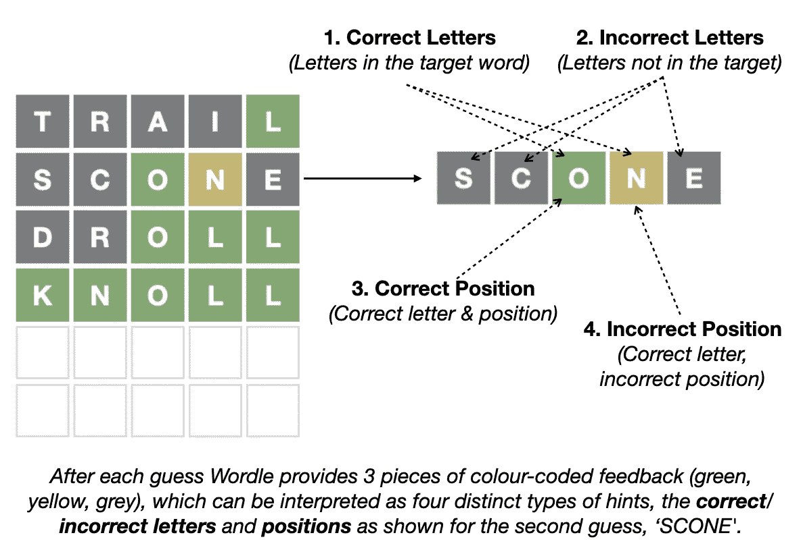

图 1:一个示例 Wordle 游戏和每次猜测后提供的提示。请注意，即使玩家第一次猜对了“L”(及其位置)，Wordle 也不会帮助他们识别“L”是目标单词中的重复字母。这就是为什么“KNOLL”在 2022 年 1 月被证明是最难找到的单词之一，以及它很少被使用和“KN”的使用不寻常的事实。图片作者。

游戏可以在 Twitter 上共享，而不会破坏其他人的游戏，如图 2 所示。通过使用 Wordle 的反馈而不是猜测本身，每个游戏都作为实际游戏的一种*格式塔*来共享。这为玩家提供了足够的信息来展示他们的表现，但不会泄露游戏。

图 Twitter 上分享的一些 Wordle 游戏。图片作者。

# 是什么让 Wordle 成为一个好的数据科学话题？

选择一个合适的数据科学主题通常可以归结为至少两个重要问题:(1)是否有一组有趣的研究问题要问,( 2)是否存在可以回答这些问题的数据？就 Wordle 而言，即使粗略地浏览一下关于这款游戏的大量文章和视频[1，2，5，7，13，27，39，41，62–68]，也能清楚地看到这款游戏是有趣问题的丰富来源，从“*游戏的平均长度是多少？*、*最好的起始词是什么？* " to " *是不是有些目标词比其他的更难？*、*最佳猜测策略是什么？* *忽略一些暗示可以吗？*”

虽然不缺乏研究问题，但获得数据来回答这些问题是一个更具挑战性的命题。Twitter 是一个数据来源，虽然不完整，但在回答至少一些研究问题时应该是有用的(例如，平均游戏长度，目标词难度)。如果可以找到一种合理的方法来模拟现实的游戏，那么也有可能产生足够现实的合成数据集，为单独使用 Twitter 数据集无法回答的研究问题提供答案。事实上，也应该有可能使用来自 Twitter 的 Wordle 数据来评估合成/模拟数据与真实游戏相符的程度。

因此，对 Wordle 的分析似乎是一个强有力的数据科学项目候选。它很受欢迎。对于人们询问的关于他们的游戏和其他人的游戏的有趣问题的答案有着强烈的需求。应该有可能使用合成和真实世界游戏数据的组合来充分详细地探索这些问题——适当地定义。

# 相关著作

为了更好地理解人类(甚至动物)的表现[23，24，25，32，69，72]，学习和技能习得[18，23，31，35，47，51]，创造力[11，33，36，48]和决策制定[3，16，20，26，34，58，71]，游戏在计算机科学研究[70]中占据了突出的地位。事实上，人工智能领域长期以来一直受到复制各种形式的人类认知和学习的努力的影响，游戏和谜题经常在这些努力中发挥重要作用[21，49，50，55，57，61]。

因果游戏和谜题也被证明是人工智能、机器学习、认知科学和创造力研究的沃土[8，14，43]。例如，近年来流行的数字游戏 Sudoku 吸引了机器学习、基于约束的计算和运筹学社区的大量关注[30，42，56]。当然，文字游戏也很受欢迎。基于人工智能的纵横字谜解算器和生成器继续在当代人工智能研究中占据显著地位[9]。19，37，38，45，46，53，54]拼字游戏仍然是一个受欢迎的人工智能目标，其额外的优势是提供了一个在多玩家环境中考虑对抗性游戏的机会[6，29，52，59]。

所有这些都是说，游戏和谜题一直吸引着研究人员的注意力，尤其是在计算机和认知科学领域。游戏和谜题之所以如此有趣，是因为它们为研究人员提供了进入因果关系受限宇宙的途径，让他们放弃了现实世界的混乱。他们经常被称为*玩具问题*，有时带有贬义，但这完全没有抓住是什么让游戏如此有趣和吸引人的关键。是的，他们确实存在于一个简化的游戏世界中，但是假设这限制了他们的复杂性是不正确的。通常，最持久的游戏是那些规则集足够简单但又不过分简单的游戏，以保留现实世界中存在的大部分复杂性。国际象棋和围棋的规则比人类冲突的现实要简单得多，人类冲突是它们起源故事的一部分，然而这些游戏提供了许多现实世界设置中存在的所有决策和战略复杂性，如果不是更多的话。所以毫不奇怪，一旦 Wordle 流行起来，它也会吸引数学家、计算机科学家、语言学家，甚至古怪的物理学家的注意。公平地说，值得指出的是，尽管如此，Wordle 是一个比更开放的文字游戏(如拼字游戏)更简单的游戏，但它足够复杂，可以成为一个有趣的研究目标。

虽然公众和媒体对 Wordle 一直很感兴趣，但它迄今为止有限的寿命意味着任何“*严肃的*”研究还没有时间接受同行评审，这是科学界接受的传统障碍。然而，至少有三种与单词相关的新兴研究——(I)如何选择好的/最佳的种子单词；(二)如何玩/猜得好/最优；以及(iii)理解 Wordle 的复杂性——我们将在下面进行总结。

早期对 Wordle 的兴趣大多来自于用来开始新游戏的最佳种子/起始词的问题，这导致媒体根据常见的语言试探法(如元音的存在等)对好词的大量猜测。[17]的工作更进了一步，尝试使用字母频率信息来识别三个最佳起始单词。简而言之，使用贪婪算法来识别具有最高频率得分的单词，同时考虑由与其他高得分单词的字母重叠引起的冗余。作者选定了 *RAISE* 、 *CLOUT* 和 *NYMPH* ，因为它们包含频繁出现的互斥字母。[22]的工作采用了一种不同的方法来识别好的开始单词，这一次是通过建立一个模拟器，并允许它使用每个可能的开始单词与每个可能的目标单词进行游戏(一种类似的方法在后面的工作中使用)，以识别具有最短平均游戏长度的开始单词。再一次*加注*出现在最上面。本报告作者的早期工作[67]也分析了模拟游戏，通过将任务视为*集合覆盖*问题[15]来寻找最佳起始单词，其目的是找到保证与每个可能的目标单词重叠至少一个字母的最小猜测单词集合。使用集合覆盖和模拟的组合导致了 *TALES* 作为最佳单个单词， *TRIAL* 和 *CONES* 作为最佳单词对，而*讨厌*、 *ROUND* 和 *CLIMB* 作为最佳的三个单词集合用作起始单词；然而应该注意的是，这些组合是使用独立的单词列表而不是官方的单词列表找到的。

当谈到玩 Wordle 时，[10]的工作提出了一种数学游戏方法，该方法使用[潜在语义索引](https://en.wikipedia.org/wiki/Latent_semantic_analysis)来选择下一个最佳猜测。它给出的结果表明，在初始猜测为*石板*的情况下，该方法平均在 4.04 次猜测中解决难题，成功率为 98.7%。但是就像许多关于 Wordle 的技术讨论一样——参见[60]的工作——这种方法依赖于复杂的数据和技术能力，而这些对于普通玩家来说是不可能的。简而言之，人类玩家不携带字母频率或信息增益和词熵的详细信息，许多技术依赖这些信息来选择最佳的下一次猜测。考虑到这一点，[4]的工作着眼于选择起始词的两种不同方法，以及基于强化学习发现最佳人类策略的框架，从而产生了一组简单的规则，作者声称这些规则可供人类玩家使用。

最后，为了跟进 Wordle 是比其他文字游戏更简单的游戏这一观点，值得注意的是[40]的工作，该工作认为，尽管其表面上简单，但 Wordle 编码了困难(在数学/复杂性意义上)的问题。作者认为，游戏的约束并没有通过证明(未经同行评审验证)它在自然环境中是 NP-hard 来限制其复杂性。对于那些对 Wordle 研究的创造性边缘案例感兴趣的人来说，[28]的工作也值得一提，并作为最勇敢的读者的练习。

# 研究问题

对于这里介绍的工作，我们将使用两个 Wordle 数据来源:由模拟器生成的*模拟数据*和 Twitter 上共享的*真实世界游戏数据*。这两个数据集将在后面详细描述，我们将使用它们来回答以下研究问题。

*   RQ1:模拟数据是否接近真实游戏？ 对于来自我们模拟器的数据是否是真实游戏数据的合理代理，形成一个观点是很重要的。为此，我们将使用几种不同的游戏性指标来比较两个数据集的几个方面。
*   ***RQ2:Wordle 到底有多火？*** 我们可以使用 Twitter 数据集来评估年初以来 Wordle 的受欢迎程度，其依据是更多人在 Twitter 上分享意味着更多人玩 Wordle。这不会提供 Wordle 受欢迎程度的完整图片，因为只有一小部分玩家会在 Twitter 上分享他们的游戏，那些分享的玩家可能会对他们分享的游戏有所选择，但它应该会提供一些关于游戏受欢迎程度以及它如何变化的合理见解。
*   ***RQ3:起始字的选择重要吗？*** 这是 Wordle 玩家最初问的问题之一。数据告诉我们什么？是否有证据表明，一些起始词比其他起始词导致更长或更短的游戏或更多成功/不成功的游戏？坚持一个好的开头词值得吗？
*   ***RQ4:是不是有些目标词比其他的更有挑战性？*** 如何评价一个目标词的难度？迄今为止最难的单词是什么？为什么这些单词比较难？游戏的难度随着时间的推移有变化吗？
*   ***RQ5:Wordle 的反馈有多重要？*** 对于玩家来说，选择满足*到目前为止所学的关于目标词的所有*提示/约束的猜测是否重要？如果玩家需要做出妥协，那么哪些约束比其他约束更重要或更不重要？

# Wordle 模拟器

这项研究的一个关键因素是一个现实的 Wordle 模拟器的可用性，这样我们就可以大规模地生成样本游戏。与一些相关的工作[1，2]不同，我们的模拟器不是为玩一个最优的 Wordle 游戏而设计的。相反，我们更感兴趣的是开发一个模拟器，可以代表不同的游戏风格和玩家能力，类似于我们可以从现实世界的玩家那里期待的那些。在接下来的内容中，我们将总结模拟器初始版本中采用的基本方法，然后描述如何对其进行调整以模拟更大范围的更真实的游戏。

我们开发的模拟器将一个目标单词和一个单词列表作为输入，用作有效的猜测。我们还包括这些词在常用中的流行程度信息，作为对候选猜测进行排序的一种方式。下面的*概述*算法展示了如何通过一系列猜测来模拟每个游戏，直到找到目标单词。

在每一轮中，提示/反馈用于更新关于目标单词的四组不同的知识:

1.  *正确字母* —猜测中的字母也在目标中，但不在正确的目标位置。
2.  *正确位置* —猜测中的字母在目标中的正确位置。
3.  *错误字母* —猜测中不在目标中的字母。
4.  *错误位置* —正确字母的错误位置。

这种知识可以用来约束每个新猜测的选择，并且在模拟器的初始版本中，从满足*尽可能多的当前约束的可用猜测字中选择一个新猜测( *pick_guess)* 。通常，有几个兼容的猜测，模拟器选择了最流行/最常见的一个——使用一个单独的开源单词流行度数据数据集——来模拟玩家选择最先想到的单词。*

一个更新的模拟器算法(如上所示)也包含了一个玩家词汇完整性的简单模型。基本思想是，具有更完整词汇的玩家应该更有可能能够识别满足当前约束的单词，因此在他们玩游戏期间不太可能需要牺牲约束。相比之下，词汇量不太发达的玩家将很难识别出满足所有游戏限制的猜测，因为这些单词不在他们的词汇表中。相反，这些玩家更有可能牺牲约束，选择他们更熟悉的次优猜测；这样的话仍然可以帮助游戏向前发展，只是不是以一种非常有效的方式。这个词汇表模型是使用参数 *v* ( *0 < v ≤ 1* )来实现的，以指示玩家词汇表中可用猜测单词的比例(按流行度排序)。因此，如果 *v = 0.9* ，那么最流行的猜测单词的前 90%在玩家的词汇中，而 *v = 0.5* 意味着玩家的词汇仅包括前 50%的单词。

当选择新的猜测单词时，如果存在满足所有约束条件*和*的单词，这些单词在玩家的词汇表中，则选择最流行的一个。然而，如果不存在这样的*词汇内*单词，那么模拟器改为选择满足至少两个约束的最流行的非词汇单词。通过这种方式，我们可以预计词汇不完整的玩家更有可能需要在游戏后期进行次优猜测，因为他们的词汇中没有一个词满足不断增长的可用约束条件。

图 3 显示了模拟器制作的两个游戏示例，使用相同的开始和目标单词，但是词汇设置不同。(a)中的较低词汇表设置导致对目标单词的搜索时间长得多，因为在早期阶段牺牲了约束。例如，单词*的第三个猜测这些*忽略了*正确字母*约束，因为这个猜测比前一个猜测具有更少的正确字母。

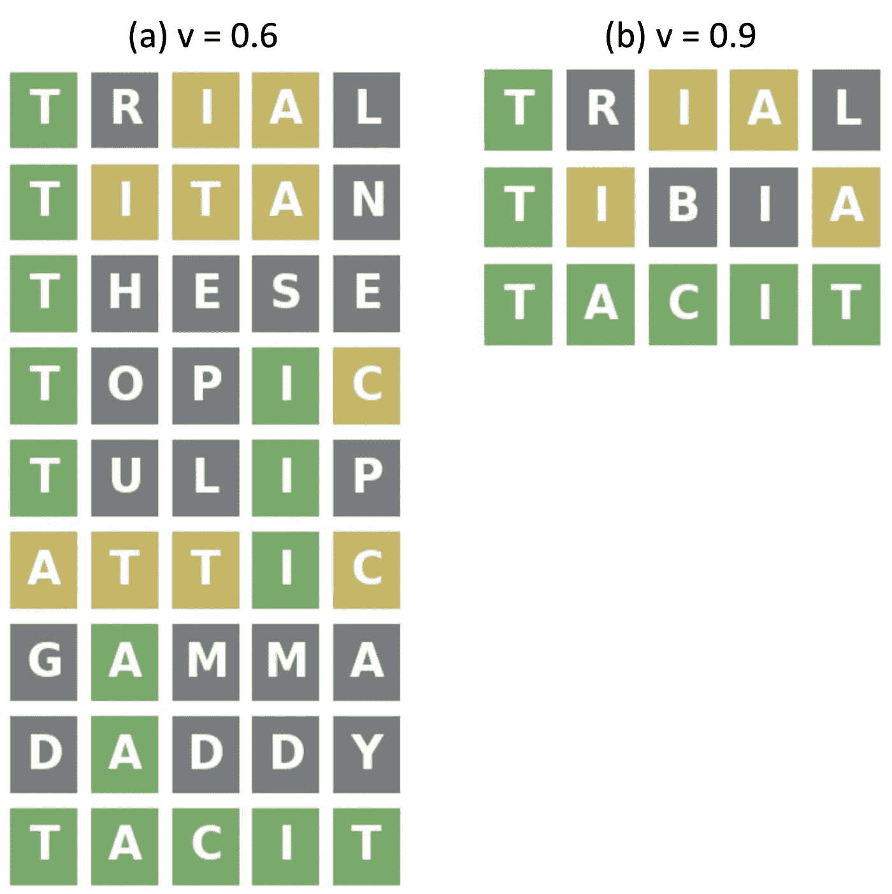

图 3:模拟器使用不同词汇设置玩的两个示例游戏。在(a)中，模拟器使用 v = 0.6，这意味着它的词汇只有 60%完成，因此，它倾向于在早期牺牲约束，导致更长的游戏。在(b)中，模拟器使用 v = 0.9，所以它的词汇表几乎是完整的，这意味着约束不太可能被牺牲。图片作者。

# 数据和方法

在这项研究中，我们将使用作者创建的两组不同的 Wordle 游戏数据:(I)从模拟器生成的大量模拟游戏中产生的数据集；以及(ii)在 Twitter 的许可下，根据其搜索 API 的学术许可条款，从与 Wordle 相关的推文中收集的真实世界游戏数据集。在适当的时候，我们计划在知识共享许可下发布这两个数据集，并将在可用时添加到这些数据集的链接。

为了生成模拟数据集，模拟器玩了一些游戏，其中来自 Wordle 的目标单词列表的 2309 个单词中的每一个都被用作单独的目标。此外，我们还将模拟器配置为使用每个目标单词作为可能的起始单词。这意味着一个完整的*模拟回合*由 5，331，482 (2，309 x 2，309)个个人游戏组成。

接下来，我们针对 10 种不同的词汇设置( *0.1 ≤ v ≤ 1* 以 0.1 为增量)完成单独的*模拟回合*。这意味着我们完整的模拟数据集由 53，314，820 个单独的游戏组成，对于每个游戏，我们记录以下数据:

1.  *目标词*:使用的目标词。
2.  *起始字*:使用的起始字。
3.  *v:使用的词汇设置。*
4.  *回合*:完成游戏所需回合数。
5.  *猜测值*:使用的猜测值。
6.  *提示*:每轮游戏结束后提供的一组提示。每个提示是一个由 5 个符号组成的字符串( *** 或 *+* 或 *X* 分别对应 Wordle 的绿色、黄色和灰色反馈)。
7.  *约束*:为每一轮选择猜测时满足的约束数组。

结果数据集表示为包含 53，314，820 行的单个表。每行对应一个游戏，上面的每一行都是它的列。在这个数据集中，有 329，401，297 个单独的回合、猜测和提示。表 1 显示了该数据的一个示例。

表 1:来自模拟数据集的 30 行的样本，示出了包括目标和开始单词、词汇设置(v)、游戏回合数、每回合的猜测以及每回合接收的提示的列的子集(“*”是绿色正方形；+'是黄色方块；x 是灰色正方形)。出于清晰和空间的原因，每个游戏所使用的约束已经被省略。

Twitter 上的 Wordle 游戏与“ *Wordle n r/6* ”形式的*签名*一起共享，其中 *n* 是当前游戏的号码， *r* 是当前游戏的回合数。为了构建 Twitter 数据集，我们使用 Twitter 搜索 API 来查找所有包含单词“Wordle ”,后跟游戏有效数字和使用适当正则表达式的有效“方块”序列的推文。总共收集了 15，373，887 个有效游戏(1，679，660 个独立玩家)，包括关于玩家 id、游戏 id、推文时间、日期、位置、语言和包含游戏的推文文本的数据，以及发布的单元格网格。表 2 显示了该数据的示例，该数据集总共包含 62，986，524 轮游戏(跨 15，373，887 场游戏)。

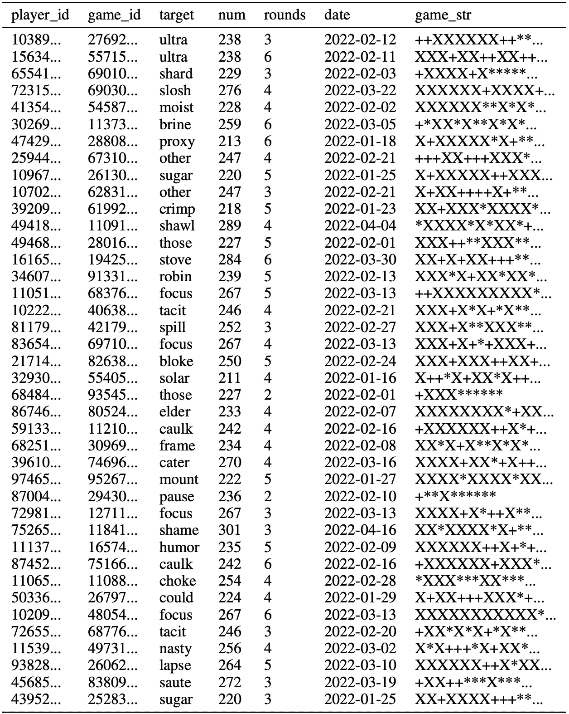

表 2:来自 Twitter 数据集的 30 行样本，显示了包括玩家和游戏 id、目标单词、游戏编号、每场游戏的回合数、游戏日期和游戏回合的翻译字符串的列的子集(' * '是绿色方块；+'是黄色方块；x 是灰色正方形)。玩家和游戏 id 是 Twitter 提供的作者和 tweet ids 的匿名版本。

# RQ1:比较模拟数据集和 Twitter 数据集

我们在这一部分开始分析，通过比较模拟数据集和 Twitter 数据集来确定前者是否提供了现实世界游戏的真实描述。鉴于模拟数据集包含各种词汇设置的游戏——其中一些可能无法代表真实的游戏——我们将从比较 Twitter 游戏和基于几个词汇设置的模拟游戏集开始。图 4 显示了给定长度游戏的*累积分数*的结果。例如，我们可以看到，大约 25%的游戏长度达到并包括 3 轮，尽管只有大约 10%的游戏具有最低的词汇设置。不出所料，随着 *v* 的增加，给定长度内游戏的累积分数也会增加；例如， *v = 0.1* 只有不到 40%的游戏在 6 轮或更少的回合中完成，但是 *v = 0.9* 几乎 90%的游戏都是成功的。

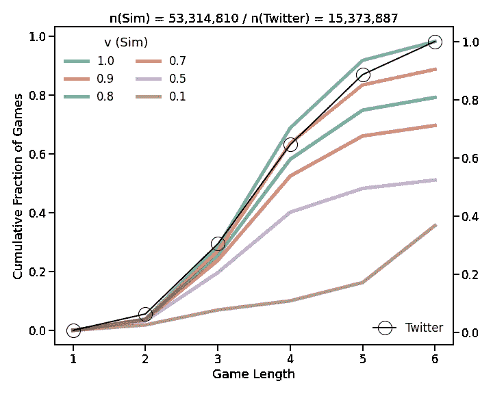

图 4:给定长度的模拟和 Twitter 游戏的*累积*部分。基于词汇设置对模拟游戏进行分组；v = 0.1，0.5，0.7，0.8，0.9，1。图片作者。

图 4 还显示了 Twitter 数据集的相应累积游戏分数(带圆形标记的黑线)，应该清楚的是，这些游戏最接近于模拟游戏，其中 *v = 0.9* 或*v = 1.0*；与 Twitter 相比，前者高估了较短游戏的比例，后者倾向于低估较短游戏的比例。这表明将 Twitter 游戏与模拟游戏的子集进行比较对于 *v ≥ 0.9* 是合适的。

事实上，图 5 显示了 Twitter 和模拟器的给定长度游戏的分数( *v ≥ 0.9* )，作为(a)每个游戏长度的实际游戏分数和(b)游戏长度增加的累积游戏分数。它展示了 Twitter 和模拟( *v ≥ 0.9* )数据集之间不完美但紧密的对应关系。前者的平均比赛时间为 4.09 回合，而后者为 4.01 回合；模拟器产生更多的 4 轮游戏，但更少的 6 轮游戏，但除此之外，两个数据集之间有非常强的对应关系。

这意味着我们可以有理由相信使用模拟数据集(v≥0.9*)作为真实世界游戏的合理近似。虽然这里没有显示，但当我们进一步将模拟数据集限制为仅使用与 Twitter 数据集相同的目标词的那些游戏时，我们在模拟数据集和 Twitter 数据集之间获得了更紧密的对应关系。在这种情况下，两个数据集的平均游戏长度为 4.09 轮，比较平均游戏长度的 *t 检验*表明两个数据集之间没有显著差异(*t = 0.406，p = 0.684* )。*

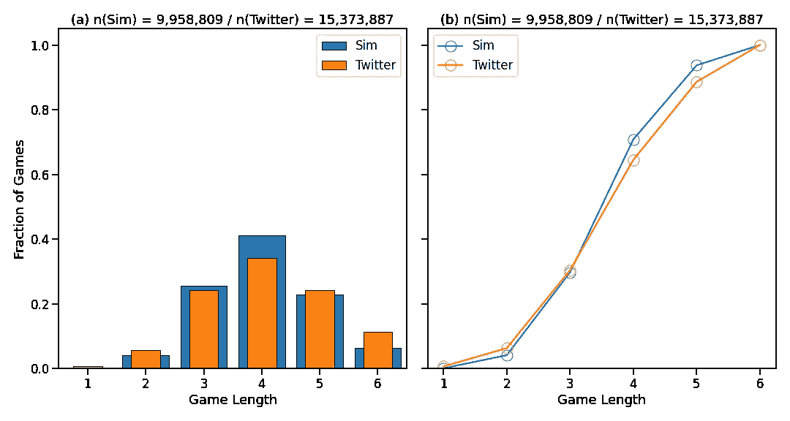

图 5:比较了(A)游戏(模拟和 Twitter)的游戏时长和(b)游戏(模拟和 Twitter)的累积游戏时长。注意，模拟游戏用 v ≥ 0.9。图片作者。

# RQ2:Wordle 的流行程度

在我们更详细地探索游戏的本质之前，让我们通过使用 Twitter 数据集来检查随着时间的推移在 Twitter 上发布 Wordle 游戏的独特每日玩家(新玩家和重复玩家)的数量，来考虑 Wordle 的增长和受欢迎程度。

为此，我们根据数据集中第一次出现的给定玩家 id(按日期排列)定义一个*新的*玩家，并将*循环/重复*玩家定义为在较早日期出现的玩家 id。然后，我们将 Twitter 数据按照日期和游戏号码的组合进行分组，并计算每个日期新玩家和重复玩家的出现次数。此外，对于每个日期，我们还计算重复出现的玩家发布的游戏的平均数量。

结果在图 6 中显示为每个日期的新玩家和回归玩家数量的堆积条形图，以及回归玩家发布的平均游戏数量的单独线图。它显示了 Wordle 在 2022 年 1 月期间的快速增长。这个月开始时，每天约有 10，000 名独立玩家在 Twitter 上发帖，但到了 1 月底，独立玩家总数迅速上升至近 250，000 人的峰值。自 2 月以来，在 Twitter 上发布游戏的独立玩家数量一直在下降，在撰写本文时，每天的独立玩家数量已降至约 10 万人；现在每天也只有不到 4000 名新玩家，低于每天约 50000 名新玩家的峰值。

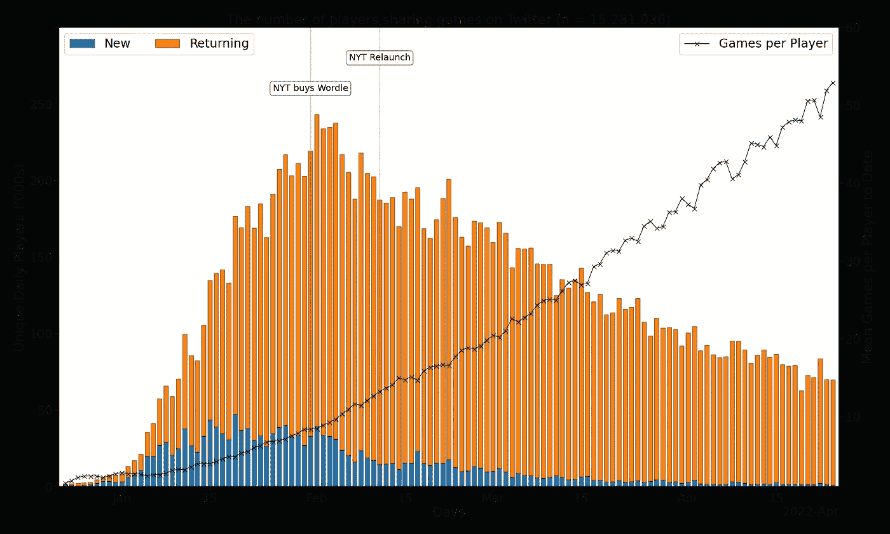

图 Wordle 在 Twitter 上的受欢迎程度，以日新增用户数和日返回用户数表示(左侧 y 轴)。还显示了《纽约时报》收购 Wordle 的日期和 NYT“重新推出”Wordle 的日期。还显示了每个返回玩家的平均游戏次数(右侧 y 轴)。图片作者。

这表明我们已经度过了巅峰时期，至少在 Twitter 上是这样，但这并不意味着 Wordle 的受欢迎程度正在下降。例如，大多数玩家继续私下玩是完全合理的。此外,《纽约时报》2 月份重新推出的 Wordle 肯定吸引了许多新玩家，即使他们不愿意在 Twitter 上分享他们的努力。

# RQ3:起始词的选择很重要吗？

在 Wordle 中，每局游戏开始时你都是独立的。没有提示可以指导你，所以大多数玩家试图使用一些明智的策略来选择一个可能与目标共享一些字母的单词。例如，有很多不同元音的单词通常是一个很好的选择，因为几乎所有的英语单词都至少有一个元音。带有普通辅音的单词，如“s”或“t”也是一个好主意，所以像*凝视*或*审判*这样的起始单词被证明是有效和受欢迎的。但这重要吗？有没有一小群客观上比别人强的潜在起始词？如果是，它们是什么，它们带来了多大的优势。

为了确定*最佳*起始词，我们将使用为 v ≥ 0.9 的所有游戏生成的模拟数据，因为这种词汇设置提供了与 Twitter(真实世界)数据的最佳拟合。在模拟数据中，我们已经为起始单词和目标单词的每种组合生成了游戏，这意味着我们使用 2，309 个可能的起始单词中的每一个和 2，309 个可能的目标单词中的每一个来玩游戏，并且对于两种词汇设置，总共产生 10，662，962 个游戏(*G*)(2，309 x 2，309 x 2)。

有几种不同的方法，我们可以评估一个开始字的性能。例如，一个显而易见的选项是，当使用游戏的每个开始单词时，计算它的平均游戏长度，如等式 1 和 2 所示，其中*回合(g)* 表示游戏中的回合数 *g* 。另一种替代方法是，在给定起始单词的情况下，计算获胜游戏的分数，即在 6 轮或更少轮中完成的游戏，如等式 3 所示；换句话说，一个好的开始词会产生更大比例的获胜游戏。还有一个选项是考虑短游戏(3 轮或更少轮的游戏)的部分和长游戏(需要 5 或 6 轮的游戏)的部分，如等式 4 和 5 所示。

对于这种分析，我们为 v ≥ 0.9 的模拟数据集的子集中的 2，309 个可能的起始词中的每一个计算上述度量。接下来，我们制作如图 7 所示的散点图，其中每个点对应于一个特定的起始单词，并根据其短游戏的比例(x 轴)和长游戏的比例(y 轴)位于图上。此外，每个点的直径与相应开始单词的获胜分数成比例，最后，每个点根据其平均游戏长度进行颜色编码，如所示的色标所示。这样，我们可以在一个二维散点图上呈现所有四个性能指标。

结果表明，开始词的选择很重要，因为我们可以看到短游戏和长游戏的比例以及平均游戏长度有相当大的变化。胜率的变化要小得多，平均为 93%，并且总是高于 89%。例如，右下象限中的单词与短游戏的高于平均分数和长游戏的低于平均分数相关联；短赛次数最高的词是 *LEANT* ，也有 93%的胜率，平均游戏时长 4.3 回合。相比之下，左上象限用于短游戏较少而长游戏较多的起始词； *BOBBY* 在这方面脱颖而出，因为它的长游戏数量最多，短游戏最少，胜率仅为 90%，平均游戏时长为 5 轮。如果你对优化胜率更感兴趣，那么最好的开始词可能是*毛绒*，因为它在所有开始词中胜率最高(94%)，但这是以更长的平均游戏长度(4.4 轮)、更少的短游戏和更多的长游戏为代价的。

图 7:模拟游戏中起始词的平均游戏长度分析(v ≥ 0.9)。每个标记对应于模拟器为给定起始单词产生的游戏，并且根据为给定起始单词产生的短游戏部分(x 轴)和长游戏部分(y 轴)来定位。每个标记基于相应开始单词的平均游戏长度进行颜色编码，并基于其相应的成功游戏分数来确定大小。水平虚线和垂直虚线分别表示长游戏和短游戏的平均分数。图片作者。

图 7 还包括媒体中经常提出的一些更常见的起始词(例如 *SLANT、SLATE、CRATE、TRACE* )。他们在这一分析中也做得很好，尽管不如 T2·利恩特做得好。

好的开始的好处和坏的开始的代价相比如何？要了解这一点，我们需要定义什么是好的开始或坏的开始。在 Twitter 数据集中，第二轮(我们认为是游戏的开始)后正确提示的中位数(绿色加黄色)仅为 2——顺便提一下，模拟数据集也是如此——因此我们可以说，根据等式 6 和 7，如果正确提示严格多于中位数，游戏就有一个好的开始，如果正确提示严格少于中位数，游戏就有一个坏的开始。

在我们的 Twitter 数据集中，几乎 17%的游戏开局不利，相比之下，48%的游戏开局良好；开局好的平均比赛时间是 4 轮，而开局不好的是 4.6 轮。因此，开局不利的成本大约是一轮的 0.6 倍。还不错，但这是全部情况吗？再深入一点，在图 8(a)中，我们看到了好的和坏的开始的游戏的累积分数，与平均游戏长度的简单比较相比，我们可以看到更多的实质性差异。例如，我们现在可以看到好的开始比坏的开始(大约 9%)产生更多的短游戏(大约 37%)；换句话说，良好的开局比糟糕的开局多 3 倍多的短比赛(长度≤ 3 轮)，如图 8(b)所示。因此，开局不利的真正代价主要体现在短距离比赛数量的大幅减少上。

图 8:基于对 Twitter 数据集中游戏的分析，一个好的开始的好处和一个坏的开始的代价。在(a)中，显示了具有良好开局的游戏与具有糟糕开局的游戏在给定游戏长度下的累积分数。在(b)中，条形图显示了在给定的游戏时间长度内，好的开始与坏的开始的相对比例。图片作者。

对模拟数据集执行相同的分析( *v > 0.9* )会产生大致相似的结果，如图 9 所示。

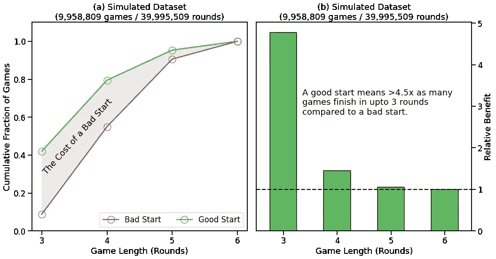

图 9:基于对 Twitter 数据集中游戏的分析，一个好的开始的好处和一个坏的开始的代价。在(a)中，显示了具有良好开局的游戏与具有糟糕开局的游戏在给定游戏长度下的累积分数。在(b)中，条形图显示了在给定的游戏时间长度内，好的开始与坏的开始的相对比例。图片作者。

# RQ4:为什么有些目标词比其他的更有挑战性？

在探索了最佳起始单词的问题之后，很自然地将我们的注意力转向目标单词。是不是有些目标词比其他的更有挑战性？如果是，那是为什么？自从《纽约时报》接手以来，沃尔多是否像一些人声称的那样变得更加困难了？我们可以定义一个目标词的难度，类似于我们评估一个起始词的好坏。根据等式 8-12，如果目标单词与较长的游戏、较低的胜率、较短游戏的较小部分或较长游戏的较大部分相关联，则该单词是困难的。

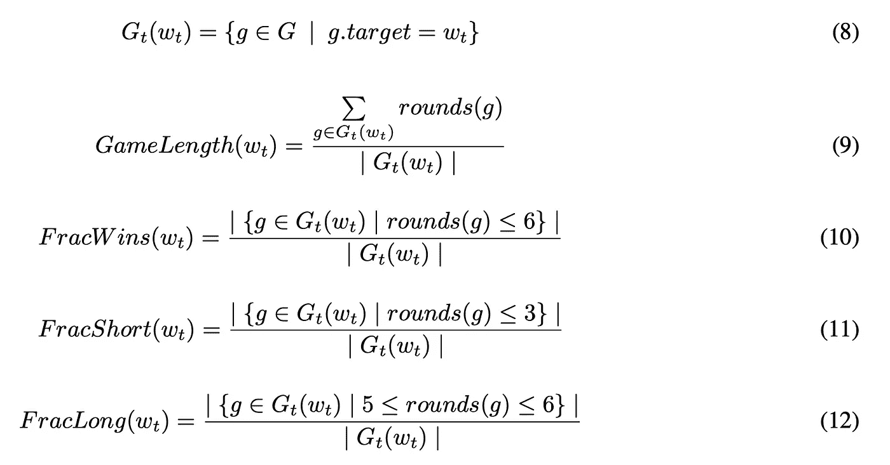

然后，使用模拟数据集(具有 *v ≥ 0.9* )我们可以为每个可能的目标词计算这些指标，并且，如同起始词的情况一样，我们可以产生图 10 所示的散点图来提供我们的发现的总结。与图 7 相比，这一次我们看到了一个稍微不同的开始词模式。虽然有些单词比其他单词更难(左上象限)，有些单词挑战性要小得多(右下象限)，但多空游戏之间的关系本质上并不是线性的。像 *JAUNT* 和 *MAMMY* 这样的词通常与漫长的游戏和极低的胜率联系在一起。相比之下，更容易的目标词，如*将*和*世界*，它们有 100%的胜率，并产生非常短的游戏。

图 10:模拟游戏目标词的平均游戏长度分析(v ≥ 0.9)。每个标记对应于模拟器为给定目标单词产生的游戏，并且根据为给定目标单词产生的短游戏部分(x 轴)和长游戏部分(y 轴)来定位。每个标记基于相应目标单词的平均游戏长度进一步进行颜色编码，并基于所产生的成功游戏的相应部分来确定大小。水平虚线和垂直虚线分别表示长游戏和短游戏的平均分数。图片作者。

为了进一步探索目标词的难度，通过 Twitter 数据集，我们重点关注短游戏和长游戏的比例。例如，图 11 显示了 Twitter 数据集中最近 100 个目标词的每个目标词的短期和长期游戏的比例(以条形表示);每个目标单词的平均游戏长度也显示为线形图。我们可以看到，大多数目标单词与短游戏的关联多于长游戏，但对于一些单词来说，情况正好相反。比如*刺*和*点*大约 50%的游戏是短的，而长游戏只占游戏的 10%左右。对比一下*的泔水*或*代理*，它们的长游戏比短游戏多。这表明*刺*和*点*对玩家来说没有*刺*或*代理*有挑战性，顺便提一下，这与使用模拟数据集评估单词难度的结果一致，因为*刺*和*代理*位于图 10 的左上角象限，而*刺*和*点*位于右下角象限；我们再一次发现模拟器和现实世界游戏之间有很强的对应关系。

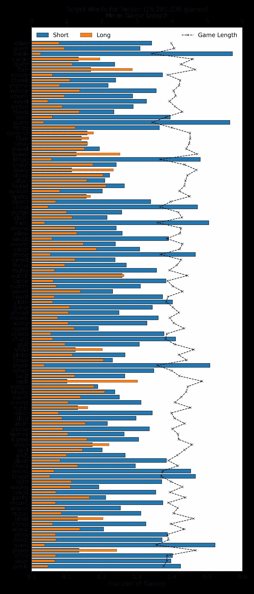

图 Twitter 数据集中 100 个最近的目标词的长短游戏比例；还显示了每个目标单词的平均游戏长度。图片作者。

我们将一个目标词的*难度比*定义为其长短局之比；参见等式 13。因此，*难度比> 0* 表示具有挑战性的单词——长游戏比短游戏多——而*难度比< 0* 表示更容易的单词，短游戏比长游戏多。比如像*点*这样的易词，难度比为-0.927(以*0.037/0.5211*为准)，而像*will*这样难度更高的词，难度比为 1.98(*. 301/. 101*)。

图 12 显示了 Twitter 数据集中所有目标词的难度比；难词(*难度比> 0* )显示为红色条，较容易的词显示为绿色条。这澄清了在数据集的那个时期，有一些单词变得更加困难。到目前为止，最难的单词是*will*，这也被认为是模拟器中最难的单词之一。相比之下，根据 Twitter 数据集，像*刺*和*点*这样的词是最容易的词，模拟数据集也是如此。

顺便提一下，这一分析也有助于回答这样一个问题，即收购《纽约时报》后，Wordle 是否变得更具挑战性。事实并非如此，至少没有证据表明，在收购或《纽约时报》重新推出 Wordle 之后，单词的平均难度或更难单词的出现频率有所变化。

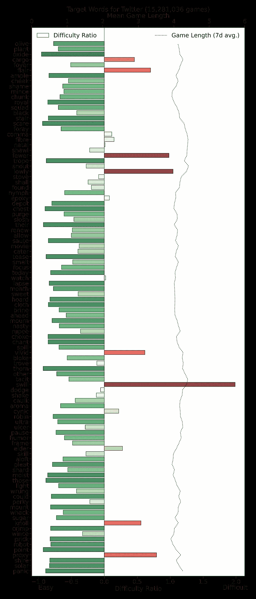

图 12:Twitter 上 100 个最近的目标词的难度比(条)，以及游戏长度的 7 天滚动平均值(虚线)。图片作者。

鉴于一些单词确实比其他单词更具挑战性——无论是在模拟数据集还是在 Twitter 数据集上——我们能说些什么原因呢？一种可能是，不常用的单词更难，因为它们不太可能成为人们的首选，即使我们已经学会的提示将它们挑选出来。同样，字母不常见的单词也可能更难。但还有另一个疑点，当我们查看 Twitter 上的困难单词子集时，我们可以看到:大多数具有正难度比率的单词都有重复的字母(例如， *ABBEY，KNOLL，SKILL，SWILL，VIVID，lompty*)。在猜测 Wordle 时，很自然地会倾向于选择没有重复字母的单词，以最大限度地增加某些字母与目标单词重叠的机会，而且，当我们猜测一对重复字母中的一个时，Wordle 不会提供任何迹象表明一个单词中可能有第二个这样的字母。

因此，我们对单词困难有三种可能的解释——不常用的单词、不常用的字母和重复的字母——可以通过测量来确定它们在困难单词和容易单词之间是否不同。例如，使用现有的英语单词数据集，我们可以计算给定的 5 个字母单词的频率，并将其用作单词频率归一化测量的基础，如等式 14 所示；因此，NormWordFreq(wt) > 1 意味着 wt 比一般单词更常见。同样，我们可以根据等式 16，基于字母在 5 个字母的单词中出现的频率来计算相应的字母频率的归一化度量(等式 15)；因此， *NormLetterFreq(wt) > 1* 意味着给定目标单词的平均字母频率大于平均值。

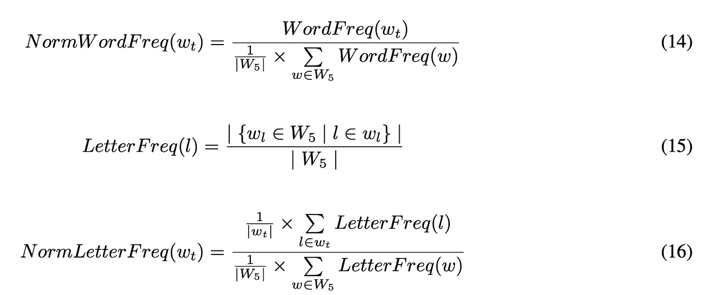

然后，我们可以使用等式 14 和 16 来计算困难单词(那些具有*难度比> 0* 的单词)和简单单词(*难度比< 0* 的单词和字母的平均频率。我们还可以计算包含重复字母的难/易单词的分数，并将其归一化为包含重复字母的 5 个字母单词的总分数。这些结果如图 13 所示。他们证实了我们的假设:难词远不如易词常见(图 19(a))，它们的字母也不太常见(图 19(b))，但难词更有可能有重复的字母(图 19(c))。

图 13:对单词和字母级别的频率以及重复字母的可能性的分析，有助于解释为什么一些目标单词比其他单词更难:困难的目标往往不太常见，涉及更多不寻常的字母，并且更可能有重复的字母。在每个图中，频率数据被归一化，使得值 1 对应于 5 个字母单词的平均值(用水平虚线表示)。图片作者。

# RQ5:Wordle 的约束有多重要？

既然我们已经分析了起始词和目标词，是时候把注意力集中在一般的游戏玩法上了，特别是如何进行猜测。对于玩家来说，选择满足当前已知目标单词的猜测单词有多重要？玩家能承受牺牲一些约束而仍然玩得很好吗？哪些约束条件在使用时会提供更多有用的信息？

由于 Twitter 数据集不包含关于猜测的具体信息，因此不能用来回答这个问题。相反，我们将专门关注完整的模拟数据集；即使用 *v* 的所有值。使用缩减词汇设置的游戏与大量牺牲的约束相关联，这将允许我们的分析考虑约束使用的全部范围。

模拟数据集包括模拟器使用的约束条件的逐轮说明；每轮最多可关联 4 个约束(*正确字母、正确位置、错误字母、错误位置)*。我们可以计算每一轮游戏的错过的约束的数量，并根据等式 17 和 18 使用它来计算每轮游戏的错过的约束的平均数量；*Gi . used【r】*是指游戏 *Gi* 第 *r* 轮使用的约束集合。

接下来，我们计算具有给定词汇设置(v)的所有游戏的平均游戏时间和胜率，记录每轮对于每个值 *v* 错过的约束的平均数量。结果如图 14 所示。请注意每轮错过的约束条件的数量是如何随着 v 值的增加而减少的，因为当目标单词不在模拟玩家的词汇中时，模拟器会牺牲约束条件。例如，当只有 10%的目标单词在词汇表中( *v = 0.1* )时，平均每轮牺牲 0.86 个约束，这意味着大多数轮将牺牲至少一个约束。但是当 *v = 0.8，*则每轮只牺牲 0.41 个约束；因此，在 5 轮游戏中会牺牲 2 个约束(0.41 × 5 个约束)。并且当 *v = 1* 时，所有约束总是得到满足。

图 14 中的结果显示，随着牺牲越来越多的约束，平均游戏时间增加，平均胜率降低。例如， *v = 0.8* (每回合 0.41 个错过的约束)导致游戏的平均游戏时长刚刚超过 5 回合，胜率约为 80%，但对于 *v = 0.4* (每回合 0.77 个错过的约束)，平均游戏时长增加到 7 个，只有约 40%的游戏成功。

图 14:不同词汇设置的平均游戏长度(和获胜的比例)。对于每个词汇表配置，每轮遗漏的约束的平均数显示在括号中。图片作者。

因此，错过的约束在游戏长度和胜率方面对游戏性能有实质性的影响，但是一些约束比其他的更重要吗？使用不同的约束条件可以获得多少信息？为了测试这一点，我们需要将我们的分析从基于游戏——也就是说，查看单个游戏的各种属性——转移到基于回合的分析。换句话说，我们将开始查看在游戏中做出的个人猜测。到目前为止，基于游戏的关注意味着我们的分析已经在 5300 万个项目(游戏)的大集合上运行。现在，我们将把它转换成一个更大的数据集，包含超过 3.29 亿个项目(轮次/猜测)。对于这个分析，我们对两件事感兴趣:(1)猜测满足了哪些约束，以及(2)从猜测中了解了多少新信息？

我们转换后的数据集包含一条记录，记录了在特定猜测过程中使用了四个可能约束条件中的哪一个——*正确的字母、正确的位置、不正确的字母、不正确的位置*——因为模拟器保存了这些信息。为了估计通过猜测获得的新信息，我们使用 Wordle 的反馈，通过计算该猜测收到的绿色和黄色提示的总数。我们将绿色和黄色提示的数量称为*正确信息*的数量，这样，随着回合的展开，正确信息数量的差异就可以衡量猜测的有用程度。

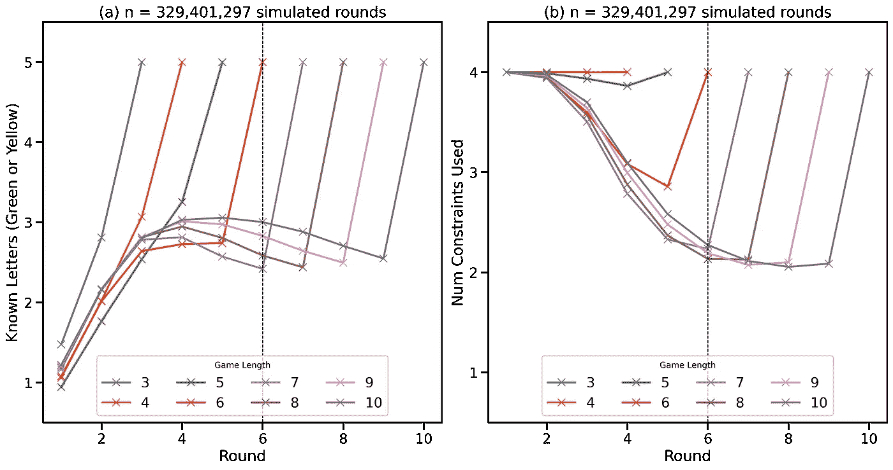

图 15: (a)对于不同的游戏总长度，每轮游戏中已知字母(绿色或黄色提示)的总数。(b)对于不同的总游戏时间长度，每轮使用的限制的数量。图片作者。

例如，在图 15(a)中，我们看到对于不同长度的游戏，每一轮获得了多少正确的信息。例如，对于短游戏(游戏长度= 3)，平均来说(模拟的)玩家在他们最初的猜测之后学习到 1.5 条正确的信息。他们的第二次猜测给他们带来了大约 3 条正确的信息，然后他们在第三次猜测中猜对了所有 5 个字母。对于更长的游戏，新信息的积累遵循越来越浅的轨迹，至少对于模拟器来说，在长时间游戏(> 6 轮)中，新的猜测可能导致比前一轮更少的信息。当玩家开始忽略约束条件，从而猜测可能违反目标单词已知信息的单词时，这种情况就会发生。事实上，在图 15(b)中有一个相应的图，显示了每一轮满足的平均约束数，我们可以看到随着模拟器牺牲越来越多的约束，游戏长度是如何增加的；这类似于上面图 14 中所示的，但是基于不同游戏长度的一轮接一轮，并使用每轮使用的实际限制数。

哪些约束更重要或更不重要是一个更复杂、更微妙的问题。我们建立一个回归模型，使用从猜测中获得的正确信息量作为*因变量*，使用四种约束类型的二元变量作为自变量。我们还包括游戏回合作为一个额外的独立变量，以确定其对新获得的信息的影响。因此，我们的模型被设计来预测从基于使用的约束和游戏回合的猜测中获得的新信息的量。

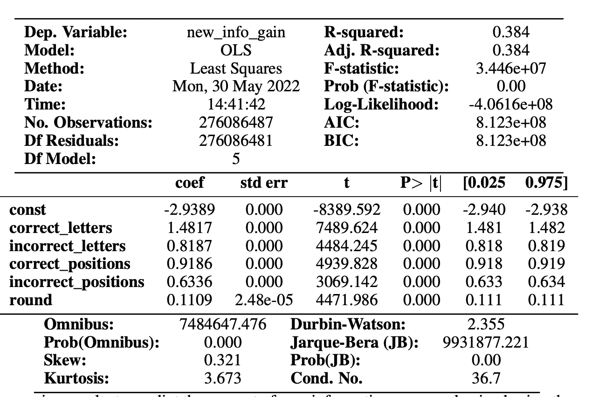

表 3。使用约束和轮数作为独立变量，预测每轮获得的新信息量的 OLS 回归结果。

得到的模型作为预测模型不是很好；见表 3。其调整后的 R2 值仅为 0.38，这意味着每轮获得的新信息量中只有约 38%的变化是由约束和游戏回合解释的；这并不奇怪，因为这很大程度上取决于实际猜测的细节和目标词等。然而，我们对这个模型作为预测模型有多好并不感兴趣，而是对它如何被用作解释模型感兴趣。特别是，我们对独立变量的系数感兴趣，它告诉我们它们在每次猜测获得的新信息数量方面的相对重要性；这些系数显示在表 3 的【T2 系数】栏中。

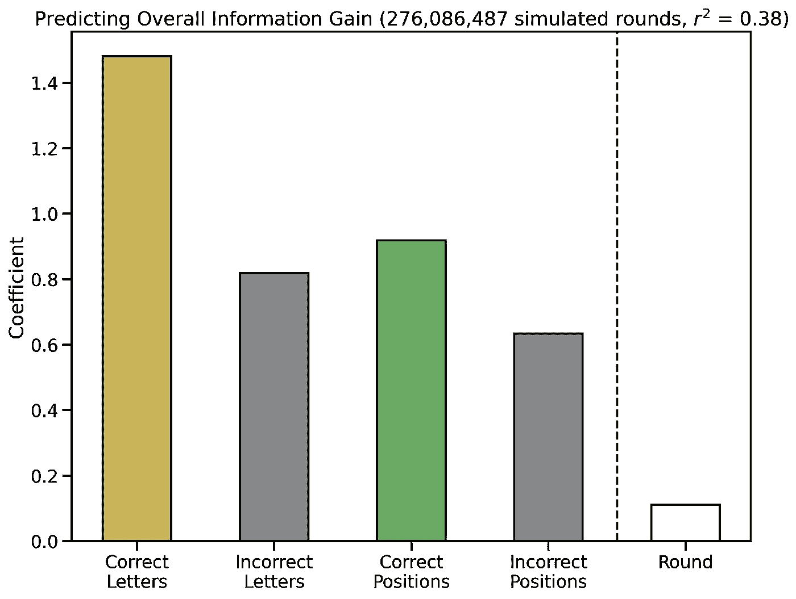

图 16:线性回归中每个独立因素的回归系数，用于预测每次猜测/轮次的总体信息增益。图片作者。

图 16 显示了每个独立变量的这些系数的值。它们可以解释为自变量单位变化的因变量(获得的新信息)的变化，同时保持所有其他自变量不变；由于约束变量是二进制的，单位的改变意味着约束被使用。因此，我们可以看到，当遵守*正确* *字母*约束时，平均获得 1.4 个单位的新信息，相比之下，当使用*正确位置*约束时，仅获得不到 1 个单位的新信息。相比之下，*不正确的字母*和*不正确的* *位置*约束对获得的新信息量的影响更小。因此，我们可以得出结论，在所有其他条件相同的情况下，正确的字母和位置约束是最重要的，其次是不正确的字母约束，然后是不正确的位置约束。

游戏回合的效果不太重要。它具有正系数的事实意味着，在所有其他条件相同的情况下，后几轮往往比前几轮产生更多的新信息。

本节的结果显示了玩家在进行猜测时使用他们在前几轮中所学知识的重要性，因为牺牲一些约束条件，即使是一点点，也会影响游戏性能，并限制新信息的积累。正确的字母和位置约束比不正确的字母和位置约束更重要，这表明如果玩家必须牺牲一个约束，那么他们应该考虑在牺牲正确的字母或位置约束之前牺牲不正确的字母或位置约束。

值得指出的是，这是一个相当简单化的分析。例如，所使用的模型没有考虑约束之间可能存在的任何相互作用，而通过显式地模拟这种相互作用的影响来改进它是可能的。然而，作为一个解释性的模型，它对我们的目的是足够有用的，所以进一步的改进是作为未来工作的一个问题。

# 结论

Wordle 是一款简单的在线猜词游戏，于 2022 年初开始流行。每天选择一个新的(秘密的)5 个字母的目标单词，玩家试图通过一系列多达 6 次的猜测来识别这个单词。本文描述了使用模拟和真实世界游戏数据集对 Wordle 进行的大规模数据分析。通过比较模拟数据集和 Twitter 数据集，我们表明模拟器能够再现相当真实的游戏过程，进一步的分析发现了以下情况:

1.  好的开始字导致更短和更成功的游戏，并且有与较差的开始字相关联的显著成本；在模拟和真实世界/Twitter 数据集的分析中观察到了类似的成本。
2.  相当多的少数玩家(17%)似乎使用了糟糕的起始词，因此承诺使用更可靠的起始词会有所收获。
3.  一些目标单词比其他单词更具挑战性，尤其是当它们不常见或包含重复字母时。在这方面，我们再次看到模拟器和 Twitter 数据集之间的强烈对应。
4.  关注 Wordle 的反馈对于短游戏是必要的，关注正确的字母和位置比不正确的字母和位置更重要。

# 参考

1.  3 蓝色 1 棕色。哦，等等，其实最好的开瓶器不是“鹤”。。。。 *YouTube* (2022)。
2.  3 蓝色 1 棕色。[用信息论解单词](https://www.google.com/url?sa=t&rct=j&q=&esrc=s&source=web&cd=&ved=2ahUKEwi_ztKpgNP3AhURXsAKHYTZAkwQwqsBegQIAhAB&url=https%3A%2F%2Fwww.youtube.com%2Fwatch%3Fv%3Dv68zYyaEmEA&usg=AOvVaw2-deENbPZ9E9-FMvY3jFQk)。 *YouTube* (2022)。
3.  ALIYARI，h .，SAHRAEI，h .，DALIRI，M. R .，MINAEI-BIDGOLI，b .，KAZEMI，m .，AGAEI，h .，SAHRAEI，m .，HOSSEINI，S. M. A. S .，HADIPOUR，M. M .，MOHAMMADI，m .等人。[电脑游戏压力对玩家认知功能的有益或有害影响](https://www.ncbi.nlm.nih.gov/pmc/articles/PMC6037427/)。*基础与临床神经科学 9* ，3 (2018)，177。
4.  ANDERSON，B. J .和 MEYER，J. G. [使用最大正确字母概率和强化学习为 wordle 寻找最佳人类策略](https://arxiv.org/abs/2202.00557)。arXiv 预印本 arXiv:2202.00557 (2022)。
5.  我们亲爱的沃尔多究竟发生了什么事？ *《卫报》*(2022 年 2 月)。
6.  APPEL，A. W .和 JACOBSON，G. J. [世界上最快的拼字游戏程序](https://dl.acm.org/doi/10.1145/42411.42420)。*美国计算机学会第 31 届会议公报*，5 (1988)，572-578 页。
7.  阿基米德。[Wordle——为什么我总是猜同样的四个字。](https://www.google.com/url?sa=t&rct=j&q=&esrc=s&source=web&cd=&ved=2ahUKEwicqtSAgdP3AhXQWMAKHY9LCH8QFnoECAUQAQ&url=https%3A%2F%2Fwww.youtube.com%2Fwatch%3Fv%3Dl92g6Yy8t5g&usg=AOvVaw0h-x5IHxfkEOWUR-LRiI3t) *YouTube* (2022)。
8.  使用自动规划的推箱子谜题的人工智能辅助设计[。在*艺术、互动和游戏创作国际会议* (2021)，斯普林格，第 424–441 页。](https://www.google.com/url?sa=t&rct=j&q=&esrc=s&source=web&cd=&ved=2ahUKEwiP052dgdP3AhXNesAKHfi9CJIQFnoECAMQAQ&url=https%3A%2F%2Flink.springer.com%2Fchapter%2F10.1007%2F978-3-030-95531-1_29&usg=AOvVaw0kfYdEl9T7QV5SLcZzUzqz)
9.  BARLACCHI，g .、NICOSIA，m .和 MOSCHITTI，A. [学习对自动解决纵横字谜的候选答案排序](https://aclanthology.org/W14-1605/)。《第十八届计算自然语言学习会议论文集》 (2014)，第 39–48 页。
10.  BONTHRON，M. [将一个近似值作为 Wordle 的策略进行排序](https://arxiv.org/abs/2204.06324?context=cs)。arXiv:2204.06324 (2022)。
11.  视频游戏对人类(和兽人)创造力的影响。在*视频游戏和创意*。爱思唯尔，2015 年，第 39-60 页。
12.  曹，s .和达希尔，I. [文字是如何成为互联网上的一种大众娱乐的。 *Buzz Feed 新闻*(2022 年 1 月)。](https://www.google.com/url?sa=t&rct=j&q=&esrc=s&source=web&cd=&ved=2ahUKEwis7cfcgtP3AhVDQEEAHR-2BywQFnoECAgQAQ&url=https%3A%2F%2Fwww.buzzfeednews.com%2Farticle%2Fstefficao%2Fhow-wordle-went-viral-strategy&usg=AOvVaw0T24bIAsPXPU2sEzIBAJN-)
13.  这些数字告诉我们什么是最好的和最差的单词开头。*《卫报》*(2022 年 2 月)。
14.  CHESANI，p . MELLO，M. [解决数学难题:人工智能的挑战性竞赛](https://www.google.com/url?sa=t&rct=j&q=&esrc=s&source=web&cd=&ved=2ahUKEwjMqpyIwIf4AhWzolwKHWKlBK4QFnoECAYQAQ&url=https%3A%2F%2Fojs.aaai.org%2Findex.php%2Faimagazine%2Farticle%2Fview%2F2736%2F2653&usg=AOvVaw3NTQZ5Qqout6MLXMcb4ZXR)。*艾杂志 38* ，3 (2017)，83–96。
15.  科尔曼、T. H .、莱瑟森、c .、里维斯特、r .、斯坦恩、C. [*算法导论，II*](https://mitpress.mit.edu/books/introduction-algorithms-second-edition) *。马萨诸塞州剑桥*。麻省理工学院出版社，2009 年。
16.  CRANFORD，E. A .、LEBIERE，c .、GONZALEZ，c .、COONEY，s .、VAYANOS，p .和 TAMBE，M. [通过模拟了解网络欺骗:在 Stackelberg 安全游戏中使用欺骗性信号预测人类决策](https://cogsci.mindmodeling.org/2018/papers/0067/0067.pdf)。在 *CogSci* (2018)。
17.  使用字符统计为 wordle 选择种子词。arXiv:2202.03457 (2022)。
18.  埃里克森、K. I .、布特、W. R .、巴萨克、c .、奈德、M. B .、普拉卡什、R. S .、VOSS、M. W .、格雷比尔、A. M .、西蒙斯、D. J .、法比亚尼、m .、格拉顿等。[纹状体体积预测视频游戏技能获得水平。](https://watermark.silverchair.com/bhp293.pdf?token=AQECAHi208BE49Ooan9kkhW_Ercy7Dm3ZL_9Cf3qfKAc485ysgAAAsUwggLBBgkqhkiG9w0BBwagggKyMIICrgIBADCCAqcGCSqGSIb3DQEHATAeBglghkgBZQMEAS4wEQQMXCairo9faCO7BAaWAgEQgIICeAFTzjKUZPFVlCWT90-TIVcx5ycVBa6Fpcf_Vj2D1r3lvJnEnMNbE3674Oi1XbZkY1LZ4qY4eiwBhShyYRWmY5PtMtJjcM700PUPjhGFcq4nJ28kXAonqW0swx5ujRmUsAoMQZWo_mkQ5ALYVed2-0eBjwo0JCYEKgeoMsuoc-G01V69clNIF-dgCBv5dtmQcpTOsFfEV2BoOnsaOQfB14lF4VzR2kxgosSmC_Kru2HcqpuCpuZTjL1cxQiGExd3cyIBeindy6Hocyk-7NiOB-CZ7qAtBwZ9xIAqLrydRi1x0Beks3PPVB5H4g3U0I_ehSAFg9kE_w2uxqPAekjUD5NMQ9UMy8Hkf8XNN5wsYXqWy54_vbsN9OAunIped1UDWKLub7tioQkgKIFNvznqd96JOq2kmy9oVuEhBE32m6pePdb0HrrbKgTb3YuymZJ4845rK1w-V3tQZ3jFVnwROVBQHl-xXdIILuDcrJHlWUv_tX59o5T2VwP-uxoX6RtnIQayIFYbijlAM4FtcPD6atvDKTmmOFKkHlVoSYypGwfASnG8XD_Ts71-z-eXxGJ8ucAdXHPnk_0hlQm-dtvRl1wvPXVBlWEneKQnk1yuWisf84NK-yG8DixLnl0nR54K_k15Ga4HnvUWiIufw46mE0lezwraSd87wberWbK1VFTJNXypzJtsSBphP4GYV977capftpZizCE5JAs_cYVHlZ3EU4ifrvYWuEKOr30iuqOuY0r8xu_2Xd_hfuiZ9mDSVL-1ce6c-OPP1xqhFTxbEHbNbh2WDQiZu87_ZBssXD-JclpCEuZsoq-kl2MSnsIxtzCzFIWWGD_c) *大脑皮层 20* ，11 (2010)，2522–2530。
19.  厄南德斯，m .，安吉利尼，g .，和戈里，m .韦伯克劳:[一个基于网络的纵横字谜系统](https://www.google.com/url?sa=t&rct=j&q=&esrc=s&source=web&cd=&ved=2ahUKEwiav42lwYf4AhWHi1wKHVBhD-8QFnoECA4QAQ&url=https%3A%2F%2Fwww.aaai.org%2FPapers%2FAAAI%2F2005%2FAAAI05-224.pdf&usg=AOvVaw35bZstUV_sh7zQfndC4VKO)。载于 *AAAI* (2005)，第 1412–1417 页。
20.  FRUTOS-PASCUAL，m .和 ZAPIRAIN，B. G. [综述 AI 技术在严肃游戏中的应用:决策和机器学习](https://ieeexplore.ieee.org/document/7366548)。《IEEE 计算智能与人工智能汇刊》第 9 期，第 2 期(2015)，第 133–152 页。
21.  《代码和数字中的生活:当香农遇到图灵》。*电子观想与艺术**(EVA 2017)*(2017)，51–58。
22.  Wordle 中数学上最佳的第一次猜测。 *中* (2022)。
23.  GOPHER，d .，WELL，m .，和 BAREKET，T. [从电脑游戏训练师到飞行的技能转移](https://journals.sagepub.com/doi/abs/10.1177/001872089403600301?journalCode=hfsa)。人类因素 36 ，3 (1994)，387–405。
24.  GRACE，k .、SALVATIER，j .、DAFOE，a .、ZHANG，b .、EVANS，o .[AI 什么时候会超过人类的表现？来自人工智能专家的证据](https://journals.sagepub.com/doi/abs/10.1177/001872089403600301?journalCode=hfsa)。*人工智能研究杂志 62* (2018)，729–754。
25.  格雷策，F. L .，赫什曼，R. L .，凯利，R. T. [防空游戏:研究人类行为的微型计算机程序。](https://archive.org/details/DTIC_ADA1027251) *行为研究方法&仪器仪表 13* ，1 (1981)，57–59。
26.  GROSZ，b .、KRAUS，s .、TALMAN，s .、STOSSEL，b .和 HAVLIN，M. [社会依赖对决策的影响:一个新游戏的初步调查。](https://dash.harvard.edu/bitstream/handle/1/2640578/Grosz_InfluenceSocial.pdf;jsessionid=80479CC1D14F8712CEC09417866B94A3?sequence=2)在*关于自主代理和多代理系统的国际联合会议* (2004)，IEEE，第 782–789 页。
27.  霍尔，R. [Wordle 的创造者被全球成功的热门拼图所淹没。](https://www.theguardian.com/games/2022/jan/11/wordle-creator-overwhelmed-by-global-success-of-hit-puzzle) *守护者*(2022 年 1 月)。
28.  哈姆金斯，J. D. [无限世界和主谋数字](https://arxiv.org/pdf/2203.06804)。arXiv 预印本 arXiv:2203.06804 (2022)。
29.  HARGREAVES，I. S .，PEXMAN，P. M .，ZDRAZILOVA，l .，和 SARGIOUS，P. [爱好如何塑造认知:竞争性拼字游戏玩家的视觉单词识别。](https://pubmed.ncbi.nlm.nih.gov/21837576/) *记忆&认知 40* ，1 (2012)，1–7。
30.  m . HENZ 和 H.-M .张[Sudokusat——一种分析困难数独谜题的工具。](https://www.comp.nus.edu.sg/~henz/papers/ps/IWAAI2007.pdf)在*人工智能工具和应用*中。斯普林格，2009 年，第 25-35 页。
31.  HUCK，J. T .，DAY，E. A .，LIN，l .，JORGENSEN，A. G .，WESTLIN，j .和 HARDY III，J. H. [认知好奇心在基于游戏的学习中的作用:区分技能习得和适应。](https://www.researchgate.net/profile/Jonathan_Huck/publication/338413052_The_Role_of_Epistemic_Curiosity_in_Game-Based_Learning_Distinguishing_Skill_Acquisition_From_Adaptation/links/5e7116c092851c93e0aa2719/The-Role-of-Epistemic-Curiosity-in-Game-Based-Learning-Distinguishing-Skill-Acquisition-From-Adaptation.pdf) *模拟&游戏 51* ，2 (2020)，141–166。
32.  凯利，R. T .、格雷策，F. L .、赫什曼，R. L. [防空:研究人类行为的电脑游戏。科技。1981 年，加利福尼亚州圣地亚哥海军人事研究与发展中心代表。](https://apps.dtic.mil/sti/pdfs/ADA102725.pdf)
33.  玩虚拟积木:作为实践与研究的学习环境。在*数字化语境中的认知发展*。爱思唯尔，2017 年，第 145–166 页。
34.  LEE，d .，CONROY，M. L .，MCGREEVY，B. P .，和 BARRACLOUGH，D. J. [猴子在竞争游戏中的强化学习和决策。](https://www.sciencedirect.com/science/article/pii/S0926641004001971?casa_token=iXdx3tVDI-sAAAAA:CzCux8rwujQc7sYmfhoFpXVpS_HN9cIXQJ_awkuheucesOTRhZbOnWTGeetfEMDvydTtd9_08A) *《认知大脑研究》22* ，1 (2004)，45–58。
35.  LEE d .、MCGREEVY b . p .和 BARRACLOUGH d . j .[猴子在石头剪刀布游戏中的学习和决策](https://www.sciencedirect.com/science/article/pii/S0926641005001953?casa_token=39RIw9CMwSEAAAAA:Qb1_q-xZ43dOX7MC09T7rtv-DoWHUm9-2mdlL4LaoO2oRdj64m3jrY8GiVT0vzC6DbrRWT8pnw)。*认知大脑研究 25* ，2 (2005)，416–430。
36.  LIAPIS，a .，YANNAKAKIS，G. N .，TOGELIUS，J. [计算游戏创意。](https://www.um.edu.mt/library/oar/bitstream/123456789/29473/1/Computational_game_creativity_2014.pdf)第五届国际计算创意大会 (2014)，ICCC。
37.  LITTMAN，M. L .，KEIM，G. A .，和 SHAZEER，N. [一种解决纵横字谜的概率方法](https://www.sciencedirect.com/science/article/pii/S000437020100114X/pdf?md5=f1101e59f30f73a547254373194d2ca6&pid=1-s2.0-S000437020100114X-main.pdf&_valck=1)。*人工智能 134* ，1–2(2002)，23–55。
38.  利特曼，M. L .，凯姆，G. A .，和沙泽尔，N. M. [用谚语解决纵横字谜](https://www.aaai.org/Papers/AAAI/1999/AAAI99-135.pdf)。在 *AAAI/IAAI* (1999)，第 914-915 页。
39.  LOCK，s .[wordle 是不是越来越难了？](https://www.theguardian.com/media/2022/feb/14/is-wordle-getting-harder-viral-game-tests-players-after-new-york-times-takeover) *守护者*(2022 年 2 月)。
40.  LOKSHTANOV d .和 SUBERCASEAUX b .[Wordle 是 np-hard](https://arxiv.org/pdf/2203.16713) 。arXiv:2203.16713 (2022)。
41.  什么是 wordle？新的病毒性文字游戏取悦互联网。 *卫报*(2021 年 12 月)。
42.  MANTERE 和 j . KOLJONEN[用遗传算法解决、评定和生成数独谜题。2007 年 IEEE 进化计算大会 (2007)，IEEE，第 1382–1389 页。](https://ieeexplore.ieee.org/iel5/4424445/4424446/04424632.pdf?casa_token=h0k6qWk31RIAAAAA:OGJ1OJ3q3wtHWOBFU1O3vuaTidajs1JEZ2ceWGfTgpz9fFXlN6rm0lXBQAjsPclvRnTtkjXK4QE)
43.  MANZINI、s . ELLIS 和 J. [文字游戏:使用认知计算作为人工智能解谜的基础](https://www.researchgate.net/profile/James-Hendler/publication/291388283_A_Play_on_Words_Using_Cognitive_Computing_as_a_Basis_for_AI_Solvers_in_Word_Puzzles/links/56c24cc608ae44da37ff78dd/A-Play-on-Words-Using-Cognitive-Computing-as-a-Basis-for-AI-Solvers-in-Word-Puzzles.pdf)。*人工通用智能杂志 6* ，1 (2015)，111。
44.  莫兰，C. [14 个最好的“单词”克隆体，因为一天一个单词是不够的](https://www.google.com/url?sa=t&rct=j&q=&esrc=s&source=web&cd=&ved=2ahUKEwiD1PyX6Yf4AhW4QkEAHcelBY4QFnoECAkQAQ&url=https%3A%2F%2Fmashable.com%2Farticle%2Fbest-wordle-clones-alternatives&usg=AOvVaw24piuxYORnjOCv84JA-S-B)。*可混搭*(2022 年 3 月)。
45.  马兹拉克，L. J. [利用优先关系计算机构造纵横字谜](https://www.sciencedirect.com/science/article/abs/pii/0004370276900199)。*人工智能 7* ，1 (1976)，1–19。
46.  纵横字谜中元素的机器选择:计算语言学的应用。 *《暹罗计算杂志》5 期*，1 期(1976)，51–72 页。
47.  麦克甘，伊萨尔特尔，海德曼和康伦。跳过。跳。游戏:“有原则的”锻炼游戏对儿童运动技能获得的影响。 *英国教育技术杂志。51* ，3 (2020)，798–816。
48.  莫法特特区，克龙比，w .和沙巴丽娜，O. [一些电子游戏可以增加玩家的创造力。](https://researchonline.gcu.ac.uk/ws/files/25379976/moffat_IJGBL_7_2_article.pdf) *国际基于游戏的学习杂志(IJGBL) 7* ，2 (2017)，35–46。
49.  新生，M. [卡斯帕罗夫对深蓝:计算机国际象棋成熟了。施普林格科学公司商业媒体，2012 年。](https://books.google.com/books?hl=en&lr=&id=IiXjBwAAQBAJ&oi=fnd&pg=PA2&dq=Kasparov+versus+Deep+Blue:+Computer+chess+comes+of+age&ots=_M0qTviIOC&sig=CsZacvQK9SkLr7XhhzPvV11b-0Y)
50.  NEWELL，a .，SHAW，J. C .，和 SIMON，H. A. [下棋程序和复杂性问题。](https://ieeexplore.ieee.org/abstract/document/5392645/)*《IBM 研究与发展杂志》2* ，4 (1958)，320–335 页。
51.  PRAKASH、R. S .、DE LEON、A. A .、MOURANY、l .、LEE、h .、VOSS、M. W .、BOOT、W. R .、BASAK、c .、FABIANI、m .、GRATTON、g .和 KRAMER，A. F. [在一个复杂的视频游戏训练项目中检验技能获得的神经相关性。](https://www.frontiersin.org/articles/10.3389/fnhum.2012.00115/full) *人类神经科学前沿 6* (2012)，115。
52.  m .理查兹和 e .阿米尔[拼字游戏中的对手建模](https://www.aaai.org/Papers/IJCAI/2007/IJCAI07-239.pdf)。在 *IJCAI* (2007)，第 1482–1487 页。
53.  一个全自动纵横字谜生成器。第七届机器学习与应用国际会议 (2008)，IEEE，第 362–367 页。
54.  RIGUTINI，l .、DILIGENTI，m .、MAGGINI，m .、GORI，M. [自动生成填字游戏。](https://www.academia.edu/download/48431826/Automatic_Generation_of_Crossword_Puzzle20160830-9535-7y74kd.pdf) *《国际人工智能工具杂志》21 期*，2012 年 03 期，1250014。
55.  从国际象棋和雅达利到星际争霸和其他:游戏人工智能如何驱动人工智能的世界。*KI-künstliche Intelligenz 34，* 1 (2020)，7–17。
56.  y . SATO 和 h .井上[用保留积木的遗传操作解决数独。2010 年 IEEE 计算智能和游戏会议记录 (2010)，IEEE，第 23–29 页。](https://ieeexplore.ieee.org/iel5/5581175/5593317/05593375.pdf?casa_token=bJeKzGQVWHUAAAAA:PiEMeHnkGhPOMKHbQnM_sbwUBU0jp-d4HMD5uTRT4KDYae3_J62wtMIZdUOhVDYy4884fNCoUHI)
57.  游戏、计算机和人工智能。 *人工智能 134* ，1–2(2002)，1–7。
58.  SCHERBAUM，s .，DSHEMUCHADSE，m .，LEIBERG，s .，和 GOSCHKE，T. [比预期更难:在电脑游戏中明显不利的延迟选择中冲突增加。](https://journals.plos.org/plosone/article?id=10.1371/journal.pone.0079310) *PloS one 8* ，11 (2013)，e79310。
59.  世界冠军级别的拼字游戏。 *人工智能 134* ，1–2(2002)，241–275。
60.  短，M. B. [胜 Wordle 明智地](https://arxiv.org/pdf/2202.02148)。arXiv 预印本 arXiv:2202.02148 (2022)。
61.  SILVER，d .，SCHRITTWIESER，j .，SIMONYAN，k .，ANTONOGLOU，I .，HUANG，a .，GUEZ，a .，HUBERT，t .，BAKER，l .，LAI，m .，BOLTON，a .，等人。在没有人类知识的情况下掌握围棋。N*nature 550*，7676 (2017)，354–359。
62.  在 Wordle 中糟糕开局的代价以及如何避免。 *走向数据科学*(2022 年 2 月)。
63.  SMYTH，B. [在 Wordle 中，第一个字母是最难猜对的。或者是？](https://www.google.com/url?sa=t&rct=j&q=&esrc=s&source=web&cd=&ved=2ahUKEwiA_PXt6of4AhULWsAKHZPOA_MQFnoECAYQAw&url=https%3A%2F%2Ftowardsdatascience.com%2Fthe-first-letter-is-the-hardest-to-guess-correctly-in-wordle-or-is-it-ca033bee086d&usg=AOvVaw0q-jg4NU0fD1_w0YRTGJnK) *走向数据科学*(2022 年 2 月)。
64.  SMYTH，B. [如何在 Wordle 中猜对。](https://www.google.com/url?sa=t&rct=j&q=&esrc=s&source=web&cd=&ved=2ahUKEwiUlJf-6of4AhXyoVwKHWmzCH0QFnoECAcQAQ&url=https%3A%2F%2Ftowardsdatascience.com%2Fhow-to-guess-well-in-wordle-d21167aae444&usg=AOvVaw0HH_VuykjcWA1bMYDdY8j8) *走向数据科学*(2022 年 1 月)。
65.  SMYTH，B. [峰值单词量&单词难度。](https://www.google.com/url?sa=t&rct=j&q=&esrc=s&source=web&cd=&ved=2ahUKEwiQp7eH64f4AhXLiVwKHXNiDykQFnoECAIQAQ&url=https%3A%2F%2Ftowardsdatascience.com%2Fpeak-wordle-word-difficulty-64907be4c177&usg=AOvVaw0RCJiaWUhFun6Q67JKCO4t) *走向数据科学*(2022 年 2 月)。
66.  三百万条 tweets 之后。 *走向数据科学*(2022 年 2 月)。
67.  我从玩了一百多万个 Wordle 游戏中学到了什么。 *走向数据科学*(2022 年 1 月)。
68.  根据科学，这是最好的策略。 *YouTube* (2022)。
69.  STENSRUD，B. S .和 GONZALEZ，A. J. [通过观察人类在战略游戏中的表现发现高级行为。IEEE 系统、人和控制论汇刊，B 部分(控制论)38(T7)，3 (2008)，855–874。](https://ieeexplore.ieee.org/iel5/3477/4359268/04509587.pdf?casa_token=gDhyZqnCFssAAAAA:Q4xzxbxjEINUxqxjL69YbHukGrW6eZodptTTrGoVWy9vqqBvuthgfLTCyfxgDEJWC67U6I863-M)
70.  TOBIAS，s，FLETCHER，J. D .，DAI，D. Y，WIND，A. P. [计算机游戏研究综述。](https://psycnet.apa.org/record/2011-11269-006) *电脑游戏与指令* (2011)，127–221。
71.  VISSCHEDIJK，G. C .、LAZONDER，A. W .、VAN DER HULST，a .、VINK，n .和 LEEMKUIL，H. [为战术决策游戏模拟人类情绪。](https://bera-journals.onlinelibrary.wiley.com/doi/pdf/10.1111/j.1467-8535.2012.01286.x?casa_token=wVt4ncwpiS0AAAAA:ZmvzrCViFdg3FDmHZYcFr0gMI-v_2Bm2nR-b0e7qqvWBYYX8Q6fFlz1E37eo93f80jxiIkdP4N7FO17T) *《英国教育技术杂志》44 期*，2 期(2013)，197–207 页。
72.  声音和颜色对电脑游戏反应的影响。 *与计算机交互 13* ，2 (2000)，183–192。