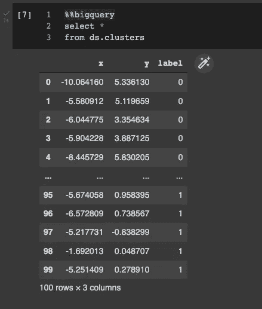
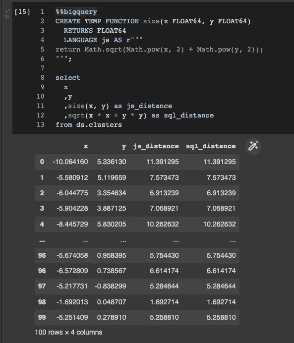
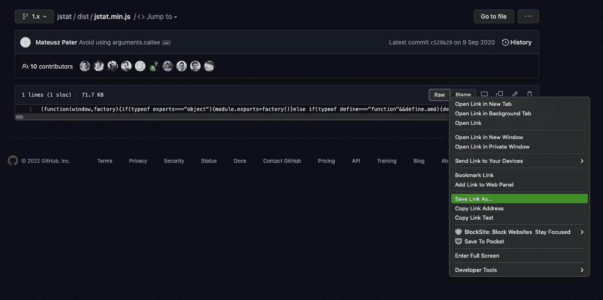
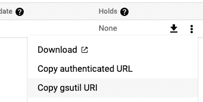
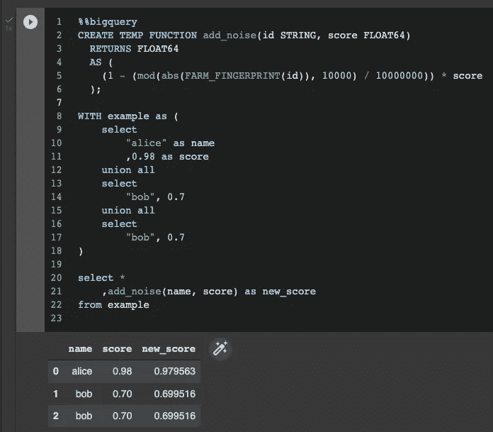

# BigQuery UDFs 完全指南

> 原文：<https://towardsdatascience.com/bigquery-udfs-complete-guide-181cbdaea55b>

## 关于 Google BigQuery 用户定义函数你需要知道的一切

使用 UDF 定制您的 BigQuery 体验——照片由 [Unsplash](https://unsplash.com/s/photos/custom?utm_source=unsplash&utm_medium=referral&utm_content=creditCopyText) 上[戴红帽的女孩](https://unsplash.com/@girlwithredhat?utm_source=unsplash&utm_medium=referral&utm_content=creditCopyText)拍摄

G oogle Cloud 的 BigQuery 是一款**牛逼的数据分析甚至机器学习工具**。它提供了许多现成的有用函数，但是如果你真的想深入 BQ，在某些时候你需要熟悉用户定义的函数。这些由您(用户)定义的函数将允许您**简化您的 SQL 查询并更快地完成工作**。

我将向您展示如何使用 **SQL 或 JavaScript** 来定义函数，甚至如何使用来自`jStat`的一些统计函数——一个用于统计的 JavaScript 库。

有一个 [Google Colab Notebook](https://github.com/niczky12/medium/blob/1bd90f4a8d29b134a064b18e549a01a98d3805b4/tech/bigquery/BigQuery_UDFs.ipynb) 为整个教程提供了易于运行的步骤，你可以重新创建和窃取你自己工作所需的所有代码。

# 制作玩具数据集

那只果冻兔太棒了！—[Yuri Shiro ta](https://unsplash.com/@itshoobastank?utm_source=unsplash&utm_medium=referral&utm_content=creditCopyText)在 [Unsplash](https://unsplash.com/s/photos/little-toy?utm_source=unsplash&utm_medium=referral&utm_content=creditCopyText) 上拍摄的照片

由于我更喜欢编写易于复制的教程，我们将从验证我们的 Google Colab 会话开始我们的旅程:

现在我们需要一个玩具数据集。为此，我们可以使用`sklearn`:

我们的数据框已经准备好了。—作者截图

让我们将它制作成一个 BigQuery 表，并检查它是否如预期的那样工作:

我们可以使用`%%bigquery` Jupyter 神奇的函数来调用 BigQuery SQL:

BQ 的土地上一切似乎都很好——作者截图

# 临时功能

现在我们有了一个数据集，可以开始讨论用户定义函数或 UDF 了。我们将使用普通的 SQL 来定义带有关键字`CREATE FUNCTION`的函数。如果有任何困惑，欢迎在评论中询问更多细节。我们的**函数将做一些超级简单的事情**:如果标签是 1，将 x 乘以 100，否则，它将返回 x。下面是函数:

请注意，我们已经失去了 GitHub 语法突出显示，因为它不知道这些 BigQuery SQL 关键字…😅

现在来看看细节:

*   我们使用了`TEMP`关键字，这意味着我们的函数**只存在于这个查询**中。我们将不能再次重复使用它。
*   `move_x`是我们函数的**名**。
*   `x`和`labelid`是该功能的两个**输入**。我已经在这里定义了它们的类型，但是我们将在后面讨论更多的类型。
*   `RETURNS FLOAT64`告诉 BigQuery 函数返回什么类型的对象**。**
*   **`AS`之后的都是函数的**体。这基本上是一个简单的`CASE WHEN`子句。****
*   **为了**调用函数**，我们只需在`SELECT`子句中传递我们需要的 2 个输入。这发生在 7 号线。**

**结果是辉煌的:**

****

**请注意，new_x 在 label=1 的结尾更大—作者截图**

# **永久功能**

****

**[纳达哈巴斯](https://unsplash.com/@nadah?utm_source=unsplash&utm_medium=referral&utm_content=creditCopyText)在 [Unsplash](https://unsplash.com/s/photos/pyramid?utm_source=unsplash&utm_medium=referral&utm_content=creditCopyText) 上拍摄的照片**

**现在，如果您试图在一个新的`SELECT`子句中调用这个函数，您将会看到这个`400 Function not found: move_x`错误:**

****

**我们的功能消失了😱—作者截图**

**但是正如您所料，我们可以通过删除关键字`TEMPORARY`并在函数名中添加一个指示符`dataset`来轻松保存函数。就像表和模型一样，**函数也必须存在于数据集**中:**

**一旦我们添加了这个，我们就使用`ds.move_x()`再次调用我们的函数——而不用定义它。如果你想知道这个函数的作用，你可以在 BQ 界面的`Routines`下找到它:**

****

**如果您注意的话，您可能会注意到上面的描述字段是空的。如果你正在做一个更大的项目，养成记录你的功能的习惯。我们可以在 BQ 中使用`OPTIONS`关键字来做到这一点:**

**您可以使用`DROP`子句随时删除您的功能:**

# **关于类型的注释**

**在上面的定义中，我们明确定义了**输入和输出类型**。我们告诉 BigQuery 期待一个 Float 和一个 Int，并且总是返回一个 Float。有些情况下，你可能不希望这样。在这种情况下，您可以将输入类型定义为`ANY`，甚至**将输出类型保留为空**，让 BigQuery 动态地计算出类型。这将意味着你的函数可能为不同的输入返回不同的类型，所以**要小心！** BigQuery 调用这个[模板化的 SQL UDF 参数](https://cloud.google.com/bigquery/docs/reference/standard-sql/user-defined-functions#templated-sql-udf-parameters)。**

**为了演示这是如何工作的，我制作了一个名为`multiply`的新函数，它有两个`ANY`输入，并将它应用于 3 种不同的列和标量组合。请注意，根据输入的不同，输出会有不同的类型:**

****

**new_label 是 int，因为 label 和 10 都是 int——作者截图**

> **还要注意，我在这里混合了列和标量，这很好！**

# **定义的 JavaScript**

**到目前为止，我们在所有的函数定义中都使用了 SQL。但是 **BigQuery 也支持 JavaScript** 进行函数定义。您所需要的只是`LANGUAGE`关键字和一个带有 JS 魔法的字符串，其他的一切，包括输入/输出定义，都保持不变。确保在 JS 定义中包含 return 语句:**

**向你证明这确实有效:**

****

**BigQuery 中的 JS—作者截图**

**也没有什么可以阻止你在函数中定义更小的函数，只要你仍然以 return 语句结束:**

**JavaScript 函数不是无限的。它们可以访问很小的内存，所以要小心传递给它们的内容。理想情况下，你不会想要传入一个百万长度的数组。用 SQL 或者更好的存储过程来实现:**

**</bigquery-stored-procedure-for-permutation-test-35597d6379e4> [## 用于排列测试的 BigQuery 存储过程

towardsdatascience.com](/bigquery-stored-procedure-for-permutation-test-35597d6379e4) 

# 使用 JavaScript 库

照片由 [Mariia Zakatiura](https://unsplash.com/@mzakatiura?utm_source=unsplash&utm_medium=referral&utm_content=creditCopyText) 在 [Unsplash](https://unsplash.com/s/photos/library?utm_source=unsplash&utm_medium=referral&utm_content=creditCopyText) 上拍摄

你可能会问:“JavaScript 函数有什么意义？”。它们增加了混乱，引入了一种新的语言，通常看起来并不美观。我完全同意。对于这些单行函数，你应该坚持使用 SQL 函数。但是一旦你开始使用**外部 JavaScript 库**，事情就变得有趣了。例如，您可以使用`jStat`库并在 BigQuery 中实现统计测试。让我们看看如何在 BigQuery 中使用 JS 库。

## 步骤 1 —获取代码

对于我们的例子，我们将坚持使用`jStat`。进入 [GitHub](https://github.com/jstat/jstat/tree/1.x/dist) ，在`dist`文件夹下，抓取一个你喜欢的文件。它们是相同的，但是`min`没有空格。点击`raw`并选择`save link as`:

作者截图

> 在从 GitHub 复制代码之前，一定要检查许可协议！

一旦你保存了你的文件，把它上传到谷歌云存储。您上传到的 bucket 必须与您的 BigQuery compute 在**相同的区域中。记下该位置的完整路径。如果你像我一样懒，你可以使用文件旁边的汉堡选项(3 点)来复制 Gsutil 路径:**

复制 blob 路径—作者截图

这会给你这样的东西:`gs://YOUR_BUCKET/path_to_file.js`

## 第二步——使用代码

现在我们有了代码的副本，可以开始在查询中使用它了。我们仍然需要**制作一个 UDF** ，但是 UDF 本身可以从谷歌云存储中引用一个库:

注意我们在上面是如何调用`jStat.sumsprd`的。另外，请注意`library`接受一个数组，因此您可以提供多个 JavaScript 库来使用。你也可以创建自己的函数库！

# 结论

谢谢你一直读到最后。希望您学到了一些关于 BigQuery 的新知识，并发现代码示例很有用。BigQuery UDFs 是一个伟大的工具，可以减少代码中的重复，提高分析系统的可靠性。想想你可以用外部库做的所有事情，或者你可以通过一个**b 去掉公共步骤**而去掉的代码量。

我做的一件常见的事情是，通过使用该行的 id，在 ML 预测中添加一点可重复的噪声。有了这个功能，生活就轻松多了:

行动中的随机噪音—作者截图** 

**如果你喜欢这篇文章，请考虑关注我， [**订阅 Medium**](https://niczky12.medium.com/membership) ，或者查看我的其他文章:**

**</end-to-end-bigquery-machine-learning-e7e6e2e83b34>  </jupyter-notebooks-can-be-a-pain-but-i-️-pluto-f47913c5c16d>  </advanced-random-sampling-in-bigquery-sql-7d4483b580bb> **