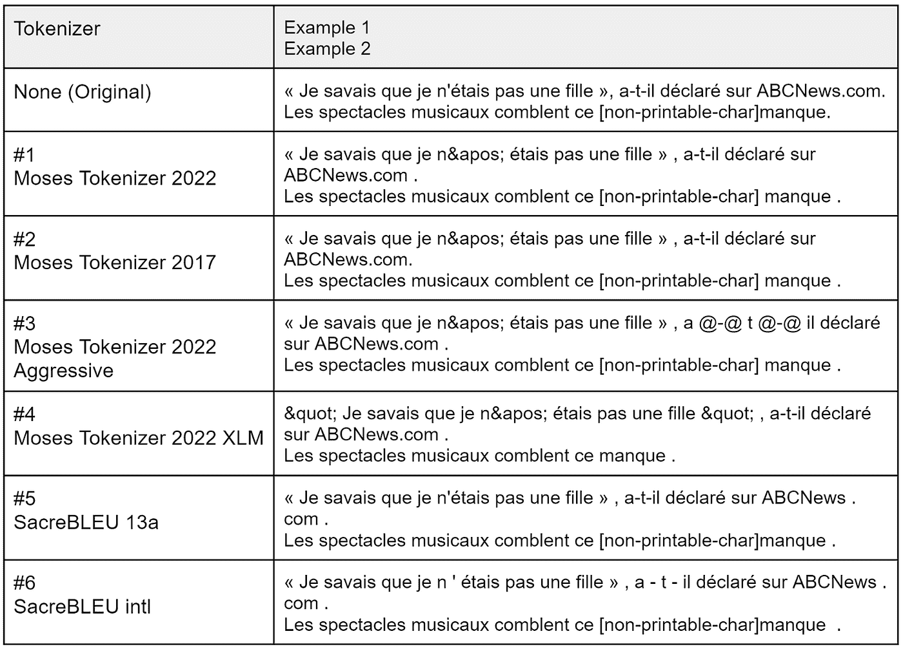

# BLEU:来自另一个时代的被误解的指标

> 原文：<https://towardsdatascience.com/bleu-a-misunderstood-metric-from-another-age-d434e18f1b37>

## 但是今天仍然在人工智能研究中使用

蓝色的墙— [图片来自 Pixabay](https://pixabay.com/users/lillaby-3693608/)

[GPT-3](https://papers.nips.cc/paper/2020/file/1457c0d6bfcb4967418bfb8ac142f64a-Paper.pdf) 、[耳语](https://cdn.openai.com/papers/whisper.pdf)、[掌中](https://arxiv.org/pdf/2204.02311.pdf)、 [NLLB](https://arxiv.org/ftp/arxiv/papers/2207/2207.04672.pdf) 、 [FLAN](https://arxiv.org/pdf/2109.01652.pdf) 等众多机型都曾被用公制 BLEU 评估过，宣称自己在某些任务上的优越性。

*但是 BLEU 到底是什么？它是如何工作的？*

在本文中，我们将追溯到 20 年前，揭示 BLEU 存在并成为一个非常成功的指标的主要原因。我们将通过一些例子来看看 BLEU 是如何工作的。我还将强调该指标的主要限制，并提供如何使用它的建议。

这篇文章被认为是对 BLEU 的一个介绍，但是对于那些习惯而不是需要使用 BLEU 的经验丰富的 NLP/AI 实践者来说也是一个很好的提醒。

# 2001 年在 IBM

BLEU 最初是在 2001 年由 Kishore Papineni、Salim Roukos、Todd Ward 和 Wei-朱婧合著的 IBM 研究报告中描述的。一年后，他们在 ACL 2002 上发表了一篇描述它的科学论文，这篇论文被引用得更多，也更容易找到。

BLEU 最初是作为评估机器翻译(MT)的自动度量标准提出的。

在 2001 年，机器翻译系统仍然主要是人工评估，或者使用旧的自动指标，如 WER ( *单词错误率*)。WER 是一种受 Levenshtein 距离启发的度量，今天仍用于评估语音识别系统。对于机器翻译评测来说，WER 可以看作是 BLEU 的鼻祖。BLEU 的作者表达如下:

> *我们模仿语音识别社区使用的非常成功的单词错误率指标来设计我们的亲密度指标*

像 WER 一样，BLEU 也是一个度量标准，用来衡量一个文本与人类产生的参考文本(如参考译文)的接近程度。

翻译是一项有多个正确解决方案的任务，BLEU 的作者设计了他们的度量标准，以便它可以处理多个参考翻译。这在当时并不新鲜，因为 WER 已经被改造成一个“mWER”来处理多个引用。据我所知，它是由 AT & T 实验室的 [Alshawi 等人(1998)](https://aclanthology.org/C98-1006.pdf) 首先提出的。

值得注意的是，在介绍 BLEU 的整篇论文中，作者总是假设他们的度量标准使用了多个参考译文。他们简要讨论了仅在某些情况下使用单一参考译文才是正确的:

> *我们可以使用带有单一参考译文的大型测试语料库，前提是这些译文并非都来自同一译者。*

相比之下，如今，大多数研究论文使用带有**单一参考**的 BLEU，通常来自一个**未知来源**，用于**各种任务**，即不仅仅是翻译。

至少可以说，自 2001 年以来，BLEU 一直是一个非常成功的指标。这部分是由于其**低廉的计算成本**和**BLEU 分数的可再现性，**与人工评估相反，人工评估的结果会因评估者和评估框架的不同而有很大差异。

BLEU 现在在几乎 100%的机器翻译研究论文中使用[,并在很大程度上扩展到其他自然语言生成任务。](https://github.com/benjamin-marie/meta_evaluation_mt)

# N-gram 匹配和长度惩罚

更准确地说，BLEU 评估一个翻译的 n 元语法**与一组参考翻译的 n 元语法**的匹配程度，而如果机器翻译比参考翻译更短或更长，则**会惩罚机器翻译。**

> ***一些定义:***
> 
> *一个* n-gram *是一个令牌序列。让我们在这里定义一个*标记*是一个由空格任意分隔的字符序列。例如，句子“一个令牌不是一个单词。”通常会被标记为“标记不是单词”。在本文的后面，我们将更多地讨论标记化的极其重要的作用。*

为了看到 BLEU 的作用，我从 BLEU 的论文中借用了一个中文句子(不是作者提供的)翻译成英文的例子。我们有以下两个由机器翻译生成的翻译:

作者图片

以及人类提供的以下 3 个参考译文:

作者图片

我们想用 BLEU 回答的问题是:

*哪种译文最接近给定的参考译文？*

我突出显示了两个候选翻译中参考翻译所涵盖的所有 n 元语法。

作者图片

候选 1 覆盖了来自参考翻译的更多 n 元语法，并且由于其长度(记号的数量)也合理地匹配参考翻译的长度，所以它将获得比候选 2 更高的 BLEU 分数。这里 BLEU 是正确的，因为候选人 1 确实比候选人 2 更好。

通过这个例子，我们可以看到 BLEU 的一些明显的局限性。被评估的翻译的意义没有被考虑。BLEU 只搜索与参考译文的标记完全匹配的内容。

例如，候选 2 中的“*确保*不在参考译文中，而“*确保*在参考译文中。由于“*确保*”与“*确保*”并不完全相同，尽管有相近的意思，但 BLEU 并不奖励。

当我们仔细观察标点符号时，情况会更糟。例如，候选人 2 以“*结尾。*“但这个时期是依附于*直接的。*"形成单个令牌。*直接。*“不是参考译文的令牌。候选人 2 没有因为正确包含这个句点而获得奖励。

这就是为什么 BLEU 通常在被标记化为包含标点符号的拆分标记的翻译上计算。我们将在下一节进一步讨论它。

为了简单起见，我不讨论 BLEU 背后的方程式。如果你有兴趣自己计算 BLEU，我邀请你阅读 BLEU 论文，其中所有的方程都有很好的动机和解释。

# 臭名昭著的标记化依赖

我们看到 BLEU 非常严格，因为一个标记应该与参考翻译中的一个标记相同，才能算作匹配。这就是标记化非常重要但经常被误解的地方。

标记化为 BLEU 提供了一些灵活性。

例如，让我们再次看看候选人 2:

> 它是保证部队永远听党指挥的活动指南。

但这一次，我们应用简单的标记化规则将标点符号与单词分开。我们获得:

> 它是保证部队永远听党指挥的活动指南。

注意"*。*与*直接*之间隔了一个空格。这是唯一的区别。候选项 2 现在匹配参考翻译中的另一个标记。这个令牌就是“*。*”。这似乎并不重要，因为这只是又一个令牌，但这是一个非常频繁的令牌。这种标记化将对几乎所有的句子产生影响，从而导致显著更好的 BLEU 分数。

可能的标记化有无限多种。例如，下面的法语句子是从英语翻译过来的，我用了 5 种不同的标记符。*注:我用的是* [*摩西*](https://github.com/moses-smt/mosesdecoder) *(开源，LGPL 授权)和*[*sacre bleu*](https://github.com/mjpost/sacrebleu)*(开源，Apache 授权 2.0)* 。

作者图片

这些是相同的句子，但是由于它们被不同地标记，它们将匹配来自参考翻译的不同标记。所有这些标记化将产生不同的 BLEU 分数，而翻译保持不变。

这就是为什么在标记化不同或未知的翻译上计算的两个 BLEU 分数不能进行比较。

这是现今科技论文中经常被忽视的**。**

你可以把标记化看成 BLEU 的一个参数。如果您更改参数，就会更改度量。**无法比较两个不同指标的得分。**

# 另一个时代的标准

2001 年提出 BLEU 的时候，机器翻译的质量是很不一样的。

为了让你们了解这种差异，我试着重建一个 2000 年代的法语到英语的机器翻译系统。为此，我训练了一个基于单词的统计机器翻译系统。我和摩西一起做的。我将把这个系统称为“统计 MT (2001)”

然后，我用一个普通的变压器模型训练了一个神经机器翻译系统。我和[玛丽安](https://github.com/marian-nmt/marian)一起做的(开源，麻省理工学院许可)。我将这个系统命名为“神经机器翻译(2022)”

它们生成的翻译如下。*注意:我突出显示了与参考译文匹配的 n 元语法。*

作者图片

正如预期的那样，统计机器翻译生成的翻译没有多大意义，尤其是在接近句子结尾的时候。另一方面，由神经机器翻译生成的翻译看起来很完美(没有上下文)，但它与参考翻译并不完全相同，因此它将受到 BLEU 的惩罚。

2001 年，机器翻译系统生成的翻译往往毫无意义，而且有明显的语法错误。他们因不匹配特定的参考译文而受到应有的惩罚。现在，神经机器翻译经常会生成非常流畅的翻译，尤其是对于法语-英语等“容易”的语言对。他们通常会找到正确的翻译，但由于有许多可能的正确翻译，找到用作参考的确切翻译可能只是偶然发生的。

这就是我们碰到的 BLEU 的极限，即使翻译是正确的，它也只奖励精确的匹配。

# 何时使用 BLEU

BLEU 多年来一直引领着机器翻译研究的进步。在 NAACL 2018 上，BLEU 的作者获得了[一个时间考验奖](https://naacl2018.wordpress.com/2018/03/22/test-of-time-award-papers/)。

BLEU 仍然在 AI 的很多领域使用，只是习惯使然。它现在在很大程度上被许多其他自然语言生成任务的评估指标所超越，包括机器翻译，如 [chrF](http://dx.doi.org/10.18653/v1/W15-3049) 、 [BLEURT](http://dx.doi.org/10.18653/v1/2020.acl-main.704) 或 [COMET](http://dx.doi.org/10.18653/v1/2020.emnlp-main.213) 。

尽管如此，BLEU 仍然是用于诊断目的的非常好的工具。

由于 BLEU 具有众所周知的行为，即，我们知道对于特定的翻译任务期望什么级别的 BLEU，所以它可以用于快速地发现机器翻译系统的训练管道中或其数据处理中的错误和其他问题。

无论如何，BLEU **不应该用在短文本**上。在实践中，机器翻译从业者总是对包含超过 1000 个句子的文本运行 BLEU。BLEU 旨在评估文档翻译。不应该用来评价句子翻译。

至于 BLEU 的实现，很多都是公开的。拥抱脸在[评估库](https://huggingface.co/docs/evaluate/index)中有自己的实现。 [NLTK](https://www.nltk.org/) 也实现了 BLEU。在摩西项目中还有 [multi-bleu.perl](https://github.com/moses-smt/mosesdecoder/blob/master/scripts/generic/multi-bleu.perl) 脚本。注意，所有这些 BLEU 的实现都是不同的，不会产生可比较的结果。我个人的建议是使用最初的 [SacreBLEU](https://github.com/mjpost/sacrebleu) 实现，因为这个工具是为了保证 BLEU 分数的可重复性和可比性。

如果你计划在你的下一个工作中使用 BLEU，不要忽视测试你的结果的统计学意义的需要。

 [## 是的，我们需要统计显著性检验

### 经验法则可能会产生正确的结果，但在科学上是不可信的

pub.towardsai.net](https://pub.towardsai.net/yes-we-need-statistical-significance-testing-927a8d21f9f0) 

*支持我工作的最好方式是使用我的链接成为一名普通会员:*

 [## 通过我的推荐链接加入媒体-本杰明·玛丽

### 阅读本杰明·玛丽(以及媒体上成千上万的其他作家)的每一个故事。您的会员费直接支持…

medium.com](https://medium.com/@bnjmn_marie/membership) 

*如果你已经是会员，想支持这项工作，就* [*关注我上媒*](https://medium.com/@bnjmn_marie) *。*