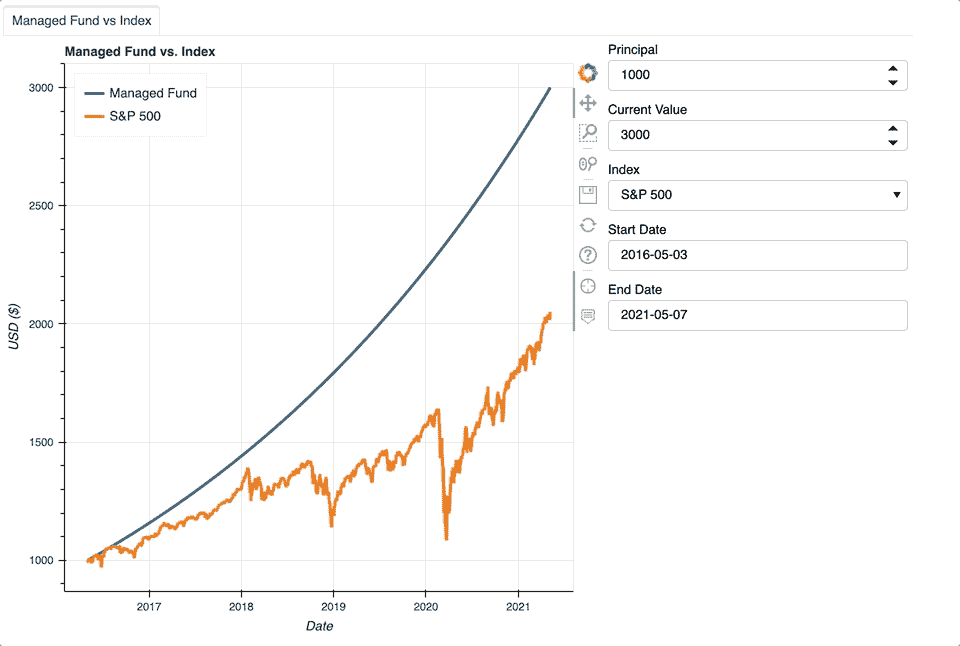
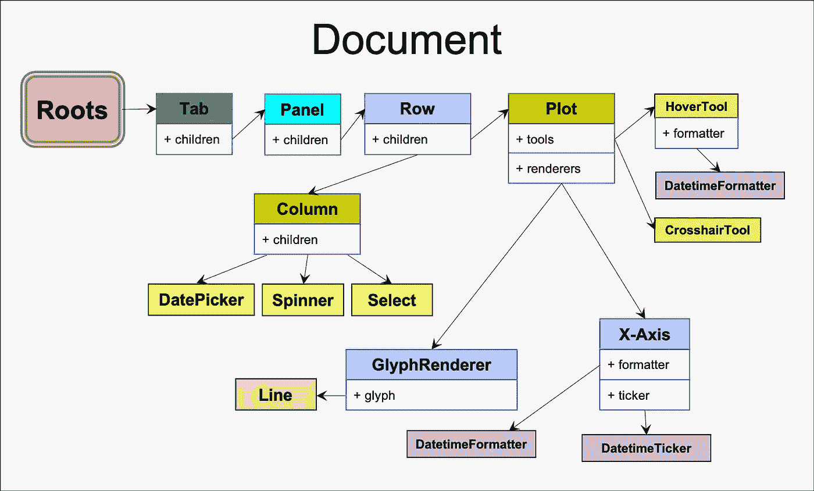
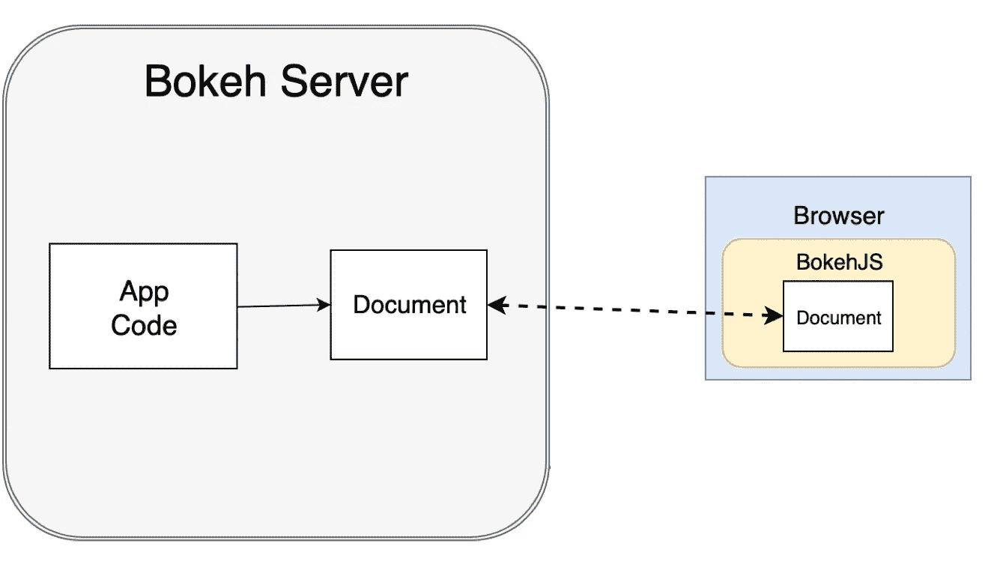
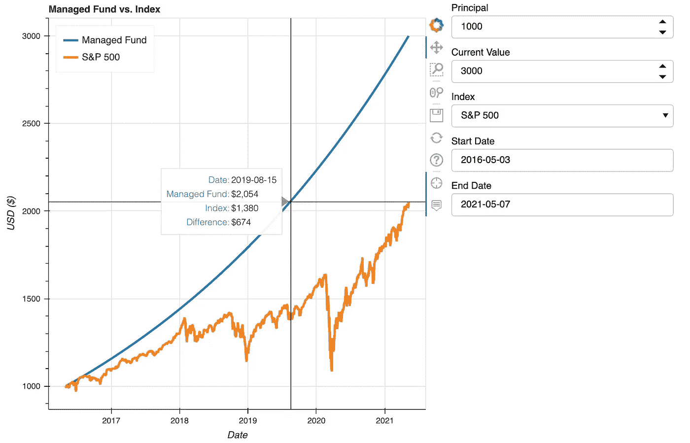

# 散景互动图:第 1 部分

> 原文：<https://towardsdatascience.com/bokeh-stock-comparison-tool-part-1-81afb176a14e>

## 如何指导构建自定义交互式散景应用程序


照片由[约尔戈斯·恩特拉哈斯](https://unsplash.com/@yiorgosntrahas?utm_source=medium&utm_medium=referral)在 [Unsplash](https://unsplash.com?utm_source=medium&utm_medium=referral) 拍摄

# 项目概述

了解一个数据集的大趋势和细微差别的最佳方式是自己探索它。如果轴的边界变宽会发生什么？如果这个初始条件改变了，结果会受到什么影响？不幸的是，静态图不能提供这种水平的输入。所见即所得。令人欣慰的是，散景通过构建美观、直观的应用程序来填补这一空白，从而允许更深入的数据探索。

为了展示散景的交互性，本文解释了如何构建一个绘制股市数据的散景应用程序。如下所示，第一部分将重点比较管理基金和指数。该应用程序将显示标准普尔 500 (^GSPC)或道琼斯工业(^DJI)指数。[第二部分](https://medium.com/@katyhagerty19/bokeh-interactive-plotting-part-2-316f8d58f476)将创建一个新标签，将指数与任何有股票代码的东西进行比较，如股票、指数、共同基金、ETF，甚至是它试图模仿的指数基金。第 3 部分比较了两只不同的股票。这篇教育文章深入探讨了如何在散景中构建情节并添加交互性。它不应被视为财务建议。



作者图片

# 先决条件

本文假设您对 NumPy 等 Python 有基本的了解，在 Pandas 中使用数据帧，并创建函数。这篇文章解释了如何在 Jupyter 笔记本中设置交互式散景应用程序。建议基本熟悉 Jupyter 笔记本的打开和运行。

# 什么是散景？

Bokeh 是一个数据可视化库，它采用 Python 编写的静态和交互式绘图，并将它们转换为浏览器格式。使 Bokeh 比其他交互式绘图库(如 Plotly)更强大的是它的小部件，即控制绘图数据的用户界面元素。Plotly 为交互式绘图提供了 4 个自定义控件，而散景提供了几十个控件。此外，Bokeh 允许通过 CustomJS 回调进行进一步定制，这允许用户用 JavaScript 为现有 Bokeh 小部件无法解决的特殊情况编写独特的行为。由于这个应用程序只使用现有的散景小部件，所以本文不会涉及 CustomJS 回调。

## 重要的散景术语

*   小部件-更新图中数据的用户界面元素。例如，按钮、下拉菜单和日期选择器都是小部件。
*   字形-代表数据系列的绘图标记
*   模型——散景对象的总称。小部件、字形和绘图工具都被视为模型。
*   绘图-保存字形的容器。图不包含微件。
*   文档—散景应用程序中所有对象的顶级容器

下图说明了该应用中明确定义的不同散景模型之间的关系。



这张经过编辑的流程图源自散景文档。原图文可在[这里](https://docs.bokeh.org/en/latest/docs/reference/document.html)找到。

## 散景服务器

应用程序通过散景服务器与 Python 代码进行通信。不是所有的散景应用程序都需要它，但是像这样的应用程序需要它，只要用户做出选择并更新数据集，它就会引用 Python 函数。**Python 代码必须在散景服务器上运行。**对 Python 代码进行所有编辑后，启动散景服务器。一旦进入会话，服务器将不会合并在 Python 中所做的编辑。

要运行散景服务器:

1.  在 Python 代码所在的文件夹中打开一个终端
2.  运行以下命令:

```
bokeh serve --show main.py
```

这张图片展示了代码、散景服务器和浏览器的交互方式。



这张编辑过的图片来自散景文档。原文可以在这里找到[。](https://docs.bokeh.org/en/latest/docs/reference/server.html)

有关使用散景服务器的更多信息，请参见[此处](https://docs.bokeh.org/en/latest/docs/user_guide/server.html)。

# 密码

此应用程序的 Git 存储库可从[这里](https://github.com/katyhagerty/index_fund_comparison)获得。

该存储库包含 Jupyter 笔记本和 Python 的代码。这两种代码具有相同的功能。Jupyter 笔记本将在笔记本中输出应用程序，而 Python 代码将在默认浏览器中显示输出。

本文展示了 Jupyter 笔记本中的代码。在 Jupyter 笔记本中编辑散景互动应用程序要容易得多，因为它不需要每次编辑都重新启动散景服务器。

## 导入库和模型

首先，导入库、工具和小部件。`yfinance`库从 YahooFinance 提取数据，并将其转换成 Python 友好的格式。

## Jupyter 笔记本的交互性

要在 Jupyter 中启用 Bokeh 的交互式功能，请将代码包装在一个函数中。`notebook_url`参数必须与 Jupyter 笔记本页面的位置相匹配，该页面可以在浏览器栏中找到。

```
def modify_doc(doc):
    [code]show(modify_doc, notebook_url="localhost:8888")
```

与每次编辑后重启散景服务器相反，你只需要运行 Jupyter 笔记本来显示编辑。

## 小工具

小部件是用户向散景应用程序提供输入的方式。为了将管理基金与指数进行比较，该应用程序需要一些输入，如最初投资了多少(`principal`)和管理基金的当前价值(`current_value`)。`ticker`指定与管理基金进行比较的指数。`start_date`和`end_date`定义日期的范围。所有这些变量都可以在以后通过用户输入进行更改。但是首先，它们需要被初始化。

`min_date`和`max_date`变量取决于所选的步进。这些变量作为界限，禁止用户在索引不存在时选择日期。毕竟，如果管理基金比指数有更多的增长时间，这不是一个公平的比较。


小部件。图片作者。

该应用程序使用 Select、DatePicker 和 Spinner 小部件。`fund_2`是一个选择小部件，它创建了一个索引下拉菜单。`start_date_picker`和`end_date_picker`使用包含弹出日历的 DatePicker 小部件轻松选择日期范围。微调控件为`principal_spinner`和`current_value_spinner` 提供了基础，并允许手动输入。

## 调用函数

三个功能— `yf_fund`、`managed_fund`、`create_source` —为应用程序创建数据。`make_plot`获取数据并创建绘图。下面是这些函数的调用方式:

## 功能

`yf_fund`函数返回指数的成本基础和开始日期和结束日期之间每天的投资平仓数据框架。列`df_yf_fund[‘legend’]`仅包含索引的股票代号，图图例将其用作标签。这必须存储在列中，而不是作为变量，因为 Bokeh 要求所有可更新的信息都以表格格式存储。

与`yf_fund`类似，`managed_fund`返回管理基金的年化收益率和基金在给定时间段内的表现数据。即使管理基金波动，该应用程序也使用占位符，并假设管理基金一致升值(或贬值)。为了创建一个平滑的指数曲线，该函数计算管理的基金在时间段内每天的头寸，甚至在市场关闭的日子。然后，它过滤`df_managed_fund`,只包括市场开放的日子。如`line 12`所示，`df_managed_fund`使用`df_yf_fund`作为过滤器，因为`df_yf_fund`只包含交易日。

`create_source`函数将管理的基金和指数数据合并到一个数据框架中。它还计算日期范围内每天两个基金头寸之间的差额。

`make_plot`功能将这一切集合在一起。首先，它获取`df_source`数据帧并将其转换为`source`，一个 ColumnDataSource 对象。散景图要求将数据格式化为 ColumnDataSource。ColumnDataSource 接受一个 DataFrame 并将每个列名映射到该列的数据，类似于 dictionary 对象。**column data source 中的每一列的长度必须相同。**

`TOOLTIPS`格式化当光标悬停在数据点上时出现的弹出框。这里，`TOOLTIPS`是元组列表。每个元组包含一个标签和一个值。后跟列名的`@`符号允许`TOOLTIPS`显示来自`source`的值。例如，`‘[@Date](http://twitter.com/Date){%F}’`将显示`source`中`Date`列的值。包含空格的列名需要大括号。第二对大括号指定数据的格式。`{%F}`允许使用`line 15`上`HoverTool` 中的`formatters={‘[@Date](http://twitter.com/Date)’: ‘datetime’}`参数设置`@Date`值的格式。这很麻烦，但这是格式化日期的唯一方法。



显示十字光标工具、悬停工具和工具提示的绘图。图片作者。

`plot`的高度和宽度将在布局允许的情况下占据尽可能多的空间。该应用程序使用两个线形符号来绘制数据。`CrosshairTool`当光标在绘图上时，启用十字线。`HoverTool`当光标悬停在数据点上时，弹出`TOOLTIPS`。`formatters`参数设置`TOOLTIPS`中`Date`列数据的格式。即使`source`中的`Date`列被格式化为 datetime，`TOOLTIPS`也无法识别它，因此需要`formatters`参数。`line 17` 中定义的图表图例点击策略允许用户通过点击图例来隐藏和取消隐藏数据系列。

## 回调函数

`update`功能告诉散景如何更新绘图。这就是所谓的回调函数。所有回调函数都需要`attr`、`old`和`new`作为输入，即使没有使用。`update`函数从窗口小部件中拉出新的`start_date`、`end_date`、`principal`、`current_value`和`ticker`变量。由于 DatePicker 小部件以字符串形式返回其值，因此必须将`start_date`和`end_date`转换为日期时间，以便使用`yf_fund`。接下来，调用`yf_fund`和`managed_fund`函数来获取新的、更新的数据。然后，`create_source`合并两个数据帧以创建`new_source`。最后，`source`用`new_source`数据更新。由于`source`在`plot1`中创建了现有的字形，用新数据更新`source`会将该数据拉入绘图。没必要再叫`make_plot`了。

## 用事件触发回调

为了让应用程序知道何时调用`update`，它必须链接到一些事件。小部件有一个`on_change`方法，每当指定的变化发生时，它将触发一个回调函数。这里，每当用户改变小部件的值时，回调函数`update`就会被激活。虽然这个应用程序只使用`on_change`来触发回调，但散景提供了像`ButtonClick`、`MouseMove`等更多事件。

```
start_date_picker.on_change('value', update)
end_date_picker.on_change('value', update)
principal_spinner.on_change('value', update)
current_value_spinner.on_change('value', update)
fund_2.on_change('value', update)
```

## 布局

最后，Bokeh 需要知道如何在应用程序中组织情节和小部件。所有的小部件都堆叠在一个名为`inputs`的列中，使用(你猜对了！)中的`column`功能。接下来，`plot1`和`inputs`排成一行创建`row1`。散景的`Panel`函数获取`row1`并将其格式化为散景的`Tab`容器。将所有东西放在一个标签上简化了第 2 部分和第 3 部分中涉及的应用程序升级。最后在`doc`上加上`layout`。`layout`包含代码中的所有型号。`doc`是一个文档，一个与散景服务器接口的散景容器。另外，`doc`是`modify_doc`的输入，如“Jupyter 中的交互性”一节所定义。

# 后续步骤和结论

第 1 部分讲述了散景的基本原理，并为应用程序创建了一个基础。[第二部分](https://medium.com/@katyhagerty19/bokeh-interactive-plotting-part-2-316f8d58f476)将在这个框架的基础上创建一个新的选项卡，将指数与股票或其他可交易资产进行比较。最后，第 3 部分将创建一个选项卡来比较两种可交易资产。

该应用程序的主要目标是展示散景互动功能的力量。它不仅通过显示大图趋势，还通过显示每日指标来实现这一点。这种交互性使用户能够检查并确定何时出现了可观的收益或损失。此外，该应用程序计算任何一天的两项投资之间的差异。与一刀切的静态图相反，这种直观的应用程序允许用户输入条件，以便他们可以更好地探索数据并回答自己的问题。

感谢您阅读我的文章。欢迎所有反馈。我总是渴望学习新的或更好的做事方法。请随时留下您的评论或联系我 katyhagerty19@gmail.com。

[](https://medium.com/@katyhagerty19/bokeh-interactive-plotting-part-2-316f8d58f476) [## 散景互动图:第二部分

### 如何构建自定义交互式散景应用程序

medium.com](https://medium.com/@katyhagerty19/bokeh-interactive-plotting-part-2-316f8d58f476) [](https://medium.com/@katyhagerty19/membership) [## 加入我的介绍链接媒体-凯蒂哈格蒂

### 作为一个媒体会员，你的会员费的一部分会给你阅读的作家，你可以完全接触到每一个故事…

medium.com](https://medium.com/@katyhagerty19/membership)