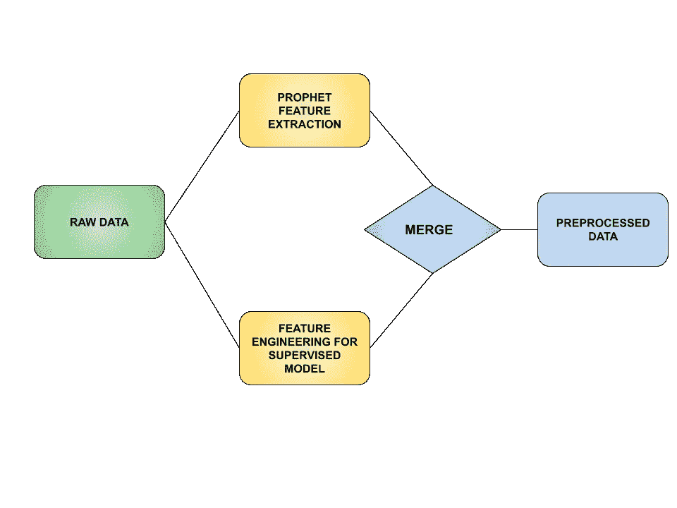
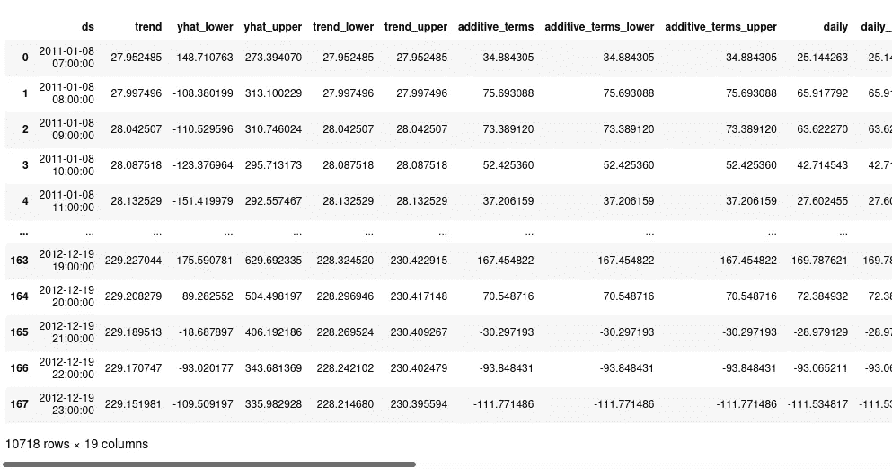
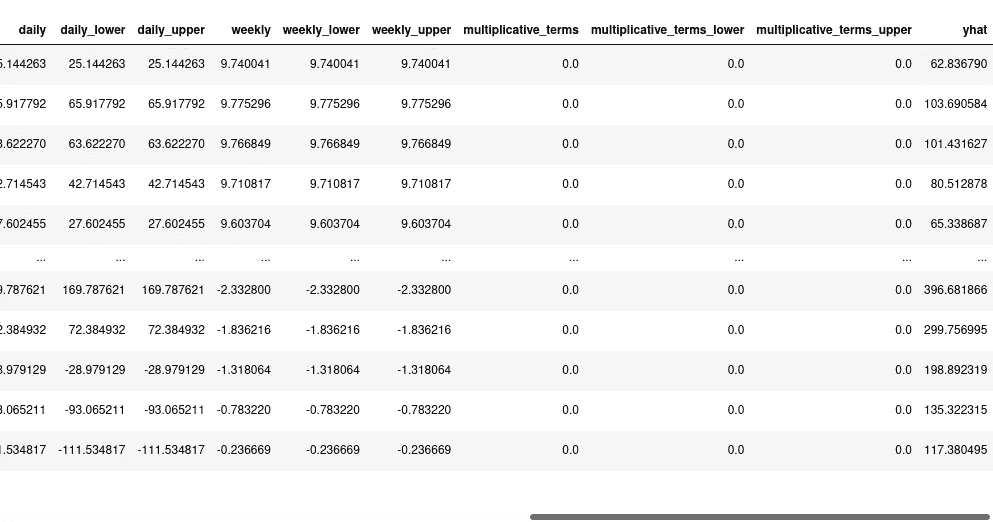
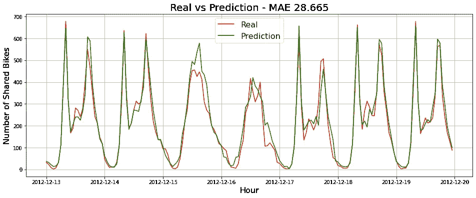

# 将梯度增强模型与 Prophet 特征相结合，增强时间序列预测

> 原文：<https://towardsdatascience.com/boost-your-time-series-forecasts-combining-gradient-boosting-models-with-prophet-features-8e738234ffd>

## 使用具有 Prophet 功能的 LightGBM 模型实现最先进的结果

艾萨克·史密斯在 [Unsplash](https://unsplash.com?utm_source=medium&utm_medium=referral) 上拍摄的照片

在我的上一篇帖子中，我写了关于机器学习的时间序列预测。我重点解释了如何使用基于机器学习的方法进行时间序列预测，并取得良好的结果。这篇文章将使用更先进的技术来预测时间序列，并试图超越我在上一篇文章中创建的模型。如果你没有读过我之前的文章，我建议你读一读，因为这将是我之前模型的一个迭代。一如既往，你会在这个[链接](https://github.com/unaiLopez/towards-data-science-posts-notebooks/blob/master/time%20series/Bike%20Sharing%20Demand%20Prediction%20Prophet%20%2B%20LightGBM.ipynb)中找到这个新帖子的代码。

## 以前的帖子

  

# 新方法

除了前一篇文章中的所有特征工程，我们将使用 Prophet 提取新的有意义的特征，如季节性、置信区间、趋势等。

## 特征工程

[特征工程图](https://docs.google.com/drawings/d/15XrdnvNu4gaY6-7N9z_K4sfhjO2ThRc1PrU60KKv-EA/edit?usp=sharing)

## 时间数列预测法

在我的上一篇文章中，我使用了一个具有一些滞后功能的 LightGBM 模型来预测未来 7 天某个城市的每小时自行车共享需求，效果非常好。然而，如果我们使用 Prophet 从我们的时间序列中提取新的特征，结果可以得到改善。其中一些特征是 Prophet 模型的实际预测、置信区间的上限和下限、每日和每周的季节性和趋势。对于其他类型的问题，Prophet 也可以帮助我们提取描述节日效应的特征。

## 原始数据

在本帖中，我们将重复使用之前 LightGBM 预测文章中使用的数据。我们的数据看起来像这样:

前一篇文章的丰富数据集

## 用 Prophet 提取特征

我们特征工程的第一步非常简单。我们只需要像这样使用先知模型进行预测:

该函数将为我们返回一个数据框架，其中包含许多 LightGBM 模型的新特性:

Prophet 显示了从第 1 列到第 11 列的数据帧

Prophet 显示了从第 11 列到第 20 列的数据帧

## 具有 Prophet 功能的列车自动制动灯 GBM

一旦我们使用 Prophet 提取了新的特征，就该将我们的第一个数据框架与新的 Prophet 数据框架合并，并使用 LightGBM 进行一些滞后的预测。为此，我实现了一个非常简单的函数来处理所有的过程:

一旦我们执行了上面的代码，我们将合并特征数据帧，创建滞后值，创建并训练 LightGBM 模型，使用我们训练的模型进行预测，并显示一个将我们的预测与实际情况进行比较的图。输出将如下所示:

具有滞后和先知特征的模型预测

哇！如果我们仔细观察结果，我们可以将之前帖子中的最佳模型提高 14%。在我们之前的帖子中，具有最佳功能工程的最佳 LightGBM 模型获得了 32.736 的 MAE，现在我们获得了 28.665 的 MAE。考虑到前一篇文章中的模型和特性工程已经切中要害，这是一个巨大的进步。

# 结论

正如我们在这篇文章中看到的，将监督机器学习方法与 Prophet 等统计方法结合起来，可以帮助我们取得非常令人印象深刻的结果。根据我在现实世界项目中的经验，在需求预测问题中很难得到比这些更好的结果。

# 参考

   