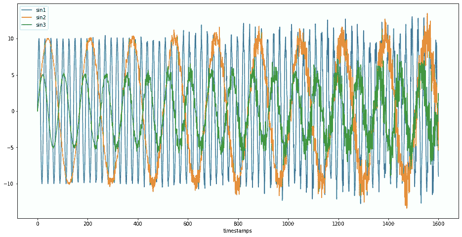
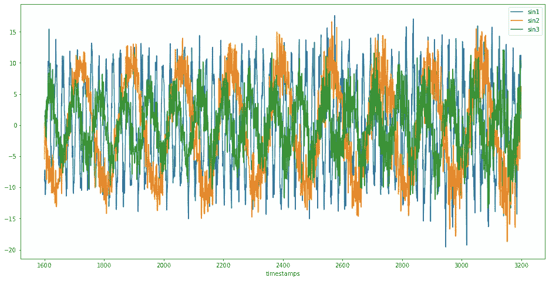
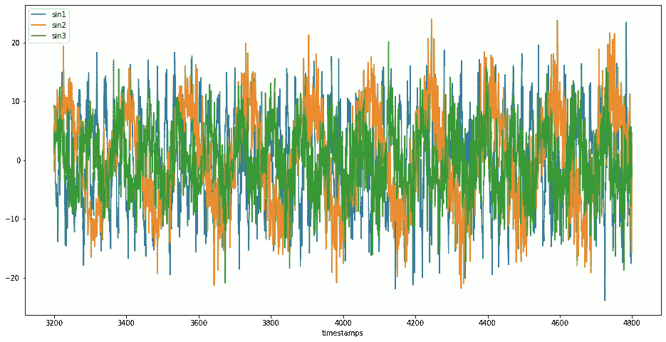
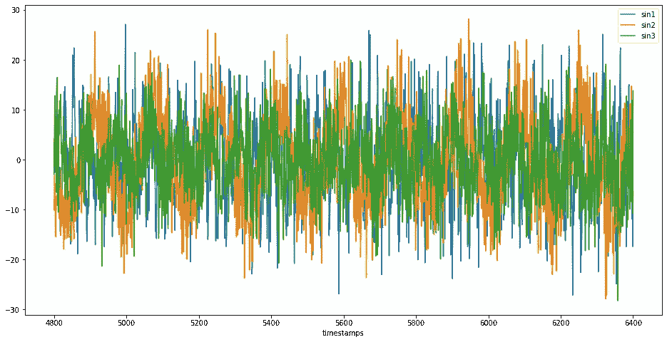
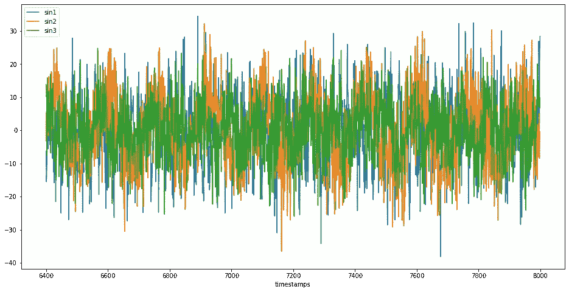
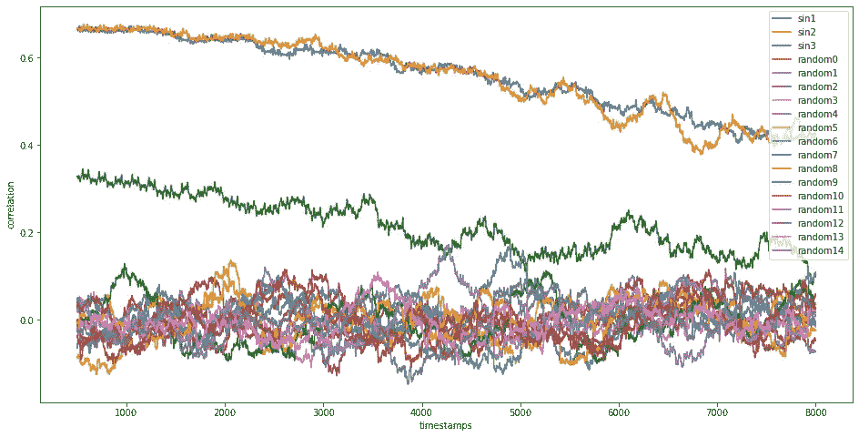
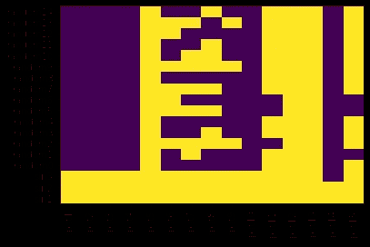

# 用于时间特征选择的博鲁塔·SHAP

> 原文：<https://towardsdatascience.com/boruta-shap-for-temporal-feature-selection-96a7840c7713>

## 特征选择算法如何应对数据漂移

在 [Unsplash](https://unsplash.com?utm_source=medium&utm_medium=referral) 上由 [Rodion Kutsaev](https://unsplash.com/@frostroomhead?utm_source=medium&utm_medium=referral) 拍照

**每个人都知道特征选择**程序在机器学习流水线中的重要性。它们有助于实现更好的性能，同时根据我们的监督任务降低输入数据的维度。

过去，我们面临着最佳特征选择的问题，提出了仅过滤相关预测因子的引人入胜的尖端技术。我们发现了使用 [SHAP 进行特征选择](https://medium.com/towards-data-science/shap-for-feature-selection-and-hyperparameter-tuning-a330ec0ea104)的重要性，而不是简单的算法重要性度量。我们测试了[博鲁塔和 SHAP](/boruta-and-shap-for-better-feature-selection-20ea97595f4a) ，结果证明这是一个非常有效的选择方法。我们还介绍了[递归特性添加](https://medium.com/towards-data-science/recursive-feature-selection-addition-or-elimination-755e5d86a791)方法，作为标准递归特性消除的一种有价值的替代方法。

很少有人知道，像大多数数据驱动算法一样，**随着时间的推移，特征选择也会变得不准确**。因此，需要用新数据重复过滤过程，以捕捉新模式。除了作为一个良好的实践，定期重新运行特性选择过程是每个包装器选择方法的真正需要。由于包装器方法根据基础学习者的排名选择“重要”的特征，**很容易理解数据转移对最终结果的危害有多大**。

在本帖中，**我们对一个动态系统进行特征选择**。我们遵循一种迭代的方法，在这种方法中，我们重复搜索生成过程中的相关特征。我们试图预测的目标是一些正弦信号的简单线性组合的结果。预测值和目标值之间的关系在整个实验过程中保持不变。我们只增加每个预测特征中的噪声量，以观察不同的特征选择算法在数据移动的环境中如何表现。

我们着重比较两种众所周知的滤波方法:递归特征选择(RFE)和 Boruta。我们使用了 [**shap-hypetune**](https://github.com/cerlymarco/shap-hypetune) 库，因为它提供了我们感兴趣的两种方法的有效和直观的实现。它还使得能够使用 SHAP 特征重要性，而不是基于树的特征重要性，以使排序过程更稳定并且更少偏向训练数据。

# 实验设置

我们的实验包括使用合成数据。首先，我们生成三个人工正弦序列。然后，我们合并信号，简单地将它们相加，以获得我们试图预测的目标。最后，我们按照时间模式向输入序列添加一些随机噪声。换句话说，我们从几乎为零的噪声开始，随着时间的推移不断增加。绘制数据时，此过程的结果是可以理解的:

带有时间噪声注入的正弦序列(图片由作者提供)

带有时间噪声注入的正弦序列(图片由作者提供)

带有时间噪声注入的正弦序列(图片由作者提供)

带有时间噪声注入的正弦序列(图片由作者提供)

带有时间噪声注入的正弦序列(图片由作者提供)

一开始，我们可以很容易地识别三个输入信号的行为。随着时间的推移，噪音开始隐藏真实的数据动态，最终使它们几乎无法识别。

连同有意义的正弦序列，我们添加一些随机特征。它们对于评估我们的特征选择策略的性能是重要的，因为它们对于我们的预测任务应该被标记为“无用的”。如果我们绘制特征和目标之间的滚动自相关图，我们可以观察到相关性是如何随着时间的推移而降低的。这并不令人惊讶，但证实了噪音对数据关系的负面影响。正如所料，噪声特征与目标的相关性几乎为零。

目标和特征之间的滚动相关性(图片由作者提供)

考虑到我们的预测任务，在这种情况下建立预测模型应该非常棘手。

# 结果

给定这些数据并了解底层系统动态，我们就可以对这两种提出的特性选择方法进行建模和基准测试了。我们使用标准的时间序列分割方法将数据分成 15 份。我们根据自己掌握的数据对算法进行不断扩展的滚动训练。这样，当训练数据变大时，正弦序列在每次分裂时变得更嘈杂。分裂进行得越多，我们的算法发现真实模式的压力就越大。

下面我们以热图格式报告选择结果。递归 SHAP 特征消除至少在第四次分裂之前可以检测到真正有意义的特征。之后，由于数据中噪声的增加，选择似乎变得更加困难。随机特征被错误地检测为重要，尽管它们与目标没有任何关系，这可能导致错误的预测。

RFE-SHAP 在每个时间点选择(黄色)和删除(黑色)的特征(图片由作者提供)

相反，博鲁塔·SHAP 只能正确识别每次分裂中的重要信号。这是一个非常令人印象深刻的结果，它证明了博鲁塔 SHAP 作为特征选择算法在困难的预测环境中的优势。

博鲁塔-SHAP 在每个时间点选择(黄色)和删除(黑色)的特征(图片由作者提供)

# 摘要

在这篇文章中，我们在数据漂移的极端环境下测试了两种不同的特征选择方法。我们对递归特征选择和 Boruta 进行了基准测试(两者都使用 SHAP 作为特征重要性度量)。虽然递归特征选择显示出随着数据中噪声的增加，在检测真正有意义的预测因子方面存在一些困难，但是 Boruta 做了出色的工作。当数据漂移变得更加明显时，它也总能检测到真实的系统模式，捍卫其首要地位*“出色的特性选择算法”*。

[查看我的 GITHUB 回购 ](https://github.com/cerlymarco/MEDIUM_NoteBook)

保持联系: [Linkedin](https://www.linkedin.com/in/marco-cerliani-b0bba714b/)