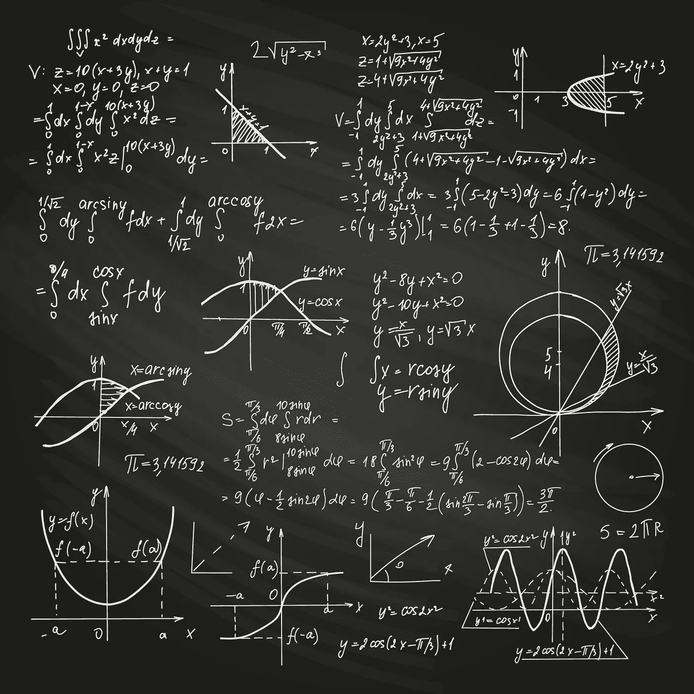

# 弥合评估差距

> 原文：<https://towardsdatascience.com/bridging-the-evaluation-gap-5e8af3e16ff0>

## 使用在线整数序列百科全书(OEIS)作为数论领域的数据科学先知



[由 freepik 创作。](https://www.freepik.com/free-vector/scientific-formulas-chalkboard_7456461.htm)

正如之前讨论的[这里](/discovering-the-shape-of-fractions-e9034ab0085c)(和[这里](/prime-fractions-cyclic-reciprocals-b1074f6ebc3b)和[这里](/are-pseudoprimes-hiding-out-among-the-composite-reciprocals-c8952cfe1ab4))我最近很享受使用数据科学的工具探索数论领域。由于我不是数论专家，这迫使我面对一个有趣的、具有挑战性的、熟悉的问题，即:

> 我如何评价我发现的东西？

我如何知道我是否在正确的轨道上？作为一名数据科学家，我可以生成和分析数据，拟合模型，确定有趣的关系，甚至做出预测，但鉴于我在数论领域的有限知识，我如何判断产生的结果是否有意义或新颖？在这篇短文中，我将讨论我是如何处理这个问题的，以及我已经确定的解决方案。

他的评估挑战对我来说并不陌生，也不是数论领域独有的。在我的日常工作中，作为一名在人工智能和机器学习领域工作的学者，确定如何客观地评估一个新算法或一个已学习的模型，是每个研究项目的关键组成部分。这通常意味着确定一个客观的基础数据来源，以评估模型预测的准确性。我们经常使用现有的基准数据集进行训练和测试。例如，在推荐系统领域， [MovieLens](https://grouplens.org/datasets/movielens/) 数据集是一个常见的选择。它包含数十万用户的数百万电影评级，并且使用数据集的*训练*子集构建的模型的评级预测可以在单独的*测试*子集上进行评估，例如通过将测试用户的预测评级与其实际评级进行比较。在机器学习和信息检索研究的许多不同领域都使用了类似的方法。

数论的领域是相当不同的。作为纯数学领域，重点是严格证明而不是经验评估。然而，我正在做的这个词本质上是经验性的。我在数据中寻找新颖和有趣的模式，如果我确实发现了一些有趣的东西，那么，在适当的时候，其他人可能能够将这些模式和数据转化为正式的定理和严格的证明，但这不是我的核心优势。但是这给我留下了一个难题:当我识别新的模式时，我怎么才能知道它们是新颖的还是有趣的？我一直在探索的解决方案和我平时的做法很不一样。我没有使用基准数据集方法，而是决定依赖外部数论专家。具体来说，我正在使用[在线整数序列百科全书(OEIS)](https://oeis.org) 来扮演一个数论神谕的角色。

OEIS 是一个由尼尔·斯隆创建和维护的[整数序列](https://en.wikipedia.org/wiki/Integer_sequence)的在线数据库。目前，它包含超过 350，000 个整数序列，在数论和其他数学分支中发挥着关键作用。业余和职业数学家都对 OEIS 很感兴趣。它被文献广泛引用，并且方便地，OEIS 提供了一个搜索工具，允许用户从一组样本术语中识别匹配的序列。这意味着它可以作为一种类型的*数论**甲骨文，这正是我所需要的。*

*在我目前的研究中，我采用了如下所示的工作流程。例如，由于我一直在探索倒数和素数的各种性质，我经常产生我需要评估的新序列。我的方法是将这些提交给 OEIS，以搜索任何现有的匹配。如果匹配序列已经存在，那么这意味着我的结果并不新颖，但这也表明我正处于有趣的数论领域——有趣得足以让别人在我之前记录下这一发现——作为一个现有的序列，它的 OEIS 条目通常提供有用的指针来指导我的探索，例如它在其他研究领域的使用。*

*产生的许多序列都是这种类型——也就是说，它们已经存在于 OEIS——但偶尔我会产生一个不在 OEIS 出现的序列。当这种情况发生时，会非常令人兴奋。这暗示我可能发现了新的东西，下一步是提交给 OEIS 进行审查。审查过程将提供一个进一步的验证步骤，并可能以其自身的权利贡献额外的想法和建议，并且最终如果序列被接受，那么我可以满意地认为我对数论领域有所贡献。*

**

*JupyterLab 和 OEIS 之间的工作流程示例。图片作者。*

*为了以编程方式支持上面的工作流，下面的代码在 Python 中实现了两个有用的 OEIS 助手函数:一个是通过 id 查找序列，另一个是通过搜索匹配一组样本术语的序列，查找序列。这使得在不离开您的数据科学环境(在我的例子中是 Jupyter 笔记本)的情况下，很容易检查术语样本是否作为序列存在于 OEIS 中，这极大地增强了工作流。此外，如果对于给定的一组术语找到了匹配，那么通过返回匹配序列的摘要(id、url、描述和术语)，就可以更容易地了解匹配序列的类型，并且它们提供的提示通常会指导我的后续步骤。*

*OEIS 查找/搜索代码示例。作者代码。*

*在最近的一篇[文章](/are-pseudoprimes-hiding-out-among-the-composite-reciprocals-c8952cfe1ab4)中，我通过的方式讨论了对倒数的分析——形式为 *1/d* 的分数——以及它们的十进制展开的重复部分(*重复*)的长度(*周期*)；比如 1/7 = 0.142857142857…所以它的周期( *k* )是 6，因为它的重复包含 6 个重复的数字(142857)。质数的倒数——形式为 *1/p* 的倒数，其中 *p* 是质数——的一个有趣性质是，它们总是服从等式*n * k = p-1；*换句话说， *1/p* ( *k* )的周期是 *p-1* 的约数。*

*虽然这是一个众所周知的结果，但我对所有倒数 *1/d* ( *1≤d≤1，000，000* )的分析表明，虽然这个性质并不适用于所有的*复合*(非质数)倒数，但它适用于某些倒数。例如，1/33 有一个十进制扩展 0.030303…，所以它的重复数是 03，周期是 2，2 被 33–1 整除。再比如 1/148，展开为 0.00675675…有 675 的重复数，周期为 3，3 被 148–1 整除。还有一些复合材料也具有这种特性:*

```
*33, 55, 91, 99, 148, 165, 175, 246, 259, 275, 325, 370, 385,...*
```

*这个复合倒数序列是新奇的还是值得注意的？作为一个题外话，找到一个合数序列与素数共享一个属性总是很有趣的，特别是如果这个属性在合数中很少见的话。这样的数字被称为 [*伪素数*](https://en.wikipedia.org/wiki/Pseudoprime) ，根据它们与素数共有的性质，有几种不同的类型。我的数据分析是不是把我带到了一种新型的伪素数？*

*当我在 OEIS 搜索这些术语时，我发现以前没有记录过这样的序列，进一步的网络搜索也没有找到任何关于它的明显讨论。我相当自信地发现了一个新的序列，我把它作为一个新条目提交给了 OEIS，果然，经过几天的审查，它被接受并批准为一个新的序列( [A351396](https://oeis.org/A351396) )，这对我来说是第一次。*

> *“合成数字 d，使得 1/d 的十进制展开的周期 k > 1 并除以 d-1”——[a 351396](https://oeis.org/A351396)*

*与此同时，我还考虑了这一序列的几个新变体——例如，通过排除与早期术语具有相同重复或相同时期的术语——这两个术语都不在 OEIS，并且都在审查中。*

*这篇文章的目的是解释我是如何思考我在数论中的经验探索的。数论是一个很有吸引力的应用领域，因为它很容易获得——高中数学足以开始，至少在一段时间内——还因为数据集和挑战性问题的可用性。然而，由于我不是该领域的专家，对我来说判断我是否在正确的轨道上是一个挑战:一个评估差距的典型例子。*

*我已经描述了一个实用的方法，我已经成功地使用它来弥补这个特殊版本的评估差距，通过使用 OEIS 作为一个数论先知。虽然 OEIS 不是万灵药，但它仍然可以提供非常有用的指导，尽管 OEIS 不提供传统的 API，但它相对简单地实现了序列搜索的自动化，从而消除了一些在典型的数据科学工作流中可能存在的摩擦。*