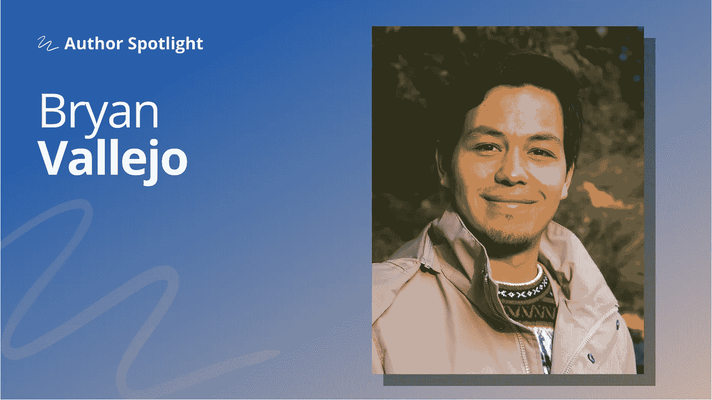

# Bryan R. Vallejo 利用地理空间科学和实时数据来帮助生态保护

> 原文：<https://towardsdatascience.com/bryan-r-vallejo-leverages-geospatial-science-and-real-time-data-to-help-ecological-conservation-3ff7ca8fb007>

## [作者聚焦](https://towardsdatascience.com/tagged/author-spotlights)

## “有时，我只是散散步，了解我所处的环境，并试图揭示模式。”

*在 Author Spotlight 系列中，TDS 编辑与我们社区的成员谈论他们在数据科学领域的职业道路、他们的写作以及他们的灵感来源。今天，我们很高兴与* [*布莱恩·r·瓦莱约*](https://medium.com/u/cbd681aaa725?source=post_page-----3ff7ca8fb007--------------------------------) *分享我们的对话。*

照片由布莱恩·r·瓦列霍提供

*Bryan 在厄瓜多尔天主教大学获得地理和空间规划学士学位，后赴塔尔图大学攻读地理信息学硕士学位。他在赫尔辛基大学完成了 GIS 自动化专业的学位。作为数字地理实验室的前访问成员，他一直参与利用新的大数据源进行的专注于人类移动的研究。*

*在他专业化的一年中，他迷上了海洋野生动物迁徙及其与海洋生态地理变量的相互作用，并开发了* [*海洋野生动物跟踪器*](/marine-wildlife-monitoring-system-with-real-time-phytoplankton-hotspots-9b361dbd2d13) *，这是一个专门用于实时跟踪和卫星数据检索的地理框架。*

Bryan 目前在一家爱沙尼亚私营公司工作，开发带有移动定位数据的客户定制 GIS 解决方案。下班后，他会去上舞蹈课来激励自己，给自己充电。在业余时间，他支持加拉帕戈斯群岛的海洋保护项目，用海洋巨型动物遥测数据实现他的平台。

## *是什么激发了你对地理和数据交叉的兴趣？*

我真的可以说，当我意识到我将成为一名地理学家的那一刻，是在我大学的第一堂地图学课上。我喜欢地图制作，因为这是一种很好的数据交流方式。在我的一生中，我一直被数字、信息学和工作流所吸引，所以数据是我的东西——但是当它成为地理空间数据时，它把我带到了一个全新的世界。

我在人口统计学实践中发现了地理空间处理，我对从空间单位角度发生的转换、聚合、计算和其他类型的数据处理着迷。最终的地图传达了关于社会状况的信息。我很高兴我能够完成这个创造性的分析过程。

当然，我遇到了挑战。当我想操作国家人口普查数据库时，我意识到我的桌面软件开始崩溃，这是我的极限。那时我有一个问题:接下来会发生什么？

## 答案是什么？

我想以最正式的方式应对我的挑战，所以我开始寻找专注于地理空间分析的研究生课程。幸运的是，我在世界的另一端得到了一个机会，我毫不犹豫的勇往直前，寻找我从地理学向地理信息学转型的下一波机会。

## 这听起来像是一个重大的转变。

说实话:这个过程中最困难的部分是离开我的祖国，进入一个充满日常挑战的新文化。但是从最艰难的时刻，我找到了继续发展自己的动力。

当我学习地理空间分析的编程语言时，我克服了自己的极限。蟒蛇是我的盔甲。我花了一年半的时间才在数据操作方面打下坚实的基础。到了第二年，我跳过地理空间物体，感觉就像水中的一条鱼。我发现了新工具，开发了流程，学习了技巧，还分享了许多教程。同样，我得到了开放科学的支持——所以我决定回馈社会。

所以现在我在这里，自动化地理空间过程，创建具有现代可视化的分析工作流，并尝试扩展我的分析。

## 最近，你最感兴趣的是哪种以数据为中心的项目——你希望在职业生涯的下一阶段关注哪些主题？

我已经看到了新一波的项目集中在实时 GIS 上。我喜欢深入这个似乎很有潜力的领域。这是一个地理空间工作流，从实时数据检索开始，然后是动态算法，最后是地图:一个对数据的每一次变化做出反应的漂亮漏斗，提供关于当前情况的见解。

我决定开始自己的实时 GIS 项目，并从 2021 年开始一直致力于此。实际上有很多选择，但我决定选择生态保护*。*在接下来的几个月——我希望是几年——我想继续致力于我的野生动物跟踪实时监控系统，该系统已经有了不错的结果，并在现场实施。我热爱自然，对我来说，一切似乎都与野生动物和生态系统的变化联系在一起，这就像魔法一样。

更具体地说，我想在大数据可扩展性的算法开发和实施方面进一步发展自己。当然，我会添加一个漂亮的地图，这样最终用户可以清楚地看到消息。

我说的是我的个人愿望和我的爱好项目，但是当然，我也乐于看到在我的职业道路上会发生什么。我很想成为一个愿意大规模开发地理信息学解决方案的伟大团队中的一员，在这里我可以找到我的下一个层次。

## 是什么促使你开始公开写自己的作品？

在我的职业发展过程中，自动化地理空间过程成为一项轻松愉快的日常任务。我可以大大减少花在分析过程上的时间，并且能够在地图上找到见解并进行交流。

我脑子里积累了很多想法，很难继续做其他事情，因为我一直带着旧的想法。我需要解放他们，把他们从我的头脑中解放出来，当我写下我的第一个故事时，我感到如释重负。就好像我减轻了一些重量，我的头脑中有了更多的空间来容纳更多的想法。

我在 Medium 和 Data Science 上读到了一些不错的帖子，所以我决定加入并分享我的分析故事。我从开放科学中学到了很多，社区发展模式也很好很友好，所以我很高兴能给世界上其他人提供可以使用的材料。

对于选题，我可以说我有点主题化。我要做的第一件事是选择一个原始数据集，其中包含足够的信息来寻找见解。这取决于我的心情——例如，它可以是社会空间分析、环境、城市，或者仅仅是写我工作的野生动物跟踪系统的应用和使用。然后，我选择一个地理空间过程，引导我找到我想要传递的信息。最后，我创建了一个精心制作的地图，向人们传达最终的信息。

## 你有什么特别的技巧来激发你的创造力吗？

有时候，我只是走一走，了解我所处的环境，并试图揭示模式。城市是有生命的，看到它们的行为很奇妙。有一次，我对赫尔辛基有这么多人骑自行车感到震惊。我很好奇，想在一个过程中真正看到这种模式，所以我写了一个关于[在夏天聚合自行车路线的故事](/visualization-of-bike-sharing-system-movements-in-helsinki-with-an-interactive-flow-map-451d897104fe)。

我感觉最激动的时刻是在故事的开头，因为我需要打开话题，降落在我的想法的路径上。最好给它时间。我把这个话题搁置了一个星期，直到我开始分析。对我来说，重要的不仅是主题，还有你的心情和你想讲述故事的地方。

## ***你有什么建议给那些想写自己数据相关工作，但不知道从哪里开始或如何找到时间的人吗？***

毫无疑问。对于有很好的数据相关工作，愿意和人分享的，我可以从两个角度来建议。

第一个是个人的。写作时找到你的时间和安宁。记住，故事是你思想的一面镜子，所以最好保持清晰。我知道工作可能会持续很长时间，很难找到时间写作。选择一个你感觉自由的日子，放松，喝茶，找个地方。

我可以说，我的许多良好开端都是在穿着睡衣的时候发生的。此外，倾听你的内心和沉默:这将帮助你组织你的想法。要系统，一天一天写。从介绍开始，休息。写正文，休息。分析，睡觉，设计你的结果，然后继续。哪怕每个月发一个故事，你也心满意足了。

第二个角度是技术性的。确保你正在写一篇引人入胜的介绍，并且你正在揭示这个主题及其与人类的相关性。然后，明确故事的目的。你可以陈述一个可以用一个分析过程解决的目标——没有必要包括很多。对我来说，一个好故事需要五到十五分钟的阅读时间。

对于分析，保持简单，突出技术水平，不要详尽无遗。如果你正在编码，找到一个好方法使代码可共享和可重用，这将使其他人感激。在故事的结尾，只要结束你在写作中打开的部分——一个引导你使用分析和解决你陈述的目标的段落。最后，最重要的一点:把你的帖子看一遍两遍，根据需要改正或澄清。你会觉得信息的传递有多好。

现在，我可能会重新倒满我的一杯茶...

## ***无论是在你自己的子领域还是更广泛的数据科学领域，你希望在不久的将来看到什么变化？***

嗯，我真的可以说地理空间科学的发展已经到了我希望的时刻。如果你看一看，大多数地理空间教育材料是开放的，许多资源是开放的，并且在社交媒体上有一个广泛的地理空间社区可以回应你的询问和疑问。接下来会发生什么？

有时我会感到震惊:我可以用一种感觉就像一个刚刚学会如何打开电视的孩子的方式连接到卫星。尽管我觉得这很离谱，但我后来意识到，有人在创造我正在使用的工具。因此，这是一个受到社区支持的知识领域。

地理空间科学的未来是什么？对我来说，地理科学的最后一个创新学派是时间地理学，它涉及到以时间的功能作为其第三维来研究地理现象。我很认真地对待这个未来，所以在过去的两年里，我一直专注于时空分析。

当然，我已经看到了现代 GIS，这是一个引导地理空间科学走向全球和可扩展水平的新趋势。它指的是使用可组合和开发的开放工具来分析空间数据，并以自动化的方式提供有用的见解。老实说，我不喜欢这个新趋势的名字，因为它表明这是最后的和最终的范式。相反，我会根据它的目的来命名它，即在全球范围内扩展。所以我认为在不久的将来真正的新趋势应该被命名为云 GIS。

云 GIS 可以真正在全球范围内扩展，并提供计算资源来运行能够洞察空间数据的模型。我也认为“实时”是这一新趋势的一部分。对于(地理空间)数据科学的未来，我会说它的道路不应该集中在统计模型上，因为它们从 70 年代就已经被开发出来了。如今有更多创新的应用领域，因此地理空间科学的视野应集中于其在现实生活中的使用，并提高人们在日常生活中的舒适度。这个新趋势的迷人之处在于它可以被任何人访问。

要了解布莱恩的更多工作，并了解他的最新项目，请点击 [Medium](https://bryanvallejo16.medium.com/) 和 [Twitter](https://twitter.com/BryanRVallejo) 关注他。如果你没有读过他以前的文章，这里有一个来自 TDS 档案的样本:

*   [**赫尔辛基地区大数据集最近邻分析**](/nearest-neighbor-analysis-for-large-datasets-in-helsinki-79ebc7288c91)**(2021 年 12 月)**
*   **[**马达加斯加年度野火的时空可视化**](/spatiotemporal-visualization-of-yearly-wildfires-in-madagascar-d92c2bd3374f)(2022 年 1 月)**
*   **[**探索城市查看器:一个交互式网络地图，用于可视化全球城市地区的人口**](/discover-urban-viewer-an-interactive-web-map-to-visualize-population-of-urban-areas-worldwide-f36df1fe420d)(2021 年 7 月)**
*   **[**厄瓜多尔加拉帕戈斯群岛洋流季节性**](/ocean-currents-seasonality-in-the-galapagos-islands-ecuador-9197f0b721c0)(2022 年 3 月)**

**想和广大观众分享一些你自己的作品吗？我们很乐意收到你的来信。**

**为了长度和清晰起见，编辑了这个 Q。**