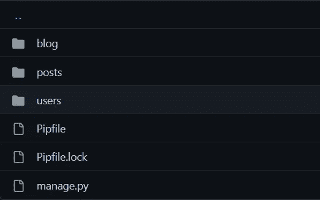

# 使用 Django Rest 框架构建博客网站——概述(第 1 部分)

> 原文：<https://towardsdatascience.com/build-a-blog-website-using-django-rest-framework-overview-part-1-1f847d53753f>

## 让我们使用 Django Rest 框架构建一个简单的博客网站，以了解 DRF 和 REST APIs 如何工作，以及我们如何添加任何前端框架来使用我们使用 DRF 生成的 API


[真诚媒体](https://unsplash.com/@sincerelymedia?utm_source=medium&utm_medium=referral)在 [Unsplash](https://unsplash.com?utm_source=medium&utm_medium=referral) 上拍摄的照片

乡亲们好；我希望你们都很好！在本系列文章中，我们将构建一个简单的博客网站，它具有创建博客、编辑博客、投票支持博客、评论博客和查看特定用户的博客等功能。

我们还可以实现额外的功能，比如关注作者，根据他们关注的人定制用户提要，以及根据他们喜欢阅读的文章类型建议用户关注新作者。

要继续本系列，您需要对 Django 的工作原理有一个基本的了解。假设您想学习更多关于 Django 的知识，以及如何使用 Django 构建 web 应用程序。在这种情况下，我建议您阅读我的文章系列，关于使用 Django 构建社交媒体网站和使用 Django 构建求职门户。我已经制作了完整的网站来帮助你在比常规待办应用更复杂的东西上实现 Django。

[](/build-a-social-media-website-using-django-setup-the-project-part-1-6e1932c9f221)  [](/build-a-job-search-portal-with-django-overview-part-1-bec74d3b6f4e)  

因此，本系列的第一部分将只关注基础知识，并将设置项目基础知识。在接下来的部分中，我们将深入探讨为应用程序的不同方面构建模型、视图和序列化器的细节。

因此，首先，让我们了解什么是 Django Rest 框架，以及为什么它是构建我们的应用程序后端的好框架。

## 为什么选择 Django Rest 框架？

Django Rest 框架(DRF)是构建 web APIs 的强大工具。它建立在流行的 Django web 框架之上。它允许开发人员快速创建各种客户端(包括 web、移动和桌面应用程序)可以使用的 API。DRF 使得创建具有复杂功能的 API 变得很容易，比如身份验证、权限和数据验证，并提供了一套丰富的工具来构建和测试 API。有了 DRF，开发人员可以专注于构建他们的应用程序逻辑，而不是花时间在实现 API 的细节上。这使得它成为构建可伸缩和可维护的 web APIs 的绝佳选择。

DRF 还提供了一个可浏览的 API 接口，允许开发者快速测试和交互他们的 API。这对于调试、故障排除以及向可能使用该 API 的其他开发人员交付文档和示例非常有用。DRF 还支持各种序列化选项，允许开发人员快速返回不同格式的数据，如 JSON 或 XML。总的来说，Django Rest 框架对于任何希望构建健壮可靠的 web APIs 的人来说都是一个有价值的工具。

如果你想了解更多关于 Django Rest 框架(DRF)以及如何使用它，官方文档是最好的地方。

## 构建项目

所以，让我们开始构建项目。首先，我们将创建一个新文件夹来开始我们的项目。因此，我创建了一个父文件夹，并在其中构建了两个名为后端和前端的文件夹。我们将只在后端文件夹中做我们所有的工作。稍后，在下面的文章中，我们将构建一个工作前端，并将其连接到我们的后端，以拥有一个全栈工作网站。但那是未来的事；目前，我们的重点将只在 DRF(后端部分)。

因此，在后端文件夹中，我们将为我们的项目创建一个虚拟环境。为了创建虚拟环境，我更喜欢使用 [pipenv](https://pipenv.pypa.io/en/latest/) ，因为我发现它很容易使用，并且它维护一个 pip 文件而不是 requirements.txt 文件，这使得 Pythonic 项目更容易。

下面给出了用于创建虚拟环境的命令。如果已经安装了 pipenv，应该跳过第一行。

```
pip install pipenv
pipenv shell
activate
```

在创建并激活虚拟环境之后，我们需要安装项目的依赖项。我们现在只需要为我们的项目安装姜戈和 DRF。如果我们需要更多的依赖项，我们可以稍后安装它们。

```
pipenv install django djangorestframework
```

运行上面的代码行将在您的虚拟环境中安装这两个依赖项。我们已经准备好创建我们的应用程序并进行初始设置。

接下来，我们在后端文件夹中创建 Django 项目。为此，我们在 shell 上编写以下命令。

```
django-admin startproject blog .
```

Django 中的`startproject`命令末尾的点用来指定应该创建新 Django 项目的当前目录。这是命令行工具中的一个标准约定。)指的是当前目录。使用点号，我们告诉 Django 在当前目录中创建新的项目文件，而不是在子目录或其他位置。如果您希望出于组织目的将项目文件保存在同一个目录中，这将非常有用。

接下来，我们还要创建两个应用程序— ***用户*** 和 ***帖子*** 。第一个将处理与用户相关的活动，另一个将保存与博客文章相关的逻辑。在我们的例子中，我们将主要使用 ***posts*** 应用程序，在 ***users*** 应用程序中几乎没有逻辑，因为我们将使用默认的 Django 用户模型，不会创建任何用户配置文件或自定义用户模型。但是，我仍然把它分开，因为如果我们想在未来实现跟随作者功能或类似的功能，我们会把所有这些逻辑放在这个应用程序中。

为了创建这两个应用程序，我们将编写以下命令:

```
python manage.py startapp users
python manage.py startapp posts
```

现在，我们的文件结构如下所示:



后端文件夹结构

在这一部分，我们不会进入用户和文章文件夹，因为这是设置部分；我们只处理博客文件夹。

进入 blogs 文件夹，我们会发现文件结构如下:


博客文件夹

现在，我们将只处理 ***settings.py*** 和 ***urls.py*** 文件。首先，我们将把 ***文件移入 settings.py*** 文件。

在设置中，我们将在`INSTALLED_APPS`部分添加`rest_framework`,如下所示:

```
INSTALLED_APPS = [
    "django.contrib.admin",
    "django.contrib.auth",
    "django.contrib.contenttypes",
    "django.contrib.sessions",
    "django.contrib.messages",
    "django.contrib.staticfiles",
    "rest_framework",
    "posts",
    "users",
]
```

正如我们在上面的代码块中看到的，我们还在同一部分添加了`posts`和`users`，这让我们的 Django 项目知道我们已经创建了这两个应用程序，并将在项目中使用它们。

接下来，我们将在 ***settings.py*** 文件中添加这段代码来定义我们的 API 的分页。

```
REST_FRAMEWORK = {
    "DEFAULT_PAGINATION_CLASS": "rest_framework.pagination.PageNumberPagination",
    "PAGE_SIZE": 10
}
```

现在，让我们移动到 ***urls.py*** 文件。我们将添加可浏览的 API 接口 URL，这样我们可以快速测试我们的 API。首先，我们将从`django.urls`导入`path`和`include`，我们将使用它们来定义 URL。

```
from django.urls import path, include
```

接下来，在 URL 模式中，我们将添加我们的可浏览 API 路径，如下所示:

```
urlpatterns = [
    path("admin/", admin.site.urls),
    path("api-auth/", include("rest_framework.urls", namespace="rest_framework")),
]
```

上面代码的第一行是访问 Django 提供的管理面板，第二行是 DRF 提供给我们的可浏览 API 接口。

接下来，我们将迁移数据库(Django 为我们提供了一个嵌入式 SQLite DB)。为此，我们将运行以下命令:

```
python manage.py makemigrations
python manage.py migrate
```

我们可以运行下面的命令来启动本地服务器，并测试是否一切都已完美安装。

```
python manage.py runserver
```

在运行这个命令时，我们得到了我们网站的一个本地服务器，我们可以打开它来访问我们的网站。我们不会得到任何东西，因为我们没有在应用程序中定义任何逻辑。

所以，我们都准备好开始构建我们的项目了。从下一部分开始，我们将开始构建项目的核心逻辑，我们将再用两个部分来完成后端部分，然后开始构建项目的前端，使其成为一个优秀的全栈网站。

我希望大家和我一样对下面的部分感到兴奋，因为我们希望学习并使用 Django Rest 框架构建一个简单的博客网站，并将其连接到一个工作前端。

DRF 系列的下一部分可以在这里找到:

[](/build-a-blog-website-using-django-rest-framework-part-2-be9bc353abf3)  [](/build-a-blog-website-using-django-rest-framework-posts-app-part-3-7334f75983fc)  

感谢您的阅读！如果你喜欢读我的文章，我建议你看看我的其他文章:

[](https://javascript.plainenglish.io/build-an-e-commerce-website-with-mern-stack-part-1-setting-up-the-project-eecd710e2696)  [](https://javascript.plainenglish.io/build-a-blog-app-with-react-intro-and-set-up-part-1-ddf5c674d25b) 