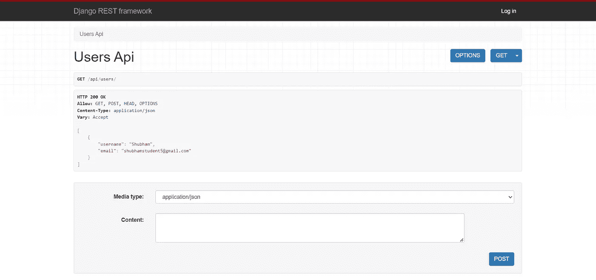
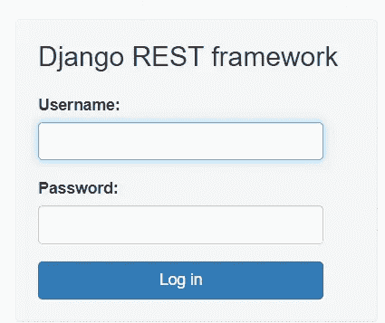

# 使用 Django Rest 框架——用户应用程序构建一个博客网站(第 2 部分)

> 原文：<https://towardsdatascience.com/build-a-blog-website-using-django-rest-framework-part-2-be9bc353abf3>

## 在第二部分中，我们将处理构建用户相关的模型和视图，并将测试用户相关的 API。


[真诚媒体](https://unsplash.com/fr/@sincerelymedia?utm_source=medium&utm_medium=referral)在 [Unsplash](https://unsplash.com?utm_source=medium&utm_medium=referral) 上拍摄的照片

大家好，我希望你们都过得很好，并且喜欢这个 DRF 文章系列的第一部分。在本系列的第一部分中，我们处理了设置这个项目的基础，并且您已经对我们将要构建的项目有了一个大致的了解。

如果你还没有读第一部分，我建议你先去读一读，然后再回到这一部分。以下是该系列的第一部分:

</build-a-blog-website-using-django-rest-framework-overview-part-1-1f847d53753f>  

在这个系列的第二部分，我们将处理完整的`users`应用程序，然后，在第三部分，我们将完成`posts`应用程序来完成这个网站的后端。

> **更新:**当我第一次写这篇文章的时候，我并没有在第二部分中包含一个合适的认证系统。仅支持注册用户和查看所有用户，但如果我们想与前端连接，这是不够的。由于我们想为我们的后端应用程序建立一个工作前端，我们想提供一个登录功能，因为我们不能使用可浏览的 API 登录按钮登录时，我们使用前端。
> 
> 因此，我在本文的一个单独的部分中添加了应用程序所需的完整身份验证，显示了为了使它工作，我们需要做的所有必要的更改。所以，我没有在中间做改动，因为我觉得最好在一个单独的部分做，因为我们只会添加一些东西来增加所需的功能。

我们还将看到如何在构建 API 的同时测试它们，并且我们将使用 Django Rest 框架提供的可浏览 API 接口来完成这项工作。

首先，让我们创建一个超级用户来访问 Django 应用程序的管理面板。为此，我们将在终端中使用以下命令:

```
python manage.py createsuperuser
```

然后，它会询问您的用户名、电子邮件和密码。在您输入所有这些细节之后，它将使用这些凭证创建一个超级用户。您可以使用这些详细信息登录到应用程序，以便能够完全访问网站上的所有功能，还可以访问管理面板。

那么，现在让我们进入`users`应用程序。我们可以看到这个文件夹里面已经创建了很多文件，比如`models.py`、`views.py`、`admin.py`等。

因此，由于我们将使用默认的 Django 用户模型，而不是创建任何定制的用户模型或用户配置文件，因此我们不会在 `models.py`文件中写任何东西。

因此，我们将首先编写序列化程序。创建一个名为`serializers.py`的新文件。我们将在这里序列化我们默认的 Django 用户模型。

## **什么是序列化，我们为什么需要它？**

序列化是将复杂对象转换为易于存储或传输的数据格式的过程。在 Django Rest 框架的上下文中，序列化用于将 Django 模型中的数据转换成可以通过互联网发送并被其他应用程序使用的格式。

以下是为什么序列化在 Django Rest 框架中必不可少的一些具体原因:

1.  它允许您将 Django 模型和查询集转换成 JSON 或 XML 之类的格式，这些格式很容易被前端的其他应用程序或 JavaScript 框架使用。
2.  它允许您精确地控制 API 公开什么数据以及如何格式化数据。这对于安全性以及确保 API 的一致性和易用性非常重要。
3.  它允许您轻松地将复杂的数据结构转换成易于存储或传输的格式。这在处理大型数据集或处理不同对象之间有大量关系的数据时特别有用。

总的来说，序列化是 Django Rest 框架的一个关键特性，它使您能够快速构建各种应用程序和框架都可以使用的 API。

## **serializer . py**

因此，在`serializers.py`文件中，我们将序列化默认的 Django 用户模型。因此，我们将为我们的用户模型使用三个字段— `username`、`email`和`password`。

所以，让我们先看看代码，然后我们就能理解代码的所有部分。

```
from rest_framework import serializers
from django.contrib.auth.models import User

class UserSerializer(serializers.ModelSerializer):
    password = serializers.CharField(min_length = 8, write_only = True)

    class Meta:
        model = User
        fields = ('username', 'email', 'password')
```

正如您在上面的代码块中看到的，首先，我们将从`rest_framework`导入`serializers`，并且我们还从 Django 认证模型导入默认的`User`模型。

接下来，代码定义了一个`UserSerializer`类，用于将`User`模型的实例转换成一种易于序列化的格式，比如 JSON 或 XML。`UserSerializer`类继承自`ModelSerializer`类，后者提供了很多将 Django 模型自动转换成可序列化格式的功能。

`UserSerializer`类定义了一个`password`字段，它是一个最小长度为 8 个字符的`CharField`。`write_only`参数被设置为`True`，这意味着密码字段仅在将数据写入序列化程序时使用，但不会包含在序列化输出中，因为我们不希望密码被泄露。

`UserSerializer`类中的`Meta`类指定了序列化器应该用于的`model`(在本例中是`User`型号)，以及应该包含在序列化输出中的`fields`列表。在这种情况下，`username`、`email`和`password`字段将包含在序列化输出中。

接下来，我们将移动到`views.py`文件，在这里我们将使用序列化数据并编写我们的`users`应用程序的主要逻辑。这是决定我们的应用程序如何处理不同请求的文件。

## **views.py**

在`views.py`文件中，我们将编写与用户相关的`get`和`post`请求——检索所有用户的列表并注册一个新用户。让我们先看看代码，然后我们将详细讨论代码是如何实现的。

```
from rest_framework.views import APIView
from rest_framework.response import Response
from django.contrib.auth.models import User
from .serializers import UserSerializer

class UsersAPIView(APIView):
    def get(self, request):
        users = User.objects.all()
        serializer = UserSerializer(users, many = True)
        return Response(serializer.data)

    def post(self, request):
        serializer = UserSerializer(data = request.data)
        if serializer.is_valid():
            serializer.save()
            return Response(serializer.data, status = 201)
        return Response(serializer.errors, status = 400)
```

因此，首先，我们导入所需的依赖项，并引入我们将在视图中使用的`User`模型和`UserSerializer`。

接下来，代码定义了一个`UsersAPIView`类，它处理对 Django Rest 框架 API 的 HTTP 请求。`UsersAPIView`类继承了`APIView`类，后者为处理 HTTP 请求和返回响应提供了许多有用的功能。

`UsersAPIView`类定义了两个方法:`get`和`post`。当 API 接收到 GET 请求时，调用`get`方法。它从数据库中检索所有的`User`对象，使用一个`UserSerializer`将数据转换成可序列化的格式，并向客户端返回一个包含序列化数据的响应。

此外，正如我们所见，当调用`get`方法时，`many`参数被设置为`UserSerializer`中的`True`，这表明序列化程序应该会处理多个`User`对象。这很重要，因为它允许`UserSerializer`正确处理数据并返回包含所有`User`对象的响应。

如果`many`没有设置为`True`，那么`UserSerializer`一次只会处理一个`User`对象，而`get`方法的响应只会包含一个`User`对象，而不是数据库中的所有`User`对象。

当 API 接收到 POST 请求时，调用`post`方法。它使用`UserSerializer`将请求的数据转换成一个`User`对象，验证数据，如果数据有效，将对象保存到数据库，并向客户机返回一个带有序列化数据的响应。如果数据无效，它将向客户端返回一个错误响应。

接下来，我们必须为我们刚刚创建的视图定义`urls`，这将允许我们使用可浏览的 API 接口来测试我们的 API。

## **urls.py**

我们将不得不修改两个`urls.py`文件，一个在`users`应用中，另一个在`blog`应用中。在`users`应用程序中，我们将创建`urls.py`文件，并且我们将为刚刚创建的视图创建一个 URL。

所以，`users` app 里面的`urls.py`文件的内容是:

```
from django.urls import path, include
from .views import UsersAPIView

urlpatterns = [
    path('', UsersAPIView.as_view()),
]
```

这段代码定义了 Django 应用程序的 URL 模式列表。在 Django 中，URL 模式是一个特定的字符串，它指定了特定资源在 web 上的位置。`urlpatterns`列表定义了一组可以与输入 URL 匹配的模式，并指定应该调用哪个视图函数来处理每个模式。

在这段代码中，`urlpatterns`列表定义了一个匹配空字符串的 URL 模式(即应用程序的根 URL)。这个模式被映射到`UsersAPIView`视图，这意味着对应用程序根 URL 的任何请求都将由`UsersAPIView`视图处理。

使用`as_view()`方法调用`UsersAPIView`视图，该方法创建视图的一个实例并返回一个函数，可以调用该函数来处理传入的请求。这个函数然后被传递给`path()`函数，后者创建一个 URL 模式，可以与传入的 URL 进行匹配。

接下来，在`blog`应用程序的`urls.py`文件中，这是我们 Django 应用程序的根应用程序，我们将添加以下代码:

```
....
from users import urls as users_urls

urlpatterns = [
    ....
    path("api/users/", include(users_urls)),
]
```

`....`只是用于表示的目的，因为我们还有几行代码，就像我们在上一部分添加的那样。

`path()`函数有两个参数:一个字符串指定匹配的模式，另一个是视图函数或其他 URL 模式，应该调用它来处理匹配模式的请求。在这段代码中，`include()`函数作为第二个参数传递，这意味着`path()`函数将包含在`users_urls`变量中定义的 URL 模式。

这允许我们将我们的 URL 模式组织到多个文件中，使我们的代码更干净，更容易维护。因此，正如我们所见，我们已经在`users`应用程序中的`urls.py`文件中定义了我们的`user_urls`，我们将在这里使用它。

所以，包含`users`部分的`blogs` app 的完整`urls.py`文件为:

```
from django.contrib import admin
from django.urls import path, include
from users import urls as users_urls

urlpatterns = [
    path("admin/", admin.site.urls),
    path("api-auth/", include("rest_framework.urls", namespace="rest_framework")),
    path("api/users/", include(users_urls)),
]
```

## 测试 API

现在，让我们通过运行服务器来测试我们刚刚创建的与用户相关的 API。因此，我们将使用下面的命令来启动我们的应用程序。

```
python manage.py runserver
```

它将执行一些系统检查并启动服务器。它将显示运行您的应用程序的 URL。转到那个 URL，因为我们想要测试用户 API，所以我们将转到`[/api/users/](http://127.0.0.1:8000/api/users/)`部分。

转到这个 URL，我们会看到它显示了我们的应用程序中的用户列表和添加新用户的 POST 选项。另外，在右上方，我们可以看到一个登录选项。



DRF 可浏览 API —用户 API —(图片由作者提供)

接下来，如果我们点击**登录**按钮，我们会看到如下页面:



DRF 登录界面—(图片由作者提供)

在这里，我们可以使用之前创建的凭证登录到应用程序。

然后，我们再次被带到 DRF 页面。现在，我们可以尝试使用 POST 按钮向应用程序添加一个新用户。为此，我们将以 JSON 格式提供新的用户数据，如下所示:

```
{
   "username": "Satyam",
   "email": "satyam@gmail.com",
   "password": "testing@123"
}
```

我们将在提供的`Content`部分添加上面的 JSON，然后我们将单击 POST 按钮向我们的应用程序添加一个新用户。然后，它将刷新页面并显示添加的新用户。

如果我们再次单击 GET 按钮，我们可以看到用户列表，它现在包含两个条目，第一个是我们之前创建的超级用户，第二个是我们刚才创建的用户。

这将是我们的应用程序在这个阶段的用户列表:

```
[
    {
        "username": "Shubham",
        "email": "shubhamstudent5@gmail.com"
    },
    {
        "username": "Satyam",
        "email": "satyam@gmail.com"
    }
]
```

您还可以访问管理面板来查看在我们的应用程序中注册的用户，并编辑他们的详细信息。

## 添加完整的身份验证部分

首先，我们将导入几个库，我们将要求它们包含一个合适的认证系统，该系统将使用 **JWT** (JSON Web 令牌)工作。

因此，我们将从导入这些库开始:

```
pipenv install django-cors-headers
pipenv install djangorestframework-simplejwt
```

现在，让我们进入应用程序的`blogs`应用程序中的`settings.py`文件。

```
# add this import
from datetime import timedelta

# at last add these two in the INSTALLED_APPS section
INSTALLED_APPS = [
    ...,
    "rest_framework_simplejwt.token_blacklist",
    "corsheaders",
]

# add the cors middleware
MIDDLEWARE = [
    ...,
    "corsheaders.middleware.CorsMiddleware",
]

# update this part to add the default authentication class to be used
REST_FRAMEWORK = {
    "DEFAULT_PAGINATION_CLASS": "rest_framework.pagination.PageNumberPagination",
    "PAGE_SIZE": 10,
    "DEFAULT_AUTHENTICATION_CLASSES": (
        "rest_framework_simplejwt.authentication.JWTAuthentication",
    ),
}

# add this
SIMPLE_JWT = {
    'ACCESS_TOKEN_LIFETIME': timedelta(minutes=5),
    'REFRESH_TOKEN_LIFETIME': timedelta(days=50),
    'ROTATE_REFRESH_TOKENS': True,
    'BLACKLIST_AFTER_ROTATION': True,
    'UPDATE_LAST_LOGIN': False,

    'ALGORITHM': 'HS256',

    'VERIFYING_KEY': None,
    'AUDIENCE': None,
    'ISSUER': None,
    'JWK_URL': None,
    'LEEWAY': 0,

    'AUTH_HEADER_TYPES': ('Bearer',),
    'AUTH_HEADER_NAME': 'HTTP_AUTHORIZATION',
    'USER_ID_FIELD': 'id',
    'USER_ID_CLAIM': 'user_id',
    'USER_AUTHENTICATION_RULE': 'rest_framework_simplejwt.authentication.default_user_authentication_rule',

    'AUTH_TOKEN_CLASSES': ('rest_framework_simplejwt.tokens.AccessToken',),
    'TOKEN_TYPE_CLAIM': 'token_type',
    'TOKEN_USER_CLASS': 'rest_framework_simplejwt.models.TokenUser',

    'JTI_CLAIM': 'jti',

    'SLIDING_TOKEN_REFRESH_EXP_CLAIM': 'refresh_exp',
    'SLIDING_TOKEN_LIFETIME': timedelta(minutes=5),
    'SLIDING_TOKEN_REFRESH_LIFETIME': timedelta(days=1),
}

# add this line
CORS_ALLOW_ALL_ORIGINS = True
```

…表示在我们刚刚添加的代码之上还有更多代码。所以，我们只是在我们的`settings.py`文件中添加了一些东西。

`rest_framework_simplejwt.token_blacklist`提供了一种简单的方法，使用`SimpleJWT`库将 Django 项目中的 JSON Web 令牌(jwt)列入黑名单。`SimpleJWT`库是 Django REST 框架的一个 JSON Web 令牌认证库。

当用户注销应用程序时，通常会使他们的 JWT 失效，这样就不能再用它来验证将来的请求。这可以通过将 JWT 添加到令牌黑名单来实现。任何随后的要求，提出了黑名单 JWT 将被拒绝。

将 CORS 头文件添加到 Django 项目中很容易。它允许您指定允许哪些源向您的服务器发出请求，以及在这些请求中允许哪些 HTTP 方法和头。

`JWTAuthentication`类是`SimpleJWT`库的一部分，后者是 Django REST 框架的 JSON Web Token (JWT)认证库。它允许您使用 jwt 验证 API 请求。

`SIMPLE_JWT`设置是用于配置`SimpleJWT`库的字典，该库是 Django REST 框架的 JSON Web Token (JWT)认证库。它允许我们使用 jwt 认证 API 请求。

下面是对`SIMPLE_JWT`字典中每个键的简要解释:

*   `ACCESS_TOKEN_LIFETIME`:访问令牌的生命周期，这些令牌是用于认证 API 请求的 jwt。这被指定为一个`timedelta`对象。
*   `REFRESH_TOKEN_LIFETIME`:刷新令牌的生命周期，是用来获取新的访问令牌的 jwt。这被指定为一个`timedelta`对象。
*   `ROTATE_REFRESH_TOKENS`:一个布尔值，指示当刷新令牌用于获取新的访问令牌时，它们是否应该被循环(无效并替换为新的令牌)。
*   `BLACKLIST_AFTER_ROTATION`:布尔值，表示是否应将循环刷新令牌添加到令牌黑名单。
*   `UPDATE_LAST_LOGIN`:boolean，表示当使用刷新令牌获取新的访问令牌时，是否应该更新用户的`last_login`字段。
*   `ALGORITHM`:应该用于签署 jwt 的算法。这必须是有效的 JWT 签名算法。
*   `VERIFYING_KEY`:应该用来验证 jwt 签名的密钥。
*   `AUDIENCE`:jwt 应该面向的受众。
*   `ISSUER`:jwt 应该发行的发行方。
*   `JWK_URL`:JSON Web Key Set(JWKS)的 URL，可用于验证 jwt 的签名。
*   `LEEWAY`:验证 jwt 到期时间时应该允许的余量。
*   `AUTH_HEADER_TYPES`:一组字符串，指定`JWTAuthentication`类应该接受的`Authorization`头的类型。
*   `AUTH_HEADER_NAME`:应该由`JWTAuthentication`类使用的`Authorization`头的名称。
*   `USER_ID_FIELD`:用户模型上用于获取用户 ID 的字段名称。
*   `USER_ID_CLAIM`:应该用于获取用户 ID 的 JWT 有效负载中声明的名称。
*   `USER_AUTHENTICATION_RULE`:根据用户 ID，使用函数名对用户进行认证。
*   `AUTH_TOKEN_CLASSES`:字符串元组，指定应该用来创建 jwt 的类。
*   `TOKEN_TYPE_CLAIM`:JWT 有效载荷中声明的名称，该名称应该用于指定 JWT 的类型。
*   `TOKEN_USER_CLASS`:类名应该用来表示与 JWT 关联的用户。
*   `JTI_CLAIM`:应该用于存储 JWT ID 的 JWT 有效载荷中声明的名称。
*   `SLIDING_TOKEN_REFRESH_EXP_CLAIM`:JWT 有效负载中声明的名称，该名称应该用于存储滑动令牌的刷新到期时间。
*   `SLIDING_TOKEN_LIFETIME`:滑动令牌的生命周期，它是具有动态过期时间的 jwt，每次使用令牌对请求进行身份验证时都会更新。这被指定为一个`timedelta`对象。
*   `SLIDING_TOKEN_REFRESH_LIFETIME`:滑动令牌刷新令牌的生存期，用于获取新的滑动令牌。这被指定为一个`timedelta`对象。

接下来，我们将转到`users`应用程序，为使用 JWT 令牌的登录支持添加必要的内容。

因此，我们将首先更新我们的`serializers.py`文件。下面是相同的更新代码。

```
from rest_framework import serializers
from django.contrib.auth.models import User
from rest_framework_simplejwt.serializers import TokenObtainPairSerializer

class UserSerializer(serializers.ModelSerializer):
    password = serializers.CharField(min_length = 8, write_only = True)

    class Meta:
        model = User
        fields = ('username', 'email', 'password')

class MyTokenObtainPairSerializer(TokenObtainPairSerializer):
    @classmethod
    def get_token(cls, user):
        token = super().get_token(user)
        token['username'] = user.username
        token['email'] = user.email
        return token
```

如我们所见，我们的`UserSerializer`保持不变。我们只添加了`MyTokenObtainPairSerializer`类。

`MyTokenObtainPairSerializer`类是来自`SimpleJWT`库的`TokenObtainPairSerializer`的子类，该库是 DRF 的 JWT 认证库。它用于序列化和反序列化令牌，这些令牌用于使用 jwt 对 API 请求进行身份验证。

`MyTokenObtainPairSerializer`类覆盖了基类`TokenObtainPairSerializer`的`get_token`方法。`get_token`方法负责生成 JWT，当客户端验证一个请求时返回给客户端。

在被覆盖的`get_token`方法中，`super().get_token(user)`调用将调用基类`TokenObtainPairSerializer`的`get_token`方法，并返回它生成的 JWT。然后通过将`user`对象的`username`和`email`字段添加到 JWT 有效载荷来修改 JWT。然后返回修改后的 JWT。

接下来，我们移动到`views.py`文件，在这里我们将为令牌部分添加几行。

```
from rest_framework.views import APIView
from rest_framework.response import Response
from django.contrib.auth.models import User
from .serializers import UserSerializer
from rest_framework_simplejwt.views import TokenObtainPairView
from .serializers import MyTokenObtainPairSerializer

class UsersAPIView(APIView):
    def get(self, request):
        users = User.objects.all()
        serializer = UserSerializer(users, many = True)
        return Response(serializer.data)

    def post(self, request):
        serializer = UserSerializer(data = request.data)
        if serializer.is_valid():
            serializer.save()
            return Response(serializer.data, status = 201)
        return Response(serializer.errors, status = 400)

class MyTokenObtainPairView(TokenObtainPairView):
    serializer_class = MyTokenObtainPairSerializer
```

正如我们所见，我们只添加了一个使用`MyTokenObtainPairSerializer`类的新类`MyTokenObtainPairView`。

接下来，我们移动到`urls.py`文件，并为登录和令牌刷新添加新的访问端点。修改后的`urls.py`文件如下:

```
from django.urls import path, include
from .views import UsersAPIView, MyTokenObtainPairView
from rest_framework_simplejwt.views import TokenRefreshView

urlpatterns = [
    path('', UsersAPIView.as_view()),
    path('login/', MyTokenObtainPairView.as_view()),
    path('token/refresh/', TokenRefreshView.as_view()),
]
```

如我们所见，我们添加了两个不同的`urlpatterns`，分别用于登录和刷新令牌。

`TokenRefreshView`视图允许我们通过向视图发送带有刷新令牌的请求来刷新 JSON Web 令牌(JWT)。

JWT 刷新流程的工作方式如下:

1.  客户端向服务器认证，并接收访问令牌和刷新令牌。
2.  客户端使用访问令牌向受保护的资源发出请求。
3.  如果访问令牌已过期，服务器会响应 401 未授权错误。
4.  然后，客户机用刷新令牌向`TokenRefreshView`视图发出请求。
5.  如果刷新令牌有效，视图向客户端发布新的访问令牌和刷新令牌。

现在，我们可以使用可浏览的 API 接口或 API 测试应用程序(如 Postman)来测试这种身份验证。我推荐 Postman，因为它的功能更加丰富，并且允许您轻松地提供访问令牌来请求访问任何受保护的视图。

所以，这就是这部分的全部内容。在下一部分，我们将处理这个应用程序的`posts`应用程序，并将完成这个系列的后端部分。

我希望你喜欢阅读这篇文章，并学到一些新的和令人兴奋的东西。我将很快写下一部分，一旦它们出版，我会在这里把它们连接起来。

该系列文章的下一部分可以在下面找到:

</build-a-blog-website-using-django-rest-framework-posts-app-part-3-7334f75983fc>  

读完这篇文章后，我推荐阅读以下系列文章:

<https://javascript.plainenglish.io/build-an-e-commerce-website-with-mern-stack-part-1-setting-up-the-project-eecd710e2696>  </build-a-social-media-website-using-django-setup-the-project-part-1-6e1932c9f221> 