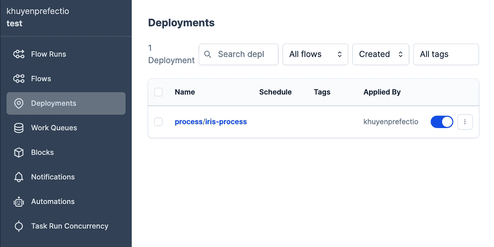
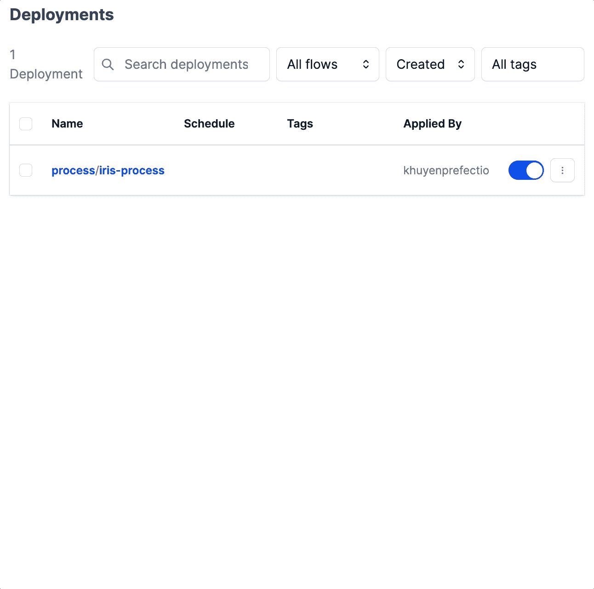
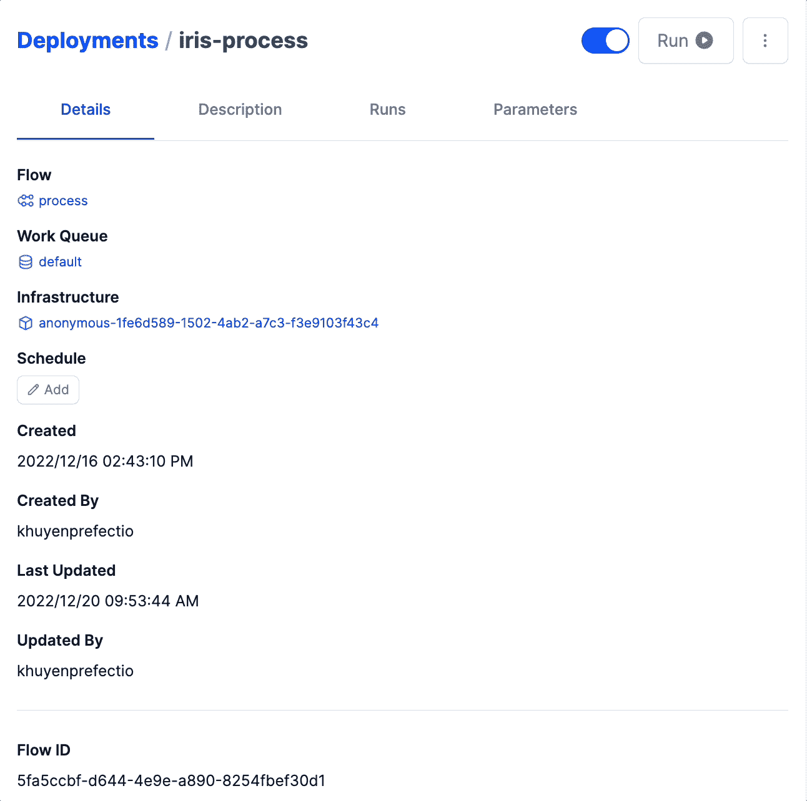
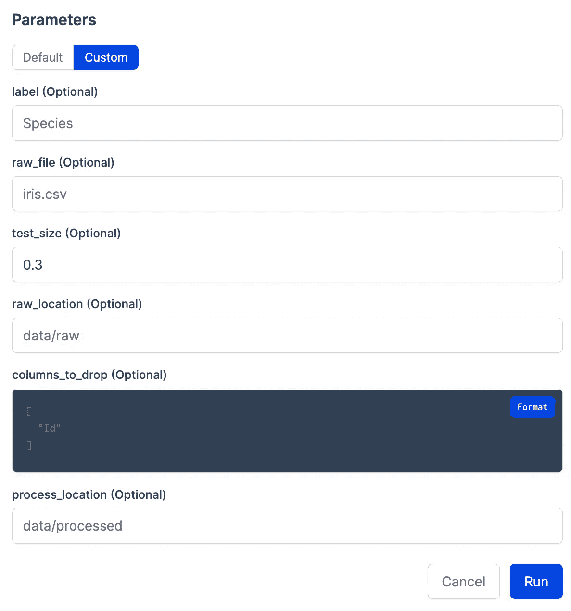
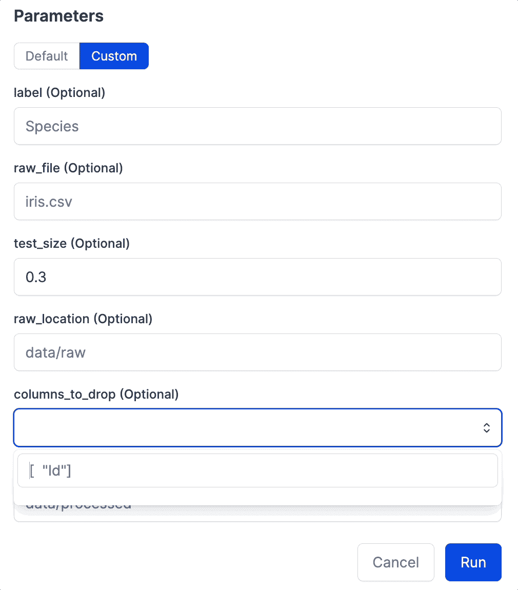
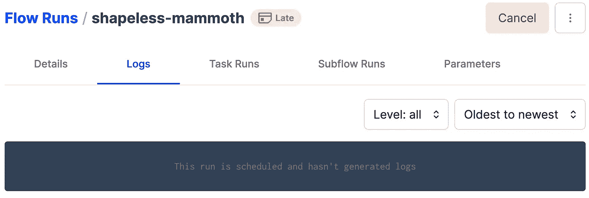
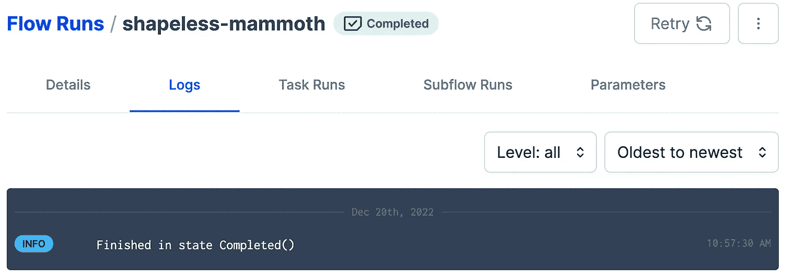
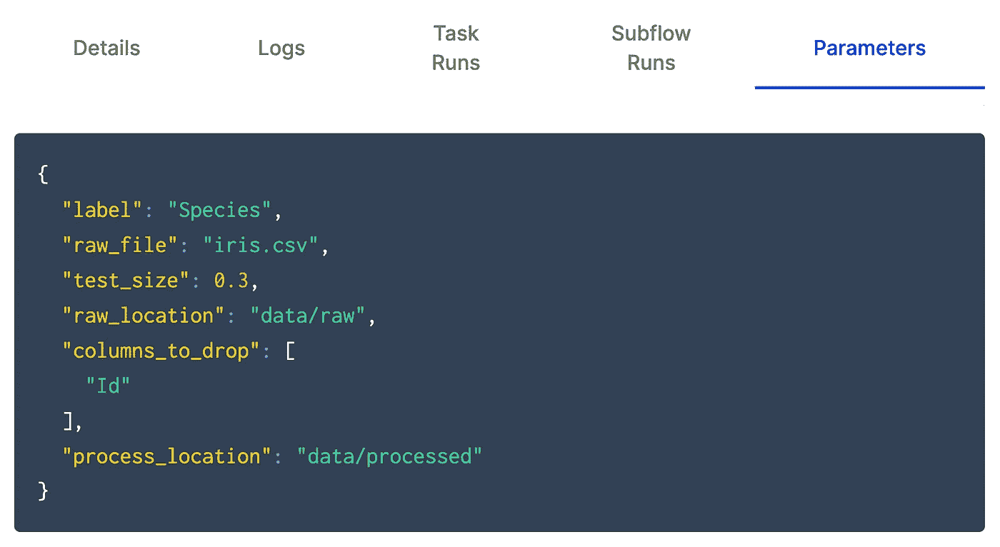
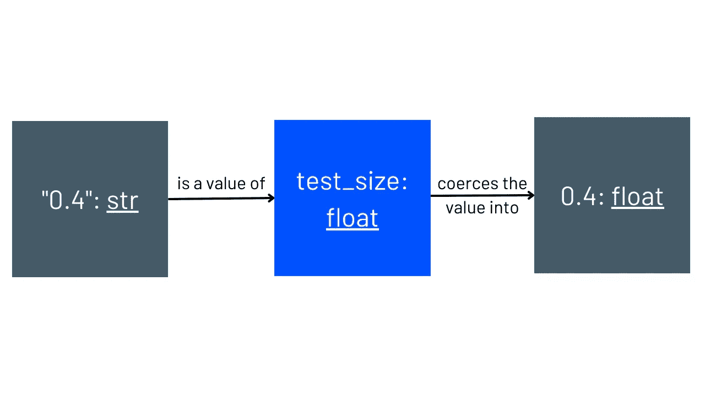
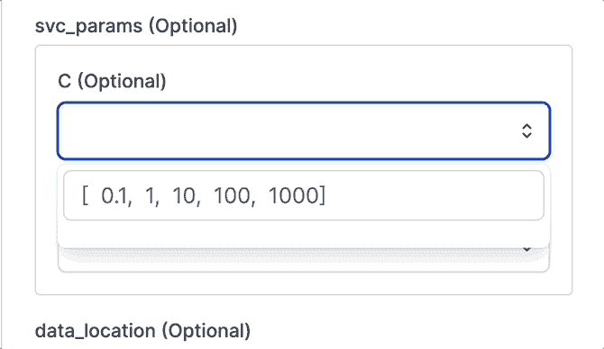

# 用 Pydantic 和 Prefect 构建全栈 ML 应用程序

> 原文：<https://towardsdatascience.com/build-a-full-stack-ml-application-with-pydantic-and-prefect-915f00fe0c62>

## 用一行代码创建 ML 特征工程的用户界面

## 动机

作为一名数据科学家，您可能会经常调整您的特征工程流程，并调整您的机器学习模型以获得良好的结果。

不用深入代码来更改函数参数:


作者图片

…，如果能从 UI 中更改参数值不是很好吗？


作者图片

这就是 Pydantic 和 Prefect 派上用场的地方。在本文中，您将学习如何使用这两个工具来:

*   通过 UI 调整您的函数输入值
*   在运行函数之前验证参数值


作者图片

您可以随意使用本文的源代码:

[](https://github.com/khuyentran1401/iris-prefect)  

# 用提督创建用户界面

perfect 是一个开源库，允许你编排和观察用 Python 定义的数据管道。

[](https://medium.com/the-prefect-blog/orchestrate-your-data-science-project-with-prefect-2-0-4118418fd7ce)  

要安装提督，请键入:

```
pip install prefect
```

让我们使用 Prefect UI 为您的 Python 函数创建一个简单的前端应用程序。从用户界面运行该功能有三个步骤:

*   把你的功能变成一种流动
*   为流创建部署
*   启动代理来运行部署

## 将功能转化为流程

从把一个简单的功能变成一个*流程*开始。

一个[流程](https://docs.prefect.io/concepts/flows/)是所有完美工作流程的基础。要将`process`函数转换成流程，只需将`flow`装饰器添加到`process`函数中。

```
# process.py

from prefect import flow

@flow # add a decorator
def process(
    raw_location: str = "data/raw",
    process_location: str = "data/processed",
    raw_file: str = "iris.csv",
    label: str = "Species",
    test_size: float = 0.3,
    columns_to_drop: list = ["Id"],
):
    data = get_raw_data(raw_location, raw_file)
    processed = drop_columns(data, columns=columns_to_drop)
    X, y = get_X_y(processed, label)
    split_data = split_train_test(X, y, test_size)
    save_processed_data(split_data, process_location)
```

> 点击查看完整脚本[。](https://github.com/khuyentran1401/iris-prefect/blob/master/src/process_without_prefect.py)

## 为流创建部署

接下来，我们将创建一个*部署*来从 UI 运行流程。一个[部署](https://docs.prefect.io/concepts/deployments/)是一个服务器端的概念，它封装了一个流，允许它通过 API 被触发。

为了在`process.py`文件中创建`process`流的部署，在您的终端中键入以下内容:

```
prefect deployment build process.py:process -n 'iris-process' -a
```

其中:

*   `-n 'iris-process'`指定部署的名称为`iris-process`
*   `-a`告诉提督同时构建和应用部署

要从 UI 查看您的部署，请登录到您的 Prefect Cloud accoun 或在您的本地计算机上启动 Prefect Orion 服务器:

```
prefect orion start
```

打开网址 [http://127.0.0.1:4200/](http://127.0.0.1:4200/) ，应该会看到提督 UI:


作者图片

点击的【部署】标签查看所有部署。



作者图片

## 运行部署

要用默认参数值运行一个部署，选择该部署，点击按钮，然后点击【快速运行】



作者图片

要使用自定义参数值运行部署，单击按钮*，*然后单击“自定义运行”



作者图片

您可以看到，Prefect 根据类型注释为您的流参数自动创建不同的输入元素。例如:

*   文本字段用于`label: str`、`raw_file: str`、`raw_location: str`和`process_location: str`
*   数字字段用于`test_size: float`
*   多行文本字段用于`columns_to_drop: list`



作者图片

我们可以通过以下方式增强用户界面:

*   使用`typing.List[str]`将`columns_to_drop`变为多选字段
*   使用`typing.Literal['option1', 'option2']`将`raw_location`变为下拉菜单。

```
from typing import List, Literal

@flow
def process(
    raw_location: Literal["data/raw", "data/processed"] = "data/raw", # replace str
    process_location: Literal["data/raw", "data/processed"] = "data/processed", # replace str
    raw_file: str = "iris.csv",
    label: str = "Species",
    test_size: float = 0.3,
    columns_to_drop: List[str] = ["Id"], # replace list 
):
...
```

要将更改应用到参数模式，再次运行`prefect deployment build`命令:

```
prefect deployment build process.py:process -n 'iris-process' -a
```

现在，您将看到一个多选字段和下拉菜单。



作者图片

要查看您的所有流程运行，单击`Flow Runs`选项卡:


作者图片

现在，当您查看最新的流程运行时，您会看到其状态为`Late`。



作者图片

这是因为没有[代理](https://docs.prefect.io/concepts/work-queues/)来运行部署。让我们通过在终端中键入以下命令来启动代理:

```
prefect agent start -q default
```

`-q default`标志告诉提督使用默认的工作队列。

启动代理后，流程运行将被代理拾取，并在完成后标记为`Completed`。



作者图片

通过单击“参数”选项卡，您可以查看用于该特定运行的参数值。



作者图片

# 用 Pydantic 验证参数

## 在运行流程之前验证参数

[Pydantic](https://docs.pydantic.dev/) 是一个 Python 库，通过利用类型注释进行数据验证。

默认情况下，Prefect 使用 Pydantic 来强制流参数的数据类型，并在执行流运行之前验证它们的值。因此，带有类型提示的流参数被自动强制转换为正确的对象类型。



作者图片

在下面的代码中，类型注释指定`test_size`是一个浮动对象。因此，Prefect 将字符串输入强制转换成一个 float 对象。

```
@flow
def process(
    raw_location: str = "data/raw",
    process_location: str = "data/processed",
    raw_file: str = "iris.csv",
    label: str = "Species",
    test_size: float = 0.3,
    columns_to_drop: List[str] = ["Id"],
):
    ...

if __name__ == "__main__":
    process(test_size='0.4') # "0.4" is coerced into type float
```

## 使用 Pydantic 模型分组参数

还可以使用 Pydantic 将参数组织成逻辑组。

例如，您可以:

*   将指定位置的参数分组到`data_location`组。
*   将处理数据的参数归入`process_config`组。


作者图片

要完成这种很好的参数分组，只需使用 Pydantic 模型。

模型只是继承自`pydantic.BaseModel`的类。每个模型代表一组参数。

```
from pydantic import BaseModel

class DataLocation(BaseModel):
    raw_location: Literal["data/raw", "data/processed"] = "data/raw"
    raw_file: str = "iris.csv"
    process_location: Literal["data/raw", "data/processed"] = "data/processed"

class ProcessConfig(BaseModel):
    drop_columns: List[str] = ["Id"]
    label: str = "Species"
    test_size: float = 0.3 
```

接下来，让我们使用模型作为流参数的类型提示:

```
@flow
def process(
    data_location: DataLocation = DataLocation(),
    process_config: ProcessConfig = ProcessConfig(),
):
    ...
```

要访问模型的字段，只需使用`model.field`属性。例如，要访问`DataLocation`模型中的`raw_location`字段，请使用:

```
data_location = DataLocation()
data_location.raw_location
```

> 你可以在这里了解更多关于 Pydantic 模型[。](https://docs.pydantic.dev/usage/models/)

## 创建自定义验证

Pydantic 还允许您用`validator`装饰器创建定制的验证器。

让我们创建一个名为`must_be_non_negative`的验证器，它检查`test_size`的值是否为非负。

```
from pydantic import BaseModel, validator

class ProcessConfig(BaseModel):
    drop_columns: List[str] = ["Id"]
    label: str = "Species"
    test_size: float = 0.3

    @validator("test_size")
    def must_be_non_negative(cls, v):
        if v < 0:
            raise ValueError(f"{v} must be non-negative")
        return v
```

如果`test_size`的值为负，Pydantic 将产生一个`ValueError`:

```
pydantic.error_wrappers.ValidationError: 1 validation error for ProcessConfig
test_size
  -0.1 must be non-negative (type=value_error)
```

> 你可以在这里了解更多关于验证器的信息。

# ML 项目中 Pydantic 和 Prefect 的用例

机器学习项目需要数据科学家经常调整 ML 模型的参数，以获得良好的性能。

使用 Pydantic 和 Prefect，您可以在 UI 上为每个参数选择一组值，然后在 GridSearch 中使用这些值。

```
# train.py

class DataLocation(BaseModel):
    raw_location: Literal["data/raw", "data/processed"] = "data/raw"
    raw_file: str = "iris.csv"
    process_location: Literal["data/raw", "data/processed"] = "data/processed"

class SVC_Params(BaseModel):
    C: List[float] = [0.1, 1, 10, 100, 1000]
    gamma: List[float] = [1, 0.1, 0.01, 0.001, 0.0001]

    @validator("*", each_item=True)
    def must_be_non_negative(cls, v):
        if v < 0:
            raise ValueError(f"{v} must be non-negative")
        return v

@flow
def train_model(model_params: SVC_Params = SVC_Params(), X_train, y_train):
    grid = GridSearchCV(SVC(), model_params.dict(), refit=True, verbose=3)
    grid.fit(X_train, y_train)
    return grid
```

> [查看完整脚本。](https://github.com/khuyentran1401/iris-prefect/blob/master/src/train_model.py)



作者图片

# 结论

恭喜你！你刚刚学会了如何通过完美的用户界面参数化你的 ML 训练过程和特征工程。

调整参数值并确保它们具有正确的格式和数据类型的能力，将使您和您的队友在 ML 工作中更容易、更快速地试验不同的参数值。

我喜欢写关于数据科学概念的文章，喜欢玩不同的数据科学工具。你可以在 LinkedIn 和 T2 Twitter 上与我联系。

星[这个回购](https://github.com/khuyentran1401/Data-science)如果你想检查我写的文章的代码。在 Medium 上关注我，了解我的最新数据科学文章:

[](/validate-your-pandas-dataframe-with-pandera-2995910e564)  [](/create-observable-and-reproducible-notebooks-with-hex-460e75818a09)  [](/dvc-github-actions-automatically-rerun-modified-components-of-a-pipeline-a3632519dc42)  [](/4-pre-commit-plugins-to-automate-code-reviewing-and-formatting-in-python-c80c6d2e9f5) 