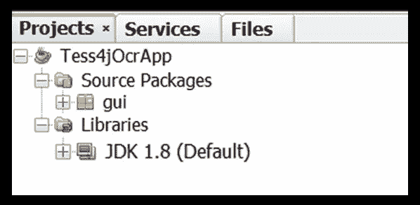
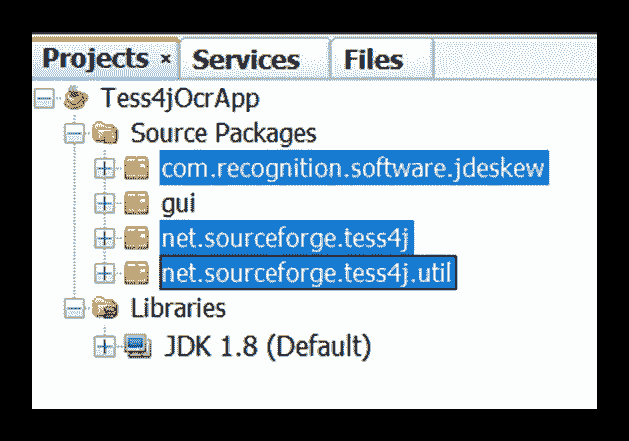
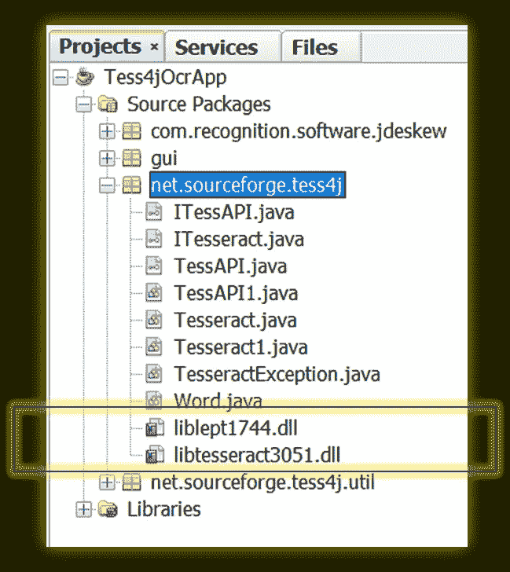
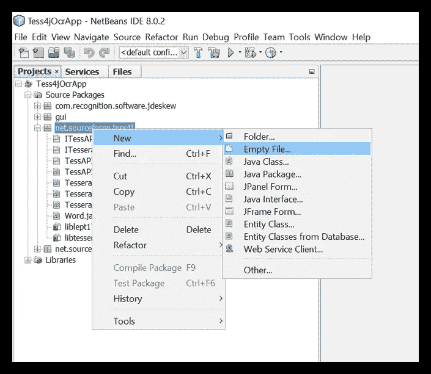
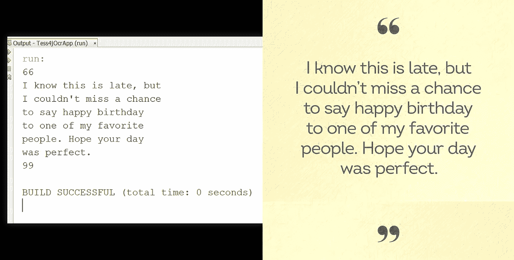
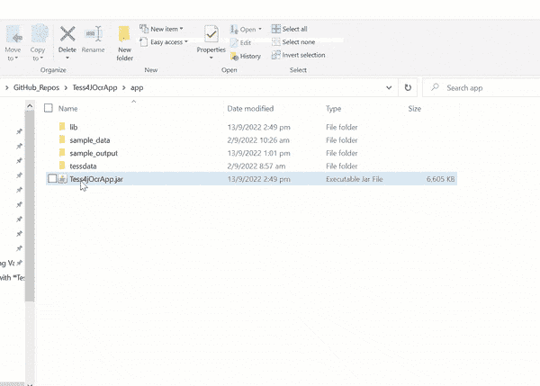
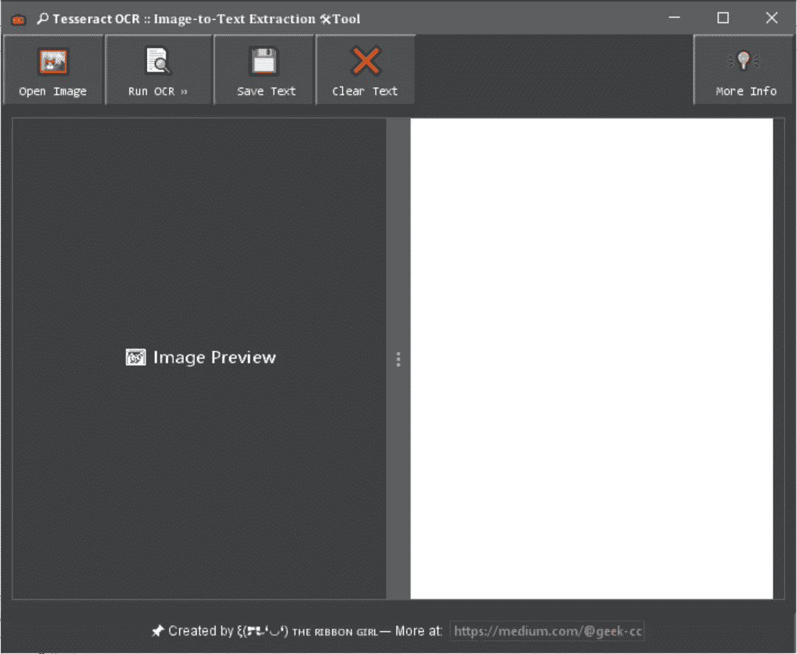

# 使用 Tess4J——一种用于 Java 的 Tesseract 包装器，通过 4 个步骤构建一个可移植的 OCR 工具

> 原文：<https://towardsdatascience.com/build-a-portable-ocr-tool-in-4-steps-with-tess4j-jar-a-tesseract-wrapper-for-java-6d1be3f0cb3d>

## 探索 Tess4J 的第一部分。完整的源代码(Java SDK 1.8)和应用程序链接包括在内。


作者插图|通过 OCR 技术提取图像到文本

# 辅助项目的基本原理

随着多个经济领域越来越认识到数据的价值，许多商业实体毫不奇怪地陷入了数字化的热潮——即将信息转换为计算机可读格式。

> ❝虽然工作场所的数字化非常有益，但是从硬拷贝文件中提取数据仍然是 information❞成功全面计算机化的一个明显障碍

随着 [**光学字符识别** ( **OCR** )](https://viso.ai/computer-vision/optical-character-recognition-ocr/) 技术的出现，幸运的是，手动数据提取的开销大大减少了。虽然每个 OCR 引擎在文本提取功能方面都有其优势和劣势，但我在本文中选择的实现应该是 [Tesseract-OCR](https://github.com/tesseract-ocr) ，因为它是开源的，拥有强大的社区支持和丰富的文档。由于我过去的一些与 OCR 相关的创作只利用了 [TesseractJS](https://tesseract.projectnaptha.com/) ，OCR 引擎的一个纯 JavaScript 端口*(完整的实现细节请参考下面的文章)*

[](https://javascript.plainenglish.io/build-a-text-to-speech-app-using-client-side-javascript-98cd72df73bb) [## 使用客户端 JavaScript 构建一个文本到语音的应用程序

### OCR 技术(Tesseract.js)和 Web 语音 API 的融合。包括完整的代码实现。

javascript.plainenglish.io](https://javascript.plainenglish.io/build-a-text-to-speech-app-using-client-side-javascript-98cd72df73bb) [](/build-an-image-pdf-text-extraction-tool-with-tesseract-ocr-using-client-side-javascript-6126031001) [## 使用客户端 JavaScript 通过 Tesseract OCR 构建图像和 PDF 文本提取工具

### pdf . js+tessera CT . js—OCR 和 Web 技术的融合。包括完整的代码实现。

towardsdatascience.com](/build-an-image-pdf-text-extraction-tool-with-tesseract-ocr-using-client-side-javascript-6126031001) 

我决定使用[Tess4J](http://tess4j.sourceforge.net/)(Java 中的 Tesseract-OCR)来代替，以便用不同的方法更深入地研究 [Tesseract-OCR](https://github.com/tesseract-ocr) 。

# [Tess4J](http://tess4j.sourceforge.net/) 的技术实现

在开发文本提取工具之前，必须首先检索 Java 应用程序的所有依赖项。

## **先决条件**

**i.** 取两个`.dll`文件:`liblept1744.dll` & `libtesseract3051.dll`

*   下载 [Lept4J-1.62.2-src.zip](https://sourceforge.net/projects/tess4j/files/lept4j/1.6.2/) 。对于 64 位 Windows，在以下位置提取所需的文件:

```
./Lept4J/lib/win32-x86–64/liblept1744.dll
```

*   下载**[Tess4J-3 . 4 . 1-src . zip](https://sourceforge.net/projects/tess4j/files/tess4j/3.4.1/Tess4J-3.4.1-src.zip/download)*(仅供参考:对于此项目，使用的 Tess4J 版本是 3.4.1)* 对于 64 位 Windows，在以下位置提取所需文件:**

```
./Tess4J/lib/win32-x86–64/libtesseract3051.dll
```

****二。**继续在您的首选 IDE(例如 NetBeans IDE)上设置一个新的 Java 应用程序项目。此后，它应该看起来像这样:**

****

**图片作者|上面的截图显示了 NetBeans IDE 中新创建的 Java 应用程序项目。在这个设置中，我在 main.class 所在的位置创建了一个名为“gui”的包。**

## **在项目中构建应用程序的 4 个步骤**

**(注意:为了简单起见，项目名称被指定为 **Tess4jOcrApp** )**

****第一步。**在之前提取的同一个 Tess4j 文件夹中，在`./Tess4J/src`文件夹下，继续复制两个文件夹— `com` + `net`，并通过 IDE 粘贴到项目中:**

****

**作者截图|添加两个文件夹— `com` + `net`后，应该和上面差不多。**

****第二步。**检索两个`.dll`文件:`liblept1744.dll` `libtesseract3051.dll`**

****主要目标:**将两个文件作为应用程序源代码的一部分包含到包`net.sourceforge.tess4j`中**

****

**作者图片|截图显示 2。dll 文件反映在 IDE 上的项目源代码中**

*   **为此，选择项目并右击添加一个**空文件****

****

**作者截屏|右键单击并在上下文菜单中显示添加“空文件”的选项。**

*   **将空文件重命名为`liblept1744.dll` ，并手动将其替换为项目中的实际文件。对`libtesseract3051.dll`重复相同的步骤**

****步骤三。**导入 JAR 依赖项— 2 个选项**

****选项(1)。**所有 JAR 依赖项都可以通过文件夹`Tess4J`从其原始源中检索**

```
./Tess4J/lib/*.jar
./Tess4J/dist/tess4j-3.4.1.jar
```

****选项②。**或者，可以随意下载我的 GitHub 中整合的 JAR 文件的完整列表—[Tess 4 joc rapp/tree/main/app/lib](https://github.com/incubated-geek-cc/Tess4JOcrApp/tree/main/app/lib)**

**(注意 [flatlaf-2.4.jar](https://github.com/incubated-geek-cc/Tess4JOcrApp/blob/main/app/lib/flatlaf-2.4.jar) 是可选的，因为它是 Java Swing GUI 的实用程序，而不是 OCR 依赖项。)**

****

**作者截图| JAR 依赖项列表在上图中用黄色框突出显示。**

****第四步。**继续从`./Tess4J/tessdata`复制文件夹`tessdata`并粘贴到项目的工作文件夹中。**

**(**重要！** —这是训练 Tesseract ML 模型识别英文字符所必需的。)**

**最后，为了确保项目已经正确配置并按预期工作，只需通过在主类中运行几行代码来测试 OCR 功能。这至少应包括—**

*   **宇宙魔方的一个实例**
*   **镶嵌方 ML 模型的数据路径(`tessdata`)配置**
*   **通过解析包含英文字符的输入图像文件，调用主要函数:`doOCR()`**

****注意:**用于测试的图像链接可从 [bday_card.jpg](https://github.com/incubated-geek-cc/Tess4JOcrApp/blob/main/app/sample_data/bday_card.jpg) 获得**

**作者代码片段|调用函数 doOCR()以确保应用程序能够准确地检测和输出输入图像中的嵌入文本。**

****

**作者截图|文本提取完成后，程序从输入图像源( [bday_card.jpg](https://github.com/incubated-geek-cc/Tess4JOcrApp/blob/main/app/sample_data/bday_card.jpg) )输出所有检测到的英文字符**

**从上面的显示，*排除标点符号和其他特殊字符*，应用程序的 OCR 功能显示能够识别输入图像✔️中存在的所有英文字母💯**

> ***最后，图像到文本提取工具已经成功创建并可以使用了！🤩***

## **(可选)文本提取工具的用户界面**

**验证完代码运行正常后，我选择更进一步，用 Java Swing 的 GUI 工具包创建了一个[图形用户界面(GUI)](https://www.britannica.com/technology/graphical-user-interface) :**

****

**作者截屏|展示文本提取工具的 GUI 和功能**

****

**作者应用程序截图|左侧面板—呈现上传的图像|右侧面板—选择**【运行 OCR】**后，所有提取的文本都输出到文本区**

****参考消息:**完整的源代码可以从我在 [Tess4JOcrApp](https://github.com/incubated-geek-cc/Tess4JOcrApp) 的 Github repo 中检索到。请随意到⭐和🔱它！**

## **个人评论**

**虽然 [Tess4J](http://tess4j.sourceforge.net/) 的 OCR 特性已经成功集成到 Java 应用程序中，但其他常见的输入格式(如 PDF 文档)尚未包含在此次迭代中。由于 [Tess4J](http://tess4j.sourceforge.net/) 仍有很大的探索空间，该项目的下一部分不仅要继续处理图像文件，还要继续处理 PDF 文档。**

**现在你知道了！非常感谢你坚持到这篇文章的结尾！❤ **由于第二部分仍在进行中**，如果你觉得这篇文章有用，并希望继续关注这个宠物项目即将到来的内容，请随时[关注我的媒体](https://medium.com/@geek-cc)！会非常感激—😀**

**— 🌮请给我买一份玉米卷🎀˶❛◡❛)**

**[](https://geek-cc.medium.com/membership) [## 通过我的推荐链接加入灵媒——李思欣·崔

### 获得李思欣·崔和其他作家在媒体上的所有帖子！😃您的会员费直接…

geek-cc.medium.com](https://geek-cc.medium.com/membership)**