# 构建一个健壮的工作流，用 Python 可视化趋势 GitHub 存储库

> 原文：<https://towardsdatascience.com/build-a-robust-workflow-to-visualize-trending-github-repositories-in-python-98f2fc3e9a86>

## 在本地机器上获取 GitHub 的最新趋势

# 动机

GitHub feed 是一个很好的方式，可以让你跟踪社区的趋势。你可以通过查看你的连接来发现一些有用的存储库。


作者图片

然而，可能有一些您不关心的存储库。例如，您可能只对 Python 库感兴趣，但是在您的 GitHub feed 上有用其他语言编写的库。因此，您可能需要一段时间才能找到有用的库。

如果您可以创建一个个人仪表板，显示您的连接所遵循的存储库，并按您喜欢的语言进行过滤，如下所示，这不是很好吗？

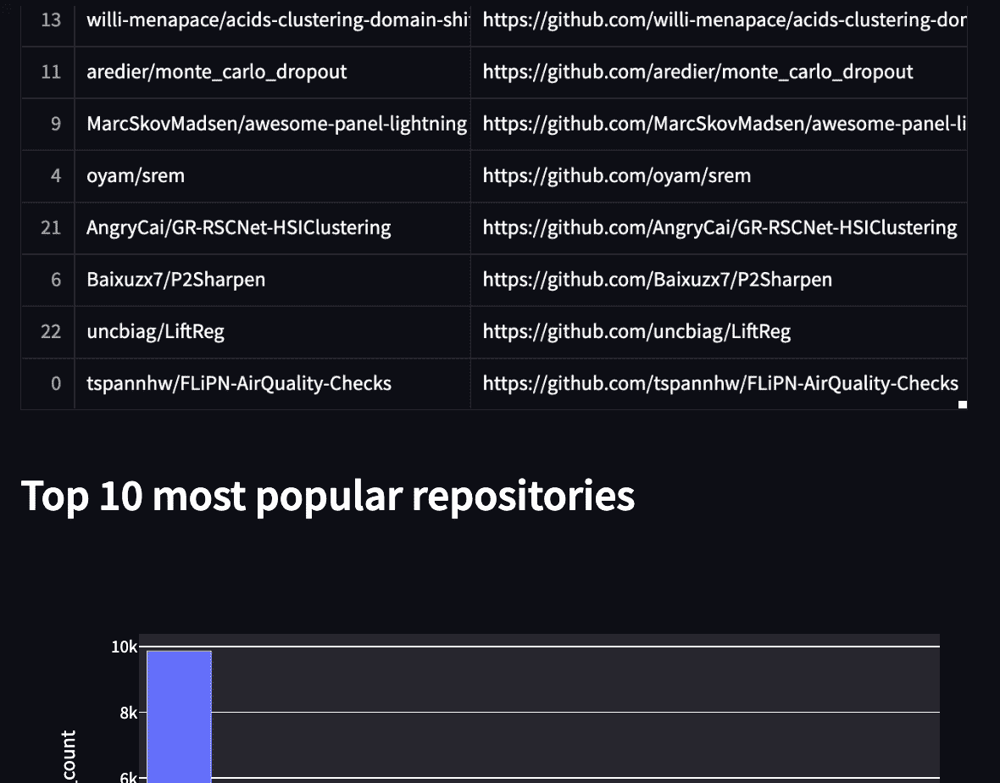

作者图片

在本文中，我们将学习如何使用 GitHub API + Streamlit + Prefect 来实现这一点。

# 我们将做什么

总体而言，我们将:

*   使用 GitHub API 编写脚本从 GitHub 中提取数据
*   使用 Streamlit 创建一个显示已处理数据统计信息的仪表板
*   使用提督计划运行脚本以获取和处理每日数据

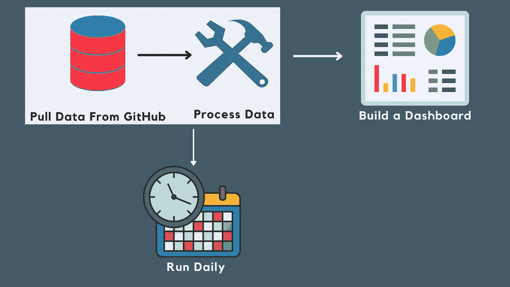

作者图片

如果您想跳过解释，直接创建自己的仪表板，请查看这个 GitHub 资源库:

[](https://github.com/khuyentran1401/analyze_github_feed) [## GitHub-khuyentran 1401/analyze _ GitHub _ feed:创建一个本地仪表板来可视化和过滤您的…

### GitHub feed 是您了解社区最新动态的好方法。你可以发现一些有用的…

github.com](https://github.com/khuyentran1401/analyze_github_feed) 

# 从 GitHub 提取数据

要从 GitHub 获取数据，您需要您的用户名和一个[访问令牌](https://docs.github.com/en/authentication/keeping-your-account-and-data-secure/creating-a-personal-access-token)。接下来，创建名为[的文件。env](https://coderrocketfuel.com/article/how-to-load-environment-variables-from-a-.env-file-in-nodejs) 保存你的 GitHub 认证。

将`.env`添加到您的`.gitignore`文件中，以确保`.env`不会被 Git 跟踪。

在`development`目录下的文件`process_data.py`中，我们将使用 [python-dotenv](https://pypi.org/project/python-dotenv/) 编写代码来访问文件`.env`中的信息:

接下来，我们将使用 [GitHub API](https://docs.github.com/en/rest) 获取我们在 GitHub 提要中收到的公共存储库的一般信息。GitHub API 允许我们轻松地从您的 GitHub 帐户中获取数据，包括事件、存储库等。


作者图片

我们将使用 [pydash](/pydash-a-bucket-of-missing-python-utilities-5d10365be4fc) 从存储库列表中获取所有标有星号的存储库的 URL:

获取每个带星号的存储库的具体信息，如语言、星号、所有者、拉取请求等:

从每个回购中提取的信息应该类似于[这个](https://gist.github.com/khuyentran1401/485d6060f1f97defbae4392302a4aba7)。

将数据保存到本地目录:

将所有东西放在一起:

# 使用 Prefect 使工作流健壮

当前的脚本可以工作，但是为了确保它对失败有弹性，我们将使用 Prefect 为我们当前的工作流添加可观察性、缓存和重试。

[perfect](https://www.prefect.io/)是一个开源库，使您能够用 Python 编排数据工作流。

[](https://medium.com/the-prefect-blog/orchestrate-your-data-science-project-with-prefect-2-0-4118418fd7ce) [## 使用 Prefect 2.0 协调您的数据科学项目

### 让您的数据科学管道能够抵御故障

medium.com](https://medium.com/the-prefect-blog/orchestrate-your-data-science-project-with-prefect-2-0-4118418fd7ce) 

## 添加可观察性

因为运行文件`get_data.py`需要一段时间，我们可能想知道哪个代码正在被执行，以及我们大概需要等待多长时间。我们可以在函数中添加 Prefect 的 decorators，以便更深入地了解每个函数的状态。

具体来说，我们将装饰器`@task`添加到做一件事的函数中，将装饰器`@flow`添加到包含几个任务的函数中。

在下面的代码中，我们将装饰器`@flow`添加到函数`get_data`中，因为`get_data`包含所有任务。

运行此 Python 脚本时，您应该会看到以下输出:

从输出中，我们知道哪些任务已经完成，哪些任务正在进行中。

## 贮藏

在我们当前的代码中，函数`get_general_info_of_repos`需要一段时间来运行。如果函数`get_specific_info_of_repos`失败，我们需要再次运行整个管道，并等待函数`get_general_info_of_repos`运行。

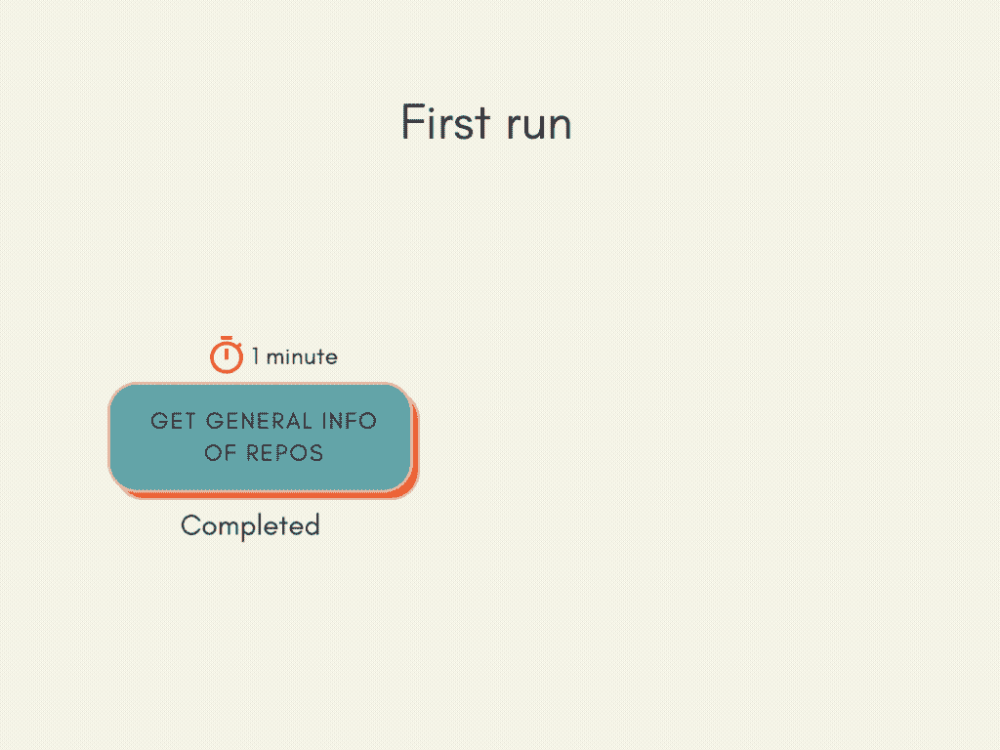

作者图片

为了减少执行时间，我们可以使用 Prefect 的缓存来保存第一次运行`get_general_info_of_repos`的结果，然后在第二次运行时重用这些结果。


作者图片

在文件`get_data.py`中，我们为任务`get_general_info_of_repos`、`get_starred_repo_urls`和`get_specific_info_of_repos`添加了缓存，因为它们需要相当多的时间来运行。

要向任务添加缓存，请指定参数`cache_key_fn`和`cach_expiration`的值。

在上面的代码中，

*   `cache_key_fn=task_input_hash`告诉提督使用缓存的结果，除非输入改变或者缓存过期。
*   `cached_expiration=timedelta(days=1)`告诉提督在一天后刷新缓存。

我们可以看到，不使用缓存(`lush-ostrich`)的运行时间是 27 秒，而使用缓存(`provocative-wildebeest`)的运行时间是 1 秒！

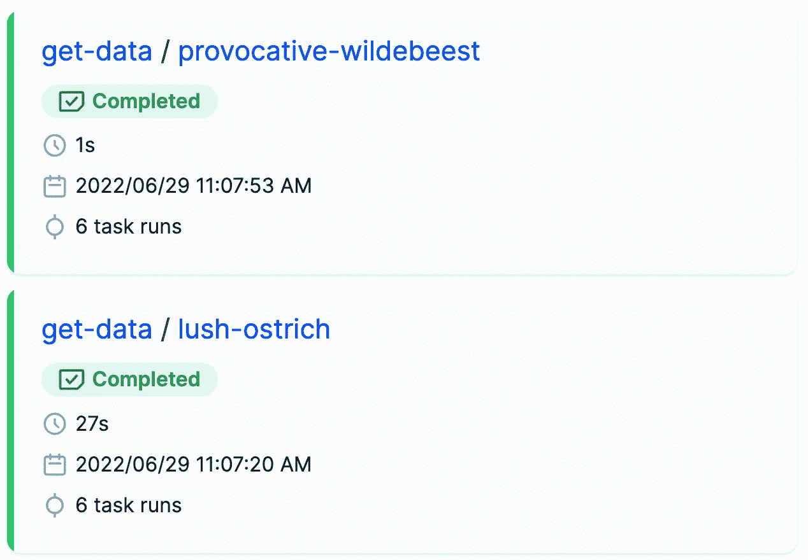

作者图片

*注意:要像上面一样查看所有运行的仪表板，运行* `*prefect orion start*` *。*

## 重试次数

我们有可能无法通过 API 从 GitHub 获取数据，我们需要再次运行整个管道。

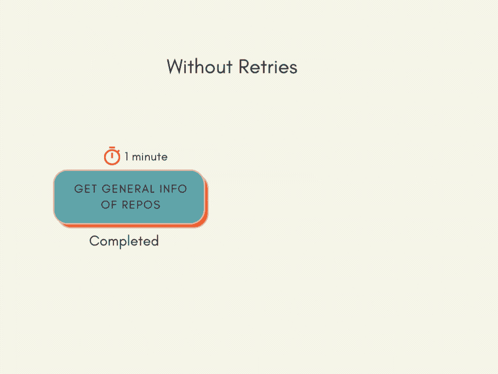

作者图片

与其重新运行整个管道，不如在一段特定的时间后重新运行失败了特定次数的任务更有效。

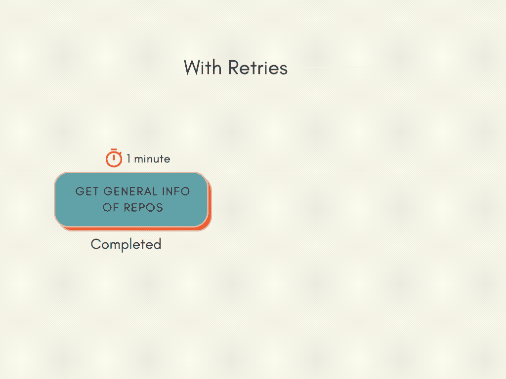

提督允许你在失败时自动重试。要启用重试，请向您的任务添加`retries`和`retry_delay_seconds`参数。

在上面的代码中:

*   `retries=3`告诉提督最多重新运行任务 3 次
*   `retry_delay_seconds=60`告诉提督 60 秒后重试。这个功能很有用，因为如果我们在短时间内连续调用 GitHub API，我们可能会达到速率极限。

# 过程数据

在目录`development`下的文件`process_data.py`中，我们将清理数据，以便得到一个只显示我们感兴趣的内容的表格。

从加载数据开始，只保存用特定语言编写的存储库:

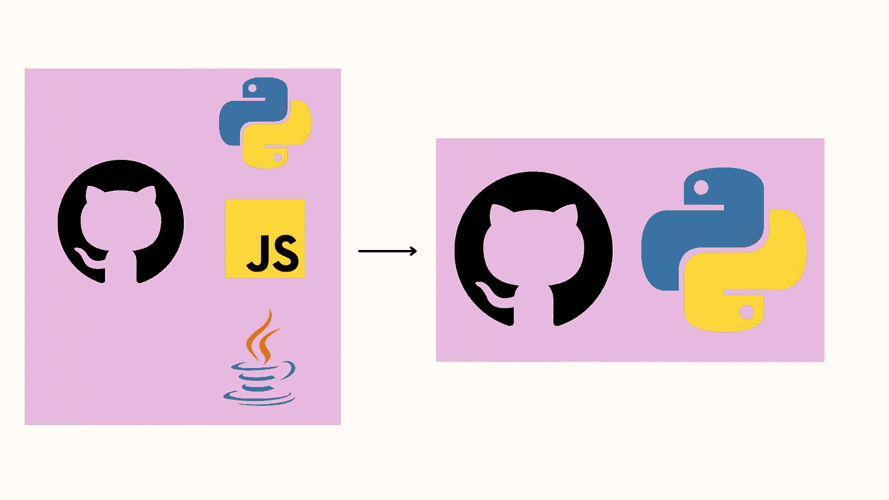

作者图片

接下来，我们将只保留我们感兴趣的存储库信息，包括:

*   全名
*   HTML URL
*   描述
*   观星者也算

从字典中创建一个数据帧，然后删除重复的条目:

将所有东西放在一起:

# 使用 Streamlit 创建仪表板

现在到了有趣的部分。创建一个仪表板来查看存储库及其统计信息。

我们的应用程序代码的目录结构如下所示:

## 可视化存储库的统计数据

文件`[Visualize.py](<http://Visualize.py>)`将创建应用程序的主页，而目录`pages`下的文件创建子页面。

我们将使用 [Streamlit](https://streamlit.io/) 用 Python 创建一个简单的应用程序。让我们从编写显示数据及其统计数据的代码开始。具体来说，我们希望在第一页看到以下内容:

*   按语言过滤的存储库表
*   十大最受欢迎的存储库图表
*   十大热门话题图表
*   主题的单词云图表

`Visualize.py`的代码:

要查看控制面板，请键入:

```
cd app
streamlit run Visualize.py
```

进入 [http://localhost:8501/](http://localhost:8501/) 你应该会看到下面的仪表盘！


作者图片

## 根据主题过滤存储库

我们得到了不同主题的存储库，但我们往往只关心特定的主题，如机器学习和深度学习。让我们创建一个页面，帮助用户根据他们的主题过滤存储库。

您应该会看到第二个页面，如下所示。在下面的 GIF 中，在应用到过滤器后，我只看到带有标签`deep-learning`、`spark`和`mysql`的存储库。

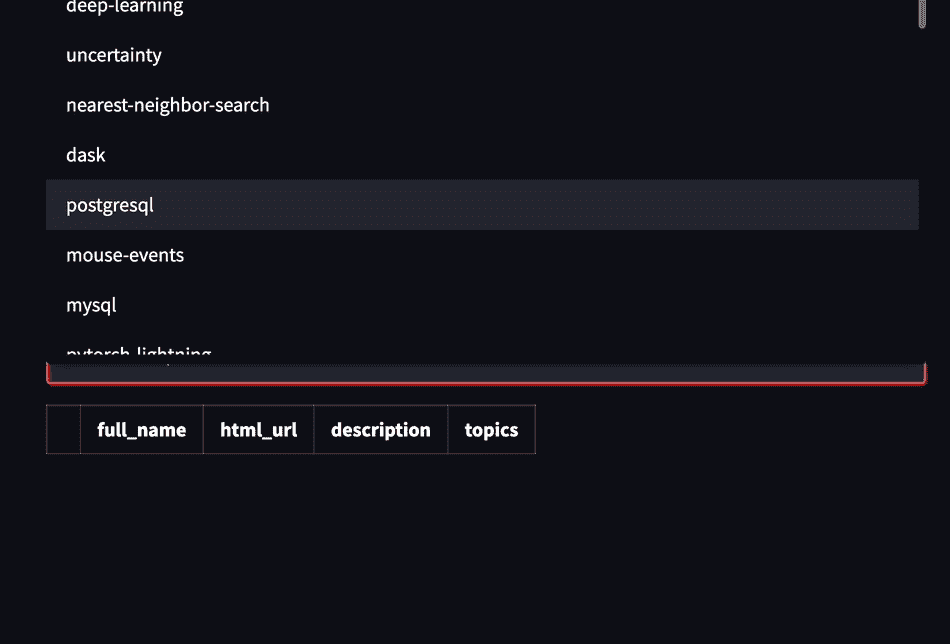

作者图片

# 每天获取和处理数据的计划

如果您希望每天更新 GitHub 提要上的存储库，您可能会觉得每天运行脚本来获取和处理数据很懒。如果您可以安排每天自动运行您的脚本，这不是很好吗？


作者图片

让我们通过使用 Prefect 创建部署来调度我们的 Python 脚本。

## 使用子流程

因为我们想在运行流`process_data`之前运行流`get_data`，所以我们可以将它们放在文件`development/get_and_process_data.py`中另一个名为`get_and_process_data`的流下。

接下来，我们将编写一个脚本来部署我们的流。我们每天都使用`IntervalSchedule`来运行部署。

为了运行部署，我们将:

*   启动一个完美的猎户座服务器
*   配置存储
*   创建工作队列
*   运行代理
*   创建部署

## 启动一个完美的猎户座服务器

要启动完美的 Orion 服务器，请运行:

```
prefect orion start
```

## 配置存储

[存储](https://orion-docs.prefect.io/concepts/storage/)保存您的任务结果和部署。稍后当您运行部署时，提督将从存储中检索您的流。

要创建存储，请键入:

```
prefect storage create
```

您将在终端上看到以下选项。

在这个项目中，我们将使用临时本地存储。

## 创建工作队列

每个工作队列还将部署组织到[工作队列](https://orion-docs.prefect.io/concepts/work-queues/)中以供执行。

要创建工作队列，请键入:

```
prefect work-queue create --tag dev dev-queue
```

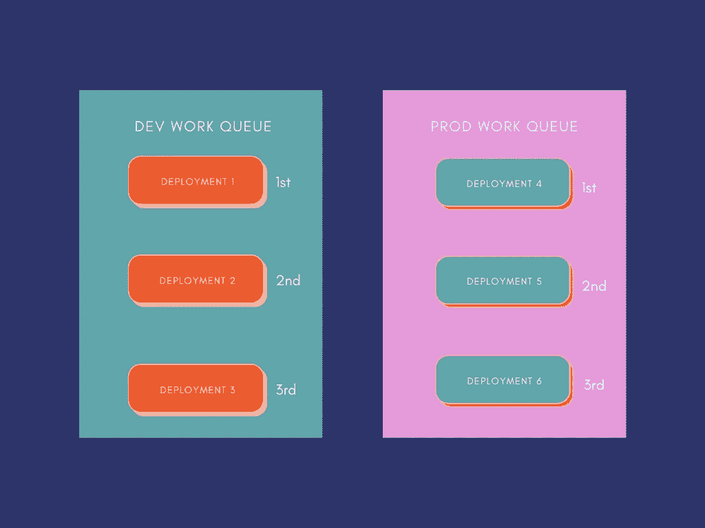

作者图片

输出:

```
UUID('e0e4ee25-bcff-4abb-9697-b8c7534355b2')
```

`--tag` dev 告诉`dev-queue`工作队列只为包含`dev`标签的部署提供服务。

## 运行代理

每个代理确保执行特定工作队列中的部署

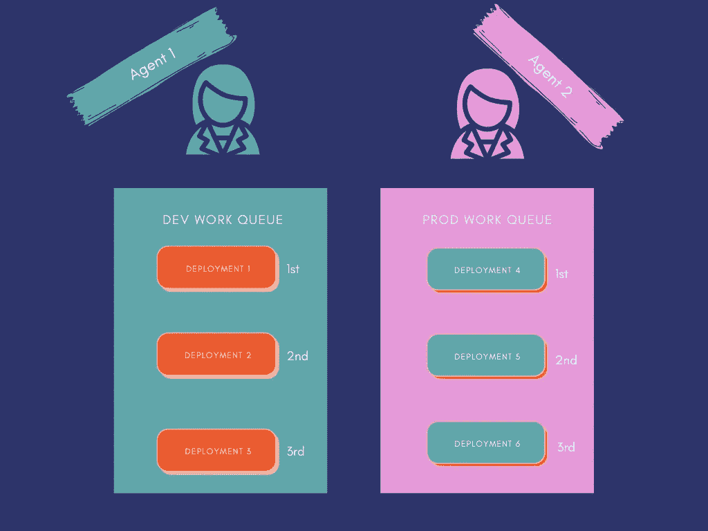

作者图片

要运行代理，请键入`prefect agent start <ID of dev-queue>`。由于`dev-queue`的 ID 是`e0e4ee25-bcff-4abb-9697-b8c7534355b2`，我们键入:

```
prefect agent start 'e0e4ee25-bcff-4abb-9697-b8c7534355b2'
```

## 创建部署

要从文件`development.py`创建部署，请键入:

```
prefect deployment create development.py
```

您应该会在 Deployments 选项卡下看到新的部署。

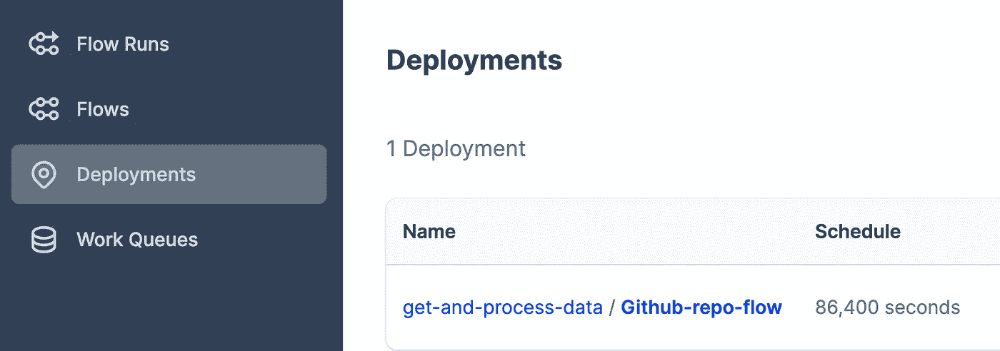

作者图片

然后点击右上角的运行:


作者图片

然后单击左侧菜单中的流式运行:

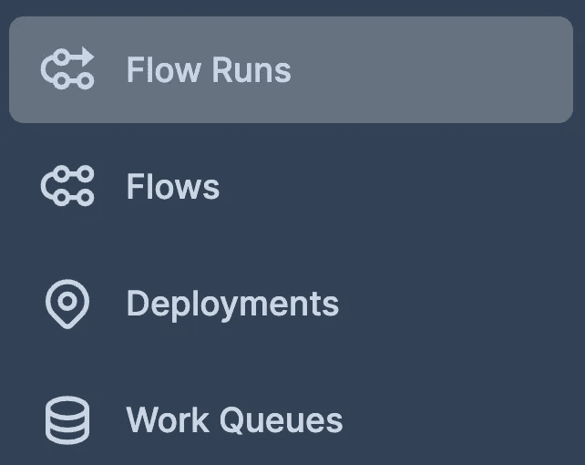

作者图片

你将会看到你的心流被安排好了！

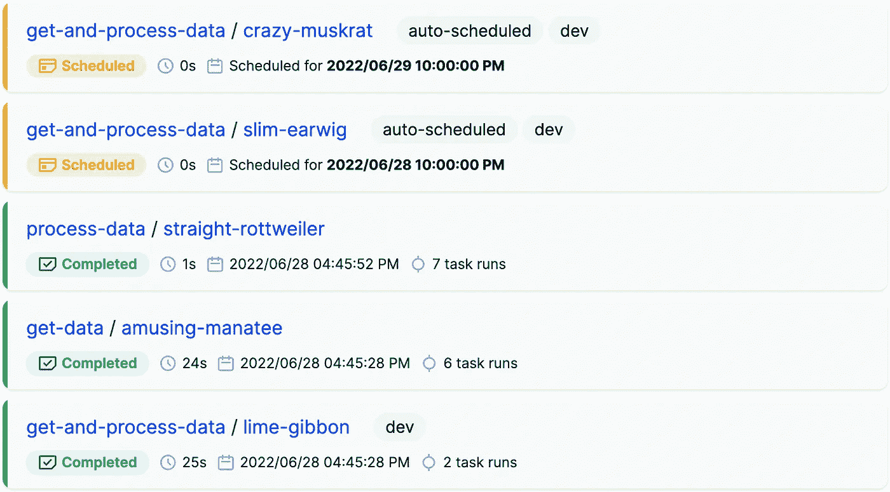

作者图片

现在，提取和处理数据的脚本将每天运行。您的仪表板还显示了本地机器上的最新存储库。多酷啊。

# 下一步

在当前版本中，应用程序和提督代理运行在本地机器上，如果您关闭机器，它们将停止工作。如果我们关闭机器，应用程序和代理将停止运行。

为了防止这种情况发生，我们可以使用 AWS 或 GCP 这样的云服务来运行代理、存储数据库和服务仪表板。


作者图片

在下一篇文章中，我们将学习如何做到这一点。

我喜欢写一些基本的数据科学概念，并尝试不同的数据科学工具。你可以在 LinkedIn 和 Twitter 上与我联系。

如果你想查看我写的所有文章的代码，请点击这里。在 Medium 上关注我，了解我的最新数据科学文章，例如:

[](/bentoml-create-an-ml-powered-prediction-service-in-minutes-23d135d6ca76) [## BentoML:在几分钟内创建一个 ML 驱动的预测服务

### 用 Python 封装和部署您的 ML 模型

towardsdatascience.com](/bentoml-create-an-ml-powered-prediction-service-in-minutes-23d135d6ca76) [](/how-to-structure-a-data-science-project-for-readability-and-transparency-360c6716800) [## 如何构建可读性和透明度的数据科学项目

### 以及如何用一行代码创建一个

towardsdatascience.com](/how-to-structure-a-data-science-project-for-readability-and-transparency-360c6716800) [](/introduction-to-weight-biases-track-and-visualize-your-machine-learning-experiments-in-3-lines-9c9553b0f99d) [## 权重和偏差介绍:用 3 条线跟踪和可视化你的机器学习实验…

### 无缝比较不同的实验，并使用 Python 重现您的机器学习实验

towardsdatascience.com](/introduction-to-weight-biases-track-and-visualize-your-machine-learning-experiments-in-3-lines-9c9553b0f99d) [](/pytest-for-data-scientists-2990319e55e6) [## 数据科学家 Pytest

### 适用于您的数据科学项目的 Pytest 综合指南

towardsdatascience.com](/pytest-for-data-scientists-2990319e55e6)