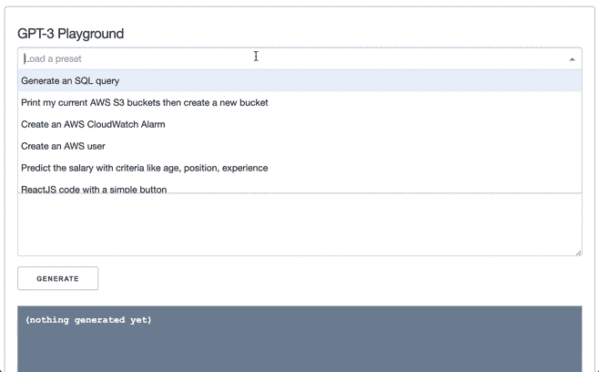
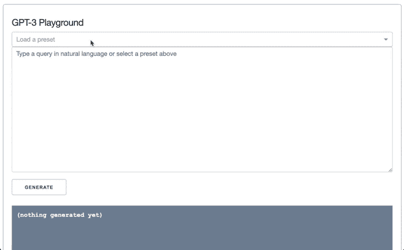
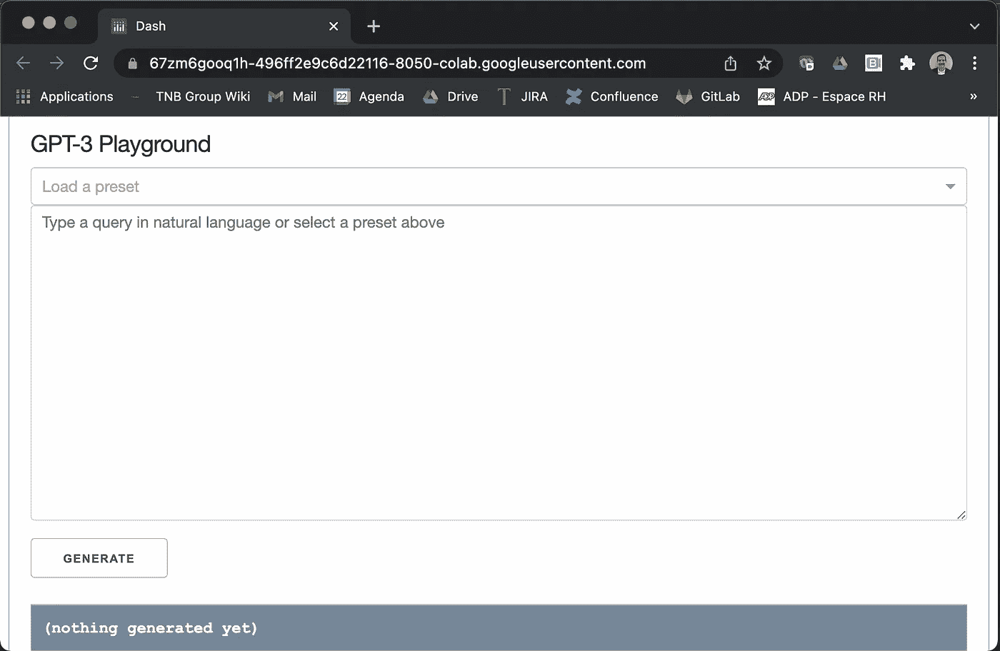
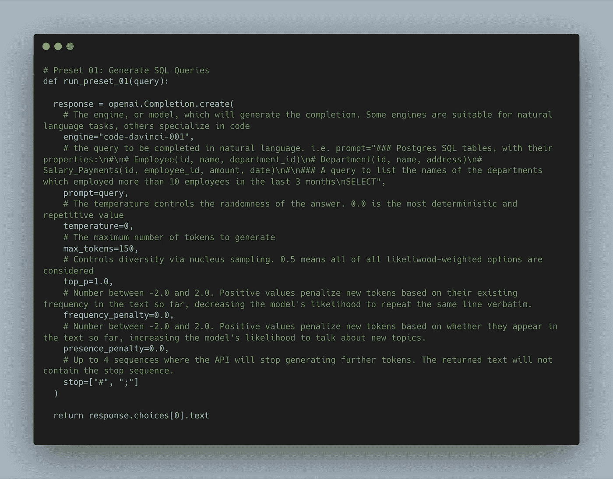
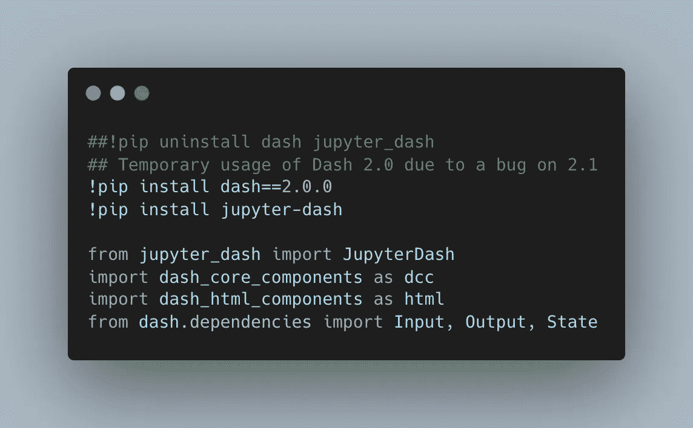
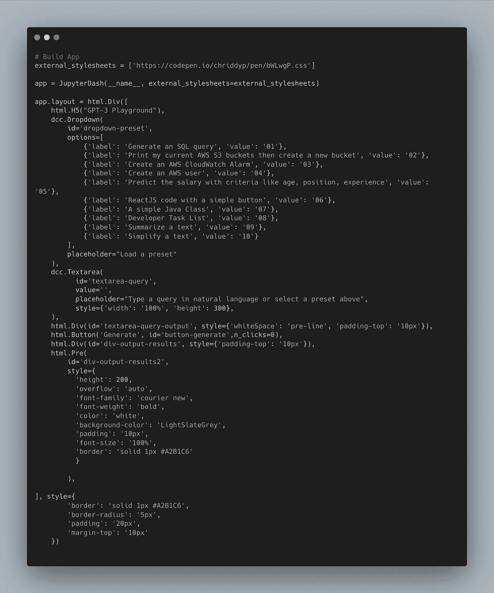
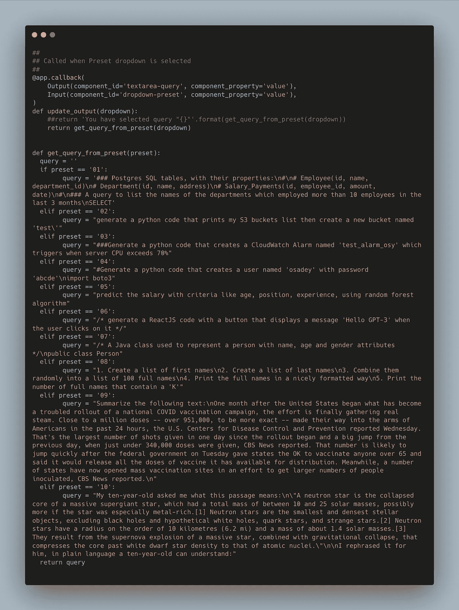
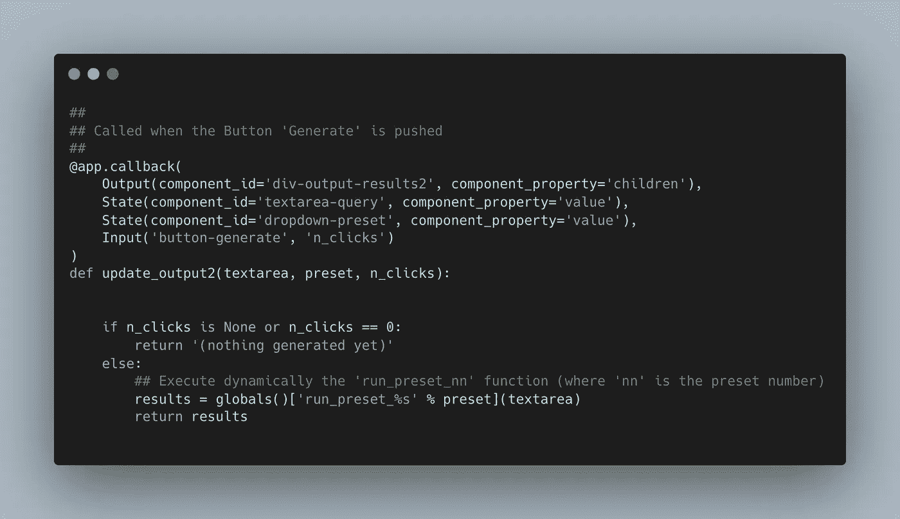

# 用 GPT-3 和 Dash 构建一个简单的 Web 应用程序，在 10 分钟内将自然语言转换成源代码

> 原文：<https://towardsdatascience.com/build-a-simple-web-application-that-converts-natural-language-into-source-code-in-10-minutes-7172df51b0aa>

图片经由[iStockphoto.com](http://istockphoto.com/)授权提供萨德

# 1.欢迎来到变形金刚的时代

未来几年，变形金刚可能会深刻改变应用程序的开发方式。在不久的将来，大多数由开发人员产生的低价值代码可能由人工智能和变形金刚产生。

一个**转换器**是一个深度学习模型，依靠[自关注](https://en.wikipedia.org/wiki/Attention_(machine_learning))机制，使用序列对齐**递归神经网络**来计算表示**而没有**。

最近，OpenAI 发布了其**生成式预训练变压器**的最大模型，称为 **GPT-3** ，具有大约 1750 亿个机器学习参数的巨大容量。它有一种非凡的能力，可以利用深度学习，生成人类可以理解的文本，可以是故事、诗歌，也可以是源代码。

该模型的一个主要优点是，它可以与**少量发射**或**零发射学习**一起使用，这大大缩短和简化了事情，不再需要长时间的数据准备和训练阶段。

本文主要关注的是**源代码生成**，其中一些额外的内容展示了强大的文本生成能力。它附带了用于构建这个 playground web 应用程序的完整 Python 源代码。

截至今天， **OpenAI GPT-3 达芬奇 API** 仍处于测试版，因此代码生成功能可能会在未来几个月取得一些进展。

# 2.web 应用程序功能概述

通过本文，您将能够构建并运行一个简单的 web 应用程序，该应用程序只需几行 Python 代码，就能实现基于 GPT-3 的强大代码生成功能。基本上，该应用程序是一个游乐场，允许用户用自然语言键入一个简单的请求，然后查看生成的源代码。该应用程序与管理代码生成或文本完成的 GPT-3 API 集成在一起。

如果可以提出以下问题并获得生成的代码，这可能是每个开发人员的梦想:

> *“请生成一个 Python 代码，使用随机森林算法，根据年龄、职位、经验等标准预测工资”*

或者如下:“请生成一个名为 VIPPerson 的 Java 类，用来表示一个具有姓名、年龄和性别属性的人”。

为了帮助用户，已经准备了典型请求的预设列表。每一个都可以修改，所以用户可以点击一个按钮来生成代码并看到结果。

使用的技术堆栈如下:

*   计算机编程语言
*   破折号(用于 Python web 应用程序)
*   GPT-3 API (OpenAI)

以下是您将能够在接下来的部分中构建的应用程序的一些功能。

用例非常简单:用户可以从下拉菜单中选择一个请求类型的预置。然后，用自然语言编写的标准请求填充文本区域字段。用户可以修改该请求。完成后，用户可以点击*生成*按钮，相应的源代码就会生成并显示出来。

**代码生成:生成一个 SQL 查询**

下面是用自然语言描述字段和表格以及数据选择的简单请求。结果是一个符合 PostgreSQL 语法的 SQL 查询。

用户可以在文本区域字段中更改提议的请求，使其适应自己的需要。

来源:作者

**代码生成:创建一个具有特定阈值的 AWS CloudWatch 警报**

你可能知道，AWS Cloud 可以完全用代码来配置。这里使用了一个名为 Boto 的 SDK 来生成 CloudWatch 警报，当 CPU 超过 70%时触发该警报。

来源:作者

**代码生成:使用随机森林算法**根据年龄、职位、经验等标准预测工资

这个请求允许生成一个完整的代码来根据几个标准预测工资。结果是使用 *RandomForestRegressor* 的 Python 代码实现了这一点。还使用 *Pyplot* 库绘制了一个图形。

来源:作者

**代码生成:生成一个 Java 类，用姓名、年龄和性别属性表示一个人**

这是一个用很少的属性生成的非常基本的 Java 类。事实上，描述以 Java 注释和类名开始，这有助于 GPT-3 引擎更准确地完成代码。

来源:作者

**代码生成:开发者任务列表**

该请求可以采取任务列表的形式。默认生成的语言是 Python，但是也可以指定将其转换成任何其他通用语言。

来源:作者

**文本处理:总结一篇文本**

接下来的两个预置展示了一些强大的文本生成功能。这一个允许总结一篇文章。可以调整代码中的一些参数来确定结果有多短。

来源:作者

**文本处理:为一个 10 岁的孩子改写文本**

另一个强大的文本生成功能。该请求要求 GPT-3 引擎重新表述文本，以便 10 岁的孩子能够理解。

来源:作者

# 3.快速启动

下面将允许您编辑和运行我的 GitLab 上的代码。在这之前，你需要在 OpenAI 注册来获得你的 API 密匙。

*   去 [OpenAI 网站](https://openai.com/api/)注册获取你的 API 密匙
*   去我的 GitLab 项目命名为 [GPT-三短跑-操场](https://gitlab.com/osadey/gpt-3-dash-playground)
*   使用 Google Colab 编辑 Jupyter Python 笔记本
*   用您的 api 密钥替换代码中的 *openai.api_key* 值
*   在“执行”菜单中选择“全部运行”
*   WebApp 应该在几秒钟后启动。单击页面底部生成的 URL 以显示它

应用程序应该如下所示:

来源:作者

# 4.理解代码

**4.1。GPT 3 号初始化**

代码的第一部分安装 OpenAI GPT-3 依赖项。API 密钥需要替换为您在他们的网站上注册时收到的密钥。

来源:作者

**4.2。预置**

这个应用程序用自然语言提供了 10 个预设的请求。8 个用于代码源生成，2 个与文本完成相关。

现在让我们来描述生成 SQL 查询的第一个预置。基本上，下面的函数接收一个自然语言的请求，用特定的参数调用 GPT-3 API，然后返回将显示在屏幕上的结果。(这里是一个 SQL 查询)其他预设是类似的。

此预置使用以下参数:

*   *引擎*:GPT-3 引擎，或模型，将生成完成。一些引擎适用于自然语言任务，另一些则专门用于代码。code-davinci-001 表示将使用最先进的代码生成引擎。您可以在此找到更多信息[。](https://beta.openai.com/docs/engines)
*   *提示*:要用自然语言完成的查询。即###生成一个 SQL 查询，列出一家公司年龄在 20 到 30 岁之间的雇员。(这是一个非常简单的问题，但是预置本身要复杂得多)
*   *温度*:温度控制答案的随机性。0.0 是最具确定性和重复性的值，仍然是代码生成的最佳选择。
*   *max_tokens* :生成的最大令牌数
*   top_p :通过细胞核取样控制多样性。0.5 表示考虑了所有可能的加权选项。将其设置为 1.0 可能会为代码生成提供更好的结果。
*   *频率 _ 惩罚*:介于-2.0 和 2.0 之间的数字。正值会根据新单词在文本中的出现频率对其进行惩罚，从而降低模型逐字重复同一行的可能性。根据我们的需要，该参数设置为 0.0。
*   *presence_penality* :介于-2.0 和 2.0 之间的数字。正值根据新单词是否出现在文本中来惩罚它们，增加了模型谈论新话题的可能性。根据我们的需要，该参数设置为 0.0。
*   *停止*:最多 4 个序列，API 将在这些序列中停止生成更多的令牌。返回的文本将不包含停止序列。在此预设中，停止序列被设置为“#”、“”。

来源:作者

响应(生成的代码或完整的文本)被返回给调用者。

每个预设都有自己的参数设置。该代码为每个预置复制，以确保更好的清晰度和参数解耦。

**4.3。操场网络应用**

这个 web 应用程序基于 Dash 框架，它允许您用 Python 构建和运行 web 应用程序。更具体地说， *Jupyter-dash* library 的优势在于可以直接从你的 Jupyter Colab 笔记本上运行网络应用。

Dash 文档可以在[这里](https://dash.plotly.com/introduction)找到。

**4.3.1。依赖项导入**

此部分导入所有 Dash 依赖项。请注意，dash 的 2.0.0 版本是由于上一版本的 bug 而导入的。这个问题可能已经解决了，所以请不要犹豫，在将来删除对 2.0.0 版本的引用。

Dash 提供两种类型的组件:

*   核心(内置)组件
*   HTML 组件

*输入*、*输出*和*状态*依赖关系将允许我们管理由显示字段上的事件触发的回调。

来源:作者

**4.3.2。操场网页**

在本节中，构建了一个简单的 web 页面布局，主要包含一个标题和 4 个元素:

*   *下拉预设*:10 个预设列表的下拉字段
*   *textarea-query* :默认情况下，根据选择的预置请求设置的文本区域字段。一旦选择了预置，用户将能够改变提议的请求。
*   *按钮-生成*:一个 HTML 按钮，将触发对 GPT-3 API 的调用并获得响应
*   *div-output-result2* :一个预先格式化的 HTML 输出字段，用于显示可能是生成的代码或完整文本的结果。

来源:作者

**4.3.3。预设下拉回调**

当用户从下拉字段中选择一个*预设*时，调用这部分代码。基本上，该函数从*下拉预设*字段接收*预设 ID* 作为输入，并向*文本区域查询*字段返回一个预先格式化的请求作为输出。

第二个函数返回一个名为 query 的字段，这是一个根据所选预设 ID 预先格式化的请求。

同样，目的是尽可能地简化代码，这样读者可以更好地理解它，但是我相信，一旦您理解了逻辑，您将能够应用一些代码最佳实践。

来源:作者

4.3.4.“*生成*按钮回调

当用户按下“*生成*按钮时，这部分代码被调用。基本上，要调用的预置功能是用*预置 ID* 或*预置号*动态构建的。然后，使用来自文本区域字段的请求和为此预设设置的特定参数来调用 GPT-3 API。最后，生成的代码或完整的文本会显示在特定的输出字段中。( *div 输出结果 2* )

请注意，在这次回调中还有 2 个额外的*状态*。这意味着如果 *textarea-query* 或 *dropdown-preset* 值发生变化，将不会触发该回调。但是它们的值将被传递给这个回调函数。

来源:作者

# 5.最后一句话

谢谢你把我的文章看完，希望你喜欢！

如您所见，GPT 非常有前途，只需几行 Python 代码就可以轻松实现。短跑可能有助于达到 10 分钟的目标。

你可以在我的 GitLab 上找到完整的源代码: [GPT-3-Dash-Playground](https://gitlab.com/osadey/gpt-3-dash-playground)