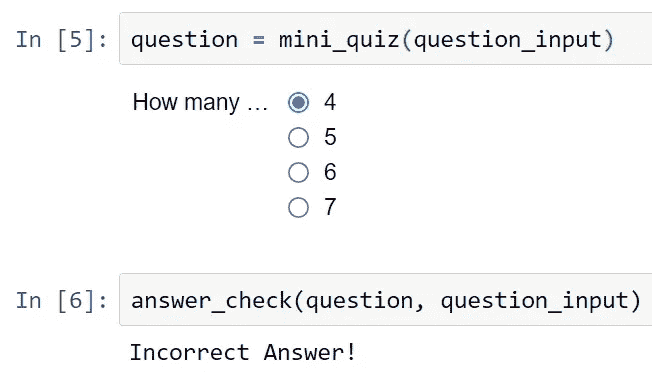

# 使用 Jupyter 笔记本电脑构建高度互动的项目

> 原文：<https://towardsdatascience.com/build-highly-interactive-projects-with-jupyter-notebooks-c7fcf7f87633>

## 利用小部件为构建交互式 Python 和数据科学项目创建用户友好的环境(奖金 2 项目！)


米格尔·托马斯在 [Unsplash](https://unsplash.com?utm_source=medium&utm_medium=referral) 上拍摄的照片

大多数数据科学和 Python 项目通常是很少或没有交互性的代码行。对于初级程序员来说，这可能是一个相当大的问题，因为他们需要不断地使用 print 语句来理解他们当前正在进行的项目的逻辑和工作流。

即使使用图形用户界面(GUI)工具，如 Tkinter、Kivy 和其他类似的库，编程要求也更多。然而，如果有一种方法可以让用户在 Jupyter 笔记本中利用小部件和单行代码开发高度交互性，那会怎么样呢？

我们将在本文中探索这样的场景，在这里我们将理解一些交互式小部件特性的基础。然后，我们还将继续用这些介绍性的小部件构建几个简单、有趣和交互式的项目。

在我们深入 IPython 小部件的概念之前，有必要对 Jupyter 笔记本有一个基本的了解。在我以前的一篇文章中，我已经介绍了与 Jupyter 笔记本相关的大部分基本概念。你可以从下面的链接中找到这个主题。

[](/everything-you-need-to-know-about-jupyter-notebooks-10770719952b) [## 关于 Jupyter 笔记本你需要知道的一切！

### 分解 Jupyter 笔记本的所有内容，从菜单到运行电池，以及各种…

towardsdatascience.com](/everything-you-need-to-know-about-jupyter-notebooks-10770719952b) 

> ***注:*** GitHub 链接基础知识和项目在文末提供。

# IPython 小部件入门:

Ipywidgets，也称为 Jupyter 小部件或简称为“小部件”，是用于 Jupyter 笔记本和 IPython 内核的交互式 HTML 小部件。一般来说，小部件的作用是创建一个交互式 GUI 对象，允许用户开发高度紧凑的项目。它们还可以用于在 Python 和 JavaScript 之间同步有状态和无状态信息。有关更多信息，请点击这些[参考](https://ipywidgets.readthedocs.io/en/latest/examples/Widget%20Basics.html)文档的链接。

安装这些小部件的过程非常方便，可以用下面的命令来完成。在安装期间，ipywidgets 库自动配置 Jupyter 笔记本的所有必要要求，而不需要任何额外的配置。

```
pip install ipywidgets
```

一旦我们成功安装了 ipywidgets 库，我们就可以根据需要在每个 Jupyter 笔记本中创建一个交互式项目。第一步在开始使用库中可用的不同类型的小部件之前，我们需要导入 ipywidgets 库和 IPython display 命令，以便向用户显示这些交互式小部件。

```
# Importing the ipywidgets library and IPython display moduleimport ipywidgets as widgets
from IPython.display import display
```

一旦导入了必要的库，用户就可以开始实现 ipywidgets 工具包中提供的众多小部件。在本文的这一部分，我们将探索程序员和开发人员最常用的一些小部件选项的基础。

## 1.滑块:

```
widgets.IntSlider(value=50,
                  min=0,
                  max=100)
```


作者图片

我们要看的第一个小部件是整数滑块。它为用户提供了一个有用的选项，可以在特定范围内使用滑块来覆盖任何特定任务的各种操作。但是，您只能使用整数滑块来检索整数值，在这里我们指定默认值以及滑块的最小和最大范围。

显示的滑块的默认方向是水平的。开发人员也可以使方向垂直。滑块还有其他选项，包括浮动滑块和浮动日志滑块，以及许多其他类似的选项。

## 2.下拉列表:

```
widgets.Dropdown(
    options=['1', '2', '3'],
    value='1',
    description='Number:',
    disabled=False,
)
```


作者图片

我们将在本节中看到的下一个交互式小部件是下拉小部件。这个小部件显示一个值列表，允许用户从可用选项中进行选择。在上面的代码片段中，我将下拉框的值包括为 1、2 和 3，默认值为“1”提供的描述是数字。我们可以使用下拉工具来执行操作，为执行特定任务选择任何所需的值。

## 3.文本框:

```
widgets.IntText(
    value=3,
    description='Numbers:',
    disabled=False
)
```


作者图片

我们接下来要看的 ipywidget 是 textbox 小部件。顾名思义，这个小部件对于在 GUI 框中输入文本数据非常有用。在上面的代码片段中，我们可以注意到我们使用了整数文本小部件，允许用户输入一些整数类型的数据。文本框输入还有其他几个选项，允许用户输入字符串数据，包括用于执行以下操作的文本和文本区域小部件。下面是一个示例代码，显示了输入字符串类型数据的替代选项。

***备选代码:***

```
widgets.Text(
    value='Hello World',
    placeholder='Type something',
    description='String:',
    disabled=**False**
)
```

## 4.单选按钮:

```
widgets.RadioButtons(
    options=['1', '2', '3'],
    description='Numbers:',
    disabled=False
)
```


作者图片

我们将讨论的下一个 ipywidget 是单选按钮小部件，它允许用户选择一组选项。如上面的代码片段所示，我们可以为单选按钮提供一个简短的描述，然后相应地声明选项。有大量的实验和项目可以使用这些单选按钮，尤其是只允许选择一个选项的情况，比如多项选择题。

## 5.复选框:

```
widgets.Checkbox(
    value=False,
    description='I Agree to the terms and conditions',
    disabled=False,
    indent=False
)
```


作者图片

我们将探索的倒数第二个基本小部件是复选框 ipywidget。在 checkbox 小部件的帮助下，我们可以让用户选择“是”或“否”。该复选框最初是未选中的。一旦用户点击复选框，我们可以激活进一步的命令和操作。这些复选框对各种项目都很有用，包括条款和条件的协议，如上所示。

## 6.切换:

```
widgets.ToggleButtons(
    options=['1', '2', '3'],
    description='Numbers:',
    disabled=False,
    button_style=''
)
```


作者图片

我们要看的最后一个基本部件是切换按钮。使用这些小部件，我们可以在一堆按钮之间切换，每个按钮的角色和功能都相应地改变。在上面的代码片段中，我们可以注意到，我们有一个显示给用户的选项列表，以及一个我们可以根据需求添加的附加描述。

在接下来的部分中，我们将看几个简单的项目，我们可以在 Jupyter 笔记本中的 ipywidgets 的帮助下构建这些项目。在我们继续之前，我建议对其他类似的 GUI 技术感兴趣的读者阅读我以前的一篇文章，在这篇文章中，我介绍了 Python 开发人员可以利用的七个最佳图形工具，以及下面提供的链接中的一些入门代码。

[](/7-best-ui-graphics-tools-for-python-developers-with-starter-codes-2e46c248b47c) [## 7 款面向 Python 开发人员的最佳 UI 图形工具，带入门代码

### Python 中用于开发酷用户界面技术的七个最佳 UI 图形工具

towardsdatascience.com](/7-best-ui-graphics-tools-for-python-developers-with-starter-codes-2e46c248b47c) 

> ***注:*** 在 Jupyter 笔记本的菜单栏上的 widget 图标中，我们可以点击保存 widget 选项我们临时保存图标的 widget 状态。如果您有兴趣了解更多关于不同类型的小部件选项和 ipywidget 库的信息，我建议您查看下面的[文档](https://ipywidgets.readthedocs.io/en/latest/index.html)。

# 项目 1:温度转换器

有了对 Jupyter 笔记本小部件概念的基本理解，我们将尝试用这些小部件开发几个有趣而简单的交互项目。在第一个项目中，我们将关注温度从摄氏到华氏的转换。我们将使用滑块小部件来完成这项任务。让我们通过导入必要的库来开始这个项目，如下面的代码片段所示。

```
# Importing the ipywidgets library and IPython display moduleimport ipywidgets as widgets
from IPython.display import display
```

在下一步中，我们将创建用于执行温度转换过程的函数。我们将定义 temp 函数，它将参数作为 slider 小部件的值。下面是将摄氏温度转换成华氏温度的公式。您还可以使用 1.8 来代替代码片段中公式中使用的(9/5)分数值。

```
# Define the function for temperature conversiondef temp(slider_value):
    # Celsius to Fahrenheit conversion
    F = (slider_value *(9/5)) + 32
    return F
```

一旦我们完成了温度转换函数的定义，我们就可以继续定义 slider 小部件，通过它我们可以控制摄氏度数。我们可以将这个小部件存储在一个变量中，如下所示。

```
slider = widgets.IntSlider()
```

在定义了 slider 小部件之后，我们可以继续显示它，这样用户就可以根据需要相应地改变值。

```
display(slider)
```


作者图片

当用户在显示的刻度上移动滑块时，滑块值相应地更新，表示摄氏刻度。我们可以通过之前定义的函数传递这些值，以获得所需的华氏输出。

```
value = slider.value
temp(value)
```

## 输出:

```
77.0
```

当我们将滑块值作为 25 摄氏度传递时，我们得到了预期的 77.0 华氏度的响应。这样的构建也可以用于其他项目，如货币转换器等等！

# 项目 2:测验

在本文的第二个项目中，我们将学习如何在这些 ipywidgets 的帮助下开发一个简单的交互式测验项目。让我们从导入基本的库需求开始，如下面的代码片段所示。

```
# Importing the ipywidgets library and IPython display moduleimport ipywidgets as widgets
from IPython.display import display
import time
```

一旦导入了所有必需的库，我们就可以为这个项目创建接下来的两个基本函数了。首先，我们将定义一个函数来检查相关问题的答案。这个函数接受两个参数，即用户输入的问题编号和问题答案。答案被验证，并且用户被通知他们的答案是正确的还是不正确的。

在下一个函数中，我们将从 toggle button 小部件获取一个输入问题编号，并在单选按钮的帮助下显示问题及其各自的多选答案。我们将返回由用户(或玩家)选择并输出作为答案的值。

```
# Creating the function for storing the Questions and Answers for the mini-quizdef answer_check(question, question_input):
    if question_input == "Question-1":
        if question.value == "7":
            print("Correct Answer!")

        else:
            print("Incorrect Answer!")

    elif question_input == "Question-2":
        if question.value == "366":
            print("Correct Answer!")

        else:
            print("Incorrect Answer!")def mini_quiz(question):
    if question == 'Question-1':
#         q1 = widgets.IntText(value=0, description='How many continents are there in the world?')
        q = widgets.RadioButtons(options=['4', '5', '6', '7'], description='How many continents are there in the world?:')
        display(q)

    elif question == 'Question-2':
        q = widgets.RadioButtons(options=['364', '365', '366', '367'], description='How many days are there in a leap year?:')
        display(q)

    return q
```

在下一个代码块中，我们将为用户提供一个选项，从他们希望查看和回答的不同类型的问题中进行选择。我只给出了两个切换按钮选项，但是一旦您更好地掌握了 ipywidgets 库，这个项目就可以得到极大的改进。

```
question = widgets.ToggleButtons(options=['Question-1', 'Question-2'], description='Quiz:')
display(question)
```


作者图片

现在让我们存储切换按钮的值，如下面的代码片段所示。

```
question_input = question.value
question_input
```

最后，我们可以开始调用我们的函数来相应地计算问题和答案。首先，我们将调用第一个函数来传递并显示问题及其各自的答案。

```
question = mini_quiz(question_input)
```

最后，我们将调用函数来检查正确的答案。如果用户提供的解决方案是对的，那么一个“正确答案！”将显示注释。否则，答案不正确！”显示注释。

```
answer_check(question, question_input)
```



作者图片

上面的截图显示了当用户选择一个不正确的选项时会发生什么。


作者图片

上面的截图显示了当用户选择正确的选项时会发生什么。有几个额外的改进和不同种类的项目，您可以用这个库来构造。我非常鼓励观众尝试各种不同类型的项目。

# 结论:


普通技术人员在 [Unsplash](https://unsplash.com?utm_source=medium&utm_medium=referral) 上拍摄的照片

> “在某些方面，编程就像绘画。你从一块空白的画布和一些基本的原材料开始。你综合运用科学、艺术和工艺来决定如何处理它们。”
> — ***安德鲁·亨特***

交互性在开发用户友好的环境方面发挥着巨大的作用，同时也使初学数据科学和编程的爱好者能够通过更直观的理解探索众多概念。添加各种附加小部件和交互式功能有助于简化项目的导航和探索，因为您可以轻松控制多个参数。

在本文中，我们探索了 ipywidgets 库以及它授予用户访问权限的众多特性。我们首先了解了一些可以在 Jupyter 笔记本中使用的出色的基本小部件。然后，我们构建了几个简单、有趣、交互式的 Python 项目，借助这个工具，您可以轻松地构建这些项目。

如果你想在我的文章发表后第一时间得到通知，请点击下面的[链接](https://bharath-k1297.medium.com/subscribe)订阅邮件推荐。如果你希望支持其他作者和我，请订阅下面的链接。

[](https://bharath-k1297.medium.com/membership) [## 通过我的推荐链接加入媒体

### 作为一个媒体会员，你的会员费的一部分会给你阅读的作家，你可以完全接触到每一个故事…

bharath-k1297.medium.com](https://bharath-k1297.medium.com/membership) 

如果你对这篇文章中提到的各点有任何疑问，请在下面的评论中告诉我。我会尽快给你回复。您可以从下面的 [GitHub 链接](https://github.com/Bharath-K3/Ipywidgets-Projects)访问基础知识和项目。

看看我的一些与本文主题相关的文章，你可能也会喜欢阅读！

[](/best-seaborn-visualizations-for-data-science-3d866f99c3a9) [## 数据科学最佳 Seaborn 可视化

### 使用 Seaborn 库探索数据科学项目的一些最佳可视化选项

towardsdatascience.com](/best-seaborn-visualizations-for-data-science-3d866f99c3a9) [](/7-python-programming-tips-to-improve-your-productivity-a57802f225b6) [## 提高生产力的 7 个 Python 编程技巧

### 通过修正一些常见的不良编程实践，使您的 Python 编码更加有效和高效

towardsdatascience.com](/7-python-programming-tips-to-improve-your-productivity-a57802f225b6) [](/develop-your-weather-application-with-python-in-less-than-10-lines-6d092c6dcbc9) [## 用 Python 开发不到 10 行的天气应用程序

### 使用 Python 构建我们的天气电视广播应用程序，以接收所需位置的更新

towardsdatascience.com](/develop-your-weather-application-with-python-in-less-than-10-lines-6d092c6dcbc9) 

谢谢你们坚持到最后。我希望你们都喜欢这篇文章。祝大家有美好的一天！