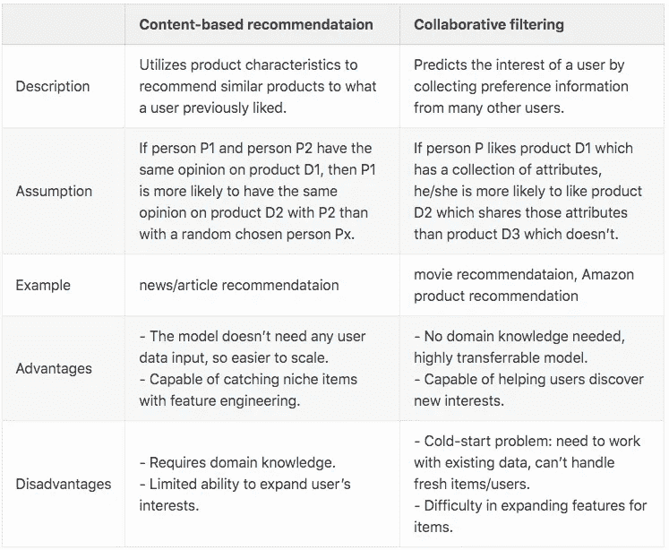
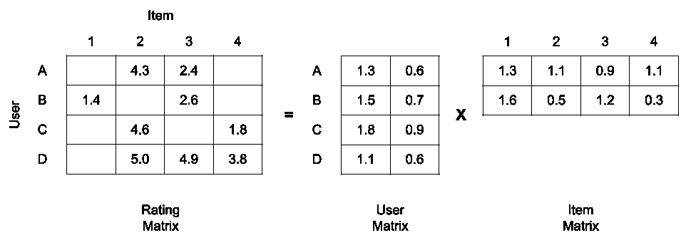
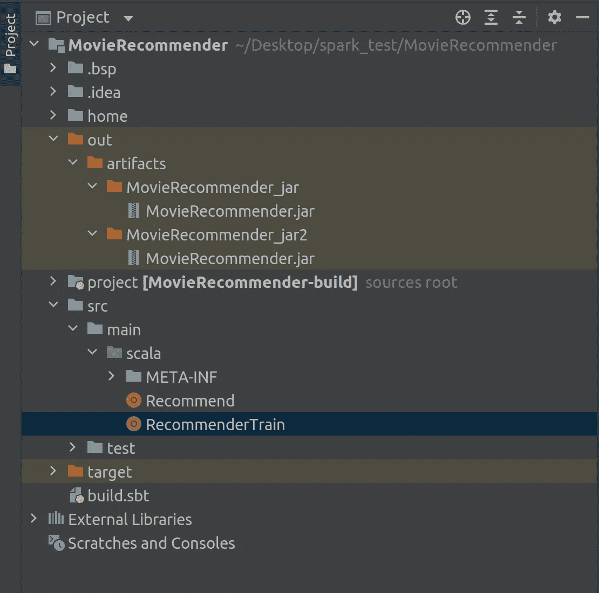
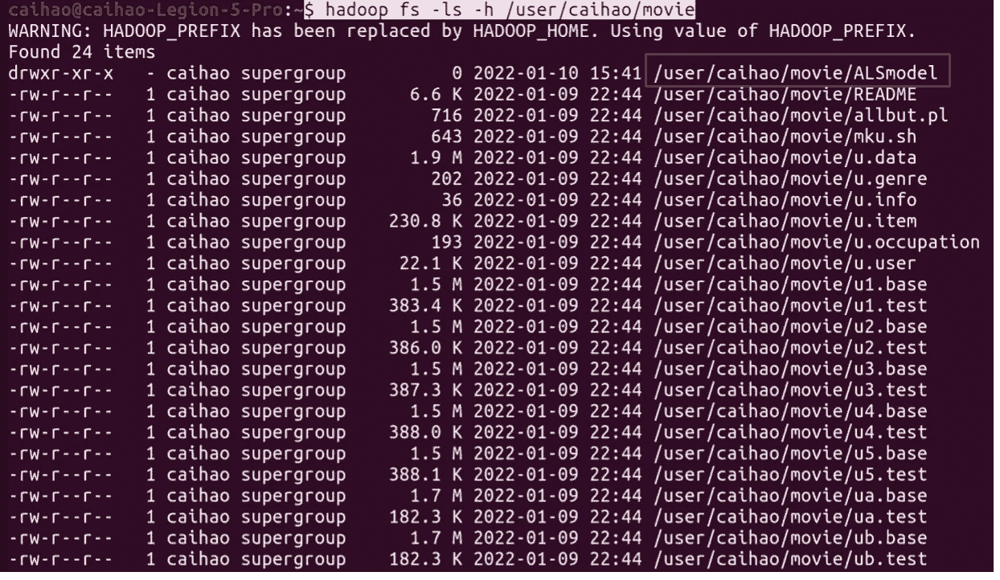
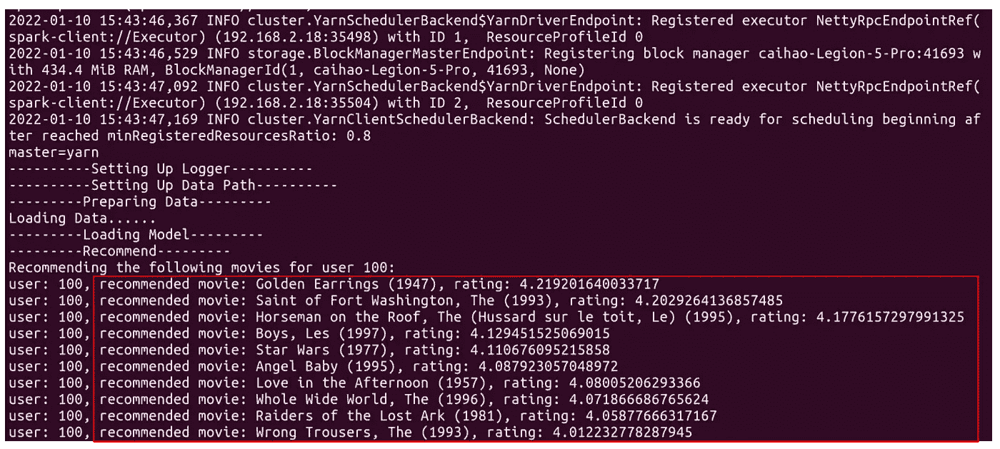
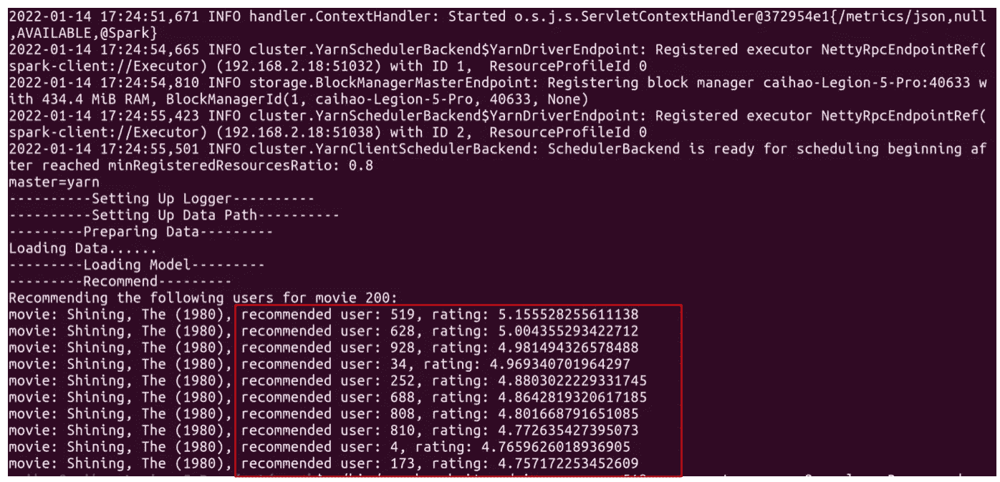
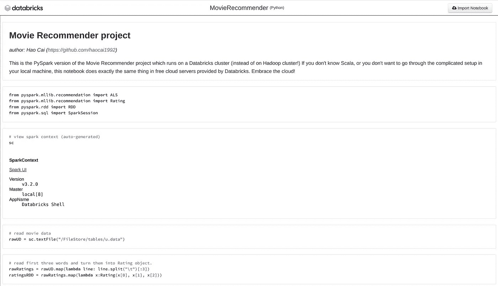

# 利用 Scala、Spark 和 Hadoop 构建推荐系统

> 原文：<https://towardsdatascience.com/build-recommendation-system-using-scala-spark-and-hadoop-d2ee35c97d3c>

## 在分布式 Hadoop 集群上使用 Scala 和 Spark 构建的电影推荐器


照片由[泰森·莫尔特里](https://unsplash.com/@tysonmoultrie?utm_source=unsplash&utm_medium=referral&utm_content=creditCopyText)在 [Unsplash](https://unsplash.com/s/photos/movie?utm_source=unsplash&utm_medium=referral&utm_content=creditCopyText) 拍摄

推荐系统是一种广泛使用的机器学习技术，在电子商务(亚马逊，阿里巴巴)，视频流(网飞，迪士尼+)，社交网络(脸书，Linkedin)和其他许多领域都有很多应用。由于这些服务中的大量数据，现在大多数行业级推荐系统都构建在 Spark 和 Hadoop 这样的大数据框架中。所以在这篇博客中，我想向你展示我是如何使用 Scala、Spark 和 Hadoop 构建一个电影推荐系统的。

# 1.推荐系统介绍

# 1.1 不同的推荐系统算法

推荐系统算法可以分为两种主要类型:基于内容的推荐和协同过滤。下面是一个描述它们之间差异的汇总表。



推荐算法:基于内容与协同过滤(图片由作者提供)

# 1.2 协同过滤和 Spark ALS

在这篇文章中，我们将使用协同过滤作为推荐算法。协同过滤的工作原理是这样的:首先，我们把所有用户对所有项目的评分看作一个矩阵，这个矩阵可以分解为两个独立的矩阵，一个是用户矩阵，其中行代表用户，列是潜在因素；另一种是项目矩阵，其中行是潜在因素，列代表项目(见下图)。在这个因式分解过程中，评分矩阵中缺失的值可以被填充，作为用户对项目评分的预测，然后我们可以使用它们向用户提供推荐。



*协同过滤中的矩阵分解*(图片由作者提供)

[ALS(交替最小二乘法)](/prototyping-a-recommender-system-step-by-step-part-2-alternating-least-square-als-matrix-4a76c58714a1)是一种协作过滤的数学优化实现，它使用交替最小二乘法(ALS)和加权λ正则化(ALS-WR)来寻找最佳因子权重，以最小化预测和实际评级之间的最小二乘法。 [Spark 的 MLLib 包](https://spark.apache.org/docs/latest/ml-guide.html)有一个[内置的 ALS 函数](https://spark.apache.org/docs/latest/mllib-collaborative-filtering.html)，我们将在本帖中使用。

# 2.系统设置

*   20.04.3
*   JDK 11.0.13
*   Scala 2.12.11
*   火花 3.2.0
*   Hadoop 3.2.2
*   IntelliJ IDEA (2021.3.1)

关于系统先决条件的详细设置，请跟随我在[上的](https://towardsai.net/)[帖子](https://pub.towardsai.net/how-to-set-up-your-environment-for-spark-7820b84491ef)前往 AI 。

# 3.资料组

在这个项目中，我们将使用来自明尼苏达大学双城分校的 [CC0 许可证](https://creativecommons.org/publicdomain/zero/1.0/)的 [MovieLens 数据集](https://grouplens.org/datasets/movielens/)。可以从 [Kaggle](https://www.kaggle.com/prajitdatta/movielens-100k-dataset/metadata) 下载 **ml-100k** (16M)。

运行以下命令解压缩 zip 文件:

```
unzip ml-100k.zip
```

你会看到解压后的`ml-100k`文件夹包含多个文件。


作者图片

我们主要使用两个数据文件:

*   `u.data`:用户评分数据，包括**用户 id** 、**物品 id** 、**评分**、**时间戳**。
*   `u.item`:电影数据，包括**项目 id** 、**电影名称**、**上映日期**、 **imdb url** 等。

# 4.火花运转

# 4.1 从 Github 克隆代码

在 Spark 中运行之前，使用以下命令将代码从我的 [Github 库](https://github.com/haocai1992/MovieRecommender)克隆到您的本地目录:

```
git clone [https://github.com/haocai1992/MovieRecommender.git](https://github.com/haocai1992/MovieRecommender.git)
```

在 IntelliJ IDEA 中打开文件夹。您的项目结构应该如下所示:



作者图片

# 4.2 在 HDFS 准备数据

在我们开始之前，我们需要在终端中启动 hadoop HDFS 和 YARN 服务(参见本文[中的](https://haocai1992.github.io/data/science/2022/01/11/how-to-set-up-your-environment-for-spark.html))。

```
$ hadoop namenode -format
$ start-all.sh
```

然后我们需要将 ml-100k 数据集上传到 Hadoop HDFS:

```
$ hadoop fs -put ~/Downloads/ml-100k /user/caihao/movie
```

# 4.3 Spark 中的培训推荐模型

使用以下工具在 Spark 中训练推荐模型:

```
$ spark-submit --driver-memory 512m --executor-cores 2 --class RecommenderTrain --master yarn --deploy-mode client ~/Desktop/spark_test/MovieRecommender/out/artifacts/MovieRecommender_jar/MovieRecommender.jar
```

使用以下工具查看您在 HDFS 训练的模特:

```
$ hadoop fs -ls -h /user/caihao/movie
```

您将在这里看到您的模型:



作者图片

# 4.4 在 Spark 中生成建议

为 Spark 中的`userID=100`推荐电影使用:

```
$ spark-submit --driver-memory 512m --executor-cores 2 --class Recommend --master yarn --deploy-mode client ~/Desktop/spark_test/MovieRecommender/out/artifacts/MovieRecommender_jar2/MovieRecommender.jar --U 100
```

您将看到以下输出:



作者图片

或者在 Spark 中为`movieID=200`推荐用户使用:

```
./bin/spark-submit --driver-memory 512m --executor-cores 2 --class Recommend --master yarn --deploy-mode client ~/Desktop/spark_test/MovieRecommender/out/artifacts/MovieRecommender_jar2/MovieRecommender.jar --M 200
```

您将看到以下输出:



作者图片

# 5.在数据块中运行 PySpark 版本

如果你不了解 Scala，我还创建了一个 Python 版本的推荐系统！它使用 PySpark 并运行在 Databricks 上。



作者图片

在这里检查我的代码:[我的数据块笔记本](https://databricks-prod-cloudfront.cloud.databricks.com/public/4027ec902e239c93eaaa8714f173bcfc/1453840335288608/1737910144074584/970786577303733/latest.html)。

要了解更多关于如何在数据块上创建集群和运行 Spark 的信息，请查看本教程。

# 6.推荐系统设计

我们的系统设计如下。


作者图片

总之，有两个 Scala 对象:

*   `RecommenderTrain.scala`:读取评级文件(`u.data`)，准备数据，训练 ALS 模型，保存模型。
*   `Recommender.scala`:读取电影文件(`u.item`)，加载 ALS 模型，生成电影推荐。

# 7.履行

# 7.1 培训 ALS 模型— `RecommenderTrain.scala`

`RecommenderTrain.scala`是一个 Scala 对象，包含三个主要方法。

## 7.1.1 `prepareData`

`prepareData`从 path 中读取 **ratings** 数据，解析有用字段并返回`ratingsRDD`。

```
def PrepareData(sc: SparkContext, dataPath:String): RDD[Rating] = {
    // reads data from dataPath into Spark RDD.
    val file: RDD[String] = sc.textFile(dataPath)
    // only takes in first three fields (userID, itemID, rating).
    val ratingsRDD: RDD[Rating] = file.map(line => line.split("\t") match {
      case Array(user, item, rate, _) => Rating(user.toInt, item.toInt, rate.toDouble)
    })
    println(ratingsRDD.first()) // Rating(196,242,3.0)
    // return processed data as Spark RDD
    ratingsRDD
}
```

## 7.1.2 `ALS.train`

`ALS.train`对`ratingsRDD`进行显式评级训练，并返回一个`MatrixFactorizationModel`对象。

```
val model: MatrixFactorizationModel = ALS.train(ratings=ratingsRDD, rank=5, iterations=20, lambda=0.1)
```

关于训练参数的信息:


`ALS.train (Image by Author)`中的参数

## 7.1.3 `saveModel`

`saveModel`将模型保存到路径。

```
def saveModel(context: SparkContext, model:MatrixFactorizationModel, modelPath: String): Unit ={
    try {
      model.save(context, modelPath)
    }
    catch {
      case e: Exception => println("Error Happened when saving model!!!")
    }
  finally {
  }
  }
}
```

# 7.2 生成建议— `Recommend.scala`

`Recommend.scala`是一个 Scala 对象，包含四个主要方法。

## 7.2.1 `prepareData`

`prepareData`从 path 中读取 **movies** 数据，解析有用字段并返回`movieTitle`。

```
def prepareData(sc: SparkContext, dataPath:String): RDD[(Int, String)] ={
    println("Loading Data......")
    // reads data from dataPath into Spark RDD.
    val itemRDD: RDD[String] = sc.textFile(dataPath)
    // only takes in first two fields (movieID, movieName).
    val movieTitle: RDD[(Int, String)] = itemRDD.map(line => line.split("\\|")).map(x => (x(0).toInt, x(1)))
    // return movieID->movieName map as Spark RDD
    movieTitle
}
```

## 7.2.2 `MatrixFactorizationModel.load`

`MatrixFactorizationModel.load`从路径加载 ALS 模型。

```
val model: MatrixFactorizationModel = MatrixFactorizationModel.load(sc=sc, path=modelPath)
```

## 7.2.3 `model.recommendProducts`

`model.recommendProducts`为给定的用户 ID 推荐电影。

```
val recommendP = model.recommendProducts(user=inputUserID, num=10)
```

## 7.2.4 `model.recommendUsers`

`model.recommendUsers`为给定的 itemID 推荐用户。

```
val recommendU = model.recommendUsers(product=inputMovieID, num=10)
```

# 8.摘要

好了，我们已经用 Scala + Spark + Hadoop(用 PySpark + Databricks)构建了一个推荐系统，祝贺你！我希望这篇文章对你有用。

Github 回购:[https://github.com/haocai1992/MovieRecommender](https://github.com/haocai1992/MovieRecommender)

<https://github.com/haocai1992/MovieRecommender>  

# 9.引文

*   **专题图片**:由[泰森摩尔](https://unsplash.com/@tysonmoultrie?utm_source=unsplash&utm_medium=referral&utm_content=creditCopyText)在 [Unsplash](https://unsplash.com/s/photos/movie?utm_source=unsplash&utm_medium=referral&utm_content=creditCopyText) 上拍摄。[https://unsplash.com/photos/BQTHOGNHo08](https://unsplash.com/photos/BQTHOGNHo08)。
*   MovieLens 数据集:F. Maxwell Harper 和 Joseph A. Konstan。2015.电影镜头数据集:历史和背景。ACM 交互式智能系统汇刊(TiiS) 5，4，第 19 篇(2015 年 12 月)，19 页。DOI = http://dx . DOI . org/10.1145/2827872

# 接触

*   **作者**:蔡皋
*   **电子邮件**:[haocai3@gmail.com](https://haocai1992.github.io/data/science/2022/01/13/haocai3@gmail.com)
*   **Github**:[https://github.com/haocai1992](https://github.com/haocai1992)
*   **领英**:[https://www.linkedin.com/in/haocai1992/](https://www.linkedin.com/in/haocai1992/)