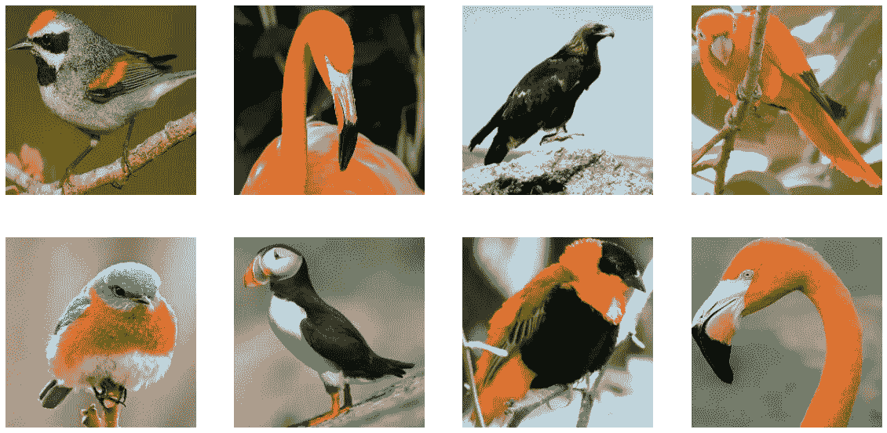
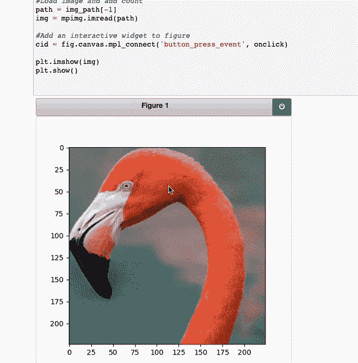
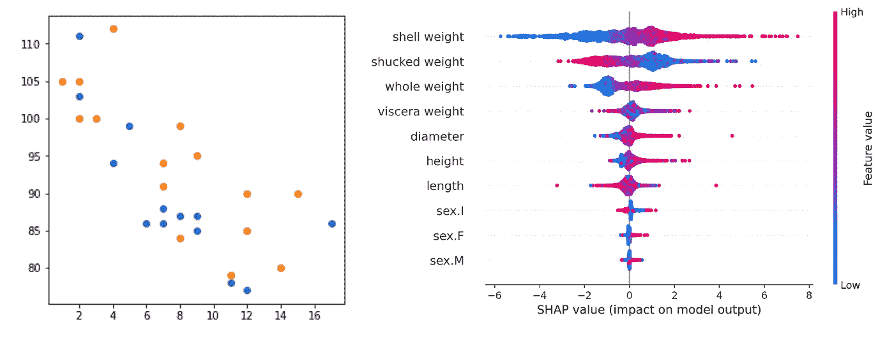
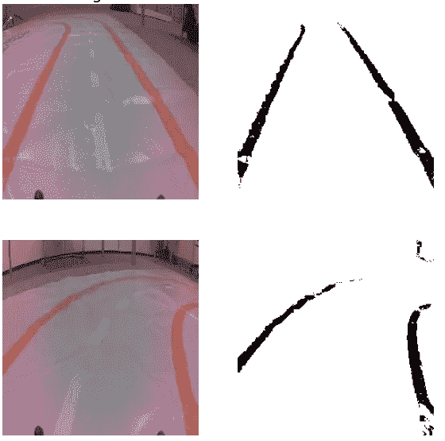

# 用 Python 构建颜色选择器

> 原文：<https://towardsdatascience.com/building-a-color-picker-with-python-55e8357539e7>

## 创建一个从图像像素中选择 RGB 通道的工具



(来源: [kaggle](https://www.kaggle.com/datasets/gpiosenka/100-bird-species) )

我知道，我知道…外面有很多颜色选择工具。然而，我想你会发现在笔记本上直接使用它的好处。这个工具也是完全可定制的。

我们将构建两个颜色选择器:

*   简单选取器—从单一图像中选择一种颜色
*   复杂拾色器—从多个图像中选择颜色列表并显示颜色

最后，我们讨论了数据科学中的一些应用。这些是我使用拾色器的方式。

## 进口

让我们深入研究代码。你也可以在 [GitHub](https://github.com/conorosully/medium-articles/blob/master/src/image_tools/colour_picker.ipynb) 上找到完整的项目。

首先，我们有一些进口货。我们有标准包装(第 2-3 行)。 **mpimg** 用于加载图像， **pyperclip** 用于将字符串保存到剪贴板，glob 用于处理文件路径。确保你已经安装了所有这些。

```
#Imports
import numpy as np
import matplotlib.pyplot as plt
import matplotlib.image as mpimg

import pyperclip

import random
import glob
```

我们将从不同的鸟类图像中挑选颜色。你可以在文章的封面图片中看到一些例子。您也可以在 [Kaggle](https://www.kaggle.com/datasets/gpiosenka/100-bird-species) 上找到完整的数据集。我们在给定的目录(第 2 行)中加载所有的图像路径(第 3 行)。

```
#Dataset
read_path = "../../data/birds/"
img_path = glob.glob(read_path + "*.jpg")
```

# 简单的颜色选择器

在**图 1** 中，您可以看到我们的第一个拾取器正在工作。每当我们点击图像中的某个位置，该像素的 RGB 通道就会保存到我们的剪贴板中。然后，我们可以将该值直接粘贴到笔记本中。



图 1:简单颜色选择器的演示(来源:作者)

为了创建这个选择器，我们从 **onclick** 函数开始。这是每次点击图像时运行。我们得到点击的 x 和 y 坐标(第 5-6 行)。然后我们得到该坐标像素的 RGB 通道(第 10 行)。最后，我们将这些通道作为字符串保存到剪贴板中(第 13 行)。

```
def onclick(event):
    global img

    # get x,y of click
    x = round(event.xdata)
    y = round(event.ydata)

    # get RGB values
    rgb = img[y][x]

    # save to clip board
    pyperclip.copy(str(rgb))
```

为了使用这个函数，我们首先用 matplotlib 创建一个图形(第 4 行)。然后，我们使用 **mpl_connect** 函数向该图添加交互功能(第 7 行)。您可以看到我们已经将 onclick 函数作为参数传入。最后，我们加载一个鸟的图像(第 10–11 行)并显示它(第 13 行)。

```
%matplotlib notebook
global img

fig = plt.figure(figsize=(5,5))

#Add an interactive widget to figure 
cid = fig.canvas.mpl_connect('button_press_event', onclick)

#Load image and add count
path = img_path[0]
img = mpimg.imread(path)

plt.imshow(img)
plt.show()
```

另一件要注意的事情是全局变量的使用(第 2 行)。这允许这些变量在 **onclick** 函数中更新。这是将图像作为参数传递的替代方法。我们还有线 **%matplotlib 笔记本**(线 1)。这样可以将数字保留在笔记本中。

# 复杂颜色选择器

现在让我们加强一下。在**图 2** 中，我们现在有一个图像框(左)和颜色框(右)。我们现在可以看到我们点击的像素的颜色，并遍历多个图像。另外，请注意彩色框左上角的红色数字。我们可以将颜色保存到一个列表中，这个数字会在我们每次这样做的时候更新。


图 2:复杂颜色选择器的演示(来源:作者)

同样，我们从我们的 **onclick** 函数开始。这与之前的拾色器类似。主要区别是我们现在运行函数 **change_choice** ，而不是保存 RGB 通道。我们还更新了一个全局 rgb 变量。这是因为它可以被下面的其他函数访问。

```
def onclick(event):
    global img
    global rgb

    # get x,y of click
    x = round(event.xdata)
    y = round(event.ydata)

    # get RGB values
    rgb = img[y][x]

    #Update second plot with colour
    change_choice()
```

我们有一个函数 **onpress** ，它将在键盘被按下时运行。我们从获取密钥开始(第 6 行)。接下来会发生什么取决于按下了哪个键:

*   **n** (下一步):我们运行 **change_image** 函数
*   **c** (复制):我们将 RGB 通道保存到剪贴板(第 13 行)和颜色列表(第 16 行)。我们还运行了 **change_choice** 函数。

记住，当 **onclick** 函数运行时，全局 rgb 变量被更新。这意味着当我们按下“c”时，将保存最近点击的 RGB 通道。

```
def onpress(event):
    global rgb
    global colours

    #Get key 
    key = event.key

    if key == 'n':
        change_image()

    elif key == 'c':
         # save to clip board
        pyperclip.copy(str(rgb))

        # add to list of colours
        colours.append(rgb)

        change_choice()
```

**change_choice** 用于更新彩色盒。为了创建这个框，我们使用与图像框相同的尺寸(第 13 行)。颜色框中的每个像素将具有当前**全局 rgb** 值的 RGB 通道(第 14 行)。我们还删除当前计数(第 9–10 行)，然后更新它(第 18 行)。为此，我们使用保存的**颜色列表**的长度。

```
def change_choice():
    global img
    global ax
    global colours
    global rgb

    # remove previous count
    for txt in ax[1].texts:
        txt.set_visible(False)

    # create array of colour choice
    dims = np.shape(img)
    col = np.array([[rgb]*dims[0]]*dims[1])
    ax[1].imshow(col)

    # update colour count
    ax[1].text(0, 15, len(colours),color='r',size=20)

    plt.show()
```

**change_choice** 功能通过两个动作运行:

*   通过 **onclick** 功能当我们点击图像时。在这种情况下，**全局 rgb** 被更新，框中的颜色将改变。
*   当我们按下“c”时，通过 **onpress** 功能。这里颜色列表的长度增加了，红色计数将会改变。

最后，我们有 **change_image** 函数。每当我们按下“n”时，这用于更新图像框。我们从关闭所有现有地块开始(第 8 行)。然后我们创建一个新的绘图(第 10 行)并添加点击(第 13 行)和按压(第 14 行)功能。我们加载并显示一个随机的鸟图像(第 17–20 行)。然后我们更新颜色框(第 24 行)。首先将全局 rgb 变量设置为[255，255，255]，我们将盒子颜色设置为白色。

```
def change_image():
    global img_path
    global img
    global ax
    global rgb

    # close all open plots
    plt.close('all')

    fig,ax = plt.subplots(1,2,figsize=(10,5))

    # add an interactive widget to figure 
    cid = fig.canvas.mpl_connect('button_press_event', onclick)
    cid2 = fig.canvas.mpl_connect('key_press_event', onpress)

    # load random image
    path = random.choice(img_path)
    img = mpimg.imread(path)

    ax[0].imshow(img)

    # reset the colour window
    rgb = [255,255,255]
    change_choice()
```

我们可以通过运行 **change_image** 函数来启动拾色器(第 12 行)。注意，我们现在在第 1 行中有了 **%matplotlib tk** 。这将在笔记本外部的窗口中打开拾色器。如果你试图直接在笔记本上运行它，它实际上是不起作用的。如果有人能解决这个问题，请在评论中告诉我:)

```
%matplotlib tk
global img_path
global colours
colours = []

# load image paths
read_path = "../../data/birds/"
img_path = glob.glob(read_path + "*.jpg")

# start widget
change_image()
```

当您遍历图像并保存颜色时，颜色列表将会更新。**图 3** 给出了这样一个列表的例子。这来自于我们在**图 2** 中看到的鸟类图像。


图 3:颜色列表示例

# 数据科学应用

我想与您分享这段代码，因为我发现它在我的数据科学之旅中非常有用。在本文的其余部分，我们将讨论一些应用程序。

## 巩固图表颜色

你可以说我是一个完美主义者，但是在展示作品时，我喜欢我所有的图表都有一个共享的配色方案。问题是我倾向于使用多个 python 包。在**图 4** 中，你可以看到 matplotlib(左)和 [SHAP](/introduction-to-shap-with-python-d27edc23c454) (右)使用的默认颜色的差异。



图 4:不同的图表颜色(来源:作者)

有了第一个拾色器，我能够解决这个问题。我可以用 Python 保存这些图表，加载它们，选择它们的颜色。更新 matplotlib 图表很简单。或者， [Leonie Monigatti](https://medium.com/u/3a38da70d8dc?source=post_page-----55e8357539e7--------------------------------) 有一个很好的[关于如何定制 SHAP 剧情的教程](https://medium.com/towards-data-science/how-to-easily-customize-shap-plots-in-python-fdff9c0483f2)。

您可能也会发现下面的代码很有用。它会将 RGB 通道转换成十六进制字符串。我发现有些包只接受这个颜色参数。

```
#convert RGB to hexidecimal 
from colormap import rgb2hex
rgb2hex(134,  94,  58)
```

## 使用图像数据的特征工程

第二个应用是为什么我决定建立更复杂的颜色选择器。我用它来创建机器学习的功能。在**图 5** 中，你可以看到橙色轨迹是如何从图像的其余部分中分离出来的。轨迹像素的颜色是使用拾色器获得的。



图 5:使用图像数据的特征工程(来源:作者)

下周，我将更详细地介绍这个应用程序。我将发表一篇关于图像数据特征工程的文章。除了上面的方法，它还包括灰度、裁剪和边缘检测。

我希望你喜欢这篇文章！你可以成为我的 [**推荐会员**](https://conorosullyds.medium.com/membership) **:)** 来支持我

[](https://conorosullyds.medium.com/membership)  

| [推特](https://twitter.com/conorosullyDS) | [YouTube](https://www.youtube.com/channel/UChsoWqJbEjBwrn00Zvghi4w) | [时事通讯](https://mailchi.mp/aa82a5ce1dc0/signup) —注册免费参加 [Python SHAP 课程](https://adataodyssey.com/courses/shap-with-python/)

## 资料组

**鸟类 450 种** -图像分类( [CC0:公共领域](https://creativecommons.org/publicdomain/zero/1.0/))[https://www.kaggle.com/datasets/gpiosenka/100-bird-species](https://www.kaggle.com/datasets/gpiosenka/100-bird-species)