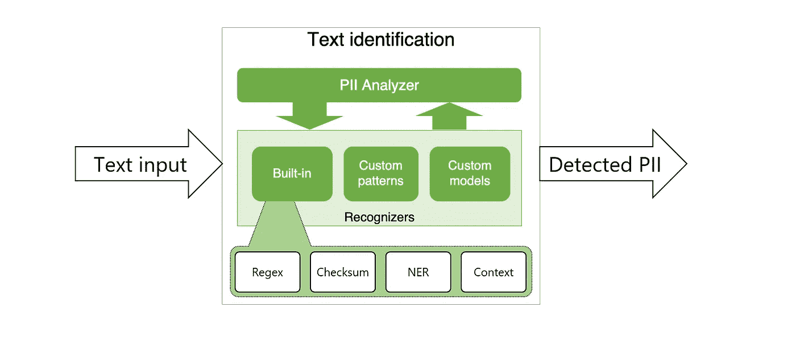
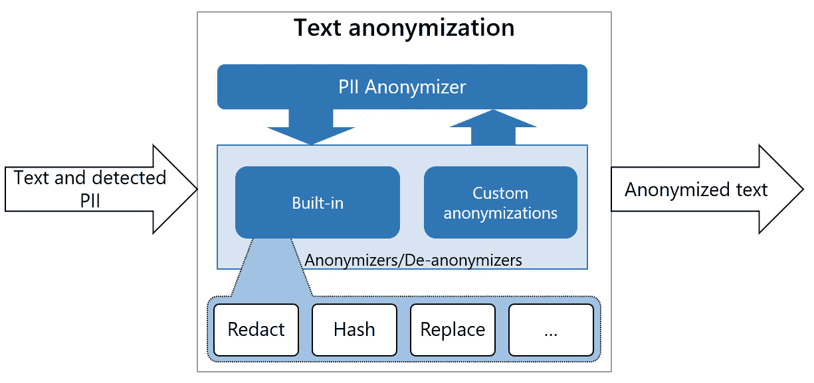

# 通过 Presidio 简化 PII 匿名化

> 原文：<https://towardsdatascience.com/building-a-customized-pii-anonymizer-with-microsoft-presidio-b5c2ddfe523b>

## 匿名化的背景以及如何构建匿名器


马库斯·斯皮斯克在 [Unsplash](https://unsplash.com?utm_source=medium&utm_medium=referral) 上的照片

随着欧洲 GDPR 法案的实施，各种法规纷纷出台，正确处理敏感信息，特别是**个人身份信息(PII)** 成为许多公司的一项要求。在本文中，我们将讨论什么是 PII，以及如何在非结构化数据(尤其是文本)中匿名化 PII。我们还将使用 Microsoft Presidio 演示一个文本匿名器的示例实现，这是一个提供快速 PII 识别和匿名化模块的开源库。本文分为以下几个部分:

1.  [背景:隐私和匿名](#1c5b)
2.  [现有的匿名技术](#ebe1)
3.  [用微软 Presidio 定制 PII 匿名器](#beb7)
4.  [结论、链接和参考文献](#f6d7)

跳到任何你觉得最有趣的部分！

# 背景

早在 19 世纪 50 年代，当美国人口普查局开始从公开的美国公民人口普查数据中删除个人数据时，就已经研究并应用了数据保护和隐私保护技术。自从早期使用诸如添加随机噪声或聚集的简单技术以来，已经提出并改进了各种模型。隐私是一项基本人权。根据字典的定义，它是

> 个人或团体封闭自己或关于自己的信息，从而有选择地表达自己的能力。

哪些个人信息被视为敏感信息，可能会损害个人隐私？欧盟在 2018 年出台了最严厉的隐私与安全法 [**【通用数据保护条例**](https://gdpr.eu/what-is-gdpr/) **(GDPR)** 。GDPR 将个人数据定义为

> “与可直接或间接识别的个人相关的任何信息。姓名和电子邮件地址显然是个人数据。位置信息、种族、性别、生物特征数据、宗教信仰、网络 cookies 和政治观点也可以是个人数据。”

根据一条信息是否可以直接或间接用于重新识别个人，人们可以将上述信息分为**直接识别符**和**准识别符**。<#61d8>

> -直接标识符:个人独有的一组变量(姓名、地址、电话号码或银行账户)，可用于直接识别主体。
> 
> -准识别信息:单独使用时无法重新识别的信息(如性别、国籍或居住城市)，但与其他准识别信息和背景知识结合使用时可能会重新识别。

# 现有的匿名技术

数据保护法规让公司和个人在利用数据获得洞察力和保护隐私之间不断斗争。但是，匿名化技术可以应用于数据集，因此不可能识别特定的个人。这样，这些数据集将不再受数据保护法规的保护。

**匿名结构化数据**

当涉及到结构化数据的匿名化时，有一些已建立的隐私数学模型，如 K-匿名或差分隐私。

K-anonymous 于 1998 年由 Pierangela Samarati 和 Latanya Sweeney 提出。如果在数据集中，一个人包含的每个信息不能与至少 k-1 个其他个体区分开来，则屏蔽数据集具有*k-匿名性*属性。有两种方法可以用来实现 k-匿名。一个是*抑制*，从数据集中完全删除一个属性的值；还有一种是*泛化*，用一个更一般的值替换一个属性的特定值。

**L-多样性**是*k-匿名*的进一步扩展。如果我们将数据集中具有相同准标识符的多组行放在一起，那么每个敏感属性至少有 *l* 个不同的值，那么我们可以说这个数据集具有 *l 多样性。*

微软研究院的 Cynthia Dwork 于 2006 年引入了差分隐私。[换句话说，仅仅通过观察差分私有分析的输出，人们不能肯定地说一个特定的个体是否在数据集中。有了差分隐私，我们可以了解关于一个群体的有用信息，而不知道关于一个个体的信息。](#752b)

计算数据集统计数据(如平均值、方差)或执行某些聚合的算法可以被视为差分私有算法。也可以通过在数据中添加噪声来实现。差分隐私使用参数ε来调节隐私和数据集有用性之间的权衡。

还有一些众所周知的技术可应用于结构化数据库的匿名化:

*   **屏蔽**:删除、加密或隐藏私有标识符
*   **假名化**:用假名或假值替换私有标识符
*   **泛化**:用一个更通用的值替换一个特定的标识符值
*   **交换**:交换数据集的属性值，使它们与原来的不同
*   **扰动**:通过引入随机噪声或使用随机方法改变数据

**匿名化非结构化数据**

对文本或图像等非结构化数据进行匿名化的过程更具挑战性。它需要检测非结构化数据中敏感信息的位置，然后对其应用匿名技术。由于非结构化数据的性质，直接使用简单的基于规则的模型可能不会有很好的性能。例外情况是电子邮件或电话号码，它们可以通过基于模式的方法(如 RegEx)非常有效地检测和匿名。其他挑战包括不同国家的识别资料类型不同。因此，很难设计一个适用于所有用例的通用系统。典型的标识符类型包括上面提到的内容—姓名、电子邮件、驾驶执照等。除此之外，你可以在这里找到一个关于敏感信息类型的详尽列表[。](https://docs.microsoft.com/en-us/microsoft-365/compliance/sensitive-information-type-entity-definitions?view=o365-worldwide)

除了基于规则的方法，自然语言处理(NLP)技术也被应用于文本匿名化。特别是用于命名实体识别(NER)任务的技术。这是一种序列标记任务。在这种情况下，标签指示令牌(如单词)是否对应于命名实体，如*人、* *地点、*或*日期*。


命名实体识别(图片由作者提供)

几个神经模型已经在具有一般命名实体的数据集上的 NER 任务上实现了最先进的性能。当他们在包含各种类型的个人信息的医疗领域数据上接受培训时，他们在这些数据上也表现出了最先进的性能。这些模型架构包括带有字符嵌入的递归神经网络 [⁴](#6635) 或双向变压器 [⁵](#c3ea) 。 [SpaCy](https://spacy.io/) 也有一款 NER 车型。它是一个在 Ontonotes 数据集上微调的 [RoBERTa](https://arxiv.org/abs/1907.11692) 语言模型，有 18 个命名的实体类别，如 *PERSON* 、 *GPE* 、 *CARDINAL* 、 *LOCATION、*等(实体类型[的完整列表见此处](https://catalog.ldc.upenn.edu/docs/LDC2013T19/OntoNotes-Release-5.0.pdf))。另一个开箱即用的工具是 [Presidio](https://microsoft.github.io/presidio/) 。这是一个由微软开发的匿名化 SDK，依靠基于规则和基于 NER 的模型来检测和屏蔽 PII。支持实体的列表可以在这里找到[。](https://microsoft.github.io/presidio/supported_entities/)

认出 PII 后会发生什么？

一种方法是用虚拟值替换标识符。例如，如果在类似“*我的名字是 Amy，我的号码是 85562333* ”的句子中识别一个人的名字或电话号码，那么匿名化的文本可以是“*我的名字是< PERSON_NAME >，我的号码是< PHONE_NUMBER >* ”。这种方法简单明了，但也有一些缺点。当对所有相同的实体类型使用一个值时，我们会丢失重要的信息。在这个例子中，我们不知道这个人的性别。根据匿名文本的用途，可能需要保留此类信息。或者当涉及到地址时，人们希望将地理分布保持在一定水平。

另一种方法是用代理值替换检测到的实体。可以从每个实体类型的预定列表中随机抽取，也可以根据某种规则抽取。还有一些 Python 包，如 [Faker](https://github.com/joke2k/faker) ，可以生成合成地址或名称作为代理值。

# 用微软 Presidio 定制 PII 匿名器

当我们将 PII 匿名化应用于现实世界的应用时，可能会有不同的业务需求，这使得直接使用预训练模型具有挑战性。例如，想象一下，挪威的一家公司找到你，希望你为他们开发一个文本匿名器。他们希望它支持在英语和挪威语文本中匿名化 PII。除了常见的 PII 实体，您还需要检测遵循某些校验和规则的挪威国民 ID 号。预先训练的 NER 模型是很好的，但是如果不使用额外的标记数据来微调模型以获得良好的性能，您就不能轻松地添加新的实体类型。因此，拥有一个能够利用预训练模型并且易于定制和扩展功能的工具是很好的。

[微软 Presidio](https://github.com/microsoft/presidio) 是一个开源的 SDK，它就是这样做的。据他们说，

> Presidio 支持针对特定业务需求的可扩展性和可定制性，允许组织通过民主化去身份识别技术和引入决策透明度，以更简单的方式保护隐私。

它有两个主要部分——分析器和匿名器**。分析器是一个基于 Python 的服务，用于检测文本中的 PII 实体。它利用命名实体识别、正则表达式、基于规则的逻辑以及多语言相关上下文的校验和。例如，它为电子邮件和 IP 地址使用预定义的基于 Regex 模式的识别器，并使用 SpaCy 自然语言处理模型为命名实体构建识别器。**

****

**Presidio 分析仪(图片来自 [Presidio 文档](https://microsoft.github.io/presidio/analyzer/)**

**匿名器也是一个基于 python 的服务。它通过应用某些操作符(如 replace、mask 和 redact)将检测到的 PII 实体匿名化。默认情况下，它在文本中直接用实体类型替换检测 PII，如`<EMAIL>`或`<PHONE_NUMBER>`。但是可以定制它，为不同类型的实体提供不同的匿名逻辑。**

****

**Presidio 匿名器(图片来自 [Presidio 文档](https://microsoft.github.io/presidio/anonymizer/)**

**首先，按照此处的说明[安装 Presidio 后，使用它就像调用默认`AnalyzerEngine`和`AnonymizerEngine`一样简单:](https://microsoft.github.io/presidio/installation/)**

**`AnalyzerEngine`策划了对 PII 的侦查。它的一些最重要的属性包括:**

*   **`registry` : `RecognizerRegistry`它包含了所有要在文本上使用的预定义或定制的识别器**
*   **`nlp_engine`:NLP 模块的抽象，包括对文本中的标记的处理功能**
*   **`supported_languages`:支持的语言列表**

**对于我们前面提到的场景，使用默认的分析器是不够的，我们需要通过添加以下定制来定制我们自己的分析器引擎。**

****1。附加语言支持****

**默认情况下，Presidio 使用英文文本。但是因为在我们的例子中我们也将处理挪威语文本，我们需要将挪威语添加到 Presidio 的`NlpEngineProvider`的配置中。**

**这是 SpaCy 上的[挪威语模型](https://spacy.io/models/nb#nb_core_news_md)管道。在运行分析器之前，还需要下载语言模型。**

****2。添加挪威电话号码识别器****

**Presidio 中有一组预定义的识别器。此处见详细实体列表[。我们可以选择加载部分或全部。Presidio 的一个优点是很容易添加适合自己用例的识别器。在下面的示例中，我们为以+47 国家代码开头的挪威电话号码添加了一个识别器，因为默认的电话号码识别器不支持所有的国家代码。](https://microsoft.github.io/presidio/supported_entities/)**

****3。添加挪威国家 ID 识别器****

**挪威身份证号码包含一个人的生日和一些遵循一定规则的数字(参见详细规则[此处](https://docs.microsoft.com/en-us/microsoft-365/compliance/sit-defn-norway-identification-number?view=o365-worldwide))。我们可以为挪威语 ID 识别器创建一个类，它以如下方式从 Presidio 扩展了`EntityRecognizer`:**

**最后，将所有东西放在一起，我们就有了我们定制的分析仪:**

**当我们运行分析器来分析一段文本时(通过调用`analyzer.analyze(text)`，可选地给出要识别的实体类型列表)，文本将通过我们定义的识别器管道。我们可以添加三种主要类型的识别器——基于模式的识别器、基于规则的识别器和外部识别器。在这个例子中，我们需要添加基于规则的识别器。基于规则的识别器利用 NLP 工件，这些工件是由 NLP 引擎产生的用于识别 PII 的令牌相关信息，例如词条、POS 标签或实体。**

**对于已识别的 PII，它将返回包含详细信息的字典:**

```
{
  'entity_type': 'NORWEGIAN_ID',
  'start': 74,
  'end': 85,
  'score': 0.95
}
```

**在匿名化方面，我们可以通过文本中的类型`<NORWEGIAN_ID>`直接屏蔽 PII 实体，得到类似“我的 id 是< NORWEGIAN_ID >”的内容，或者我们可以向`Anonymizer`提供一个自定义操作符的字典。例如，我们可以创建一个随机的 11 位数字来替换 ID。此外，我们还可以使用`faker`之类的包来生成合成名称。**

****用一些例子测试匿名器****

**为了测试匿名器的性能，我们从 LinkedIn 上找到了挪威语和英语的招聘信息。他们通常有许多 PII 实体。下面显示了一些示例文本(注意:这里发布的是经过编辑的版本，所以它们不包含任何真实的标识符)。**

**将样本文本提交到我们的匿名管道，我们获得了以下结果:**

**正如我们所见，对于英文文本，匿名器具有非常好的性能，可以检测所有的姓名、电子邮件和电话号码。对于文本语法合适的挪威语文本，检测性能也很好。然而，当谈到不是正确句子的挪威语文本时，例如第 4 个例子，我们可以看到它有点纠结，把电话号码和日期搞混了。对于那些对更详细的性能评估感兴趣的人，请查看[这篇论文](https://aclanthology.org/2021.acl-long.323.pdf)，其中他们进行了一项研究，将 Presidio 应用于一个来自维基百科文本的小型人工标注数据集。**

# **结论**

**在本文中，我们讨论了隐私和 PII 的背景，并展示了如何使用`Presidio`来构建一个定制的 PII 匿名器。在真实文本上的结果是有希望的。我们还可以进一步改进。我们可以用一个更强大的语言模型来替换底层语言模型，以便在 NER 上获得更好的性能。为了识别更多由不同国家定义的 PII 实体，我们还可以添加更多基于规则的识别器。**

****最终备注:****

**我在[蜡笔小组](https://www.crayon.com/no/)的 [Inmeta](https://inmeta.no/) 做数据科学顾问。我们看到越来越多的客户对正确处理 PII 感兴趣，所以我们非常感谢像 Presidio 这样的好的开源库，它使我们能够利用最先进的技术来解决这个问题。**

**在我的 [Github 库](https://github.com/lz-chen/pii_anonymizer)中查看定制匿名器的完整实现。它还包括将它作为 Docker 应用程序运行并将其部署到 AWS 的脚本。感谢您阅读文章！我很想听听你对这个话题的看法！请随时在 LinkedIn 上与我联系。**

# **参考**

1.  **[^](#8b4e) 《文本数据的匿名化模型:现状、挑战和未来方向》(2021 年)。计算语言学协会第 59 届年会暨第 11 届国际自然语言处理联合会议论文集**
2.  **[^](#e3e5) 皮耶安吉拉·萨马拉蒂和拉坦娅·斯威尼，《披露信息时保护隐私:k-匿名及其通过推广和抑制的实施》(1998 年)。技术报告，SRI 国际**
3.  **[^](#5b32) 辛西娅·德沃克、弗兰克·麦克雪莉、科比·尼斯姆和亚当·斯密，《在私人数据分析中校准噪声与灵敏度》(2006 年)。密码学理论**
4.  **[^](#4611) Franck Dernoncourt，Ji Young Lee，Ozlem Uzuner 和 Peter Szolovits，使用递归神经网络对患者病历进行去识别(2017)。美国医学信息学协会杂志**
5.  **[^](#4611) Alistair EW Johnson、Lucas Bulgarelli 和 tom j pollard，使用预先训练的双向转换器对自由文本医疗记录进行去识别(2020)。美国计算机学会健康、推理和学习会议录**