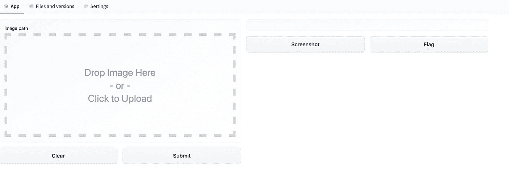

# 使用 Tensorflow 2 构建带有自定义数据集的 CycleGAN 模型

> 原文：<https://towardsdatascience.com/building-a-cyclegan-model-with-custom-dataset-using-tensorflow-2-12d66be16378>

## 展开拥抱脸空间


图片来源:作者

生成对抗网络是机器学习中的一种生成建模技术。在 GAN 中，两个不同的神经网络(生成器和鉴别器)相互竞争。生成器的输出虽然是合成的，但可能接近真实。

有许多不同的甘[架构](https://neptune.ai/blog/6-gan-architectures)。今天，我们将关注 CycleGAN。cycleGAN 的有趣之处在于，它是一种不成对的图像到图像翻译技术。

在这项工作中，我们将研究一个在自定义数据集上训练和部署 cycleGAN 模型的端到端示例。你可以在这里找到可用的 CycleGAN 代码(使用 Tensorflow 2) [，所以我不会重复我们已经有的。相反，我想重点关注几个重要的缺失部分，这些部分是你在现实生活的深度学习项目中需要的——使用定制数据。评估 GAN 模型，使用已经训练好的模型进行预测，最后创建一个有趣的演示！！](https://www.kaggle.com/amyjang/monet-cyclegan-tutorial)

因此，这项工作的贡献可以概括为—

*   使用自定义图像数据创建张量流数据集
*   计算 FID 分数以评估 GAN 模型
*   保存和加载模型
*   在拥抱面空间展开模型

玩得开心点。

**使用自定义图像数据创建张量流数据集:**

为了在 Tensorflow 中训练我们的模型，我们需要 Tensorflow 数据集格式的训练数据集——公开为`tf.data.Datasets`。`tf.data.Datasets`中的每个元素可以由一个或多个元素组成。例如，图像管道中的单个元素可以是表示图像及其标签的一对张量。在我们的示例中，我们将以 TFRecord 格式表示图像，这是 Tensorflow 自己的二进制记录格式。使用 TFRecord 格式有几个好处

*   这是一种二进制格式，因此占用的磁盘空间和内存的读/写时间更少
*   使用 TFRecord，可以将多个数据集组合成一个数据集。例如，在这项工作中，我们将多个图像组合成一个 TFRecord。这个组合记录很好地集成到了`tf.data.Datasets`的数据加载和预处理功能中。这在加载非常大的数据集时特别有用，数据集库可以只加载 TFRecord 的必要部分进行处理，而不是将整个数据集加载到内存中。
*   您可以在 TFRecord 中存储序列数据，例如单词嵌入或时间序列数据。

TFRecord 的一个缺点是——创建 TFRecord 并不简单——至少对我来说是这样:)

首先，我们需要定义一个描述 TFRecord 组件的字典。例如，对于一个图像分类问题(有监督的)，您可能有一个`image`和一个`label`。因为我们正在研究一个 cycleGAN 模型，我们不需要一个`label`,因为它本质上是无人监管的。

```
feature = {
 ‘image’: _bytes_feature(image),
 }
```

这里，`_bytes_feature`是一个私有方法，它从一个字符串/字节返回一个字节列表

```
def _bytes_feature(value):
 “””Returns a bytes_list from a string / byte.”””
 if isinstance(value, type(tf.constant(0))):
 value = value.numpy() 
 return tf.train.Feature(bytes_list=tf.train.BytesList(value=[value]))
```

一旦我们有了 TFRecord，我们如何知道记录实际上是正确创建的呢？我们可以计算每个 TFRecord 中的项目数(记住——我们在一个 TF record 中有多个图像)。我们还可以可视化整个数据集。

```
FILENAMES = tf.io.gfile.glob('cat*.tfrec')
print(f'TFRecords files: {FILENAMES}')
print(f'Created image samples: {count_data_items(FILENAMES)}')display_samples(load_dataset(FILENAMES, *IMAGE_SIZE).batch(1), 2, 5)
```

注意`display_samples`函数调用中的`2`和`5`这两个数字。这些数字表示行数和列数。将行数乘以列数得到数据集中图像的总数。因此，它需要与您的数据集大小相匹配。

关于自定义数据集创建的端到端代码，请参见[这里的](https://gist.github.com/nahidalam/38bb8d4677440d17ff020ffb0c2ea009)

**评估 GAN 模型**

没有单一的指标来评估 GAN 模型。根据用例，您可能想要使用定量和定性指标的组合。

在我们的工作中，我们将使用 FID 评分。Frechet 初始距离(FID)度量生成图像和真实图像的特征之间的距离。FID 越低越好。如果 FID 为 0，则表示两幅图像相同

那么我们如何计算 FID 分数呢？tldr

*   使用预训练的 Inception V3 模型，删除最后一层
*   生成两幅图像(生成的和真实的)的特征向量。向量大小将是 2，048
*   然后使用[论文](https://arxiv.org/pdf/1907.08175.pdf)中描述的等式 1 计算 FID 分数

FID 的一些*缺点*要记住

*   FID 使用一个预训练的初始模型，它的特征向量可能不能捕获你的用例的必要特征。
*   为了更好地工作，FID 需要大的样本量。建议的最小样本量为 10，000

如果您想了解更多关于如何计算 FID 分数的信息，请参考[这里的](https://machinelearningmastery.com/how-to-implement-the-frechet-inception-distance-fid-from-scratch/)

**保存并加载模型:**

训练完模型后，我们想要保存它(假设我们对训练/验证损失和评估满意)。在保存模型时，我们希望确保保存了整个模型。

我们所说的*整个模型*是什么意思？

*   模型的架构/配置、重量
*   模型的优化器状态和
*   模型的编译信息(如果。调用了 compile()

我们想要保存整个模型，因为—

*   在推理过程中，您不需要模型架构代码。这样你会有一个干净的推理逻辑，更快的开发周期。
*   如果您想要转换用于边缘设备(TFLite)的模型，或者想要使用 Tensorflow.js 在浏览器中运行模型，您需要拥有整个模型

有几种方法可以保存整个模型。对于 Tensorflow 2，我更喜欢 *SavedModel* 格式。可以用 Keras 的`model.save`方法，也可以用 Tensorflow 的`tf.keras.models.save_model`方法。在`model.save()`函数中，如果你使用一个字符串作为参数，你的模型将被保存为`SavedModel`格式。

```
model.save('art_generator')
```

**在拥抱面部空间展开:**

现在我们已经保存了模型，我们可以编写推理逻辑并部署它供人们使用。对于这个项目，我已经在拥抱面部空间[这里](https://huggingface.co/spaces/nahidalam/meow)部署了模型。如果你访问那个[链接](https://huggingface.co/spaces/nahidalam/meow)，你会看到这样的东西——



拥抱面部空间的示例应用程序

在那里，你可以上传你的`cat`照片(或任何其他宠物)，按下`submit`按钮，等待 10 秒钟就可以看到猫`art`了，如下图所示


照片到艺术

你可能会意识到，我需要更多的迭代来提高艺术的质量。但尽管如此，这是一个有趣的应用程序玩！

关于如何在拥抱面部空间部署模型的细节可以在[这里](https://huggingface.co/docs/hub/spaces)找到。

## 参考资料:

1.  [https://developers.google.com/machine-learning/gan](https://developers.google.com/machine-learning/gan)
2.  关于 TF record[https://medium . com/mosely-ai/tensor flow-records-what-them-and-how-to-use-them-c 46 BC 4 BBB 564](https://medium.com/mostly-ai/tensorflow-records-what-they-are-and-how-to-use-them-c46bc4bbb564)的详细信息
3.  如何评价甘模式[https://machine learning mastery . com/how-to-evaluate-generative-adversarial-networks/](https://machinelearningmastery.com/how-to-evaluate-generative-adversarial-networks/)
4.  卡格尔·周期根的例子[https://www.kaggle.com/amyjang/monet-cyclegan-tutorial](https://www.kaggle.com/amyjang/monet-cyclegan-tutorial)
5.  如何计算 FID 分数[https://machine learning mastery . com/how-to-implementing-the-frechet-inception-distance-FID-from-scratch/](https://machinelearningmastery.com/how-to-implement-the-frechet-inception-distance-fid-from-scratch/)
6.  如何保存和加载 Tensorflow 模型[https://medium . com/deep-learning-with-keras/save-load-keras-models-with-custom-layers-8f 55 ba 9183 D2](https://medium.com/deep-learning-with-keras/save-load-keras-models-with-custom-layers-8f55ba9183d2)
7.  关于评估 GAN 模型的详细信息[https://wandb . ai/ayush-tha kur/GAN-evaluation/reports/How-to-evaluation-GANs-using-frech et-Inception-Distance-FID-vmlldzo 0 mtaxoti](https://wandb.ai/ayush-thakur/gan-evaluation/reports/How-to-Evaluate-GANs-using-Frechet-Inception-Distance-FID---Vmlldzo0MTAxOTI)
8.  在拥抱面部空间展开你的模型[https://huggingface.co/docs/hub/spaces](https://huggingface.co/docs/hub/spaces)