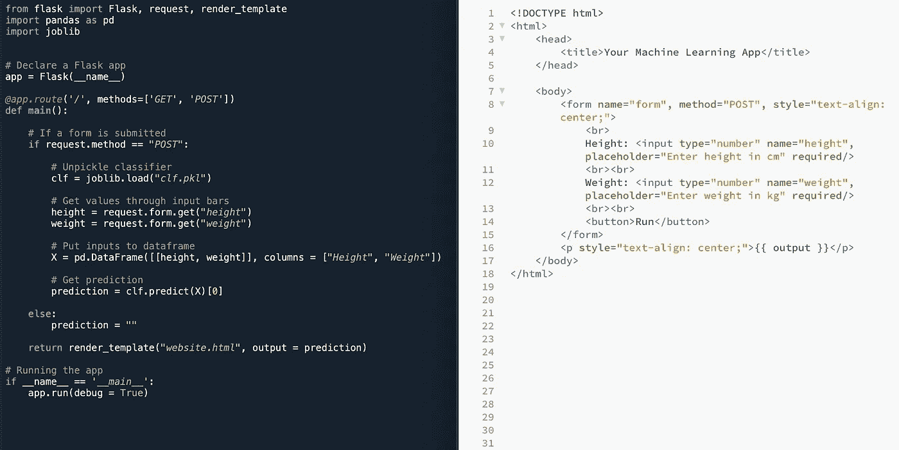
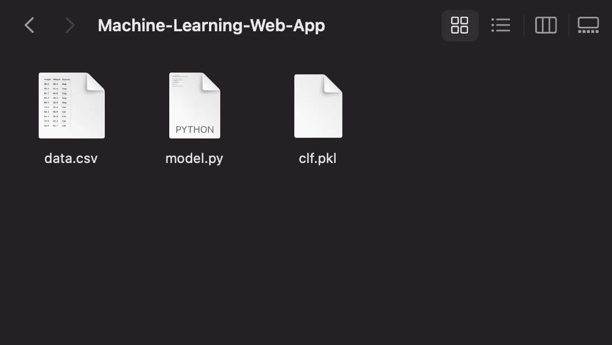
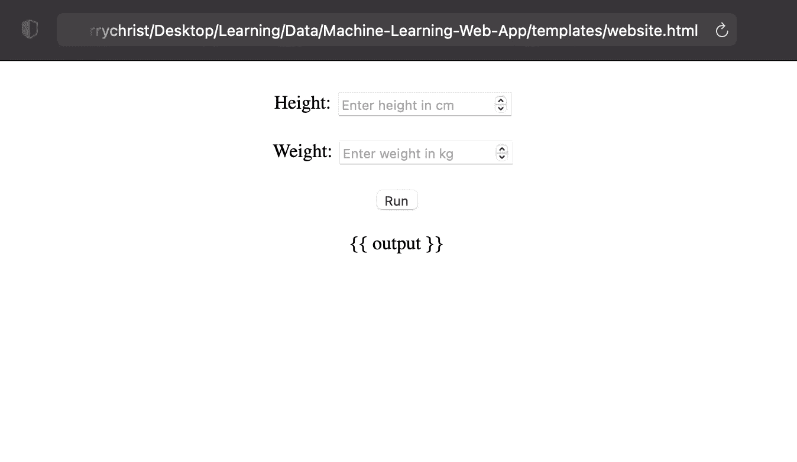
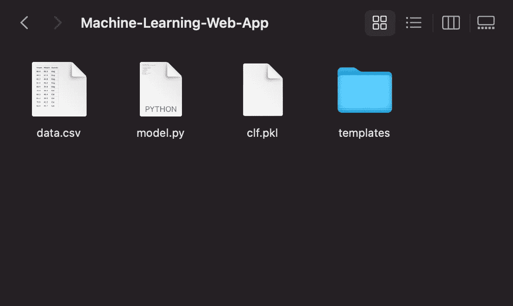
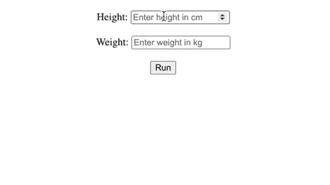

# 使用 Flask 构建机器学习 Web 应用程序

> 原文：<https://towardsdatascience.com/building-a-machine-learning-web-application-using-flask-29fa9ea11dac>

## 使用 Python 和 Flask 实现机器学习 API 的简单教程



作者图片

如果你是数据科学家或者数据科学专业的学生，你应该知道机器学习是如何工作的。您知道算法的细节，使用哪个库，并执行诊断。假设在一个商业环境中，你手里有一个完美的模型，结果很优秀，一切都很理想。然后呢？建议我们将代码交给相关的涉众，如果他们想看到结果，请他们运行代码，这确实很诱人。但这不是商业环境的运作方式。这个问题的一个解决方案是创建一个机器学习 web 应用程序。有了这个解决方案，利益相关者就可以通过一个网站访问和运行你的机器学习模型，而不是一些他们看不懂的代码。本教程将向您展示如何使用 Python 为机器学习模型、Flask 为后端引擎、HTML 为前端创建机器学习 web 应用程序。

顺便说一下，我正在 Mac 电脑上运行本教程。据我所知，如果你使用的是其他操作系统，教程的任何部分都应该没有区别。但是如果有，请告诉我。

好吧，我们开始吧。

# 机器学习模型

在这一节中，我将把 Python 文件命名为`model.py`。出于本教程的考虑，我将使用以下假数据构建一个简单的二进制分类器。

给定身高和体重，我使用高斯朴素贝叶斯分类器来预测物种。如果你注意到，我没有费心做训练测试分割，因为在本教程中，我只需要分类器。为了开发一个好的机器学习模型，请不要跳过训练-测试的分离。

接下来，我们将把这个机器学习模型扔到一个泡菜里。在 Python 中，pickle 是指将一个变量存储到一个`.pkl`文件中。为了提取模型，将下面的代码添加到`model.py`中。稍后我会解释为什么我们应该酸洗我们的模型。

您应该注意到您的目录现在应该存储文件`clf.pkl`。



当前目录

请记住，您可以在这个过程中使用您的模型。请记住，对于本教程，我使用的是`sklearn`模型。使用其他机器学习库可能与本教程不兼容。

# 前端

在这一节中，我将 HTML 文件命名为`website.html`。

这是一个简单的 HTML，由两个输入栏组成，一个输入身高，一个输入体重。仔细查看这段代码，您可能会注意到第 16 行有些奇怪。的确`{{ output }}`不是 HTML 语法，你是对的。看看如果我们照原样运行上面的 HTML 会发生什么。



HTML 输出

这个`{{ }}`语法属于 Flask，我们将使用的 web 框架。稍后用 Flask 运行这个 HTML，会产生不同的输出。

显然，这种设计不适合部署，因为它太普通了。您可以在本教程中使用自己的设计，最好是适合您的模型目的和您的组织的设计。如果你想使用你自己的设计，这里有一些要注意的事情

*   确保您有一个带有`method = "POST"`的表单。
*   记住输入栏的名称。为了我们之间的一致性，我建议使用`name = "height"`和`name = "weight"`作为输入。

请注意，您必须在目录中创建一个名为`templates`的文件夹，并将 HTML 文件放在那里以供 Flask 应用程序使用。否则，你不会得到你想要的结果。



当前目录

同样，文件`website.html`位于`templates`文件夹中。

# 后端

在这一节中，我将把 Python 文件命名为`app.py`。如果你是初学者，使用 Flask 有点棘手。我会演示给你看怎么用，但不会泄露每行代码的推理过程。

记录导入的库。这里，第 7 行是 Flask 应用程序的声明，第 13 行只是运行应用程序。第 10 行是我们放置主要函数的地方。

我会解释一些函数和方法，所以一旦我给出了主要函数，就更容易理解了。

main 函数应该只在我们收到来自 HTML 的 POST 请求时运行。我们可以通过看条件`request.method == "POST"`来强加这个条件。

如果我们收到一个 POST 请求，我们希望从输入中获取值。我们可以通过代码`request.form.get("name")`来实现。其中`"name"`是 HTML 中输入栏的名称。对于我们的例子，输入栏名称是`name = "height"`和`name = "weight"`。

为了调用我们之前腌制的模型，我们使用函数`joblib.load("clf.pkl")`。

为了使用 Flask 语法呈现 HTML 文件，我们使用函数`render_template("file.HTML")`。

让我们把这些拼图拼在一起。

简单重申一下我的解释，

*   第 5 行是我们从 HTML 接收 POST 请求的地方
*   8 号线在调用我们之前训练腌制的模型。
*   第 11 & 12 行从 HTML 获取输入。
*   第 15 行将这些输入放入 Pandas 数据帧。
*   第 18 行预测给定输入的输出。
*   第 21 行，如果没有 POST 请求，HTML 中的输出字段将保持为空。
*   第 23 行显示了带有 Flask 语法的 HTML。我将很快解释这些论点。

使用 Flask，您可以发送一个 Python 变量以出现在 HTML 文件中。该变量可以是任何类别，甚至是数据框。方法是在`render_template()`函数中指定它。

在 Python 中

```
render_template("file.HTML", name_in_HTML = name_in_Python)
```

在`file.HTML`

```
{{ name_in_HTML }}
```

当然，`name_in_Python`只是你的 Python 变量，`name_in_HTML`是你想在 HTML 中使用的名字。

因此，在我们的主函数中，我们将机器学习预测的结果发送到 HTML。在实践中，您可以出于多种原因使用它，例如，

*   如果您正在使用会话，请留言“你好，姓名”。
*   使用`datetime`库显示今天的日期。
*   打印所有输入，以确保用户的确定性。

为了实现我提到的一切，`render_template()`函数可以接受如下多个参数，

```
render_template("file.HTML", 
                 name_in_HTML_1 = name_in_Python_1,
                 name_in_HTML_2 = name_in_Python_2,
                 name_in_HTML_3 = name_in_Python_3)
```

您的目录现在应该看起来像这样


当前目录

这几乎是我们创建 web 应用程序所需要做的全部工作。我希望你能为你的目的调整这个。

在教授本教程时，通常会出现的一个问题是，“我们为什么要腌制模型？”。我们确实可以在每次用户提交 POST 请求时训练模型。事实上，对于我们这里的例子来说，运行时的差异是微不足道的。然而，存在具有非常长的训练时间复杂度的机器学习算法。在这种情况下，对每个 POST 请求训练模型对用户体验没有好处，因为用户将不得不等待(对于大数据和严格的模型，有时长达数小时)。无论您使用哪种算法，您都应该忽略模型的复杂性，并将其作为一种标准实践。

# 运行应用程序

要运行我们刚刚创建的应用程序，请转到您的终端或命令提示符。您必须将目录设置为您的项目目录。在我的例子中，文件夹名是`Machine-Learning-Web-App`。所以我应该在终端中写的命令是，

```
cd path/to/my/directory/Machine-Learning-Web-App
```

如果您不知道目录的路径，请运行`model.py`中的代码

```
import os
print(os.path.dirname(os.path.abspath(__file__)))
```

这段代码的输出应该是`path/to/your/directory/Machine-Learning-Web-App`或您正在使用的任何文件夹名称。因此，将输出复制到您的终端。别忘了加上`cd` prior。

然后，您应该使用以下命令运行您的 Python 文件`app.py`。

```
python app.py
```

如果您做的一切都正确，您应该在终端中看到这个输出，


复制输出中的`http`链接，并在浏览器中运行。


烧瓶产量

注意按钮下方不再有`{{ output }}`文本。这是因为我们现在使用 Flask 渲染 HTML。

在输入栏中输入一些数字，然后按 run 来测试您的机器学习模型是否已经成功实现。



最终应用

我们可以看到，对于条目`height = 90, weight = 50`，我的机器学习模型预测这个实例是一只狗。对于条目`height = 70, weight = 40`，模型预测这个实例是一只猫。

这就是一切。web 应用程序现在可以部署了。

# 恭喜

我们已经成功地创建了一个可以部署的机器学习 web 应用程序。请为您的应用程序创建一个更好的用户界面，这样用户就不必与单调的黑白网站交互。有一些方法可以让用户体验更加无缝。在我之前的工作中，我使用 AJAX 自动填充输入栏。这是你可以进一步探索的，或者与你的 UI/UX 团队合作以获得更好的体验。你可以在 [GitHub](https://github.com/gerchristko/Machine-Learning-Web-App) 上找到完整的代码和数据集。

如果你想在不需要 HTML 和 CSS 的情况下创建 web 应用的另一种选择，请查看我关于使用 Streamlit 构建机器学习 web 应用的文章。

</building-a-machine-learning-web-application-using-streamlit-8c3d942f7b35>  

如果你喜欢这篇文章，请考虑鼓掌并关注。请在评论中分享你的反馈和想法。感谢您的阅读！