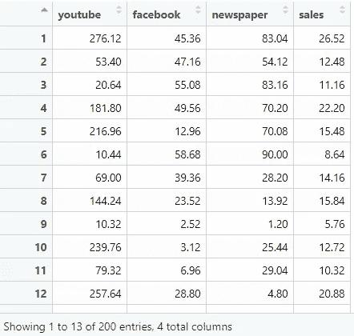
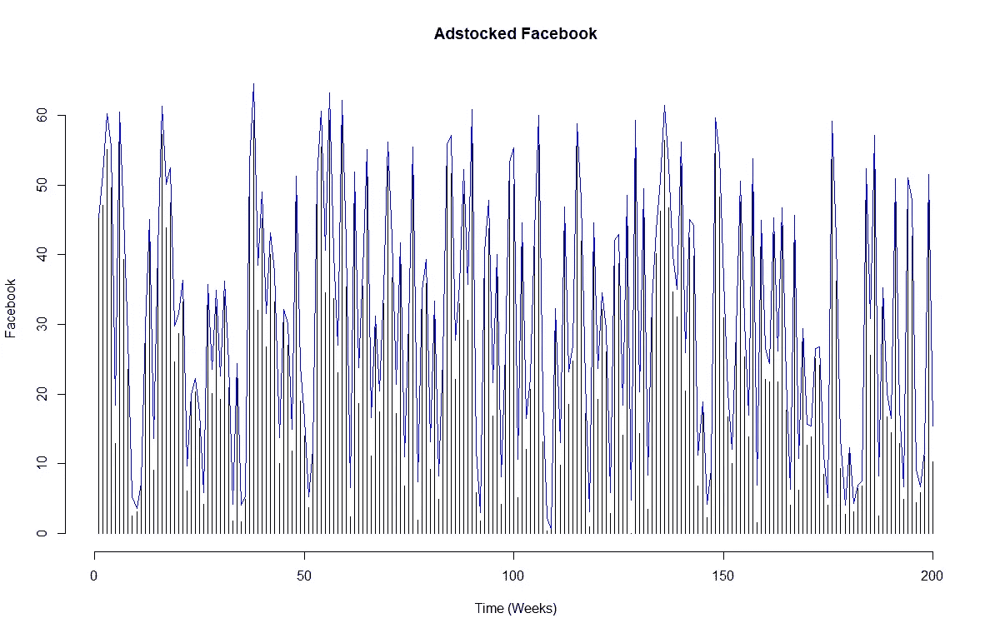
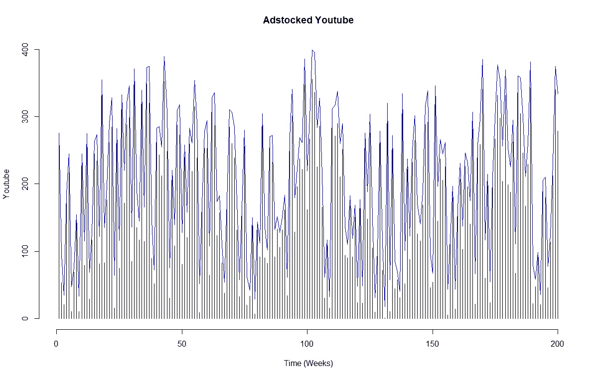
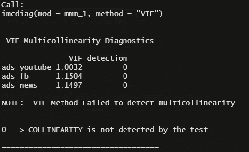
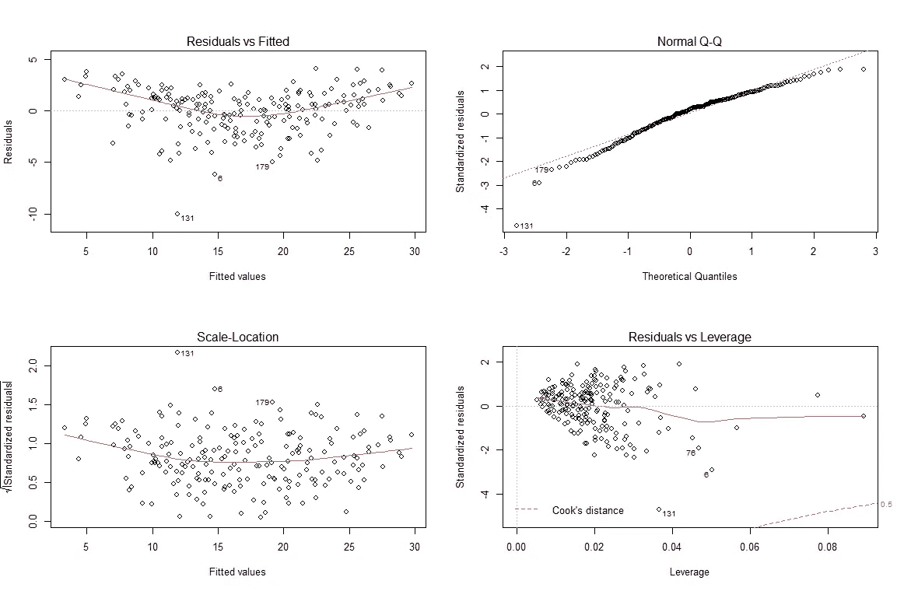
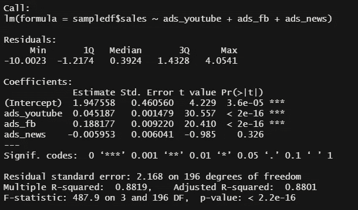
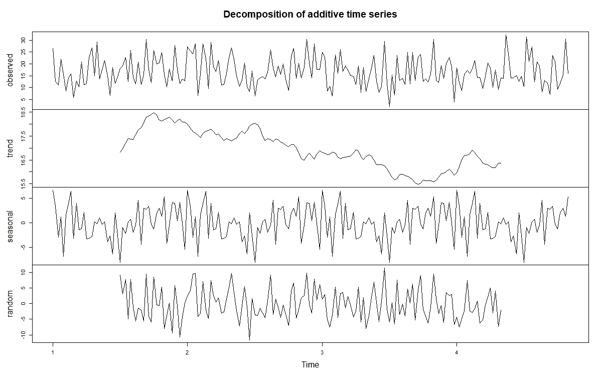
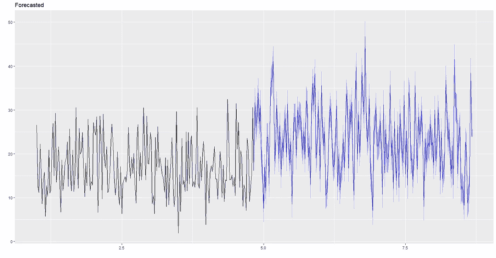

# 使用 R 建立一个简单的营销组合模型(MMM)并进行预测

> 原文：<https://towardsdatascience.com/building-a-marketing-mix-model-in-r-3a7004d21239>

# 使用 R 建立一个简单的营销组合模型(MMM)并进行预测

## 我们回顾了**营销组合建模(MMM)** 与**多点接触归因(MTA)** 之间的区别，然后我们继续在 R


在 [Unsplash](https://unsplash.com/collections/gxv0Zq6ydNo/pixel-world-domination?utm_source=unsplash&utm_medium=referral&utm_content=creditCopyText) 上由 [LekoArts](https://unsplash.com/@lekoarts?utm_source=unsplash&utm_medium=referral&utm_content=creditCopyText) 拍摄的照片

# TLDR

在之前的一篇文章中，我们讨论了[如何在分析或建模](/cleaning-and-preparing-marketing-data-in-r-prior-to-machine-learning-or-analysis-ec1a12079f1)之前使用 R 清理和准备杂乱的营销数据。在这里，我们将深入研究营销组合模型。具体来说，我们将了解:

*   营销组合建模概述
*   **营销组合模型**与**多接触归因**模型的区别。两者看似相似，但应用于非常不同的场景。也可以一起用！
*   使用 R 建立一个基本的营销组合模型
*   定义股票
*   解释营销组合模型的结果
*   做出预测和建议

就像在上一篇文章中一样，我用一个非常基本的例子以一种容易理解的方式写了这篇文章。R 代码已经被广泛地注释并一步一步地介绍，以帮助新的 R 用户尝试这种技术。

# 什么是营销组合模型，为什么有用

营销组合建模(MMM)是一种计量经济学方法，用于估计广告渠道对关键转化结果(如销售、客户激活、销售线索等)的影响。一个品牌可以使用不同类型的营销策略来提高对其产品的认知度并推动销售。例如:

*   使用电子邮件营销，用首次购买的折扣代码吸引新客户
*   通过付费媒体活动，如点击付费或 Youtube 上的数字显示广告
*   通过脸书这样的社交媒体
*   或者通过离线的传统户外媒体，如电视、印刷品或广播

这就是为什么它被称为营销“组合”,因为在任何给定的时间都有一个以上的渠道进行营销活动。不同渠道的营销预算会有所不同，每个渠道推动认知和销售的能力也会有所不同。

例如:作为一个渠道，电视黄金时段的广告很可能比展示广告贵得多。虽然社交媒体平台非常适合提高知名度和发展社区，但它并不总是被视为转化渠道，不像点击付费(PPC)那样直接，用户点击 PPC 广告的同一天就可以实现销售。显然，这些例子因品牌、行业或营销产品而异。

通过执行营销组合建模，品牌可以确定特定营销活动对销售等关键结果的影响程度。它可以用于估计给定渠道的投资回报，甚至可以用作优化支出和预测/基准未来绩效的规划工具。

# 营销组合建模(MMM)和多点接触归因(MTA)之间有什么区别

这些建模技术听起来相似，但它们适用于不同的场景。

营销组合建模
尽可能简单地解释一下:营销组合建模数据集通常包括预测因素，如每个渠道的支出，以及给定期间的销售或收入等结果变量。我们正试图根据我们关心的结果(在这种情况下是销售额，或总查询量，无论哪个都是品牌的关键转化 KPI)来建立每个渠道的支出之间的关系模型。这样，我们就能发现每个渠道对销售的影响，并利用这种关系来预测未来的销售额。

> 冒着过于简化的风险:它有助于回答“花费 *x* ，获得 *y* 类型的问题。它可以用来估计收益递减，了解投资回报率，并作为预算规划的一部分。

因此，在营销组合建模中普遍应用多元回归等回归方法也就不足为奇了。

同样值得注意的是，很难衡量电视、广播和印刷品等离线传统 OOH 媒体的表现(不像在线广告，我们可以获得点击量、点击率和印象等指标)。所以在这种情况下使用 spend。

**多点接触归因建模** 在多点接触归因中，我们承认客户旅程是复杂的，客户可能会在其旅程中遇到不止一个(甚至所有)我们的营销渠道活动。

客户的购买途径可能始于在网上看到展示广告→接触到社交媒体活动→后来在谷歌中进行关键词搜索→然后在登陆网站之前点击 PPC 广告，最终完成购买。

> 与 MMM 不同，在 MMM 中，我们倾向于查看支出的顶层视图，在多接触归因中，我们关心这些细微的**接触点**，因为它们都在促成最终销售中发挥作用。

我们根据这些渠道的接触点为其分配*权重*，而不是花费，以确定每个渠道对销售的贡献/参与。

根据我们对每个接触点的评估，权重会有所不同。有几种归因模型可用于确定权重。比较常见的有:

**最后点击属性:**这将 100%的权重分配给最后点击的频道。所以在上面的例子中，PPC 将得到所有的信用。在此之前，任何频道都不会获得任何积分。这是大多数分析平台使用的默认模型。这是最容易解释的加权，因为它只说“*”这个渠道是用户在购买前遇到的最后一个渠道，因此它是最重要的，因为它是推动最终决策的渠道。*“Google Analytics 使用这种方法已经很多年了，直到最近数据驱动归因在 [Google Analytics 4](https://support.google.com/analytics/answer/10596866#data-driven&zippy=%2Cin-this-article) 中广泛使用。

**首次点击归属:**这与上次点击归属相反。这里，我们将 100%的权重分配给第一个通道。使用上面的例子，这将是显示广告。这种方法的论据通常是"*如果显示器不是第一个通道，后续的接触点无论如何都不会发生，所以第一个通道是最重要的。*”

第一次和最后一次点击的问题是，他们忽略了其他渠道发挥的贡献。他们太简单了。

然后我们有这样的模型:

**时间衰减:**根据转换前每个通道的新近度分配权重。转换前的最后一个通道(PPC)将获得最大的权重。最小权重被分配给第一通道。

**基于位置的**:第一个和最后一个通道各获得 40%的权重，剩余的 20%平均分配给中间的通道。

**数据驱动归因(DDA)** :这可能是最好的方法(与第一、最后、时间衰减和基于位置的方法相比)，因为它不是使用预先确定的规则来分配权重，而是在给定接触点的情况下，通过基于转换概率的算法客观地分配权重。像马尔可夫链这样的方法，使用 Shapley 值的博弈论方法[在像 Google Search Ads 360 这样的媒体平台中使用](https://support.google.com/analytics/answer/3191594?hl=en#algorithm&zippy=%2Cin-this-article)，甚至像 Random Forest 这样的集成方法都可以在 DDA 中使用。

在大多数分析平台，如 [Google Analytics](https://support.google.com/analytics/answer/1662518?hl=en) 中，将这些模型应用于多点触摸归因非常简单，只需点击并选择您想要的模型，然后在您的报告中使用即可。

> 但是请注意，对于多点触摸属性，频道需要能够报告点击、点击率、印象等指标，以便可以有效地测量触摸点及其序列。这意味着多点触摸属性非常适合数字渠道。衡量收音机的“点击率”这样的指标几乎是不可能的。

我们可以一起使用吗？
是的 MMM 和 MTA 可以用来互补。MMM 可用于在线和线下营销活动支出效果的顶层视图，然后 MTA 可用于深入了解在线渠道，以获得更深入的见解。

# 使用 R 建立一个基本的营销组合模型

这篇文章的范围是提供一个简单的例子，在 r。

> 👉**重要！**你需要确保你的营销数据集是干净的，包括每期的渠道支出(最好是每周)和每周的销售额。关于如何在 R 中执行建模之前清理和准备营销数据的指南，请看我以前的文章[这里](/cleaning-and-preparing-marketing-data-in-r-prior-to-machine-learning-or-analysis-ec1a12079f1)。

在本例中，我们将使用已经在 r 中的 [datarium 包](https://rdocumentation.org/packages/datarium/versions/0.1.0)中提供的示例营销数据集。首先安装它，然后让我们加载它并查看一下:

这是一个有 200 个观察值(行)的数据框架，有 4 个变量(Youtube、脸书、报纸和销售)，都是数字，以千计的**。支出以 s 为单位，销售额以售出的单位数为单位。出于这个练习的目的，我们假设这些是过去 200 周脸书、Youtube 和报纸的营销支出。**

****

**图片作者自己的**

****检查相关性****

**使用[图表。PerformanceAnalytics 包中的 Correlation()](https://www.rdocumentation.org/packages/PerformanceAnalytics/versions/2.0.4/topics/chart.Correlation) 函数，让我们在一个漂亮的图表中可视化变量之间的相关性:**

****

**图片作者自己的**

**Youtube 与销售呈正相关——显著性高，相关性强(0.78)。脸书也与销售有积极的关系，这是显着的，但关系是中等的(0.58)。报纸，与销售有积极的关系，虽然这是相当小的(0.23)。**

****定义存货****

**在营销组合建模中，我们估计随着时间的推移，广告的效果会变得不那么有影响力。Adstock 理论(布罗德本特，1979 年)认为，当广告最近被观看时，广告产品的知名度最高。当广告曝光减少时，认知度最终会下降。**

**类似于前面讨论的时间衰减多点触摸属性，adstock 被表示为衰减模型，其值在 0 和 1 之间，0 表示最低意识，1 表示 100%意识。注意典型的 adstock 变换假设了一个无限的衰减，Gabriel Mohanna 在他的文章[中清楚地解释了为什么这并不总是现实的。](https://analyticsartist.wordpress.com/2014/02/26/advertising-adstock-with-maximum-period-decay/)**

**要计算信道的 adstock，您需要 adstock rate。大多数 MMM 建模由代理方完成，可以访问 adstock 基准，这些基准可以简单地应用。电视上有影响力的创意广告更令人难忘，因此与在线 PPC 广告相比(例如 0.1 甚至 0！)通常只是文本，本质上是静态的。**

**在我们的 youtube、脸书和报纸的示例数据集中，我们将假设脸书的活动通常是简单的文本帖子，Youtube 上的广告是动画显示横幅，报纸上的广告是彩色的半页创意接管。因此，脸书将拥有最低的 adstock 率(0.1)，我们假设报纸收购的 adstock 率为 0.25。**

**应用 Gabriel 对 adstock 变换的建议，我们得到下面的结果。**

**👉**提示**:别忘了卸载 dyplr 和 tidyr，这样它们就不会弄乱下面的 [filter()](https://www.rdocumentation.org/packages/stats/versions/3.6.2/topics/filter) 函数。或者，明确指定 stats::filter()，以便避免 dplyr 版本的。在 dplyr::filter()中， *x* 需要作为 tible/data frame。**

****

**图片作者自己的**

****

**图片作者自己的**

****

**图片作者自己的**

****使用多元回归建立营销组合模型，检查多重共线性和异方差****

**以销售额为因变量，我们现在可以用 Youtube、脸书和报纸的广告库存值建立一个多元回归 MMM 模型。**

**我们将把它放入 [lm()](https://www.rdocumentation.org/packages/stats/versions/3.6.2/topics/lm) 函数中。然后我们使用 mctest 包中的 [imcdiag()](https://www.rdocumentation.org/packages/mctest/versions/1.3.1/topics/imcdiag) 函数应用 VIFs(方差膨胀因子)来检查多重共线性，最后我们执行一个测试来检查异方差性。**

****多重共线性和异方差问题****

*   **👎多重共线性是有问题的，特别是在回归中，因为它会在系数估计中产生大量的方差，并且它们对模型中的微小变化非常敏感，从而使模型不稳定。**
*   **👎异方差也是有问题的，尤其是在线性回归中，因为这种回归假设模型中的随机变量在最佳拟合线周围具有相等的方差，换句话说，残差中不应有**异方差**。相对于因变量的拟合值，残差的方差不应有任何明显的模式。**
*   **👎异方差的存在是估计值不可信的标志。该模型可能会生成不准确的 *t-* 统计数据和 *p* 值，并可能导致非常怪异的预测。**

**简而言之，多重共线性和异方差的存在会使我们的模型不准确和不可用。**

**在之前应用的 VIF 方法中没有检测到多重共线性——很好🤗！**

****

**图片作者自己的**

**异方差可以通过“眼球运动”来检查👀情节:**

****

**图片作者自己的**

**我们对左边的两张图最感兴趣。如果完全没有异方差，红线将是完全平坦的，在 x 轴上应该有随机和相等的分布点。在我们的残差和拟合图中，如果你仔细观察，在 0 处有一条虚线，表示残值= 0。我们的红线稍有弯曲，但不会偏离虚线太多。残差中似乎也没有明显的模式。这很好。
对于比例-位置图也是如此，我们希望红线尽可能平坦，散点图中的点没有明显的图案。似乎是这样的。**

**更客观的方法是使用来自 lmtest 包的 [bptest()](https://www.rdocumentation.org/packages/lmtest/versions/0.9-39/topics/bptest) 和来自 car 包的 [ncvtest()](https://www.rdocumentation.org/packages/car/versions/3.0-12/topics/ncvTest) 来使用 Breusch Pagan 测试。两种测试都检查异方差性。**

**H *₀* 表示模型中的方差是同方差的。**

****

**图片作者自己的**

**由于我们的*p*-值来自布鲁希帕甘和 NCV 测试，返回的值高于 0.05 的显著性水平，我们不能拒绝零假设(耶！)🙌。因此，我们可以说在我们的模型中不存在异方差的主要问题:**

****解释我们第一个模型的总结结果****

****

**图片作者自己的**

**我们来解读一下模型的总结结果:**

**观察系数估计值，回想一下数字**都在 1000 左右** — *是的，我也不得不提醒自己！*🤦‍♂(渠道预算以 s 为单位，销售额以售出的数量为单位)**

*   **在 Youtube 上每花 1000 英镑，我们可以预计销售额会增加 45 (0.045*1000)单位。在脸书上每花 1000 英镑，我们可以预期销售会增加 188 (0.188 * 1000)个单位。每在报纸上花费 1000 英镑，我们可以预期 ***的销售额会减少***6(0.006 * 1000)个单位，尽管这并不显著。**
*   **t 统计表明我们是否可以对我们的特征(渠道)和因变量(销售额)之间的关系有信心。Youtube 和脸书的高(> [1.96](https://stats.stackexchange.com/a/404590) ) *t* )统计值以及它们在统计上的显著性*p*-值意味着我们可以对它们系数的精确度有信心。对报纸来说不算多——但这多少有些道理，因为很难准确地将报纸广告的销售归因于此(除非创意中包含一个特殊的 url 或二维码，这有助于更好地收集数据)。**
*   **R 表示拟合度，即模型与数据的拟合程度。0.88 的 R 表示该模型可以用 88%的数据来解释。**

**还不错！😸让我们看看能否在下面的下一次迭代中做得更好。**

****将趋势和季节性纳入模型** 我们可以将趋势和季节性作为附加特征添加到模型中。**

**请注意，我们的数据是每周一次的，因此频率被设置为 52(尽管这在闰年会很棘手)。我们还需要最少 2 个周期(52 x 2 = 104 周)，我们的数据包含过去 200 周的观察结果，因此这应该足够了。**

**为了给 lm()添加一个基本的线性销售趋势，我们可以使用 [seq_along()](https://www.rdocumentation.org/packages/base/versions/3.6.2/topics/seq) 来生成一个序列整数的向量:**

```
basic_trend <- seq_along(sampledf$sales)
```

**一个更好的方法是使用 [tslm()](https://www.rdocumentation.org/packages/forecast/versions/8.16/topics/tslm) 函数，它很大程度上只是 lm()的一个 timeseries 包装器，工作方式基本相同，只是它允许在模型中包含“趋势”和“季节”。我们只需要调用“趋势”和“季节”, tslm()就能够自动为我们生成这些内容。**

**一旦创建了时间序列，我们使用 [decompose()](https://www.rdocumentation.org/packages/forecast/versions/3.14/topics/decompose) 来绘制单个组件，如趋势、季节性等。这一点在下文中有所体现:**

****

**图片作者自己的**

**有趣的是，销售似乎有普遍下降的趋势。观察季节性垂直轴的较小范围，我们可以看到，与趋势等其他成分相比，每周的季节性影响相当小。**

**现在让我们来拟合我们的营销组合模型，这次使用 tslm()而不是 lm()，并包括趋势和季节性，看看我们是否可以改进该模型。**

****

**图片作者自己的**

**是的，这款车型略有改进！**

**Youtube 和脸书的系数估计值变化非常小，*t*-统计值仍然很高(超过 2)，具有统计显著性*p*-值，这意味着我们可以对我们的推断保持信心(💡再次提醒我们自己**数字在 1000 左右！！**)也就是说，在 Youtube 上每花费 1000 英镑，我们可以预期销售额会增加 45 (0.045*1000)单位。在脸书上每花 1000 英镑，我们可以预期销售会增加 185 (0.185 * 1000)个单位。**

**请注意，tslm()使用了针对季节性的虚拟变量，第 1 周没有包括在内，这是因为第 1 周被用作与我们的季节性系数估计值进行比较的[，这使我们可以这样解释:与第 1 周相比，第 2 周的销售额减少了 2，430 (2.43*1000)个单位。与第 1 周相比，第 3 周的销量减少了 3，840 (3.84*1000)台。诸如此类。](https://otexts.com/fpp2/useful-predictors.html)**

**季节性的大多数系数估计没有得到足够大的 t 统计量(大于 2)，p 值也不显著。只有第 23 周和第 27 周的 t 统计值高于 2，具有非常显著的 p 值，两者都表示与第 1 周相比，销售额*下降*。**

**模型的拟合优度也略有提高，从以前模型的 0.88 提高到目前模型的 0.89。**

****其他注意事项****

**然而，总体而言，这方面的结果并不乐观。销售额总体上呈下降趋势。我们知道，Youtube 和脸书似乎带来了不错的回报，但报纸并非如此。也许下次我们可以试着减少报纸广告？**

****预测****

**让我们想象我们已经展示了这些早期的发现。客户意识到模型不是 100%完美的，这是一个持续改进的项目。
如果广告预算和渠道没有变化，并且我们假设下一阶段的趋势和季节性保持相似，使用我们的模型，我们预计表现如下:**

****

**图片作者自己的**

**但是，如果客户接受我们的建议，撤回报纸广告，并将其重新分配为 Youtube 和脸书的额外预算:40%分配给 Youtube，60%分配给脸书(这是在他们当前预算的基础上应用的，我们将假设他们的预算与以前相同)，使用该模型，销售业绩预测如下:**

****

**图片作者自己的**

**将两张图表叠加在一起，似乎从报纸到 Youtube 和脸书的预算重新分配可能会提高销售业绩🤑🤑！**

****

**图片作者自己的**

**需要指出的另一点是，通过数字渠道，我们可以几乎实时或至少每天跟踪当前的运行率与预测，这意味着实验、广告测试、改变方向(如果我们需要)，性能监控和优化可以无缝完成。**

**要从模型中获得[拟合值](#https://otexts.com/fpp3/residuals.html)，只需调用:**

```
forecast_new_spends$fitted
```

****更进一步****

**这里显然还有其他因素没有包括在内，这些因素也可能影响模型的有效性。例如，我们只回顾了 3 个渠道，我们是否错过了其他营销活动？我们没有包括其他变量，如天气或是否打折，也许我们还应该包括特定周是否有假期。考虑探索其他频率选项，如每季度或每月。**

**我们还可能希望考虑其他模型，并将其与我们在此使用的简单多元回归方法进行比较。**

**由于这篇文章已经很长了，而且时间不够，这一次我还不能涵盖训练和测试模型的过程。如果时间允许的话，也许我们可以在以后的文章中讨论这个问题以及与其他模型的比较。！🐱‍🏍**

# ****结局****

**感谢你读到这里，如果有我遗漏的地方，或者有更好的方法来解决我之前讨论的问题，请在评论中分享。一起学习真好:)**

# ****全 R 码****

**👉从我的 Github repo [这里](https://github.com/Practical-ML/marketing-mix-modelling/blob/main/simple-marketing-mix-modelling-in-r.R)获取完整的 R 代码。**

# **参考**

**南布罗德本特，1979 年。电视广告起作用的一种方式，市场研究学会杂志，第 23 卷第 3 期。**

**这篇文章中使用的营销数据样本来自根据 GPL-2 通用公共许可证[授权的 R 的 Datarium 包 https://www . rdocumentation . org/packages/Datarium/versions/0 . 1 . 0](https://www.rdocumentation.org/packages/datarium/versions/0.1.0)**

**r 是一个免费的开源统计软件[https://www.r-project.org/](https://www.r-project.org/)**