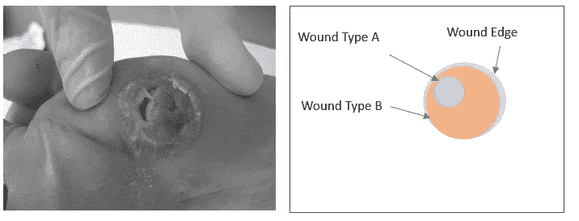
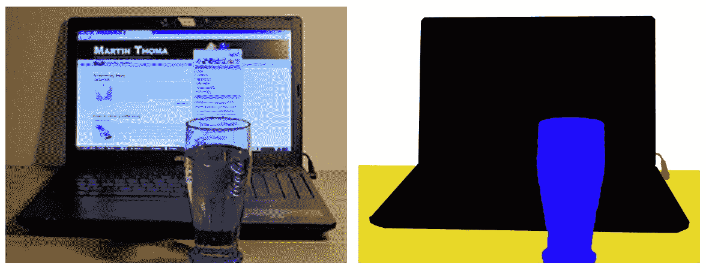
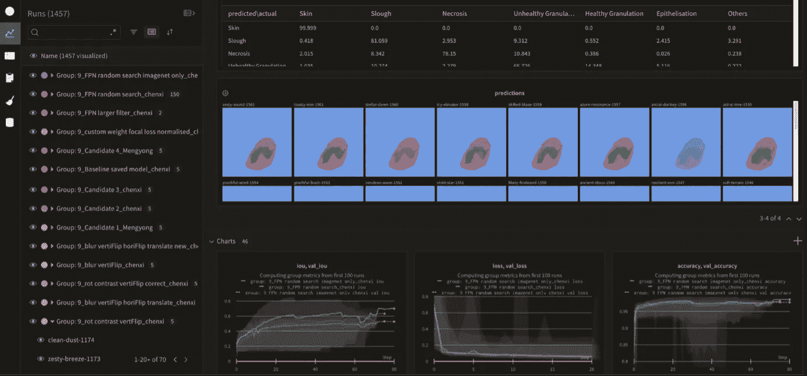

# 构建一个语义分割的计算机视觉算法部署在边缘

> 原文：<https://towardsdatascience.com/building-a-semantics-segmentation-computer-vision-algorithm-for-deployment-on-the-edge-3ad1a8922fd1>

# 构建一个语义分割的计算机视觉算法部署在边缘

## 生产计算机视觉项目中的技术挑战和学习

[照片](https://unsplash.com/photos/c6rgP7K5rXc)由美国国家癌症研究所通过 Unsplash 提供

作者:[陈](https://www.linkedin.com/in/chen-xi-76869213a/)，[李](https://www.linkedin.com/in/mylee1/)，[雅道](https://www.linkedin.com/in/santosh-yadaw-b32025111/)

在本文中，我们将讨论在**边缘设备上**部署语义分割**算法的挑战和技术。**特别是，我们将介绍在我们的项目中面临的技术挑战，这是一个部署在 iOS 设备上的自动伤口分割模型。

我们将首先简要介绍项目背景，然后介绍我们面临的技术挑战以及克服这些挑战的方法。

**技术挑战 1 —小且不平衡的数据集**

1.  数据扩充
2.  迁移学习
3.  选择正确的指标
4.  定制损失函数

**技术挑战 2—边缘部署**

1.  性能与尺寸的权衡
2.  量子化

**技术挑战 3——创建灵活的再培训渠道**

1.  实验跟踪— WandB
2.  配置管理—九头蛇
3.  超参数搜索—贝叶斯优化

# 项目背景

今天，世界上大约有 10%的成年人患有糖尿病。在所有患有糖尿病的成年人中，25%的人将在其一生中发展为糖尿病足溃疡。如果不加以控制，糖尿病足溃疡可能恶化，导致组织和骨骼的严重损伤，这可能需要手术切除(截肢)脚趾、脚或腿的一部分。今天，85%的主要截肢手术之前都有糖尿病足溃疡。通过适当的伤口护理和干预，可以预防和治愈糖尿病足溃疡。

目前，糖尿病足溃疡的评估是由熟练的医生手工完成的。怀疑他/她患有糖尿病足溃疡的患者将不得不前往医院，在那里熟练的医生将观察伤口并手动测量和分类伤口。该过程不仅耗时，而且由于是手动过程，也可能不完全准确。此外，当使用尺子和探针测量伤口时，患者可能不得不承受疼痛和感染的风险。

图 1:糖尿病伤口的人工伤口评估。这个过程通常由护士在糖尿病伤口上的描图纸上完成。图片参考:[https://commons . wikimedia . org/wiki/File:Diabetic _ Wound _ 121 . jpg](https://commons.wikimedia.org/wiki/File:Diabetic_Wound_121.jpg)

# 技术—语义分割

在这个问题中使用的计算机视觉技术被称为语义分割。这种技术通常用于自主导航。分割被认为是计算机视觉领域中最困难的任务之一，因为它必须根据类别对图像的每个像素进行分类。对我们来说幸运的是，在过去的几年里，这个领域已经有了令人难以置信的研究。在 PASCAL VOC 语义分割基准测试中，([https://papers with code . com/sota/semantic-segmentation-on-PASCAL-VOC-2012](https://paperswithcode.com/sota/semantic-segmentation-on-pascal-voc-2012))，我们可以找到许多对街道图像和物体相当准确的开源模型。虽然我们可以尝试许多开源语义分割模型，但没有一个模型是在与我们相似的图像(医学图像)上训练的。

**图 2** :语义分割的例子，图像的每一个像素都根据其类别进行分类。图片参考:[https://commons . wikimedia . org/wiki/File:Image-segmentation-example-segmented . png](https://commons.wikimedia.org/wiki/File:Image-segmentation-example-segmented.png)

# 技术挑战

在这个项目中。我们必须解决众多的技术挑战，即 **1 号。小而不平衡的数据集**， **2。边缘展开**和 **3。创建灵活的再培训渠道**。在本文接下来的部分中，我们将详细讨论这些挑战以及我们如何克服它们。

# 技术挑战 1 —小且不平衡的数据集

我们面临的第一个技术挑战是拥有一个**小**数据集，这个数据集**不平衡**。在医学领域，数据收集和注释非常昂贵。在数据收集方面，由于数据(个人数据)的敏感性，网上很少有糖尿病足溃疡的图像，收集这些图像通常需要用户许可。在数据注释上，伤口的识别通常由熟练的医生来完成。数据必须在图像注释工具(例如 CVAT)上手动注释，并由医生检查一致性。

幸运的是，我们与一家客户公司合作，该公司了解数据对人工智能项目的重要性。我们的客户与新加坡的多家医院和疗养院合作，收集糖尿病足溃疡的图像，甚至从该地区的其他医院购买数据。为了标注数据，该公司组建了一个标注工作组，由医生和训练有素的专业人员组成，他们以高度的一致性标注图像。

即使我们的客户付出了巨大的努力，与通常用于训练语义分割算法的数据集相比，数据集的大小仍然很小。此外，我们还面临着不平衡的数据集问题。在收集的所有伤口图像中，图像中超过 90%的像素是皮肤或背景图像。剩余的伤口像素被不均匀地分成 7 个以上的伤口类别，每个伤口类别约占所有像素计数的 0.2%至 2.7%。

我们将讨论一些克服小数据和不平衡数据挑战的方法。

# 1.数据扩充

克服小数据量挑战的第一个策略是通过扩充来人为增加数据集的大小。数据扩充是一种通过对现有数据执行几何(旋转、翻转、裁剪)和光度(改变对比度、亮度、模糊等)变换来人工增加训练数据集的大小和多样性的技术。这有助于打击过度拟合，从而使我们的模型更好地推广。

**图 3:** 数据增强技术。

我们还**使用增强来绕过数据的其他特定限制** t。我们创造性地增强的一个例子是肤色。由于数据图像是从新加坡医院收集的，大多数糖尿病伤口图像来自亚洲患者，并且不包含许多具有不同肤色的图像。这降低了该模型对不同肤色患者的性能。为了克服这个问题，我们创建了增强功能，专门改变图像的肤色，以产生更大的图像多样性，并创建一个更公平的人工智能模型。

# 2.迁移学习

我们用来克服小数据集的第二个策略是使用迁移学习，即使用预先训练的模型参数来初始化我们要训练的模型的参数。这样做使我们能够利用使用更大数据集训练的预训练较低级特征，并从我们自己的数据集学习较高级特征。这不仅加快了训练时间，而且有助于在性能下降最小的情况下克服小数据集的问题。

然而，必须注意的是，迁移学习只有在用于训练预训练参数的数据集与我们的数据集有些相似时才有效，从而允许学习的低级特征可转移到学习我们自己的数据集中的高级特征。为了达到最佳的迁移学习效果，我们实验了**冻结不同层的权重**和**定制不同层的不同学习速率**。对于我们的情况，我们的模型在使用预先训练的权重进行训练时比从头开始训练时表现得相对更好。

# 3.选择正确的指标

由于超过 90%的像素是皮肤/背景类，使用简单的度量标准，如准确度，仅仅通过将所有像素分类为皮肤/背景类，将给出不合理的高数字。此外，出于医学诊断的目的，在确定糖尿病足溃疡的严重程度时，一些伤口类别比其他类别更重要。为了解决这个问题，我们使用了**特定于类的加权指标**，比如 IOU 和 F1，来确定模型的准确性。

**与客户**讨论业绩指标至关重要。不同的利益相关者带来了不同的观点。例如，虽然管理团队要求模型在低于特定延迟的情况下运行，但医疗顾问更喜欢模型为几个伤口类别提供更高的优先级，工程师需要模型低于特定的文件大小，以便将整个应用程序放入 iOS 应用程序商店。最终，我们确定了一组度量标准，其中包括特定于类的加权度量标准，如 IOU 和 F1，以及与量化模型的推理速度和文件大小相关的度量标准。

# 4.定制损失函数

诸如交叉熵损失的标准损失函数使模型训练期间的总体预测误差最小化。但是，在不平衡数据集的情况下，交叉熵损失通常更重视多数类。理想情况下，我们希望有一个**损失函数，它更加强调少数职业**，同时我们也可以**灵活地改变它的性能**，以优化某一个创伤职业。尝试的一些损失函数包括分类病灶损失、病灶 Tversky 损失、敏感性特异性损失和具有定制权重的稀疏分类病灶损失。我们最终得到了一个焦点损失的变体，它对某些少数类的错误分类加重了模型的惩罚。

通过对损失函数的实验，我们能够大幅提高对更小但更重要的伤口类别的预测精度。

# 技术挑战 2 —边缘部署

克服了小型和不平衡数据集的问题后，等待我们的下一个挑战是边缘部署。对于用于医疗诊断的模型，该模型必须由医疗保健法定委员会监管和批准。此外，由于伤口图像是个人数据，所有图像在部署期间必须保存在本地。这两个因素使得云部署不太可能，并将我们推向了边缘部署。

# 1.性能与尺寸的权衡

边缘部署的特征之一是对模型大小的限制。因为我们的模型需要部署在 iOS 的应用程序中，所以模型的大小必须足够小，以便可以托管在苹果应用程序商店中。

通常，人工智能模型的性能与模型的大小直接相关；尺寸越大，越准确。PASCAL VOC 性能基准测试中的大多数先进算法都太大，无法安装在边缘设备上。因此，我们必须变得有创造性，以实现良好的性能与尺寸的权衡。

为了在实现良好性能的同时减小模型的尺寸，我们**将最先进模型的主干**换成了更小、更适合移动的主干，如 MobileNet 或 EfficientNet。从那里，我们能够**调整阿尔法**——网络的宽度，以减少我们的模型的大小。之后，我们执行量化和修剪，以进一步减少模型的大小，我们将在下一节讨论。

# 2.量子化

量化是一种转换技术，可以减少模型大小，同时改善 CPU 和硬件加速器延迟。大多数深度学习框架，如 Tensorflow，本身就支持量化，在 Tensorflow 中量化模型非常简单。量化的挑战在于**选择正确的量化技术**，它可以在给定硬件的情况下产生最快的推理速度，同时保持其准确性。

我们试验了许多量化技术，从量化感知训练到训练后量化，再到动态范围、全整数和浮点 16 量化。我们从实验中学到的是，量化理论可能不总是与实际部署观察完全一致。例如，虽然 int8 量化应该在装有机器学习加速器芯片的 iPhone 上产生最快的推理速度，但当我们部署到 iPhone 12 时，它的执行速度没有 float16 量化快。此外，修剪等技术并不适用于所有架构，使用权重聚类只会减少压缩后的模型大小，而不会减少 TensorFlow Lite 模型大小，因此它对我们的用例没有用处。

# 技术挑战 3 —创建灵活的再培训渠道

除了生成一个表现相当好的模型之外，我们还需要建立一个保留管道，这样我们的客户就可以在初始部署之后持续收集更多的数据并改进模型。因此，我们的首要任务之一是让源代码易于阅读，被适当地记录，并且实验能够高效且易于跟踪。为了实现这一点，我们实现了一些工具。

# 1.实验跟踪— WandB

我们发现在进行深度学习项目时，拥有一个**实验跟踪平台**非常有用。在我们的案例中，我们选择了 WandB，因为它具有视觉吸引力，易于使用，并且有一个免费版本，我们可以在项目结束后交给我们的客户。鉴于我们必须调整的参数数量很大，在整个项目过程中，我们进行了一千多次实验。如果没有实验跟踪平台，就不可能跟踪我们已经进行的实验，也不可能比较不同的实验。

**图 5**:WandB 上的实验跟踪。图像取自项目的 WandB 实例。

# 2.配置管理—九头蛇

深度学习项目中的可配置参数数量巨大。在训练管道的几乎每个部分都有可配置的参数，从数据管道到扩充、模型架构、损失函数，一直到细节，例如调整耐心以尽早停止。为了管理大量的参数，我们让所有的配置远离源代码，以提高效率和减少错误。

我们组织配置的方式是使用 **Hydra** 库。Hydra 是一个用于优雅地配置复杂应用程序的框架。它允许我们**轻松地换入和改变配置**。例如，当我们尝试不同的损失函数时，我们简单地将每个损失函数保存在一个配置文件中，当我们尝试不同的损失函数时，就换出一个配置文件。

# 3.超参数搜索—贝叶斯优化

最后，深度学习实验需要在许多参数的大型搜索空间中迭代，每个参数的大小不同。事实证明，网格搜索在这方面效率相当低。贝叶斯优化使用贝叶斯定理来指导搜索，以便找到目标函数的最小值或最大值。这让我们能够**用更少的运行次数**搜索更大的参数空间，这极大地加快了我们的实验速度。

# 结论

经过半年多的代码库构建和紧张的实验，我们能够创建一个相当准确的语义分割模型，能够对糖尿病足溃疡图像进行分类和分割。

在接下来的几个月里，客户公司将部署该模型进行测试。随着实际部署，他们将能够在反馈循环中收集更多数据，并不断提高数据质量和数量，不断改进模型。有了这个，我们希望这个算法将有助于改善和拯救生命。

我们要感谢 [AI Singapore](https://aisingapore.org/) ，我们的项目经理和导师给了我们这个参与这个项目的机会。在所有关键的收获和经验教训中，我们认为决定人工智能项目成功的最重要因素是管理层的支持和领导。因此，我们真诚地感谢客户公司对我们的支持和信任，使这个项目成为可能。

感谢您抽出时间阅读。我们祝你的人工智能项目一切顺利！

人工智能工程师:[陈](https://www.linkedin.com/in/chen-xi-76869213a/)，[李](https://www.linkedin.com/in/mylee1/)，[桑托什亚道](https://www.linkedin.com/in/santosh-yadaw-b32025111/)

项目技术导师::潘·蜀汉·达里尔，[张俊彦](https://www.linkedin.com/in/teojunyean/)

项目经理:[杨迪强](https://www.linkedin.com/in/diqiang/)，吴金福

# 关于作者

**陈—** 陈毕业于新加坡国立大学，获得统计学学位。他一直热衷于数字，并很高兴能够将他的技术能力应用于人工智能解决方案。

**孟勇·李—** 孟勇毕业于新加坡管理大学，获得人工智能专业硕士学位。今天，孟勇建立了可扩展的生产 ML 系统，专注于计算机视觉。他对人工智能的应用方面最感兴趣。

**Santosh Yadaw —** Santosh 毕业于南洋理工大学，获得物理学学位。在加入 AI 新加坡的学徒计划之前，他在一个政府法定委员会担任高级工程师，管理复杂的国防项目。Santosh 本质上是一名修补工程师，热衷于构建可持续的人工智能应用程序，以帮助带来积极而有意义的影响。