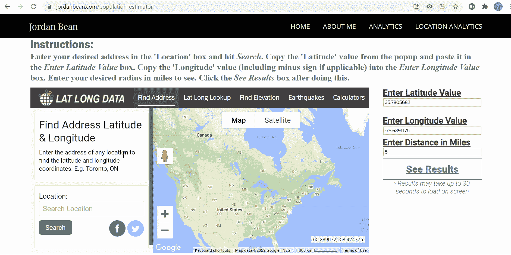
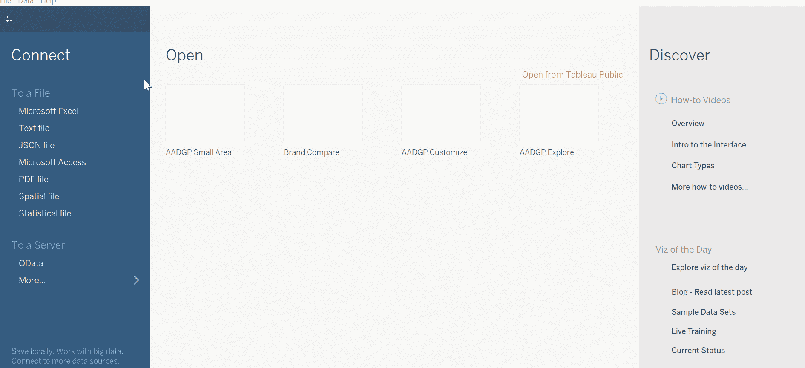
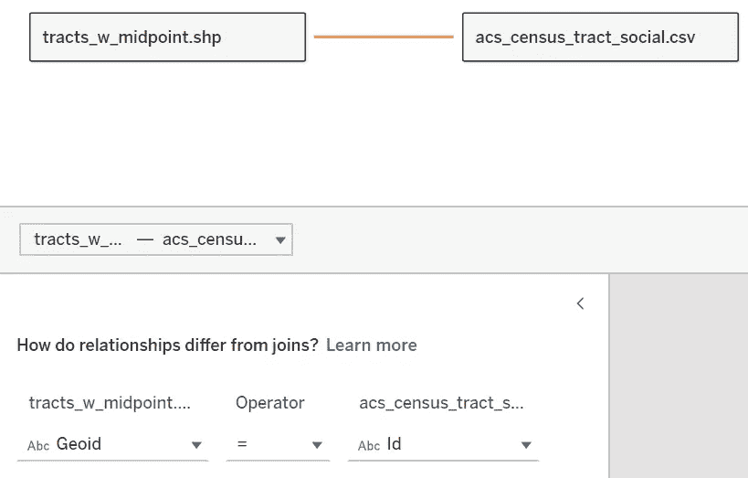
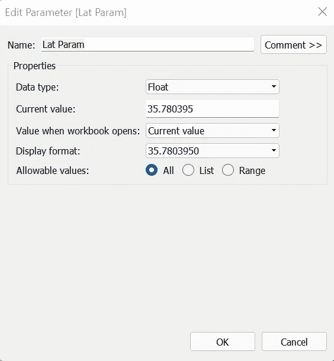
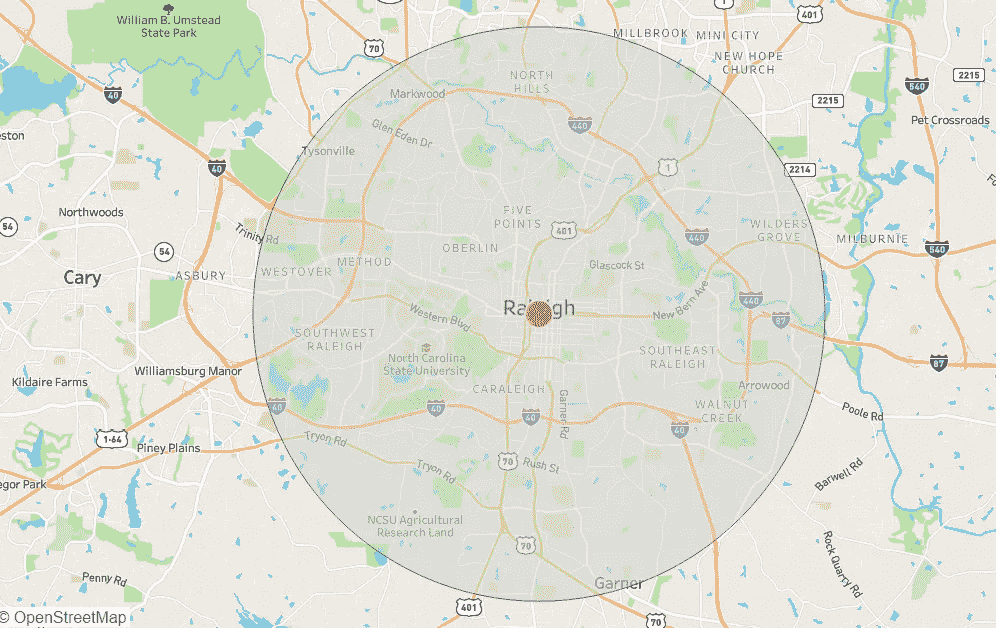
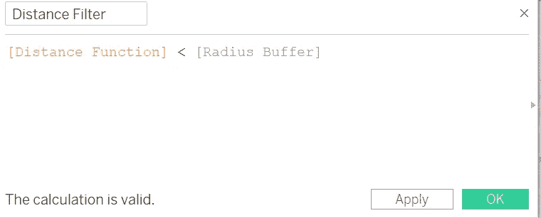
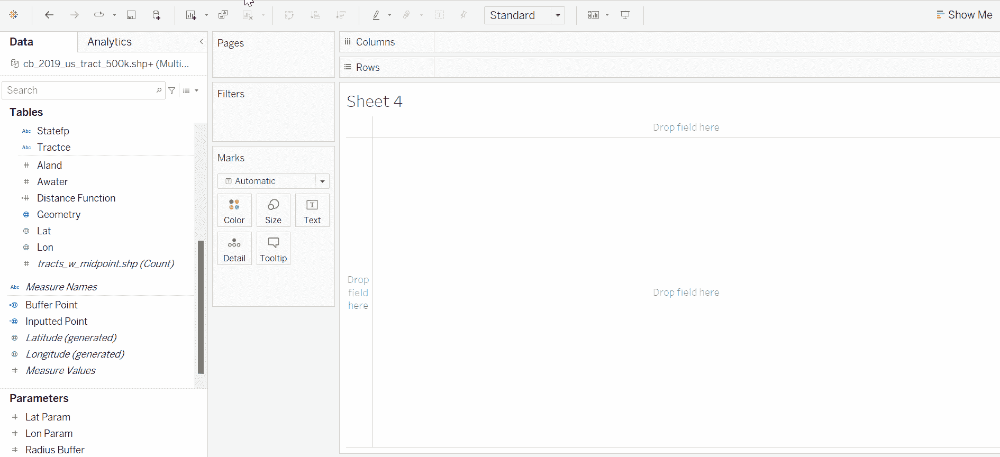
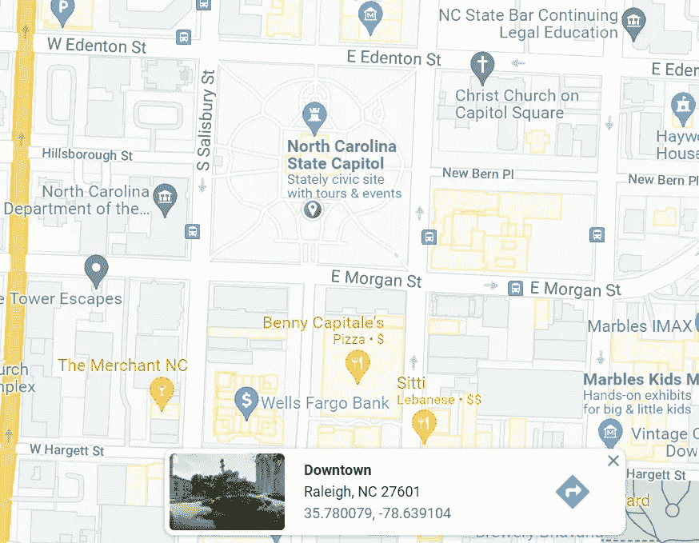
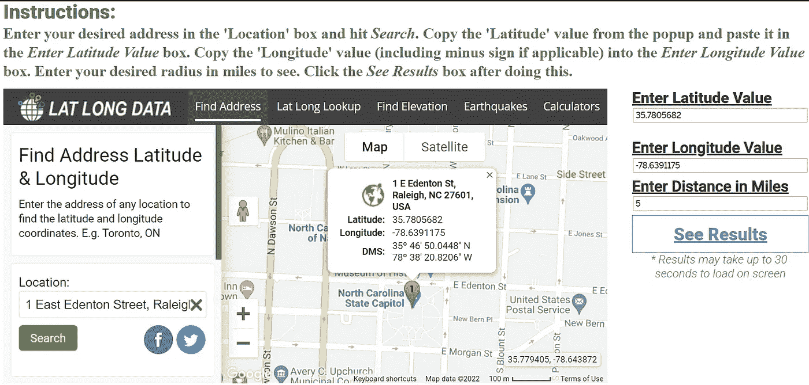

# 构建一个工具来估计周围地区的人口

> 原文：<https://towardsdatascience.com/building-a-tool-to-estimate-surrounding-area-population-c7d77263468a>

# 构建一个工具来估计周围地区的人口

## 一步一步的指南，建立一个免费的周围人口估计工具(加上[访问一个已经建成的](http://www.jordanbean.com/population-estimator)！)


克里斯多夫·伯恩斯在 [Unsplash](https://unsplash.com?utm_source=medium&utm_medium=referral) 上拍摄的照片

人口统计——尤其是人们居住的地方——是许多选址决策的重要工具。有多少 25 岁或 25 岁以上的人住在你想开餐馆的地方(现有市场)？你要建仓库的地方周围住了多少人(可用工人)？

解决此类问题的数据分析师可能会发现自己不得不使用复杂的数据集或学习曲线陡峭的工具来获取和加载适当的数据，计算复杂的方程，并以直观易懂的方式输出数据。许多工具将给出城市周围区域的人口，有些工具给出精确点的估计值。**即使你得到了一个数字，你知道并理解给你这个数字的基本数据和方法吗？你能向别人解释吗？**

遵循下面的步骤，看看如何自己构建一个人口估计工具——理解数据和计算——或者[随意使用我组装的工具](https://jordanbean.com/population-estimator)(都是用免费数据&工具构建的)。像许多分析工具一样，它涉及假设、变通办法和一些不精确之处，但作为一种估算工具——就其成本而言——它为许多人口统计讨论提供了一个“足够好”的起点。



[一个完整的人口估计工具的例子](https://jordanbean.com/population-estimator)；作者图片

# 数据和工具


照片由 [Unsplash](https://unsplash.com?utm_source=medium&utm_medium=referral) 上的 [Enayet Raheem](https://unsplash.com/@raheemsphoto?utm_source=medium&utm_medium=referral) 拍摄

最可靠的人口数据来源通常被认为是美国人口普查局报告的数据。大多数人都知道常见的地理边界，如州、县和邮政编码。您知道人口和人口统计有更详细的视图吗？[人口普查区](https://www2.census.gov/geo/pdfs/education/CensusTracts.pdf)(平均人口约 4000 人)和[人口普查区块组](https://en.wikipedia.org/wiki/Census_block_group)(平均人口约 600-3000 人；报告的最小地理位置)是可用于分析的附加地理位置。

对于区域和区块组，我们获得了精度，但失去了可解释性。我们可以很好地了解包含一个县、城市或邮政编码的区域。我们可以在地图上找到它，或者把它写在我们地址的一部分。你永远不会看到一个数据点被报告为“人口普查区域 37183050100”。然而，为了找到周围地区的人口，额外细节的好处超过了可解释性的损失。

人口普查区块组数据集包含超过 170，000 条记录，因此为了提高性能，我们将使用包含大约 73，000 条记录的人口普查区域数据。

在人口普查数据的世界中导航可能是复杂的——不仅要找到数据，还要格式化和准备数据。这就是为什么我去了由[林赛·M·佩廷吉尔](https://medium.com/u/745327dff78b?source=post_page-----c7d77263468a--------------------------------) &团队开发的 [AskIggy 的开放数据门户](https://docs.askiggy.com/open-data/datasets)，并导航到一个已经为我准备好的[人口普查区域数据集](https://docs.askiggy.com/open-data/datasets/acs_census_tract_social)(你需要注册一个免费账户才能访问)，以快速完成该过程的第一步。

该文件以. gz 文件的形式下载，所以我在 R 中运行了一个快速脚本，将它准备成一个可以被 Tableau 接收的. csv 文件。

```
library(readr)read_csv('acs_census_tract_social_20210716.csv.gz') %>%
  write_csv('acs_census_tract_social.csv')
```

您还需要[下载形状文件](https://www2.census.gov/geo/tiger/GENZ2019/shp/cb_2019_us_tract_500k.zip)，供人口普查区域稍后使用。下载数据后，我们需要通过计算每个普查区域的大致中点来对文件进行一些小的操作。这是一个众所周知的困难的练习，原因超出了本文的范围，但是对于评估工具来说，您可以使用下面的代码和函数来创建一个评估。

函数([归功于这个 StackOverflow 答案](https://stackoverflow.com/questions/52522872/r-sf-package-centroid-within-polygon))找到多边形形状(人口普查区域的形状)的质心(中心)。如果中心不在多边形内(想象一个类似 r 的不规则形状；顶部/底部和左侧/右侧中点不在形状中)，该函数使用`st_point_on_surface`函数返回多边形中的一个点，这是一种计算开销更大的在多边形中查找点的方法。

```
library(sf)
library(tidyverse)shapefile <- st_read("cb_2019_us_tract_500k/cb_2019_us_tract_500k.shp")st_centroid_within_poly <- function (poly) {# check if centroid is in polygon
  centroid <- poly %>% st_centroid() 
  in_poly <- st_within(centroid, poly, sparse = F)[[1]]# if it is, return that centroid
  if (in_poly) return(centroid)# if not, calculate a point on the surface and return that
  centroid_in_poly <- st_point_on_surface(poly) 
  return(centroid_in_poly)
}shapefile_midpoitns <- shapefile  %>% 
  mutate(lon = map_dbl(geometry, ~st_centroid_within_poly(.x)[[1]]),
         lat = map_dbl(geometry, ~st_centroid_within_poly(.x)[[2]]))st_write(shapefile_midpoints, 'tracts_w_midpoint.shp')
```

有了正确格式的数据，我们将继续讨论如何处理数据。我是一个 Tableau 爱好者，所以这将是我的选择工具。如果你没有 Tableau 的工作或个人使用许可，你可以在这里下载他们软件的免费版本。

# 构建工具

下载完数据和表格后，您就拥有了构建该工具所需的所有资源。我假设你已经对使用 Tableau 有了基本的了解，可以继续学习本教程。

*读入并加入数据*

首先创建到空间数据集的连接，并选择人口普查区域 shape file(*tracts _ w _ midpoint . shp*)。添加第二个连接并将。我们从 [AskIggy](http://www.askiggy.com) 数据创建的 csv 文件放到工作区。使用 shapefile 中的大地水准面和. csv 中的 id 创建连接。您可能会看到数据类型不匹配的错误-单击进入。csv 文件(通过单击文件名)并将您的 Id 列更改为字符串。



读入和联接数据的例子；作者图片



连接 Geoid = id 上的两个数据集，其中将 Id 数据类型更改为字符串；作者图片

*准备数据*

我们现在将设置一些计算字段和参数，为后面的分析打下基础。我们工作的基础将是经纬度点之间的计算。关于这些的基本入门，[阅读此处](http://shurdington.org/Downloads/Latitude%20&%20Longitude.pdf)。

创建新参数以输入纬度值；我把我的名字叫做`Lat Param`。将它创建为具有所有允许值的浮点型。对经度做同样的操作(我把我的称为`Lon Param`)



Tableau 中 Lat Param 参数的示例；作者图片

我们现在需要将这两个数字转换成一个地理点，一个纬度/经度对。我们将利用 Tableau 的`MAKEPOINT`函数，该函数将数字作为输入，并将该字段解释为一个空间点。


Tableau 中 MAKEPOINT 函数的示例；作者图片

现在，我们要设置计算我们点周围的半径。Tableau 有一个方便的函数可以做到这一点，叫做`BUFFER`。该函数接受一个空间点、一个数字(半径距离)和一个数字度量(如英里、米等)的参数。).我创建了一个名为`Radius Buffer`的新参数，以便以后选择半径时更加灵活。我用英里作为我的度量。

*说白了，函数就是告诉 Tableau:*“*从我选择的位置，创建一个半径为【Radius Buffer】英里的半径，从那个点向各个方向延伸”*。


创建缓冲区的示例函数；作者图片

让我们暂停一下，看看我们做了什么。

我们现在可以接受任何一组纬度和经度点(由我们/用户输入),并以英里为单位创建该点周围的半径(同样，由我们/用户输入，以获得最大的灵活性)。通过将我们的`Inputted Point`放在一张新表的*细节*上，并添加`Buffer Point`作为附加标记，我们可以看到该点以及从该点开始的周围距离。

下面是北卡罗来纳州罗利市中心附近的州议会 5 英里半径范围。



红点是我们的输入点，灰色半径是我们的缓冲点，这里是 5 英里；作者图片

还记得我们之前必须创建计算来找到每个人口普查区域的大约中点吗？我们这样做是因为我们可以使用 Tableau 的内置`DISTANCE`函数来计算我们输入的点和每个人口普查区域的中点之间的距离— **这就是我们估计周围地区人口的方式。**

我们将创建一个新的计算字段，我将其命名为`Distance Function`，它从我们输入的点开始，到每个人口普查区域的中点结束(注意在前面的 R 代码中，我们如何为中点创建了一个`Lat`和`Lon`列，我已经在`MAKEPOINT`函数中使用了它们)。我们想用英里来度量距离。该函数表示:*计算从输入点到每个大约人口普查区域中点的距离(以英里为单位)。*


最后，我们再创建一个计算字段作为过滤器。我们想知道我们计算的距离是否小于我们选择的半径缓冲区。例如，如果我们想要一个 10 英里的半径([半径缓冲区] = 10)，该过滤器将只让我们看到中点距离输入点不超过 10 英里的人口普查区域值。



*把它放在一起*

我们现在已经准备好了构建工具的一切！

在新的工作表中，将您的`Inputted Point`拖到 detail 上。然后拖动`Buffer Point`到*添加一个标记层。*然后将你的`Geometry`字段从 shapefile 拖到第三个标记层。添加距离过滤器=真实过滤器。将我们的 AskIggy 文件中的 Pop 总数添加到您输入的点的标签中。经过一些颜色和不透明度的调整，你可以得到如下的东西。红色点是输入点，绿色圆圈是半径缓冲区，蓝色多边形是人口估计中包含的人口普查区域。我们可以在此视图中显示参数和半径缓冲区，以便随时进行更改。



创建您的人口估计工具与一对夫妇 Tableau 点击。为清晰起见，编辑了一些格式化步骤；作者图片


北卡罗来纳州罗利市地址的人口估计示例；作者图片

对于北卡罗来纳州罗利一个半径为 5 英里的选定点，我们估计人口约为 222，719 人。如果我们想要 10 英里的半径呢？改变半径缓冲参数，我们的视觉将自动更新。


距离我们 10 英里的缓冲区

还记得我们说过这只是一个估计，而且不精确吗？视觉可以帮助我们理解估计有多精确。当半径缓冲区的一部分边缘没有基础蓝色时，这是我们估计中遗漏的人口。当蓝色多边形超出缓冲区时，这是不应该包括在内的额外人口。

这是因为我们计算的是到人口普查区域面的中点的距离，而不是到边界的距离。如果从人口普查区域的`Inputted Point`到*中点*的距离大于我们的半径缓冲区，即使面的一部分在我们的半径范围内，数据也会被过滤掉。然而，随着半径缓冲区的增加，我们预计误差占总人口的百分比会下降。此外，当考虑到在许多情况下既有重叠区域又有欠重叠区域时，一些误差可能会自我抵消。



谷歌地图上的纬度和经度的例子。单击地图而不是感兴趣的点来获取这些值。

一个常见的问题可能是— **我如何获得地址的纬度和经度？**有几种免费的方法可以做到这一点。你可以进入谷歌地图，点击地图上的一个点(不是一个感兴趣的点，而是地图上的一个地方)，底部的弹出窗口(如左侧截图所示)会显示该点的纬度(第一个值)和经度(第二个值)。您还可以使用各种免费工具，输入地址来获取纬度和经度值。[这里有一个可以试试](https://www.latlong.net/convert-address-to-lat-long.html)。

如果你把这样的工具放在别人面前，你可以把这些转换器网站嵌入到 Tableau 仪表板中，以帮助别人找到输入的纬度/经度点；在下面的截图中，你可以看到[我的方法](https://jordanbean.com/population-estimator)带有一个嵌入式网站和一些用户在主页上输入的参数。



使用自由文本参数字段嵌入纬度/经度地址转换器的示例；作者图片

概括地说，我们构建工具的步骤是:

1.  源普查区域形状文件和数据；用编程语言做一些准备
2.  加载并连接 Tableau 中的数据
3.  设置参数并输入所选地址的经纬度坐标
4.  计算从坐标到所有人口普查区域形状中点的距离
5.  只保留我们期望半径内的人口普查区域
6.  对步骤(5)中保存的人口普查区域中的人口进行求和

# 根据分析

除了“美化”地图以使其更加用户友好([这是我所做的](https://jordanbean.com/population-estimator))，还有其他几个领域可以探索——我相信许多读者已经可以想到对我上面概述的内容进行改进，以使其在统计上更加严谨或在空间上更加精确。

我想到的一些想法是:

*   您可以使用人口普查区块组而不是区域来获得更精确的估计值(在加载和处理数据时，请耐心使用 Tableau)
*   您可以使用相同的数据和过程，按收入范围、年龄、有孩子的家庭等对人口进行细分；在普查区域/区块组级别发布的任何内容都可以使用这种方法进行汇总
*   有了 Tableau 的付费版本，您可以使用代码脚本为使用可用 API 的最终用户自动执行纬度/经度转换

使用空间数据极具挑战性-有许多方法会无意中误用函数、坐标和距离。然而，在许多情况下，不精确是可以的。如果一个半径内实际上有 20 万人，我们说有 19 万或 21.5 万人，这有关系吗？考虑您的用例可接受的误差范围，当方向数据“足够好”时，我们可以快速开发类似的工具，而无需成为 ArcGIS 大师或地理空间数据科学家。

*有兴趣讨论位置策略和分析吗？* [*在 LinkedIn*](http://www.linkedin.com/in/jordanbean) *上联系我或者在 jordan@jordanbean.com 给我发邮件*