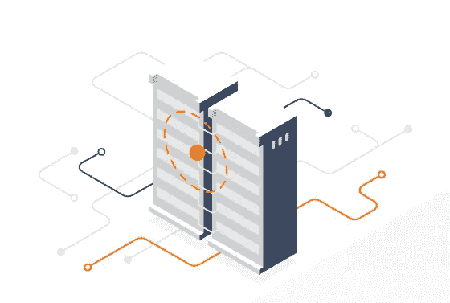
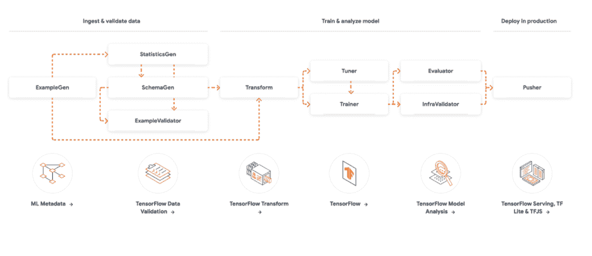
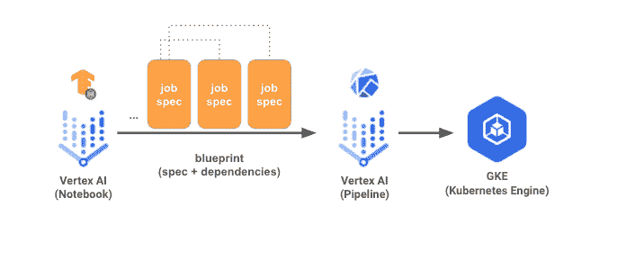
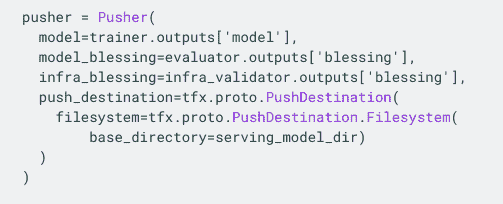

# 用 Tensorflow 扩展构建深度学习管道

> 原文：<https://towardsdatascience.com/building-deep-learning-pipelines-with-tensorflow-extended-913869f1f051>

## 你会看到像大公司一样建立深度学习管道是多么容易

[来源](https://www.tensorflow.org/tfx/guide)。2022 年 6 月 27 日[获得 Apache 2.0](https://github.com/tensorflow/tensorflow/blob/master/LICENSE) 许可

# 目标

在本教程中，我的目标是:

*   解释机器学习管道在生产中的作用
*   展示如何开始使用 Tensorflow 本地扩展
*   展示如何将 Tensorflow 扩展管道从本地环境移动到顶点 AI
*   给你一些代码示例来适应和开始使用 TFx。

你可以点击查看本教程[的代码。](https://github.com/piEsposito/tfx-tutorial-medium/settings)

# 介绍

一旦你完成了你的模型实验，是时候把东西投入生产了。将机器学习投入生产不仅仅是用 REST API 包装模型二进制文件并开始为其服务的问题，而是让重新创建(或更新)和重新部署您的模型成为可能。

这意味着从预处理数据到训练模型以将其投入生产的步骤(我们称之为机器学习管道)应该被部署，并能够尽可能容易地运行，同时使跟踪它和参数化它成为可能(例如，使用不同的数据)。

在这篇文章中，我们将看到如何使用 Tensorflow Extended (TFx)为深度学习模型建立机器学习管道，如何运行并部署到 Google Vertex AI 以及我们为什么要使用它。

我们将从 TFx 及其组件、实现和最小工作管道的概述开始，然后展示如何在 Jupyter 实验室(在 Google Colab 上)和 Vertex AI 管道上运行它。这里使用的代码改编自汉尼斯·哈普克的“[构建机器学习管道](https://github.com/Building-ML-Pipelines/building-machine-learning-pipelines)”。

# TFx

TFx 是 TensorFlow 的生产框架。TFx 不仅让用户以高性能的方式服务模型，还包装了 Tensorflow 生态系统的所有部分(从 Keras 到数据验证到服务)，让用户构建和运行可扩展的高性能机器学习管道。

它被组织成一系列组件，要求您编写更少的代码，但也很灵活。

[来源](https://www.tensorflow.org/tfx/guide)。在 Apache 2.0 下获得许可的(2022–06–27)

管道被编译成一系列蓝图，适用于不同的基础设施。你可以在本地或 Vertex AI 上运行它们。你可以在 Apache Beam 甚至 Google Dataflow 上运行一些昂贵的数据处理步骤。TFx 不会锁定您的供应商，而是会适应您的资源和基础架构。

[来源](https://www.tensorflow.org/tfx/guide)。根据 Apache 2.0 获得许可

在这篇文章中，我们将为我们的管道使用以下组件:

## 示例 Gen

TFx 管道的入口点是`ExampleGen`组件。给定一个本地(或类似云存储的)路径，它根据输入规范收集`.tfrecords`格式的文件。

我们将使用一个较小的数据集，因此一个`.csv`文件将是一个更好的选择。我们将使用一个指向本地 csv 文件的`CsvExampleGen`文件。当我们转移到 Vertex AI 时，这个文件将被上传到一个谷歌云存储桶中。

由我生成

## 改变

并不总是需要`Transform`组件，但是当需要进行昂贵的预处理时，它很有用。为此，我们在`module file`上创建了一个名为`preprocessing_fn`的纯张量流函数。TFx 将把这个转换应用到由`ExampleGen`组件输入的所有数据点。

这个函数需要是纯的(意味着没有副作用)，并且只使用 Tensorflow 操作，因为(I)这个预处理步骤可以序列化为 TF 图，并烘焙到最终的模型，以及(ii)这个步骤可以在 Apache Beam 上运行，这意味着它将被大规模并行化(对于非常大的数据集很好)。

`preprocessing_fn`接收一个`tf.Example`对象(可以把它想象成一个奇特的字典)并应该返回一个`dictionary`，它将被序列化为一个`tf.Example`以输入到模型中。在这一步，只要你只使用 TF 函数，你可以做任何你想做的事情。

在构建管道时，我们将看到一个`preprocessing_fn`及其参数的例子。

我们指向这个模块文件来构建组件。

由我生成

## 运动鞋

这里是`model.fit`步骤发生的地方。与`Transform`步骤相同，我们指向上面有`run_fn`的`module file`。`run_fn`函数接收一系列`[fn_args](https://github.com/tensorflow/tfx/blob/9743f3dcb84b933f0eb672c46200b3485e2c9794/tfx/components/trainer/fn_args_utils.py#L61)`，这些将在构建管道时进行探索。

`run_fn`从`Transform`接收实际的预处理实例。它将它提供给训练步骤中的模型，然后返回模型。返回的模型将被进一步验证，然后被推送到部署上下文。

经过训练的组件可以在不同的基础设施上运行。您可以使用本地资源在本地运行它，或者设置基础设施必需品(如 GPU 和 CPU)并在 Vertex AI 上作为托管容器运行它。

由我生成

## 推进器

`Pusher`是 TFx 管道的最后一个组件。它的目的是，给定从`Trainer`得到的模型，将它推送到一个云存储桶，从那里它将被服务(或者由一个 TF 服务实例监听桶，或者由一个使用 TF Lite 的 web/移动应用程序)。

在推送之前，可以在模型之上进行几个验证，例如评估它在测试集上的度量，甚至检查它是否实际运行在 TF 服务容器上。我们将保持简单，如果人们喜欢这个，我们将发布一个更复杂的管道。

由我生成

有了这些组件，我们就可以开始实现管道，看看它实际上是如何工作的。

# 在 Jupyter 笔记本上实现管道

我们将开始在 Jupyter 笔记本上实现，你可以在 Colab [这里](https://colab.research.google.com/github/piEsposito/tfx-tutorial-medium/blob/main/local/run_tfx_pipeline.ipynb)打开它。我们将以交互方式运行它，并检查事情是如何运行的。之后，我们将构建相同的管道，但将其部署在 Vertex AI 管道上。

运行设置单元后，我们必须导入`tfx`及其`InteractiveContext`:

我们的数据将放在相对的`data_local`目录中，所以我们只需要从中创建一个`CsvExampleGen`。请注意，我们使用交互式上下文运行组件，然后将能够提交它们的输出。

在开始处理数据集之前，获取数据集的统计数据和模式是一个很好的做法。将来，这不仅可以用于验证模式数据，还可以用于验证漂移数据。我们用`SchemaGen` 和`StatisticsGen` 来表示它:

我们现在将使用当前目录下的`module.py`文件中的预处理函数对数据进行预处理:

我们只输入缺失值和一次性编码的分类特征。这很简单，因为:

然后我们继续训练我们的模型。注意，我们使用 transform 组件的结果，并设置 eval 和 training 参数。因为我们使用这些组件来说明 TFx 管道的创建，所以我们不会对它们进行很长时间的培训:

在我们的模块文件中，我们从转换组件中获取数据。我们在内部可以访问在转换组件之后生成的`fn_args.train_files`和`fn_args.eval_files`，因为我们将`examples`作为关键字参数传递给了训练组件，所以它们在内部是可用的。

训练后，我们还可以访问预处理操作的张量流图，这将有助于将模型投入生产，而不必手动处理。我们还确保在生产中使用与训练和评估模型时所用数据相同的预处理。

在训练之后，我们只需要将我们的模型保存到它将要被保存的地方。在本教程中，我们将它保存在本地，但应该明确的是，我们可以将模型推送到云存储桶，在那里它将被生产环境访问(例如，桶上的 TF 服务容器监听)。

# 在 Vertex AI 上部署它

TFx 很棒，因为你可以使用相同的组件，并在云上运行它们。在某些情况下(如训练和转换数据)，可以将它设置为在处理大数据的特定基础设施上运行(作为数据流，您可以大规模并行化转换步骤)。

您还可以指定训练步骤所需的资源，Vertex AI 将使用所述资源在 VM 上训练容器。我们现在将看看如何以最简单的方式做到这一点。

要做到这一点，让我们打开笔记本的顶点人工智能部分[这里](https://colab.research.google.com/github/piEsposito/tfx-tutorial-medium/blob/main/vertex_ai/run_tfx_pipeline.ipynb)。

我们的火车代码有相同的`module.py`,还有一个`base_pipeline.py`,它像我们在本地运行中所做的那样连接组件，但是没有交互上下文:

这里的变化是，我们将运行这个管道，而不是使用`InteractiveContext`来运行它，我们将创建一个`.json`蓝图，然后在 Vertex AI 上运行它。

神奇的是:使用相同的管道，我们将构建 json 蓝图在`Kubeflow`中运行它，然后使用 Vertex AI 管道(一个奇特的 Kubeflow 管道引擎)来实际运行它。

在运行它之前，转到`pipeline_vertex.py`，将第 29 行改为您的项目名称，将第 19 行和第 20 行改为您创建的 bucket。然后将本地数据上传到`YOUR_BUCKET/data`和`module.py`到`YOUR_BUCKET/components`。

您还应该为此设置一个服务帐户。

然后运行笔记本上的所有单元并打开 Vertex AI 管道，您应该会看到类似的东西:(以及您创建的桶上的模型二进制文件)。

由我在顶点人工智能管道上生成

# 结论

我们可以在 TFx 上使用相同的代码库，并在本地运行 train 作业(调试和处理小东西),并且在需要时，将它移动到 Vertex AI，只需稍作修改。这样，我们就可以处理大型数据集和模型，并以一种可行的方式训练。

很高兴看到 TFx 如何将 Tensorflow 生态系统的所有功能整合到一个适合生产的框架中。

本教程旨在简单明了地展示使用 TFx 是多么容易，同时给出一些代码示例供您入门。这里使用的大部分代码都是改编自汉尼斯·哈普克的机器学习管道，或者至少是受其启发，其中的 Github 库是在麻省理工学院许可下发布的。

如果你发现任何错误，有疑问，想进一步讨论这个话题或者只是想交个朋友，请随时到 piero.skywalker@gmail.com 找我。

谢谢！

# 参考

<https://github.com/Building-ML-Pipelines/building-machine-learning-pipelines>  <https://www.buildingmlpipelines.com/> 