# 建造 Ellee——一个 GPT 3 和计算机视觉驱动的会说话的机器人泰迪熊，具有人类水平的对话智能

> 原文：<https://towardsdatascience.com/building-ellee-a-gpt-3-and-computer-vision-powered-talking-robotic-teddy-bear-with-human-level-db7d08259583>

## 我如何建造一个可以移动头部并自然交谈的机器泰迪熊。

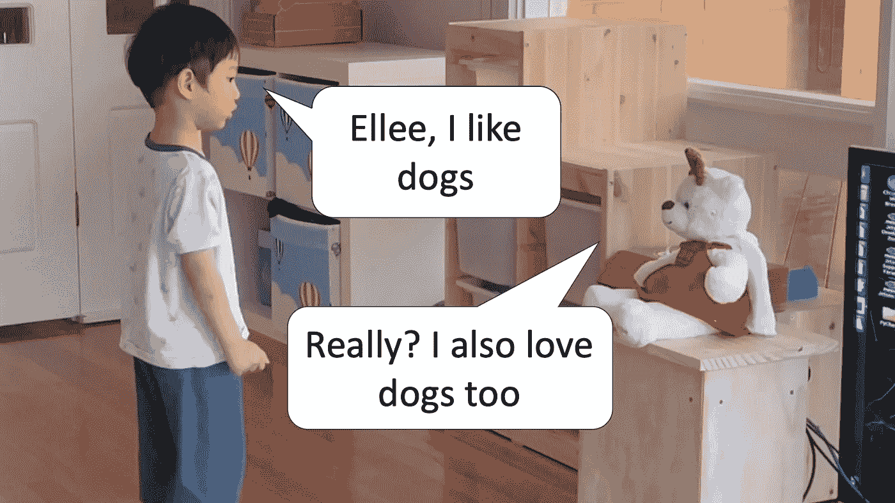

Dexie 在和 Ellee 说话(图片由作者提供)

我有一个相当长的三周圣诞假期，尽管大部分时间都和家人在一起，但在假期结束前一周，我还有一些时间可以消磨，所以我决定做一些有趣的事情！我一直想为 GPT-3 人工智能模型找到一个好的用例，我还想为我们三岁的儿子德谢(Dexie)构建一些有趣、互动和有教育意义的东西，他非常健谈，非常好奇。所以，我想出了制造一个会说话和移动的机器人泰迪熊的主意。

# 概念

这只机器泰迪熊将能够看到和认出一个人，叫他们的名字并和他们说话。她将具有听觉能力来听正在说的话并产生自然的声音反应。她需要能够理解对话的内容，并相应地做出反应。稍后我会详细说明这一点。在整个谈话过程中，她需要能够移动她的头来看这个人的脸。

为了最大限度地提高亲密度，我决定把德西最喜欢的娃娃之一埃拉变成这个机器人。我给她起了个新名字，Ellee，代表电子版的 Ella。


德西和埃拉，他最喜欢的泰迪熊娃娃(图片由作者提供)

# 研究

为了实现上述目标，Ellee 需要具备以下模块:

*   **视线**。Ellee 必须能够跟踪一个人的位置，并实时识别他们的脸，这样她就可以移动她的头来看着他们，并叫这个人的名字。为此，我需要一个连接到人工智能系统的摄像头，以检测一个人及其面部的存在和位置，并识别他们。需要一个经过训练可以识别人体及其面部的物体检测人工智能模型，该模型将在连接到摄像头的 GPU 驱动设备上运行。
*   **头部运动。** Ellee 需要能够左右和上下转动头部(两个自由度)。
*   **听证会。** Ellee 将需要能够听对话，这需要语音识别技术和麦克风。
*   **大脑。Ellee 需要能够理解正在说的话，并通过考虑过去的对话来提供一些上下文，从而生成自然的文本响应。这就需要一个强大的生成式文本 AI 模型。**
*   **演讲。** Ellee 需要跟人打招呼，说出大脑模块产生的文本反应，这就需要文本到语音的技术。
*   **协调人。**这是连接所有组件所必需的。

基于我对过去[项目](/building-a-bot-that-plays-videos-for-my-toddler-597330d0005e)的经验，经过一些研究，我列出了运行该系统所需的硬件清单。

*   **NVIDIA Jetson Nano**(150 澳元)。这是一个由 GPU 驱动的小型嵌入式设备，将运行所有模块(特别是对象检测和面部识别人工智能模型)。这是一款非常适合这项工作的设备，因为它可以通过 USB 端口支持麦克风和音频输出，并且它有一个以太网端口，可以轻松访问互联网以进行 API 调用。你甚至可以插入鼠标和键盘，在设备上进行开发和调试，因为它有一个功能齐全的 Ubuntu 18.04 操作系统。

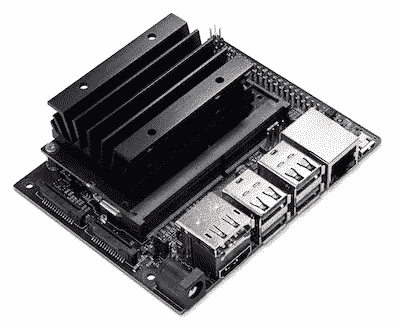

NVIDIA Jetson Nano

*   **USB 麦克风和扬声器**(20 澳元)。这些听起来可能并不复杂；然而，人们一直在报告一些扬声器和麦克风在 Jetson Nano 上无法工作，所以希望这些细节对您有用。我可能很幸运，因为我买的唯一一个 USB 扬声器在摆弄了一阵嘶嘶的反馈声后工作了。然而，我买的两个麦克风中只有一个(USB 的)能用。品牌和型号见下图。

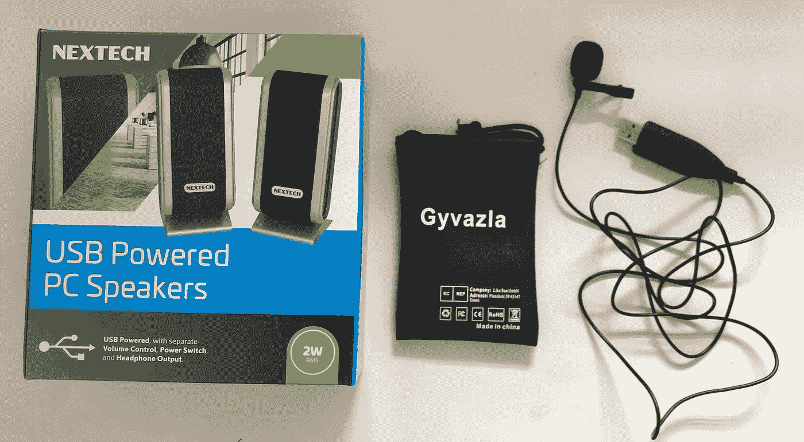

扬声器和麦克风(图片由作者提供)

*   相机——索尼 imx 219 160(35 澳元)。这是一个非常棒的微型 160 度 POV 8MP 万像素树莓相机，使 Ellee 能够看到和识别人。根据我对其他机器人项目的经验，广角 POV 是至关重要的——否则，Ellee 将无法发现任何人，除非他们直接在她面前，这感觉不自然。
*   **伺服电机** ($AUD 75)。两个 5 公斤/厘米的扭矩伺服电机连接到平移和倾斜支架将允许两个自由度的旋转。需要一个 PWM 驱动器来驱动电机，因为 Jetson Nano GPIO 引脚仅提供 1 mA 电流，而伺服电机消耗 3 A 电流。由于电机只需要移动 Ellee 的头部，这相当轻，5 公斤/厘米的扭矩就足够了。

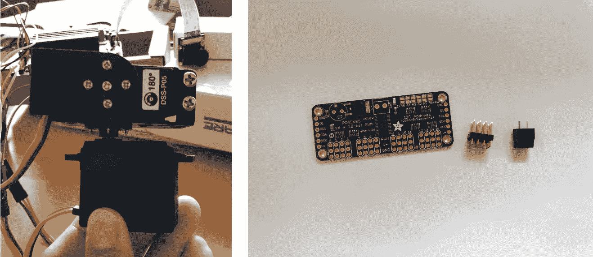

伺服电机、支架和 PWM 驱动器(图片由作者提供)

*   **木棍和一个柜子** ($AUD 10)。木棍将作为 Ellee 的骨架结构来连接摄像机和伺服系统。棍子将被连接到木制的柜子上，硬件部件被藏在柜子里，Ellee 将坐在柜子的上面。

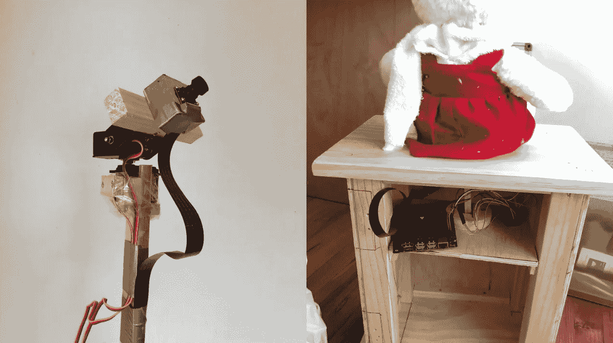

Ellee 的骨骼结构和一个柜子(图片由作者提供)

# 履行

有了一个可靠的计划，我开始完成我的使命。

**建设视线**

为了从摄像机获取视频，我使用了一个名为 Jetcam 的很棒的库，它是我扩展的。在 4 行代码内，您可以让整个系统运行起来:

```
from jetcam.csi_camera import CSICamera
camera = CSICamera(width=224, height=224, capture_width=224,         capture_height=224, capture_fps=30)
image = camera.read()
```

接下来，需要一个对象检测组件来分析视频帧，并检测人体和面部的位置，以便能够跟踪和查看它们。请记住，NVIDIA Jetson Nano 的 GPU 不如 RTX 等桌面级 GPU 卡强大，因此选择一种在准确性和性能之间取得良好平衡的对象检测模型架构至关重要。

过去，我一直使用 MobileNetSSDV2 模型架构来构建我在 Tensorflow 上运行的对象检测模型，该模型在准确性和性能(10FPS)之间实现了良好的平衡。这一次，我使用的是 MobileNetSSDV2 模型，它带有运行在 PyTorch 上的 [NVIDIA JetPack SDK](https://developer.nvidia.com/embedded/jetpack) ，简单到只需添加三行代码:

```
import jetson.inference
net = jetson.inference.detectNet("ssd-mobilenet-v2", threshold=0.1)detections = net.Detect(image, width, height)
```

令我惊讶的是，该模型提供了 20 帧/秒。太棒了。我不需要建立自己的模型，因为它已经支持 91 个 COCO 类，包括我需要的人体。

我使用了一个 Dlib，一个现代机器学习框架，来检测和识别人脸。我可以构建自己的自定义对象检测，将 face 作为其中一个类；因此，我不需要运行另一个面部检测，这可能会提高一些性能。然而，我决定不这样做，因为我一直想尝试一下 Dlib 库，现在正是时候。此外，相对于简单地添加上述三行代码，我懒得构建自己的对象检测模型。
用 Dlib 检测人脸非常简单——两行代码给你一个检测到的人脸包围盒列表，以及它们的置信度得分。

```
import face_recognition
face_recognition.face_locations(image)
```

为了识别人脸，Dlib 提供了两个重要的功能。第一个函数是 face_encoding，它基本上是从人脸图像中计算出一个指纹，称为编码。这种编码唯一地识别一张脸。第二个函数是 face_distance，它计算人脸编码与人脸编码列表之间的距离(相异度)。结果是一个距离列表，每个面一个距离。距离最小的脸是最相似的脸。

这是我如何使用它们的。首先，使用 face_encoding 函数，我在应用程序开始时生成了我所有家庭成员的面部编码，并将它们保存在一个列表中。在运行时，我为视频帧中每个检测到的人脸调用 face_encoding，并将结果传递给 face_distance，以计算该编码与包含我的家庭成员编码的列表之间的距离。最后，我按升序对结果进行了排序，并挑选了第一个(鉴于它也通过了最小距离阈值，以防它们都不是我的家庭成员)。这是不是意味着 Ellee 再也认不出其他人了？我为她增加了一个功能，可以自动注册一个新的未被识别的人的脸，我将在后面的部分介绍。

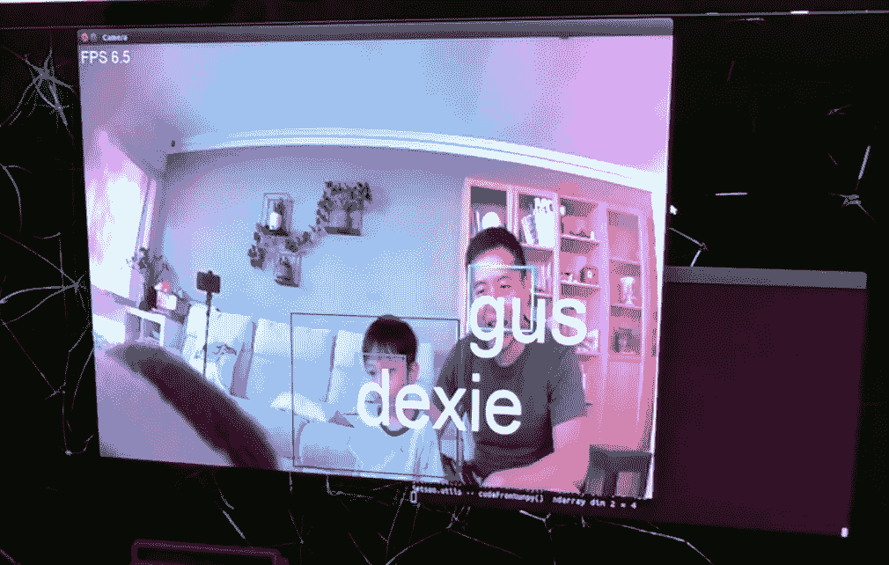

对象检测和人脸识别(图片由作者提供)

检测/识别准确度相当好。然而，在 Jetson Nano 中，face_encoding 和 face_locations 函数的执行时间都在 0.5 秒左右。因此，为每个视频帧调用它们会显著降低系统 FPS，从 20FPS 降到 1FPS。这是不可接受的，因为这将在 Ellee 认为人脸的位置与实际位置之间引入+1 秒的滞后，这导致她的头以+1 秒的滞后跟随某人的脸。

对此的解决方案是以较低的 FPS 在线程中调用面部检测/识别，例如每 10 帧调用一次。鉴于相机设置为 10FPS 捕捉，这意味着我们每秒钟都在进行人脸检测/识别，这并不算太糟糕。我使用相同的技术每两帧运行一次对象检测，最终性能提高到 12FPS。

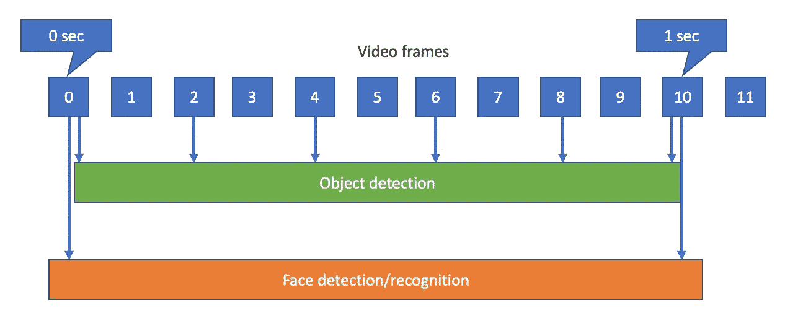

降低物体检测和面部检测/识别 fps(图片由作者提供)

虽然这个技巧有效，但我注意到它给 Ellee 的头部带来了+1 秒的延迟，即它跟随人的面部有一秒的延迟，因为检测到的面部位置每秒钟才更新一次。我通过不使用检测到的面部位置进行头部跟踪来解决这个问题。取而代之的是，我通过假设，在垂直方向上，它距离人边界框的顶部 5%的距离，在水平方向上，它在人边界框的中心，来伪生成一个人脸的位置。这种假设非常有效，因为大多数时候，被检测人的头部总是在视野中。

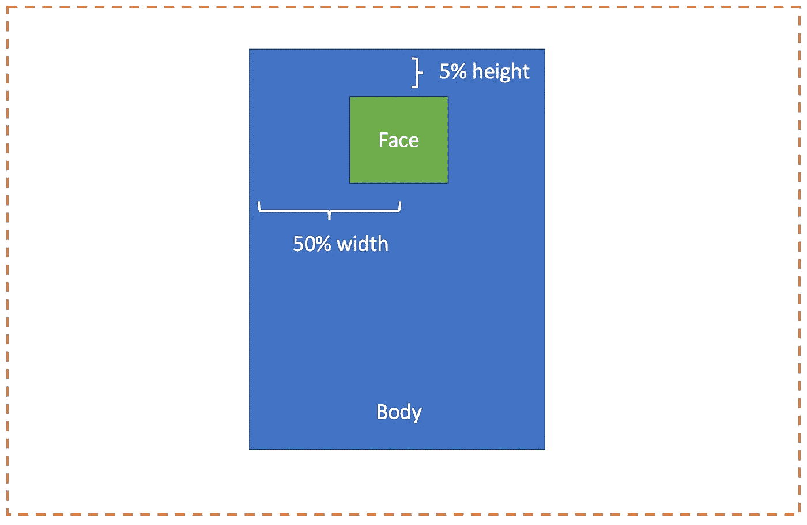

人脸包围盒的伪生成(图片由作者提供)

**建立头部运动**

头部运动模块通过 [adafruit_servokit](https://circuitpython.readthedocs.io/projects/servokit/en/latest/) 框架控制两个伺服系统的角度，以达到目标航向和俯仰。Adafruit servokit 是一个兼容 Raspberry Pi 的框架，允许你用几行代码控制伺服电机。当我们使用 PWM 驱动器来控制伺服电机时，我们需要从连接到 PWM 驱动器的杰特森纳米 SCL 和 SDA GPIO 引脚发送控制信号。因此，在初始化时，我们用 SCL 和 SDA 引脚配置伺服套件。我们只需要驱动两个伺服系统；然而，这个 PWM 驱动器可以驱动多达 16 个伺服电机。要实际移动伺服电机，我们只需通过传递适当的 servo_no，为 self.kit.servo[servo_no]赋值。

```
from adafruit_servokit import ServoKit
import board
import busio# Initialization
self.kit.servo[servo_no].angle = value
i2c_bus0 = (busio.I2C(board.SCL_1, board.SDA_1))
self.kit = ServoKit(channels=16, i2c=i2c_bus0# Move servo [servo_no] to a specific value
self.kit.servo[servo_no].angle = value
```

请注意，伺服值并不直接对应于实际角度。因此，我们需要在代码中执行一些标准化操作，将角度值映射到伺服值。

非连续伺服电机(我们的)只允许最大 180 度旋转。无论是航向还是俯仰，我们都不需要 Ellee 的头部旋转超过 160 度。因此，我们在控制代码中进一步实现了最小和最大范围限制，将航向限制在 10 到 170 度，俯仰限制在 35 到 90 度。

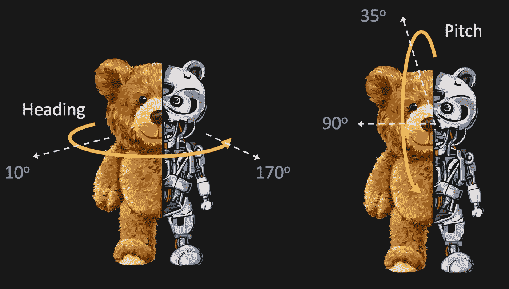

头部旋转轴和限制。(熊的形象获得了 shutterstock 的授权)

因此，对于 Ellee 来说，要移动她的头部以面对被检测的人，我们需要做的就是将被检测的人的面部的 x 坐标转换为相对于 Ellee 的当前头部方向的方向角度，并相应地用映射值设置相关的伺服。然后，我们对一个音高重复这一过程。
虽然这看起来很简单，但直接将伺服值设置为目标角度有一些缺点:

*   伺服运动相当快。一旦你设置了一个值，伺服就会以一个恒定的速度过快地向那个值移动，感觉非常机器人化。一个人移动头部的速度越来越慢，并逐渐减速到最终位置完全停止。
*   两个伺服系统以相同的速度移动。事实上，我们无法控制速度。如果航向和俯仰伺服系统需要从其当前值移动不同的量，需要移动较少的那个将首先到达其目的地。下图左图对此进行了说明，其中绿色圆圈代表起始值，蓝色圆圈代表最终值。垂直轴代表俯仰，而水平轴代表航向。蓝线代表头部运动。您可以看到，航向和俯仰最初以相同的速度移动，直到俯仰达到其最终值 10。然后，只有航向向最终值 90°移动。这是不自然的，因为当我们移动头部时，头部和俯仰同时到达它们的目标。

很明显，我们需要能够以可控的速度独立地向新的目标值移动两个伺服系统，这样我们就可以让它们缓慢移动，同时达到目标值。


用内插法控制航向和俯仰(图片由作者提供)

同样的问题也存在于游戏行业中，当制作任何东西的动画时，比如虚拟角色的头部。解决方案是使用插值技术将移动路径分成几个航路点，并逐步向最终位置递增移动航向和俯仰，如上图右图所示。橙色点代表每个航路点，用于设置从起始值到最终值的两个伺服值。最初，步长很大，当接近最终位置时，步长逐渐变小。这将导致头部逐渐减速直至完全停止。

**建立听证会**

听觉模块负责通过麦克风听语音，并使用语音识别技术将其转换为文本。延迟在这里非常重要，因为处理时间越长，Ellee 在对话中响应的时间就越长。理想情况下，您希望在 edge(在设备中)上运行语音识别，以避免互联网延迟。然而，在 edge 上运行需要一个强大的设备，据我所知，在撰写本文时，还没有在设备上运行的 edge 语音识别技术能够与 Jetson Nano 的计算能力相媲美，接近谷歌语音识别，这是我可以接受的标准。这也是为什么 iPhone 的 Siri、Google Home 和亚马逊 Alexa 都会把我们的声音发送到云端进行语音识别。

因此，我决定使用谷歌语音识别云服务。为了最大限度地减少延迟，我使用了一种流媒体技术，即不断将检测到的语音发送到云端，以便它可以在这个人说完整句话之前进行识别。使用这个技巧，我设法在这个人说完一句话的 1.5 秒内得到识别的文本结果，不管句子有多长。


谷歌语音识别(官方标志图片)

**建造大脑**

Ellee 的大脑负责从当前对话中生成文本响应。因此，我们需要聊天机器人技术。听起来很简单，实际上这是 Ellee 最复杂的部分。为什么？首先，它需要理解人说的最后一句话，以产生适当的反应。这本身已经很复杂了。这解释了为什么一个人类小孩需要三年才能获得基本的对话技巧，并且需要更多年才能掌握。但这还不是全部。为了做出恰当的回应，你还需要了解对话的背景，这些背景来自所有过去的对话。看看下面的对话交流。对于 Ellee 来说，要正确回答“是哪个城市？”，她首先需要查看过去的几次交流，以了解我们在谈论阿尔伯特·爱因斯坦和他去世的时间。如果没有这个背景，这个问题可能会被解释为他出生或生活的城市。Ellee 不仅需要掌握语言学，还需要获得历史知识才能回答这个问题。

> **人类:你知道阿尔伯特·爱因斯坦吗？**
> 
> 是的，我知道阿尔伯特·爱因斯坦。
> 
> 人类:他什么时候死的？
> 
> 他于 1955 年去世。
> 
> 人类:是哪个城市？
> 
> 那是新泽西州的普林斯顿

然而，人们可能会问一个需要其他知识领域的问题，如电影、音乐、数学、化学、体育等。Ellee 需要掌握所有这些领域。如果很难，他们是怎么搭建 Google Home，Siri，Alexa 的？他们都是基于检索的聊天机器人，只能回答已经准备好并存储在他们庞大数据库中的问题，因此有术语“检索”。试着问上面的问题，你会看到这些聊天机器人是如何悲惨地失败的。

为了达到上述要求，我们需要一个基于生成的聊天机器人，它根据自己的直觉，即通过理解正在说的内容和对话的上下文，逐字生成其响应。

我在过去使用各种技术构建了几个聊天机器人，从检索到生成，没有一个接近满足上述要求。

见见 GPT 3 号！这是通用 NLP 人工智能模型的最新突破之一，由 OpenAI 团队构建，并用来自维基百科和书籍的 45TB 文本进行训练。事实上，维基百科只是其训练集的 3%，所以你可以想象这个模型的庞大规模。训练花费惊人的 1200 万美元，拥有 1750 亿个参数！

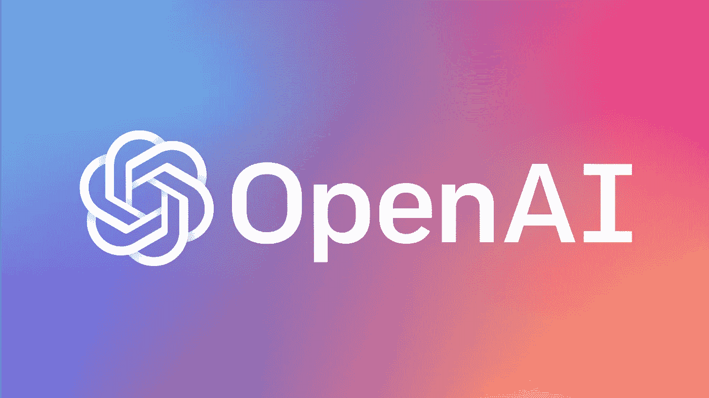

OpenAI(官方标志图像)

让 GPT-3 更加独特的是，它是一个通用的语言模型，只需用简单易懂的语言给出指令，就可以完成任何与文本相关的任务。这使得 GPT-3 可以执行各种任务，如完成一首诗，写一份商业计划书，以及执行情感分析和文本分类，而不需要提供普通 NLP 模型所需的数百万个训练集。

为了在 GPT 3 中构建 Ellee，我只需要用简单的语言用这个指令来训练它。

> 以下是与 Gus 创造的一个叫 Ellee 的 AI 的对话。艾莉住在澳洲的米查姆。Ellee 喜欢和人交谈。她最喜欢的颜色是绿色。Ellee 乐于助人，富有创造力，聪明，非常友好。
> 
> **AI:嗨[姓名]！你今天想谈什么？**
> 
> 人类:[人类 _ 回应]

第一段对 Ellee 的个性至关重要，这将影响她如何交谈。我希望她有创造力并且友好。向她提供一些背景信息，比如她在哪里出生，谁创造了她，以及她最喜欢的颜色，这很有用，因为她将能够在她的回答中使用这些信息。例如，回答这样的问题:*你住在哪个国家？你喜欢绿色吗？你叫什么名字？*

我把面部识别模块识别出的人名放在[姓名]下，把语音识别模块识别出的文字回复放在[人 _ 回应]下。仅此而已。GPT-3 然后将生成下一个埃利的反应，我将它与下一个被识别的人类反应一起添加回指令中。

为了有助于我们的说明，让我们说，她正在与德谢交谈，德谢回答说:“我很好，谢谢。”。让我们来谈谈运动。对此，埃利的回答是“我真的很喜欢运动”。你最喜欢的运动是什么？然后德歇用“我爱篮球”来回应。下一个培训说明将如下所示:

> 以下是与 Gus 创造的一个叫 Ellee 的 AI 的对话。艾莉住在澳洲的米查姆。Ellee 喜欢和人交谈。她最喜欢的颜色是绿色。Ellee 乐于助人，富有创造力，聪明，非常友好。
> 
> **AI:嗨德协！你今天想谈什么？**
> 
> 人类:我很好，谢谢。让我们来谈谈运动。
> 
> 艾:我真的很喜欢运动。你最喜欢的运动是什么？
> 
> 人类:我爱篮球

GPT 3 号将会生成埃利的下一个响应。这个过程反复发生，直到对话结束。通过这种方式，GPT-3 将了解过去对话的背景，以便能够做出更好的回应。为了减少处理时间和成本，我将过去的对话限制在最多 20 次。GPT-3 需要巨大的计算能力来运行；因此，可以通过 API 调用 OpenAI web 服务来访问它。

现在，大脑完成了。其实之前关于阿尔伯特·爱因斯坦的对话交流才是和 Ellee 真正的对话，最后一个问题她都能答对！

你可以在本博客结尾的视频的最后一部分亲自见证 Ellee 的对话能力。

**建筑名称提取**

除了生成文本响应，大脑模块还负责识别 Ellee 在会话中与之交谈的人的名字。这个超出范围的要求是突然出现的。我想，如果 Ellee 不认识她正在交谈的人，她可以提取他们的名字，如果在他们的谈话中被提到，并注册他们的面部图像，这将是非常酷的。因此，在未来的谈话中，她会知道他们。

我们已经从视觉模块得到了他们的面部图像，我们也知道 Ellee 不认识他们。然而，Ellee 如何从下面的对话中提取他们的名字呢？

> 艾:你好。我叫艾莉。你今天好吗？
> 
> 人类:早上好，艾莉。我今天很好。你好吗，艾莉？
> 
> **艾:我也不错。你在忙什么？**
> 
> 人类:我正和我妻子莫尼卡下午散步。很高兴见到你。我是约翰。
> 
> AI:你想和我聊天吗？
> 
> 人类:我很乐意。你是做什么的？

解决这一问题的常用方法是构建命名实体抽取 NLP 模型。一个人工智能模型，它用成千上万个带有名称标签的句子进行训练，以学习模式来找出哪些单词是要提取的名称，并使用该模型来识别对话脚本中的哪些单词是名称。


命名实体抽取训练集实例

这是一个费力的过程，鉴于我们只对与 Ellee 交谈的人的名字感兴趣，而不是任何名字，这使得它更具挑战性。我们需要某种转换器模型，它理解已识别名称的上下文，以捕获我们感兴趣的名称。

嘿，这不是 GPT-3 作为通用语言模型应该能够解决的任务吗？哦，天啊，的确如此！我是这样做的。我首先从 Ellee 中剥离出所有的对话交流，只留下人类的交流。然后，我用如下的简单指令构建了一个训练指令。

> 下面是一个叫 Ellee 的 AI 和一个人的对话。从这段对话中提取这个人的名字:如果没有找到名字，我会用“未知”来回应。
> 
> 早上好艾莉。我今天很好。你好吗，艾莉？
> 
> 我正和我妻子莫尼卡下午散步。很高兴见到你。我是约翰。
> 
> 我很乐意。你是做什么的？
> 
> 名称:

这是我唯一需要告诉 GPT 3 号的事。它神奇地将名字**约翰**添加到提供的*名字*的右边

它知道 Monica，即使它被提到，也不是我们正在交谈的那个人的名字。

这是相当令人兴奋的，而且完全改变了游戏规则。

**大厦演讲**

我用亚马逊 Polly 从大脑生成的文本中合成了 Ellee 的声音。这是另一种云服务，增加了 200 毫秒的延迟。然而，声音的质量是惊人的自然。


亚马逊 Polly(官方 logo 图片)

**协调员**

协调器的工作是通过跨模块发送数据将所有模块粘合在一起。它有一个状态机，跟踪 Ellee 的当前思维状态，这决定了她接下来要做什么，例如开始听、停止听、开始说话、移动她的头部、重置她的头部位置等。例如，当 Ellee 第一次看到 Dexie 时，控制器创建了一个以 Dexie 为焦点人物的新会话。这是至关重要的，因为有时可以检测到不止一个人，我希望 Ellee 能够看到她一直在说话的同一个人。然后，控制器将从瞄准模块获得 Dexie 的边界框位置，计算并发送新的航向和俯仰角到头部运动模块，成为新的目标，这样她的头部开始跟随他。当 Dexie 保持可见超过两秒钟时，控制器将指示语音模块问候他并开始监听。当一个句子被完整地说出时，它会从听觉模块中抓取已识别的文本，并将其传递给大脑，通过 API 调用 GPT-3 产生响应，并等待响应。在响应时，它将获取响应文本，并将其传递给语音模块来朗读它。当 Dexie 不再可见超过 10 秒时，控制器将重置对话会话，并准备好寻找下一个可见的人。

**组装**

完成所有模块后，现在是组装硬件的时候了。在我爸爸木工技术的帮助下，我们建造了 Ellee 的骨骼结构。这是一个坚持，我可以附上两个伺服(航向和俯仰)和安装在俯仰伺服相机。

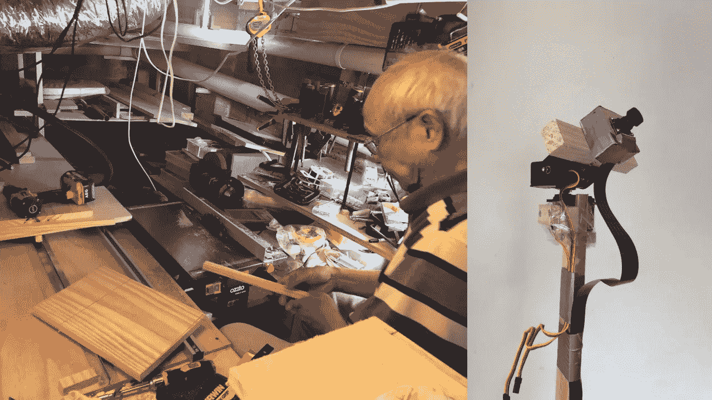

我爸爸的工作室和木制道具(图片由作者提供)

这根棍子然后被放入 Ellee 的体内，安装在她坐的木箱上。这两个伺服系统将位于她的头部，颈部关节的位置，并用螺钉固定在 Ellee 的头部，以确保她的头部与伺服系统一起移动。添加了几层木头来扩展相机的范围，这样它就可以在正确的位置从她被摘除的左眼球中出来。


(图片由作者提供)

我花了几次迭代才把它做好，这实际上是我在这个项目中花了大部分时间的地方。最后，我们完成了组装！然而，存在一些重大问题。Ellee 的脖子看起来像是刚刚被 Freedy Krueger 切开，特别是当她抬起头的时候。她的左眼球，也就是摄像头，比右眼球高，有一个很大的可见的洞，因为摄像头拉起了原来的洞，导致它撕裂和放大。这个看起来像科学怪人的埃利不会和德克西在一起的。我需要做点什么。


(图片由作者提供)

幸运的是，凭借我妻子神奇的缝纫技术和去一趟布料和工艺品供应商 Spotlight 买几条白毛巾和缝纫工具，我们治好了她。


(图片由作者提供)

正如你在下面看到的，她现在看起来好多了。我们给她做了一条围巾盖住她喉咙上的洞，这也让她更时尚。:)


(图片由作者提供)

最后，我们让 Ellee 坐在我爸爸做的一个小木柜上面，并把棍子牢牢地固定住。这个机柜有足够的空间来容纳 Jetson Nano、PWM 驱动器和所有布线。


(图片由作者提供)

**表演时间**

终于到了让德西第一次和 Ellee 互动的时候了。他不知道我把 Ellee 变成机器人的计划，所以看到他对 Ellee 的第一反应是无价的！他在艾丽身边徘徊，试图理解她究竟是如何移动和说话的。随着他慢慢变得更加舒适，我们与 Ellee 一起进行了一次愉快的交谈。任务完成。耶！！！

包括搭建过程在内的整个体验都记录在下面的视频中。一定要看最后一部分，我用一个更复杂的对话来测试 Ellee。

Ellee 演示视频

我对系统性能相当满意。尽管运行了如此多的模块和几个 AI 模型，它仍以 12FPS 的速度运行。她的头部运动也能很好地跟随她正在交谈的人。对话延迟，即 Ellee 响应对话的延迟，最多只有 2.5 秒，考虑到中间有语音识别、文本生成和文本到语音转换，并且所有这些都是与互联网的往返，这还不算太差。

**未来改善**

建造 Ellee 非常有趣，教会了我一些东西:

*   我需要买一台 3D 打印机。如果需要的话，你可以精确地设计和重新印刷一些道具组件，这比手工砍木头要容易得多。
*   1 FPS 的面部识别/检测并不理想，有时当检测到多个人但面部识别尚未启动时，Ellee 不可能知道她一直在与哪个人交谈。为了提高面部识别/检测频率，我可能需要使用稍微强大的硬件，如 Jetson Xavier NX 或 Jetson AGX Xavier。
*   有时，当检测到多人时，只有一个人在和 Ellee 说话，她会看着不说话的人，因为她会优先考虑与她更亲近的人和她认识的人。一个解决方案是添加一个意图检测人工智能模型来检测哪个人正在说话。更好的是，如果 Ellee 可以读唇语并将其与她的听力相匹配，即使两个人都在说话，她也可以确定哪一个在和她说话，如果他们同时说话，还可以分割和分离他们的声音。这进一步证明了使用更强大的硬件的合理性。

**隐私和道德风险**

当建立一种触及隐私和道德的人工智能技术时，我们需要负责任。首先，面部识别技术目前还不是很流行，特别是在隐私方面。Ellee 的面部识别只是用来个性化她与你的谈话，而不是为了跟踪或监视的目的，因此我对此很放心。第二，从伦理的角度来看，你用 GPT-3 构建的聊天机器人很难控制他们的行为，尤其是事实。有时 Ellee 可以编造一个完全合理但错误的事实，这可能会冒犯一些人。因此，请不要把她的回答看得太重。应避免将此类聊天机器人用于具有严重后果的目的，如医疗或情感咨询。

就这样，伙计们！我希望你喜欢阅读我的令人兴奋的暑假计划，就像我喜欢与你分享一样。

完整的源代码可以在[这里](https://github.com/msubzero2000/project-ellee-public)找到。

如果你喜欢这个博客，请给我一些掌声，并通过我的 [linkedin](https://www.linkedin.com/in/agustinus-nalwan/) 与我联系。