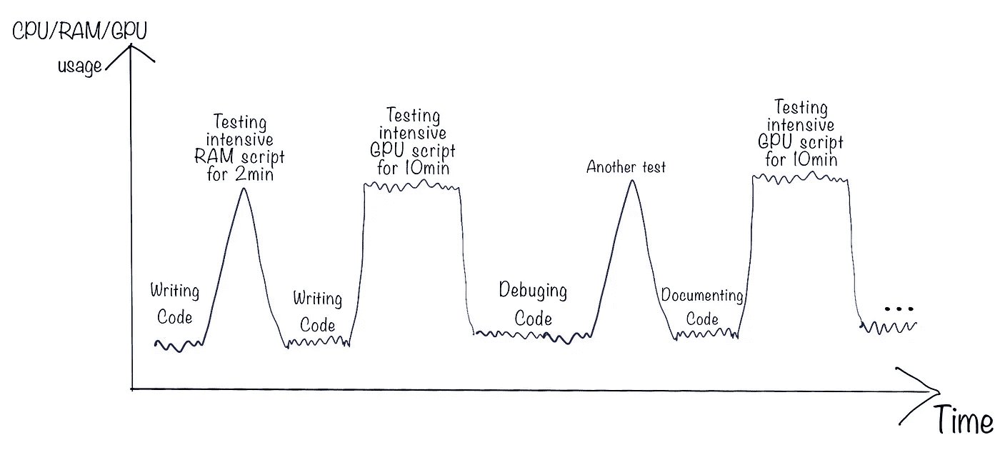
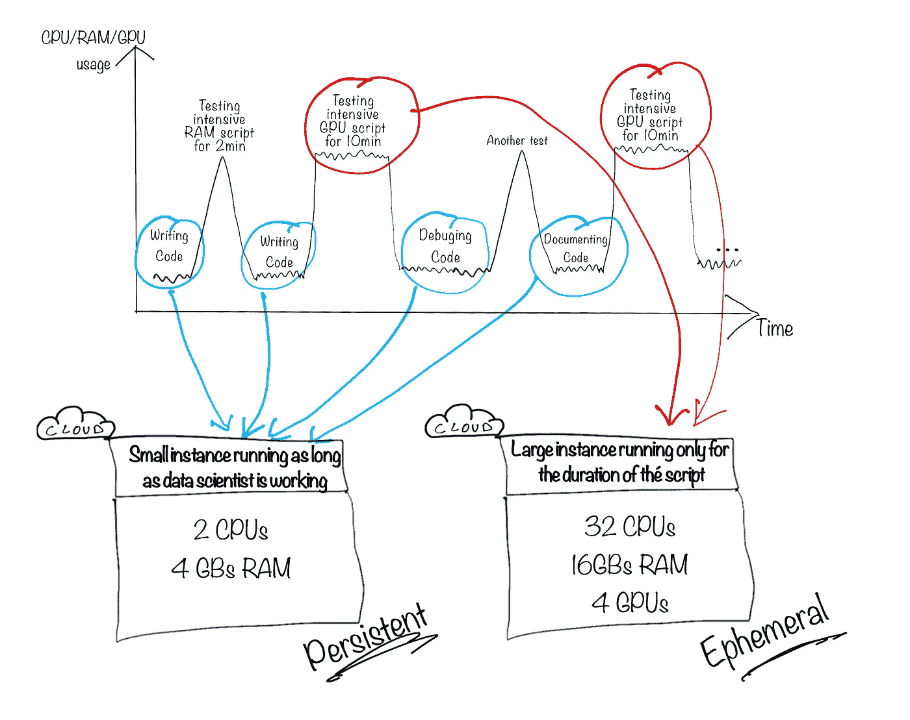

# 在云中构建机器学习模型:一种范式转变

> 原文：<https://towardsdatascience.com/building-machine-learning-models-in-the-cloud-a-paradigm-shift-ff7dbbc39312>

## 区分用于机器学习开发的持久计算和短暂计算

***照片由***[***Pero Kalimero***](https://unsplash.com/@pericakalimerica)*[***Unsplash***](https://unsplash.com/)*

*2017 年，我在云中运行了我的第一个机器学习(ML)模型，然而，当时我并没有意识到这一点。从我的角度来看，我只是连接到这个叫做“远程服务器”的东西，并执行我的 python 脚本。*

*今天，在云中构建、培训和部署 ML 模型正在不断地商品化。从用于强化培训的可扩展计算、实时推理、打包为 API 的 ML 模型，到托管 ML 平台、低代码/无代码 ML 解决方案、AutoML，不胜枚举。*

*在这篇文章中，我想分享一些关于在云中构建机器学习模型如何导致这些工作负载的**底层计算**和**基础设施**方面的范式转变的想法。*

*更具体地说，我将关注在构建阶段**开发人员体验**中的变化；数据探索、模型构建和模型调整(即“我们如何构建机器学习模型”)，同时略微涉及部署阶段。我将有意保持一种与工具无关的方法，较少关注使用哪种技术堆栈或云服务，而更多关注概念本身。*

# *为什么会有范式转变？*

*一方面，组织内部对机器学习的需求增加了。项目的数量增加了，数据科学团队的规模也变大了。这导致团队需要更多的计算能力来满足其用例的需求。

另一方面，访问云降低了经济高效和可扩展计算的门槛。组织能够:*

1.  *从固定支出(即预先购买服务器)转变为可变支出(即随用随付定价模式)。*
2.  *降低运营开销。*
3.  *停止猜测数据科学团队所需的计算能力。*

*这导致了云中 ML 工作负载数量的增加。数据科学团队被用来在一个地方运行一切；持久的环境。而云提供了各种各样的服务，每种服务都有其独特的优势:全天候运行的托管持久远程服务器、仅在脚本执行期间运行并收费的临时作业、基于无服务器的服务等。*

*当我们迁移到云时，大多数团队都在一个地方运行所有的东西；持久的基于云的环境。当在云中运行 ML 工作负载时，没有为正确的工作使用正确的工具会导致反模式，这对许多团队来说是一个未开发的潜力，并且需要范式转换。*

# *旅程*

## *第一章:我们的起点*

*最初，数据科学团队只能使用他们的笔记本电脑进行有限的计算，并将在本地开发一切。对于幸运的人来说，他们将获得第二台强大的机器，为他们提供更多的 RAM/CPU，在某些情况下还会有一两个 GPU。这使得数据科学家能够超越小型和大多数表格数据集，并利用深度学习或 AutoML 等技术处理计算密集型用例。*

**

*作者图片*

## *第二章:我不能再在我的电脑上运行了*

*随着团队开始触及其物理基础设施的极限，他们开始过渡到远程服务器。这主要是出于对更大容量的需求，但也允许团队内部资源的“共同化”。当您的同事不运行他们的密集计算时，您可以利用可用的容量，从而降低成本并提高团队的迭代速度。

一般这些远程服务器都是由 IT 部门提供的。你必须确定团队所需的容量，太高的话，你要为你不使用的东西付费，太低的话，你就有再次遇到容量问题的风险。此外，请求或购买内部部署的服务器、设置它们并持续管理它们需要时间和精力(几周到几个月)。*

**

*作者图片*

## *第三章:向云迁移*

*然后云来了。团队现在能够访问由云提供商管理的远程服务器。如果团队变得更大，您只需点击几下鼠标就可以增加服务器的大小，如果没有人使用它们，您只需减少它们的容量，甚至关闭它们。在某些情况下，您甚至可以为不同的工作负载和团队创建不同的服务器，实现团队和用例之间的“共同化”和隔离的混合。此外，云计算可以轻松访问各种工作负载的各种计算实例，从 CPU 密集型到其他具有数百 GB RAM 和/或多个 GPU 的工作负载。*

**

*作者图片*

*然而，团队很快意识到(遗憾的是不是全部)，当在小数据集上测试、重构代码或简单地编写文档时，他们并不总是缩减到最小容量。想象一下，购买一台拥有 4 个 GPU 和超过 200GB 内存的机器来完成这些低计算量的任务。除了潜在的高成本之外，在弹性计算的背景下，这似乎不是正确的做法。实例用法的典型示例如下:*

**

*作者图片*

*早期采用者实施的第一个防护是这些远程服务器的自动关闭和启动(即，在工作时间之外，当 CPU/GPU 空闲时)。这样做的代价是会丢失 RAM 中保存的任何内容，并且在需要时会等待几分钟让服务器重新联机。*

*尽管如此，当您处理代码、构建和测试模型时，不得不不时重启您的工作环境可能会很不方便。*

## *第四章:短暂计算*

*当你看前面的图表时，它提出了一个问题:如果我们将低强度和高强度的计算任务分离会怎么样？如果我们结合使用持续运行的经济高效的计算实例和仅在脚本执行期间运行的强大计算实例，会怎么样？*

*数据科学团队将能够两全其美。保持他们的工作环境运行，并在需要时，在特定时间内将他们代码库的繁重执行任务委托给其他实例。这可以通过短暂计算来实现:*

**

*作者图片*

*有趣的是，**大多数数据科学团队并不是这样开始使用短暂计算的。通常，他们会在将机器学习项目投入生产的过程中偶然发现它。在此过程中，您将代码打包到容器中，自动执行训练、推理等步骤。为了让事情变得更加稳健和自动化，下一步自然是“在云中创造就业”。这基本上意味着您现在能够在可扩展的计算上运行您的容器化代码，同时云提供商自动配置和关闭所需的基础架构(即短暂计算)。

然而，你可以在开发阶段**利用同一个委托人**。***

## *第五章:范式转变——在开发过程中使用短暂计算*

*尽管现在这种情况仍然很少见，但是一些团队也注意到了在开发阶段使用短暂计算的潜力。这是结合稳定性、规模和成本效益的一个很好的方式。下图说明了一个数据科学家团队如何设置他们的环境，该团队运行具有各种计算需求的各种工作负载:*

**

*作者图片*

*左边的持久化实例提供了一个稳定的环境，可以在其中编写代码、构建初始模型，以及执行任何不需要密集计算的任务。考虑到它们的成本效率，我们可以创建多个实例来确保大型团队中工作空间的隔离。右侧的短暂作业通过云服务提供的 API 启动。除了主要的代码逻辑，我们还需要以某种方式打包代码，并指定服务配置(基于您使用的服务)。这里的关键区别在于，您的整个代码逻辑现在都运行在由服务启动的临时作业上，而不是运行在发出 API 调用的实例上。

此外，如果您的持久化实例托管在云中，您可以轻松地对其进行扩展(添加更多 RAM、CPU 或 GPU)。这允许您在目标基础设施上快速测试您的代码，而不需要太多的努力。但是，应该是例外，而不是常态。否则，你会回到第三章。*

# *对数据科学家开发体验的影响*

*在开发阶段使用混合工作环境(即持久的和短暂的)有以下优点:*

1.  *您只需为短暂实例的执行时间付费(例如，1 小时 34 分钟、10 分钟等。).不再将这些宝贵的资源浪费在低计算任务上。*
2.  *您的开发环境不会受到您启动的繁重计算任务的影响。你的内核/运行时没有不堪重负，可以继续开发。*
3.  *您不局限于持久性实例的 RAM/CPU/GPU。您可以使用不同的数据集、超参数和算法并行启动许多训练变体，从而加快您的实验周期。*

*另一方面，您需要考虑以下缺点:*

1.  *您将对您的代码库进行更改，以确保它在上述服务中运行:容器化、文件夹结构、数据访问方式、超参数传递方式等。*
2.  *你的互动少了。由于您的脚本现在是远程执行的，所以很难像在持久化实例中那样进行调试(逐行执行或者使用 IDE 的调试器)。*

*根据哪些元素对您的组织最重要，您可能更倾向于持久或短暂的计算。基于我迄今为止与 AI/ML 从业者(数据科学家、ML 工程师等)的互动。)，混合工作环境的使用是关键。它有助于减少业务的上市时间，同时也为团队提供了一个无摩擦和体面的开发人员体验。*

# *结束语*

*对于 AI/ML 从业者和 C 级决策者来说，同样重要的是要记住，在云中构建机器学习不仅是为了获得更大、更强大的实例，而且是为了我们如何使用它们。*

*更重要的是，我们如何实验、构建和调优模型的过程中引入了变化:使用持久和短暂计算的混合环境，而不是在相同的持久环境中运行一切。*

**感谢阅读！如果您有任何问题，请随时通过 Twitter(@*[*ohamzaoui 1*](https://twitter.com/OHamzaoui1)*)或 Linkedin(*[*hamzaouiothmane*](https://www.linkedin.com/in/hamzaouiothmane/)*)联系我们。**