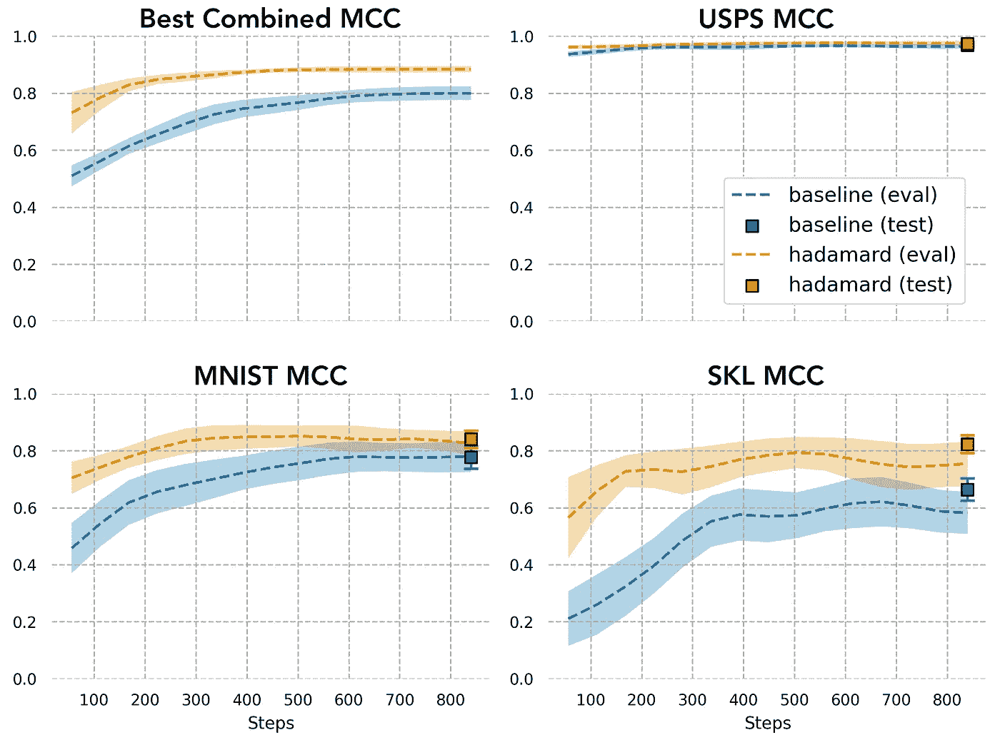
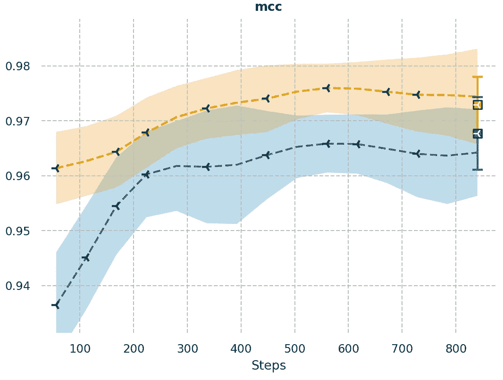

# 构建无用的 ML 模型

> 原文：<https://towardsdatascience.com/building-ml-models-that-are-useless-ba70df6957d>

## 来自医疗保健行业的教训

图为:可能是机器学习模型。看起来像是在医院的某个地方运行，对吗？？在 [Unsplash](https://unsplash.com?utm_source=medium&utm_medium=referral) 上由 [Carlos Muza](https://unsplash.com/@kmuza?utm_source=medium&utm_medium=referral) 拍摄的照片

所以你建立了一个 ML 模型。不错！这真的有用吗？不仅仅是在 Kaggle 排行榜的意义上，而是在字面上赌上性命的意义上？这两者之间的差异在 2021 年《自然》杂志的一篇论文中得到充分证明[ [1](https://www.nature.com/articles/s42256-021-00338-7) ]，该论文显示，在最近发表的所有新冠肺炎诊断人工智能模型中，没有一个模型能够强有力地推广到它们被训练的数据集之外的数据集。换句话说，尽管他们的排行榜分数近乎完美，但如果他们中的任何一个人真的被部署到医院，那就太糟糕了。

这个问题对我来说很近，因为我在医疗保健行业工作，并在 2020 年以这个身份合作开发了一个这样的新冠肺炎诊断人工智能模型。我们从未将我们的模型用于临床部署，因为后来已经开发出了更简单的测试，不需要对每个进入诊所的人进行 X 射线检查，但花在该模型上的大部分开发时间都花在了寻找避免《自然》杂志论文中强调的那种泛化失败的方法上。

图为:这不是确定谁感染了新冠肺炎的最简单的方法。照片由[国家癌症研究所](https://unsplash.com/@nci?utm_source=medium&utm_medium=referral)在 [Unsplash](https://unsplash.com?utm_source=medium&utm_medium=referral) 上拍摄

那么你如何知道你的模型是否真的有效，或者你的模型只是看起来有效？[ [1](https://www.nature.com/articles/s42256-021-00338-7) 中的作者认为，为了真正验证一个模型，可解释的人工智能(XAI)技术是必要的。我同意这种观点，尽管常见的 XAI 技术实际上可能会有它们自己的一套陷阱[ [2](https://arxiv.org/pdf/1810.03292.pdf) ][ [3](https://arxiv.org/pdf/1811.10154.pdf) ]，值得单独发布。不过，在这篇文章中，我想关注一些更基本的东西:

> 如果你想知道你的模型是否真的有效，你需要在(多个)完全不同于你训练它的数据集上测试它。

这并不意味着只是将你的数据集分成 20%用于定期评估，10%用于最终测试。我的建议是找到一组独立收集的样本，并使用它们作为第二(或第三或第四)数据集来验证你的模型。显然，这说起来容易做起来难——即使是在拥有大量可支配资源的工业规模的公司中。除了定位这些额外数据的明显问题之外，您还必须维护多个数据管道来管理所有这些数据(因为这些不同的数据集可能需要不同的预处理/规范化步骤，以便为您的模型准备好输入)。

这个问题的数据管理部分至少可以通过一些特定的工具变得更容易，所以在这篇文章的剩余部分，让我们通过几个代码示例来完成这个任务，这些代码示例也说明了在考虑可推广性的情况下进行开发时可以获得的一些意想不到的好处。

图为:从各方面考虑，这是一个相当不错的数字。马塞尔·埃伯勒在 [Unsplash](https://unsplash.com?utm_source=medium&utm_medium=referral) 上的照片

我们来做一个对数字进行分类的神经网络。为什么？因为有很多关于这个的数据集，所以说明主要观点应该很容易。我们将使用 [FastEstimator](https://www.fastestimator.org) (FE)框架，因为它可以与 [TensorFlow](https://www.tensorflow.org) 和 [PyTorch](https://pytorch.org) 一起工作，我不知道你会怎么做。还因为我帮助编写了 FE，试图使这个和其他工业风格的用例更容易。

传统 ML 工作流程的关键步骤时间到了(无需遵循我们的新黄金法则):

1.  查找您的数据集。让我们用 USPS [ [4](https://ieeexplore.ieee.org/document/291440) ]吧，因为里面有一些数字。
2.  设计你的模型。这不是今天的重点，我们就用 ResNet9 [ [5](https://www.cv-foundation.org/openaccess/content_cvpr_2016/papers/He_Deep_Residual_Learning_CVPR_2016_paper.pdf) ]吧。
3.  训练你的模型。
4.  发表一篇关于你开创性成果的论文。

为了节省时间，下面是步骤 1-3 的代码:

这里还没有什么特别的

现在我们只需要运行我们的培训，看看我们做得如何:

USPS 验证性能(马修斯相关系数)与时间的关系。平均值+-标准差。Dev 跑了 5 圈。(图片由作者提供)

看起来我们做得不算太差，最终平均测试成绩为 0.968。不过，让我们暂停一会儿，在这里讨论两件快速的事情。首先，你总是进行多次试验来得到标准偏差，对吗？第二，您不再使用准确性来衡量您的分类性能，对吗？？由于马修斯相关系数(MCC)被犯罪性地低估了，让我们强调一下这一点，让任何人都可以略读一下。

> 如果您使用准确性或 F1 分数来验证您的模型，您应该使用 MCC。

在这种情况下，我们的测试数据集具有平衡的类别分布，因此我们的 MCC 和准确性值基本相同(0.968 比 0.971)。尽管如此，养成良好的习惯是很重要的，因为真实的数据集基本上从来都不是平衡的，尤其是在医疗保健领域。当你 99%的数据来自健康患者，而你的模型有着惊人的 99%的准确率时，MCC 会让你避免意外愚弄自己。

不管怎样，现在我们准备好第四步了，对吗？不完全是。让我们应用前面的第一条黄金法则，在一些完全不同的数据集上测试我们的模型，以防万一。MNIST [ [7](http://yann.lecun.com/exdb/mnist/) 和 Scikit-Learn(以下简称 SKL) [ [8](https://archive.ics.uci.edu/ml/datasets/Optical+Recognition+of+Handwritten+Digits) 提供的 digits 数据集怎么样？我听说那些里面有一些数字…铁会让事情变得相对干净:

几行额外的努力可以走很长的路

请注意，添加这些额外的数据集只需要对管道进行很小的更改，就可以将所有数据加载到相同的大小，而像 MinMax 这样的共享转换可以保持原样。您选择使用的任何指标都将针对每个数据集单独进行自动计算，以及跨所有数据集进行计算。现在，让我们看看我们的模型表现得有多好，因为我们已经有了一些额外的数字数据集:

具有多个数据集的训练概要。平均值+-标准差。Dev 跑了 5 圈。(图片由作者提供)

正如你所看到的，尽管我们的网络在 USPS 数据集上表现很好(0.97)，但在 MNIST (0.78)和 SKL (0.66)上表现很差。当我们将所有数据集放在一起考虑时，我们的 MCC 仅为 0.80 左右。对于那些还不熟悉 MCC 的人来说，这里的精度几乎相同:分别为 0.97、0.79、0.67 和 0.80(MCC 和精度上限都是 1.0，但 MCC 往往会在您偏离完美性能时更快地惩罚您)。在任何情况下，尽管之前我们可能已经得出结论，我们的网络很好地理解了数字，但我们现在知道它实际上只理解 USPS 风格的数字。这绝对不是我们想要实现的目标。

这就产生了问题。埃文·丹尼斯在 [Unsplash](https://unsplash.com?utm_source=medium&utm_medium=referral) 上的照片

那我们该怎么办？我们的模型被证明是相当无用的。也许 80%听起来不太糟糕，但是如果邮政服务使用我们的模型解析 5 位邮政编码，只有 33%的邮件会到达它应该去的地方。除非我们成立一家失败即服务公司，否则我们必须做出一些改进。

一种选择是在我们的 MNIST 和 SKL 数据集上进行训练。虽然这是提高这些特定数据集性能的一种简单方法，但我们将不得不寻找更多的数字数据集来充分测试我们的概化性能。那听起来不太令人兴奋，所以让我们试试别的。

早在 NeurIPS 2019 年，美国陆军的研究人员发表了一篇论文[ [9](https://papers.nips.cc/paper/2019/file/cd61a580392a70389e27b0bc2b439f49-Paper.pdf) ]，提出了神经网络 softmax 层的替代方案。他们没有使用带有一个 hot 类编码的 softmax 层，而是表明神经网络可以通过简单地切换到带有使用 hadamard 标签编码的类的 tanh 输出层来更加鲁棒地抵抗敌对攻击(尽管强攻击仍然可以打破这种防御[ [10](https://arxiv.org/pdf/2002.08347.pdf) ])。这个的细节超级有趣，所以我强烈建议你去看看这篇论文。虽然这篇文章不是他们论文的总结，但我只是好奇这种方法是否也能帮助我们提高泛化性能(相对健壮的模型已经被证明具有更多可解释的特征图[ [10](https://arxiv.org/pdf/2002.08347.pdf) ]，这反过来可能会导致更好的泛化)。为了测试它，我们只需要对最终的网络层做一点小小的修改，并添加一个额外的管道预处理步骤，将我们的类标签转换为 hadamard 代码表示。

在这里，我在 TensorFlow 模型的顶部缝合更改，但您可以使用 PyTorch 代替。FE 处理两者。

虽然作者没有宣传这是一种提高模型泛化的方法，但是让我们看看我们是如何做到的:

专业提示:拥有多个图表是给管理层留下深刻印象的好方法。(图片由作者提供)

看起来我们已经有了一些明确的要点:

1.  ***我们的模型对邮政服务来说技术上还是没用的*** (点一下就知道标题了)
2.  如果我们只考虑 USPS 的性能，我们不清楚 hadamard 码的引入是否带来了任何改进
3.  当将所有数据集放在一起考虑时，引入 hadamard 码实际上确实显著改善了我们的最佳 MCC

为了更清楚地了解第 2 点，让我们放大 USPS 性能图:

和以前一样，橙色是哈达玛，蓝色是基线。(图片由作者提供)

如果这是您拥有的所有数据，您可能会说 hadamard 显示了一些初步的前景，但最终测试集性能在彼此的 1 个标准偏差内(0.967 基线对 0.973 hadamard)。

> 由于大多数人开发模型时一次只考虑一个数据集，他们可能会在这里停下来并恢复他们的更改，而没有注意到该方法的泛化优势。

然而，一旦我们开始审视 MNIST 和 SKL 的表现，我们就会看到一个非常不同的故事。hadamard 模型的泛化性能明显高于基线架构。这反映在组合 MCC 图中曲线的实线分离中(最大总 MCC 从 0.80 增加到 0.88，MNIST 峰值性能从 0.77 增加到 0.84，SKL 峰值性能从 0.66 增加到 0.82)。Hadamard 码并没有完全弥补我们的推广差距，但它们确实有所帮助，也许免费给了我们一些额外的对抗鲁棒性。我要了。

那么接下来呢？似乎我们停留在第三步，而每个人都知道第四步是名誉和荣耀所在。好吧，我们已经发现了一项技术，将我们的总得分提高了 0.08 分。如果我们能设法再做一次，我们就有了一个真正通用的 ML 模型。实际上，我们可能需要一个更好的数据集来实现这一点。2021 年有一个叫做 DIDA 的大电影值得一看。这可能看起来不是一个非常令人满意的结论，但是，嘿，如果我已经有了模型泛化的完美解决方案，我现在应该是正在进行第 4 步的人；)

更重要的是，我们现在有了一种方法来轻松测试模型修改对我们的泛化性能的影响。正如我们所见，如果没有明确的监控，我们很容易忽视我们正在试验的想法的真正效用。现在我们有了它，我们可以做出更好的决定，并且更有信心，当我们最终得到满意的测试分数时，我们的模型不会在生产中无情地背叛我们。名誉和荣耀我们来了！

他们给最佳论文颁奖，对吗？什么？？等等，那还有什么意义？图片由 [tommao 王](https://unsplash.com/@tommaomaoer?utm_source=medium&utm_medium=referral)在 [Unsplash](https://unsplash.com?utm_source=medium&utm_medium=referral) 上拍摄

# 参考

[1] A. DeGrave，J. Janizek 和 S. Lee，[用于射线照相新冠肺炎检测的 AI 选择信号的捷径](https://www.nature.com/articles/s42256-021-00338-7) (2021)，Nature Machine Intelligence
[2]j . Adebayo，J. Gilmer，M. Mulley，I. Goodfellow，M. Hardt 和 B. Kim，[显著图的健全性检查](https://arxiv.org/pdf/1810.03292.pdf) (2018)，NeurIPS
[3] C. Rudin，[停止解释高风险决策和使用的黑盒机器学习模型](https://arxiv.org/pdf/1811.10154.pdf) [用于手写文本识别研究的数据库](https://ieeexplore.ieee.org/document/291440) (1994)，IEEE
[5] K. He，X. Zhang，S. Ren，和 J. Sun，[用于图像识别的深度残差学习](https://www.cv-foundation.org/openaccess/content_cvpr_2016/papers/He_Deep_Residual_Learning_CVPR_2016_paper.pdf) (2016)，
[6] D. Chicco 和 G. Jurman，[Mathews 相关系数(MCC)在二分类评估中相对于 F1 分数和准确度的优势](https://www.ncbi.nlm.nih.gov/pmc/articles/PMC6941312/) (2020)，BMC Genomics 【T17 IEEE
[8] C. Kaynak，[组合多分类器的方法及其在手写数字识别中的应用](https://archive.ics.uci.edu/ml/datasets/Optical+Recognition+of+Handwritten+Digits) (1995)，博阿济齐大学科学与工程研究生院硕士论文。
[9] G .维尔马和 A .斯瓦米，[纠错输出码提高了深度神经网络的概率估计和对抗性鲁棒性](https://papers.nips.cc/paper/2019/file/cd61a580392a70389e27b0bc2b439f49-Paper.pdf) (2019)，NeurIPS
[10] F. Tramèr，N. Carlini，W. Brendel 和 A. Mary，[对对抗性示例防御的适应性攻击](https://proceedings.neurips.cc/paper/2020/file/11f38f8ecd71867b42433548d1078e38-Paper.pdf) (2020)，neur IPS
[11]h . Kusetogullari，A. Yavariabdi，j