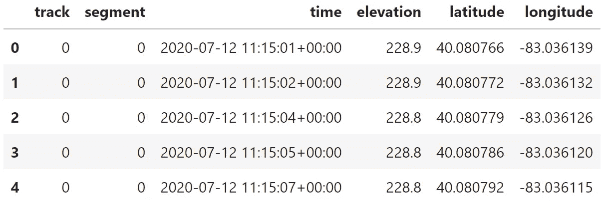
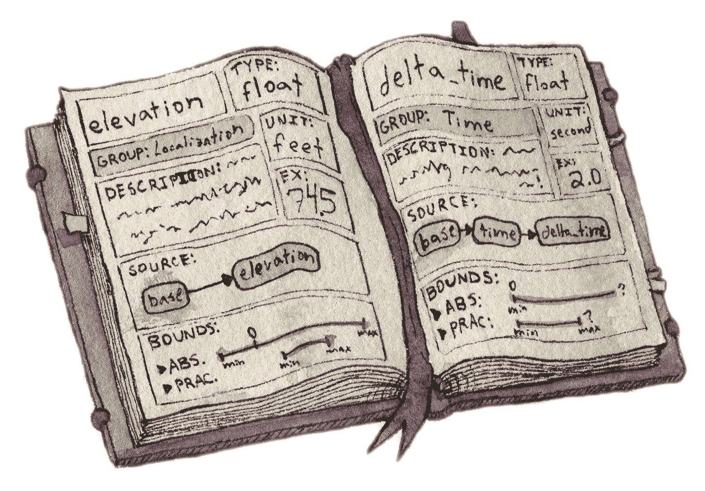
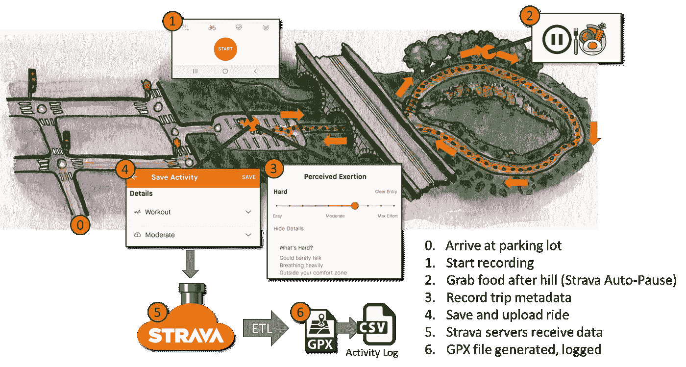
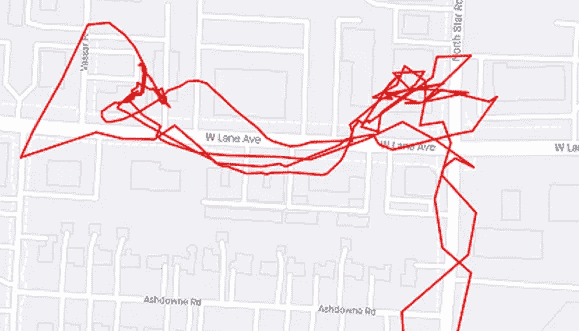

# 构建您的数据字段指南

> 原文：<https://towardsdatascience.com/building-your-data-field-guide-e2bdae49a9da>

## 如何超越数据字典

外面是一片丛林。图片作者。

当遇到新的数据集时，数据字典有助于理解和探索它。数据字典通常是 EDA 的第一个工具，但它们仍然缺乏甚至模糊了上下文。在建立任何模型或分析之前，需要理解数据。对于包含 50 列或更多列的数据集，不断地在字典中查找信息是一种精神负担，会减缓理解过程。为了更快地提取洞察力，您需要一种更快的方法来建立对数据集的直觉。

数据本身只是噪音。它只在正确的上下文中有用。毕竟，整数 3 可以是任何东西——某个数量的计数、类别或 ID。数据集中通常包含列名或数据标题，这并不奇怪。理想情况下，数据提供者描述“数据字典”中每一列的含义。就拿 Kaggle 上的[“房价预测”](https://www.kaggle.com/c/house-prices-advanced-regression-techniques/data)挑战来说吧。如果没有它的数据字典，几乎不可能推断出**栏和**栏表明一所房子靠近一条嘈杂的道路或铁路。像 **RoofMatl** (屋顶材料)这样的其他列就不那么神秘了，但是如果没有数据字典的话，仍然不是很明显。****

要快速建立对数据的直觉，您需要超越数据字典，构建数据字段指南。现场指南由 3 个部分组成:

数据字段指南的三个组成部分。图片作者。

最重要的是要记住，数据字段指南必须由 *you* 制作。仅仅接收数据字典是不够的。那太被动了，无法快速建立直觉。你必须积极参与理解你在探险中可能看到的东西。创建列集群(也称为“可视化数据字典”)是将可用信息分成更少部分的一种练习。当相关时，讲述数据的起源故事是将列放入*的另一个策略。两者都会让你对你的数据有一个新的认识。*

## **处理原始健身数据**

为了提供具体的例子，让我们使用一个真实的数据集。[在另一篇文章](/exploring-your-fitness-through-strava-data-90bffe391521)中，我谈到了通过从 Strava 应用程序下载的活动数据来探索你的健身情况。这很容易做到，通过练习制作自己的数据集是一次富有成效的冒险。在文件格式转换过程之后，下面是一个骑自行车的例子:

自行车骑行文件中的前 5 行。作者提供的图片[0]。

这是一个用 Python 创建的熊猫数据框架，但是不用担心——这些方法是与语言无关的。这个数据集只有 6 列开始。这可能看起来没什么可做的，但是，在一个较小的数据集上解释这种方法将有助于展示每个步骤，而不会迷失在组合混乱中。我已经将这一过程应用于工作中的数据集，这些数据集有数百列，来源不明。

# 1.数据字典

字段指南的第一个组成部分是数据字典。如果你有一本字典，那么你的一些工作已经为你做了。然而，你仍然需要对它的有效性保持一种健康的怀疑，并找出它不完整或令人困惑的地方。

如果有列名，但没有字典，那该怎么办？最好的办法是向数据集提供者询问这些信息。如果这是不可能的(或者需要太长时间)，那么就由您来构建自己的数据字典。在示例 Strava fitness 数据中，有 2 列是由我的数据读取过程创建的，但是其他 4 列除了它们的名称之外没有任何解释。我的数据字典的初稿如下:

*   `track` ( *int* ) =游乐设备数据中 GPX 轨道的唯一 ID。*派生列*
*   `segment`(*int*)= GPX 轨道内 GPX 段的唯一 ID。*派生列*
*   `time` ( *datetime* ) =表示记录行的时间的简单时间戳。
*   `elevation` ( *float* ) =以英尺为单位的用户高度。
*   `longitude` ( *浮点* ) =用户的经度，以度为单位。
*   `latitude` ( *float* ) =用户所在的纬度，以度为单位。

*时间戳没有记录时区信息。因此在当地时间是天真的。(不过我知道现在是东部时区)*

至少，数据字典将对每个列的名称、数据类型、描述以及数字列单元或类别枚举进行分类(例如:0 =女性，1 =男性)。这个基本数据字典将随着数据集的探索而更新。EDA 过程可以用新的列来丰富数据集。跟踪每一列的来源将有助于记录用于机器学习的数据集的谱系。

## 名称又能代表什么呢

名字和命名惯例可能是非常私人的事情。一般来说，列名应该简洁而具有描述性，但是如何在列名中体现这一点是主观的。如果你不喜欢一个名字，你的选择取决于你和谁一起工作。在我的 Strava 数据探索中，我是唯一的利益相关者，所以我可以*并将*更改名称以适应我的需要。如果您在团队中，更改生产数据集中的名称可能是不可能的或不切实际的。在实验中使用别名是可以的，只要团队能够理解。集成您的更改可能需要撤销那些列别名。

## 完成字典

一个好的数据字典将提供数据示例以及数值列的上下限。上一节的 dataframe 图像中显示了每列的示例。对于原始列，界限是:

按作者分类的表格。

对于每一列，绝对界限代表列的物理或设计极限。浮点数相对于整数或字符串的技术限制通常没有用。陆地海拔从死海海平面以下 1358 英尺到珠穆朗玛峰顶部。我既没有在约旦也没有在尼泊尔骑过自行车，所以绝对界限不会有助于发现异常值。这就是“实际界限”的由来。我大部分的骑行都在俄亥俄州，那里的海拔在 455 到 1550 英尺之间。类似的逻辑可以应用于纬度和经度值，以形成粗略的地理围栏。

总之，字段指南的数据字典部分将类似于:

图片作者。

尽管有用，数据字典是密集的。对于包含数百个列并且每个列都有许多属性的数据集来说，可能很难解析——尤其是对于新的数据集。如果您知道要搜索的列，那么字典是查找该信息的完美工具。在知识管理方面，词典具有良好的“可查找性”。在表格字典格式中，发现哪些列是相关的可能是一项更困难的任务。数据字段指南的下两个组件将创建具有更好“可发现性”的资产[4]。

# 2.列簇

是时候将这些信息整理成一个可视化的参考资料了。毕竟一张图抵得上一千个字！对于我们有 6 列的数据集，这个过程相对简单。目标是将相关的列分组到聚类中，并标记每个聚类。这种方法有时被称为亲和作图法或 KJ 法[5]。我建议用 Powerpoint、谷歌幻灯片或像壁画这样的数字白板来做这个练习。您可以使用便签来完成，但是当您浏览数据时，这些聚类可能会发生变化。

在您选择的数字工具中，键入数据集中每一列的名称，如下所示:

Strava 游乐设备数据中的六个可用列。图片作者。

接下来，拖动逻辑上相似的列，使它们在一个簇中彼此相邻。给每个集群留出一些空间，以便在视觉上进行区分。一旦你对你的集群有信心，添加一个文本框来标记它们。用相同的颜色填充一组中的每个列框，以加强视觉上的区分。命名一个集群看起来很棘手，但是一旦你找到了“正确的”集群，你就知道了。通过集群名称来记住这些列会容易得多，并且向同事解释它们也容易得多。至于颜色，我一般是凭手感挑颜色。id 栏很无聊(但很有用),所以它们是灰色的。警告或警报可能会变成橙色或红色。

数据字典的聚集版本。有 3 种主要的列类别。图片作者。

更复杂的数据集将有许多相关的列，建立良好的聚类将需要对数据字典进行严格的分析。将一个列放入一个集群而不是另一个集群，这可能归结为您必须做出的一个假设。当你形成关于数据的假设或问题时，记录它们。我会在以后的博客中告诉你如何使用它们。

如果您已经使用自己的数据集完成了这一步，那么您现在就拥有了 EDA 的宝贵资产。除了典型的列与列之间的交互，您还可以通过探索集群之间的交互来发现新的见解。您可能会发现影响整体数据质量的新内容或不一致之处。除了提高“可发现性”，创建集群实际上是一种“分块”练习。组块是将信息组织成更小的单元(组块)的过程，这些单元更容易处理和记忆。我是一个视觉学习者，所以有一个视觉指导这些组块就更好了。建立数据直觉依赖于识别模式。到目前为止，我已经展示了如何基于它们的语义关系对列进行聚类。接下来，我将根据它们的时间关系对列进行聚类。

# 3.数据起源的故事

数据字段指南还必须包含关于数据创建时间线的注释。字典只是作为名词的列的参考。把你的数据集想象成一个动词——或者更好，一部电影！把你的数据想象成一个有着自己起源故事的超级英雄(或超级恶棍)是很有趣的。数据随着事件的发生而变化，样本捕捉重要事件。某些列仅在数据创建过程中的某些点上相关。将数据想象成电影有助于将复杂的多列数据集分解成更容易记忆和与他人分享的故事。

回想一下[上一篇文章](/exploring-your-fitness-through-strava-data-90bffe391521)中的示例健身数据是以 GPS 交换格式(GPX)文件的形式生成的。GPS 坐标、高度和时间数据都是在游乐设备运行时生成的。总的来说，这个数据故事相对容易理解，但仍有细微差别潜伏在那里。

有许多方法可以捕捉数据之旅。一部真正的电影需要太多的努力，但是其他技术比如故事板会有所帮助。故事板在创建数据的关键时刻贯穿用户的旅程。故事板的目标是讲述足够多的用户旅程，以尽可能多地看到相关栏目的变化。对于更复杂的交互，可能会有多个用户旅程来捕捉不同的信息块。试着突出用户旅程中的共同组成部分，以便在不同的“情节”故事板中处理变化。

我可以将 Strava storyboard 总结成下面的一张图片(和方便的参考):

完成用户和数据之旅，体验 Strava 赛道之旅。图片作者。

到达停车场后，用户和数据的旅程如下:

1.  我打开 Strava 应用程序，开始记录新的活动。
2.  我在桥下和山上骑车，用计时和定位数据创建跟踪点。在山顶，我停下来拿了些水和点心。Strava 的自动暂停功能可以暂时暂停数据收集。
3.  我骑车下山，绕着湖回到起点。我结束了履带车。我记录关于旅行的元数据，如标题、任何照片和我感觉到的努力程度，从 1 到 10。
4.  我保存旅程并上传到 Strava
5.  Strava 服务器接收我的乘车数据，并对其进行处理，以便显示在我的账户信息中
6.  如果我以后想下载，会为我的骑行生成一个 GPX 文件。此外，骑行总结被添加到一个活动日志文件中——也可以下载。

4 个核心列(时间和本地化)与步骤 1 至 3 相关。当 GPS 数据的不连续记录应为游乐设备的后半段生成一个新的`segment` ID 时，ID 列在开始时和步骤 2 中都是相关的。

## 定义“游乐设备”

斯特拉瓦跟踪跑步，徒步旅行，游泳以及骑自行车。斯特拉瓦称每次上传为“活动”。这很有效，因为它没有对活动类型做任何假设。在自行车骑行类型中，它也不假设什么是“骑行”。

想象一下我在山顶停下来吃午饭的用户旅程。我可能会结束当前的活动并上传它。午饭后，我会开始一项新的活动。是每次上传都算作一次单独的骑行，还是整个环湖往返之旅？选择一个定义取决于你分析的目的。

考虑一个包含驾驶数据的汽车远程信息数据集，而不是自行车数据。从司机的角度来看，去杂货店的“旅行”可能非正式地意味着往返于商店的车程。然而，该数据将显示为两个不同的点火开关循环。

这个难题也适用于电子商务。如果在一次登录中，客户将一件产品添加到购物车中，几个小时后再次登录时才购买该产品，该怎么办？您认为这个用户旅程是一个“会话”还是基于登录来划分？

无论是骑自行车、开车还是网上购物，我们给用户旅程贴的标签都充满了假设。这些假设将影响我们试图评估的指标和分析。因此，在数据源的故事中把它们叫出来可以让你意识到它们。

## 数据“绘图孔”

数据质量问题可能会导致很多令人头疼的问题，但是数据源故事对于发现一些质量问题是有用的。例如，Strava 似乎依赖于我的手机上已经安装的谷歌地图来获取本地化数据。如果谷歌地图有问题，需要更新，会发生什么？嗯…

我没有这样骑车！图片作者。

还有更多人为的问题:

*   忘记记录一次乘坐
*   行驶过程中电池耗尽
*   手动暂停活动，但忘记稍后取消暂停
*   忘记停止录音…然后开车回家

在试图找出数据质量问题的根源之前，捕捉理想或典型的用户旅程可能会有所帮助。无论如何，将数据质量放入故事中有助于理解下游的质量问题。

# 结论

在本文中，我介绍了数据字段指南的 3 个组成部分。创建指南是您和数据集之间的一个活动过程。它通过创建更多可发现的知识资产(列簇和数据起源故事)来包含和增强数据字典的价值。现场指南的最后两项资产对于减少数据混乱和快速建立直觉至关重要。

如果您遵循并创建了自己的数据字段指南，那么问题和假设无疑会出现。这些构成了数据探索的起点。在我的下一篇文章中，我将详细介绍如何利用你的问题、假设和新的数据域指南来规划你的 EDA。

**参考文献:**

[1]统计学家，[地球上最低的地方](https://www.statista.com/statistics/504443/the-lowest-places-on-earth/) (2016)，Statista.com

[2] NOAA，[从地球中心测量，地球上的最高点是什么？](https://oceanservice.noaa.gov/facts/highestpoint.html#:~:text=Mount%20Everest%2C%20located%20in%20Nepal,from%20which%20elevations%20are%20measured) (2022)，海洋服务。NOAA.gov

[3]地球科学教师友好指南，[最高和最低海拔(按州)](http://geology.teacherfriendlyguide.org/index.php/topography-mw/topography-elevations-mw)

[4]火橡树战略，[知识管理:可发现性与可发现性](https://fireoakstrategies.com/knowledge-management-findability-vs-discoverability/) (2019)，Fireoakstrategies.com

[5]Asq.org ASQ，[什么是亲和图](https://asq.org/quality-resources/affinity) (2022)

[6]福布斯，[是什么让组块成为如此有效的学习方式？](https://www.forbes.com/sites/quora/2017/11/08/what-makes-chunking-such-an-effective-way-to-learn/?sh=201696a560a9) (2017)，Forbes.com