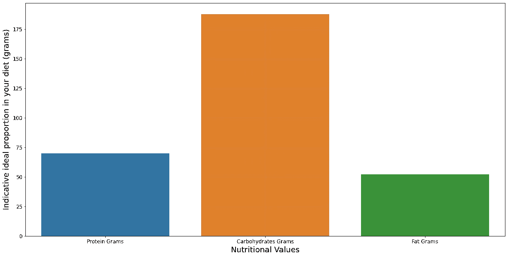
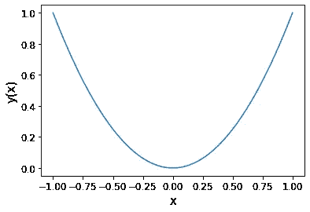
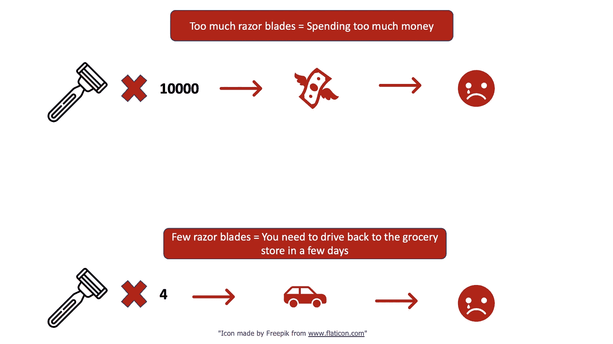
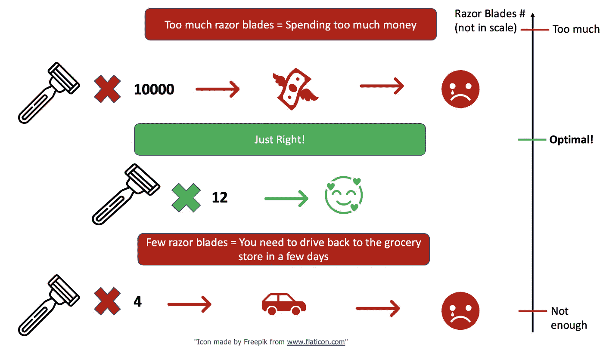
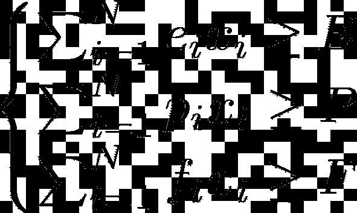
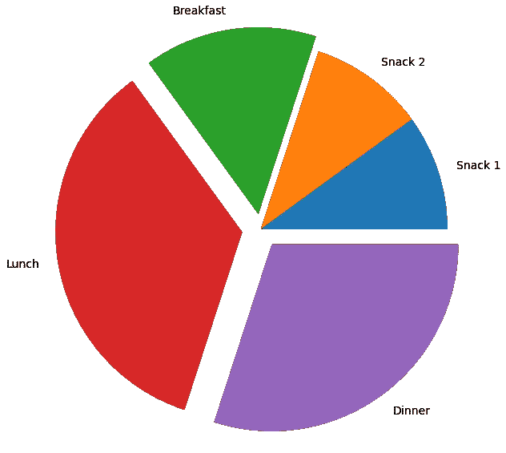

# 使用人工智能和 Python 构建您的饮食

> 原文：<https://towardsdatascience.com/building-your-diet-using-artificial-intelligence-with-python-d618d601ab02>

## 以下是如何使用线性优化来解决一个日常问题:我们的饮食


布鲁克·拉克在 [Unsplash](https://unsplash.com?utm_source=medium&utm_medium=referral) 拍摄的照片

> 免责声明！**我不是营养师，我也绝对不认为这篇文章可以取代一篇**。这个实验只从一个数据科学家的角度有效。当你制定你的食谱时，请不要太在意，并和有资格的专业人士谈谈。

当我在意大利的时候，我正在作为一名自由搏击手在被称为意大利武术学院的红魔队接受训练。我们在欧洲和世界各地旅行，像专业人员一样接受训练。

所有职业运动员都知道，当你在那些水平上训练时，没有什么是随机的。你需要睡好觉，你需要努力训练，你需要训练心态，你需要**吃好。良好的饮食对成为一名优秀运动员、保持健康和避免受伤至关重要。**

我说过并遵循多种营养计划，我知道这是一项多么艰难的工作。你需要考虑**多种因素，**比如处于特定的**体重范围**，拥有特定的**肌肉百分比**，拥有**良好的心态**，不要有过于严格的饮食，跟上**令人疲惫的训练课程**和卡路里范围。然后你必须**信任你的营养师，你的营养师也必须信任你。**可能的话，你的**教练**，你的**心理教练**，你的**理疗师**，你的**营养师**应该一起合作。这是一项艰巨的工作。确实是。

这意味着，正如我在引言中所说的，**这篇文章明确指出，人工智能无法为你建立完美的饮食。我坚信，至少在今天，我们仍然需要一个合适的医生来分析我们的情况，并给我们提供最佳的营养计划。**

尽管如此，我相信建立营养计划可以被形式化为一个(极其复杂的)最优化问题。很简单的说，你要吃饱(不能太多也不能太少)才能达到某个目标。
这意味着，如果我们意识到我们正在**大量简化**问题，我们可以尝试将这个任务视为优化任务，并构建一个算法来解决它。

让我们开始吧！

# 1.将问题形式化

在制定营养计划时，有很多事情需要考虑，我确信我忽略了其中的很多。

为此，我和我的一个朋友[**Cristian Beniamino Milito**](https://www.facebook.com/DottorMilitoBC/)**聊了聊，她是一位认证营养师。他同意我的看法，事情比我想象的要困难得多，但他给了我一些指导。**

**我们应该得到:**

1.  ****一个人每天每公斤摄入一克蛋白质**(例如，如果你体重 70 公斤，每天摄入 70 克蛋白质)**
2.  **碳水化合物应该是你每天摄入热量的一半。**
3.  **剩下的部分应该是**脂肪****

**因此，一个 70 公斤、1500 卡路里的人的脂肪、碳水化合物、蛋白质和 T21 的比例应该是这样的:**

****

**作者图片**

**现在实际上，我们更感兴趣的不是固定卡路里的数量，而是保持尽可能少的卡路里，因为我们有一定数量的蛋白质、碳水化合物和脂肪。**

**这就是**优化算法**的用武之地。我们将会有一个我们想要达到的卡路里的指示性数字，但是我们宁愿尝试**最小化它**，记住我们**严格地**必须满足我们计划中的蛋白质、碳水化合物和脂肪的数量。**

**我们来形式化一下。**

# **2.关于优化**

**以下是优化的技术定义:**

> **一个算法是一个**优化**，如果它在一个给定的域中找到一个函数的最小值或最大值。**

**例如，让我们以下面的函数为例:**

****

**作者图片**

**在这种情况下，函数的**域**就是区间[-1，1]。该域中函数的最小值是 x = 0，y = 0。我们想要一个能够找到最小值的算法。**

****

**作者图片**

**好吧，但是每个人都可以创建自己的自定义问题，这并不一定意味着它足够有趣。😅**

**我们为什么要研究**优化**？我们为什么要做出这种**算法**？为什么我们现在谈论这个问题**？****

****让我们这样陈述:我们在日常生活中大量使用优化。有时候我们想都没想就做了。****

****假设你正在购买杂货，你需要买刀片。当然，如果你买了 10000 个刀片，你的银行里就没有钱了。尽管如此，如果你买了 4 个剃须刀片，你需要在 4 天内再买一次(假设你每天都刮胡子)，你会在汽油上花更多的钱，这是不明智的。所以我们通常做的是在精神上解决一个**优化**问题。****

********

****作者图片****

****我们购买的数量介于两者之间:****

*   ****足够大，有足够数量的刀片，可以用一两个星期****
*   ******小的**足以在银行账户里还有剩余的钱:)****

********

****作者图片****

****这就是为什么**优化**有它的名字，并且被研究了这么久。我们可以使用的一个更友好的词是“ ***折衷*** ”:在给定某些条件(**域**)的情况下，我们想要目标的最佳值(**最小值或最大值**)。****

****所以现在我们知道为什么我们有这些优化算法了。太好了。现在，为什么我们现在使用它们？****

****我们现在的目标是优化卡路里的数量。特别是，我们希望**最小化它们**。同时，我们确实希望我们的营养计划**多样化，**我们希望它能满足我们想要达到的蛋白质、碳水化合物和脂肪的需求。****

****那么我们该怎么做呢？****

# ****3.关于单纯形****

****所以，让我们建立一个问题的数学模型。
正如我们说过的，我们正试图**最小化**一个成本- **损失**功能。为了使用下面的方法解决这个任务，损失函数必须是线性的。
这意味着给定一组变量 **x，******

********

****作者图片****

****我们的损失函数会是这样的:****

********

****作者图片****

****其中 **c** 是成本的固定向量。
在我们的例子中 **x** 是什么？还有什么是 **c** ？嗯，因为我们必须**最小化卡路里，**很明显 **c** 必须是每种食物所含卡路里的矢量，比如说，100 克。而且我们说过，**是固定的*** 。****

> *****我很乐意它不被固定，我也很乐意把它改成每公斤巧克力 0.5 卡路里，但不幸的是，它不是这样。****

****太棒了。现在，什么是 **x** ？如果你按照这个想法，我想现在很清楚，比如说，x1 必须是我们决定吃的“食物 1 号”的**单位**(相对于 100 克)。****

****太好了。比方说，我告诉你最小化 L(x ),我告诉你**没有别的。**好吧，在这种情况下，答案相当简单: **x = 0** ，L(0) = 0。但是听说不吃东西生存很有挑战性。****

****这意味着我们必须最小化函数，**假设**我们遵守**某些约束**。正如我们所说，这些限制是我们需要放进肚子里的**蛋白质、** **碳水化合物、**和**脂肪**的克数。****

****与我们之前所做的类似，我们现在将描述**三个**其他向量，我们称之为:****

*   ******f** ，那是**脂肪的矢量**(例如 100 克 1 号食物有 f_1 克脂肪)****

********

****作者图片****

*   ******e，**即**碳水化合物的矢量**(如 100 克 1 号食物中有 c_1 克碳水化合物)****

********

****作者图片****

> ****我没有用 **c** 因为我的损失函数里已经有了。我知道。糟糕的商业举动。遗憾的😒****

*   ******p，**即**蛋白质的载体**(如 100 克 1 号食品中有 p_1 克蛋白质)****

********

****作者图片****

****并且**约束**看起来像这样:****

********

****作者图片****

****其中 E、P 和 F 是我们需要摄入的碳水化合物、蛋白质和脂肪的克数。****

****简而言之，**是的**，我们希望尽可能少摄入热量，**但我们也**希望它们足以为我们的身体提供适量的能量。****

****由于我们有很多食物，我们会尝试所有满足上述约束的可能组合，并选择热量最少的一个(所谓的最小不是一种可能性)。这是一个**连续线性优化的例子，**有一个众所周知的算法可以用来解决它，它被称为 [**单纯形**](https://en.wikipedia.org/wiki/Simplex_algorithm) 。****

****具体说明这些算法如何工作超出了本文的范围。这么说吧，这个想法是我们在一个定义域内，这个定义域内函数的最小值或最大值位于极值点。****

****我们将使用单纯形算法，特别是使用 **Python** 和一个被称为**纸浆**的库。让我们开始吧。****

# ****4.动手编码****

## ****4.1 预处理****

****在这一点上，我们有我们需要的一切。让我们导入一些库:****

****现在，我们需要做的是**下载**数据**。它们在 [**Kaggle**](https://www.kaggle.com/datasets/trolukovich/nutritional-values-for-common-foods-and-products) 上，免费，随时可用( [CC0:公有领域](https://creativecommons.org/publicdomain/zero/1.0/))。******

****一旦我们这样做了，我们就可以像这样轻松地导入它们:****

****让我们总结一下:****

****信息很多，可能有点多。我们的简化实验真正需要的是下面的:****

*   ******上菜量******
*   ******碳水化合物******
*   ******总 _ 胖******
*   ******卡路里******
*   ******蛋白质******

****这就是我们真正需要的，所以让我们选择这些列:****

****太好了。我们继续吧。首先所有的 ***serving_size*** 看起来都是 100g。如果是这样的话，我们根本不需要那个列。让我们来看看:****

****没错。超级没用的专栏。让我们摆脱它。****

****现在我们需要将**碳水化合物**、**蛋白质、**和**总脂肪**列改为浮点数列:****

****现在，节食的一个重要步骤是变得多样化。我们将通过允许我们的模型只查看数据集的特定随机部分而不是整个数据集来实现这一目标。我们将这样做:****

> ****我说的“**多样化**”是指我们不会一周 7 天、一天 5 餐都吃同样的食物。通过查看数据集的随机部分，我们每天都有不同的食物数据集可供查看。****

****例如，本周一我们会有一份可以吃的食物清单。****

> *******注:**很容易想象，如果我们不考虑随机分割，而是尝试使用特定标准构建“日数据集”，这一步可以得到改进。还需要有某种领域知识来实现这个准则，我没有，因为我不是营养师。****

****在第一章中，我们讨论了一个人应该吃的食物的 T42 克数和卡路里。为了计算这些(指示性)值，我们可以使用以下两个函数:****

****假设我们的体重是 70 公斤，每天需要摄入 2000 卡路里的热量。我们需要吃东西:****

****就**克**而言，这意味着:****

## ****4.2 优化****

****我们所说和讨论的一切都可以用下面几行代码来实现和总结:****

****例如，一个体重 70 公斤的人需要摄入 1500 卡路里的热量，我们运行以下模型:****

****我们得到以下结果:****

## ****4.3 最终产品****

****让我们用这些函数来循环一天:****

****是时候运行它了！假设一个 70 公斤的人需要 3000 卡路里:****

****这就是饮食:****

# ****5.奖金！****

****这个模型有点太简单了。我敢肯定，如果你的营养师要给你一个你需要吃的食物清单，你会改变营养师，你是对的。****

****即使我们的模型被简化了，我们至少应该试着承认这样一个事实:我们每天吃 3-5 顿饭，并据此采取行动。现在，我们该怎么做呢？****

****嗯，有几种方法可以做到这一点。
最野蛮的是把食物的克数除以餐数。例如，如果我们应该吃 134 克羊肉(见**星期一**)，我们可以试着说:“让我们早上吃 134/3 克(哎哟……)，午餐吃 134/3 克，晚餐吃 134/3 克。”****

****这听起来一点也不好。于是我请我的天使( [**克里斯蒂安·贝尼米里托**](https://www.facebook.com/DottorMilitoBC/) **)** 告诉我怎么做。****

****他告诉我，就卡路里而言，我们应该这样想:****

*   ****第 1 号小吃约占 10%****
*   ****约 10%为**号小吃 2******
*   ****约 30%用于**晚餐******
*   ****35%用于**午餐******
*   ****15 %用于**早餐******

********

****作者图片****

****为了将这一点纳入我们的模型，我们需要做以下事情:****

*   ******随机将我们一天的数据分成 5 份(每顿饭一份)。我们已经考虑了 7 种不同的尺寸，记得吗？******

```
**split_size = np.linspace(0,len(data),8)**
```

****我们将做同样的事情，将我们的**日数据**拆分到**餐数据**中。总的来说，我们将把全长数据分成 7*5 个随机位。****

*   ******建立新的约束，**基于我们之前所说的。从形式上讲，新的约束如下所示:****

********

****作者图片****

****现在我们将有:****

********

****作者图片****

****为了尊重我们之前说过的话，我们将:****

*   ****d(早餐)= 1/0.15****
*   ****d(午餐)= 1/0.35****
*   ****d(晚餐)= 1/0.30****
*   ****d(零食 1)= d(零食 2) = 1/0.10****

****我们可以构建一个新的函数，我们称之为 **better_model，**，它会给我们一个**完整的饮食**，这就是我们所期望的。我所说的“完全饮食”指的是不仅按天划分，还按“餐”划分的饮食。****

****这是函数:****

****让我给你看一个 70 公斤的人摄入 1500 卡路里的结果:****

****这是**周一**的**饮食**。正如我们所见，你有 5 种不同的膳食:点心 1、点心 2、早餐、午餐和晚餐。****

****让我给你看更多的例子:****

****这就是我们将要吃的**周六午餐**:****

****这就是我们周日吃的**早餐:******

****这是我们周一**:**作为**小吃**吃的东西****

# ****6.考虑****

****嗯，有很多事情要考虑。第一个非常明显。**这种模式并不像认证营养师那样有效。**营养师总是在研究数量，什么对我们的身体好，什么对我们的身体不好，什么对我们的思想健康。尽管如此，通过这个模型，我们绝对可以肯定，我们在摄入尽可能低的热量的同时，仍然尊重我们对蛋白质、脂肪和碳水化合物的需求。****

****我们是怎么做到的？让我重述一下。****

1.  ******我们定义问题**。我们看到了我们应该吃多少卡路里，这是基于一个真实世界的专业人士的领域知识( [**克里斯蒂安·贝尼米里托**](https://www.facebook.com/DottorMilitoBC/) **)******
2.  ****我们定义了数学模型。我们用数学术语介绍了最优化的概念****
3.  ****我们看到了如何将我们的问题(建立饮食)解释为优化问题。****
4.  ******我们用 Python 和 PuLP 实现了代码**。****

****虽然我们在这方面还有很多需要改进的地方，而且营养师在这个过程中仍然需要 100%的参与，但我确实相信这可能是一个很好的起点，让我们可以在工作场所使用人工智能来提出**建议。******

# ****7.结论****

****如果你喜欢这篇文章，你想知道更多关于机器学习的知识，或者你只是想问我一些你可以问的问题:****

****A.在 [**Linkedin**](https://www.linkedin.com/in/pieropaialunga/) 上关注我，我在那里发布我所有的故事
B .订阅我的 [**简讯**](https://piero-paialunga.medium.com/subscribe) 。这会让你了解新的故事，并给你机会发短信给我，让我收到你所有的更正或疑问。
C .成为 [**推荐会员**](https://piero-paialunga.medium.com/membership) ，这样你就不会有任何“本月最大数量的故事”，你可以阅读我(以及成千上万其他机器学习和数据科学顶级作家)写的任何关于最新技术的文章。****