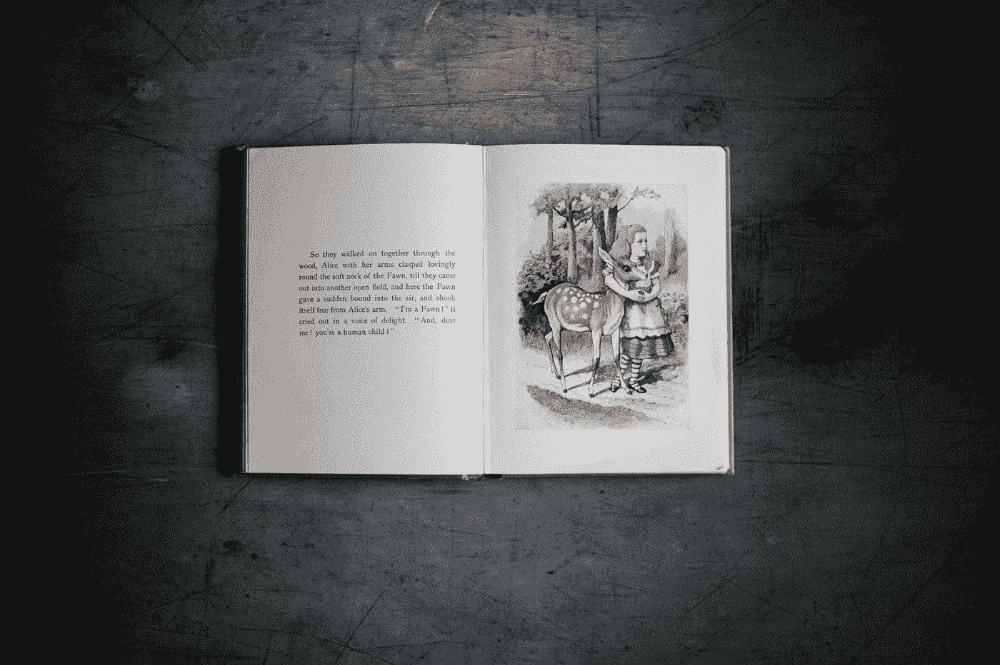
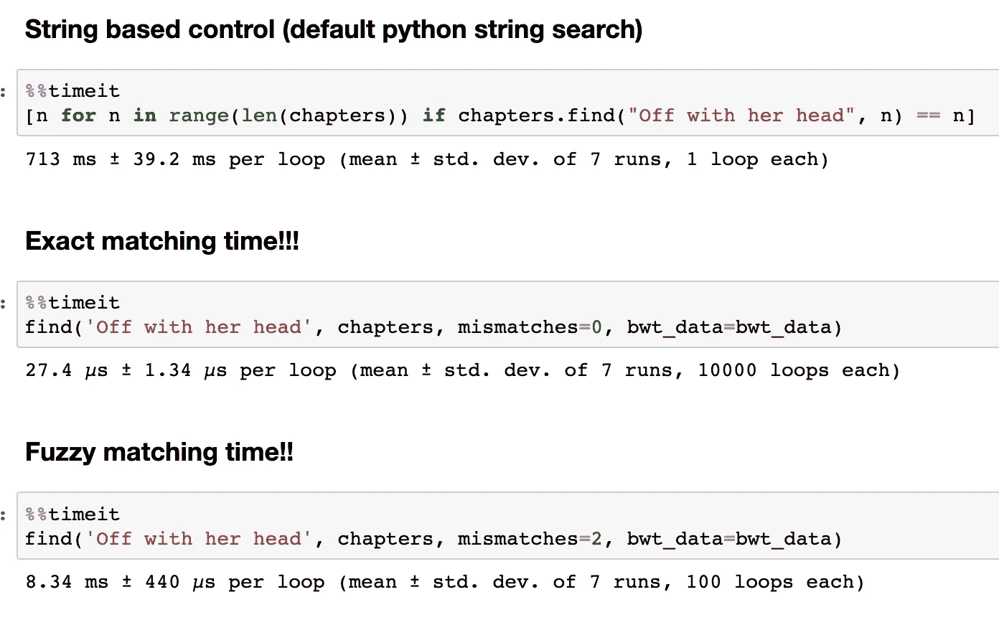

# Python 中的 Burrows Wheeler

> 原文：<https://towardsdatascience.com/burrows-wheeler-in-python-c07cbf71b3f0>

## 神奇的算法来索引和压缩大型字符串数据，然后迅速找到子字符串


照片由 [SOULSANA](https://unsplash.com/@soulsana?utm_source=medium&utm_medium=referral) 在 [Unsplash](https://unsplash.com?utm_source=medium&utm_medium=referral) 上拍摄

Burrows Wheeler 变换(BWT)是由 Michael Burrows 和 David Wheeler 在 1994 年开发的。简而言之，BWT 是一种字符串转换，作为无损压缩的预处理步骤。BWT 的实现展示了线性 O(n)性能和空间复杂度。最初的设计是为了用 bzip2 等技术准备压缩数据，BWT 在生物信息学中获得了突出的地位，允许快速绘制短阅读图谱，为高通量基因测序铺平了道路。

在本文中，我们将在 python 中实现一个简单的 BWT，然后展示如何使用简化的后缀数组 BWT 找到不匹配的小段。

**BWT 算法:**

1.  旋转字母:苹果变成['eappl '，' leapp '，' pleap '，' pplea '，' apple']
2.  按字母顺序排列旋转单词:['apple '，' eappl '，' leapp '，' pleap '，' pplea']
3.  取最后一列:elppa

苹果公司的 BWT 成为埃尔帕

[**BWT**](https://gist.github.com/glickmac/0f5bcd0a76d4913f7fbab1d46ac8d026)的简单实现

**用后缀数组实现模糊字符串搜索的 BWT**

在这个 python 实现中，我们将生成一个后缀数组，并使用它来执行 BWT。

**来自后缀数组的 BWT 算法:**

1.  生成后缀数组:苹果变成[5，0，4，3，2，1]
2.  后缀数组 BWT 的实现:apple + [5，0，4，3，2，1]变成:e$lppa
3.  查找匹配位置:apple 中的应用程序返回位置[0]
4.  查找不完全匹配:apple 中不匹配=1 的 apl 返回位置[0，1]

下面的代码块定义了用于查找不完全匹配的函数。 **generate_all("apple")** 下面块中的 terminal 函数返回一组唯一字母、BWT 输出、 [LF 映射](https://www.cs.cmu.edu/~ckingsf/bioinfo-lectures/bwt.pdf#:~:text=BWT%28unabashable%29%20LF%20Mapping%20%E2%88%91%20BWTSearch%28aba%29%20Start%20from%20the,b%20in%20the%20%EF%AC%81rst%20row%20of%20the%20range.)、唯一字母索引和后缀数组。

```
generate_all("apple")
```

**退货:**

({'a '，' e '，' l '，' p'}，
'e$lppa '，
{'e': [1，1，1，1，1，1，1，0]，
'p': [0，0，0，1，2，2，2，0]，
'l': [0，0，1，1，1，1，1，0]，
'$': [0，1，1，1，1，1，0]，【0

**在 BWT 数据中识别(模糊匹配)子串**

这里，我们通过以下算法识别 BWT 字符串中的匹配。所有搜索都是反向进行的，例如在苹果中查找应用程序，首先是查找“p”，然后是“pp”，然后是“app”。

> 注意:Last First (LF)属性是最后一列中第 I 次出现的字母[X]对应于第一列中第 I 次出现的字母[X]。

1.  在 BWT 的第一列中查找搜索字符串中最后一个字母的范围
2.  看看 BWT 最后一栏的相同范围
3.  在 LF 映射中查找下一个要搜索的字符。将“下一个字符”列[NC]设置为等于 LF 映射矩阵中观察范围的映射条目。将 LF 映射矩阵中的下一列[NC+1]设置为等于当前范围最后+1 行中的“下一个字符”值。
4.  找到第一行中“下一个字符”的范围，并使用 NC & NC+1 在“下一个字符”范围内找到正确的子范围。

```
find("app", 'apple', mismatches=0)
```

**回报:** [0]

我们还实现了一种方法来识别子序列中的错配。但是字符必须相同。

```
find("apZ", 'apple', mismatches=1)
```

**返回:** []“空返回，因为 **Z** 不在引用字符串中”

```
find("ape", 'apple', mismatches=1)
```

**退货:** [0]

[**执行后缀数组 BWT 的完整笔记本可以在 GitHub 上找到。**](https://github.com/glickmac/Burrows_Wheeler_in_Python)

# BWT &寻找爱丽丝梦游仙境



安妮·斯普拉特在 [Unsplash](https://unsplash.com?utm_source=medium&utm_medium=referral) 上的照片

我们下面的组块将展示 BWT 的有用性和速度。我们将从古腾堡的[项目下载一份](https://www.gutenberg.org/ebooks/11)[爱丽丝漫游奇境记](https://www.gutenberg.org/files/11/11-0.txt)，并从第 8 章开始阅读课文。这留给我们一个 61235 个字符的文本文档，由 3762 行 27432 个单词组成(对于我们的目的来说仍然很大)。然后我们将寻找短语**“砍掉她的头”**被提及的次数。我们将比较我们的 BWT 搜索和默认的 python 字符串搜索。

创建后缀数组并执行 BWT 大约需要 3 秒钟。这就是神奇的地方。创建 BWT 后，我们可以执行比标准字符串搜索快几个数量级的搜索。即使是模糊搜索也比标准字符串搜索快 100 倍。哇！



字符串搜索的速度性能比较。图片作者。

# 包裹

这篇文章的代码可以在我的个人[**GitHub**](https://github.com/glickmac/Burrows_Wheeler_in_Python) 上找到。将小的基因序列映射成一个巨大的基因组串的速度是 BWT 搜索在生物信息学工具中流行的原因，如[蝴蝶结](https://genomebiology.biomedcentral.com/articles/10.1186/gb-2009-10-3-r25#:~:text=Abstract%20Bowtie%20is%20an%20ultrafast%2C%20memory-efficient%20alignment%20program,with%20a%20memory%20footprint%20of%20approximately%201.3%20gigabytes.)和 [BWA](https://www.ncbi.nlm.nih.gov/pmc/articles/PMC2705234/) 。我的名字是[科迪·格利克曼](https://codyglickman.com/)，可以在 [LinkedIn](https://www.linkedin.com/in/codyglickman/) 上找到我。一定要看看我的其他一些文章！

<https://glickmancody.medium.com/membership>  </data-augmentation-in-medical-images-95c774e6eaae>  </building-a-beautiful-static-webpage-using-github-f0f92c6e1f02>  </pfam-database-filtering-using-python-164c3131c897> 