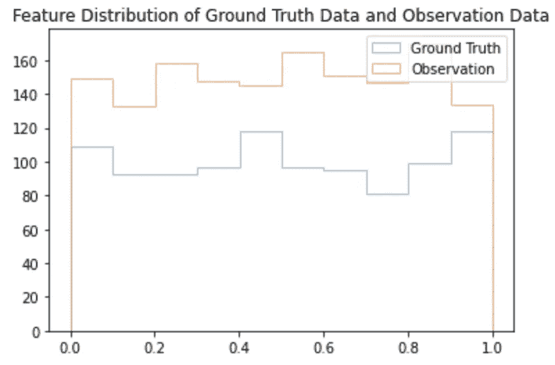
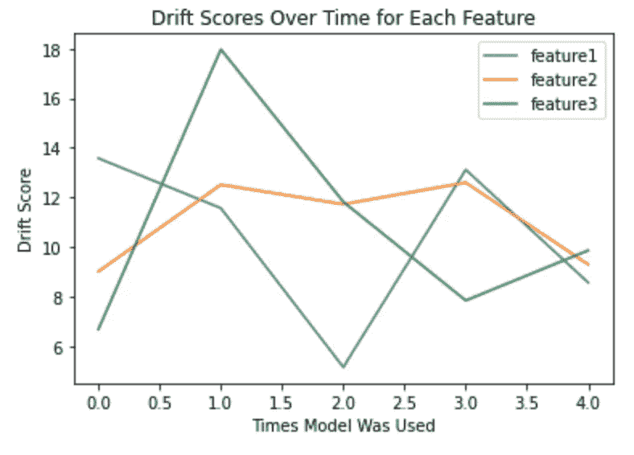

# 使用 Python 计算机器学习中的数据漂移

> 原文：<https://towardsdatascience.com/calculating-data-drift-in-machine-learning-53676ff5646b>

## 机器学习模型的漂移检测


图片来自[Unsplash](https://unsplash.com/photos/-EXF9shcTO0)Ralfs Blumbergs

本文旨在提供与 Python 中的数据漂移相关的直觉和实现。它将涵盖两种计算漂移的方法之间的实现和差异，即交叉熵和 KL 散度。以下是这篇文章的提纲。

## 目录

*   什么是数据漂移？
*   漂移指标
    -交叉熵
    - KL 散度
*   解决方案架构
    -需求
*   实现
    -生成数据
    -训练模型
    -生成观察值
    -计算漂移
    -可视化随时间的漂移
*   计算漂移的障碍
*   结束语
*   资源

# 什么是数据漂移？

MLOps 是构建成功的机器学习模型并将其部署到生产中的一个不可或缺的组件。数据漂移可以归入 MLOps 中的模型监控类别。它指的是量化观察数据相对于训练数据的变化。随着时间的推移，这些变化的影响可能会对模型生成的预测质量产生巨大影响，通常会变得更糟。跟踪与训练特征和预测相关联的漂移对于模型监控和识别何时应该重新训练模型应该是不可或缺的。

你可以参考我的另一篇文章，了解在生产环境中监控机器学习模型背后的概念和架构的更多细节[这里](https://pub.towardsai.net/monitoring-machine-learning-models-in-production-1633f23d1e0b)。

您可能不希望监控与模型预测/特征相关联的漂移的唯一情况是，在生成预测的基础上定期重新训练模型。这可能是与时间序列模型的许多应用相关的常见事件。然而，还有各种其他的东西可以跟踪，以确定您正在生成的模型的质量。本文将主要关注与经典机器学习(分类、回归和聚类)相关的模型。

# 漂移度量

下面概述的两个度量标准都是量化一对概率分布相似程度的统计度量。

## 交叉熵

交叉熵可以由以下公式定义:


交叉熵公式。图片取自[交叉熵维基百科](https://en.wikipedia.org/wiki/Cross_entropy)【2】。

*   p:真实概率分布
*   问:估计概率分布

从信息论的角度来看，熵反映了消除不确定性所需的信息量[3]。请注意，分布 A 和 B 的交叉熵将不同于分布 B 和 A 的交叉熵。

## KL 散度

Kullback Leibler 散度，也称为 KL 散度，可通过以下公式定义:


*   p:真实概率分布
*   问:估计概率分布

然后，kull back–lei bler 散度被解释为使用针对 Q 优化的代码而非针对 P 优化的代码对 P 的样本进行编码所需的比特数的平均差异[1]。请注意，分布 A 和 B 的 KL 散度将不同于分布 B 和 A 的 KL 散度。

请注意，这两种度量都不是距离度量。这是因为度量缺乏对称性。

```
entropy / KL divergence of A,B != entropy / KL divergence of B,A
```

## 解决方案架构

下图概述了机器学习生命周期在合并模型监控时的运行方式。如上面的需求所示，为了监控模型的性能，应该从训练阶段保存各种数据。即用于训练模型的特征和目标数据。这将提供一个比较新观察结果的基础事实数据源。


模型监控架构。图片由作者提供。

## 要求

以下模块和版本用于在本地运行实现中显示的代码。它们都是著名的数据科学/分析/机器学习库，因此安装特定版本对大多数用户来说应该不是问题。

```
Python=3.9.12
pandas>=1.4.3
numpy>=1.23.2
scipy>=1.9.1
matplotlib>=3.5.1
sklearn>=1.1.2
```

# 履行

我将通过一个使用合成数据的例子来展示如何计算数据随时间的漂移。请注意，为我生成的值将与您生成的值不一致，因为它们是随机生成的。此外，由于它是随机生成的，所以从提供的可视化/数据中没有任何真正有意义的结果可以解释。目的是为您的应用程序提供可重用和可重新配置的代码。

## 生成数据

上面的脚本将生成一个由 1000 行和列`uuid, feature1, feature2, feature3, target`组成的合成数据集。这将是我们训练模型的基础数据。


## 火车模型

出于本教程的目的，上面的脚本将允许您根据我们上面生成的特征和目标创建一个随机森林回归模型。假设这个模型将被推送到生产环境中，并且每天都会被调用。

## 生成观察结果

上面的脚本将在模型被生产和调用的第一天生成与特性相关的观察。我们现在可以将地面实况训练数据相对于观察数据的差异可视化。


可视化特征 1 的训练数据与观察数据。图片由作者提供。

从上图中可以看出，在模型生产的第一天，对特征的观察比地面实况多。这是一个问题，因为我们不能比较两个长度不同的值列表。如果我们试图比较两个不同长度的数组，将会产生错误的结果。现在为了计算漂移，我们需要使观测值的长度等于地面真实数据的长度。我们可以通过创建 N 个桶，并确定每个桶中的观察频率来做到这一点。实质上是创建一个直方图。下面的代码片段将可视化这些分布的相互关系。



地面实况数据的特征分布与特征 1 的观测数据。图片由作者提供。

既然两个数据集大小相同，我们可以比较两个分布中的漂移。

## 计算漂移

上面的脚本概述了如何计算与观察数据相关的相对于训练数据的漂移(使用`scipy`中的`entropy`实现)。它首先通过`matplotlib`中的`hist`方法将输入向量的大小标准化为相同长度，通过`softmax`函数将这些值转换为概率，然后通过`entropy`函数最终计算漂移。

## 可视化随时间的漂移



随着模型在生产中使用时间的推移，可视化与模型中每个特征相关联的漂移分数。图片由作者提供。

根据您为数据集生成的结果，建议确定某个阈值，如果模型所依赖的大多数**重要**特征的漂移分数超过该阈值，这将是重新训练模型的有力指标。通过`sklearn`或 SHAP 之类的东西，可以很容易地识别基于树的模型的特征重要性。

# 计算漂移的障碍

在计算你正在使用的机器学习模型的数据漂移时，你可能会遇到各种各样的障碍。

1.  处理值为 0 的特征/预测。这将产生与两种漂移实现相关的零分频误差。解决这个问题的一个快速简单的方法是用一个非常接近零的小值来代替零。由于监控漂移可能是逐案进行的，所以要主动了解这可能对您正在处理的问题产生什么影响。
2.  比较一对不同长度的分布。假设您根据与每个功能和目标相关联的 1，000 次观察来训练模型。然而，当您每天生成预测时，根据平台获得的流量，功能和目标的观察量从 1，000 到 10，000 不等。这是有问题的，因为你不能比较两个不同大小的分布。要解决这个问题，您可以使用上述实现中的宁滨方法，将训练数据和观察值归入相同大小的组中，然后计算该数据之上的漂移。这可以通过`matplotlib`库中的`histogram`方法轻松完成。
3.  使用`softmax`函数将频率转换为概率时，获取`NaN`值。这是因为`softmax`函数依赖于指数。您将在 softmax 的输出中收到`NaN`结果，因为计算机无法计算大数的指数。如果是这种情况，您可能希望研究另一个不是 softmax 的实现，或者研究将您传入的值规范化，以便 softmax 可以工作。

# 结束语

本文重点讨论了在经典机器学习的应用中如何计算数据漂移。我回顾了 KL 散度和交叉熵等常见漂移计算指标背后的直觉和实现。

此外，本文概述了个人在试图计算漂移时会遇到的常见障碍。即，当有零值时被零除的误差，以及关于比较一对大小不同的分布的问题。请注意，这篇文章主要对那些不经常重新训练您的模型的人有帮助。模型监控将作为一种手段来衡量模型的成功，并确定它何时因漂移而表现倒退。两者都是模型开发阶段再培训或重复的指标。

你可以在我的 GitHub 页面[这里](https://github.com/vatsal220/medium_articles/tree/main/data_drift)查看与本教程相关的资源库。

如果你想转型进入数据行业，并希望得到经验丰富的导师的指导和指引，那么你可能想看看最敏锐的头脑。Sharpest Minds 是一个导师平台，导师(他们是经验丰富的实践数据科学家、机器学习工程师、研究科学家、首席技术官等。)将有助于你的发展和学习在数据领域找到一份工作。点击查看[。](https://www.sharpestminds.com/?r=vatsal-patal)

# 资源

*   [1]https://en.wikipedia.org/wiki/Kullback-Leibler_divergence
*   [2]https://en.wikipedia.org/wiki/Cross_entropy
*   [3][https://stats . stack exchange . com/questions/357963/what-the-difference-cross-entropy-and-KL-divergence](https://stats.stackexchange.com/questions/357963/what-is-the-difference-cross-entropy-and-kl-divergence)
*   [https://docs . scipy . org/doc/scipy/reference/generated/scipy . stats . entropy . html](https://docs.scipy.org/doc/scipy/reference/generated/scipy.stats.entropy.html)

如果你觉得这篇文章有用，这里有一些我写的其他文章，你可能也会觉得有用。

[](/word2vec-explained-49c52b4ccb71) [## Word2Vec 解释道

### 解释 Word2Vec 的直观性&用 Python 实现它

towardsdatascience.com](/word2vec-explained-49c52b4ccb71) [](/link-prediction-recommendation-engines-with-node2vec-c97c429351a8) [## 使用 Node2Vec 的链接预测推荐引擎

### 在 Python 中使用节点嵌入进行链接预测

towardsdatascience.com](/link-prediction-recommendation-engines-with-node2vec-c97c429351a8) [](/recommendation-systems-explained-a42fc60591ed) [## 推荐系统解释

### 用 Python 解释和实现基于内容的协同过滤和混合推荐系统

towardsdatascience.com](/recommendation-systems-explained-a42fc60591ed) [](/text-summarization-in-python-with-jaro-winkler-and-pagerank-72d693da94e8) [## 用 Jaro-Winkler 和 PageRank 实现 Python 中的文本摘要

### 用 Jaro-Winkler 和 PageRank 构建一个文本摘要器

towardsdatascience.com](/text-summarization-in-python-with-jaro-winkler-and-pagerank-72d693da94e8)