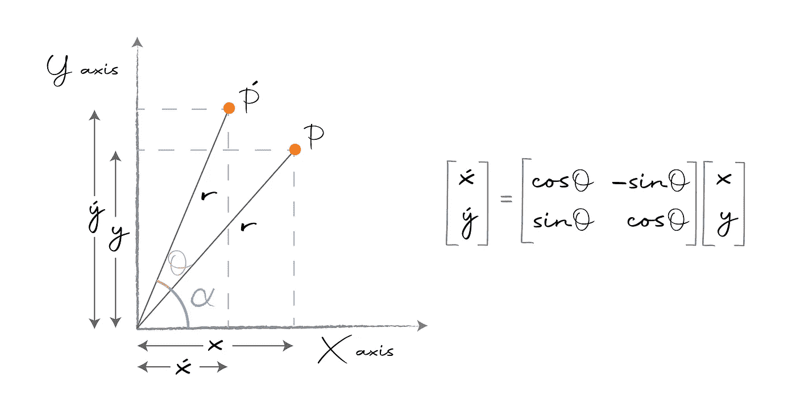
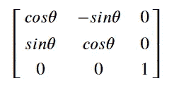
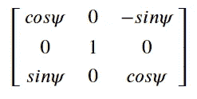
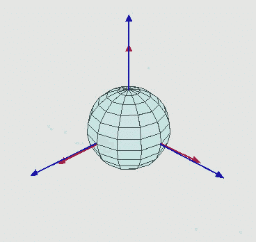
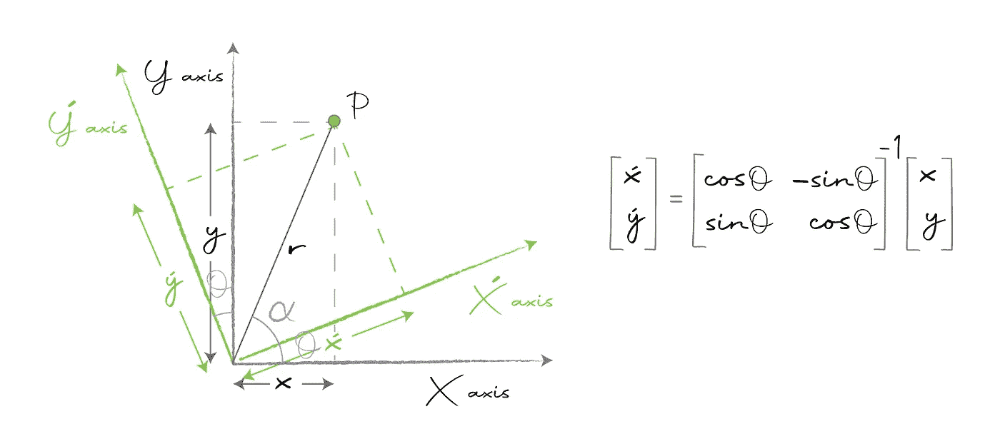
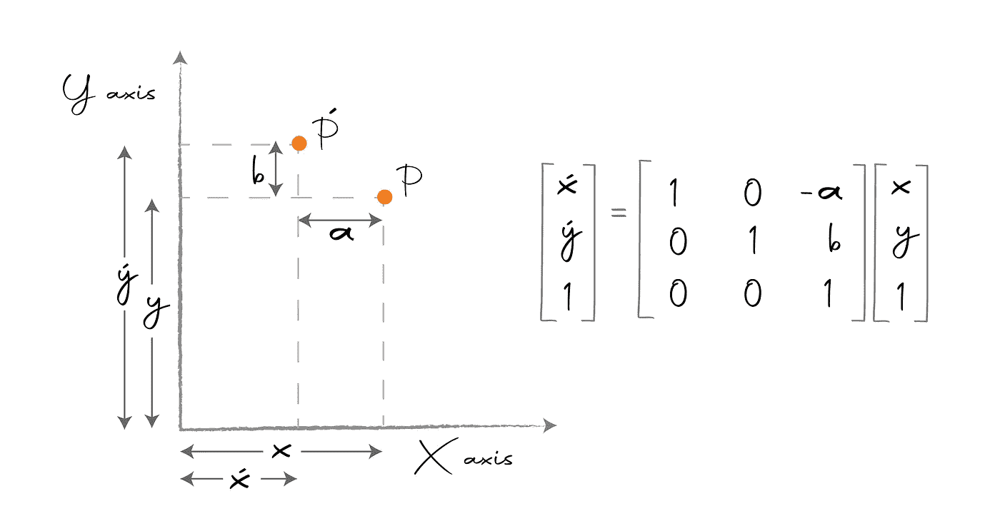
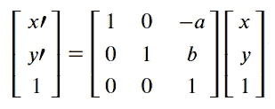
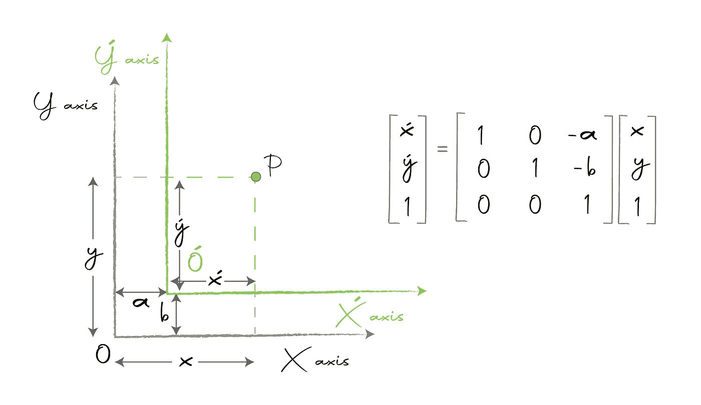
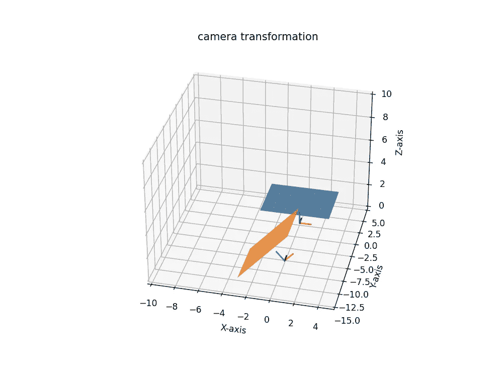

# Python 中带示例的相机外部矩阵

> 原文：<https://towardsdatascience.com/camera-extrinsic-matrix-with-example-in-python-cfe80acab8dd>

## Python 中图像形成和相机校准综合教程系列的第 2 部分


# 介绍

在[之前的文章](/image-formation-and-pinhole-model-of-the-camera-53872ee4ee92)中，我已经介绍了相机成像的概念，并简要讨论了相机的外在和内在。

在这篇文章中，我们将深入探讨相机外部性，也称为相机姿态，并通过 Python 中的一个实际例子来加强我们的理解。

# 相机外部

摄像机可以位于世界上的任何地方，它可以指向任何方向。我们希望从摄像机的角度来观察世界上的物体，这种从世界坐标系到摄像机坐标系的转换称为摄像机外部或摄像机姿态。


文字坐标系 vs 相机坐标系

那么，怎样才能找到相机的姿势呢？一旦我们弄清楚相机是如何变换的，我们就能找到从世界坐标系到相机坐标系的变换。我们将详细探讨这个想法。

具体来说，我们需要知道相机是如何定向的，以及它在世界空间中的位置，有两个变换可以帮助我们:

*   帮助定向相机的旋转变换。
*   帮助移动相机的平移变换。

让我们详细看一下每一个。

# 旋转

## 通过旋转改变坐标

让我们看看将一个点旋转一个角度的变换。让我们在ℝ举一个简单的例子，我们将点𝑃在 XY 平面上绕原点旋转一个角度𝜃，得到点𝑃′，如下图所示:



旋转变换。

𝑃的坐标是(𝑥,𝑦)，𝑃′的坐标是(𝑥′,𝑦′).我们需要找到(𝑥′,𝑦′).

```
From the figure,
      sinα = y/r , cosα = x/r − [1]
⟹    xsinα = ycosα − [2]
also, x′ = rcos(θ+α)
⟹    x′ = (x/cosα) ∗ cos(θ+α) (from [1])
but,  cos(θ+α) = cosθcosα − sinθsinα
⟹    x′ = (x/cosα) ∗ (cosθcosα − sinθsinα)
⟹    x′ = xcosθ − xsinα ∗ (sinθ / cosα)
⟹    x′ = xcosθ − ycosα ∗ (sinθ / cosα) (from [2])
⟹    x′ = xcosθ − ysinθSimilarly,
      y′ = rsin(θ+α)
⟹    y′ = (y/sinα) ∗ sin(θ+α) (from [1])
but,  sin(θ+α) = sinθcosα + cosθsinα
⟹    y′ = (y/sinα) ∗ (sinθcosα + cosθsinα)
⟹    y′ = ycosθ + ycosα ∗ (sinθ / sinα)
⟹    y′ = ycosθ + xsinα ∗ (sinθ / sinα) (from [2])
⟹    y′ = ycosθ + xsinθ
⟹    y′ = xsinθ + ycosθHence we have,
      x′ = xcosθ − ysinθ
      y′ = xsinθ + ycosθ
```

旋转是线性运算，上面的等式可以表示为矩阵乘法:


旋转点𝑃′的坐标

这个操作是线性变换。这里，我们变换点，保持轴或基础固定。

## 延伸至 R3

我们可以很容易地将旋转变换推广到𝐑。𝐑绕标准 x 轴、y 轴和 z 轴旋转的变换矩阵如下:



绕 Z 轴旋转


绕 X 轴旋转



绕 Y 轴旋转

## 内在旋转与外在旋转

上述变换执行围绕标准轴的旋转。轴会随时固定。这叫做外旋。还有另一种称为固有旋转的旋转类型，我们在每一步都围绕其相对轴旋转对象，如下所示:



内在旋转。Euler 2 . gif:juansempere 衍生作品:Xavax，CC BY-SA 3.0<[https://creativecommons.org/licenses/by-sa/3.0](https://creativecommons.org/licenses/by-sa/3.0)>，通过维基共享

内旋很难用欧几里得代数来执行，我们将坚持外旋。

## 通过旋转改变基底

在基变换中，目标是找到一个点在新基下的坐标。该点将被固定。

在下面的例子中，𝑋𝑌轴已经旋转了一个角度𝜃得到𝑋′𝑌′.给定旧基点𝑋𝑌上𝑃点的坐标，我们的目标是找到新基点𝑋′𝑌′.上𝑃点的坐标



旋转 XY 轴

𝑃至𝑋𝑌的坐标为(𝑦𝑥)，至𝑋′𝑌′的坐标为(𝑦′).𝑥′)我们的目标是找到(𝑥′，𝑦′).

```
From the figure,
      sinα = y′/r , cosα = x′/r − [1]
⟹    x′sinα = y′cosα − [2]
also, x = rcos(θ+α)
⟹    x = (x′/cosα) ∗ cos(θ+α) (from [1])
but,  cos(θ+α) = cosθcosα − sinθsinα
⟹    x = (x′ / cosα) ∗ (cosθcosα − sinθsinα)
⟹    x = x′cosθ − xsinα ∗ (sinθ / cosα)
⟹    x = x′cosθ − y′cosα ∗ (sinθ / cosα) (from [2])
⟹    x = x′cosθ − y′sinθSimilarly,
      y = rsin(θ+α)
⟹    y = (y′/sinα) ∗ sin(θ+α) (from [1])
but,  sin(θ+α) = sinθcosα + cosθsinα
⟹    y = (y′/sinα) ∗ (sinθcosα + cosθsinα)
⟹    y = y′cosθ + y′cosα ∗ (sinθ / sinα)
⟹    y = y′cosθ + x′sinα ∗ (sinθ / sinα) (from [2])
⟹    y = y′cosθ + x′sinθ
⟹    y = x′sinθ + y′cosθHence we have,
      x = x′cosθ − y′sinθ
      y = x′sinθ + y′cosθ
```

上述等式可以矩阵形式表示为:


我们的目标是找到(𝑥′,𝑦′).所以，我们把矩阵移到另一边，取它的逆:


基数变化变换

理解线性变换和基变换之间的区别是非常重要的。

接下来我们将看到这两种转换是如何关联的。

## 线性变换与基变换的关系

如果你观察，基变换矩阵是线性变换矩阵的逆矩阵。这意味着，如果我们知道相机变换矩阵——负责在世界上旋转和移动相机的矩阵，我们可以对其求逆来获得基矩阵的变化，这可以帮助我们找到相机周围点的坐标。

# 翻译

## 通过平移改变坐标

平移的想法很简单-给定一个点𝑃，我们将它移动一个偏移量以获得点𝑃′，如下图所示:



翻译转换

这里，我们将坐标为(𝑦𝑥)的点𝑃移动一个偏移量(𝑏−𝑎)，得到坐标为(𝑦′).𝑥′)的点𝑃′我们的目标是找到(𝑥′，𝑦′).

```
from the figure,
      x′ = x - a
      y′ = y + b
```

我们不能用矩阵乘法来表达上面的方程——至少不能用目前的表达方式。诀窍是增加一个额外的维度，然后我们可以将平移表示为线性变换，如下所示:



作为线性变换的翻译

用额外维度表示的坐标称为齐次坐标。

为了从齐次坐标中恢复欧几里得坐标，我们简单地除以最后一个元素，如下所示:

```
[x, y, 1] ≅ [x/1, y/1] = [x, y]
```

一般来说，我们在齐次空间中执行所有操作，因为这很容易操作，最后，当我们完成时，我们转换回欧几里得空间。稍后我们将更详细地了解这一点。

## 通过翻译改变基础

就像我们之前看到的，在基变换中，我们变换的是轴，而不是点。在下面的例子中，我们将𝑋𝑌轴移动一个偏移量来得到𝑋′𝑌′.我们的目标是找到𝑃点在𝑋′𝑌′.新坐标轴上的坐标



平移 XY 轴

𝑃相对于旧轴的坐标是𝑋𝑌(𝑥，𝑦)，相对于新轴的坐标是𝑋′𝑌′(𝑥′,𝑦′).)这里的偏移量是(𝑎，𝑏).

```
from the figure,
      x′ = x - a
      y′ = y - b
```

同样，为了将上述方程表示为矩阵乘法，我们使用齐次坐标:


通过翻译改变基础

即使在翻译中，线性变换和基变换的变化也是相反的。

# 外部摄像机矩阵

我们已经分别研究了旋转和平移；但是，我们可以使用如下所示的矩阵组合一次执行这两个操作:


旋转+平移变换

这里，𝑅是形状(3，3)的旋转矩阵，𝑂是形状(3，1)的平移偏移量。我们可以通过对最终的变换矩阵求逆来得到基矩阵的变化。这种形状基矩阵(4，4)的变化被称为外部摄像机矩阵，由𝐸.表示

使用𝐸，我们可以找到相机上任何一点的坐标。


## 自由度

摄像机外部矩阵有 6 个自由度。沿 X、Y、Z 轴的三个旋转角度和三个平移偏移。

## 简化矩阵

我们可以看到相机外部矩阵的最后一行只有 0 和 1。它不会给转换增加任何价值，它的唯一目的是增加一个额外的维度——这意味着，正如我们将在下面的示例中看到的，我们可以很好地删除最后一行。

# 例子

结尾的动手例子就像饭后甜点——没有甜点的饭是不完整的！

## 安装

包含所有代码的 GitHub 库可以在[这里](https://github.com/wingedrasengan927/Image-formation-and-camera-calibration)找到。

您可以通过运行以下命令来设置环境:

```
# create a virtual environment in anaconda
conda create -n camera-calibration-python python=3.6 anaconda
conda activate camera-calibration-python# clone the repository and install dependencies
git clone https://github.com/wingedrasengan927/Image-formation-and-camera-calibration.git
cd Image-formation-and-camera-calibration
pip install -r requirements.txt
```

**注意:**这里假设你已经安装了 anaconda。

我们将使用两个主要的库:

*   [**pytransform3d:**](https://github.com/rock-learning/pytransform3d) 该库具有强大的 3d 空间可视化和变换功能。
*   [**ipympl:**](https://github.com/matplotlib/ipympl)**这是一个游戏规则改变者。它使 matplotlib 绘图具有交互性，允许我们在笔记本中实时执行平移、缩放和旋转，这在处理 3D 绘图时非常有用。**

## **直觉例子**

**在这个例子中，我们将首先为旋转和平移创建变换矩阵，将它们合并成一个矩阵，并使用它来变换摄像机。然后，我们将通过对这个变换矩阵求逆来创建基变换矩阵，并将其应用于一个点，然后将其坐标从世界坐标系更改为摄像机坐标系。**

**下面是示例的笔记本，也可以在[存储库](https://github.com/wingedrasengan927/Image-formation-and-camera-calibration)中找到。**

**让我们一步一步地分解它:**

*   **首先，我们导入必要的库。`utils.py`文件包含所有必要的助手函数。神奇的命令`%matplotlib widget`启用 ipympl 后端，这使我们能够玩的阴谋。**
*   **接下来，我们定义必要的参数，如角度，旋转顺序，平移偏移，焦距和图像平面的大小。焦距和图像平面只是为了演示，我们将在下一篇文章中详细讨论它们。**
*   **这里我们保持简单，围绕标准的 y 轴旋转𝜋/4 角。然而，我们可以绕任意轴旋转任意次。只是要注意旋转的顺序。我们的平移偏移量是`[0, -8, 0]`，它是沿 Y 轴的 8 个单位。**
*   **使用这些参数，我们为旋转和平移创建变换矩阵。**
*   **接下来，我们使用变换矩阵变换最初位于原点的相机，并绘制它。由于 ipympl，剧情是交互式的。尽量摆弄剧情，玩不同的视角。**

****

*   **接下来，我们通过对变换矩阵求逆来创建基矩阵的变化，这是摄像机的外部矩阵。**
*   **最后，我们取一个世界坐标为`[-1/√2, -8, 1/√2]`的点，应用基变换的变换，得到摄像机的坐标为`[0, 0, 1]`。这是有意义的，因为该点就在相机 Z 轴的正上方。**

# **结论**

**我希望你喜欢这篇文章。在下一篇文章中，也就是系列的第 3 部分[，我们将讨论相机的内在特性，看看这些点是如何投射到相机的图像平面上的。如果你有任何疑问或问题，请在下面的评论中告诉我。](/camera-intrinsic-matrix-with-example-in-python-d79bf2478c12)**

# **参考**

1.  **[计算机视觉简介— Udacity](https://classroom.udacity.com/courses/ud810)**

# **图像制作者名单**

**本文中的所有图片和数字，除非在标题中明确提及其来源，否则均由作者提供。**