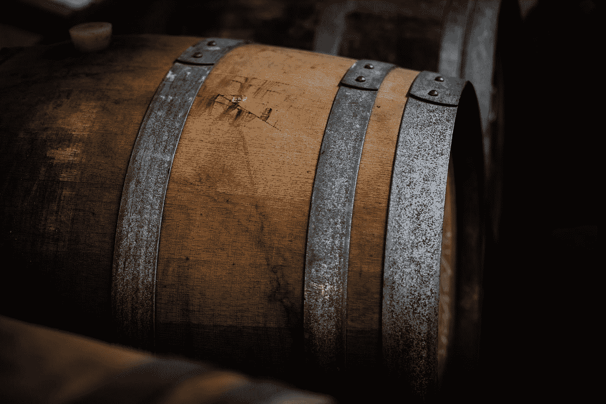
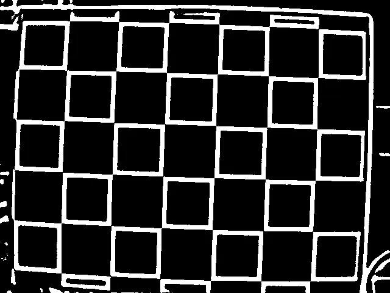
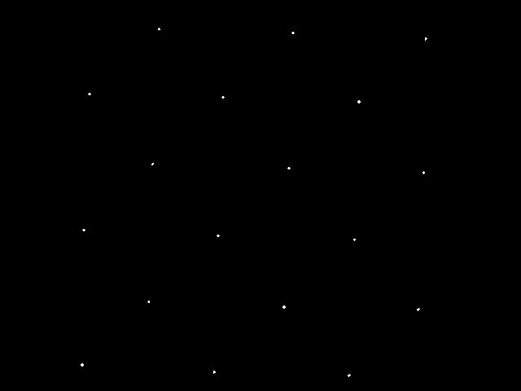
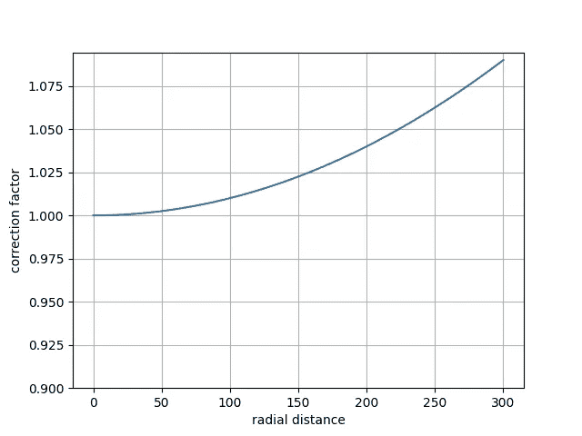
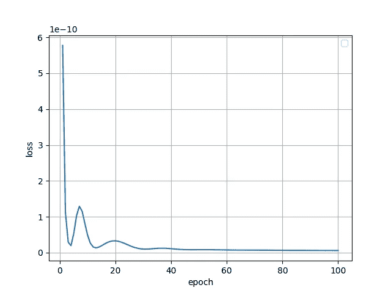
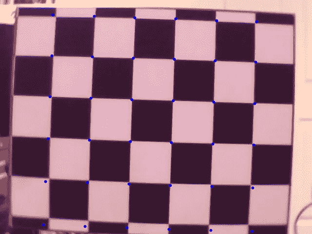
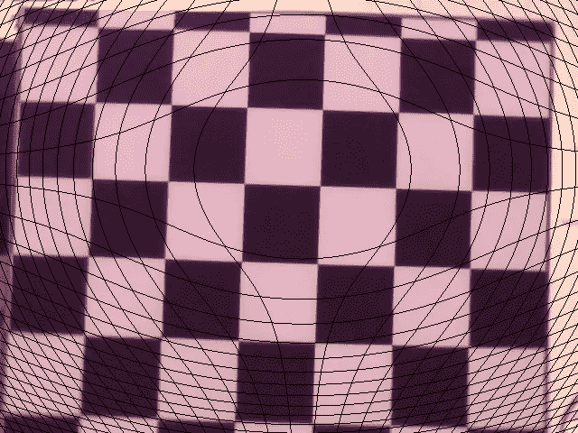
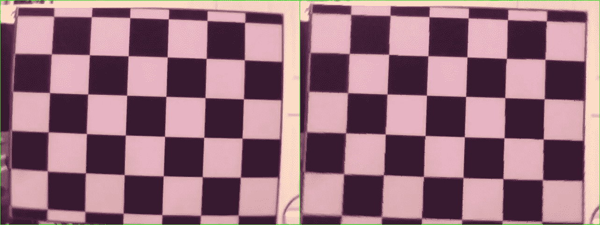

# 梯度下降的摄像机径向失真补偿

> 原文：<https://towardsdatascience.com/camera-radial-distortion-compensation-with-gradient-descent-22728487acb1>

## 如何基于简单模型来表征相机-镜头对的径向畸变



[Charl Folscher](https://unsplash.com/es/@charlfolscher?utm_source=medium&utm_medium=referral) 在 [Unsplash](https://unsplash.com?utm_source=medium&utm_medium=referral) 上拍摄的照片

消费者级的相机和镜头既便宜又随处可见。不幸的是，与工业上的同类产品不同，它们并不是用来作为计算机视觉应用中精确测量的工具。

在各种失真类型中，影响低档相机和镜头最明显的是*径向失真*。径向失真是场景中对象的视角与图像中该对象出现的像素之间的非线性。在光学中心附近，几乎感觉不到这种效应，但随着我们径向远离光学中心，失真会变得更加明显。通常，远离光学中心的像素看起来会比应该的更靠近中心。图像的角似乎被拉向了中心。这种现象被称为[桶形失真](https://en.wikipedia.org/wiki/Distortion_(optics))，因为从摄像机垂直方向看，一个矩形物体会变成一个圆形的“桶”(见图 1)。


图 1:显示径向失真的平面棋盘图像。作者的形象。

# 失真补偿

这个故事的目的是根据一个简单的模型来描述相机镜头对的径向畸变。一旦我们知道了失真参数，我们就能够补偿物体的像素位置，得到未失真的像素位置。

> 未失真？！那是一个词吗？

> 我不确定。但为了简明起见，我将使用[可能是假的]动词“不失真”来表示“补偿径向失真”。

您可以在[这个库中](https://github.com/sebastiengilbert73/tutorial_distortion_calibration)克隆代码和示例图像。

图 1 的棋盘图像将为我们提供共线特征点。在没有径向失真的情况下，场景中共线点的像素位置应该是共线。由于它们在视觉上不共线，我们将构建一个参数可调的模型，将扭曲的像素点映射到未扭曲的点上。我们的目标函数将是**棋盘上属于一条线**的未失真像素点的共线度。

## 特征点

第一步是提取图 1 中的特征点。

```
# Find the checkerboard intersections, which will be our feature points that belong to a plane
    checkerboard_intersections = checkerboard.CheckerboardIntersections(
        adaptive_threshold_block_side=adaptive_threshold_block_side,
        adaptive_threshold_bias=adaptive_threshold_bias,
        correlation_threshold=correlation_threshold,
        debug_directory=output_directory
    )
    intersections_list = checkerboard_intersections.FindIntersections(checkerboard_img)
```

类型为*棋盘交叉点*的对象将彩色图像转换为灰度图像，然后应用[自适应阈值](https://medium.com/towards-data-science/when-a-uniform-threshold-is-not-enough-b16da0fbb4e1)。结果是一个二进制图像，其中正方形交叉点非常清晰。正方形的内部对于其余的处理没有任何价值。



图 2:阈值模式。图片由作者提供。

图 2 的阈值图像与设计用来强调两种交叉的合成图案图像相关联。


图 3:两种合成模式。图片由作者提供。

对两幅相关图像进行阈值处理，以获得最高峰值(见图 4)。



图 4:阈值相关图像之一。图片由作者提供。

检测阈值化的相关图像中的斑点，并为每个斑点计算质心，产生交叉点列表。


图 5:彩色小圆圈显示了找到的特征点。图片由作者提供。

## 径向畸变模型

我们将考虑一个基本的径向失真模型——非常简单:一个二次校正因子，它是距光学中心距离的函数。未失真半径将是失真半径和校正因子的乘积。



图 6:作为径向距离函数的修正系数。图片由作者提供。

这种失真模型只有三个参数:

*   光学中心(cx，cy)。不一定与图像中心重合(w/2，h/2)。
*   二次系数α。当α > 0 时，出现桶形失真(见图 1)。当α < 0, we have pincushion distortion (the image corners appear stretched outwards). When α = 0, there is no radial distortion.

## Model optimization

We are facing a nonlinear optimization problem: finding the optimal parameters (cx, cy) and α that will project the intersection points that we found (see Figure 5) in such a way that they form straight lines. To do this, we’ll create a *PyTorch* 模型存储我们的三个失真参数时。

```
class DistortionParametersOptimizer(torch.nn.Module):
    def __init__(self, center, alpha, image_sizeHW, zero_threshold=1e-12):
        super(DistortionParametersOptimizer, self).__init__()
        self.center = torch.nn.Parameter(torch.tensor([center[0]/image_sizeHW[1], center[1]/image_sizeHW[0]]).float())
        self.alpha = torch.nn.Parameter(torch.tensor(alpha).float())
        self.image_sizeHW = image_sizeHW
        self.zero_threshold = zero_threshold
```

这个类还需要知道图像的大小，因为为了数值的稳定性，像素坐标将被规范化为(-1，1)。*distortionparametersoptimizer . forward()*方法返回一批均方误差，每一批均方误差对应一行特征点投影到对应最佳拟合线上的残差。在理想情况下，如果径向失真得到完美补偿， *forward()* 方法将返回一批零。

我们直接与失真补偿类 *RadialDistortion* 交互。当我们调用它的 *Optimize()* 方法时，它将在内部实例化一个类型为*DistortionParametersOptimizer*的对象，并运行确定数量的优化时期。

```
# Create a RadialDistortion object, that will optimize its parameters
radial_distortion = radial_dist.RadialDistortion((checkerboard_img.shape[0], checkerboard_img.shape[1]))
# Start the optimization
epoch_loss_center_alpha_list = radial_distortion.Optimize(intersections_list, grid_shapeHW)
Plot([epoch for epoch, _, _, _ in epoch_loss_center_alpha_list],
      [[loss for _, loss, _, _ in epoch_loss_center_alpha_list]], ["loss"])
```

在 100 个历元内，均方误差下降 100 倍:



图 MSE 损失与时间的函数关系。图片由作者提供。

哇！那很容易！

找到的参数是(cx，cy) = (334.5，187.2)(即图像中心(320，240)的北-北-东)和α = 0.119，对应于桶形失真的校正因子，和预期的一样。

## 不扭曲点

既然我们已经描述了径向失真的特征，我们可以将校正因子应用于我们的特征点。



图 8:补偿后的特征点。图片由作者提供。

图 8 显示了经过径向失真补偿后的蓝色特征点。中心点大部分保持不变，而外围点被推得离中心更远。我们可以观察到，属于棋盘上直线的场景点在图像中排列得更好。

虽然我们可能不希望在实时应用中这样做，但我们可以通过将原始图像中的每个像素投影到其相应的未失真位置来不失真整个图像。



图 9:未失真的图像。图片由作者提供。

由于我们逐渐将像素径向推离光学中心，因此我们经常会遇到投影空间中没有被原始图像中的像素映射的像素，从而产生图 9 中令人讨厌的黑色痕迹。我们可以通过将黑色像素替换为其邻域中的中值颜色来消除这些影响(参见图 10，右图)。



图 10:左图:原始图像。右图:补偿径向失真后的相应图像。图片由作者提供。

## 结论

我们考虑了影响大多数消费级相机和镜头的径向失真问题。我们假设一个简单的失真模型，它根据二次定律径向推动或拉动像素。通过梯度下降，我们使用棋盘的特征点优化了一组参数。这些参数允许我们补偿径向失真。

认识到畸变参数是相机镜头对固有的是很重要的。一旦知道了它们，我们就可以补偿任何图像的径向失真，只要相机-镜头对是固定的。

我邀请你一起玩[代码](https://github.com/sebastiengilbert73/tutorial_distortion_calibration)，让我知道你的想法！

像往常一样，我只向您展示最终结果，而不是超参数的半随机调整，这感觉就像是迷宫中的盲鼠。