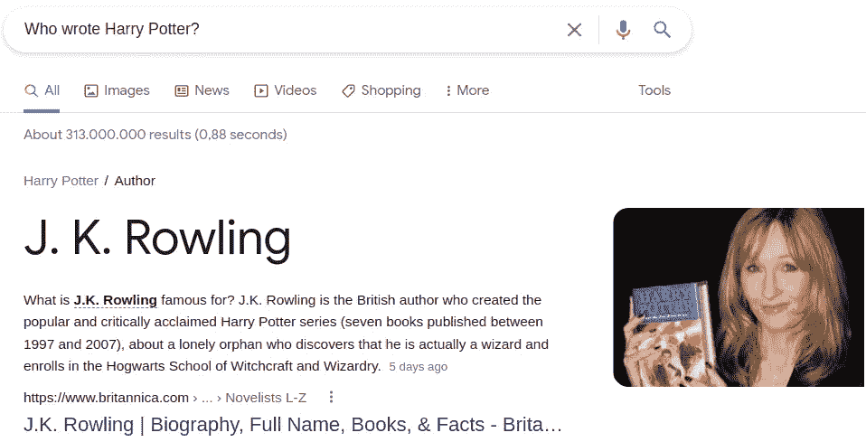

# 机器翻译能成为基于知识图的多语言问答系统的合理选择吗？

> 原文：<https://towardsdatascience.com/can-machine-translation-be-a-reasonable-alternative-for-multilingual-question-answering-systems-242c4674a29b>

## 剧透警告:是的，它可以！

# TLDR

提供获取信息的途径是网络最主要也是最重要的目的。尽管有易于使用的工具(例如，搜索引擎、问题回答),但可访问性通常受限于使用英语的能力。

在这项工作中，我们评估知识图问答(KGQA)系统，旨在提供自然语言访问存储在知识图(KG)中的数据。这项工作的特别之处在于，我们用多种语言来看待问题。主要地，我们比较本地支持质量值和集成机器翻译(MT)工具时获得的值之间的结果。评估结果表明，使用机器翻译工具，单语 KGQA 系统可以有效地移植到大多数被考虑的语言。

# 问题是

根据最近的统计，[只有 25.9%的在线用户说英语](https://www.statista.com/statistics/262946/share-of-the-most-common-languages-on-the-internet/)。与此同时， [61.2%的网络内容以英语发布](https://w3techs.com/technologies/overview/content_language)。因此，不能说或读英语的用户只能有限地访问网络上提供的信息。因此，尽管统计数据存在争议，但网络上的信息可访问性存在明显差距。这种差距被称为[数字语言鸿沟](http://labs.theguardian.com/digital-language-divide/)。

如今，每当用户查询搜索引擎时，他们都希望得到一个直接的答案。直接回答功能基于问答(QA)方法，由知识图驱动。2012 年,[谷歌知识图谱](https://blog.google/products/search/introducing-knowledge-graph-things-not/)问世，为谷歌的直接答案提供了动力。例如，当有人问谷歌“谁写了哈利波特？”，预期会出现以下结构化结果(见下图)。

查询“谁写了哈利波特？”的谷歌搜索结果(作者截图)

这些直接的回答更具可读性，并且立刻满足了用户的信息需求，例如，他们不需要打开由搜索引擎给出的每个“相关”网页(像以前那样)并且在打开的网页上手动搜索所请求的信息。但是如果我们用一种低资源的语言问同样一个非常简单的查询——[bash kir(拥有 140 万说话者的突厥语)](https://en.wikipedia.org/wiki/Bashkir_language)——结果并不真正令人满意(见下图)。

查询“谁写了哈利波特？”的谷歌搜索结果巴什基尔语(作者截图)

因此，对于那些不会说任何“流行”语言的人来说，网络上的知识可访问性有一个明显的限制。因此，在本文中，我们在问题*“自动机器翻译工具是否可用于增加非英语使用者对网络上知识的可访问性？”之后，在知识图问答(KGQA)的背景下解决这个问题*。

# 方法

为了回答上述研究问题，我们进行了一项大型评估研究。在我们的实验中，我们遵循面向组件的方法，通过重用现成的 QA 组件来获得对已定义主题的见解。由于*我们的目标是通过机器翻译(MT)工具*评估适应不支持语言的 KGQA 系统，因此我们需要:

1.  一套支持特定语言的多语言 KGQA 系统。

2.一组由母语为不同语言的人编写的高质量问题(其中需要两组:一组是现有 KGQA 系统支持的，一组是现有 KGQA 系统不支持的)。

3.一套机器翻译工具，能够把不支持的语言中的问题翻译成支持的语言。

对于第一点，我们使用了以下知名系统: [QAnswer](https://qanswer-frontend.univ-st-etienne.fr/) 、 [DeepPavlov KBQA](http://docs.deeppavlov.ai/en/master/features/models/kbqa.html) 、[鸭嘴兽](https://askplatyp.us/)。对于第二点，我们使用了我们的 [QALD-9-Plus 数据集](https://perevalov.medium.com/the-new-benchmark-for-question-answering-over-knowledge-graphs-qald-9-plus-da37b227c995)，该数据集包含英语、德语、俄语、法语、乌克兰语、白俄罗斯语、立陶宛语、巴什基尔语和亚美尼亚语的高质量问题，相应的答案表示为对 [DBpedia](https://www.dbpedia.org/) 和 [Wikidata](https://wikidata.org/) 知识图的 [SPARQL](https://en.wikipedia.org/wiki/SPARQL) 查询。对于第三点，我们使用了 [Yandex Translate](https://translate.yandex.ru/) (商业 MT 工具)和 [Helsinki NLP](https://huggingface.co/Helsinki-NLP) (开源 MT 工具)的 Opus MT 模型。使用[沙鼠](http://gerbil-qa.aksw.org/gerbil/)平台进行评估。因此，建立了以下实验设置(见下图)。

实验装置概述(作者提供的图片)

# 结果

从[实验结果](https://docs.google.com/spreadsheets/d/1zSG1nZVmRKucwaNuWXvdt56yY4JBuNsO-TojTVl11NI/edit?usp=sharing)中，我们清楚地观察到英语作为目标翻译语言的强大优势。*在大多数实验中，将源语言翻译成英语会产生最佳的 QA 质量结果*(例如，德语→英语、乌克兰语→英语)。

德语和乌克兰语作为源的实验值。本地问题用粗体文本突出显示。星号(*)对应最高质量的目标语言。关于系统和度量的最佳值用绿色进行了颜色编码(图由作者提供)。

在第一种情况下，英语是源语言，原始(原生)问题的质量最好，因为额外使用机器翻译会降低质量(见下图)。

英语作为资源的实验价值。本地问题用粗体文本突出显示。星号(*)对应最高质量的目标语言。关于系统和度量的最佳值用绿色进行了颜色编码(图由作者提供)。

*只有在立陶宛语是源语言的情况下，关于 QA 质量的最佳目标语言才是德语*(即立陶宛语→德语)，而英语也表现出合理的质量(即立陶宛语→英语)。虽然实验是精心设计的，但我们认为这种情况是异常的。然而，在提高问答系统的回答质量的同时，这种异常值可能具有显著的影响。

立陶宛语作为源的实验值。本地问题用粗体文本突出显示。星号(*)对应最高质量的目标语言。关于系统和度量的最佳值用绿色进行了颜色编码(图由作者提供)。

# 摘要

我们的主要结论是，机器翻译可以有效地用于为大多数语言建立多语言 KGQA 系统。原来*使用机器翻译工具的最佳方式是只翻译源语言(如德语、俄语等)。)翻译成英语* —这将产生最高质量的问题回答过程。因此，*即使源语言和目标语言来自同一个组*(例如，乌克兰语→俄语—斯拉夫语组)*从质量的角度来看，最好将它们翻译成英语*。

尽管我们的结果和结论建议通过机器翻译组件来扩展问答系统，但我们希望向研究社区指出许多可能影响答案质量的开放问题。因此，我们计划用更多的语言来扩展我们的实验。我们欢迎任何帮助我们扩展这项研究的意见。

如果你想看到更详细的结果，请参阅我们最近的论文:[https://dl.acm.org/doi/10.1145/3485447.3511940](https://dl.acm.org/doi/10.1145/3485447.3511940)

视频演示可在此处获得:

ACM SIGWEB 频道的视频

# 感谢

我要感谢这部作品的合著者，即: [Andreas Both](http://www.andreas-both.de/en/) 、 [Dennis Diefenbach](https://the-qa-company.com/team) 和[Axel-Cyrille Ngonga Ngomo](https://dice-research.org/AxelCyrilleNgongaNgomo)。

本文件的作者要感谢参与翻译数据集的所有贡献者，特别是:康斯坦丁·斯米尔诺夫、米哈伊尔·奥尔真诺夫斯基、安德烈·奥古尔佐夫、纳雷克·马洛扬、阿尔特姆·埃罗钦、米哈伊洛·内多代、阿利亚克塞·叶兹雷佐、安东·扎波洛斯基、阿图尔·佩什科夫、维塔利·利亚林、阿尔特姆·利亚利科夫、格列布·斯基巴、弗拉季斯拉夫·多尔迪伊、波琳娜·福明尼克、蒂姆·施拉德、苏珊娜·博恩斯和安娜·施拉德。此外，作者要感谢[开放数据科学社区](https://ods.ai/)将全世界的数据科学爱好者联系在一起。