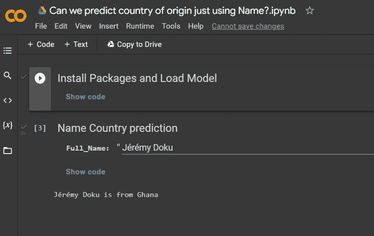

# 我们能用名字预测原产国吗？

> 原文：<https://towardsdatascience.com/can-we-predict-country-of-origin-just-using-name-fb5126e2c128>

## 多分类(63 类)，自然语言处理，数据生成，拥抱脸，XLNet，论文与代码

克里斯汀·罗伊在 [Unsplash](https://unsplash.com/photos/ir5MHI6rPg0) 上的照片

**动机:**

银行和金融业正处于一个矛盾的阶段，一方面越来越受到金融法规的约束，另一方面又要适应区块链世界的快速发展。反洗钱正变得越来越复杂，至少可以说，人工智能正在平行发展以解决这些问题。成功的反洗钱模型依赖于人类专业知识和某种人工智能的结合，包括机器学习。来源国是更好地对这些 AML 模型进行风险评分的主要特征之一，需要从 swift 报文、交易详情等中提取这些信息。

**注:**

你可以在下面的最后找到本文中使用的所有 colab 笔记本。

**数据准备:**

这是找到真实数据集的关键部分，我们可以从中找到代表整个国家的名称。在我短暂的研究中，没有与此相关的数据集。下一步是从维基百科的个人通用名列表中收集数据，如[这些](https://en.wikipedia.org/wiki/Chinese_given_name#Common_Chinese_names)。最近我从这个[视频](https://www.youtube.com/watch?v=KvMnpVMp0jk)中偶然发现了数据准备工具的重要性。我将简要概述一下我在数据准备过程中遇到的困难，这可能会有所帮助。

**使用 faker 生成名称:**

Faker library 用于创建虚假数据，这些数据是从公开可用的数据中收集的，当涉及到名字时，它们是从维基百科的常用名和其他名字来源中收集的。下面的代码用于生成来自 63 个不同国家的大约 50 万个名字。

*   The first hurdle is that the names that are generated are in their own languages, we need to convert the names to English (or common language) for generating tokens for model training (ex: 黒澤明 -> Akira Kurosawa). The library that can be used for this is googletrans which uses googletranslate API.
*   第二个障碍是，如果我们翻译每个名字，API 太慢了(大约 15 小时)。为了解决这个问题，我将所有相同的国家名称转换为一个列表字符串，并附加到数据框中，这样可以大大减少时间(63 个列表不到 2 分钟)。
*   接下来是第三个障碍，对于每个 API 调用可以输入的列表字符串的长度有一个阈值，必须少于 5000 个字符。为了解决这个问题，我们需要使用下面的代码拆分列表字符串并追加，这需要大约 10 分钟的运行时间。

你可以在这个[链接](https://www.kaggle.com/amaleshvemula7/name-and-country-of-origin-dataset)找到我上传到 Kaggle datasets 的数据集。

**预训模特选择**:

为了解决这个 NLP 分类问题，首先，我们需要从几个可用的预训练语言模型的巨大生态系统中选择用于分类的预训练模型的类型。对于模型的准确性、训练速度(硬件依赖性)、模型的训练方式、架构(自回归或自动编码或两者都有)、模型的大小(部署原因)，总是需要进行折衷。

我选择 XLNet 作为预训练语言模型，因为它利用了我们问题的预训练目标，获得了自回归(AR)和自动编码(AE)语言建模的最佳效果。在我们的案例中，硬件依赖性不是问题，因为我们将使用 colab TPUv2 (8 个 TPU 内核，每个内核 8GB)。模型的大小不是问题，但有很好的替代方案，如 google ELECTRA，它的大小非常小，具有很好的胶合分数，它使用生成器和鉴别器架构来进行训练。选择 XLNet 的另一个原因是它在分类问题上的表现，我参考了代码文本分类[页](https://paperswithcode.com/task/text-classification)的论文，得出结论选择 XLNet。

**模型搭建**:

我将使用 TensorFlow XLNet 模型通过 huggingface 进行训练。首先，使用 XLNetTokenizer 对名称进行标记化，并通过预先训练的模型运行结果标记，以优化相对于标记的权重。可以使用以下内容定义模型架构:

**模特培训:**

首先需要初始化 TPU，然后为了有效地使用 TPU，并使用由 TPU 实验室提供的所有工人和核心，我们需要通过使用以下代码初始化 TPU 系统，以初始化在模型构建中使用的 TPU 策略对象。

**结果:**

在 30 个时期和大约 110 分钟的训练时间之后，我们已经获得了 90.73 的训练准确度、74.02 的验证准确度和 74.67 的测试准确度，这些数据是关于大约 50 万个名字和 63 个类别的整体数据的未见过的数据。本文的管道可以在下面的 colab 链接中找到:

 [## 谷歌联合实验室

### XLNet TPU 名称国家

colab.research.google.com](https://colab.research.google.com/drive/1yloybl3-h3JDTyZKdqDBGzHUb7MqcCDw?usp=sharing) 

你可以在不到两分钟的时间内从下面的 colab 笔记本中输入你选择的全名来测试模型。

 [## 谷歌联合实验室

### 我们能用名字预测原产国吗？

colab.research.google.com](https://colab.research.google.com/drive/1G0dvq1VeGnMSF9uGsIzB04RViZwqMiip?usp=sharing) 

名称国家预测示例

## 参考资料:

*   XLNet:用于语言理解的广义自回归预训练。
*   [变形金刚。](https://huggingface.co/docs/transformers/index)
*   [带代码的文件。](https://paperswithcode.com/task/text-classification)