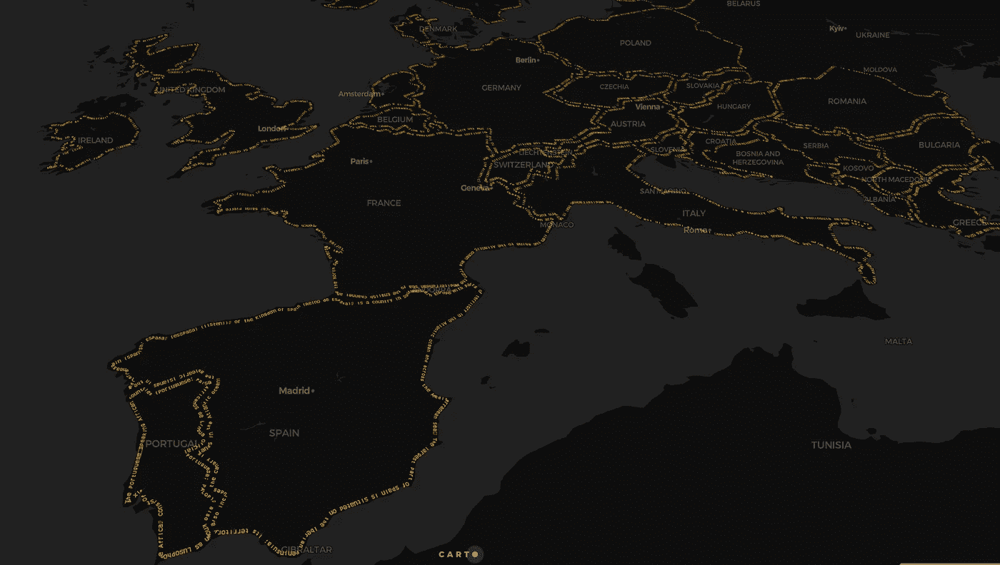
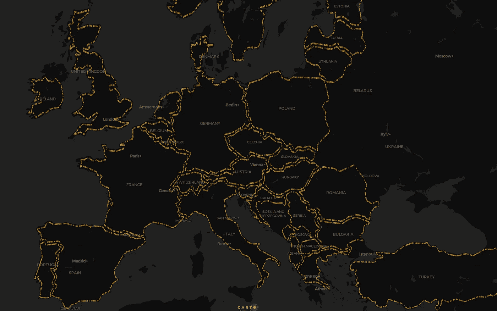

# 我们能把文字转换成地理信息吗？

> 原文：<https://towardsdatascience.com/can-we-transform-words-into-geographies-51259ae04b2a>

## 以非常规方式在地图上放置文本



来自维基百科的欧洲边界文本。图片作者。

MAP 一般到处都有标签。这些有助于我们识别代表的是什么。告诉我们事物是什么的文本片段，从餐馆或街道的名称到国家的名称。然而，一个标签并没有嵌入到地图中，严格来说，它只是链接到一个“地理位置”，并给我们关于它的信息(例如，意大利边界内部写的“意大利”一词)。但是如果我们改变了呢？

如果你想一想，当你输入一个字符时，你的计算机会用几条(贝塞尔)曲线连接一些点，并把它们画在像素网格上。然后这个网格就会呈现在你的屏幕上。定义每个字形的点只是保持它们之间的相对距离，这让我们能够理解正在书写的字符。从技术上讲，我们可以给这些点分配一些坐标，然后把它们想象成可以在地图上可视化的“地理”。


来源:wikimedia.org(根据 CC 许可)

# 从想法到实施

这比一开始看起来要简单得多。 **freetype** 库允许我们从字体文件中提取每个字形的轮廓。我们迭代文本中的字符，遍历每个字符的轮廓，形成 Linestring 对象( **shapely** 库)。然后我们将它们合并成一个多线串。最后，我们将所有的点投影到地图上，将文本集中在期望的坐标上。这里需要技巧的是将每个字符放在前一个字符旁边，并考虑字符之间的间距。

下面是一小段代码，它根据给定的坐标、比例尺和倾斜度在地图上绘制文本。依赖项可以安装在:

```
pip install cartoframes shapely freetype
```

如果您运行这段代码，您将得到下面的交互式地图。

按作者分类的地图

# 进入下一个阶段

好吧，但是这样做有什么意义呢？常规标签还不够好吗？是的，它们对于 99.9%的用例来说已经足够好了。但是请原谅我。让我告诉你如何扭曲文本，并使其遵循自定义路径。

按作者分类的地图

我们在这里做什么？基本上，我们首先生成一条点的路径(左边是一条螺旋，右边是一条希尔伯特曲线)，然后我们将文本分成块，然后调用一个新的函数来拟合两点之间的每个块。例如，如果我们有一条路径，包含点 A、B 和 C 以及文本“Hello World ”,我们首先在 A 和 B 之间放上单词“Hello ”,然后在 B 和 C 之间放上“World”。我认为这非常简洁，因为您可以选择任何一个。tff 字体文件，并使用它来快速生成地理图(请注意，不仅底图和颜色不同，第二张地图的字体也不同)。

为了更进一步，我们可以取一个普通的 LineString，分解它并使用它作为插入文本的路径。为了得到一个好的结果，对线串进行插值是很重要的，这样每一对点(A，B)的间距是均匀的。

下面你可以看到第一次环球航行幸存者的名字，这次航行是由十六世纪的费迪南德·麦哲伦领导的。在 1519 年 8 月开始探险的 256 人中，**只有 18** 在三年多后活着回到🫢(剧透一下，麦哲伦不在其中)

按作者分类的地图

最后，我与您分享另一张地图(点击！)我把欧洲国家的边界和它们各自的维基百科页面。你可以把每个国家的边界看作是对自己的描述🤯。

[这里的](https://github.com/juanluisrto/blogposts/blob/main/text_to_geom/blogpost.ipynb)是我为这篇文章写的代码，如果你想看的话。

[](https://gcp-us-east1.app.carto.com/map/bd40262d-b91f-4a39-9157-361b86e1efb5)

图片作者。点击它可以看到实时地图！