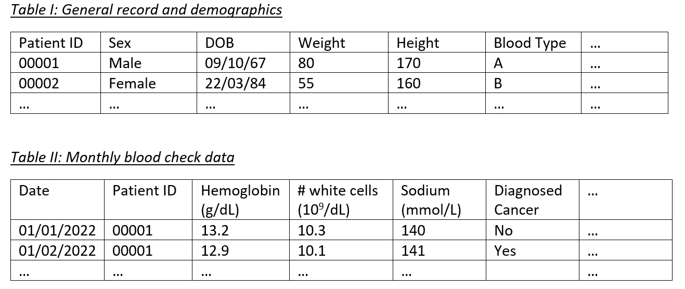
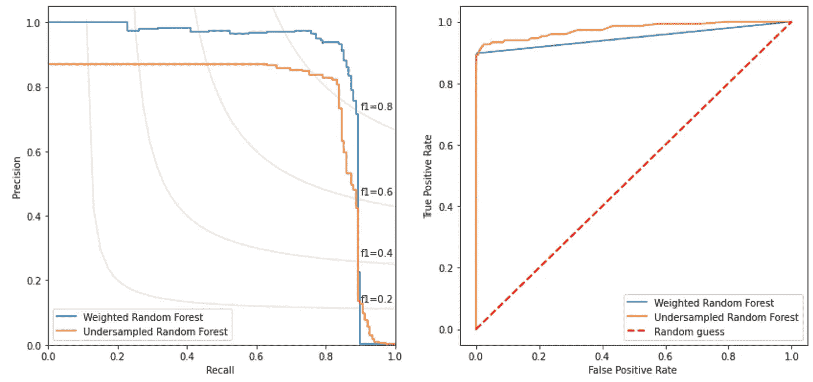

# 癌症预测与电信流失建模

> 原文：<https://towardsdatascience.com/cancer-prediction-vs-telecom-churn-modelling-9e4ec49095f6>

## 应用机器学习

## 癌症预测和流失建模之间的相似性

图片来自 [Shutterstock](https://www.shutterstock.com/) 作者 [tadamichi](https://www.shutterstock.com/g/tadamichi)

## 介绍

在过去的一年里，我一直在一家电信公司工作，担任数据科学家。电信部门有许多机器学习的应用，其中一个主要应用是客户流失预测。准确预测客户流失有助于提高客户保持率并增加企业收入。虽然流失预测看起来与癌症预测无关，但这两个问题实际上可以非常相似地解决。在本文中，我将介绍为这两种应用程序设计功能和训练机器学习模型的最佳方法。

## 那么什么是流失呢？

顾客是指停止使用/支付服务的人。我们的目标是预测未来的客户流失，这样我们就可以针对我们预测会流失的用户开展有针对性的营销活动。减少客户流失和提高客户保持率将增加企业中普通客户的终身价值，从而增加公司的收入。

理想情况下，我们希望尽可能预测未来的客户流失。我们对未来的预测越多，营销团队就越容易做出反应和组织营销活动。然而，我们预测的未来越远，我们的预测就越不准确。我们需要在模型的性能和结果的有用性之间取得平衡。

## 癌症预测的类比

为了解释客户流失建模，我将从不久前收到的一个案例面试问题开始:

比如有一种非常致命的癌症，如果治疗得足够早，是可以治愈的。然而，当癌症在常规医疗检查中被诊断出来时，已经太晚了。如果在通常通过常规诊断发现之前 1-3 个月发现，那么它很容易治愈。

您可以访问一个医疗保健数据集，其中包含全国许多患者的医疗记录。该数据集还包含每个患者每月的血液检查，以及他们是否被诊断患有这种癌症。

你将如何着手建立一个模型来及时预测这种癌症？

按作者分类的表格(虚构数据，按作者分类的图像)

这可能是一个很好的时机，让你停下来，想想如何在这里建立一个模型。这是一个在数据科学面试中出现的问题，在我的数据科学职位中也出现了非常类似的情况。

## 构建数据集

最终目标是建立一个分类器，该分类器接收关于患者及其血液测试结果的信息，并预测他们是否患有未诊断的癌症(将在接下来的 1-3 个月内通过每月体检诊断的癌症)。

数据集非常大，以千万计。数据是关系型的，因此像 SQL 这样的语言是最合适的。数据集可以通过左连接通过“患者 ID”列进行连接。这些查询可以通过云服务来执行，比如 Google 的 Big Query。

为了训练分类器，我们需要建立训练数据集。每个数据点将显示每个患者的每月血液测试结果。数据点必须标记为正或负。在接下来的 1-3 个月内将被诊断为癌症的患者的结果为阳性。阴性是指没有患癌症的人。

图 1:患者每月检查数据(作者图片)

在上面的图片中，我展示了两个病人的数据。患者 1 在 5 月被诊断出患有癌症，患者 2 从未被诊断出患有癌症。我们需要一个模型，将患者 1 在 2 月、3 月和 4 月的血液测试分类为阳性，并将患者 2 的所有血液测试结果分类为阴性:

图 2:图 1 中所示的训练数据点被分成负的、正的和未使用的(图片由作者提供)

在训练数据中不使用患者 1 被诊断患有癌症(May)的血液测试，因为它已经太晚而无法治愈。我们希望在这些数据点被标记为阳性之前 1-3 个月预测癌症。请注意，患者 1 在 1 月份的血液检测被标记为阴性，因为他在 4 个月后才检测为阳性。

请注意，我们是如何将每位患者的每次血液测试作为不同的训练数据点。我们不能简单地使用最近一个月诊断出的癌症数据。这些数据是不充分的，因为只有极少数患者会被诊断患有癌症。训练这些模型已经是一项艰巨的挑战，因为产生的数据集将非常不平衡。我们需要在训练数据中尽可能多的癌症阳性，以提高模型性能，因此我们需要尽可能远地收集数据。

我们限制预测未来的原因很简单，因为我们越往前看，预测者就越弱。我们希望建立一个强大而稳健的模型，如果它预测某人患有癌症，我们几乎可以肯定该预测是正确的。

## 特征工程

如果我们只看最近的血液测试数据，我们可能会错过过去几个月结果变化的模式。例如，白细胞计数等一些变量的稳定下降可能是一个预测因素。在训练数据中捕获这一点极其重要，并将极大地影响模型的性能。

特征工程变量可能包括:

*   重要变量的变化率
*   过去几个月重要变量的平均值
*   过去几个月变量的方差
*   二元变量，如:在过去几个月中，钠水平是否曾< 145 mmol/L
*   分类变量的一种热编码
*   标度连续变量

包括什么特性在很大程度上取决于用例以及数据集。数据科学家需要利用数据中的模式，了解潜在的问题，并找到最佳特征来支持机器学习模型。

## 电信客户流失建模

希望通过阅读上面描述的癌症预测模型，你可以想象它是如何应用于客户流失模型的。

我们试图预测客户在未来 1-3 个月内是否会流失。我们需要时间来针对他们进行营销，并防止他们出现混乱。我们收集他们与出售给他们的服务的互动，而不是每月的血液测试。这可能包括他们使用该服务的次数、用途等。

流失建模和癌症预测之间的主要区别在于流失建模是非常季节性的。模特每个月都需要重新培训，否则，她们会表现不佳。

下一个巨大的区别是，在电信领域，这些特征通常以数据流的形式出现，而不是像血液测试那样一个月一个数据点。这些数据流仍然需要转换成唯一的数据点。这些数据点通常对应于一个月中的某一天，在这一天，模型将被定期重新训练和执行。

## 训练和评估预测模型

这两个问题产生的数据集将会非常不平衡。这是因为大部分患者不会得癌症，大部分用户不会流失。处理不平衡分类的方法包括例如加权分类和欠采样。还有其他的，但是从我的经验来看，这些效果最好。

根据所得数据集的大小，不同的监督学习分类器可能工作得最好。对于较小的数据集(数万行或有时数十万行)，由于这是表格数据，集成方法将工作得最好。集成方法包括决策树、boosting 方法等。

遵循标准的机器学习最佳实践技术非常重要，例如:

*   规范化和标准化/最小最大缩放连续变量
*   一个热编码离散变量
*   列车测试拆分
*   对于变动，保存最近的变动(一个月左右)以供验证

为了改进模型，您应该调整模型以增加测试数据的结果。这可能涉及进一步的特征工程、超参数调整等。完成后，您需要评估验证数据集上的模型，以便很好地了解您在生产中可以预期的性能。

就客户流失建模而言，最有用的指标是 ROC AUC 得分。接收器工作特性(ROC)是真阳性率对假阳性率的曲线图。它与我在本文的[中详细解释的精确度和召回率密切相关。](/how-to-deal-with-unbalanced-data-d1d5bad79e72)

图 3 精确召回曲线与 ROC AUC 得分(作者提供的图片)

在上面的图片中，我回收了以前文章中的一个模型的结果。在左边你可以看到两个模型的精确召回曲线。在右边你可以看到大鹏鸟。通过改变阈值，我们能够改变每一类的精确度和召回率。

同样，通过改变分类器的阈值，我们可以获得不同的真阳性率和假阳性率。ROC 对所有可能阈值(从 0 到 1)的积分给出了曲线下面积(AUC)。完美的模型将具有 1 的积分，即使在最低的假阳性率下也具有完美的真阳性率。对于纯随机模型，ROC 曲线将是一条对角线，AUC 为 0.5(1 乘 1 平方的一半面积为 0.5)。良好的 ROC AUC 分数将取决于应用和数据，但是越接近 1，分数越好。

该度量很好地比较了机器学习模型的总体泛化能力。该度量对于任何种类的不平衡分类问题都非常有用，因此它对于癌症预测模型和流失模型都是合适的。

## 结论

早期癌症检测和流失预测看似不相关，但实际上这两个问题几乎可以同时解决。在本文中，我将讨论如何为这些挑战构建一个机器学习模型。我还讨论了如何构建数据集，这可能是问题中最难的部分。它需要大量的特征工程和预处理。机器学习只能做这么多，但最终，模型的质量将在很大程度上取决于你提供给它的数据和功能的质量。最后，我将讨论评估这些分类器的最佳方式，并推荐 ROC AUC 评分。希望这篇文章能启发你训练自己的模型，并通过使用数据提供有意义的见解！

## 支持我

希望这对你有所帮助，如果你喜欢，你可以跟我来 [**！**](https://medium.com/@diegounzuetaruedas)

您也可以使用我的推荐链接成为 [**中级会员**](https://diegounzuetaruedas.medium.com/membership) ，并访问我的所有文章及更多:[https://diegounzuetaruedas.medium.com/membership](https://diegounzuetaruedas.medium.com/membership)

## 你可能喜欢的其他文章

[支持向量机](https://medium.com/p/4f50d1e3d4d2)

[精准 vs 召回](https://medium.com/p/d1d5bad79e72)