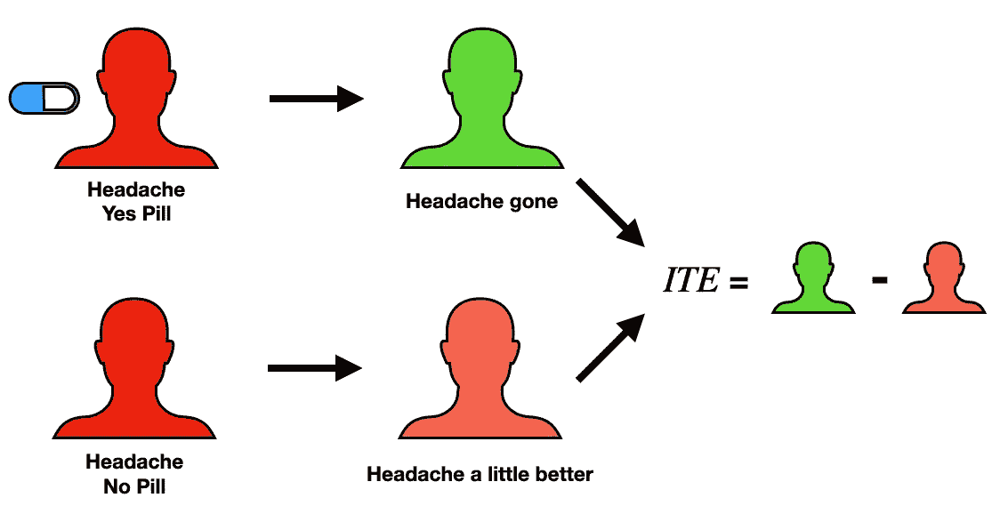
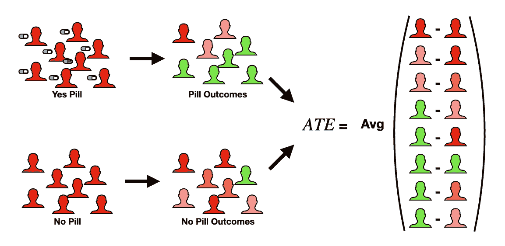

# 因果效应

> 原文：<https://towardsdatascience.com/causal-effects-f30f962ffff3>

## 什么是治疗效果，如何计算？

本文是关于因果关系的[三部曲系列](/causality-an-introduction-f8a3f6ac4c4a) 的延续。之前的帖子主要关注[因果推断](/causal-inference-962ae97cefda)和[因果发现](/causal-discovery-6858f9af6dcb)。这篇文章基于这些想法，描述了三种不同的因果关系。在以后的文章中，我们将讨论从[观察数据](https://medium.com/towards-data-science/propensity-score-5c29c480130c)计算因果效应，以及使用 [do 运算符](https://medium.com/towards-data-science/causal-effects-via-the-do-operator-5415aefc834a)评估因果效应。

**关键点:**

*   **因果效应**通过比较不同治疗值的结果来量化治疗的影响

# **为什么？**

因果的概念在我们(即人类)如何理解我们周围的世界中起着核心作用。例如，“*人行道是湿的，因为昨晚下雨了”，*使我们能够在新的情况下做出推论，例如*为什么天井家具是湿的？*

这就归结到一个根本问题，*为什么？*为什么会这样？这是什么原因造成的？或者说，这将走向何方？会有什么效果？

在许多实际环境中(例如商业、医疗保健、教育)，不仅知道什么导致什么是有利的，而且知道多少是有利的？换句话说，庭院家具的潮湿程度是由昨晚的雨水和今早的洒水器造成的？**回答*这个问题多少钱？*就是**的因果关系。

# **背景**

在深入探讨之前，我们如何才能回答这个“*有多大的问题？*“我们需要定义一些东西。熟悉这些概念的人可以随意跳到下一节。

## **结果、治疗和协变量**

我们必须区分研究中的变量，即:结果、治疗和协变量。

一个**结果**是我们最终感兴趣的变量。对企业来说，可能是利润，对临床医生来说，可能是心脏病的发病率，等等。

**治疗**是我们为了影响结果变量而想要改变的变量。例如，企业可能希望改变广告支出来影响利润，或者临床医生可能改变剂量来影响心脏病的发病率。

然后是**反变**，基本都是别的。对于临床的例子，这可能是:年龄，体重，身高，他们是吸烟者吗？、运动水平等。在整个系列中，结果将由 *Y* 表示，治疗由 *X* 表示，协变量由 *Z* 表示。

## **潜在成果框架**

因果关系中的一个重要概念是**潜在结果框架**，这是**一种估计因果影响的方法**。这个框架建立在一个核心问题上。考虑一个**随机对照试验(RCT)** 的受试者，如果受试者接受一种治疗( *X* =x_1)代替另一种治疗( *X* =x_0)，结果变量( *Y* )的值会是多少。

这是一个**反事实**问题的例子，即*如果 A 而不是 B 发生了什么* *？这个问题的根本挑战是每个受试者只能接受一次治疗。例如，如果我吃了一片泰诺，我的头痛消失了，没有办法观察如果我不吃药会发生什么。*

虽然我们永远无法真正观察到反事实(即，如果我接受治疗 A 而不是 B 会发生什么)，但这一理论概念是讨论因果关系的良好起点。

# **3 种因果关系**

在这里，我描述了 3 种不同类型的因果关系。虽然所提供的表达式考虑了布尔治疗(例如，服用或不服用避孕药)，但是这些表达式可以推广到任何数量的治疗级别。

## **1)个体治疗效果(ITE)**

单个治疗效果的视觉分解(ITE)。图片作者。

一个**个体治疗效果(ITE)** **量化了治疗对特定个体的影响**。它通过比较不同治疗水平的结果来做到这一点。这就像之前的泰诺例子一样。

在一种情况下，我吃了一片泰诺，头痛就消失了。然后假设，在反事实的情况下(即，如果我不吃药)，我的头痛不会消失，但我感觉好一点了。为了评估这种情况下的 ITE，我们将比较服用避孕药的结果和不服用避孕药的结果。

下图给出了一种表达方式。

表达个体治疗效果(ITEs)的一种方式。图片作者。

其中， *Y(1)* 表示服药方案的结果值(即 *X* =1)，而 *Y(0)* 表示未服药方案的结果(即 *X* =0)。我将再次强调，在现实中，我们只能观察到 ITE 方程中的两种情况之一。因此，ITEs(充其量)是我们估计的东西，但从不直接测量，即使这样也是有挑战性的。挑战在于 ite 要求很多，即*在特定的时间、特定的情境下，对特定的个体有什么治疗效果？*

另一种方法是扩大我们的人口。然后，我们确实可以评估在特定时间和背景下的治疗效果，但不是针对特定的个人。我们将获得*群体水平的*治疗效果，这就引出了第二种因果效应。

## **2)平均治疗效果(ATE)**

平均治疗效果(ATE)的视觉分解。图片作者。

如前所述，ite 的一个问题是它们永远无法真正被测量。但是，如果我们把目标转向人口水平的影响呢？这正是**平均治疗效果(ATE)** 所量化的。换句话说，ATE **评估治疗对人群的预期影响**。就像 ITE 一样，它通过比较不同治疗水平的结果来工作。然而，它不是考虑一个特定的个体，而是评估整个群体。

这可以表示如下:

表示平均治疗效果的一种方法。图片作者。

其中 *E{V}* 代表某个变量 *V* 的期望值(即平均值)。 *Y_i(1)* 表示第 I 个受试者服用药丸方案的结果值。并且， *Y_i(0)* 表示第 I 个受试者在无药丸情况下的结果值。使 ATE 更容易估计的是期望值。也就是说，我们感兴趣的是平均值，而不是点估计值。

这是量化治疗效果的最重要的方法之一。它通常出现在**随机对照试验(RCTs)** 中，在这种情况下，整个人群被**随机**分成 2 个*相等的*组(例如，服药组和不服药组)。非常重要的一点是，在随机和相同的组中进行分割，以便对于足够大的群体规模，这两个组是直接可比的。这就把前面的 ATE 方程简化成非常容易计算的东西(见下面的表达式)。

随机对照试验(RCT)中的平均治疗效果(ATE)[[1](https://www.ncbi.nlm.nih.gov/pmc/articles/PMC3144483/)。图片作者。

其中 j 代表治疗组，k 代表对照组。换句话说，ATE 可以通过比较两个亚群的平均结果值来直接计算。

RCT 中计算 ATE 的视觉故障。图片作者。

虽然 RCT 使得 ate 的计算非常容易，但是它们是昂贵的(不仅仅是美元，而是时间和精力)。此外，它们可能在所有情况下都不实际、不道德或不可行。在本系列的下一篇博客中，我将讨论一种*更便宜*且更容易实现的替代计算 ate 的方法。

## **3)治疗组(或对照组)的平均治疗效果**

与 ATE 相关的一个量是被治疗者(ATT) 的平均治疗效果**。这与 ATE 相同，它估计治疗对人群的预期影响，但有一个关键的区别。我们没有考虑整个人群(即治疗组和对照组的受试者)，我们**只考虑实际接受治疗的受试者**。**

这可以表示如下:

表示被治疗者(ATT)平均治疗效果的一种方式[ [1](https://www.ncbi.nlm.nih.gov/pmc/articles/PMC3144483/) ]。图片作者。

换句话说，**是观察到治疗(*X*= 1)时的**预期治疗效果。看这个等式，我们只能观察到第一项( *Y_i(* 1 *)* ，而第二项是反事实。虽然这再次提出了计算这个理论量的挑战，但它有实际的重要性。****

**回到泰诺的例子，ATT 将量化服用泰诺的人对头痛状况的影响，与任何头痛的人形成对比。ATE 和 ATT 之间的**关键实际差异**是，在 RCT 的背景之外，有一些典型的**共同因素会使 ATE 和 ATT 不同**(例如，年龄、获得药物的途径、耐受性等)。这可能看起来像是，ATT 吃了，因为那些服用药丸的人往往比那些没有服用的人更频繁地服用泰诺，因此对其效果产生了耐受性。**

**我们同样可以计算对照组(ATC) 的**平均治疗效果，其中我们评估 ate，但针对对照组人群。****

****

**一种表示对照组(ATC)平均治疗效果的方法。图片作者。**

**在这里，我们可能观察到相反的情况，因为那些没有服用避孕药的人在头痛时往往不会服用泰诺，因此更容易受到它的影响。[ [2](https://edisciplinas.usp.br/pluginfile.php/3984640/mod_resource/content/2/%5BStephen_L._Morgan%2C_Christopher_Winship%5D_Counterfa%28BookFi.org%29%20%281%29%281%29.pdf) ]中提供了关于 att 和 ATC 的详细讨论。**

## ****注:另一种量化效果的方法****

**在前面的讨论中，我已经将因果关系表示为结果的差异，例如*ATE = E { Y _ I(*1*)—Y _ I(*0*)}*。虽然这种配方在许多应用中工作良好，但它不是我们唯一的选择。计算因果关系的另一种方法是通过**风险比**。这个公式类似于前面的公式，但是用除法代替了减法，如下图所示。**

****

**ATE 的另一种表达方式。我们用一个比率来代替结果的差异。图片作者。**

# ****do 运算符的因果关系****

**到目前为止，我们已经讨论了 3 种类型的因果关系，并给出了每一种的方程式。在许多情况下，这些都是表达因果关系的有效方式，然而，可以说还有一种更深层次的方式来思考它们。**

**这通过使用 **do 操作符**来完成，该操作符**是干预** [ [3](https://www.ncbi.nlm.nih.gov/pmc/articles/PMC2836213/pdf/ijb1203.pdf) 的数学表示。在之前关于[因果推理](/causal-inference-962ae97cefda)的帖子中，do 运算符被表述为允许我们回答反事实问题并最终计算因果效应的东西。然而，我们通过一个关于因果关系的完整的讨论(假定)做到了这一点，并且没有一个 do 运算符被使用。**

**原因是 do 运算符涉及的数学可能不是每个人都能立即理解的(即 do-calculus)。我写这篇博客的目的是为以后使用 do 运算符发表因果效应的文章提供一个容易访问的起点。**

**  

# **实际问题**

虽然这种因果关系的讨论可能已经给了我们一个坚实的理论基础，但仍然有一些挥之不去的实际问题:

*   我该如何处理这些反事实的术语？
*   实践中我们是否仅限于随机对照试验？观察数据呢？
*   有什么软件工具可以处理这些东西？

为了解决这些问题，在下一篇文章中，我将介绍一套技术，我们可以用这些技术从观测数据中计算因果关系。

这些方法都使用一种叫做 [**的倾向得分**](https://shawhin.medium.com/propensity-score-5c29c480130c) 的东西，这是基于其他特征的某人接收治疗值的**估计概率。这提供了一种处理研究亚人群中可能存在的偏倚的方法。**

  

# 资源

**更多关于因果关系** : [因果关系概述](https://shawhin.medium.com/understanding-causal-effects-37a054b2ec3b) | [因果关系:简介](/causality-an-introduction-f8a3f6ac4c4a) | [因果推断](/causal-inference-962ae97cefda) | [因果发现](/causal-discovery-6858f9af6dcb)

**连接** : [我的网站](https://shawhint.github.io/) | [预定电话](https://calendly.com/shawhintalebi) | [邮件我](https://shawhint.github.io/connect.html)

**社交**:[YouTube](https://www.youtube.com/channel/UCa9gErQ9AE5jT2DZLjXBIdA)|[LinkedIn](https://www.linkedin.com/in/shawhintalebi/)|[Twitter](https://twitter.com/ShawhinT)

**支持** : [给我买杯咖啡](https://www.buymeacoffee.com/shawhint?source=about_page-------------------------------------) ☕️ | [成为会员](https://shawhin.medium.com/membership?source=about_page-------------------------------------) ⭐️

  

[1] [减少观察性研究中混杂效应的倾向评分方法简介](https://www.ncbi.nlm.nih.gov/pmc/articles/PMC3144483/)作者 Peter C. Austin

反事实和因果推理:社会研究的方法和原则

【3】[朱迪亚·珀尔著](https://www.ncbi.nlm.nih.gov/pmc/articles/PMC2836213/pdf/ijb1203.pdf)因果推理导论**