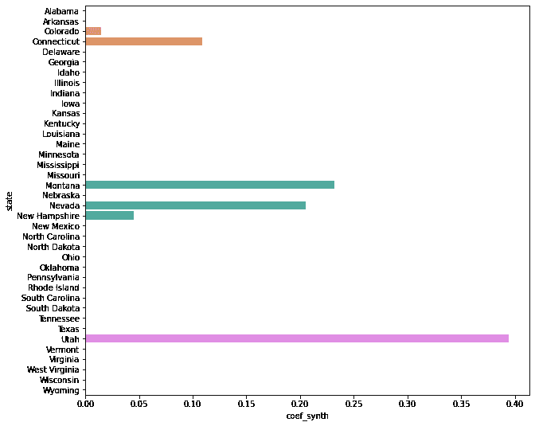
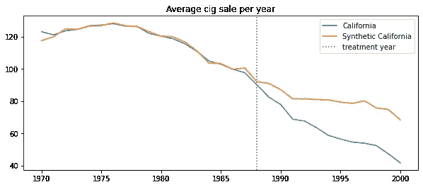
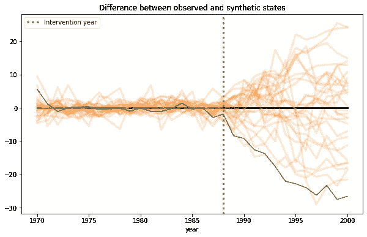

# 使用综合控制的因果推理

> 原文：<https://towardsdatascience.com/causal-inference-using-synthetic-control-4377b457c6bb>

## 探索一种最新的准实验技术

埃文·丹尼斯在 [Unsplash](https://unsplash.com/s/photos/why?utm_source=unsplash&utm_medium=referral&utm_content=creditCopyText) 上的照片

人们普遍认为 A/B 测试是因果推断的黄金标准。也称为随机对照试验(RCT)，这些试验包括将受试者随机分为治疗组和对照组。这确保了单位之间的任何差异是由于所应用的处理。A/B 测试已被企业广泛采用，以测试新产品、功能和营销策略。这有助于他们捕捉客户反应、产品问题等。在产品或战略周期的早期。然而，在许多情况下，将受试者随机分为治疗组和对照组可能不是最佳解决方案。社交媒体测试就是一个例子，其中网络效应可能导致测试和控制之间的污染。同样，在某些情况下，它可能会引起伦理问题(例如，在医学试验中)，或者可能过于昂贵，甚至由于技术限制而变得不可行。正是在这些情况下，我们使用准实验技术，如差异分析中的(DID)、回归等。本文重点研究的综合控制方法就是这样一种技术。这篇文章探讨了:

1)综合控制方法的细节，

2)其优点和缺点，以及

3)技术的数据要求

**综合控制方法(SCM):**

***什么是合成控制法？***

合成控制方法最初是在 Abadie 和 Gardeazabal (2003)中提出的，目的是估计综合干预对某些感兴趣的综合结果的影响[1]。在这里，综合干预是指在综合水平上实施并影响少数大单位(如城市、地区或国家)的干预。它基于这样的思想，当在集合实体级别进行观察时，未受影响单元的组合可以提供比任何单个未受影响单元更合适的比较。简而言之，它将治疗组与对照组的加权组合进行比较。与传统的准实验技术相比，SCM 有两大优势:

1)它可以解释混杂因素随时间变化的影响，而 DID 的平行趋势假设意味着，如果没有干预，治疗组和对照组的结果将随时间推移遵循平行轨迹[1]。

2)这种方法使用数据驱动的程序将比较单位的选择正式化[2]。

***型号详情:***

让我们假设有 J 个单位，j=1 为处理单位，j=2，…，j=J 为对照单位。设 y 为结果变量，Y_(1t)^N 为在没有干预的情况下在时间 t 观察到的治疗单位的结果变量的值。设 T_0 为干预时间，Y_(1t)为干预后的结果变量的值，Y_(jt)为控制单位 j 在时间 t 的结果变量的值。

综合控制方程；作者图片

如果是干预对治疗的影响，那么

冲击方程；作者图片

这里，Y_(1t)可以通过观察干预后的 y 来获得，而 Y_(1t)^N 可以从等式(1)获得。(1).问题仍然是:我们如何获得上述等式的权重？Abadie、Diamond 和 Hainmueller (2010 年)建议以类似于以下的方式计算权重

综合控制的权重；作者图片

这里 W 是权重 w_j 的(J-1)x1 矩阵，X_(t，pre)是暴露区域的干预前特征的向量，X_(c，pre)是对照的相同干预前特征的向量。

干预前特征，也称为协变量，可以是适当代表治疗的任何变量。例如，在 Abadie、Diamond 和 Hainmueller (2010)中，在估计 99 号提案对加州的影响时，使用的协变量是干预前时期香烟的平均零售价格、干预前时期人均国家个人收入(记录)的平均值、干预前时期 15-24 岁人口的百分比以及干预前时期人均啤酒消费量的平均值。这些变量因三年的滞后吸烟消费而增加(这也是结果变量)。可以使用任意年的滞后数据来模拟处理单元。[4]

计算模型权重的公式虽然与线性回归非常相似，但也有细微的差别。该模型使用以下约束条件，这使其不同于经典的线性回归模型:

按作者排列的约束图像

最后两个约束保护该方法不被外推。因为综合控制是可用控制单元的加权平均，所以这种方法清楚地表明:(1)每个控制单元对感兴趣的反事实的相对贡献；以及(2)就干预前结果和干预后结果的其他预测因素而言，受感兴趣的事件或干预影响的单元与合成对照之间的相似性(或缺乏相似性)。相对于传统的回归方法，透明性和防止外推是该方法的两个吸引人的特征[4]。

**实现示例:**

在这个练习中，我使用了公开可用的数据，其细节在[6]中描述。文章[中的代码理解综合控制方法](/understanding-synthetic-control-methods-dd9a291885a1)已用于本例。

在本例中，我们将尝试估计[99 号提案](https://www.cdph.ca.gov/Programs/CCDPHP/DCDIC/CTCB/Pages/LegislativeMandateforTobaccoControlProposition99-.aspx?TSPD_101_R0=087ed344cfab2000cc093680036ad502c344f7e34a20b9e37c3529436f306dbf7153a0f980fdfda80829022d61143000411db686cf2ff3459a8ed4ea50a7b250e3ff689fec9fd2596fd6fac3e3b95a363a4efd31fd30c42d97ea2898b9f5ce33)对州一级年人均卷烟消费的影响，该消费在我们的数据集中以人均卷烟销售额来衡量。因此，在这个例子中，我们感兴趣的结果变量是“年人均卷烟销售量”。我们示例的样本期从 1970 年开始，到 2000 年结束。加州在 1989 年提出了 99 号提案。让我们先来看看这个方法的上下文需求[1]:

1.  用这种方法很难测量高波动性的小影响。
2.  对照组的可用性，即并非所有单位都采用类似于治疗组的干预措施。在这个例子中，在我们的研究期间引入正式的全州烟草控制计划或增加卷烟税超过 50 美分的州被排除在外
3.  对控制单元没有溢出效应，即实施治疗干预不会影响控制单元中感兴趣的结果变量。这个例子假设在处理单元和控制单元之间没有溢出效应。
4.  干预前，综合控制和受影响单元的特征差异很小，即

作者图片

鉴于我们已经考虑了上下文需求，让我们来看看数据:

作者的数据图像

正如我们在上面的图像中看到的，我们的数据有三列:州、年和卷烟销售，这是我们感兴趣的结果变量，也称为“年人均卷烟销售”。因为我们将使用滞后数据作为我们练习的协变量；我们需要将其转换为面板数据，即每行代表年份，每列代表州。

作者透视数据图像

接下来是选择治疗州，在我们的例子中是加利福尼亚，治疗年是 1989 年，这是 99 号提案在加利福尼亚推出的第一年。在为我们的研究构建一个综合的加州之前，让我们比较一下加州的香烟销售额与本研究中其他控制州的香烟销售额的平均值。

作者图片

从上面的数字来看，1989 年以后，加州的 cig 销量确实比其他控制州下降得更快。下一步是建造人造加州。我们将首先使用以下约束条件定义我们的回归函数:

作者图片

预测合成加州的功能:

现在让我们构建我们的合成加州，看看控制状态的权重:

按作者列出的合成加州的系数/权重

从这个练习中获得的系数/权重几乎与[4]中提到的相似。细微的差异是由于[4]和本例中使用的协变量不同。现在是时候将合成的加利福尼亚与观察到的加利福尼亚进行比较了。

作者观察到的与合成的加州图像

看上面的情节，很像 99 号命题对 cig 的作用。销售是负面的，但是让我们想象一下观察到的和合成的加利福尼亚之间的区别:

作者合成的和观察到的加利福尼亚的黑白差异

差异图能够显示合成的和观察到的加利福尼亚之间的负差异，特别是在 1988 年之后，这是我们的治疗年。虽然我们现在可以观察到 Propsition 99 对加州 cig 销售的负面影响，但仍然存在的重要问题是我们如何确定这种影响在统计上是显著的。这就把我们带到了文章的最后一部分，即推理。

**推论:**

现在，我们已经构建了我们的合成加州，并确定了合成加州和观察加州之间的差异，我们如何估计我们的研究的统计意义？简而言之，我们如何确定加州观测到的影响不是偶然发生的。我们将使用[排列测试](https://en.wikipedia.org/wiki/Permutation_test)，在【4】中也被描述为安慰剂研究。我们将把综合控制方法应用于在我们研究期间没有实施 99 号提案的州。这个想法是，通过将合成控制应用到其他州，如果我们没有观察到像加利福尼亚一样大的影响，那么 99 号提案对加利福尼亚的影响是显著的。

1.  为所有状态创建综合控制，并绘制综合状态和观察状态之间的差异:

作者提供的安慰剂研究图片

我们可以在上图中观察到，对于某些状态，我们没有得到很好的拟合。在[4]中，建议我们去掉 MSE > 2*MSE 的处理态。

2.让我们去除治疗状态的 MSE > 2*MSE 的状态，看看综合控制和状态之间的估计差异。

作者提供的安慰剂研究图片

在排除了极端的州之后，看起来 99 号提案对加州的影响很小。在[4]中，MSE Pre 和 MSE Post 之间的比率用于排列测试。

3.让我们计算比率并估计测试 p 值:

作者的 p 值图像

我们测试的 p 值为 0.0256，即如果在该数据中随机分配干预，获得与加利福尼亚一样大的 MSE post/ MSE pre 的概率约为 0.026。

**参考文献:**

[1]阿巴迪，A. (2021)。使用综合控制:可行性、数据要求和方法方面。*经济文献杂志*， *59* (2)，第 391–425 页。

[2]a .阿巴迪、a .戴蒙德和 j .海恩米勒(2015 年)。比较政治学与综合控制方法。*美国政治科学杂志*， *59* (2)，495–510。

[3]a .阿巴迪和 j .加德扎巴尔(2003 年)。冲突的经济成本:巴斯克地区的案例研究。*美国经济评论*， *93* (1)，113–132 页。

[4]阿巴迪、戴蒙德和海恩米勒律师事务所(2010 年)。比较案例研究的综合控制方法:评估加州烟草控制计划的效果。*美国统计协会杂志*， *105* (490)，493–505。

[5]n . Doudchenko 和 g . w . Imbens(2016 年)。*平衡、回归、差异中的差异和综合控制方法:一种综合*(编号 w22791)。美国国家经济研究局。

[6]数据来源— [人均卷烟消费量(包)。资料来源:Orzechowski 和 Walker (2005)](https://chronicdata.cdc.gov/Policy/The-Tax-Burden-on-Tobacco-Glossary-and-Methodology/fip8-rcng) 、[获取&使用信息——公开](https://catalog.data.gov/dataset/the-tax-burden-on-tobacco-1970-2018)