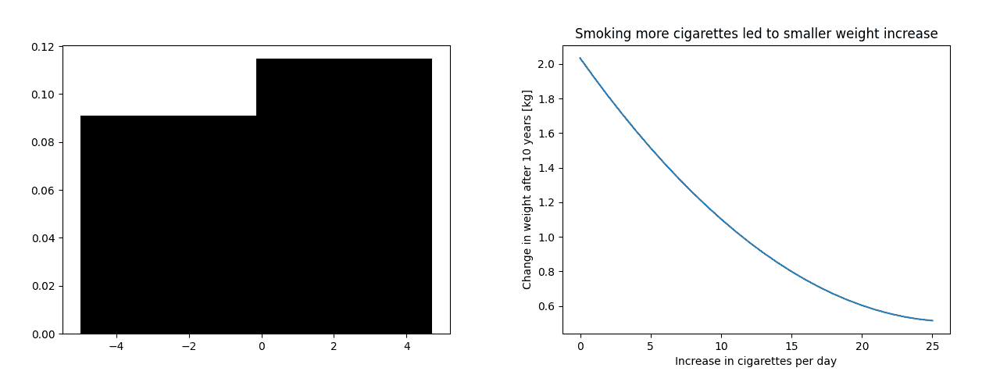
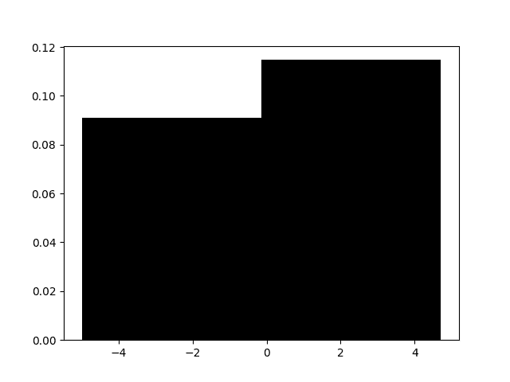
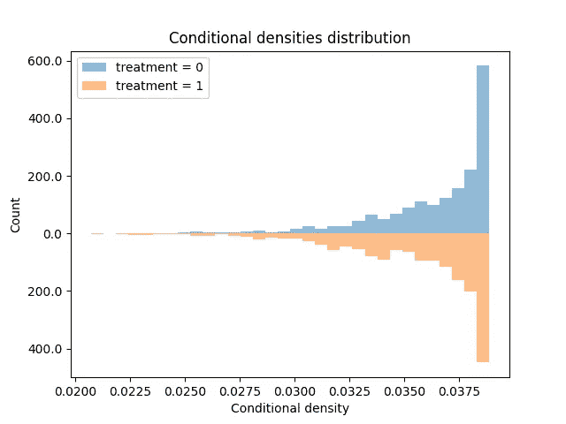
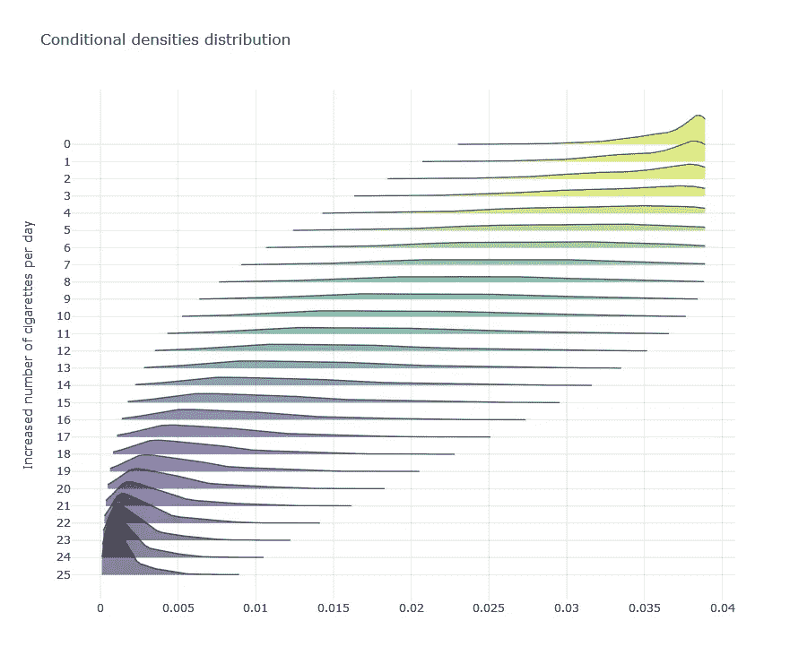

# 连续治疗的因果推断

> 原文：<https://towardsdatascience.com/causal-inference-with-continuous-treatments-5ff691869a65>

## 非分类治疗的广义逆概率权重

从分类变量到连续变量(作者)。

因果推断，从非随机观察数据中估计因果效应的科学，通常使用二元处理来表示；我们要么治疗，要么不治疗；我们给药物 A 或药物 b，这是有原因的，因为因果关系已经很复杂了。然而，并不是所有的干预都是二元的(或离散的)。

有时候，我们关心的干预是连续的。例如，“服用一种药物”是相当模糊的——药物有活性成分，这些活性成分可以有不同的剂量。太少，药物可能看起来无效，太多，药物可能有害。因此，我们可能对同一种药物不同剂量的效果感兴趣。这通常被称为剂量反应模型。

持续的曝光在我们周围随处可见。从药物剂量到每天吸烟的数量或空气污染水平，从跳过广告前你看广告的时间到时事通讯上“退订”按钮的红色，从中央银行提高利率到彩票中奖金额。我们不能仅仅因为入门书没有涵盖其他内容，就把自己局限于研究二元曝光。

在这篇文章中，我将介绍连续治疗的广义逆概率加权。我将展示不同的估计方法，并讨论所需的假设及其局限性。我假设你熟悉因果推理和二元处理的 IPW，但是如果你不熟悉——我会在这个 [IPW 解释器](/solving-simpsons-paradox-with-inverse-probability-weighting-79dbb1395597)中介绍你。

# 从二元治疗到连续治疗

回想一下，在二元治疗设置中，估计因果关系的一种常见方法是使用[逆概率加权](/solving-simpsons-paradox-with-inverse-probability-weighting-79dbb1395597)(有时称为逆倾向加权，但我将只使用 IPW)。给定个体 *l* ，处理赋值 *aₗ* ，特征 *xₗ* ，其逆倾向权重定义为:*wₗ=1/pr[a=aₗ|x=xₗ】*。即，在给定他们的特征的情况下，分配给他们的治疗的 *l* 的逆概率。

然而，当治疗(或任何这方面的随机变量)是连续的，那么[概率质量](https://en.wikipedia.org/wiki/Probability_mass_function)的概念就失效了，我们需要用[概率 ***密度***](https://en.wikipedia.org/wiki/Probability_density_function) 来说话。这是因为单个点的概率，比如说 *aₗ* ，基本上是 0，尽管它可能仍然具有与之相关的密度，因为密度被定义为累积概率函数的导数。这是一个基本的理论差异，但我们可以在一个小的符号变化中捕捉到它，我们将使用*ƒ(aₗ|xₗ*而不是*pr[a=aₗ|x=xₗ*。

用连续的高斯分布逐步逼近离散的二项式分布(图片由作者提供)

# 系统模型化

回想一下，估计 IPW 的治疗效果包括两个主要步骤。首先，对处理进行建模并获得 IP 权重。其次，用这些权重来模拟结果。在二元情况下，一旦我们有了权重，估计潜在结果的最简单方法就是简单地取治疗和未治疗的加权平均值(通常称为 [Horvitz-Thompson 估计量](https://en.wikipedia.org/wiki/Horvitz%E2%80%93Thompson_estimator))。然而，一个等效的方法是使用一个简单的单变量回归:根据 IP 权重加权的治疗(和截距)回归结果。然后，平均治疗效果简单地由对应于治疗变量的系数来定义。在流行病学文献中，这通常被称为边缘结构模型。

请注意，在连续治疗的情况下，第一个选项不适用。通常会有许多独特的处理值，对于所有的处理值，很少会有足够的样本具有*完全相同的*连续处理值。宁滨他们会解决它，但我们在这里进行连续处理建模。因此，我们将需要使用后一种选择，并在结果和治疗之间创建一个额外的(参数)模型。这将是我们的剂量反应函数。

让我们更详细地检查这两个步骤。

## 步骤 1:模拟治疗

对于分类治疗，我们需要对接受治疗的概率进行建模。我们可以通过回归协变量的治疗分配来做到这一点，基本上使用任何“分类器”输出 0-1 区间的预测，然后我们可以解释为概率。例如，逻辑回归是一种广义线性模型，由二项式分布(一种离散概率函数)定义。然而，随着治疗的持续，我们将需要一个回归模型来代替。例如，在广义线性模型中，线性回归模型由高斯分布定义。正如上面的动画所示，二项式分布的类别越多，就越接近正态分布。

一旦我们拟合了一个模型，我们就可以得到条件期望 *E[A|X]* 。但与二项式情况不同，在连续情况下，这不足以产生密度。为简单起见，让我们假设常见的高斯分布，它由均值和方差参数化。分布条件均值将是估计的条件期望(预测)；方差将是恒定的，并且将被设置为治疗和预测之间的残差的方差。一旦我们定义了分布，我们就可以根据这个分布得到观察到的处理值的密度。广义 IP 权重是这些密度的倒数。

总结步骤 1:

1.  拟合函数 *g(x)* ，对协变量 *X* 进行回归处理 *A* 。
2.  定义条件分布 *Dₗ=Normal(g(xₗ)、Var(aₗ-g(xₗ)))*
    a .每个样本的条件均值就是它的预测值。
    b .方差是固定的，是预测残差的方差。
3.  将密度 *dₗ* 定义为来自 *Dₗ* 的 *aₗ* 的值。
4.  定义重量 *wₗ* 为密度的倒数: *1/dₗ* 。

第一步的统计概要，模拟治疗

## 步骤 2:模拟结果

一旦我们获得了平衡权重 *w* ，我们就可以使用观察到的结果和处理来模拟反事实结果。为了做到这一点，我们用从步骤 1 中获得的 IP 权重对治疗结果进行回归。然而，与二元治疗情况不同，连续治疗的功能形式应该足够灵活，以避免由于错误设定而产生的偏差。例如，我们将添加治疗的二次项或使用样条等对其建模。

当我们对主要治疗变量进行非线性变换时，我们不能再将治疗效果解释为治疗协变量的系数。相反，为了进行反事实的结果预测，我们将设置一些治疗值，并通过我们的模型运行它以获得预测的结果，并在各个单元之间进行平均，以获得每个人都被分配了特定治疗值的平均结果。

我们可以对两个不同的处理值重复这个过程。那么因果效应将是这两个潜在结果预测之间的差异(或比率)。或者，我们可以对我们关心的范围内的每一个治疗值重复这个过程，并获得一个剂量-反应曲线——看看反事实的结果预测如何作为分配不同剂量的函数而变化。

边际结构模型——回归由广义 IP 权重加权的治疗结果。正如罗宾斯、埃尔南和布伦巴克提出的那样。

## 密码

下面是演示上述估算过程的 Python 代码。

从上述代码中截取的剂量反应曲线。

## 扩展ˌ扩张

以上描述的是简单的评估。然而，它可以扩展为多个部分。下面是一些这样的扩展。如果你够了，请随意跳过。

## 稳定重量

在二元处理的 IPW 中，我们通常将概率的权重计算为 1。这导致伪总体的大小是我们样本的两倍，因为每个治疗组的加权结果是我们原始样本的大小。

稳定权重是一个版本，其中分子不是 1，而是治疗流行率(二元治疗的平均值)。这缩小了权重，使得总体伪总体大小是原始样本的大小，而不是两倍的大小。

这种稳定性也适用于连续治疗设置。代替将分子设置为 1，我们可以将分子取为平均处理值下的处理值的密度(或者，更一般地，仅截距模型的预测)。在这个公式下，我们也可以稳定效果修改器，但这是另一篇文章)。上面的代码显示了一个更值得推荐的稳定版本。

## 用巧妙的协变量代替加权回归

在第二步中，当基于治疗的结果建模时，我们将广义倾向分数作为权重合并到加权回归中。这通常被称为边际结构模型，由 [Robins、Hernan 和 Brumback](https://pubmed.ncbi.nlm.nih.gov/10955408/) 描述。然而，类似于[不同口味的 TMLE](https://github.com/IBM/causallib/blob/master/examples/TMLE.ipynb) ，我们也可以将广义倾向得分作为额外的协变量纳入第二步结果回归，而不是作为权重。事实上，这正是[平野和伊本斯所建议的](https://onlinelibrary.wiley.com/doi/10.1002/0470090456.ch7)。

在这个版本中，我们添加了密度(不是它们的倒数)作为一个额外的特征。但是，由于它是另一个连续的度量，容易出现错误设定，我们将灵活地添加它。通常还通过添加平方项和与治疗变量(或样条)的相互作用。

以广义 IP 权重作为预测因子的结果模型。如[平野和 Imbens](https://onlinelibrary.wiley.com/doi/10.1002/0470090456.ch7) 所提议。

需要注意的一个小但重要的细节是，在预测过程中，当我们为所有个体设置感兴趣的治疗值时，我们现在首先需要计算该特定值的密度，然后将这些密度作为预测值插入我们应用的结果模型。

## 异方差密度和其他分布

在第一步的第(2)项中，我们用一个固定的方差来估计所有个体的密度。这种被称为同伦假设的假设是合理的(可以通过检验残差进行经验检验)，但可以放宽。类似于密度函数的均值如何取决于协变量(即预测)，方差也可以是随协变量变化的函数。或者以其他方式，如密度加权回归。

此外，我们可以使用其他分布参数化密度函数，如 t 分布、截尾正态分布等。或者，可以通过使用核密度估计进一步去参数化，但天下没有免费的午餐，这将需要更密集的数据来进行可靠的估计。

# 持续治疗下的阳性假设

到目前为止，我们已经讨论了如何获得治疗和结果之间的统计关联。然而，要将它们转换成因果关系，我们需要做额外的假设。无论统计估计有多复杂，这些假设都是必要的。我们需要在此基础上应用额外的逻辑来证明这些联想差异确实是因果关系。

**因果关系=联想+逻辑**

回想一下，我们有三个主要假设:一致性、可交换性和积极性。一致性是对治疗机制的一种假设，因此与分类治疗设置相同。可交换性假设不存在不可测量的混杂因素，并且在给定协变量的情况下，每个潜在结果独立于观察到的治疗分配(无偏倚)——这也是相同的。积极是需要一些调整的假设。

回想一下，在分类情况下，阳性假设每个单元都有一些机会(正概率)被分配到每个治疗中。这意味着治疗组共享共同的支持，并且它们的特征重叠。对于整个空间协变空间 *X* 上的所有处理值 *a* ，它被正式定义为 *Pr[A=a|X] > 0* 。

但是在连续的情况下，我们需要用密度来代替概率。然而，其余的保持不变。对于整个协变量空间 *X* 的所有处理值 *a* ，我们将需要*\u( A = A | X)>0*。也就是说，我们需要所有可用的治疗组合和协变量水平的正密度。幸运的是，这可以通过在我们获得的密度模型(其平均值是我们的回归预测)下检查不同处理值的密度来进行经验测试(像常规阳性一样)，特别是那些我们最感兴趣的。

绘制吸烟实例的条件密度直方图以评估重叠。这里测试两个治疗值:0 =吸烟强度没有变化，1 =每天增加一支烟。这相当于在二元治疗情况下绘制概率图，以评估各组之间的重叠。

或者更广泛地说——检查所有 可能剂量增加的 ***的条件密度分布的脊状图。我们看到剂量之间的距离越远，重叠越小。因此，我们可能更相信局部变化的影响(比如说，增加 5 对没有变化)，而不是全局变化的影响(比如说，增加 25 对没有变化)。***

# 限制

增加治疗值的数量不是没有代价的。在模拟连续治疗时，我们应该注意几个限制。

首先，理论假设更难符合。更难实现可交换性，因为我们现在有更多的治疗值，我们希望实现无基础。出于同样的原因，也因为条件密度由于其连续的性质而可能更稀疏的事实，实现积极性也更难。

其次，连续变量更难建模。他们更倾向于错误的设定。我们可以通过使用灵活的估计器(如加法树)或灵活的数据转换(如 GAMs 中的样条)来部分解决这个问题，但这是有代价的——需要更多的数据或由于偏差-方差权衡而引入一些偏差。此外，众所周知，密度很难估计，我们的广义 IP 权重可能对密度估计器的不同选择很敏感。

第三，通常一些连续的测量实际上是有序的。在顺序尺度上的处理可以近似为连续的，特别是当类别的数量及其范围增加时。但是顺序变量的连续逼近也可能由于错误设定而引入一些偏差。IPW 可以推广到序数尺度，这需要序数回归(类似于我们需要线性回归，而常规 IPW 需要逻辑回归)，但这些超出了本文的范围。只是想让你知道。

最后，以一个更好的方式结束，在这篇文章中，我想到了一个持续治疗和持续结果的例子。然而，这也适用于其他结果。即，第二步结果模型可以对应于任意类型的结果。最常见的是，如果我们有二元结果，我们可以应用逻辑回归(或任何其他“分类器”)。

# 结论

在这篇文章中，我介绍了连续治疗的因果推理。我介绍了它们的重要性，描述了如何对它们建模，如何调整所需的因果假设，以及它们的局限性。希望你觉得有用。