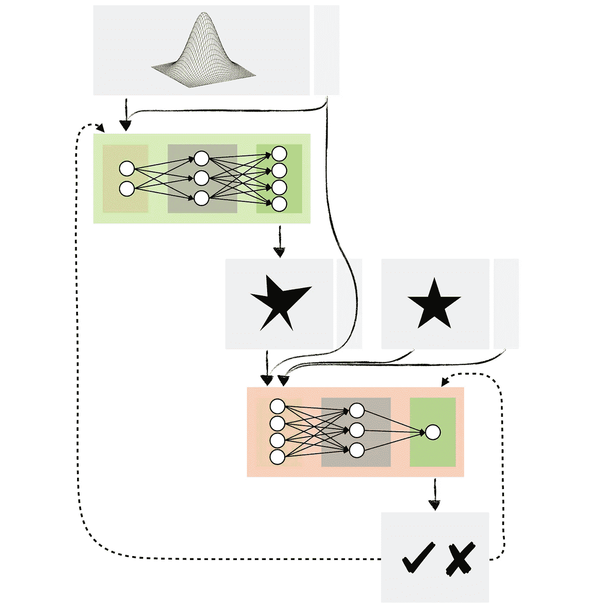
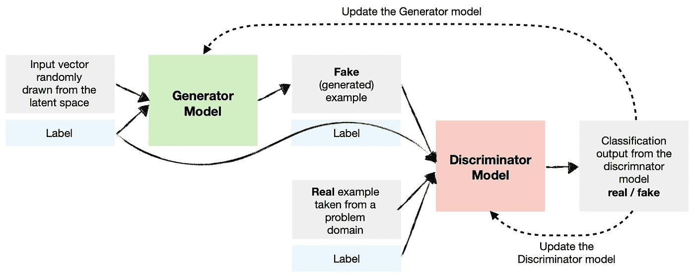
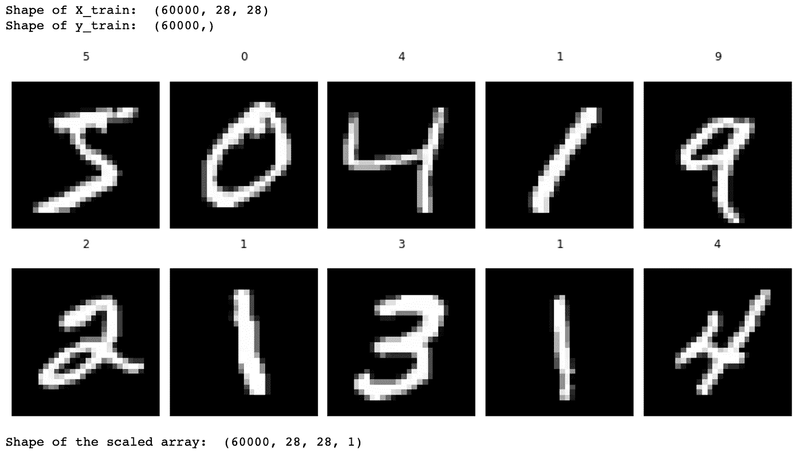
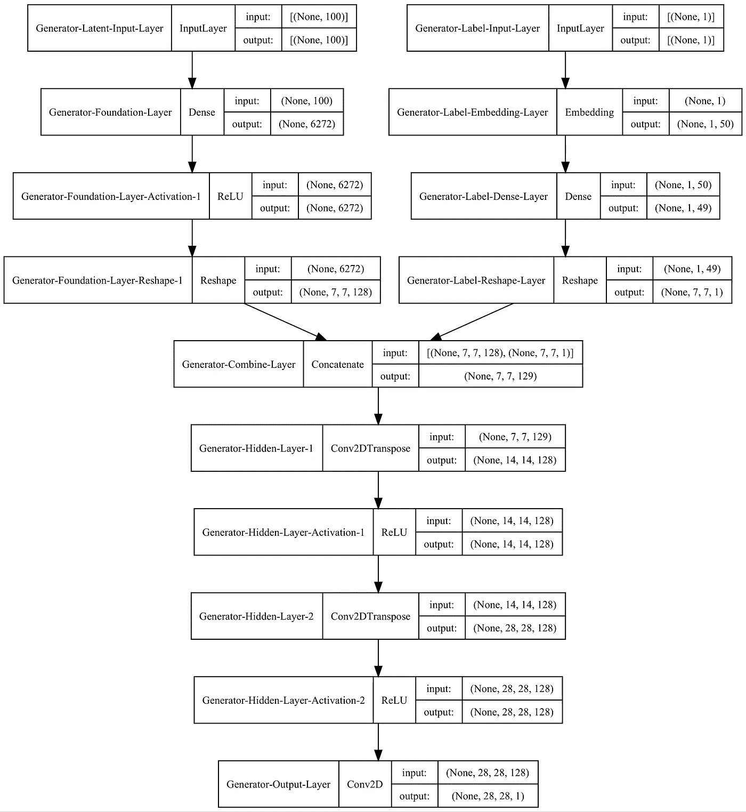
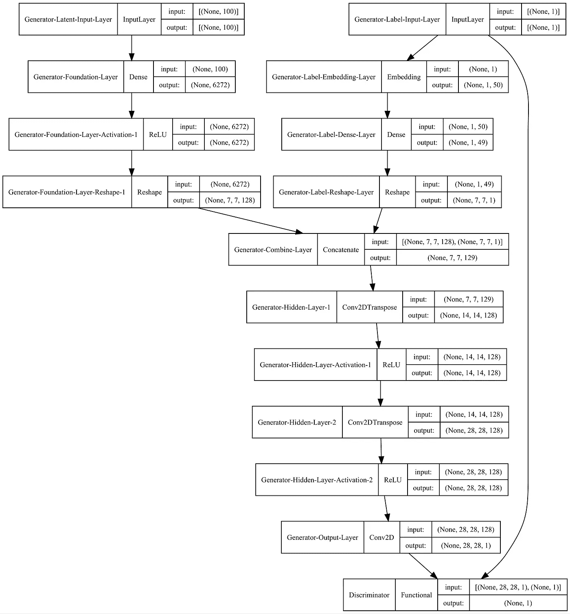
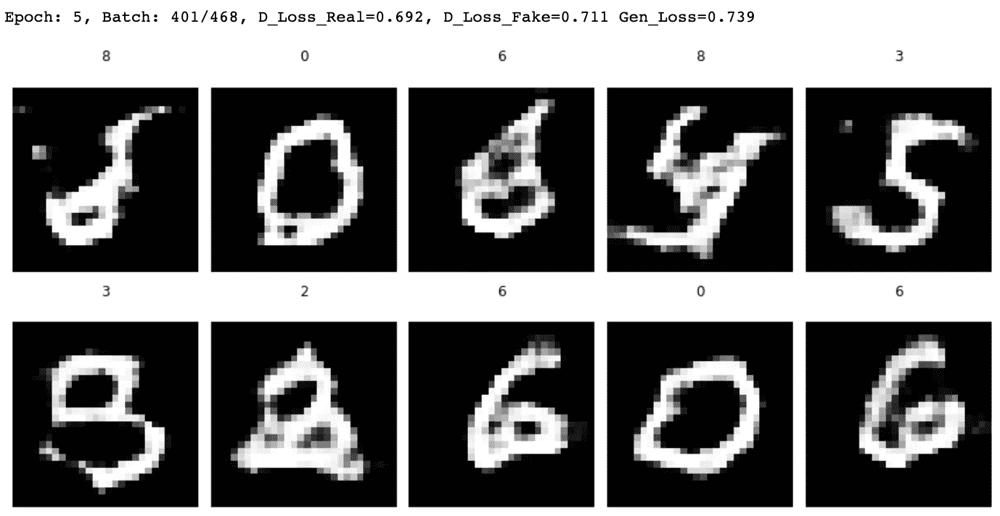
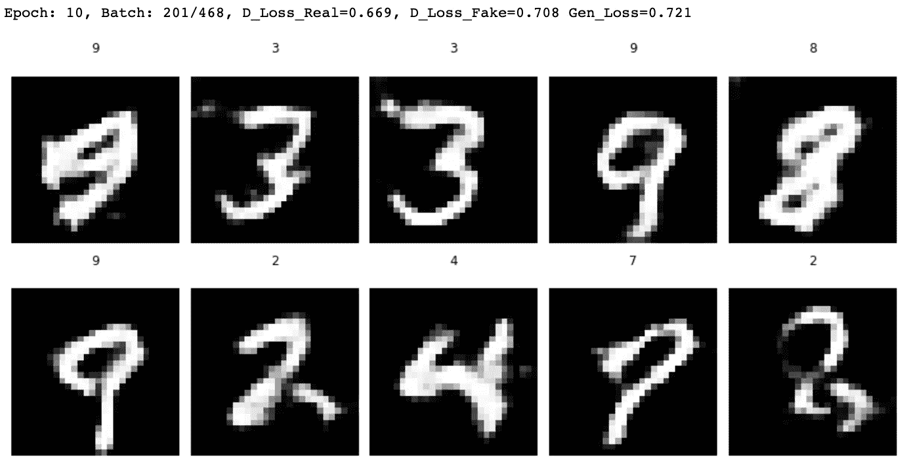
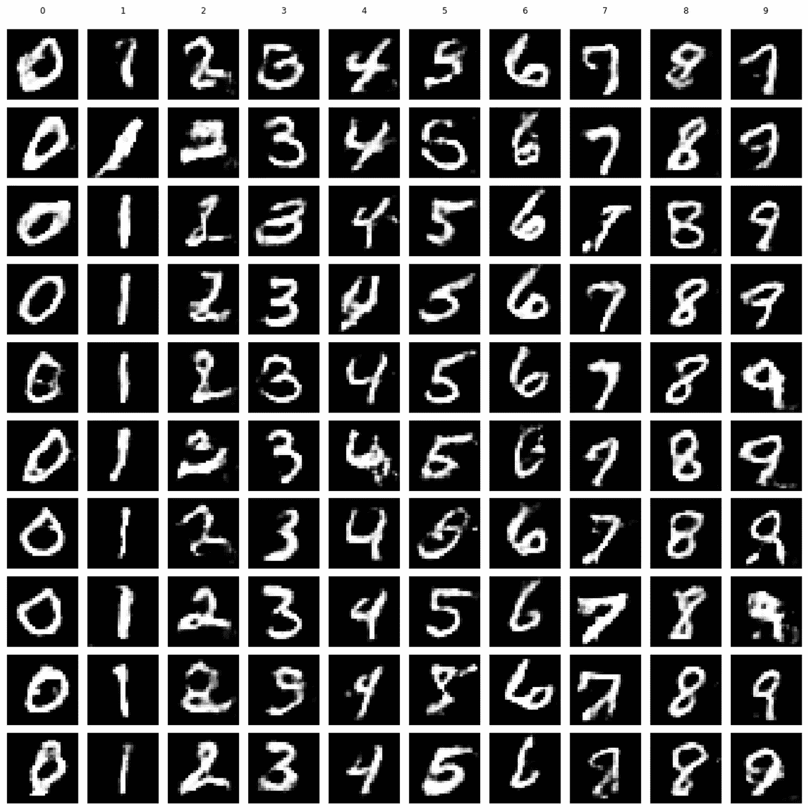

# cGAN:条件生成对抗网络——如何获得对 GAN 输出的控制

> 原文：<https://towardsdatascience.com/cgan-conditional-generative-adversarial-network-how-to-gain-control-over-gan-outputs-b30620bd0cc8>

## 神经网络

## 用一个详细的 Python 例子解释 cGAN 架构



条件生成对抗网络。图片由[作者](https://solclover.com/)提供。

# 介绍

你尝试过生成性对抗网络(GANs)吗？如果是这样，你可能遇到过这样的情况，你想让你的 GAN 产生一个**特定类型的数据**，但是对 GAN 的输出没有足够的控制。

例如，假设你使用了一系列花卉图像来训练一个能够制作花卉假像的 GAN。虽然您可以使用您的模型生成一个随机的花的图像，但您不能指示它创建一个图像，比如说，一朵郁金香或一朵向日葵。

有条件的 GAN (cGAN)允许我们用类标签等附加信息来调节网络。这意味着在训练过程中，我们将图像和它们的实际标签(玫瑰、郁金香、向日葵等)一起传递给网络。)来了解它们之间的区别。这样，我们就能够要求我们的模型生成特定花朵的图像。

# 内容

在本文中，我将带您了解以下内容:

*   条件 GAN (cGAN)在机器学习算法领域中的地位
*   cGAN 和 cDCGAN 架构及其组件概述
*   Python 示例向您展示了如何使用 Keras / Tensorflow 从头开始构建条件 DCGAN

# **机器学习算法宇宙内的条件甘(cGAN)**

虽然大多数类型的神经网络都是受监督的，但有些(如自动编码器)是自我监督的。由于这一点以及它们对机器学习的独特方法，我在我的 ML 宇宙图中给神经网络赋予了它们自己的类别。

由于条件性 GAN 是 GAN 的一种类型，您可以在生成性对抗性网络子类别下找到它。点击👇在下面的**交互式图表**中，找到 cGAN 并揭示隐藏在 ML 每个分支下的其他算法。

机器学习算法分类。由[作者](https://solclover.com/)创建的互动图表。

***如果你喜欢数据科学和机器学习*** *，请* [*订阅*](https://bit.ly/3sItbfx) *获取我的新文章邮件。如果你不是中等会员，可以在这里加入*<https://bit.ly/36Mozgu>**。**

# ***cGAN 架构及其组件概述***

## *我们如何调节 GAN？*

*让我们首先提醒自己一个基本的[生成对抗网络](/gans-generative-adversarial-networks-an-advanced-solution-for-data-generation-2ac9756a8a99)架构。*

**

*基本 GAN 模型架构。图片由[作者](https://solclover.com/)提供。*

*如您所见，我们有两个主要组件:*

*   ***生成器模型** —生成与问题域相似的新数据(即假数据)。*
*   ***鉴别器模型** —尝试识别所提供的示例是假的(来自生成器)还是真的(来自实际的数据域)。*

*在条件性 GAN 的情况下，**我们希望对发生器和鉴别器都进行条件化**，以便它们知道自己处理的是哪种类型。*

*假设我们使用 GAN 创建包含伦敦和马德里房价的合成数据。为了使它有条件，我们需要告诉生成器每次生成哪个城市的数据。我们还需要通知鉴别器传递给它的例子是伦敦的还是马德里的。*

*因此，有条件的 GAN 模型架构如下所示:*

**

*条件 GAN (cGAN)模型架构。图片由[作者](https://solclover.com/)提供。*

*请注意，我们可以根据多种类型的输入来调节 gan。例如，我们还可以在其他图像上调节网络，以便为图像到图像转换创建 GAN(例如，将白天的图像转换为夜间的图像)。*

## ***条件深度卷积 GAN (cDCGAN)***

*与之前的 flower 示例一样，我们可能希望对[深度卷积 GAN](/deep-convolutional-gan-how-to-use-a-dcgan-to-generate-images-in-python-b08afd4d124e) 进行调整，以便我们可以要求模型生成特定类型的图像。*

*下面是一个条件 DCGAN 的模型架构图。请注意，除了生成器和鉴别器包含额外的层，如[卷积](/convolutional-neural-networks-explained-how-to-successfully-classify-images-in-python-df829d4ba761)和[转置卷积](/transposed-convolutional-neural-networks-how-to-increase-the-resolution-of-your-image-d1ec27700c6a)之外，高级架构与前面的示例基本相同。*

**

*条件深度卷积生成对抗网络。图片来自[作者](https://solclover.com/)。*

*[](https://solclover.com/membership)**[](https://www.linkedin.com/in/saulius-dobilas/)*

# *Python 示例*

*在本例中，我将向您展示如何构建上图所示的 cDCGAN。它将使我们能够生成类似于 MNIST 数据集中的“假”手写数字。*

*由于我们正在构建一个有条件的 GAN，我们将能够指定希望生成器每次生成哪个数字(0–9)。*

## *设置*

*我们需要获得以下数据和库:*

*   *[MNIST 手写数字数据](https://www.tensorflow.org/api_docs/python/tf/keras/datasets/mnist/load_data)(版权由 Yann LeCun 和 Corinna Cortes 根据[知识共享署名-分享 3.0 许可证持有](https://creativecommons.org/licenses/by-sa/3.0/)；数据的原始来源:[MNIST 数据库](http://yann.lecun.com/exdb/mnist/)*
*   *[Numpy](https://numpy.org/) 用于数据操作*
*   *用于一些基本可视化的 [Matplotlib](https://matplotlib.org/stable/api/index.html) 和 [Graphviz](https://graphviz.org/)*
*   *[神经网络的 Tensorflow/Keras](https://www.tensorflow.org/api_docs/python/tf)*

*让我们导入库:*

*上面的代码打印了本例中使用的包版本:*

```
*Tensorflow/Keras: 2.7.0
numpy: 1.21.4
matplotlib: 3.5.1
graphviz: 0.19.1*
```

*接下来，我们加载 MNIST 数字数据，这在 Keras 数据集中是可用的。*

*上面的代码显示了前十位数字及其标签。*

**

*MNIST 训练数据集中的前十个数字。图片由[作者](https://solclover.com/)提供。*

## *创建有条件的 DCGAN 模型*

*完成数据准备后，让我们定义和组装我们的模型。请注意，我们将使用 **Keras Functional API** ，这比顺序 API 给了我们更多的灵活性，允许我们创建复杂的网络架构。*

*我们将**从发电机开始:***

**

*发电机模型图。图片来自[作者](https://solclover.com/)。*

*我们有**两个输入**到一个发电机模型。第一个是 100 节点的潜在向量，它是我们模型的种子，第二个是标签(0–9)。*

*潜在向量和标签在通过网络的其余部分之前被整形和连接，转置卷积层将数据放大到所需的大小(28 x 28 像素)。*

*接下来，让我们定义一个**鉴别器模型:***

**

*鉴别器模型图。图片由[作者](https://solclover.com/)提供。*

*鉴频器也有两个独立的输入。一个是标签，另一个是图像——要么是来自 MNSIT 数据集的真实图像，要么是由生成器模型创建的虚假图像。*

*输入被组合并通过网络传递。卷积层和最大池层在输出层进行预测(真实/虚假)之前提取要素并减小大小。*

*让我们**结合生成器和鉴别器**来创建一个条件深度卷积对抗网络(cDCGAN)。下面代码中的一个关键细节是我们**使鉴别器模型不可训练**。我们这样做是因为我们希望使用真实和虚假(生成)数据的组合来分别训练鉴别器。稍后您将看到我们是如何做到这一点的。*

**

*cDCGAN 模型图。图片由[作者](https://solclover.com/)提供。*

*注意生成器和鉴别器如何使用相同的标签作为输入。*

## ***为发生器和鉴别器准备输入***

*我们将创建三个简单的函数来帮助我们为这两个模型采样/生成数据。*

*   *第一个函数从训练数据中采样真实图像和标签；*
*   *第二个函数从潜在空间中提取随机向量，以及随机标签作为生成器的输入；*
*   *最后，第三个函数将潜在变量和标签传递到生成器模型中，以生成假的示例。*

## ***模型培训和评估***

*最后两个函数将帮助我们训练模型并显示中间结果(以指定的时间间隔)，因此我们可以观察生成器如何随着时间的推移而改进。*

*让我们先创建一个函数来显示中期结果:*

*最后，让我们定义训练函数:*

*现在我们可以调用我们的训练函数，喝点茶，让计算机完成剩下的工作😃*

```
*train(gen_model, dis_model, gan_model, data, y_train, latent_dim)*
```

## ***结果***

*当生成器和鉴别器相互竞争，我们可以跟踪他们的进展。*

*以下是生成器创建手写数字的一些早期尝试:*

**

*生成器创建手写数字的早期尝试。图片由[作者](https://solclover.com/)提供。*

*时代 5 的一些进展:*

**

*第 5 纪元对生成器结果的改进。图片由[作者](https://solclover.com/)提供。*

*通过 Epoch 10 的假图像，生成器在整个训练过程中继续变得更好，如下所示:*

**

*通过 Epoch 10 改进了生成器结果。图片由[作者](https://solclover.com/)提供。*

*模型训练完成后，我们可以保存发电机部分以备将来使用。*

*下面是一个示例，说明我们如何加载模型并让它生成带有特定标签的图像:*

**

*用我们的 cDCGAN 模型生成的“假”手写数字。图片由[作者](https://solclover.com/)提供。*

*正如您所看到的，结果并不完美，但我们可以通过更长时间地训练模型来进一步改进它们。*

# *结束语*

*我希望我的解释和例子足够清楚。无论哪种方式，如果您有任何问题或建议，请不要犹豫留下评论。上面 Python 代码的完整 Jupyter 笔记本可以在我的 [**GitHub 库**](https://github.com/SolClover/Art054_NN_cGAN) 找到。*

*此外，请随时查看我在 Medium/TDS 上的其他 GAN 和神经网络文章:*

*   *生成对抗网络:[干](/gans-generative-adversarial-networks-an-advanced-solution-for-data-generation-2ac9756a8a99)， [DCGAN](/deep-convolutional-gan-how-to-use-a-dcgan-to-generate-images-in-python-b08afd4d124e)*
*   *卷积网络: [DCN](/convolutional-neural-networks-explained-how-to-successfully-classify-images-in-python-df829d4ba761) ，[转置 CNN](/transposed-convolutional-neural-networks-how-to-increase-the-resolution-of-your-image-d1ec27700c6a)*
*   *经常出现的网络: [RNN](/rnn-recurrent-neural-networks-how-to-successfully-model-sequential-data-in-python-5a0b9e494f92) ， [LSTM](/lstm-recurrent-neural-networks-how-to-teach-a-network-to-remember-the-past-55e54c2ff22e) ， [GRU](/gru-recurrent-neural-networks-a-smart-way-to-predict-sequences-in-python-80864e4fe9f6)*
*   *自动编码器: [AE](/autoencoders-ae-a-smart-way-to-process-your-data-using-unsupervised-neural-networks-9661f93a8509) ， [DAE](/denoising-autoencoders-dae-how-to-use-neural-networks-to-clean-up-your-data-cd9c19bc6915) ， [VAE](/vae-variational-autoencoders-how-to-employ-neural-networks-to-generate-new-images-bdeb216ed2c0) ， [SAE](/sparse-autoencoder-neural-networks-how-to-utilise-sparsity-for-robust-information-encoding-6aa9ff542bc9)*

*如果你想收到我即将发表的关于机器学习和神经网络的文章，请用你的电子邮件订阅，一旦我发表了这些文章，它们就会马上到达你的收件箱。*

*干杯！🤓
**索尔·多比拉斯***

**我加入媒体的个性化链接:**

*<https://bit.ly/3J6StZI> *