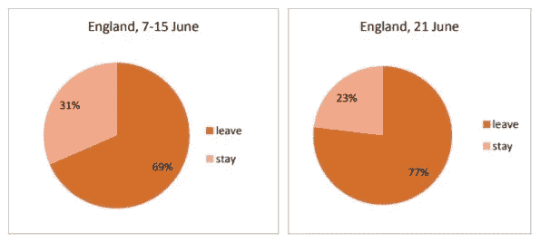
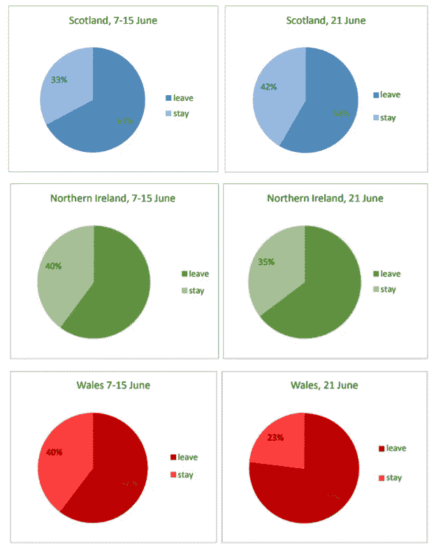

# 检查你的偏见

> 原文：<https://towardsdatascience.com/check-your-biases-ba2685a7f799>

## **符号引擎和意想不到的结果——个人编码体验**

*摘要*

【2016 年 6 月，就在英国退出欧盟投票的前几天，在 K-Drive 项目刚刚结束后，我正乘坐英国航空公司(British Airways)的飞机从苏格兰阿伯丁飞往意大利。我随身带着一台笔记本电脑，里面有我在过去几周开发的一个小型 NLP 模型，用来预测英国退出欧盟的结果。除了模型，我还有详细描述预测本身的信息图表，这与主流的预测有很大不同。

照片由 [Rohan Makhecha](https://unsplash.com/@rohanmakhecha?utm_source=medium&utm_medium=referral) 在 [Unsplash](https://unsplash.com?utm_source=medium&utm_medium=referral) 上拍摄

玛丽居里行动(Marie Curie actions)旗下的 K-Drive 项目(K-Drive Project)是一个由欧洲资助的项目，位于阿伯丁大学，旨在将工业界和学术界聚集在一起，在语义技术领域进行相互交流和共同努力。我于 2016 年 1 月作为 MER(更有经验的研究员)加入，当时主要论文已经发表，所以我被分配了培训和公开演讲任务，以展示所涉及的 NLP 技术。

在项目结束前的最后一个月，我们决定采用我们最初为苏格兰独立公投开发的模型，以监控社交媒体上关于英国退出欧盟的意见，寻找预测结果的见解和趋势。

经过一些磋商，我们决定使用 Twitter 作为一个来源，基于以前的经验和专业知识:推文简短、相关且切中要点，由各种各样的用户撰写，通常带有可靠的标签，而脸书的帖子则往往琐碎、过长且用蹩脚的英语撰写。此外，Reddit 的帖子有时很难理解，而且可能充满了钓鱼信息，而 Twitter 上的评论与原始推文截然不同，在分析中很容易被忽略。

首先，一名软件工程师开发了一个蜘蛛来下载在苏格兰、英格兰、北爱尔兰和威尔士发布的推文，这样它们就可以被分别处理，而我作为一名知识工程师，负责调整和进一步开发语言引擎。该蜘蛛被设计为只下载包含与英国退出欧盟公投相关的标签的推文，这是通过 Twitter API 允许的，属于我准备的一个微调列表。

在对大约 400 条随机推文的训练语料库进行初步分析后，我决定开发一个完全符号化的引擎，主要依靠知识图来掌握推文中包含的概念，以便理解观点以及相关的情绪。我试图涵盖整个语义领域，也包括苏格兰俚语。

因此，每天我们都会爬上 Twitter，获取推文，转换它们，并将其提供给语言引擎。不涉及机器学习。引擎在整个过程中保持不变，因此我们可以根据地理区域记录在线表达的趋势。

但当第一批结果开始出现时，有些尴尬，因为产出显示出坚实的、无可争议的休假优势。事实上，每一天都以明确的脱欧结果结束，这一趋势还在继续，而整个世界都一致认为，留欧一直以几个百分点的优势胜出。

当然，有人问我为什么我的结果会走调，所以我做了一个(自我)令人信服的演讲，讲述了公投活动人士总是比沉默的大多数更有发言权，因此我的结果将被视为对社会科学的见解，而不是对政治决策的实际预测。显然，我避免提及害羞的保守党因素。

但是，当我完全被自己的编码所吸引时，我不禁注意到，我被困在了主流媒体的叙述和我每天实际会见大量离职者的轶事经历之间。我的女房东，同行的爬山者，同行的观鸟者，酒吧里的石油和天然气公司的人，路那头那个地方的女收银员。他们很年轻，来自各种地方，有各种背景，有些人有博士学位，他们会问问题。

我就是这样，一个(南部)欧洲公民，在一个欧洲资助的项目中，舒适地坐在古老的梅斯顿大楼里，愉快地编码我的工作日，或者走在泥泞的小路上，寻找绒鸭、海雀和海雀，偶尔在周末还会看到狐猴。

我是一个有争议的人物，所以有人问我问题。

“我在出差”通常是不被允许的。“我在阿伯丁大学工作，从事一个欧洲资助的项目”遇到了一些紧张的尴尬。“我在 IT 部门工作”听起来很可疑，因为所有在阿伯丁的外国人都在石油&天然气部门工作。

离开者真的很大声。他们会告诉我被困在欧洲官僚机构中的感觉，并希望能够加入更多大型项目。或者他们会谈论英国不想缴纳欧洲税，或者无法承受不断增加的移民流。

我当然不会告诉他们哦，别担心！我刚刚发明了一个神奇的电脑，它会说“离开”会赢！

人工智能炒作还没有开始，所以他们不会相信我。

无论如何，新闻稿已经写好了，我们的[结果](https://www.bloomberg.com/press-releases/2016-06-22/expert-system-and-the-university-of-aberdeen-find-that-64-75-of-tweets-from-britain-are-inclined-to-leave-the-european-union)也展示出来了。公投结果正式宣布的那天早上，我在意大利的家里。我正在吃早餐，我对自己说，我不想成为英国的外国人，但是如果我们是对的，而其他人都是错的，那不是很酷吗？

事实证明我们是对的，其他人都错了。

显然，明智地选择资源(在这里是 Twitter)和精心开发符号引擎是我们成功的关键。

但是后来主流分析出来了，我完全吃了一惊。给我的英国英国退出欧盟的总体印象是，只有没有上过学的农村老人投票离开，而城市里充满活力的年轻专业人士全都投票留下，与我的直接经历相比，这感觉完全超现实。显然，我不得不打消主流媒体只是根据政治议程框定事件的怀疑。也许他们一直都知道强烈的脱欧投票，但没有说出来，因为害怕导致更多的人投票脱欧，现在他们正在制造一个受广播剧*阿彻*启发的英国刻板印象，让脱欧者重新考虑。但这可能是阴谋论，所以我们可以排除它。

所以慢慢地怀疑开始蔓延。如果*我的*代码一开始就有偏差，我错得到了正确的结果怎么办。但是怎么做呢？不涉及机器学习，所以引擎不可能意外地从不平衡的训练集中学习。这是一个完全象征性的引擎——因此这种偏见肯定是无意的。

关键是符号引擎总是不受理论约束的。根据科学方法，你应该基于观察形成一个假设，然后你做出一个预测，你测试它，你重复测试直到你有足够一致的数据来得出结论。符号引擎不是这样工作的。它从不根据理论发展，没有观察、假设或预测。我想可能有一些假设，但是它们应该被认为是这样的，而不是编码到引擎中。符号引擎包含一组复杂的概括的、可解释的条件，这些条件是基于已知的需求以及对相关训练集的分析而开发的。概括需要直觉，这将是引擎中人类的火花，这将允许它自主工作。开发完成后，将处理新的数据集，并根据哪些条件为真来执行代码，从而返回反映初始需求的输出，并概述可能是或可能不是预期的信息和相关性。

最后，我们相信计算而不是假设，就像伽利略一样。

我也重新考虑 Twitter 作为一个有效的来源。会不会本身就有偏见？推特用户代表了所有英国选民吗，或者也许是左派代表过多了？在社会科学研究中，我仍然找不到任何令人信服的证据来支持这样一个理论，即人们在 Twitter 上比在现实生活中更容易请假。

突然，启示来了。如果与休假人员的日常接触让我开发出更好地理解休假词汇、概念、措辞和措辞的代码，会怎么样？或者可能是让人们更加直言不讳，在现实生活中以及在社交媒体上，他们最终教我他们的语言，我将这些知识传递给引擎。也许我不能很好地从呆着的人身上学到东西，因为他们要安静得多。毕竟，在我半心半意地为自己的工作辩护时，我实际上是在描述我的模型成功背后的非常社会语言学的过程。

所以现在我担心我的代码会无意中出现偏差，也就是说，患上了人工智能世界中最危险的疾病。话说回来，可能还有另一个因素。当前人工智能叙述中对偏见的炒作如此强烈，以至于炒作本身可能会影响我的判断。

总之，在处理符号引擎的发展时，我认为在我们的分析中融入社会语言学的元素是有用的。了解我们的源代码如何工作，人们如何在其中交流，我们如何能够解释他们的信息，可以帮助我们开发一个更平衡的代码。

当然，这一经历让我更多地尝试机器学习，不是作为符号引擎的生硬替代，而是为了混合解决方案。在我们用于符号开发的相同集合上训练 ML 模型可以提供有用的比较，以突出和理解我们结果中的偏差。

我越来越相信，多学科方法在这个领域是有益的，可以提高我们从大型数据集获得自动化、可靠见解的能力。

[加入对话](https://community.expert.ai/)