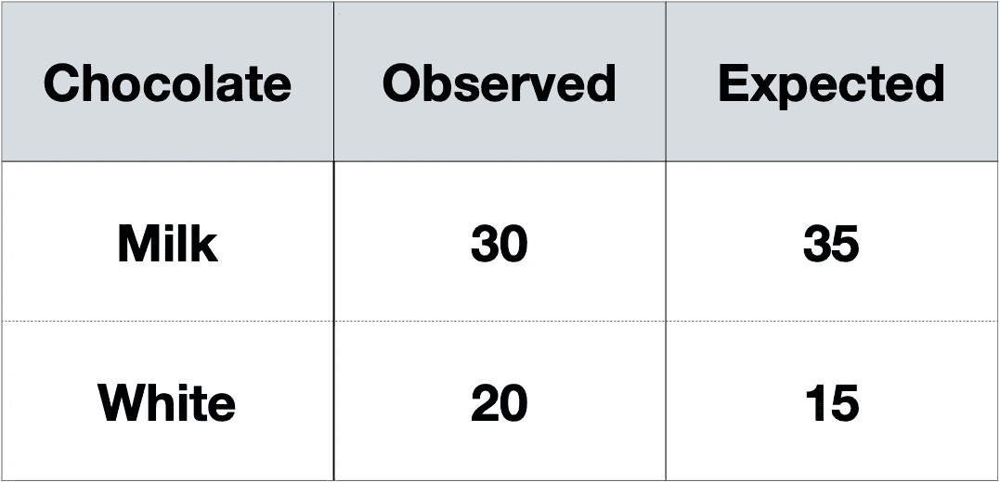

# 卡方拟合优度检验

> 原文：<https://towardsdatascience.com/chi-square-goodness-of-fit-test-7774d3410896>

## 数据科学中卡方拟合优度统计检验的简明解释

Riho Kroll 在 [Unsplash](https://unsplash.com?utm_source=medium&utm_medium=referral) 上拍摄的照片

# 介绍

我们最近探索并推导出了**卡方分布**，您可以在此查看:

</chi-square-distribution-simply-explained-87f707ba631a>  

如果您对卡方分布不熟悉，我强烈推荐您阅读这篇文章，否则这篇文章对您来说毫无意义！

然而，在本帖中，我们将讨论卡方检验中的一种，拟合优度检验。

该测试用于**验证我们的样本数据分布是否与该数据的某些预期分布一致**。换句话说，它决定了样本和预期分布之间的差异是随机产生的，还是具有统计学意义。

在本文中，我们将深入探讨拟合优度测试背后的数学原理，并通过一个例题来获得我们的直觉！

# 测试的假设

*   有一个**分类变量**
*   观察是独立的
*   **每个变量中每个类别的**频数**应该大于 5**
*   **每组数据中的**频数**必须**互斥****
*   **数据被随机采样**

# ****卡方检验统计量****

****和每一个假设检验一样，我们需要找到一些**检验统计量**。对于[卡方检验](https://www.statisticshowto.com/probability-and-statistics/chi-square/)，它是:****

********

****作者在 LaTeX 中生成的方程。****

*   *******v*** [是自由度](https://en.wikipedia.org/wiki/Degrees_of_freedom_(statistics))****
*   *******O*** 是来自样本的观测值****
*   *******E*** 是总体的期望值****
*   *******n*** 是变量中的类别数****

****当我们看一个例子时，这个公式会更有意义。****

> ****注意卡方分布来自分子的平方****

# ****假设检验步骤****

*   ****定义空、 ***H_0、*** 和候补、 ***H_1*** ，假设。****
*   ****决定你的[**显著性水平**](https://en.wikipedia.org/wiki/Statistical_hypothesis_testing) ，这是未能拒绝或拒绝零假设的**概率阈值。通常选择值 **5%** ，其将对应于依赖于分布的某个 [**临界值**](https://support.minitab.com/en-us/minitab-express/1/help-and-how-to/basic-statistics/inference/supporting-topics/basics/what-is-a-critical-value/) 。******
*   **计算 [**测试统计量**](https://en.wikipedia.org/wiki/Test_statistic) ，在我们的例子中，它将是上面给出的卡方统计量。**
*   **将测试统计值与临界值进行比较。如果它更大，那么我们拒绝零假设，否则我们无法拒绝零假设(这是一个右尾检验)。**

**为了更深入地理解假设检验和临界值，我建议阅读我的关于置信区间和 Z 检验的帖子，它将上述步骤进一步分解:**

**</z-test-simply-explained-80b346e0e239>  </confidence-intervals-simply-explained-58b0b11e985f>  

也有许多 [youtube 视频](https://www.youtube.com/watch?v=zR2QLacylqQ)和[网站](https://www.statisticshowto.com/probability-and-statistics/hypothesis-testing/)也做了大量假设检验步骤。

# 工作示例

让我们看一个非常简单的例子。

一家糖果店声称，每个巧克力球袋含有 70%的牛奶巧克力球和 30%的白巧克力球。

我们挑选一个巧克力球袋，里面有 50 个球。在这个包里，30 个是牛奶巧克力，20 个是白巧克力。这是 60%牛奶巧克力和 40%白巧克力的混合物。

这个观察结果符合糖果店的说法吗？

## 假设

*   ***H_0*** : *糖果店的说法是* ***正确的*** *为每个巧克力球袋中的白巧克力平分 70-30%的牛奶*
*   ***H_1*** : *糖果店的说法是* ***不正确的*** *为每个巧克力球袋中 70-30%牛奶兑白巧克力的比例*

在本例中，我们将使用 **5%的显著性水平**。

## 相依表

我们从小样本中计算观察到的和预期的巧克力类型，并将其显示在[列联表](https://en.wikipedia.org/wiki/Contingency_table)中:

由作者生成的图像。

## 检验统计量

现在，我们使用上面显示的公式计算卡方检验统计量:

作者在 LaTeX 中生成的方程。

***自由度，df*** ，公式为:

作者在 LaTeX 中生成的方程。

其中 ***n*** 是我们之前说过的变量中的类别数。因此，在我们的例子中，它就是简单的 ***df = 1。***

## 临界值

[使用卡方表](https://people.smp.uq.edu.au/YoniNazarathy/stat_models_B_course_spring_07/distributions/chisqtab.pdf)，1 自由度的 **5%显著性水平**对应的**临界值**为 **3.84** 。

因此，由于我们的统计值**低于临界值，我们无法拒绝零假设。**

> 注意:卡方检验通常是单尾检验。这个证明的范围超出了本文的范围，但是在 StackExchange 上有一个很好的答案可以解释为什么会这样。

# 结论

在这篇文章中，我们已经走过如何进行卡方拟合优度测试。该测试确定单个分类变量的样本分布是否与预期分布一致。

在我的下一篇文章中，我们将讨论另一个卡方检验，独立性检验。这经常用于数据科学中的**特征选择**！

# 和我联系！

*   [*要想在媒体上阅读无限的故事，请务必在这里报名！*T45*💜*](/@egorhowell/membership)
*   [*在我发布注册邮件通知时获得更新！*T51*😀*](/subscribe/@egorhowell)
*   [*领英*](https://www.linkedin.com/in/egor-howell-092a721b3/) 👔
*   [*碎碎念*](https://twitter.com/EgorHowell) 🖊
*   [*github*](https://github.com/egorhowell)*🖥*
*   *<https://www.kaggle.com/egorphysics>**🏅***

> ***(所有表情符号都是由 [OpenMoji](https://openmoji.org/) 设计的——开源的表情符号和图标项目。执照: [CC BY-SA 4.0](https://creativecommons.org/licenses/by-sa/4.0/#)*****