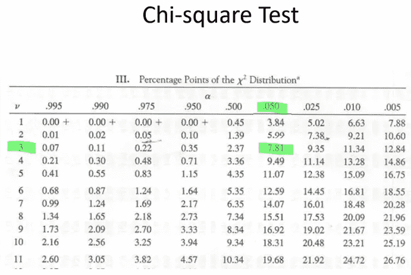

# 详细相关性检验的卡方检验:手动和 Python 实现

> 原文：<https://towardsdatascience.com/chi-square-test-for-correlation-test-in-details-manual-and-python-implementation-472ae5c4b15f>


侯赛因·巴德沙阿在 [Unsplash](https://unsplash.com?utm_source=medium&utm_medium=referral) 上拍摄的照片

## 检查两个变量是否相互独立

相关性测试在统计学和机器学习中非常常见。在统计学中，相关性检验对于理解不同变量对总体的影响很重要。例如，假设我们为七年级学生开发了一门新的数学课程。在我们的数据集中，我们有两组学生。一个群体的父母教育水平是大学水平。另一组学生的父母没有大学学历。我们可能想知道父母是否受过大学教育对学生新的数学课程的成功有任何影响。

在机器学习中，相关性测试可以用于特征选择。在输出变量是分类变量且输入变量也是分类变量的分类问题中，可以使用卡方检验来了解输入变量是否与输出变量相关。

> **本文将集中讨论卡方检验，以确定两个变量之间是否存在相关性。**

我们将通过一个例子一步步地学习这个过程。

首先，我将展示手动完成整个过程的方法，稍后我们将使用 Python。

以下是我们将用来演示如何执行卡方检验的数据:


上表中显示的两个变量来自一个大型数据集。请随意从以下链接下载数据集:

<https://www.kaggle.com/aljarah/xAPI-Edu-Data>  

使用这个数据集的权限就是这里所说的。

有两个栏目:学生的成绩和家长是否回答了调查问题。我们可能想知道回答调查问题的父母是否与成绩有关。让我们看看这两个变量是否相关。

这是列联表:


你可以在这个列联表的每一栏中看到，在“是”和“否”组中，每个年级的数字都有所不同。在这种情况下，卡方检验的目的是了解这些差异是偶然的还是有统计学意义的。

**零假设:两个变量(ParentAnsweringSurvey 和 GradeID)不相关。他们是独立的。**

要开始这个测试，我们需要从计算期望值开始。**期望值是多少？**

期望值是如果零假设为真时所期望的值。

这里我展示了两个期望值的计算，例如:


当“家长回答调查”为“否”时，G-02 的期望值为 74:

e02(否)= (210*147)/480 = 64.31

这里，480 是如上表所示的总计数。

这是另一个例子。当“家长回答调查”为“是”时，G-08 的期望值为 77:

e08(是)= (270*116)/480 = 65.25

这样我们可以计算整个表的期望值。下表显示了每个单元格的预期值:


现在，使用列联表中的原始值和期望值，我们可以计算卡方统计。我们需要计算每个单元格的卡方值，并将它们相加。这里我展示了第一个单元格的 chi2 检验统计量计算:

CH2 _ 02 _ no =(74–64.31)/64.31 = 1.459

同样，您也可以计算其余的单元格。以下是完整的表格:


从上表可以看出，总数是 16.24。因此，我们的 chi2 检验统计值是 16.24。

> 我使用 excel 表来计算期望值和卡方检验统计。

在我们得出结论之前还有几个步骤。

我选择了 0.05 的显著性水平。

自由度是:

(行数-1)*(列数-1)

在列联表中，行数为 2，列数为 10。

所以，自由度是:

(2–1)*(10–1) = 9

使用下面的 chi2 分布表，对于 0.05 的显著性水平和 9 的自由度，我们得到 chi2 临界值 16.92。



因此，我们计算的 chi2 检验统计量(16.24)小于我们从分布中得到的 chi2 临界值。所以，我们没有足够的证据来否定零假设。

基于 chi2 检验，两个变量 **(ParentAnsweringSurvey 和 GradeID)** 不相关。

> 但与此同时，chi2 检验统计量与分布中的 chi2 之间的差异并不大。如果我们选择显著性水平 0.01 或 0.025，结果会有所不同。我们将能够拒绝无效假设。所以，这是一次侥幸脱险。

## Python 实现

这里我用 Python 做了同样的卡方测试。使用编程语言制作列联表和所有计算要容易得多。

首先，我在这里导入数据集。这与我之前提供的链接中的 Kaggle 数据集相同。

```
import pandas as pd
pd.set_option('display.max_columns', 100)edu = pd.read_csv("xAPI-Edu-Data.csv")
```

这些是该数据集中的列:

```
edu.columns
```

输出:

```
Index(['gender', 'NationalITy', 'PlaceofBirth', 'StageID', 'GradeID', 'SectionID', 'Topic', 'Semester', 'Relation', 'raisedhands', 'VisITedResources', 'AnnouncementsView', 'Discussion','ParentAnsweringSurvey', 'ParentschoolSatisfaction', 'StudentAbsenceDays', 'Class'], dtype='object')
```

和前面的例子一样，我将使用同样的两个变量，这样你就可以比较过程和结果。所以，零假设也将和以前一样:

**零假设:两个变量(ParentAnsweringSurvey 和 GradeID)是独立的。没有关联。**

像往常一样，我们需要从制作一个列联表开始:

```
contingency = pd.crosstab(edu['ParentAnsweringSurvey'], edu["GradeID"])
```

这将为您提供完全相同的列联表:


这些是观察到的值。为了计算方便，我想把它们转换成一个数组。如果我只从 DataFrame 中获取值，它会给我一个数组:

```
observed_values = contingency.values
observed_values
```

输出:

```
array([[74, 25,  3, 16, 40, 39,  1,  1,  5,  6],
       [73, 23,  0, 16, 61, 77,  4,  3,  8,  5]], dtype=int64)
```

这些是数组形式的观察值。我们现在需要计算期望值。也就是说，如果零假设为真，这个列联表中的期望值是多少。

这次我不会手动计算期望值。我将使用 Python 的“scipy”库:

```
import scipy.stats as stats
val = stats.chi2_contingency(contingency)
val
```

输出:

```
(16.24174256088471,
 0.06200179555553843,
 9,
 array([[64.3125, 21\.    ,  1.3125, 14\.    , 44.1875, 50.75  ,  2.1875, 1.75  ,  5.6875,  4.8125],
[82.6875, 27\.    ,  1.6875, 18\.    , 56.8125, 65.25  ,  2.8125, 2.25  ,  7.3125,  6.1875]]))
```

输出是一个元组，其中第一个值是卡方统计 16.24。这也正是我们手动计算得到的结果。看，这里我们不需要自己计算卡方统计量。我们已经拿到了！

第二个值 0.062 是 p 值。如果我们认为显著性水平为 0.05，则 p 值大于显著性水平α。因此，我们不能拒绝两个变量( **ParentAnsweringSurvey 和 GradeID** )是独立的零假设。

输出 9 的第三个值是自由度。在前面的部分中，我们也是手动计算的。我们将使用它来找到 chi2 临界值。

我们还可以使用与前面相同的方法，将卡方统计量与卡方分布中的 chi2 临界值进行比较。我们也可以使用 stat 库从分布中找到卡方临界值。

```
alpha=0.05
dof = 9 #degree of freedomcritical_value = chi2.ppf(q = 1-alpha, df = dof)
critical_value
```

输出:

```
16.918977604620448
```

它是 16.92，大于卡方统计。所以，我们不能拒绝零假设。

我们之前在查找预期值时收到的 p 值默认考虑了 0.0.5 的显著性水平。如果考虑不同的显著性水平，可以使用卡方临界值来找出 p 值，如下所示:

```
n_rows = 2
n_cols = 10
dof = (n_rows-1)*(n_cols-1)p_value = 1-chi2.cdf(x=val[0], df = dof)
p_value
```

输出:

```
0.06200179555553864
```

我们得到了相同的 p 值，因为我们使用了显著性水平为 0.05 的卡方值。如果使用不同的显著性水平，p 值将会不同。请你自己试试。

## 结论

在本文中，我试图使用手工计算和 python 来详细解释独立性检验的卡方检验过程。希望对你有帮助！

请随时在[推特](https://twitter.com/rashida048)、[脸书页面](https://www.facebook.com/Regenerative-149425692134498)上关注我，并查看我的新 [YouTube 频道](https://www.youtube.com/channel/UCzJgOvsJJPCXWytXWuVSeXw)。

## 更多阅读

</understanding-regularization-in-plain-language-l1-and-l2-regularization-2991b9c54e9a>  </a-complete-guide-to-confidence-interval-and-examples-in-python-ff417c5cb593>  <https://pub.towardsai.net/data-analysis-91a38207c92b>  </what-is-a-recurrent-neural-network-and-implementation-of-simplernn-gru-and-lstm-models-in-keras-f7247e97c405>  </30-very-useful-pandas-functions-for-everyday-data-analysis-tasks-f1eae16409af>  </exploratory-data-analysis-with-some-cool-visualizations-in-pythons-matplotlib-and-seaborn-library-99dde20d98bf> 