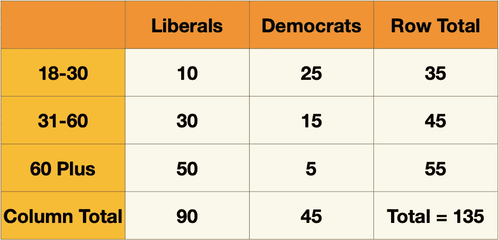
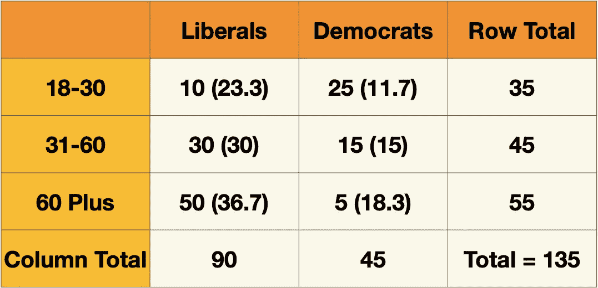

# 独立性卡方检验

> 原文：<https://towardsdatascience.com/chi-square-test-of-independence-154b49b7498f>

## 独立性卡方检验的简明解释

照片由 [Tra Nguyen](https://unsplash.com/@thutra0803?utm_source=medium&utm_medium=referral) 在 [Unsplash](https://unsplash.com?utm_source=medium&utm_medium=referral) 上拍摄

# 介绍

到目前为止，我们已经介绍了**卡方分布**，并用它来解释**卡方拟合优度测试**。你可以在这里查阅这两篇文章:

    

> 我强烈推荐在这篇文章之前阅读那些文章！

在本帖中，我们将介绍另一个著名的卡方检验**独立性检验**。该测试确定两个分类变量**是否以某种方式**相关，例如，它们是独立的还是相关的。你可以把这看作是两个连续变量之间相关性的**分类版本。**

在本文中，我们将介绍独立性测试的执行过程，并以一个示例问题结束，展示如何在实践中实施它！

# 假设

*   两个变量都是**分类的**
*   观察是独立的
*   **每个类别的**计数**大于 5**
*   **类别中的每个计数都**互斥****
*   **数据是随机选择的**

# ****假设检验步骤****

****在这里，我们将规划几乎每个假设检验中涉及的基本步骤:****

*   ****陈述了[空、 ***H_0*** 和候补、 ***H_1*** 的假设。](https://support.minitab.com/en-us/minitab-express/1/help-and-how-to/basic-statistics/inference/supporting-topics/basics/what-is-a-hypothesis-test/)****
*   ****确定你的 [**显著性水平**](https://en.wikipedia.org/wiki/Statistical_hypothesis_testing) 并为你的分布计算相应的 [**临界值**](https://support.minitab.com/en-us/minitab-express/1/help-and-how-to/basic-statistics/inference/supporting-topics/basics/what-is-a-critical-value/) **(或临界概率)**。****
*   ****为您的测试计算 [**测试统计量**](https://en.wikipedia.org/wiki/Test_statistic) ，在我们的例子中，这将是卡方统计量。****
*   ****将检验统计量(或 [**P 值**](https://www.investopedia.com/terms/p/p-value.asp) )与临界值进行比较，以**拒绝或未能拒绝零假设。******

****这些是任何假设检验的基本表层步骤。我没有详细解释每个主题，因为那样会使这篇文章非常详尽！然而，对于不熟悉的读者，我为每个步骤都提供了链接站点，这样你就可以更深入地了解这些想法。****

****我还有其他一些帖子，以更详细的形式介绍了假设检验的概念，你可以在这里查看:****

****    

# 卡方检验统计和自由度

对于[卡方检验](https://www.statisticshowto.com/probability-and-statistics/chi-square/)，我们需要计算的检验统计量为:

作者在 LaTeX 中生成的方程。

*   ***v*** [是自由度](https://en.wikipedia.org/wiki/Degrees_of_freedom_(statistics))
*   ***O*** 是观测采样值
*   ***E*** 是计算出的期望值
*   ***n*** 是变量中的类别数

> 注意:卡方分布来自于分子的平方，这也确保了我们只有正数“添加”到统计数据中。

自由度 ***v*** 计算如下:

作者在 LaTeX 中生成的方程。

*   ***r*** 是[列联表](https://www.statistics.com/glossary/contingency-table/)中的行数(变量 1 中的类别数)
*   ***c*** 是[列联表](https://www.statistics.com/glossary/contingency-table/)中的列数(变量 2 中的类别数)

当我们接下来看一个例题时，这两个公式会更有意义。

# 示例问题

我们想看看年龄对你投哪个政党的票有没有影响。

## 数据

我们收集了 135 人的随机样本，并将其显示在以下按年龄和政党细分的权变表中:

由作者创建的表。

> 注:这纯粹是我自己编造的合成数据，与任何真正的政党无关。

## 假设

让我们从陈述我们的假设开始:

*   ***H_0*** :年龄对你投的政党没有影响。这两个变量是**独立的。**
*   ***H_1*** :年龄确实对政党有影响。这两个变量是**相关的。**

## 显著性水平和临界值

在本例中，我们将使用 **5%的显著性水平**。因为我们有 **2 个自由度**(使用上面的公式):

作者在 LaTeX 中生成的方程。

使用显著性水平、自由度和[卡方概率表](https://people.richland.edu/james/lecture/m170/tbl-chi.html)，我们发现我们的临界值为 **5.991。**这意味着我们的卡方统计需要大于 **5.991** ，以便我们拒绝零假设和变量不独立。

## 计算预期计数

我们现在需要确定列联表中每个单元的预期计数频率。如果零假设为真，这些是预期值，使用以下公式计算:

作者在 LaTeX 中生成的方程。

其中 ***n_r*** 和 ***n_c*** 是特定类别的行和列的总数， ***n_T*** 是总计数。

例如，18-30 岁投票给自由党的预期人数是:

作者在 LaTeX 中生成的方程。

然后，我们可以用这些期望值(在括号中)填充列联表:

作者制作的表格。

## 卡方统计

现在是使用上述公式计算卡方统计的时候了:

作者在 LaTeX 中生成的方程。

这等于 **37.2！**

因此，我们的统计量远大于临界值，所以我们可以拒绝零假设！

# 结论

在本文中，我们描述并展示了一个独立性卡方检验的例子。该测试测量两个分类变量是否相互依赖。这在数据科学中用于特征选择，我们只需要对对目标有影响的特征建模。

# 和我联系！

*   要在媒体上阅读无限的故事，请务必在这里注册！ 💜
*   [*在我发布注册邮件通知时获取更新！*T3*😀*](/subscribe/@egorhowell)
*   [*领英*](https://www.linkedin.com/in/egor-howell-092a721b3/) 👔
*   [*推特*](https://twitter.com/EgorHowell) 🖊
*   [*github*](https://github.com/egorhowell)*🖥*
*   ***🏅***

> ***(所有表情符号由 [OpenMoji](https://openmoji.org/) 设计——开源表情符号和图标项目。许可证: [CC BY-SA 4.0](https://creativecommons.org/licenses/by-sa/4.0/#)*******