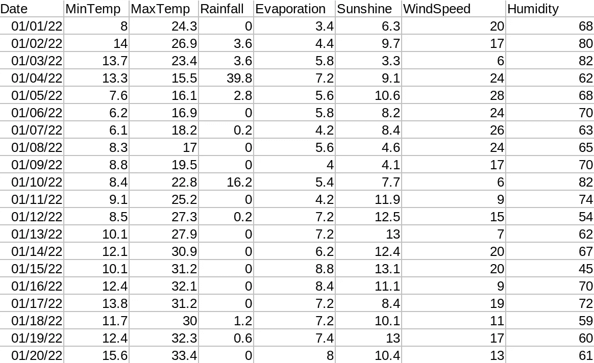

# 为您的数据选择最佳 ML 时间序列模型

> 原文：<https://towardsdatascience.com/choosing-the-best-ml-time-series-model-for-your-data-664a7062f418>

## 随着每年的新发展，决定合适的模型变得越来越具有挑战性

克里斯·利维拉尼在 [Unsplash](https://unsplash.com?utm_source=medium&utm_medium=referral) 上的照片

ARIMA、先知、LSTMs、CNN、GPVAR、季节分解、DeepAR 等等。当谈到时间序列模型时，有太多的方法，这意味着在提交模型之前考虑您的选择是很重要的。

关于开始改进模型，需要做出两个关键决定:是局部的还是全局的，以及预测是单变量的还是多变量的。为了解释这些，让我们介绍一个来自 Kaggle 的经过修改的[样本天气数据集](https://www.kaggle.com/datasets/zaraavagyan/weathercsv?resource=download):

[天气数据(](https://www.kaggle.com/datasets/zaraavagyan/weathercsv?resource=download) [CC0:公共域](https://creativecommons.org/publicdomain/zero/1.0/) [)](https://www.kaggle.com/datasets/zaraavagyan/weathercsv?resource=download)

[一个**局部**模型](https://arxiv.org/abs/2202.02262)(有时也称为迭代或传统模型)只使用一个*单一数据列*的先验值来预测未来值。由于局部模型仅依赖于单个数据列，因此它们也必须是单变量的，或者我们预测的是单个变量随时间的变化。在本例中，一个局部单变量模型将使用第 1-20 天的最高温度来预测第 21 天的最高温度。

相比之下，[一个**全局**模型](https://business-science.github.io/modeltime/articles/modeling-panel-data.html)使用许多数据列来预测未来值，通常是与时间无关的变量。有两种类型的全局模型:全局单变量模型，其中我们使用许多值来预测单个值；全局多变量模型，其中我们使用许多值来预测许多值。**全局单变量**模型将使用最高温度、蒸发量和湿度来预测未来的最高温度值。全局多变量模型将利用最高温度、蒸发量和湿度来预测最高温度、蒸发量和湿度的未来值。

# 局部单变量模型

## 局部单变量模型最适合这些用例:

1.  你的数据微不足道

如果您的数据简单、单变量且易于预测，那么时间序列预测的经典方法可能是最好的。为什么？它可以立即被训练，需要很少的计算资源，并且更复杂的模型可能是多余的，并且使你的数据过拟合。这方面的一个例子可能是预测某个商品在商店中的销售量。

2.你需要准确的预测，但只有一个变量

如果你只有 1 个可用的变量，[迭代预测](https://business-science.github.io/modeltime/articles/modeling-panel-data.html)/集成局部模型已经一次又一次地证明，由于它们能够消除任何一个特定模型的缺点和弱点，它们可以比许多 ML 模型更准确地预测数据，因此，尽管训练可能相对昂贵，但它仍然是时间序列预测最流行的方法之一。[一个流行的例子是利用过去的数据预测股票市场。](https://medium.com/p/f7b4d6f3bb2)(如果你有兴趣这么做，这里的是你可以获取数据的地方)

3.可预测季节性的模型

如果您知道您的数据遵循可预测的季节模式，当您对自己的“季节”有信心时，许多时间序列(如 SARIMA(季节性自回归移动平均))就可以用来处理数据。这方面的一个例子可能是 web 流量，在这种情况下，您知道数据每天都遵循一种规律。在这种情况下，您可以定义一个具有每日季节性的模型。

**局部单变量模型示例(从最简单到最复杂——带有简要解释和更深入阅读的链接)**

移动平均——最简单的方法，可以用一行熊猫计算

[指数平滑/霍尔特-温特斯](https://timeseriesreasoning.com/contents/holt-winters-exponential-smoothing/) —指数平滑使用所有先前值的加权平均值来预测值，其中最近值的权重较高。在 Holt-Winters 中，季节性和趋势作为参数被纳入方程

[ARIMA/萨里玛/自动 ARIMA](/time-series-forecasting-with-arima-sarima-and-sarimax-ee61099e78f6) —在它的基础上，它是一个移动平均加上一个自回归项的导数([使用带有噪声的过去值](https://en.wikipedia.org/wiki/Autoregressive_model))，以便预测未来值。SARIMA 考虑到了季节性，而[自动 ARIMA](https://github.com/alkaline-ml/pmdarima) 将进行搜索，尝试找到最佳的模型参数

[Prophet](https://research.facebook.com/blog/2017/2/prophet-forecasting-at-scale/) —由脸书开发，自开源以来，Prophet 是一个回归模型，它结合了线性或逻辑增长趋势、季节性组件和变点检测。关于 Prophet 的一个很酷的事情是它能够分离出这些趋势并为你绘制出来！

[https://research . Facebook . com/blog/2017/2/prophet-forecasting-at-scale/](https://research.facebook.com/blog/2017/2/prophet-forecasting-at-scale/)

[迭代预测](https://business-science.github.io/modeltime/articles/modeling-panel-data.html#traditional-modeling-iteration) —迭代预测是简单地结合使用许多上述模型来创建预测！

# 全局单变量模型

## 全局单变量模型最适合这些用例:

1.  你有许多补充变量，并希望预测未来的一个奇异值。这方面的一个例子可能是温度预测，就像我们的玩具例子一样，使用湿度、风速、季节等变量来预测每天的温度。
2.  你不知道你的模型的季节性或趋势——ML 模型的一个好处是，从设计上讲，它们能够检测数据中观察者不能立即看到的模式。这方面的一个例子可能是预测[硬件故障](https://www.ncbi.nlm.nih.gov/pmc/articles/PMC7887121/)。虽然人类可能很难诊断哪些变量可能会将硬件置于风险之中，但这些全球时间序列模型要成功得多
3.  你需要在单个模型中训练许多时间序列——对于许多深度学习实现，模型可以同时学习许多时间序列模型。回到我们的温度示例，如果我们有来自多个区域的数据，我们可以训练单个 ML 模型来预测任何单个区域，甚至学习区域之间的模式！

**全球单变量模型示例(从最简单到最复杂——带有简要解释和更深入阅读的链接)**

[SARIMAX](/time-series-forecasting-with-arima-sarima-and-sarimax-ee61099e78f6) — SARMAX 就是 SARIMA(前面讨论过的),它考虑了外部变量，使时间序列能够更快地适应不断变化的变量

[基于树的方法](https://www.sciencedirect.com/science/article/pii/S0169207021001679#b37)——几乎每个问题都可以用树来解决，而且时间序列也没有太大的不同。如果数据是稀疏的、准确的，并且与深度方法(下面讨论)相比训练起来相对较快，那么它们往往是有利的。当前最流行的实现是 [lightgbm](https://pypi.org/project/lightgbm/) 和 [xgboost](https://www.kaggle.com/code/robikscube/tutorial-time-series-forecasting-with-xgboost)

基于 MLP 的方法——使用经典的全连接神经网络进行预测产生了一些非常奇妙的结果，甚至赢得了国际比赛。当前最流行的实现是 [N-BEATS](https://ts.gluon.ai/stable/api/gluonts/gluonts.model.n_beats.html) 和 [GP 预测器](https://ts.gluon.ai/stable/api/gluonts/gluonts.model.gp_forecaster.html)，它混合了 MLP 和[高斯嵌入](https://openreview.net/forum?id=HJ7O61Yxe)，或基于密度的分布

基于 CNN 的方法— [卷积神经网络类似于 MLPs](https://medium.com/data-science-bootcamp/multilayer-perceptron-mlp-vs-convolutional-neural-network-in-deep-learning-c890f487a8f1) 除了它们不是完全连接的。CNN 被广泛使用，因为它们往往更小，更少浪费，更容易训练。不幸的是，实现很少，但是有许多学术文章详细介绍了它们是如何工作的

基于 RNN/LSTM 的方法——目前研究人员的“最先进”方法，RNN 是相互“循环”的神经网络。这种方法如此有效的原因是，它允许后续数据点“记住”之前几个点已经处理过的内容，从而允许更动态的预测，因为时间序列自然依赖于之前的值。[lstm](https://colah.github.io/posts/2015-08-Understanding-LSTMs/)是一种更具体和更流行的 RNN，代表“长期短期记忆”。这种方法的一个缺点是，因为它非常依赖以前的数据点，所以用 RNNs 进行的长期预测往往不如其他一些方法可靠。RNN 方法非常流行，一些更先进的实现是 [DeepAR](https://ts.gluon.ai/stable/api/gluonts/gluonts.model.deepar.html) 、 [DeepState](https://ts.gluon.ai/stable/api/gluonts/gluonts.model.deepstate.html) 和 [DeepFactor](https://ts.gluon.ai/stable/api/gluonts/gluonts.model.deep_factor.html) 。

# 全局多元模型

## 全局多元模型最适合这些用例:

1.  你有许多补充变量，并希望预测未来的许多或所有值。回到我们的温度示例，我们将使用温度、湿度、风速、季节等变量，并为这些变量中的许多或全部生成未来*预测。*
2.  如上所述，如果您不知道模型的季节性或趋势，全局多元模型也很好
3.  您需要为许多不同的变量训练许多时间序列，所有这些都有效地包装到单个模型中—例如，回到我们的温度示例，如果我们有来自多个区域的数据，我们可以训练单个 ML 模型，该模型可以预测来自任何区域的任何变量！

**全局多元模型的例子**

基于 RNN/LSTM 的方法——几乎每一个全球多变量实施都是 RNN/LSTM 模型的某种变体，彼此之间有微小的差异，其中一些甚至是从其单变量版本改编而来，以预测任何和所有变量。流行的实现有[DeepVAR](https://ts.gluon.ai/stable/api/gluonts/gluonts.model.deepvar.html)(DeepAR 的一个变种) [GPVAR](https://ts.gluon.ai/stable/api/gluonts/gluonts.model.gpvar.html) ，将高斯过程融入 RNNs，以及 [LSTNet](https://ts.gluon.ai/stable/api/gluonts/gluonts.model.lstnet.html) ，一个 LSTM 变种。

**结论**

上面列出的每个模型都有其优点、优点和缺点。我希望这篇文章为您开始时间序列之旅提供了一个有用的指南，因为选项可能会非常多。

如果你觉得指南有用，如果你认为你需要回来参考，一定要保存/书签的故事！如果你喜欢这篇文章，请随意[关注我](https://jerdibattista.medium.com/)，阅读我写的更多内容，或者将我[作为推荐人](https://jerdibattista.medium.com/membership)，这样我就可以继续制作我喜欢的内容。我在数据科学/ML 空间写了很多！

    

[数据集许可为 CC0 1.0 通用公共领域](https://creativecommons.org/publicdomain/zero/1.0/)